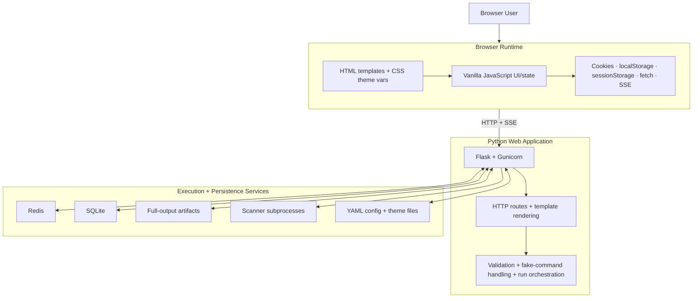
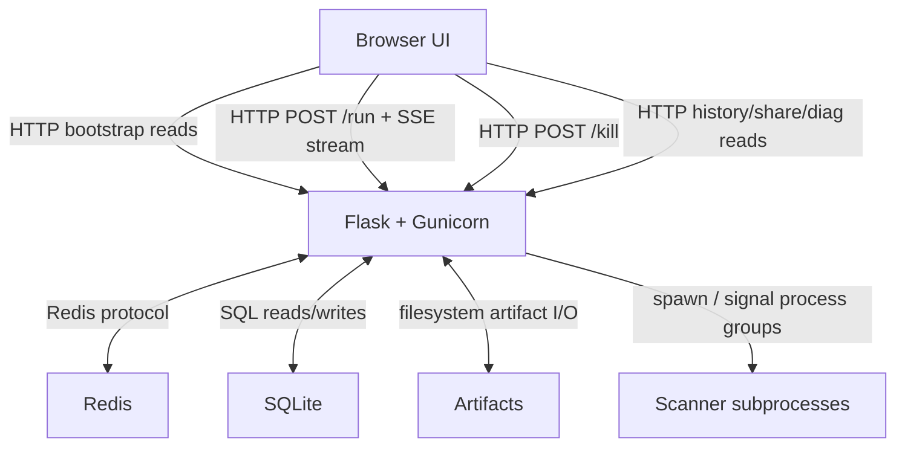
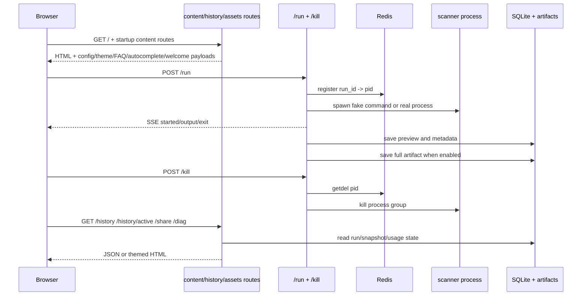
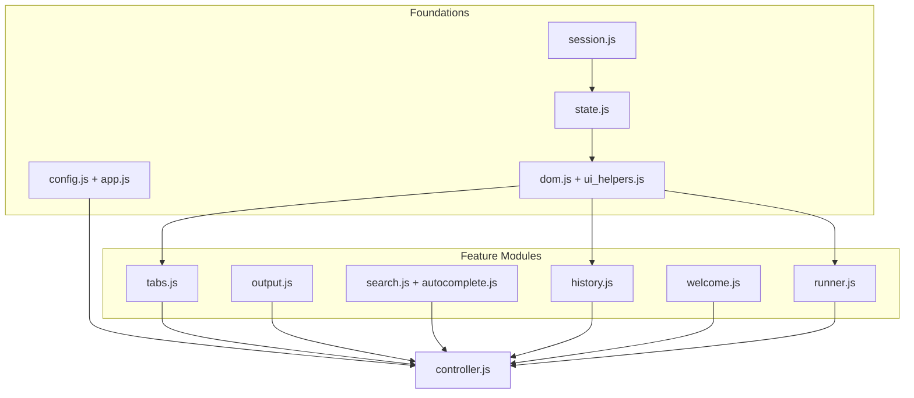
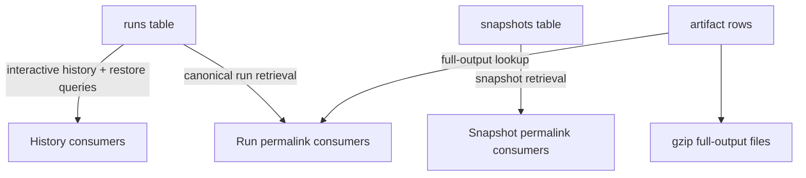

# Architecture

This document describes the current system architecture of darklab shell: runtime boundaries, request flow, browser/runtime composition, persistence, observability, testing shape, and production deployment model.

For the architectural rationale, tradeoffs, and implementation-history notes behind those structures, see [DECISIONS.md](DECISIONS.md).

---

## Table of Contents

- [System Overview](#system-overview)
- [System Structure](#system-structure)
- [Primary Request Flows](#primary-request-flows)
- [HTTP Route Inventory](#http-route-inventory)
- [Front-end Architecture](#front-end-architecture)
- [Back-end Architecture](#back-end-architecture)
- [Run Lifecycle](#run-lifecycle)
- [State And Persistence](#state-and-persistence)
- [Observability And Diagnostics](#observability-and-diagnostics)
- [Security Model](#security-model)
- [Configuration Surfaces](#configuration-surfaces)
- [Test Suite](#test-suite)
- [Production Deployment Notes](#production-deployment-notes)
- [Related Docs](#related-docs)

---

## System Overview

darklab shell is a web-based shell for running network diagnostic and vulnerability scanning commands against remote endpoints. Flask + Gunicorn backend, single-file HTML frontend, SQLite persistence, and real-time SSE streaming.

At a high level, it works like this:

- A browser-based terminal UI loads a Flask-rendered shell page, then hydrates itself from focused read routes such as `/config`, `/themes`, `/faq`, `/autocomplete`, and `/welcome*`.
- Command execution flows through `POST /run`, which validates and rewrites commands, resolves any app-native fake commands, starts an isolated scanner subprocess when needed, and streams output back over SSE.
- `Redis` provides the shared state that must work correctly across multiple Gunicorn workers: rate limiting and active run PID tracking for `/kill`.
- `SQLite` persists completed run metadata, preview output, snapshots, and full-output artifact metadata so history, canonical run permalinks, and snapshot permalinks survive restarts.
- The browser client stays build-step-free. Classic scripts share one global runtime, while browser cookies and storage cover user preferences, session identity, and reload continuity.
- The Docker runtime enforces a two-user model: Gunicorn runs as `appuser`, while user-submitted commands run as `scanner`.

The rest of this document is organized by concern rather than by historical file order: stable system structure first, then browser/backend composition, then the core runtime stories such as run lifecycle, state, observability, and security.

---

## System Structure

This cluster groups the stable structural views of the application before the document dives into request flow, browser runtime behavior, or persistence details.

### Logical Runtime Layers



This diagram is intentionally framework- and runtime-oriented rather than app-module-oriented. It is meant to answer the “which layer owns which responsibility?” question without duplicating the more detailed app diagrams later in the document.

- the browser runtime owns rendering, local interaction state, and web-platform APIs such as cookies, `localStorage`, `sessionStorage`, `fetch`, and SSE consumption
- the Python web application owns routing, template rendering, config/theme loading, request validation, fake-command handling, and orchestration of real command execution
- Redis owns the cross-worker coordination that cannot safely live inside one Gunicorn worker process
- SQLite and artifact files own the durable run/share state that must survive reloads and restarts
- scanner subprocesses are a distinct execution boundary rather than an in-process extension of the Flask app
- YAML config and theme files are shown as a separate logical dependency because they shape both backend behavior and frontend presentation, even though they are loaded from the local filesystem rather than over the network

The goal is for this section to stay stable even when app-specific modules, blueprints, or frontend files are refactored. The more detailed sections below cover those app-level components directly.

### Runtime Topology



This is the transport/boundary view of the app. It focuses on the stable communication paths rather than the internal modules that implement them.

- browser traffic is plain HTTP plus one-way SSE streaming for live command output
- Redis is only used for shared worker coordination, not as a general application datastore
- SQLite and artifact files are the durable history/share boundary
- command execution remains out-of-process, which keeps the Flask worker lifecycle separate from tool execution

---

## Primary Request Flows



There are three core request classes:

- content/bootstrap reads
- run/kill lifecycle
- history/share/diagnostic reads

`/history/active` is part of that third class. It exposes only the current session's in-flight run metadata so the browser can rebuild running tabs after a reload, keep kill available, render the submitted command as a normal prompt line, and then hand those tabs back to the normal `/history/<run_id>` restore path once the run completes. Non-running tabs and drafts are restored separately from browser `sessionStorage`, which keeps the reload path split cleanly between browser-owned idle state and server-owned active-run state.

That split is reflected directly in the blueprint structure.

---

## HTTP Route Inventory

This route list belongs in the architecture document because it describes the application surface that contributors maintain, not the operator workflow.

| Method | Endpoint | Description |
| -------- | ---------- | ------------- |
| `GET` | `/` | Serves the Flask-rendered shell UI and theme bootstrap |
| `GET` | `/favicon.ico` | Serves the site favicon |
| `GET` | `/config` | Returns browser-facing runtime config as JSON |
| `GET` | `/allowed-commands` | Returns the current allowlist as JSON |
| `GET` | `/autocomplete` | Returns structured command-context autocomplete data as JSON |
| `GET` | `/faq` | Returns the canonical FAQ dataset as JSON: built-in entries plus any custom `faq.yaml` items |
| `GET` | `/welcome` | Returns welcome command samples from `welcome.yaml` as JSON |
| `GET` | `/welcome/ascii` | Returns the desktop welcome ASCII banner from `ascii.txt` as plain text |
| `GET` | `/welcome/ascii-mobile` | Returns the mobile welcome banner from `ascii_mobile.txt` as plain text |
| `GET` | `/welcome/hints` | Returns rotating desktop welcome footer hints from `app_hints.txt` as JSON |
| `GET` | `/welcome/hints-mobile` | Returns rotating mobile welcome footer hints from `app_hints_mobile.txt` as JSON |
| `GET` | `/session/token/generate` | Generates a new persistent `tok_...` session token |
| `GET` | `/session/token/info` | Returns the current named token plus creation timestamp, or `null` fields for anonymous sessions |
| `POST` | `/session/token/verify` | Checks whether a supplied `tok_...` token was issued by this server |
| `POST` | `/session/token/revoke` | Revokes a named token so future `tok_...` headers are treated as anonymous |
| `POST` | `/session/migrate` | Migrates runs, snapshots, and starred commands from one session ID to another |
| `GET` | `/session/starred` | Returns the current session's starred command list |
| `POST` | `/session/starred` | Adds one command to the current session's starred list |
| `DELETE` | `/session/starred` | Removes one command, or clears the whole starred list, for the current session |
| `GET` | `/history` | Returns the most recent completed runs for the current session as JSON |
| `GET` | `/history/active` | Returns active-run metadata for the current session so reload can rebuild in-flight tabs |
| `GET` | `/history/<run_id>` | Styled HTML permalink page for a single run; serves full output when a persisted artifact exists (`?json` for raw JSON) |
| `GET` | `/history/<run_id>/full` | Backward-compatible alias for `/history/<run_id>` (`?json` for raw JSON) |
| `GET` | `/share/<share_id>` | Styled HTML permalink page for a full tab snapshot (`?json` for raw JSON) |
| `POST` | `/run` | Validates, rewrites, executes, and streams a command over SSE |
| `POST` | `/kill` | Kills a running process by `run_id` |
| `POST` | `/share` | Saves a tab snapshot and returns a permalink URL |
| `GET` | `/health` | Returns `{"status": "ok", "db": true, "redis": true\|false\|null}`; `redis` is `null` when Redis is not configured |
| `GET` | `/status` | Returns `{uptime, db, redis, server_time}` for the desktop HUD pill row; always responds 200 even when a component is degraded so HUD polling never flaps the UI |
| `GET` | `/diag` | IP-gated operator diagnostics page or JSON summary; 404 unless the resolved client IP is in `diagnostics_allowed_cidrs` |

---

## Front-end Architecture

This section is the browser-runtime home for page composition, prompt/composer state, mobile shell behavior, and the helper layer that keeps the classic-script UI consistent.

### Frontend Composition



This is still a classic-script frontend, not an ES-module app. The architecture relies on a deliberate load order:

- `state.js` owns shared state
- `ui_helpers.js` owns DOM-facing setters/getters
- domain scripts own tab/output/search/history/welcome/runner logic
- `config.js` and `app.js` handle bootstrap concerns, while `controller.js` is the composition root and last loader

Prompt ownership lives in `composerState`, not in whichever DOM input happened to update last.

The options modal is part of that same browser-owned layer. It does not change backend config; it only persists per-browser UX preferences in cookies and feeds them back into the classic-script runtime during boot. That is why timestamp/line-number quick toggles, welcome-intro behavior, and snapshot redaction defaults all sit in the frontend layer rather than in `config.yaml`.

### Browser Runtime

Modular frontend with no build step. `index.html` is the HTML shell — no inline styles or scripts.

**CSS composition.** CSS is split across ordered static files under `static/css/`, with `styles.css` acting as the compatibility entrypoint that imports `base.css`, `shell.css`, `components.css`, `welcome.css`, `shell-chrome.css`, and `mobile.css`.

**Desktop shell chrome.** `shell-chrome.css` and its companion `static/js/shell_chrome.js` own the left rail (app title, recent commands, workflows, history, options, theme, FAQ, diag, version footer), the tabbar row, and the bottom HUD bar (eleven live status pills — STATUS, LAST EXIT, RUNS, TRANSPORT, LATENCY, MODE, SESSION, UPTIME, CLOCK, DB, REDIS — plus the `share snapshot / copy / save ▾ / clear` actions and the kill button).

**HUD runtime.** Polls `GET /status` every 15 seconds, measures round-trip latency client-side via `performance.now()`, interpolates server uptime locally between polls, and ticks a UTC wall clock once per second. The `SESSION` pill reflects the active session identity and updates via a `storage` event listener so cross-tab token switches are picked up without a reload. `LAST EXIT` is updated from `runner.js` on every SSE `exit` event and on kill through the `setHudLastExit(code)` global.

**Mobile chrome.** The original top header, recent-command chip row, and per-tab footer action row are hidden on both desktop and mobile by `shell-chrome.css` / `mobile-chrome.css`, but remain in the DOM because parts of the classic tab and composer DOM are still re-parented into the mobile shell through `syncMobileShellLayout()`. The mobile chrome (tabs, header, transcript framing, recents peek + pull-up sheet, bottom-sheet menu, and the keyboard edit-helper row) is composed through `mobile-chrome.css` and its companion `mobile_chrome.js`.

**Page exceptions.** The permalink and diag pages are explicitly scoped out of the desktop header hide so their own `<header class="export-header">` still renders. The diagnostics page (`/diag`) uses a separate `diag.css` rather than inline styles; it also links `terminal_export.css` to share the same header chrome foundation (`export-header`, `export-header-copy` classes) used by permalink pages. The mobile chrome on `/diag` (back button, header layout) activates at `@media (max-width: 900px) and (pointer: coarse)` — matching the same width + touch criteria used by the shell's `useMobileTerminalViewportMode()` — while layout-only changes (grid collapse, column widths) continue at `max-width: 760px` for all device types.

**JS composition.** Logic is split across `static/js/` into focused modules loaded via plain `<script src="...">` tags. Load order matters: the shared store lives in `state.js`, DOM-facing helpers live in `ui_helpers.js`, `app.js` provides shared browser helpers, and `controller.js` loads last to perform the initialization and event wiring. No bundler, no transpilation.

Within that non-module shell, repeated tab/history/FAQ-limit surfaces are built with direct DOM node creation instead of stitched HTML strings, and the template’s modal chrome uses class-based wrappers for hidden state and dialog layout. That keeps the render paths more maintainable without changing the page composition model.

External dependencies: local vendor routes serving committed builds of `ansi_up` and `jspdf` from `app/static/js/vendor/`, and committed font files from `app/static/fonts/`. Both JS libraries are tracked in `package.json` under `dependencies`. `scripts/build_vendor.mjs` generates `app/static/js/vendor/ansi_up.js` (an IIFE-wrapped browser global, because `ansi_up` v6 is ESM-only) and `app/static/js/vendor/jspdf.umd.min.js` (copied directly from the npm UMD build). The generated files are committed so local development and docker-compose runs never need an explicit build step. Run `npm run vendor:sync` to regenerate after a version bump; `npm run vendor:check` verifies the committed files in `app/static/js/vendor/` match what `build_vendor.mjs` would produce from the current `node_modules/` packages. Fonts are committed to `app/static/fonts/` and served through `/vendor/fonts/`.

**JS module load order:** `session.js` → `state.js` → `utils.js` → `config.js` → `dom.js` → `ui_helpers.js` → `ui_pressable.js` → `ui_disclosure.js` → `ui_dismissible.js` → `ui_outside_click.js` → `export_pdf.js` → `tabs.js` → `output.js` → `search.js` → `autocomplete.js` → `history.js` → `welcome.js` → `runner.js` → `app.js` → `mobile_sheet.js` → `controller.js` → `shell_chrome.js` → `mobile_chrome.js`. `state.js` owns the shared store boundary, `ui_helpers.js` owns DOM-facing setters/getters and visibility helpers, the four `ui_*` helper modules form the shared UI interaction layer (see **UI Interaction Helpers** below), `app.js` still provides reusable browser helpers, `controller.js` owns the composition root, and `shell_chrome.js` / `mobile_chrome.js` load last so their rail, tabbar, HUD, and mobile-sheet wiring can attach after all tab, search, and action helpers are defined. `welcome.js` must precede `runner.js` because `runner.js` calls `cancelWelcome()` at the top of `runCommand()`.

**UI Interaction Helpers.** A five-helper family in `static/js/ui_helpers.js` + four sibling `ui_*.js` modules is the single contract for chrome-surface interaction. Every module loads before the domain scripts that consume it, so every downstream module sees the helpers as plain globals — no wiring glue at call sites.

- `refocusComposerAfterAction({ preventScroll = true, defer = false })` in `ui_helpers.js` is the canonical post-action composer refocus. Handles mobile-skip, `preventScroll` default, and `getVisibleComposerInput()` target resolution in one place. `defer: true` preserves legacy `setTimeout(0)` semantics for chrome-close paths that need a pending blur to finish first. 46+ call sites across `controller.js`, `app.js`, `tabs.js`, `runner.js`, `welcome.js`, `autocomplete.js`, `shell_chrome.js`, and `history.js` route through it.
- `focusElement(el, { preventScroll })` and `blurActiveElement()` in `ui_helpers.js` are the canonical wrappers for raw DOM focus/blur. `focusElement` collapses the `try { el.focus({ preventScroll: true }) } catch (_) { el.focus() }` pattern, null-guards non-focusable targets, and returns a bool; `blurActiveElement` blurs `document.activeElement` if it is blurrable. Only two direct focus/blur calls remain outside helper internals: the clipboard `execCommand('copy')` fallback in `utils.js` and the helper-internal blur in `ui_pressable.js`.
- `bindPressable(el, { onActivate, refocusComposer, preventFocusTheft, preventScroll, defer, clearPressStyle })` in `ui_pressable.js` is the single contract for press-to-activate surfaces. Click + `Enter`/`Space` activation (keyboard only on non-`<button>` elements so native buttons don't double-fire), post-activation blur + canonical composer refocus (opt-out via `refocusComposer: false`), `preventFocusTheft` on primary-contact pointerdown, and `clearPressStyle` double-`requestAnimationFrame` for `role="button"` divs whose sticky `:hover`/`:active` residue doesn't clear on blur. Idempotent via `data-pressable-bound`.
- `bindDisclosure(trigger, { panel, openClass, hiddenClass, initialOpen, onToggle, stopPropagation, ...pressableOpts })` in `ui_disclosure.js` composes `bindPressable` for the trigger and owns `aria-expanded` sync + panel class lifecycle + `onToggle` emission. Returns an imperative handle (`isOpen / open / close / toggle`). `panel: null` lets the caller own visibility (used by rail section headers where `applySectionsState()` is the sole writer of `.closed`). Idempotent via `data-disclosure-bound`.
- `bindDismissible(el, { level, isOpen, onClose, closeButtons, closeOnBackdrop, backdropEl })` in `ui_dismissible.js` owns scrim-backed modal/sheet dismissal and registers the surface with a shared level-priority dispatcher. `closeTopmostDismissible()` collapses the Escape cascade: priority `modal > sheet > panel`, within-level most-recent-open wins, returns `true` if it closed something so the keydown handler can `preventDefault`. Backdrop semantics: default `e.target === el`; sheets with a detached scrim pass `backdropEl: <scrim>`; `closeOnBackdrop: false` disables (used by the history panel, which is a side panel rather than a modal). Composes `bindPressable` for each close button and idempotent via `data-dismissible-bound`.
- `bindOutsideClickClose(panel, { triggers, isOpen, onClose, exemptSelectors, scope })` in `ui_outside_click.js` owns ambient document-level (or scope-overridden) outside-click dismissal for unbacked panels. Companion to `bindDismissible`: `bindDismissible` owns backed surfaces, `bindOutsideClickClose` owns menus whose trigger sits outside the surface. Encodes the trigger-exemption contract (clicks on registered `triggers` are treated as "inside" via `.contains()`, replacing hand-rolled `e.stopPropagation()` patterns), `exemptSelectors` ancestor-based exemption via `.closest()`, `panel: null` for sibling-set cases (multiple peer dropdowns on a shared parent), and `scope` override for per-sheet listeners.

The contract the helpers jointly enforce: focus returns to the composer after non-text chrome actions; pressed/highlight state clears after activation; `Enter`/`Space` activate pressables consistently; disclosures keep `aria-expanded` and visual state in sync; scrim overlays close consistently via button, backdrop, and `Escape` with a shared priority dispatcher; ambient-click menus close on any outside click but not on clicks inside the panel or trigger. Each helper has its own Vitest unit suite (`ui_focus_helpers.test.js`, `ui_pressable.test.js`, `ui_disclosure.test.js`, `ui_dismissible.test.js`, `ui_outside_click.test.js`). End-to-end verification against real mounted surfaces lives in `tests/js/e2e/interaction-contract.spec.js`.

**Why not ES modules (`type="module"`)?** ES modules are deferred by default and each runs in its own scope, which would require explicit `export`/`import` everywhere. The plain script approach shares a single global scope — simpler and sufficient for this scale.

**Export rendering module (`export_html.js`).** All HTML export rendering is centralized in `window.ExportHtmlUtils`, which is loaded via a Flask route (`/static/js/export_html.js`) and exposes: `buildExportLinesHtml` (converts raw line objects to styled HTML spans, respecting `tsMode`/`lnMode` prefix state), `buildTerminalExportStyles` (produces the full inline CSS block with theme variables), `buildTerminalExportHtml` (assembles the complete standalone HTML document), `fetchVendorFontFacesCss` (fetches and base64-encodes fonts for self-contained export files), and `fetchTerminalExportCss` (fetches `terminal_export.css` with module-level caching so the shared export stylesheet is embedded in every exported document). All save surfaces — `exportTabHtml` in `tabs.js`, `saveHtml` in `permalink.html`, and the jsPDF-based PDF export — consume these shared helpers so visual changes propagate to all save formats from one place. PDF rendering (`exportTabPdf` / `savePdf`) shares the same line data and prefix logic but uses jsPDF directly for the rendering layer, as documented in [DECISIONS.md](DECISIONS.md).

---

### Prompt And Composer Runtime

The prompt architecture is built around one editing state and two render surfaces:

- the hidden real `#cmd` input remains the canonical editing source for browser focus, selection, and keyboard semantics
- the rendered prompt line inside the active output pane is only a visual mirror of that state
- on touch-sized viewports, `#mobile-cmd` becomes the visible editing surface, but it still syncs into the same shared composer state instead of creating a second command model
- the mobile edit bar is a thin action layer over that same shared composer state, so word-jump and delete helpers reuse the same selection/update path as desktop keyboard shortcuts instead of forking mobile-specific command state
- prompt rows that appear in transcript history are rendered output records, not live editable DOM

This split keeps browser editing semantics predictable without relying on `contenteditable`, while still letting the app present a terminal-like prompt inside the transcript.

### Browser State Model

Each tab is an object: `{ id, label, command, runId, runStart, exitCode, rawLines, killed, pendingKill, st, draftInput }`.

- `command` — the command associated with this tab, set both when the user runs a command directly and when a tab is created by loading a run from the history drawer; used for dedup when clicking history entries (if a matching tab already exists, that tab is activated)
- `runId` — the UUID from the SSE `started` message, used for kill requests
- `runStart` — `Date.now()` timestamp set *after* the `$ cmd` prompt line is appended, so the prompt line itself has no elapsed timestamp
- `rawLines` — array of `{text, cls, tsC, tsE}` objects storing the pre-`ansi_up` text with ANSI codes intact; `tsC` is the clock time (`HH:MM:SS`), `tsE` is the elapsed offset (`+12.3s`) relative to `runStart`. Used for permalink generation and HTML export
- `killed` — boolean flag set by `doKill()` to prevent the subsequent `-15` exit code from overwriting the KILLED status with ERROR
- `pendingKill` — boolean flag set when the user clicks Kill before the SSE `started` message has arrived (i.e. `runId` is not yet known); the `started` handler checks this and sends the kill request immediately
- `st` — current status string (`'idle'`, `'running'`, `'ok'`, `'fail'`, `'killed'`); set synchronously by `setTabStatus()` so `runCommand()` can check it without waiting for the async SSE `started` message
- `draftInput` — unsaved command text for that tab; restored from browser session state for non-running tabs during reload continuity

Tab activation is intentionally stateful rather than stateless rendering. `activateTab()` preserves the leaving tab's draft, restores the arriving tab's draft without reopening autocomplete, and resets transient input-mode state such as history-navigation and autocomplete selection. During full session restore, draft-flush side effects are suppressed until the saved tab set has been rebuilt so non-active drafts cannot be overwritten by the final active-tab selection.

### Welcome Bootstrap Flow

`welcome.js` owns a staged boot flow that is separate from normal run output. The important architectural points are:

- welcome state is tab-scoped, so clearing or running commands in another tab cannot tear down the active welcome tab
- desktop and mobile share the same timing/config pipeline but can read different banner/hint assets
- the browser fetches narrow typed endpoints such as `/welcome`, `/welcome/ascii`, `/welcome/ascii-mobile`, `/welcome/hints`, and `/config` rather than reading raw files directly
- the same frontend-owned preference layer that controls timestamps and line numbers also controls welcome-intro behavior

The detailed user-visible welcome behavior belongs in the README. Here, the important distinction is that welcome is a client-owned bootstrap experience built from server-normalized content routes, not a special `/run` transcript.

### Input Modes And Dropdown State Machines

Command editing is split into separate state machines rather than one overloaded dropdown path:

- normal autocomplete loads structured `context` hints from `/autocomplete`, sourced from `autocomplete.yaml`
- reverse-history search owns its own pre-draft, query, selection, and exit paths
- `controller.js` routes keyboard events into the appropriate mode before the normal submit/edit handlers run
- navigation semantics stay consistent regardless of whether a dropdown opens above or below the prompt

The structured autocomplete path is intentionally token-aware rather than shell-aware. It inspects command root, current token, and prior tokens to decide whether a suggestion should replace the whole input or only the active token. That preserves the classic-shell feel for long scanner commands without turning the frontend into a general shell parser.

Synthetic post-filters also sit on a distinct path before the normal shell-operator denial logic. `parse_synthetic_postfilter()` in `commands.py` recognizes one narrow `command | helper ...` stage for `grep`, `head`, `tail`, and `wc -l`, validates only the base command, and the `/run` stream applies the selected helper before lines are emitted or persisted. That keeps shell-like helpers app-native without reopening general shell piping or chaining.

---

## Back-end Architecture

This section centralizes the Python/runtime-side composition: the Flask surface, shared infrastructure, command orchestration, and the durable services the browser depends on.

### Backend Composition

The backend is intentionally split so that request handling, shared infrastructure, and command policy stay testable in isolation rather than collapsing into one large Flask module.

The Python backend is split into focused layers with acyclic dependencies:


- `config.py` is the root configuration/theme layer and stays free of Flask app dependencies.
- `logging_setup.py` must initialize before the rest of the app because module-import-time startup work, especially Redis setup, can log immediately.
- The infrastructure/helper layer owns shared concerns like request metadata, persistence, process tracking, permalink shaping, artifact storage, and the Flask-Limiter singleton.
- `commands.py` and `fake_commands.py` stay logically adjacent to the run path but remain separate from the Flask factory so command policy and shell-helper behavior can be tested in isolation.
- The HTTP layer owns the actual request/response surface, and `app.py` remains a thin factory that composes logging, limiter setup, blueprint registration, and request hooks.

### Backend Runtime Boundaries

This boundary view answers a different question than the dependency graph above: not "which module imports which," but "which runtime service owns which responsibility."

- Flask + Gunicorn own routing, request hooks, response shaping, and template rendering.
- Redis owns only the shared coordination required across Gunicorn workers: rate limiting and active-run PID tracking for `/kill`.
- SQLite plus artifact files own durable run, snapshot, token, and search state.
- Scanner subprocesses remain an out-of-process boundary rather than an in-worker extension of the Flask app.
- Config and theme YAML files are filesystem-backed dependencies that shape both backend behavior and frontend presentation but do not become a general runtime datastore.

---

## Run Lifecycle

This section groups the full command path — validation, rewrite, execution, streaming, kill, and completion persistence — into one coherent runtime story.

### Validation And Rewrites

The run path applies policy before any subprocess launch:

- command validation blocks filesystem references to `/data` and `/tmp` before subprocess launch
- loopback targets such as `localhost`, `127.0.0.1`, `0.0.0.0`, and `[::1]` are blocked at both the client and server
- when the allowlist is active, shell operators such as `&&`, `||`, `|`, `;`, redirection, and command substitution stay blocked so users cannot chain into disallowed commands

These rewrites happen in `rewrite_command()` silently (no user-visible notice unless specified):

| Command | Rewrite | Reason |
| --------- | --------- | -------- |
| `mtr` | Adds `--report-wide` | mtr requires a TTY for interactive mode; report mode works without one. User is shown a notice. |
| `nmap` | Adds `--privileged` | Required for raw socket features with setcap. Silent. |
| `nuclei` | Adds `-ud /tmp/nuclei-templates` | Redirects template storage to tmpfs. Silent. |
| `wapiti` | Adds `-f txt -o /dev/stdout` | wapiti writes reports to file by default; this streams to terminal. Silent. |

Synthetic post-filters also sit on this run-lifecycle boundary rather than on the shell-parser path. `parse_synthetic_postfilter()` recognizes one narrow `command | helper ...` stage for `grep`, `head`, `tail`, and `wc -l`, validates only the base command, and the `/run` stream applies the selected helper before lines are emitted or persisted.

### Spawn And Stream

Commands flow through `POST /run`, which validates and rewrites the request, resolves any app-native fake commands, starts an isolated scanner subprocess when needed, and streams output back over SSE.

Fast output bursts are rendered in small batches instead of forcing a full DOM update per line. The batching keeps commands like `man curl` responsive enough for the browser to repaint while output is streaming, and the terminal stays pinned to the bottom only while the user has not scrolled away. If the user scrolls up, live following stops until they return to the tail.

### Output Prefixes And Follow State

Line numbers and timestamps are rendered from stored per-line metadata rather than by rebuilding transcript text. Each appended `.line` keeps timestamp attributes and a synchronized `data-prefix` string, while `syncOutputPrefixes()` recomputes shared prefix width whenever rows are added or the prefix mode changes. That keeps prompt rows, output rows, and exit rows aligned without re-rendering the transcript body.

Welcome rows are excluded from normal prefix numbering, and `tab.runStart` is captured after the submitted prompt line is appended so elapsed timing applies only to run output.

### Kill Flow And Exit Reconciliation

Because commands run as `scanner` and Gunicorn runs as `appuser`, the web worker cannot directly signal `scanner`-owned processes. The kill path therefore uses `sudo -u scanner kill -TERM -<pgid>` so the signal is sent by the user that owns the process group.

This gets more important with multiple Gunicorn workers. The worker that receives `POST /kill` may not be the worker that launched the process. To solve that:

- `pid_register(run_id, pid)` writes the process id to Redis with a 4-hour TTL
- `pid_pop(run_id)` uses Redis `GETDEL` so lookup and removal are atomic
- any worker can therefore resolve and kill the correct process group without relying on shared in-memory state

When a user clicks Kill:

1. `doKill()` sets `tab.killed = true`, shows KILLED status
2. Server receives SIGTERM, process exits with code -15
3. SSE stream sends `exit` message with code -15
4. Exit handler checks `tab.killed` — if true, skips status update and resets flag

Without the `killed` flag, the `-15` exit code causes the exit handler to set status to ERROR, briefly flashing KILLED before reverting.

---

## State And Persistence

This section groups durable server state, browser-owned session state, session identity, and reload continuity into one model of where state lives and how it survives reloads or moves between devices.

### Persistence Model

The key architectural distinction is that the app does not use one monolithic store for everything. It deliberately splits fast interactive state, durable share state, and optional full-output storage so each surface can stay efficient without losing fidelity where it matters.



The persistence model is intentionally split:

- `runs` stores fast, capped preview data for the interactive UI
- `snapshots` stores share-specific captured state
- `run_output_artifacts` plus gzip files store optional full output without bloating the main `runs` table

That split is what allows the app to keep the interactive shell fast while still supporting durable full-output permalinks and exports.

### Database

`./data/history.db` — SQLite, WAL mode. Five persistent tables, one FTS5 virtual table, and file-backed run-output artifacts:

- `runs` — one row per completed command. Stores run metadata plus a capped `output_preview` JSON payload for the history drawer and `/history/<id>`. Fresh previews store structured `{text, cls, tsC, tsE}` entries so run permalinks can preserve prompt echo and timestamp metadata. Also stores `output_search_text` (plain text extracted from the full artifact when available, otherwise the preview) for FTS indexing. Persists across restarts. Pruned by `permalink_retention_days`.
- `runs_fts` — FTS5 virtual table (content table backed by `runs`, `content_rowid=rowid`) indexing the `command` and `output_search_text` columns. Uses the trigram tokenizer when available (SQLite ≥ 3.38), falling back to unicode61. Kept in sync with `runs` via INSERT/DELETE triggers. Enables history drawer full-text search across both command text and stored run output.
- `run_output_artifacts` — metadata rows pointing at compressed full-output artifacts under `./data/run-output/`. This keeps the `runs` table lean while still allowing the canonical `/history/<id>` permalink to serve full output when it exists.
- `snapshots` — one row per tab permalink (`/share/<id>`). Contains `{text, cls, tsC, tsE}` objects with raw ANSI codes and timestamp data for accurate HTML export reproduction.
- `session_tokens` — one row per issued named session token `(token TEXT PRIMARY KEY, created TEXT)`. Used to validate `tok_`-prefixed `X-Session-ID` headers and to support `session-token list` and `session-token revoke`.
- `starred_commands` — one row per starred command per session `(session_id, command)`. Backs the `/session/starred` endpoints and follows session tokens across devices via the migration path.
- Redis-backed active-run metadata plus browser `sessionStorage` form a second persistence layer for reload continuity:
  - `/history/active` covers in-flight runs owned by the server/session
  - browser `sessionStorage` covers non-running tabs, transcript previews, status, draft input, and active-tab selection

The storage model is intentionally split:

- live tabs and normal history restore use `max_output_lines` and the `runs.output_preview` payload, which keeps only the most recent preview lines
- full-output persistence is controlled by backend-only config keys `persist_full_run_output` and `full_output_max_mb`
- `full_output_max_mb` is multiplied by `1024 * 1024` and enforced on the uncompressed UTF-8 stream before gzip compression, so the limit tracks output volume rather than the final on-disk `.gz` size
- full-output artifacts for fresh runs are stored as gzip-compressed JSON-lines records, not plain text, so prompt/timestamp/class metadata can be reused by canonical run permalinks
- the main-page permalink button upgrades to the persisted full artifact when one exists, so `/share/<id>` and `/history/<run_id>` both surface the same complete result when available
- artifact readers stay backward-compatible with older plain-text gzip artifacts by normalizing them into structured `{text, cls, tsC, tsE}` entries at load time
- deleting a run, clearing history, or retention pruning removes both the DB metadata and any associated artifact files

Active process tracking (`run_id → pid`) was previously a third table (`active_procs`) cleared on startup. It has been replaced by Redis keys with a 4-hour TTL, which keeps the kill path correct across multiple Gunicorn workers without pushing ephemeral run state into SQLite.

---

### Session Identity

Session identity is a two-tier model managed in `app/static/js/session.js`:

1. **UUID session (anonymous)** — generated by `_generateUUID()` on first visit and persisted in `localStorage` under `session_id`. Always present; never removed. `_generateUUID()` tries `crypto.randomUUID()` first (HTTPS/localhost) and falls back to `crypto.getRandomValues()` so HTTP LAN deployments (e.g. `http://192.168.x.x`) work without a secure context.
2. **Session token (named)** — a `tok_<32 hex>` string generated server-side by `GET /session/token/generate` and persisted in `localStorage` under `session_token`. Takes precedence over the UUID when present. Stored in the `session_tokens` database table `(token TEXT PRIMARY KEY, created TEXT)`.

`SESSION_ID` is initialised at page load by preferring `session_token` over `session_id`. `updateSessionId(newId)` switches identity at runtime without a page reload — used by `session-token generate/set/clear/rotate/revoke`. Every API call sends the active identity as `X-Session-ID` via `apiFetch()`. History and run data is scoped to this identity; clearing a session token reverts to the UUID rather than losing the anonymous session.

**Server-side token validation:** `get_session_id()` in `helpers.py` validates `tok_`-prefixed header values against the `session_tokens` table on every request. A revoked or never-issued `tok_` token is treated as anonymous (returns `""`) so the caller loses access to session-scoped data immediately, without requiring a client-side logout. UUID-format session IDs pass through without a DB lookup.

`maskSessionToken(token)` in `session.js` produces display-safe representations: `tok_XXXX••••••••` for named tokens and `uuid8ch••••••••` for UUIDs.

History migration between identities goes through `POST /session/migrate` — see `### Session Token Security` in [DECISIONS.md](DECISIONS.md) for the constraints on that endpoint.

### Reload Continuity

There are two persistence layers for reload restore:

- `/history/active` covers in-flight runs owned by the server/session
- browser `sessionStorage` covers non-running tabs, transcript previews, status, draft input, and active-tab selection

`/history/active` exposes only the current session's in-flight run metadata so the browser can rebuild running tabs after a reload, keep kill available, render the submitted command as a normal prompt line, and then hand those tabs back to the normal `/history/<run_id>` restore path once the run completes. Non-running tabs and drafts are restored separately from browser `sessionStorage`, which keeps the reload path split cleanly between browser-owned idle state and server-owned active-run state.

That split is also what lets the browser keep a separate `sessionStorage` snapshot for non-running tabs and draft input without persisting that UI state across browser sessions.

---

## Observability And Diagnostics

This section groups log emission, health/status surfaces, and the operator diagnostics page into one observability story rather than scattering them across unrelated runtime sections.

### Logging

The application uses a dedicated `shell` logger configured by `logging_setup.py`. Logging is part of the runtime architecture rather than just a deployment concern because request hooks, run lifecycle handlers, diagnostics gates, and startup bootstrap all emit structured events that operators rely on for troubleshooting and auditing.

### Output Formats

The logging layer supports two output formats selected by `log_format` in `config.yaml`:

- `text`
  - human-readable single-line logs for local development and plain `docker compose logs`
  - output shape is `timestamp [LEVEL] EVENT key=value ...`
  - extra fields are sorted alphabetically and appended after the event name
  - string values containing spaces are repr-quoted so copy/paste remains readable
- `gelf`
  - newline-delimited GELF 1.1 JSON for Graylog-style aggregation
  - `short_message` is the bare event name such as `RUN_START`
  - event context is emitted as `_`-prefixed additional fields such as `_ip`, `_run_id`, and `_cmd`
  - this makes the application logs directly indexable by a GELF-aware backend without extra parsing rules

The Docker logging driver and the application formatter are intentionally separate controls. The production Compose override can ship container stdout over Docker GELF transport, while `log_format: gelf` controls whether the application itself emits GELF-shaped records or plain text.

### Log Event Inventory

The current event inventory is:

| Level | Event | Where | Key extra fields |
| ------- | ------- | ------- | ----------------- |
| DEBUG | `REQUEST` | `before_request` | ip, method, path, qs |
| DEBUG | `RESPONSE` | `after_request` | ip, method, path, status, size |
| DEBUG | `KILL_MISS` | `kill_command` | ip, run_id |
| DEBUG | `HEALTH_OK` | `health()` | — |
| DEBUG | `ACTIVE_RUNS_VIEWED` | `get_active_history_runs` | ip, session, count |
| DEBUG | `HISTORY_DELETE_MISS` | `delete_run` | ip, run_id, session |
| DEBUG | `THEME_SELECTED` | current theme resolution | ip, session, route, theme, source |
| DEBUG | `CMD_PIPE` | `run_command` | ip, session, cmd, pipe_to |
| INFO | `LOGGING_CONFIGURED` | `configure_logging` | level, format |
| INFO | `CMD_REWRITE` | `run_command` | ip, original, rewritten |
| INFO | `RUN_START` | `run_command` | ip, run_id, session, pid, cmd, cmd_type |
| INFO | `RUN_END` | `generate()` | ip, run_id, session, exit_code, elapsed, cmd, cmd_type |
| INFO | `RUN_KILL` | `kill_command` | ip, run_id, pid, pgid |
| INFO | `DB_PRUNED` | `db_init` | runs, snapshots, retention_days |
| INFO | `PAGE_LOAD` | `index` | ip, session, theme |
| INFO | `CONTENT_VIEWED` | content routes | ip, session, route, count/restricted/current/key_count |
| INFO | `SHARE_CREATED` | `save_share` | ip, session, share_id, label, redacted |
| INFO | `SHARE_VIEWED` | `get_share` | ip, session, share_id, label |
| INFO | `RUN_VIEWED` | `get_run` | ip, run_id, cmd |
| INFO | `HISTORY_VIEWED` | `get_history` | ip, session, count, q, output_search, command_root, exit_code_filter, date_range |
| WARN | `FTS_SEARCH_FALLBACK` | `get_history` | session, q, error |
| INFO | `HISTORY_DELETED` | `delete_run` | ip, run_id, session |
| INFO | `HISTORY_CLEARED` | `clear_history` | ip, session, count |
| INFO | `DIAG_VIEWED` | `diag()` | ip |
| WARN | `RUN_NOT_FOUND` | `get_run` | ip, run_id |
| WARN | `SHARE_NOT_FOUND` | `get_share` | ip, share_id |
| WARN | `CMD_DENIED` | `run_command` | ip, session, cmd, reason |
| WARN | `CMD_MISSING` | `run_command` | ip, session, cmd |
| WARN | `CLIENT_ERROR` | `client_log` | ip, session, context, message |
| WARN | `DIAG_DENIED` | `diag()` | ip, allowed_cidrs |
| WARN | `UNTRUSTED_PROXY` | `get_client_ip` | ip, proxy_ip, forwarded_for, path |
| WARN | `RATE_LIMIT` | `errorhandler(429)` | ip, path, limit |
| WARN | `CMD_TIMEOUT` | `generate()` | ip, run_id, session, timeout, cmd |
| WARN | `KILL_FAILED` | `kill_command` | ip, run_id, pid, error |
| WARN | `HEALTH_DEGRADED` | `health()` | db, redis |
| ERROR | `RUN_SPAWN_ERROR` | `run_command` | ip, session, cmd (+ traceback) |
| ERROR | `RUN_STREAM_ERROR` | `generate()` | ip, run_id, session, cmd (+ traceback) |
| ERROR | `RUN_SAVED_ERROR` | `generate()` | run_id, session, cmd (+ traceback) |
| ERROR | `HEALTH_DB_FAIL` | `health()` | (+ traceback) |
| ERROR | `HEALTH_REDIS_FAIL` | `health()` | (+ traceback) |

### Logging Shape Notes

- request/response logging is owned by Flask hooks rather than Werkzeug's default request-line logging
- run lifecycle logs intentionally carry `ip`, `session`, and `run_id` so start/end/kill/failure events can be correlated without reconstructing request flow from surrounding lines
- diagnostics, history, permalink, and share routes each emit their own events so operator-visible surfaces remain observable outside the `/run` path
- proxy-aware identity resolution is shared across logging, rate limiting, and diagnostics gating, so the logged `ip` field tracks the same resolved client identity used elsewhere in the runtime

---

### Health, Status, And Diagnostics Surfaces

- `/health` remains the load-balancer contract and reports whether DB and Redis are healthy, with degraded states surfacing through status code.
- `/status` is intentionally a softer browser-HUD contract and always responds 200 so status-pill polling never causes UI flapping or reconnect churn.
- `/diag` is the operator-facing structured view that surfaces runtime config, service health, asset presence, tool availability, and activity summaries without opening a shell session.

These three surfaces share the same runtime health model, but they target different consumers: infrastructure checks, browser chrome, and operator diagnostics.

### Operator Diagnostics

The diagnostics page lives behind the same trusted-proxy-aware client IP resolution path used by logging and rate limiting. When enabled through `diagnostics_allowed_cidrs`, it exposes a live operator view of the running instance and reuses the same themed header foundation as permalink/export surfaces.

Operationally, `/diag` sits on top of the same underlying sources described earlier in the document:

- Redis and SQLite health come from the same runtime boundary described in **System Structure**
- run counts, top commands, and stored artifacts come from the persistence layer described in **State And Persistence**
- config values reflect the browser/backend config split described in **Configuration Surfaces**
- access control and denied-access logging reuse the same client-IP trust model described in **Security Model** and **Logging**

---

## Security Model

The runtime security model is layered across process ownership, command validation, and container-level controls.

### User Separation

The container uses two unprivileged system users:

- `appuser`
  - owns the Flask/Gunicorn web process
  - owns `./data` and can read or write the SQLite database and artifact metadata
- `scanner`
  - owns all user-submitted command processes
  - does not get write access to `./data`
  - runs with `HOME=/tmp` so tools that expect config/cache directories stay inside tmpfs rather than a persistent home directory

The container starts as root only long enough for `entrypoint.sh` to fix `/data` ownership after volume mount, set `/tmp` to `1777`, pre-create `/tmp/.config` and `/tmp/.cache` for `scanner`, and then drop to `appuser` via `gosu`.

### Trust Boundary Notes

- command validation and rewrite behavior are part of the trust boundary, but the execution mechanics themselves now live in **Run Lifecycle** above because they are also central runtime behavior
- session identity is isolation, not authentication; the actual session model lives in **State And Persistence**
- cross-worker kill relies on Redis-backed PID lookup and a user-bound signal path, as described in **Run Lifecycle**

### nmap Capability Model

`nmap` needs raw-socket-related Linux capabilities for SYN scans, OS fingerprinting, and similar features. Those are applied directly to the binary with file capabilities:

```bash
setcap cap_net_raw,cap_net_admin+eip /usr/bin/nmap
```

The app also injects `--privileged` into `nmap` commands during rewrite so the binary uses its available capability set. At the container layer, `docker-compose.yml` adds `NET_RAW` and `NET_ADMIN` so the kernel makes those capabilities available inside the container in the first place.

---

## Configuration Surfaces

The frontend fetches `/config` on page load and stores the normalized payload in `APP_CONFIG`. That payload is the browser bootstrap boundary for runtime values the frontend actually needs: naming, prompt text, limits, welcome timing, and selected browser-facing feature flags. It is intentionally narrower than `config.yaml`; backend-only persistence and storage controls do not cross that boundary.

Not every `config.yaml` key is exposed to the browser. Server-side persistence controls such as `persist_full_run_output` and `full_output_max_mb` stay backend-only because the frontend does not need to know them to render the normal tab or history flows. The MB value is converted to bytes internally before any artifact truncation logic runs.

This is also where backend configuration crosses into presentation: the browser bootstrap payload, the resolved theme palette, and the frontend-owned preference layer all meet here, but they do not collapse into one generic config blob.

### Theme System

Theme values are resolved server-side from named YAML variants in `app/conf/themes/` and injected into every presentation surface — live shell, permalink pages, runtime selector, and exported HTML — through a single shared palette. No surface maintains its own independent palette logic. See [THEME.md](THEME.md) for the full architecture, token reference, and authoring workflow.

---

## Test Suite

The test stack is intentionally split into three layers:

- `pytest` for backend contracts, route behavior, persistence, loaders, and logging
- `Vitest` for client-side helpers and DOM-bound browser logic in jsdom
- `Playwright` for the integrated browser UI against a live Flask server

Current totals:

- `pytest`: 842
- `vitest`: 645
- `playwright`: 184
- total: 1,671

### Testing Architecture

This split exists to keep each risk at the cheapest useful layer:

- backend behavior stays fast and deterministic in `pytest`
- browser-module logic is isolated in `Vitest` without changing the classic-script frontend architecture
- browser-only integration risks such as real focus, scroll, SSE timing, and mobile layout behavior stay in `Playwright`
- browser-visible autocomplete behavior spans two contexts:
  - command-root-aware flag/value suggestions
  - the narrow single-stage built-in pipe context after `command |`

The browser test harness mirrors production constraints rather than abstracting them away:

- the frontend remains a no-build classic-script app, so `Vitest` uses extraction helpers instead of converting the runtime to ES modules
- `Playwright` uses two configs: a simple single-project default config for VS Code/debugging and a parallel CLI config that balances the suite across 5 isolated projects
- each parallel browser project gets its own Flask server port plus isolated `APP_DATA_DIR` state so SQLite history, run-output artifacts, and limiter/process state do not collide across workers
- backend tests keep the app’s real relative-path assumptions by changing into `app/` before imports
- the browser suite also carries focused regressions for the split welcome specs, pipe-stage autocomplete, and the responsive FAQ limits renderer because those are easiest to verify in the real UI

Keep the detailed suite appendix, focused run commands, and maintenance notes in [tests/README.md](tests/README.md). Keep the rationale behind this layered split in [DECISIONS.md](DECISIONS.md).

---

## Production Deployment Notes

The root `docker-compose.yml` remains the standalone/base deployment shape:

- `shell` plus `redis`
- health checks
- tmpfs mounts
- `init: true`

That base file is intentionally usable for local and simple self-hosted deployments without bringing in reverse-proxy assumptions or environment-specific logging transport.

Gunicorn runtime sizing is controlled through environment variables rather than hard-coded entrypoint edits:

- `WEB_CONCURRENCY` for worker count
- `WEB_THREADS` for threads per worker

These remain optional and fall back to the built-in defaults when unset, which keeps production tuning in `.env` / Compose rather than in the startup script.

Production-specific behavior is layered in through overrides such as `examples/docker-compose.prod.yml`. That override is meant for reverse-proxy-aware deployments and adds operational concerns without forcing them into the standalone base:

- removes host port publishing and switches the shell service to `expose`
- joins the external `darklab-net` Docker network
- adds `VIRTUAL_HOST` / `LETSENCRYPT_HOST` environment variables for `nginx-proxy`
- pins stable production container names for `shell` and `redis`
- enables Docker GELF transport for both containers

Application log format still remains an application-level choice, so operators must pair the Docker GELF transport with `log_format: gelf` in `config.yaml` or `config.local.yaml` when they want end-to-end GELF output.

---

## Related Docs

- [README.md](README.md) — quick summary, quick start, installed tools, and configuration reference
- [FEATURES.md](FEATURES.md) — full per-feature reference including purpose and use
- [CONTRIBUTING.md](CONTRIBUTING.md) — local setup, test workflow, linting, and merge request guidance
- [DECISIONS.md](DECISIONS.md) — architectural rationale, tradeoffs, and implementation-history notes
- [THEME.md](THEME.md) — theme registry, selector metadata, and override behavior
- [tests/README.md](tests/README.md) — test suite appendix, smoke-test coverage, and focused test commands
