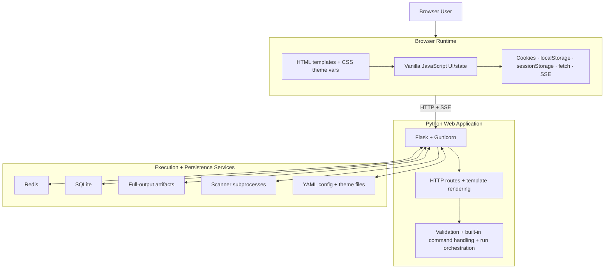
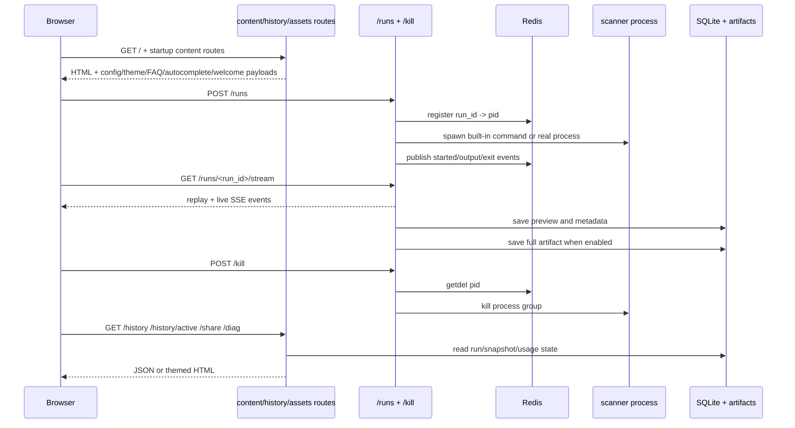
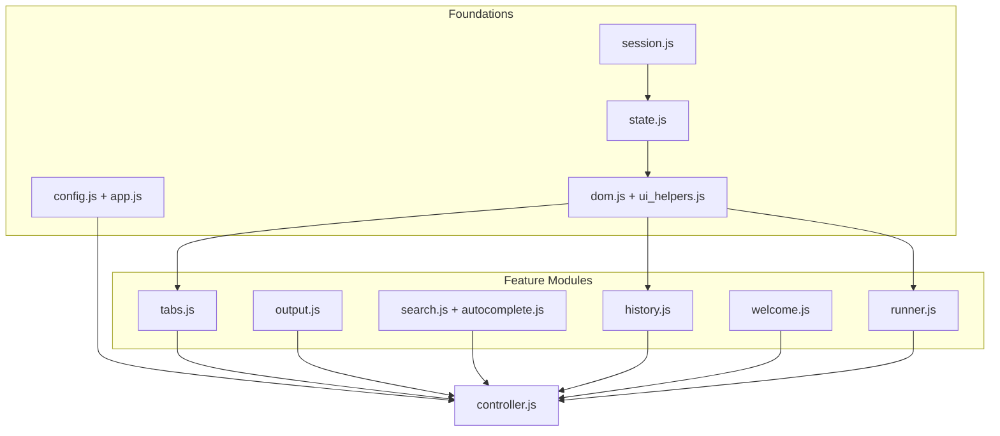
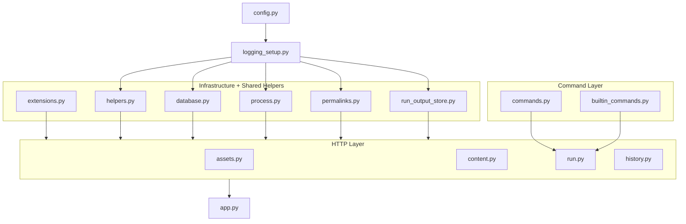
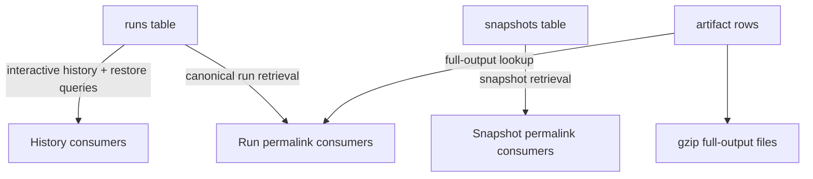

# Architecture

This document explains how darklab_shell is put together today: runtime boundaries, request flow, browser code, backend code, persistence, observability, tests, and production deployment.

For the architectural rationale, tradeoffs, and implementation-history notes behind those structures, see [DECISIONS.md](DECISIONS.md).

---

## Table of Contents

- [System Overview](#system-overview)
- [System Structure](#system-structure)
- [Primary Request Flows](#primary-request-flows)
- [HTTP Route Inventory](#http-route-inventory)
- [Front-end Architecture](#front-end-architecture)
- [Frontend Design System](#frontend-design-system)
- [Back-end Architecture](#back-end-architecture)
- [Run Lifecycle](#run-lifecycle)
- [State And Persistence](#state-and-persistence)
- [Observability And Diagnostics](#observability-and-diagnostics)
- [Security Model](#security-model)
- [Configuration Surfaces](#configuration-surfaces)
- [Test Suite](#test-suite)
- [Production Deployment Notes](#production-deployment-notes)
- [Related Docs](#related-docs)

---

## System Overview

darklab_shell is a web-based shell for running network diagnostics and vulnerability scanning commands against remote targets. It uses Flask + Gunicorn on the backend, a classic-script browser frontend, SQLite for history/share data, Redis for shared live-run state, and SSE for live output.

At a high level, it works like this:

- The browser loads a Flask-rendered shell page, then fetches focused startup data from routes such as `/config`, `/themes`, `/faq`, `/autocomplete`, and `/welcome*`.
- Command execution starts with `POST /runs` and streams through replayable `/runs/<run_id>/stream` SSE subscriptions. The backend validates and rewrites commands, handles app-native built-ins, starts isolated scanner subprocesses when needed, and publishes output events.
- Redis stores shared state that must work across multiple Gunicorn workers: rate limits, active run PID tracking for `/kill`, and production run-broker replay.
- SQLite stores completed run metadata, preview output, snapshots, and full-output file metadata so history and share links survive restarts.
- The browser client has no build step. Classic scripts share one global runtime, and browser cookies/storage handle local continuity around session identity, preferences, and reload restore.
- The Docker runtime uses two unprivileged users: Gunicorn runs as `appuser`, while user-submitted commands run as `scanner` with the shared `appuser` group. That group lets validated session workspace files stay group-readable or group-writable without making them world-readable.

The rest of this document is organized by concern rather than file order: system structure first, then browser/backend composition, then core runtime flows such as run lifecycle, state, observability, and security.

---

## System Structure

Start here for the stable big-picture views before the doc dives into request flow, browser behavior, and persistence details.

### Logical Runtime Layers



This diagram is intentionally about runtime layers rather than individual modules. It answers “which layer owns which responsibility?” without duplicating the more detailed diagrams later in the doc.

- the browser owns rendering, local interaction state, and web APIs such as cookies, `localStorage`, `sessionStorage`, `fetch`, and SSE reads
- the Python web app owns routing, template rendering, config/theme loading, request validation, built-in command handling, and real command setup
- Redis owns the cross-worker coordination that cannot safely live inside one Gunicorn worker process
- SQLite and output files own the run/share state that must survive reloads and restarts
- scanner subprocesses are a distinct execution boundary rather than an in-process extension of the Flask app
- YAML config and theme files are shown separately because they shape both backend behavior and frontend presentation, even though they load from the local filesystem rather than over the network

This section should stay stable even when app modules, blueprints, or frontend files move around. The sections below cover those app-level pieces directly.

### Runtime Topology


This is the transport and boundary view. It focuses on stable communication paths rather than the internal modules that implement them.

- browser traffic is plain HTTP plus one-way SSE streaming for live command output
- Redis is used for shared worker coordination and brokered active-run event replay, not as a general application datastore
- SQLite and output files are the durable history/share boundary
- command execution remains out-of-process, which keeps the Flask worker lifecycle separate from tool execution

---

## Primary Request Flows



There are three core request classes:

- content/bootstrap reads
- run/kill lifecycle
- history/share/diagnostic reads

`/history/active` is part of that third class. It exposes only the current session's in-flight run metadata so the browser can rebuild running tabs after a reload, keep kill available, render the submitted command as a normal prompt line, and subscribe back to `/runs/<run_id>/stream` for replay plus live output. Active-run metadata includes a browser-level origin identity (`owner_client_id`), the originating terminal tab id (`owner_tab_id`), and `owner_last_seen` liveness so the same session token can be open on a laptop and phone without the second browser automatically creating terminal tabs for live commands it did not start. If the origin is another live client, Status Monitor can attach a local tab to the broker stream on demand. Session membership is the process-control boundary: any browser using the same session token that can see the run can explicitly kill it, and subscribed peers receive a broker `killed` event such as `[killed by another browser]`. Non-running tabs and drafts are restored separately from browser `sessionStorage`, which keeps the reload path split cleanly between browser-owned idle state and server-owned active-run state.

That split is reflected directly in the blueprint structure.

---

## HTTP Route Inventory

This route list belongs in the architecture document because it describes the application surface that contributors maintain, not the operator workflow.
Methods below list the routes declared by the app; Flask may add automatic `HEAD` and `OPTIONS` handling for those routes.
The `/static/<path:filename>` row is included even though Flask registers it automatically rather than through a blueprint decorator.

### Content And Bootstrap Routes

| Method | Endpoint | Description |
| -------- | ---------- | ------------- |
| `GET` | `/` | Serves the Flask-rendered shell UI, frontend bootstrap config, active theme CSS variables, and initial rail state. |
| `GET` | `/config` | Returns browser-facing runtime config derived from `config.yaml` and `config.local.yaml`. |
| `GET` | `/themes` | Returns the active theme plus the complete theme registry used by the Options modal. |
| `GET` | `/allowed-commands` | Returns the allowed command prefixes grouped from `commands.yaml` for command reference surfaces. |
| `GET` | `/faq` | Returns built-in FAQ entries plus custom `faq.yaml` entries. |
| `GET` | `/workflows` | Returns current-session user workflows followed by built-in and custom `workflows.yaml` entries, filtered by feature gates such as Files/workspace support. |
| `GET` | `/shortcuts` | Returns the keyboard shortcut reference used by the `shortcuts` built-in and the browser overlay. |
| `GET` | `/autocomplete` | Returns merged external-command and app-owned built-in autocomplete context, built-in command roots, and special command keys. |
| `GET` | `/welcome` | Returns welcome command samples from `welcome.yaml`. |
| `GET` | `/welcome/ascii` | Returns the desktop welcome ASCII banner from `ascii.txt` as plain text. |
| `GET` | `/welcome/ascii-mobile` | Returns the mobile welcome ASCII banner from `ascii_mobile.txt` as plain text. |
| `GET` | `/welcome/hints` | Returns rotating desktop welcome footer hints from `app_hints.txt`. |
| `GET` | `/welcome/hints-mobile` | Returns rotating mobile welcome footer hints from `app_hints_mobile.txt`. |

### Run Lifecycle Routes

| Method | Endpoint | Description |
| -------- | ---------- | ------------- |
| `POST` | `/runs` | Validates, expands session variables, rewrites, starts brokered execution, and returns the run id plus stream URL. |
| `GET` | `/runs/<run_id>/stream` | Replays brokered events and follows live output over SSE for a current-session run. |
| `GET` | `/runs/<run_id>/events` | Returns bounded brokered event backfill for tests and non-SSE clients. |
| `POST` | `/run/client` | Persists allowlisted browser-owned built-in output, such as client-side theme/session commands, as normal run history. |
| `POST` | `/kill` | Kills an active process group by `run_id` and clears active-run tracking. |

### History And Share Routes

| Method | Endpoint | Description |
| -------- | ---------- | ------------- |
| `GET` | `/history` | Returns paginated current-session history items with run/snapshot filters, command/output search, starred-only filtering, and command-root summaries. |
| `DELETE` | `/history` | Deletes all run history for the current session and removes matching full-output artifacts. |
| `GET` | `/history/commands` | Returns newest distinct command strings for prompt history, desktop recents, and mobile recents. |
| `GET` | `/history/stats` | Returns compact current-session counters for the Status Monitor dashboard. |
| `GET` | `/history/insights` | Returns compact visual history data for Status Monitor constellation, heatmap, ticker, and command mix widgets. |
| `GET` | `/history/active` | Returns active-run metadata and telemetry for reload recovery and the Status Monitor. |
| `GET` | `/history/<run_id>/compare-candidates` | Returns ranked previous current-session runs for the History drawer's compare launcher. |
| `GET` | `/history/compare` | Compares two current-session runs and returns metadata deltas plus bounded added/removed output lines. |
| `GET` | `/history/<run_id>` | Serves an implicit-bearer styled run permalink, or raw JSON with `?json`; uses full-output artifacts when available unless `?preview=1` is set. |
| `DELETE` | `/history/<run_id>` | Deletes one current-session run and its matching full-output artifact. |
| `POST` | `/share` | Saves a tab snapshot, optionally applies share redaction, and returns a snapshot permalink URL. |
| `GET` | `/share/<share_id>` | Serves a styled snapshot permalink, or raw JSON with `?json`. |
| `DELETE` | `/share/<share_id>` | Deletes one current-session snapshot permalink. |

### Session Routes

| Method | Endpoint | Description |
| -------- | ---------- | ------------- |
| `GET` | `/session/token/generate` | Generates and stores a new persistent `tok_...` session token. |
| `GET` | `/session/token/info` | Returns the active named token and creation timestamp, or null fields for anonymous sessions. |
| `POST` | `/session/token/revoke` | Revokes a named token so future requests with that token fall back to anonymous session handling. |
| `POST` | `/session/token/verify` | Checks whether a supplied `tok_...` token was issued by this server. |
| `GET` | `/session/recent-domains` | Returns current-session recent domain values for metadata-gated autocomplete suggestions. |
| `POST` | `/session/recent-domains` | Saves normalized recent domain values for the current session and prunes the list to the autocomplete cap. |
| `POST` | `/session/migrate` | Migrates runs, snapshots, starred commands, preferences, command variables, user workflows, recent domains, and non-conflicting workspace paths between session IDs. |
| `GET` | `/session/preferences` | Returns the current session's normalized saved Options snapshot. |
| `POST` | `/session/preferences` | Persists the current session's normalized saved Options snapshot. |
| `GET` | `/session/variables` | Returns current session command-variable names and values for autocomplete and runtime refresh. |
| `GET` | `/session/workflows` | Returns current-session user-created workflows. |
| `POST` | `/session/workflows` | Creates a current-session user workflow. |
| `GET` | `/session/workflows/<workflow_id>` | Returns one current-session user workflow. |
| `PUT` | `/session/workflows/<workflow_id>` | Updates one current-session user workflow. |
| `DELETE` | `/session/workflows/<workflow_id>` | Deletes one current-session user workflow. |
| `GET` | `/session/run-count` | Returns uncapped run count plus workspace file, user workflow, and recent-domain counts for migration confirmation. |
| `GET` | `/session/starred` | Returns the current session's starred command list. |
| `POST` | `/session/starred` | Adds one command to the current session's starred list. |
| `DELETE` | `/session/starred` | Removes one command, or clears the whole starred list, for the current session. |

### Workspace Routes

| Method | Endpoint | Description |
| -------- | ---------- | ------------- |
| `GET` | `/workspace/files` | Returns current-session workspace directories, files, usage, and quota limits. |
| `POST` | `/workspace/files` | Writes a text file into the current session workspace and returns the refreshed workspace payload. |
| `DELETE` | `/workspace/files` | Deletes a file or folder from the current session workspace and returns the refreshed workspace payload. |
| `POST` | `/workspace/directories` | Creates a current-session workspace directory and returns the refreshed workspace payload. |
| `GET` | `/workspace/files/read` | Reads a workspace text file for the UI viewer/editor; binary files return an explicit unsupported-media response. |
| `GET` | `/workspace/files/info` | Returns metadata for a workspace path, including directory file counts used by delete confirmations. |
| `GET` | `/workspace/files/download` | Streams one workspace file as an attachment. |

### Asset And Operator Routes

| Method | Endpoint | Description |
| -------- | ---------- | ------------- |
| `POST` | `/log` | Receives client-side error reports and emits them through server logging. |
| `GET` | `/static/<path:filename>` | Flask's built-in static-file route for committed frontend assets under `app/static/`. |
| `GET` | `/vendor/ansi_up.js` | Serves the vendored `ansi_up` script. |
| `GET` | `/vendor/jspdf.umd.min.js` | Serves the vendored `jsPDF` script used by export flows. |
| `GET` | `/vendor/fonts/<path:filename>` | Serves only committed font files from the vendored font manifest. |
| `GET` | `/favicon.ico` | Serves the site favicon. |
| `GET` | `/health` | Returns Docker/load-balancer health with DB and optional Redis checks; degraded dependencies return 503. |
| `GET` | `/status` | Returns lightweight HUD status data for uptime, DB, Redis, and server time; always responds 200. |
| `GET` | `/diag` | Serves IP-gated operator diagnostics as HTML or JSON; returns 404 outside `diagnostics_allowed_cidrs`. |

---

## Front-end Architecture

This section is the browser-runtime home for page composition, prompt/composer state, mobile shell behavior, and the helper layer that keeps the classic-script UI consistent.

### Frontend Composition



This is still a classic-script frontend, not an ES-module app. The architecture relies on a deliberate load order:

- `state.js` owns shared state
- `ui_helpers.js` owns DOM-facing setters/getters
- domain scripts own tab/output/search/history/welcome/runner logic
- `config.js` and `app.js` handle bootstrap concerns, while `controller.js` is the composition root and last loader

Prompt ownership lives in `composerState`, not in whichever DOM input happened to update last.

The options modal is part of that same browser-owned layer. It does not change backend config; it owns user-specific UX preferences (timestamp/line-number quick toggles, welcome-intro behavior, snapshot redaction defaults, run-notification state, HUD clock timezone mode) and feeds them back into the classic-script runtime during boot and session changes. The terminal-native `config` command calls the same preference application path as the modal, so terminal and modal changes stay equivalent. Browser-owned terminal commands (`theme`, `config`, `workflow`, and `session-token`) render locally, then persist their masked command and transcript output through `/run/client` so history, recents, and reload hydration use the same server-backed history model as brokered `/runs`. `workflow run` uses that local command path for catalog lookup, input prompting, and queue setup, then submits the rendered workflow steps through the normal `/runs` execution path. Those preferences now persist server-side per session through the session-token model, while browser cookies/local storage remain the local cache and anonymous-session fallback layer. On mobile, that same shared Options surface hides the desktop-only `HUD Clock` and `Run Notifications` rows even though the underlying preference set remains shared with desktop.

### Browser Runtime

Modular frontend with no build step. `index.html` is the HTML shell — no inline styles or scripts.

**CSS composition.** CSS is split across ordered static files under `static/css/`, with `styles.css` acting as the compatibility entrypoint that imports `base.css`, `shell.css`, `components.css`, `welcome.css`, `shell-chrome.css`, and `mobile.css`.

**Desktop shell chrome.** `shell-chrome.css` and its companion `static/js/shell_chrome.js` own the left rail (app title, recent commands, workflows, options, history, theme, FAQ, diag, version footer), the tabbar row, and the bottom HUD bar (eleven live status pills — STATUS, LAST EXIT, TABS, TRANSPORT, LATENCY, MODE, SESSION, UPTIME, CLOCK, DB, REDIS — plus the `share snapshot / copy / save ▾ / clear` actions and the kill button). The visible desktop navigation lives in the rail and calls the shared desktop action helpers directly, so desktop and mobile are parallel trigger layers over the same behavior instead of one UI surface proxying through another.

**HUD runtime.** Polls `GET /status` on a visibility-aware cadence: every 3 seconds while the tab is visible and every 15 seconds while hidden, with an immediate refresh when the tab becomes visible again. Round-trip latency is measured client-side via `performance.now()`, server uptime is interpolated locally between polls, and the clock pill ticks once per second. The clock mode is user-selectable from the Options modal (`UTC` vs browser-local time); local mode prefers the browser's short timezone label (for example `CDT`) and falls back to a GMT offset label when the browser cannot provide a stable abbreviation. The `SESSION` pill reflects the active session identity and updates via a `storage` event listener so cross-tab token switches are picked up without a reload. `LAST EXIT` is updated from `runner.js` on every SSE `exit` event and on kill through the shared document-level UI event stream rather than a shell-chrome-specific global.

**Mobile chrome.** The original top header, recent-command chip row, and per-tab footer action row are hidden on both desktop and mobile by `shell-chrome.css` / `mobile-chrome.css`, but remain in the DOM because parts of the classic tab and composer DOM are still re-parented into the mobile shell through `syncMobileShellLayout()`. The mobile chrome (tabs, header, transcript framing, recents peek + pull-up sheet, bottom-sheet menu, and the keyboard edit-helper row) is composed through `mobile-chrome.css` and its companion `mobile_chrome.js`. Shared mobile sheet structure now comes from common `.mobile-sheet-overlay` / `.mobile-sheet-surface` scaffolding in `shell.css` plus the mobile overrides in `mobile.css`, so options / FAQ / workflows / shortcuts use one mobile sheet contract instead of per-ID structural CSS. The theme selector is the intentional exception and keeps its dedicated full-screen mobile treatment.

**Page exceptions.** The permalink and diag pages are explicitly scoped out of the desktop header hide so their own `<header class="export-header">` still renders. The diagnostics page (`/diag`) uses a separate `diag.css` rather than inline styles; it also links `terminal_export.css` to share the same header chrome foundation (`export-header`, `export-header-copy` classes) used by permalink pages. The mobile chrome on `/diag` (back button, header layout) activates at `@media (max-width: 900px) and (pointer: coarse)` — matching the same width + touch criteria used by the shell's `useMobileTerminalViewportMode()` — while layout-only changes (grid collapse, column widths) continue at `max-width: 760px` for all device types.

**JS composition.** Logic is split across `static/js/` into focused modules loaded via plain `<script src="...">` tags. Load order matters: the shared store lives in `state.js`, DOM-facing helpers live in `ui_helpers.js`, `app.js` provides shared browser helpers, and `controller.js` loads last to perform the initialization and event wiring. No bundler, no transpilation.

Within that non-module shell, repeated tab/history/FAQ-limit surfaces are built with direct DOM node creation instead of stitched HTML strings, and the template’s modal chrome uses class-based wrappers for hidden state and dialog layout. That keeps the render paths more maintainable without changing the page composition model.

**Cross-module UI events.** The classic-script runtime still uses globals, but cross-module UI synchronization no longer relies on wrapper monkey-patching as the default bridge. `state.js` exposes `emitUiEvent(...)` / `onUiEvent(...)` helpers built on document-level `CustomEvent`, and the main publishers (`history.js`, `app.js`, `controller.js`, `tabs.js`, `runner.js`, `ui_helpers.js`) emit explicit lifecycle events such as `app:history-rendered`, `app:workflows-rendered`, `app:tab-activated`, `app:tab-status-changed`, `app:status-changed`, `app:last-exit-changed`, and `app:mobile-keyboard-state`. `shell_chrome.js` and `mobile_chrome.js` subscribe to those events instead of wrapping globals like `renderHistory` / `setTabStatus` or mirroring state through unrelated `MutationObserver` hooks. That keeps UI ownership closer to the module where the state changes actually happen while staying compatible with the current plain-script load model.

External dependencies: local vendor routes serving committed builds of `ansi_up` and `jspdf` from `app/static/js/vendor/`, and committed font files from `app/static/fonts/`. Both JS libraries are tracked in `package.json` under `dependencies`. `scripts/build_vendor.mjs` generates `app/static/js/vendor/ansi_up.js` (an IIFE-wrapped browser global, because `ansi_up` v6 is ESM-only) and `app/static/js/vendor/jspdf.umd.min.js` (copied directly from the npm UMD build). The generated files are committed so local development and docker-compose runs never need an explicit build step. Run `npm run vendor:sync` to regenerate after a version bump; `npm run vendor:check` verifies the committed files in `app/static/js/vendor/` match what `build_vendor.mjs` would produce from the current `node_modules/` packages. Fonts are committed to `app/static/fonts/` and served through `/vendor/fonts/`.

**JS module load order:** `session.js` → `state.js` → `utils.js` → `export_html.js` → `config.js` → `dom.js` → `ui_helpers.js` → `ui_pressable.js` → `ui_disclosure.js` → `ui_dismissible.js` → `ui_focus_trap.js` → `ui_confirm.js` → `ui_outside_click.js` → `export_pdf.js` → `tabs.js` → `output.js` → `search.js` → `autocomplete.js` → `history.js` → `workspace.js` → `welcome.js` → `status_monitor.js` → `runner.js` → `app.js` → `mobile_sheet.js` → `controller.js` → `shell_chrome.js` → `mobile_chrome.js`. `state.js` owns the shared store boundary, `ui_helpers.js` owns DOM-facing setters/getters and visibility helpers, the `ui_*` helper modules form the shared UI interaction layer (see **UI Interaction Helpers** below), `app.js` still provides reusable browser helpers, `controller.js` owns the composition root, and `shell_chrome.js` / `mobile_chrome.js` load last so their rail, tabbar, HUD, and mobile-sheet wiring can attach after all tab, search, and action helpers are defined. `welcome.js` must precede `runner.js` because `runner.js` calls `cancelWelcome()` at the top of `runCommand()`.

**UI Interaction Helpers.** A five-helper family in `static/js/ui_helpers.js` + four sibling `ui_*.js` modules is the single contract for chrome-surface interaction. Every module loads before the domain scripts that consume it, so every downstream module sees the helpers as plain globals — no wiring glue at call sites.

- `refocusComposerAfterAction({ preventScroll = true, defer = false })` in `ui_helpers.js` is the canonical post-action composer refocus. Handles mobile-skip, `preventScroll` default, and `getVisibleComposerInput()` target resolution in one place. `defer: true` preserves legacy `setTimeout(0)` semantics for chrome-close paths that need a pending blur to finish first. 46+ call sites across `controller.js`, `app.js`, `tabs.js`, `runner.js`, `welcome.js`, `autocomplete.js`, `shell_chrome.js`, and `history.js` route through it.
- `focusElement(el, { preventScroll })` and `blurActiveElement()` in `ui_helpers.js` are the canonical wrappers for raw DOM focus/blur. `focusElement` collapses the `try { el.focus({ preventScroll: true }) } catch (_) { el.focus() }` pattern, null-guards non-focusable targets, and returns a bool; `blurActiveElement` blurs `document.activeElement` if it is blurrable. Only two direct focus/blur calls remain outside helper internals: the clipboard `execCommand('copy')` fallback in `utils.js` and the helper-internal blur in `ui_pressable.js`.
- `bindPressable(el, { onActivate, refocusComposer, preventFocusTheft, preventScroll, defer, clearPressStyle })` in `ui_pressable.js` is the single contract for press-to-activate surfaces. Click + `Enter`/`Space` activation (keyboard only on non-`<button>` elements so native buttons don't double-fire), post-activation blur + canonical composer refocus (opt-out via `refocusComposer: false`), `preventFocusTheft` on primary-contact pointerdown, and `clearPressStyle` double-`requestAnimationFrame` for `role="button"` divs whose sticky `:hover`/`:active` residue doesn't clear on blur. Idempotent via `data-pressable-bound`.
- `bindDisclosure(trigger, { panel, openClass, hiddenClass, initialOpen, onToggle, stopPropagation, ...pressableOpts })` in `ui_disclosure.js` composes `bindPressable` for the trigger and owns `aria-expanded` sync + panel class lifecycle + `onToggle` emission. Returns an imperative handle (`isOpen / open / close / toggle`). `panel: null` lets the caller own visibility (used by rail section headers where `applySectionsState()` is the sole writer of `.closed`). Idempotent via `data-disclosure-bound`.
- `bindDismissible(el, { level, isOpen, onClose, closeButtons, closeOnBackdrop, backdropEl })` in `ui_dismissible.js` owns scrim-backed modal/sheet dismissal and registers the surface with a shared level-priority dispatcher. `closeTopmostDismissible()` collapses the Escape cascade: priority `modal > sheet > panel`, within-level most-recent-open wins, returns `true` if it closed something so the keydown handler can `preventDefault`. Backdrop semantics: default `e.target === el`; sheets with a detached scrim pass `backdropEl: <scrim>`; `closeOnBackdrop: false` disables (used by the history panel, which is a side panel rather than a modal). Composes `bindPressable` for each close button and idempotent via `data-dismissible-bound`.
- `bindOutsideClickClose(panel, { triggers, isOpen, onClose, exemptSelectors, scope })` in `ui_outside_click.js` owns ambient document-level (or scope-overridden) outside-click dismissal for unbacked panels. Companion to `bindDismissible`: `bindDismissible` owns backed surfaces, `bindOutsideClickClose` owns menus whose trigger sits outside the surface. Encodes the trigger-exemption contract (clicks on registered `triggers` are treated as "inside" via `.contains()`, replacing hand-rolled `e.stopPropagation()` patterns), `exemptSelectors` ancestor-based exemption via `.closest()`, `panel: null` for sibling-set cases (multiple peer dropdowns on a shared parent), and `scope` override for per-sheet listeners.

**App-native Select Primitive.** Native `<select>` popup styling is not themeable consistently across browsers, so user-facing select controls are progressively enhanced into app-native dropdowns by `enhanceAppSelects()` in `ui_helpers.js`. The original `<select>` remains in the DOM as the state owner and accessibility fallback, while the visible `.app-select` wrapper renders a themed button/listbox menu using `dropdown_*` and `chrome_control_*` tokens.

The enhancement targets `select.form-select` and History drawer filter selects. Selecting an item in the app-native menu updates the real select and dispatches a normal bubbling `change` event, so existing Options and History logic does not need a parallel API. When code changes a select value programmatically, it must call `syncAppSelect(select)` or `syncAppSelects()` after writing `.value` / `.disabled`; `syncOptionsControls()` and `_syncHistoryFilterControls()` are the canonical examples.

The native select is visually hidden but left measurable/actionable enough for Playwright's `selectOption()` to keep working in E2E tests. The primitive owns outside-click and Escape closure for all enhanced selects, keeps `aria-expanded` / `aria-selected` synchronized, and supports keyboard stepping with ArrowUp/ArrowDown from the trigger. Unit coverage lives in `tests/js/unit/ui_focus_helpers.test.js`, and browser-level regression coverage comes from the Options preference E2E path.

The contract the helpers jointly enforce: focus returns to the composer after non-text chrome actions; pressed/highlight state clears after activation; `Enter`/`Space` activate pressables consistently; disclosures keep `aria-expanded` and visual state in sync; scrim overlays close consistently via button, backdrop, and `Escape` with a shared priority dispatcher; ambient-click menus close on any outside click but not on clicks inside the panel or trigger. Each helper has its own Vitest unit suite (`ui_focus_helpers.test.js`, `ui_pressable.test.js`, `ui_disclosure.test.js`, `ui_dismissible.test.js`, `ui_outside_click.test.js`). End-to-end verification against real mounted surfaces lives in `tests/js/e2e/interaction-contract.spec.js`.

**Why not ES modules (`type="module"`)?** ES modules are deferred by default and each runs in its own scope, which would require explicit `export`/`import` everywhere. The plain script approach shares a single global scope — simpler and sufficient for this scale.

**Export rendering modules (`export_html.js` / `export_pdf.js`).** Browser export rendering is split into two shared modules. `window.ExportHtmlUtils` owns the browser-rendered export model and the shared export-preparation helpers. In addition to `buildExportLinesHtml` (converts raw line objects to styled HTML spans, respecting `tsMode`/`lnMode` prefix state), `buildExportMetaLine`, `buildExportHeaderModel`, `buildTerminalExportHeaderHtml`, `buildTerminalExportStyles` (produces the full inline CSS block with theme variables), `buildTerminalExportHtml` (assembles the complete standalone HTML document), `fetchVendorFontFacesCss` (fetches and base64-encodes fonts for self-contained export files), and `fetchTerminalExportCss` (fetches `terminal_export.css` with module-level caching so the shared export stylesheet is embedded in every exported document), it now also exposes `normalizeExportTranscriptLines`, `normalizeExportRunMeta`, and `buildExportDocumentModel` so the main-shell save paths and permalink/share save paths prepare transcript/meta data through the same logic. `window.ExportPdfUtils` owns jsPDF rendering and consumes that same prepared header/meta/line model so PDF stays aligned with the browser export baseline while still handling PDF-only responsibilities such as font embedding, wrapping, pagination, and geometric drawing. All save surfaces — `exportTabHtml` / `exportTabPdf` in `tabs.js` and `saveHtml` / `savePdf` in `permalink.js` — delegate to these shared modules so visual changes and transcript-preparation rules propagate from one place instead of being rebuilt independently per surface.

**Permalink/share page model.** `app/permalinks.py` now builds one normalized `page_model` for `/history/<run_id>` and `/share/<id>`. That model carries:
- `header` — app name, meta line, ordered run-meta items, and optional expiry HTML
- `transcript` — normalized line objects plus `hasTimestampMetadata`
- `export` — app/export context consumed by `permalink.js` (`appName`, `label`, `created`, `createdDisplay`, embedded font CSS, normalized run meta)
- `actions` — JSON URL and any extra header actions

The Jinja templates and `window.PermData` now consume that same structure directly, so the live permalink/share page and the saved export surfaces are reading from the same server-provided model instead of parallel template variables.

---

### Prompt And Composer Runtime

The prompt architecture is built around one editing state and two render surfaces:

- the hidden real `#cmd` input remains the canonical editing source for browser focus, selection, and keyboard semantics
- the rendered prompt line inside the active output pane is only a visual mirror of that state
- on desktop, starting a text selection gesture inside the visible prompt temporarily yields focus away from the hidden input so browser-native range selection can complete without the composer stealing focus back
- on touch-sized viewports, `#mobile-cmd` becomes the visible editing surface, but it still syncs into the same shared composer state instead of creating a second command model
- the mobile edit bar is a thin action layer over that same shared composer state, so word-jump and delete helpers reuse the same selection/update path as desktop keyboard shortcuts instead of forking mobile-specific command state
- prompt rows that appear in transcript history are rendered output records, not live editable DOM

This split keeps browser editing semantics predictable without relying on `contenteditable`, while still letting the app present a terminal-like prompt inside the transcript.

### Browser State Model

Each tab is an object: `{ id, label, command, runId, runStart, exitCode, rawLines, killed, pendingKill, st, draftInput }`.

- `command` — the command associated with this tab, set both when the user runs a command directly and when a tab is created by loading a run from the history drawer; used for dedup when the history drawer's `restore` action button is pressed (if a matching tab already exists, that tab is activated instead of creating a new one). Row clicks on history entries take the re-run path instead — they inject the command into the composer and do not touch the tab set.
- `runId` — the UUID from the SSE `started` message, used for kill requests
- `runStart` — `Date.now()` timestamp set *after* the `$ cmd` prompt line is appended, so the prompt line itself has no elapsed timestamp
- `rawLines` — array of `{text, cls, tsC, tsE}` objects storing the pre-`ansi_up` text with ANSI codes intact; `tsC` is the clock time (`HH:MM:SS`), `tsE` is the elapsed offset (`+12.3s`) relative to `runStart`. Used for permalink generation and HTML export
- `killed` — boolean flag set by `doKill()` to prevent the subsequent `-15` exit code from overwriting the KILLED status with ERROR
- `pendingKill` — boolean flag set when the user clicks Kill before the SSE `started` message has arrived (i.e. `runId` is not yet known); the `started` handler checks this and sends the kill request immediately
- `st` — current status string (`'idle'`, `'running'`, `'ok'`, `'fail'`, `'killed'`); set synchronously by `setTabStatus()` so `runCommand()` can check it without waiting for the async SSE `started` message
- `draftInput` — unsaved command text for that tab; restored from browser session state for non-running tabs during reload continuity

Tab activation is intentionally stateful rather than stateless rendering. `activateTab()` preserves the leaving tab's draft, restores the arriving tab's draft without reopening autocomplete, and resets transient input-mode state such as history-navigation and autocomplete selection. During full session restore, draft-flush side effects are suppressed until the saved tab set has been rebuilt so non-active drafts cannot be overwritten by the final active-tab selection.

### Welcome Bootstrap Flow

`welcome.js` owns a staged boot flow that is separate from normal run output. The important architectural points are:

- welcome state is tab-scoped, so clearing or running commands in another tab cannot tear down the active welcome tab
- desktop and mobile share the same timing/config pipeline but can read different banner/hint assets
- the browser fetches narrow typed endpoints such as `/welcome`, `/welcome/ascii`, `/welcome/ascii-mobile`, `/welcome/hints`, and `/config` rather than reading raw files directly
- the same frontend-owned preference layer that controls timestamps and line numbers also controls welcome-intro behavior

The detailed user-visible welcome behavior belongs in the README. Here, the important distinction is that welcome is a client-owned bootstrap experience built from server-normalized content routes, not a special command-execution transcript.

### Input Modes And Dropdown State Machines

Command editing is split into separate state machines rather than one overloaded dropdown path:

- normal autocomplete consumes structured external-tool and app-owned built-in `context` hints from `/autocomplete`, then overlays only dynamic runtime suggestions such as loaded Files, session variables, workflow names, theme names, config values, and command lookup targets before passing everything through the same token-aware ranked matcher
- reverse-history search owns its own pre-draft, query, selection, and exit paths
- `controller.js` routes keyboard events into the appropriate mode before the normal submit/edit handlers run
- navigation semantics stay consistent regardless of whether a dropdown opens above or below the prompt

The structured autocomplete path is intentionally token-aware rather than shell-aware. It inspects command root, current token, and prior tokens to decide whether a suggestion should replace the whole input or only the active token. Examples act as discovery suggestions: a unique root or fuzzy root match can flatten root and subcommand examples into full-command replacements, while a selected subcommand switches the matcher to subcommand-scoped flags and value hints. Ambiguous subcommand matches remain token suggestions until only one subcommand matches. The matcher ranks exact matches, prefixes, token-boundary/camel-ish hits, substrings, and fuzzy character matches in that order, while preserving authored example order once an example is eligible. That preserves the classic-shell feel for long scanner commands without turning the frontend into a general shell parser.

Recent-domain autocomplete is session-token-backed state. `autocomplete.js` keeps a page-local cache for immediate suggestions, but `GET`/`POST /session/recent-domains` persist normalized domains in SQLite under the active session ID, cap the list at 10, and migrate those rows with `/session/migrate`. Capture and suggestions still require explicit `value_type: domain` metadata in the command registry; placeholder text and descriptions are display-only and do not make a slot record domains.

Synthetic post-filters also sit on a distinct path before the normal shell-operator denial logic. `parse_synthetic_postfilter()` in `commands.py` recognizes one narrow `command | helper ...` stage for `grep`, `head`, `tail`, and `wc -l`, validates only the base command, and the broker worker applies the selected helper before lines are emitted or persisted. That keeps shell-like helpers app-native without reopening general shell piping or chaining.

---

## Frontend Design System

This section is the single home for the finalized cross-cutting UI rules that apply to every pressable surface, disclosure, color decision, and modal in the shell. Each subsection states the rule, names the shared primitive that enforces it, and points at the owning helper module or theme contract. Rationale and historical context for each rule live in [DECISIONS.md § Frontend Decisions](DECISIONS.md#frontend-decisions).

### Button Primitive Family

Every clickable surface in the shell uses one of a small, allowlisted set of primitive classes. The primary pressable primitive is `.btn`, composed with one role modifier and at most one tone modifier:

- **Role modifiers** (mutually exclusive): `.btn-primary`, `.btn-secondary`, `.btn-ghost`, `.btn-destructive`. Role controls the visual weight of the button — primary is the main action in a group, secondary is the alternate, ghost is a low-weight inline action, and destructive is a labeled irreversible action.
- **Tone modifiers** (mutually exclusive, optional): `.btn-danger`, `.btn-warning`. Tone overlays a semantic color from the theme contract. A tone without a role is not valid.

Eight non-`btn` pressable primitives exist for surfaces that are structurally not buttons but still need consistent pressable behavior: `.nav-item` (rail/tab navigation), `.close-btn` (modal and sheet close controls), `.toggle-btn` (on/off switches with no destructive semantics), `.kb-key` (keyboard-key glyphs in help copy), `.dropdown-item` (menu/listbox choices inside app-owned dropdowns), `.control-row` (row-shaped filter/select controls), `.hud-action-cell` (clickable HUD summary cells), and `.gesture-handle` (mobile sheet drag/tap handles). New pressable surfaces must pick one of these primitives rather than introducing one-off classes.

All pressable primitives route through `bindPressable` in `app/static/js/ui_pressable.js` so click + Enter/Space activation, press-style timing, and composer-refocus behavior stay consistent. A jsdom contract test (`tests/js/unit/button_primitives_allowlist.test.js`) enumerates every `<button>` / `[role="button"]` in the rendered shell and fails CI on any element that does not carry one of the allowed class families; exceptions are listed in `tests/js/fixtures/button_primitive_allowlist.json` with a short reason per entry.

### Dropdown/Menu Primitive Family

App-owned dropdowns share the `.dropdown-surface` / `.dropdown-item` primitive family. The primitive owns common themed menu treatment: `dropdown_*` background, border, shadow, font family, default item text, hover/focus state, selected state, and upward-shadow direction via `.dropdown-up`. Surface selectors keep placement, width, z-index, max-height, and any behavior-specific layout.

Density is explicit rather than global. `.dropdown-item-compact` is used for small command menus such as Save, `.dropdown-item-touch` for app-native select and mobile sheet menus, and `.dropdown-item-dense` for terminal autocomplete rows. Autocomplete remains a specialized dropdown consumer: it shares the surface and active-row styling, but keeps its terminal prefix marker, descriptions, match highlighting, fixed positioning, and mobile keyboard positioning local.

Current consumers are terminal/permalink/HUD Save menus, app-native selects, command autocomplete, History root autocomplete, Ctrl+R history search, and mobile recents filter menus. New app-owned menu surfaces should compose these primitives before adding local selectors.

### Row Primitive Family

Repeated list rows use shared row primitives instead of rebuilding background, divider, hover, and accent behavior per surface. `.chrome-row` is for shell-chrome lists such as History drawer rows, Status Monitor run rows, and mobile recents rows. `.chrome-row-clickable` adds the shared hover/focus state for rows that activate on click or keyboard. Accent classes such as `.row-accent-green` and `.row-accent-amber` are visual only; each component still decides when a run is active or a history row is starred.

Modal and panel content uses `.panel-row` instead of `.chrome-row`. The Files modal composes `.panel-row` for file, folder, and empty-state rows so it gets consistent border/radius/focus treatment without visually becoming a History or Status Monitor chrome row. Rail navigation stays under the `.nav-item` primitive because selected navigation state and rail density are different from content-list row behavior.

### Chip And Badge Primitive Family

Pill-shaped UI uses two separate primitives so visual affordance matches behavior. `.chip` is for clickable or removable pill actions such as prompt history chips, active History filters, mobile recents filter chips, FAQ command chips, and workflow command chips. `.chip-action` keeps command-loading chips toolbar-like, while `.chip-removable` is used for active filters that clear state.

`.badge` is for passive metadata labels that should not look clickable. History and mobile recents use badges for `RUN` / `SNAPSHOT` labels, with tone classes such as `.badge-tone-green` and `.badge-tone-muted` carrying the semantic color. Search signal chips intentionally remain text-like buttons even though they compose the chip primitive, because the search summary reads as inline metadata rather than a filter-chip row.

### Form And Control Primitive Family

Text fields and compact filter controls compose `.form-control` and `.control-row` instead of rebuilding input chrome per surface. `.form-control` owns the shared `chrome_control_*` background/border, mono font, radius, padding, and focus border. `.form-control-compact` is used for dense History/search controls, while `.form-control-quiet` keeps the search input visually light inside the search strip.

`.control-row` is for row-shaped controls that are not plain text inputs, such as app-native select triggers and mobile recents filter rows. It is also part of the pressable primitive allowlist because several control rows are rendered as `<button>` dropdown/toggle triggers. `.control-row-touch` keeps mobile sheet controls large enough for touch without changing desktop filter density. The mobile command composer (`#mobile-cmd`) intentionally remains a local exception because its keyboard anchoring, caret behavior, and viewport sizing are more fragile than normal form controls.

### Drawer And Sheet Primitive Family

Drawer-like chrome surfaces compose `.chrome-drawer`, `.surface-header`, and `.surface-body` so shared background, header band, scroll containment, and mono typography stay consistent. History uses this family as a side panel, while the desktop Status Monitor presents its dashboard inside a centered modal and mobile keeps the sheet treatment.

Mobile bottom sheets compose `.bottom-sheet`, `.bottom-sheet-header`, `.bottom-sheet-body`, `.bottom-sheet-footer`, and `.gesture-handle`. These primitives own the shared sheet background, top border, top radius, shadow, grab-handle affordance, and basic header/body/footer structure. Scrims, keyboard-aware modal sizing, and sheet-specific controls remain local because those details are tied to mobile interaction behavior rather than general visual treatment.

### Disclosure Affordance Rules

Disclosure glyphs in the shell encode a fixed mapping between glyph and behavior. The meta-rule is: **the glyph follows the actual behavior, not the visual hierarchy**. A surface that opens in place is never marked with a drill-in glyph even if it looks like a list row, and a row that navigates away is never marked with a chevron even if it visually resembles an expandable group.

| Glyph | Behavior | Example |
|-------|----------|---------|
| `▸` / `▾` | Expand/collapse in place. Glyph indicates state: `▸` closed, `▾` open. | FAQ items, rail section headers, mobile recents advanced-filter toggle |
| `>` | Drill-in. Opens a different surface or navigates to another view. | Sheet rows that open a sub-sheet |
| `▾` (static) | Dropdown trigger. Always shown as `▾`; the glyph is a type label, not a state indicator. | `save ▾`, mobile header menus |
| (no glyph) | Toggle or non-navigational action. No disclosure semantics. | `.toggle-btn`, run-tab pill |

The expand/collapse case is owned by `bindDisclosure` in `app/static/js/ui_disclosure.js`, which wires `aria-expanded`, panel visibility, and the pressable contract in one call. Callers supply the trigger and panel; they do not manage `aria-expanded` by hand.

### Semantic Color Contract

Theme colors in the shell are semantic, not decorative. Every theme exposes four semantic tokens — `--amber` (caution / in-progress), `--red` (destructive / error), `--green` (completed success / enabled), `--muted` (neutral metadata) — and every UI decision that reaches for one of these colors must match the semantic meaning of that token rather than picking on visual taste. Themes control the exact visual tone of each token; the mapping from token to meaning is fixed.

Full rules, the allowed exceptions (starred items, search-hit highlights, decorative macOS traffic-light chrome), and the `color-mix()`-in-theme-file pattern for surface-local tuning live in [THEME.md § Semantic Color Contract](THEME.md#semantic-color-contract). That document is the source of truth — this section does not restate the rules.

### Scrollbar Styling Contract

App-owned vertical scroll regions use the `.nice-scroll` CSS primitive so terminal output, autocomplete dropdowns, modal bodies, history surfaces, mobile sheets, rail lists, permalink output, and saved HTML export output share the same themed scrollbar treatment. New scrollable panels, drawers, sheets, dropdowns, and transcript-like surfaces should add `.nice-scroll` instead of hand-rolling `scrollbar-width`, `scrollbar-color`, or `::-webkit-scrollbar` selectors.

Intentional hidden-scrollbar surfaces are separate from this primitive. Horizontally scrolling tab strips and touch-first overflow strips keep their explicit no-scrollbar rules because their contract is edge-glow or drag affordance, not visible scrollbar affordance.

### Confirmation Dialog Contract

App-level modal confirmations — kill, history-delete, history-clear, share-redaction, Options-driven session-token actions, delete-all — go through a single imperative primitive, `showConfirm()` in `app/static/js/ui_confirm.js`. Surfaces do not hand-roll confirm markup, do not wire their own Escape handler, and do not manage their own backdrop. Terminal-owned `session-token` confirms are the intentional exception: they stay inside the transcript and use the shared pending-confirm state in `runner.js` instead of a modal surface.

The contract:

- **One at a time.** A second `showConfirm()` call while another is open is rejected. The shell never stacks confirms.
- **Role-based action ids.** Each action carries `role: 'primary' | 'secondary' | 'ghost' | 'cancel'` and an optional `tone: 'danger' | 'warning'`. `role` drives the button primitive class (`btn-primary` / `btn-secondary` / `btn-ghost`); `tone` adds the destructive overlay. Callers receive the id of the activated action, or `null` for cancel.
- **Default focus on cancel.** For confirmations, the cancel action is focused on open so browser native Enter-activates-focused-button makes `Enter === cancel`. Callers with a form input in the `content` slot can override via `defaultFocus`.
- **Focus is trapped inside the card.** `bindFocusTrap` in `app/static/js/ui_focus_trap.js` keeps Tab / Shift+Tab cycling between the card's focusable descendants so keyboard focus cannot fall through to the rail, tabs, or HUD behind the backdrop while a modal is open. Every modal surface in the shell uses this helper: `#confirm-host` binds per-open because its card content changes between shows, and the app-level modals (`#options-modal`, `#theme-modal`, `#faq-modal`, `#workspace-modal`, `#workflows-modal`, `#workflow-editor-form`) bind once at startup via `setupModalFocusTraps()` in `controller.js` because their DOM is persistent.
- **Dismissal is layered.** `bindDismissible` at `level: 'modal'` owns Escape + backdrop click. `bindMobileSheet` owns the drag-down-to-close handle on mobile. Both resolve the promise with `null` so callers cannot accidentally treat dismissal as confirmation.
- **Actions stack at narrow widths.** The action row adds `.modal-actions-stacked` when the viewport is ≤480px or the action count is ≥3. A `matchMedia` listener keeps the class reactive to resize while the modal is open.
- **Gate via `onActivate`.** An action can supply `onActivate` to run validation before close. Returning a falsy value (or a Promise resolving to one) keeps the modal open so form errors stay on screen; any truthy return closes and resolves with the action id.

---

## Back-end Architecture

This section centralizes the Python/runtime-side composition: the Flask surface, shared infrastructure, command orchestration, and the durable services the browser depends on.

### Backend Composition

The backend is intentionally split so that request handling, shared infrastructure, and command policy stay testable in isolation rather than collapsing into one large Flask module.

The Python backend is split into focused layers with acyclic dependencies:



- `config.py` is the root configuration/theme layer and stays free of Flask app dependencies.
- `logging_setup.py` must initialize before the rest of the app because module-import-time startup work, especially Redis setup, can log immediately.
- The infrastructure/helper layer owns shared concerns like request metadata, persistence, process tracking, permalink shaping, artifact storage, and the Flask-Limiter singleton.
- `commands.py` and `builtin_commands.py` stay logically adjacent to the run path but remain separate from the Flask factory so command policy and shell-helper behavior can be tested in isolation.
- The HTTP layer owns the actual request/response surface, and `app.py` remains a thin factory that composes logging, limiter setup, blueprint registration, and request hooks.

### Backend Runtime Boundaries

This boundary view answers a different question than the dependency graph above: not "which module imports which," but "which runtime service owns which responsibility."

- Flask + Gunicorn own routing, request hooks, response shaping, and template rendering.
- Redis owns only the shared coordination required across Gunicorn workers: rate limiting and active-run PID tracking for `/kill`.
- SQLite plus artifact files own durable run, snapshot, token, and search state.
- Scanner subprocesses remain an out-of-process boundary rather than an in-worker extension of the Flask app.
- Config and theme YAML files are filesystem-backed dependencies that shape both backend behavior and frontend presentation but do not become a general runtime datastore.

---

## Run Lifecycle

This section groups the full command path — validation, rewrite, execution, streaming, kill, and completion persistence — into one coherent runtime story.

### Validation And Rewrites

The run path applies policy before any subprocess launch:

- command validation blocks filesystem references to `/data` and `/tmp` before subprocess launch
- loopback targets such as `localhost`, `127.0.0.1`, `0.0.0.0`, and `[::1]` are blocked at both the client and server
- when the allowlist is active, shell operators such as `&&`, `||`, `|`, `;`, redirection, and command substitution stay blocked so users cannot chain into disallowed commands
- optional `restricted_command_input_cidrs` settings reject literal IP/CIDR values in metadata-known target slots before launch, including URL hosts, host:port values, overlapping CIDR arguments, and app-readable workspace input files supplied through declared read flags

These rewrites are declared in `app/conf/commands.yaml` under `runtime_adaptations` and applied by the shared command layer through `rewrite_command()` (no user-visible notice unless specified):

| Command | Rewrite | Reason |
| --------- | --------- | -------- |
| `mtr` | Adds `--report-wide` | mtr requires a TTY for interactive mode; report mode works without one. User is shown a notice. |
| `nmap` | Adds `-sT` when no scan mode is explicit | Uses TCP connect scanning for reliable non-root container execution; `-sS` and `--privileged` are blocked. Silent. |
| `nuclei` | Adds `-ud /tmp/nuclei-templates`; uses session-scoped `XDG_CONFIG_HOME` when Files are enabled | Redirects template storage to tmpfs while keeping useful ProjectDiscovery config/resume state in the session workspace. Silent. |
| `naabu` | Adds `-scan-type c` | Uses TCP connect scanning instead of raw SYN mode for container reliability. Silent. |

Session command variables are expanded inside the app before command policy validation and execution. `app/session_variables.py` owns the `[A-Z][A-Z0-9_]{0,31}` name rules, SQLite storage, and `$NAME` / `${NAME}` replacement. The run-start path keeps `var` itself unexpanded so `var set HOST ...` is data management, expands other commands before synthetic post-filter parsing, validates the expanded command, and still persists the typed command in history while emitting a transcript notice with the expanded form.

Workspace-aware validation also rewrites declared file and directory flags from `app/conf/commands.yaml` into the active session workspace. Rewritten token lists are reassembled with shell-safe quoting before they cross the existing `sh -c` subprocess boundary, so app-injected workspace paths cannot accidentally change shell parsing when a valid session file or folder name contains spaces or shell metacharacters. The same command metadata drives target-value restrictions: flags and positional arguments declared with target-like `value_type` values (`domain`, `host`, `ip`, `cidr`, `target`, or `url`) can be checked against configured restricted networks without blanket string scanning. Runtime adaptation metadata also owns managed workspace directories, environment wrappers, and command-prefix injections; Amass declares its database-backed subcommands there, so `amass enum`, `amass subs`, `amass track`, and `amass viz` get a managed `-dir amass` workspace directory and `XDG_CONFIG_HOME` is pointed at the session workspace so `amass engine` and the CLI share the same per-session database path. ProjectDiscovery tools declare a workspace-required `env XDG_CONFIG_HOME=<session workspace>` prefix through the same metadata, and run output filters display absolute session-workspace paths as user-facing paths like `/katana/resume.cfg`. See [External Command Integrations](docs/external-command-integrations.md) for the command-specific integration contracts.

Synthetic post-filters also sit on this run-lifecycle boundary rather than on the shell-parser path. `parse_synthetic_postfilter()` recognizes one narrow `command | helper ...` stage for `grep`, `head`, `tail`, and `wc -l`, validates only the base command, and the brokered stream applies the selected helper before lines are emitted or persisted.

### Spawn And Stream

Commands flow through `POST /runs`, which validates and rewrites the request, resolves any app-native built-in commands, starts brokered execution, and returns a run id plus stream URL. The browser then subscribes to `GET /runs/<run_id>/stream`, which replays available broker events and follows live output over SSE. Production deployments require Redis for cross-worker replay; single-process local development can opt into the in-memory broker fallback.

Fast output bursts are rendered in small batches instead of forcing a full DOM update per line. The batching keeps commands like `man curl` responsive enough for the browser to repaint while output is streaming, and the terminal stays pinned to the bottom only while the user has not scrolled away. If the user scrolls up, live following stops until they return to the tail.

The brokered stream keeps the transport alive with heartbeat comments during idle periods, while the backend-owned worker drains subprocess stdout exactly once and publishes normalized `started`, `notice`, `output`, `exit`, and `error` events. The subprocess stdout reader uses a nonblocking buffered path rather than `select()` followed by `readline()`. That matters for tools that emit partial progress lines: partial output no longer wedges the drain waiting for a newline and starving the heartbeat stream. If a platform refuses nonblocking setup, the server warning-logs the fallback so a deployment that could stall on partial-line output leaves an operator-visible trail. On the browser side, `runner.js` treats 45 seconds of browser-visible silence as a potentially stalled stream, then checks `/history/active` before changing tab state. If the run is still active, the tab stays `RUNNING`, Kill remains available, and the warning copy says the process is still alive; only inactive runs fall back to the history/final-result recovery path. The async recovery path captures the tab/run generation before it awaits backend state and re-checks that generation before applying status, which prevents stale timeout promises from overwriting a newer run after rapid tab switches, kills, or restarts. If the same stream later resumes, the runner prints an explicit recovery notice and keeps the tab/HUD in the running state instead of leaving the UI failed-looking while output silently continues.

Active-run metadata is also the source for the Status Monitor's run section. `/history/active` returns the current run IDs, PIDs, commands, start times, metadata source, origin fields, and best-effort `psutil` resource telemetry when available. The backend reports summed RSS bytes and cumulative process-tree CPU seconds for the tracked process plus recursive children. `/history/insights` supplies bounded visual history payloads for the monitor's constellation, activity heatmap, command treemap, and event ticker without overfetching full history rows; the browser loads that heavier payload once on monitor open and refreshes it exactly once when the active-run count transitions `>0 → 0` in the same session, so a freshly completed run lands in the heatmap "today" cell, the treemap percentages, and the constellation without a polling timer. The desktop Status Monitor is a centered modal available from the rail, HUD cells, and `Alt+M`; mobile exposes the same monitor as a bottom sheet from the normal menu and running-tab peek. Both surfaces can open while idle and render system health, workspace quota, session statistics, visual history, a continuous glowing CPU-driven heartbeat strip, app-native constellation/day heatmap popovers, a seeded ambient constellation sky for sparse history, labeled calendar heat, and a `No active runs` row at the bottom. To avoid browser connection starvation when many tabs already hold live SSE streams, opening Status Monitor pauses non-active tab subscriptions and resubscribes them from the last broker event id on close; `/history/active` polling refreshes same-client origin liveness while those streams are paused. Runs already open in a local tab activate that tab when clicked; other visible current-session runs expose Attach to open a subscribed tab and Kill to terminate the backend process group intentionally. Closing a running tab opens a confirmation modal with `Keep running`, `Kill run`, and `Cancel`; `Keep running` detaches only that browser tab and leaves the backend run visible in Status Monitor for later reattach. The monitor calculates the displayed CPU percentage from adjacent poll samples in the browser and caps the display at 100%, which avoids per-worker CPU sample caches and keeps multi-worker deployments from flickering when successive polls land on different workers. Memory fill is normalized client-side against a 1 GB scale while the label continues to show the actual RSS value. Telemetry failures are intentionally non-fatal and omitted from the response rather than breaking reload recovery, stall checks, or the terminal `runs` command.

Two compact history endpoints feed the Status Monitor dashboard without exposing full run bodies. `/history/stats` returns current-session counters: `runs.total`, `runs.succeeded`, `runs.failed`, `runs.incomplete`, `runs.average_elapsed_seconds`, plus `snapshots`, `starred_commands`, and `active_runs`. SIGTERM-style `-15` exits are retained in totals but excluded from `failed` so user-killed, timeout-cleaned, or supervisor-stopped runs do not inflate failure visuals. `/history/insights` accepts `days=auto` or an integer clamped to 28-365 days. It returns `activity` day buckets for the selected window, `max_day_count`, capped `command_mix` data, capped recent-run `constellation` data, recent `events`, and a `windows` object that records the resolved activity, command-mix, and constellation ranges. Command mix uses 30 days, expanding to 90 days when fewer than 25 runs exist; constellation uses 30 days, expanding to 90 days when fewer than 40 plotted runs exist, and caps plotted stars at 350. Those resolved windows are part of the response so the UI can label sparse or expanded panels honestly. App built-ins (the command roots routed by the `builtin_commands` layer — `pwd`, `whoami`, `help`, …) are filtered server-side from `/history/insights` so all Status Monitor visualizations reflect real recon work only without each consumer reimplementing the filter.

### Output Prefixes And Follow State

Line numbers and timestamps are rendered from stored per-line metadata rather than by rebuilding transcript text. Each appended `.line` keeps timestamp attributes plus a stable `data-line-number` assigned at append time; trimming old rows at `max_output_lines` does not renumber the remaining DOM. The `data-prefix` attribute carries only the active timestamp fragment, and the shared prefix width is updated incrementally during normal appends while `syncOutputPrefixes()` is reserved for restore/toggle paths that intentionally revisit existing rows. Output appends flush in larger batches for bursty commands, offscreen rows opt into browser `content-visibility`, and live trimming uses a live row collection instead of snapshotting every `.line` on each append.

Welcome rows are excluded from normal prefix numbering, and `tab.runStart` is captured after the submitted prompt line is appended so elapsed timing applies only to run output.

### Kill Flow And Exit Reconciliation

Because commands run as `scanner` and Gunicorn runs as `appuser`, the web worker cannot directly signal `scanner`-owned processes. The kill path therefore uses `sudo -u scanner kill -TERM -<pgid>` so the signal is sent by the user that owns the process group.

This gets more important with multiple Gunicorn workers. The worker that receives `POST /kill` may not be the worker that launched the process. To solve that:

- `pid_register(run_id, pid)` writes the process id to Redis with a 4-hour TTL
- `pid_pop(run_id)` uses Redis `GETDEL` so lookup and removal are atomic
- any worker can therefore resolve and kill the correct process group without relying on shared in-memory state

When a user clicks Kill:

1. `doKill()` sets `tab.killed = true`, shows KILLED status
2. Server receives SIGTERM, process exits with code -15
3. SSE stream sends `exit` message with code -15
4. Exit handler checks `tab.killed` — if true, skips status update and resets flag

Without the `killed` flag, the `-15` exit code causes the exit handler to set status to ERROR, briefly flashing KILLED before reverting.

---

## State And Persistence

This section groups durable server state, browser-owned session state, session identity, and reload continuity into one model of where state lives and how it survives reloads or moves between devices.

### Persistence Model

The key architectural distinction is that the app does not use one monolithic store for everything. It deliberately splits fast interactive state, durable share state, and optional full-output storage so each surface can stay efficient without losing fidelity where it matters.



The persistence model is intentionally split:

- `runs` stores fast, capped preview data for the interactive UI
- `snapshots` stores share-specific captured state
- `run_output_artifacts` plus gzip files store optional full output without bloating the main `runs` table

That split is what allows the app to keep the interactive shell fast while still supporting durable full-output permalinks and exports.

### Database

`<data_dir>/history.db` — SQLite, WAL mode. Seven persistent tables, one FTS5 virtual table, and file-backed run-output artifacts. `data_dir` is an operator config key; when unset, the app uses writable `/data` and falls back to `/tmp` for local/dev runs where the image-created `/data` directory is not mounted writable.

- `runs` — one row per completed command. Stores run metadata plus a capped `output_preview` JSON payload for the history drawer and `/history/<id>`. Fresh previews store structured `{text, cls, tsC, tsE}` entries so run permalinks can preserve prompt echo and timestamp metadata. Also stores `output_search_text` (plain text extracted from the full artifact when available, otherwise the preview) for FTS indexing. Persists across restarts. Pruned by `permalink_retention_days`.
- `runs_fts` — FTS5 virtual table (content table backed by `runs`, `content_rowid=rowid`) indexing the `command` and `output_search_text` columns. Uses the trigram tokenizer when available (SQLite ≥ 3.38), falling back to unicode61. Kept in sync with `runs` via INSERT/DELETE triggers. Enables history drawer full-text search across both command text and stored run output.
- `run_output_artifacts` — metadata rows pointing at compressed full-output artifacts under `<data_dir>/run-output/`. This keeps the `runs` table lean while still allowing the canonical `/history/<id>` permalink to serve full output when it exists.
- `snapshots` — one row per tab permalink (`/share/<id>`). Contains `{text, cls, tsC, tsE}` objects with raw ANSI codes and timestamp data for accurate HTML export reproduction, and now feeds the `SNAPSHOT` rows in the shared history surfaces.
- `session_tokens` — one row per issued named session token `(token TEXT PRIMARY KEY, created TEXT)`. Used to validate `tok_`-prefixed `X-Session-ID` headers and to support `session-token list` and `session-token revoke`.
- `session_preferences` — one row per session ID `(session_id TEXT PRIMARY KEY, preferences TEXT, updated TEXT)`. Stores the normalized Options snapshot that follows a named session token across browsers while still allowing browser-local UUID sessions to keep independent defaults.
- `starred_commands` — one row per starred command per session `(session_id, command)`. Backs the `/session/starred` endpoints and follows session tokens across devices via the migration path.
- `session_variables` — one row per session command variable `(session_id, name, value, updated)`. Backs the `var` built-in, `/session/variables`, and app-managed command expansion before validation.
- `user_workflows` — one row per saved workflow `(id, session_id, title, description, inputs, steps, created, updated)`. Backs the Workflows panel's **My workflows** section, the `workflow` terminal command, and session-token migration.
- Redis-backed active-run metadata plus browser `sessionStorage` form a second persistence layer for reload continuity:
  - `/history/active` covers in-flight runs owned by the server/session
  - browser `sessionStorage` covers non-running tabs, transcript previews, status, draft input, and active-tab selection

The storage model is intentionally split:

- live tabs and normal history restore use `max_output_lines` and the `runs.output_preview` payload, which keeps only the most recent preview lines
- full-output persistence is controlled by backend-only config keys `persist_full_run_output` and `full_output_max_mb`
- `full_output_max_mb` is multiplied by `1024 * 1024` and enforced on the uncompressed UTF-8 stream before gzip compression, so the limit tracks output volume rather than the final on-disk `.gz` size
- full-output artifacts for fresh runs are stored as gzip-compressed JSON-lines records, not plain text, so prompt/timestamp/class metadata can be reused by canonical run permalinks
- the main-page permalink button upgrades to the persisted full artifact when one exists, so `/share/<id>` and `/history/<run_id>` both surface the same complete result when available
- artifact readers stay backward-compatible with older plain-text gzip artifacts by normalizing them into structured `{text, cls, tsC, tsE}` entries at load time
- deleting a run, clearing history, or retention pruning removes both the DB metadata and any associated artifact files

Active process tracking (`run_id → pid`) was previously a third table (`active_procs`) cleared on startup. It has been replaced by Redis keys with a 4-hour TTL, which keeps the kill path correct across multiple Gunicorn workers without pushing ephemeral run state into SQLite.

---

### Session Identity

Session identity is a two-tier model managed in `app/static/js/session.js`:

1. **UUID session (anonymous)** — generated by `_generateUUID()` on first visit and persisted in `localStorage` under `session_id`. Always present; never removed. `_generateUUID()` tries `crypto.randomUUID()` first (HTTPS/localhost) and falls back to `crypto.getRandomValues()` so HTTP LAN deployments (e.g. `http://192.168.x.x`) work without a secure context.
2. **Session token (named)** — a `tok_<32 hex>` string generated server-side by `GET /session/token/generate` and persisted in `localStorage` under `session_token`. Takes precedence over the UUID when present. Stored in the `session_tokens` database table `(token TEXT PRIMARY KEY, created TEXT)`.

`SESSION_ID` is initialised at page load by preferring `session_token` over `session_id`. `updateSessionId(newId)` switches identity at runtime without a page reload — used by `session-token generate/set/clear/rotate/revoke`. Every API call sends the active identity as `X-Session-ID` via `apiFetch()`. History, stars, saved Options state, and app-managed workspace files are scoped to this identity; clearing a session token reverts to the UUID rather than losing the anonymous session. Terminal `session-token` flows keep their prompts in the transcript, while the Options-panel clear/set actions use `showConfirm()`.

**Server-side token validation:** `get_session_id()` in `helpers.py` validates `tok_`-prefixed header values against the `session_tokens` table on every request. A revoked or never-issued `tok_` token is treated as anonymous (returns `""`) so the caller loses access to session-scoped data immediately, without requiring a client-side logout. UUID-format session IDs pass through without a DB lookup.

`maskSessionToken(token)` in `session.js` produces display-safe representations: `tok_XXXX••••` for named tokens and `uuid8ch••••••••` for UUIDs.

History and workspace-file migration between identities goes through `POST /session/migrate` — see `### Session Token Security` in [DECISIONS.md](DECISIONS.md) for the constraints on that endpoint.

### Reload Continuity

There are two persistence layers for reload restore:

- `/history/active` covers in-flight runs owned by the server/session
- browser `sessionStorage` covers non-running tabs, transcript previews, status, draft input, and active-tab selection

`/history/active` exposes only the current session's in-flight run metadata so the browser can rebuild running tabs after a reload, keep kill available, render the submitted command as a normal prompt line, and then hand those tabs back to the normal `/history/<run_id>` restore path once the run completes. Non-running tabs and drafts are restored separately from browser `sessionStorage`, which keeps the reload path split cleanly between browser-owned idle state and server-owned active-run state.

That split is also what lets the browser keep a separate `sessionStorage` snapshot for non-running tabs and draft input without persisting that UI state across browser sessions.

---

## Observability And Diagnostics

This section groups log emission, health/status surfaces, and the operator diagnostics page into one observability story rather than scattering them across unrelated runtime sections.

### Logging

The application uses a dedicated `shell` logger configured by `logging_setup.py`. Logging is part of the runtime architecture rather than just a deployment concern because request hooks, run lifecycle handlers, diagnostics gates, and startup bootstrap all emit structured events that operators rely on for troubleshooting and auditing.

Structured events use the `session` field for request correlation. Anonymous session IDs are logged as-is, while `tok_` session-token values are masked before logging because they are bearer credentials.

### Output Formats

The logging layer supports two output formats selected by `log_format` in `config.yaml`:

- `text`
  - human-readable single-line logs for local development and plain `docker compose logs`
  - output shape is `timestamp [LEVEL] EVENT key=value ...`
  - extra fields are sorted alphabetically and appended after the event name
  - string values containing spaces are repr-quoted so copy/paste remains readable
- `gelf`
  - newline-delimited GELF 1.1 JSON for Graylog-style aggregation
  - `short_message` is the bare event name such as `RUN_START`
  - event context is emitted as `_`-prefixed additional fields such as `_ip`, `_run_id`, and `_cmd`
  - this makes the application logs directly indexable by a GELF-aware backend without extra parsing rules

The Docker logging driver and the application formatter are intentionally separate controls. The production Compose override can ship container stdout over Docker GELF transport, while `log_format: gelf` controls whether the application itself emits GELF-shaped records or plain text.

### Log Event Inventory

The current event inventory is:

| Level | Event | Where | Key extra fields |
| ------- | ------- | ------- | ----------------- |
| DEBUG | `REQUEST` | `before_request` | ip, method, path, qs |
| DEBUG | `RESPONSE` | `after_request` | ip, method, path, status, size |
| DEBUG | `KILL_MISS` | `kill_command` | ip, run_id |
| DEBUG | `HEALTH_OK` | `health()` | — |
| DEBUG | `ACTIVE_RUNS_VIEWED` | `get_active_history_runs` | ip, session, count |
| DEBUG | `HISTORY_DELETE_MISS` | `delete_run` | ip, run_id, session |
| DEBUG | `THEME_SELECTED` | current theme resolution | ip, session, route, theme, source |
| DEBUG | `CMD_PIPE` | `run_command` | ip, session, cmd, pipe_to |
| DEBUG | `HISTORY_COMMANDS_VIEWED` | `get_history_commands` | ip, session, count, limit |
| DEBUG | `SESSION_RUN_COUNT_VIEWED` | `session_run_count` | ip, session, session_kind, count |
| DEBUG | `STARRED_COMMANDS_VIEWED` | `session_starred_list` | ip, session, session_kind, count |
| INFO | `LOGGING_CONFIGURED` | `configure_logging` | level, format |
| INFO | `CMD_REWRITE` | `run_command` | ip, original, rewritten |
| INFO | `RUN_START` | `run_command` | ip, run_id, session, pid, cmd, cmd_type |
| INFO | `RUN_END` | `generate()` | ip, run_id, session, exit_code, elapsed, cmd, cmd_type |
| INFO | `RUN_KILL` | `kill_command` | ip, run_id, pid, pgid |
| INFO | `DB_PRUNED` | `db_init` | runs, snapshots, retention_days |
| INFO | `PAGE_LOAD` | `index` | ip, session, theme |
| INFO | `CONTENT_VIEWED` | content routes | ip, session, route, count/restricted/current/key_count |
| INFO | `SESSION_TOKEN_GENERATED` | `session_token_generate` | ip, session, session_kind |
| INFO | `SESSION_TOKEN_REVOKED` | `session_token_revoke` | ip, session, session_kind, revoked_current |
| INFO | `SESSION_MIGRATED` | `session_migrate` | ip, session, from_session_kind, to_session_kind, migrated_runs, migrated_snapshots, migrated_stars, migrated_preferences |
| INFO | `SESSION_PREFERENCES_SAVED` | `session_preferences_save` | ip, session, session_kind, key_count |
| INFO | `STARRED_COMMAND_ADDED` | `session_starred_add` | ip, session, session_kind, command_root, changed |
| INFO | `STARRED_COMMAND_REMOVED` | `session_starred_remove` | ip, session, session_kind, command_root, count |
| INFO | `STARRED_COMMANDS_CLEARED` | `session_starred_remove` | ip, session, session_kind, count |
| INFO | `SHARE_CREATED` | `save_share` | ip, session, share_id, label, redacted |
| INFO | `SHARE_VIEWED` | `get_share` | ip, session, share_id, label |
| INFO | `SHARE_DELETED` | `delete_share` | ip, session, share_id, deleted |
| INFO | `RUN_VIEWED` | `get_run` | ip, run_id, cmd |
| INFO | `HISTORY_VIEWED` | `get_history` | ip, session, count, q, output_search, command_root, exit_code_filter, date_range |
| WARN | `FTS_SEARCH_FALLBACK` | `get_history` | session, q, error |
| INFO | `HISTORY_DELETED` | `delete_run` | ip, run_id, session |
| INFO | `HISTORY_CLEARED` | `clear_history` | ip, session, count |
| INFO | `DIAG_VIEWED` | `diag()` | ip |
| WARN | `RUN_NOT_FOUND` | `get_run` | ip, run_id |
| WARN | `SHARE_NOT_FOUND` | `get_share` | ip, share_id |
| WARN | `CMD_DENIED` | `run_command` | ip, session, cmd, reason |
| WARN | `CMD_MISSING` | `run_command` | ip, session, cmd |
| WARN | `CLIENT_ERROR` | `client_log` | ip, session, context, client_message |
| WARN | `DIAG_DENIED` | `diag()` | ip, allowed_cidrs |
| WARN | `SESSION_TOKEN_REVOKE_DENIED` | `session_token_revoke` | ip, session, reason |
| WARN | `SESSION_MIGRATE_DENIED` | `session_migrate` | ip, session, reason, from_session_kind, to_session_kind |
| WARN | `SESSION_PREFERENCES_INVALID` | `session_preferences_get` | ip, session, session_kind |
| WARN | `UNTRUSTED_PROXY` | `get_client_ip` | ip, proxy_ip, forwarded_for, path |
| WARN | `RATE_LIMIT` | `errorhandler(429)` | ip, path, limit |
| WARN | `CMD_TIMEOUT` | `generate()` | ip, run_id, session, timeout, cmd |
| WARN | `KILL_FAILED` | `kill_command` | ip, run_id, pid, error |
| WARN | `HEALTH_DEGRADED` | `health()` | db, redis |
| ERROR | `RUN_SPAWN_ERROR` | `run_command` | ip, session, cmd (+ traceback) |
| ERROR | `RUN_STREAM_ERROR` | `generate()` | ip, run_id, session, cmd (+ traceback) |
| ERROR | `RUN_SAVED_ERROR` | `generate()` | run_id, session, cmd (+ traceback) |
| ERROR | `HEALTH_DB_FAIL` | `health()` | (+ traceback) |
| ERROR | `HEALTH_REDIS_FAIL` | `health()` | (+ traceback) |

### Logging Shape Notes

- request/response logging is owned by Flask hooks rather than Werkzeug's default request-line logging
- run lifecycle logs intentionally carry `ip`, `session`, and `run_id` so start/end/kill/failure events can be correlated without reconstructing request flow from surrounding lines
- diagnostics, history, permalink, and share routes each emit their own events so operator-visible surfaces remain observable outside the command-execution path
- proxy-aware identity resolution is shared across logging, rate limiting, and diagnostics gating, so the logged `ip` field tracks the same resolved client identity used elsewhere in the runtime

---

### Health, Status, And Diagnostics Surfaces

- `/health` remains the load-balancer contract and reports whether DB and Redis are healthy, with degraded states surfacing through status code.
- `/status` is intentionally a softer browser-HUD contract and always responds 200 so status-pill polling never causes UI flapping or reconnect churn.
- `/diag` is the operator-facing structured view that surfaces runtime config, service health, asset presence, tool availability, and activity summaries without opening a shell session.

These three surfaces share the same runtime health model, but they target different consumers: infrastructure checks, browser chrome, and operator diagnostics.

### Operator Diagnostics

The diagnostics page lives behind the same trusted-proxy-aware client IP resolution path used by logging and rate limiting. When enabled through `diagnostics_allowed_cidrs`, it exposes a live operator view of the running instance and reuses the same themed header foundation as permalink/export surfaces.

Operationally, `/diag` sits on top of the same underlying sources described earlier in the document:

- Redis and SQLite health come from the same runtime boundary described in **System Structure**
- run counts, top commands, and stored artifacts come from the persistence layer described in **State And Persistence**
- config values reflect the browser/backend config split described in **Configuration Surfaces**
- access control and denied-access logging reuse the same client-IP trust model described in **Security Model** and **Logging**

---

## Security Model

The runtime security model is layered across process ownership, command validation, and container-level controls.

### User Separation

The container uses two unprivileged system users:

- `appuser`
  - owns the Flask/Gunicorn web process
  - owns the configured data directory and can read or write the SQLite database and artifact metadata
- `scanner`
  - owns all user-submitted command processes
  - does not get write access to `./data`
  - runs with `HOME=/tmp` so tools that expect config/cache directories stay inside tmpfs rather than a persistent home directory

The container starts as root only long enough for `entrypoint.sh` to fix `/data` ownership after volume mount, normalize the optional workspace root, set `/tmp` to `1777`, pre-create `/tmp/.config` and `/tmp/.cache` for `scanner`, and then drop to `appuser` via `gosu`.

For workspace-backed host bind mounts, the host path should already be owned by the numeric UID/GID for the image's `appuser` account. The current image creates `appuser` as `995:995` and `scanner` as `994:994`, and launches scanner commands with the shared `appuser` run group when executing user commands. The runtime still attempts to repair ownership and modes on startup, including files directly inside each `sess_*` directory, but pre-setting the bind mount keeps rootless Docker, NFS-like mounts, and stricter host policies from leaving the workspace root owned by `root:root`. Permission-repair failures are warning-logged rather than swallowed, and startup warning-logs if the `WORKSPACE_ROOT` environment value prepared by the entrypoint differs from the app's configured `workspace_root`. The expected mode model is `0730` for the workspace root, `3730` for hashed session directories, `0640` for app-created files, and `0660` for command-created files that must remain writable by the `scanner` process through the shared `appuser` run group.

Workspace cleanup is request-driven rather than a separate daemon. Each worker checks periodically before handling a request, then calls the backend cleanup helper when workspace storage is enabled. Cleanup evaluates the hashed session directory mtime as the workspace activity marker and only deletes resolved `sess_*` roots under the configured workspace root. Normal workspace path resolution rejects symlink components before use, and file reads/downloads also open the final component with no-follow semantics where the platform supports it so a same-principal symlink swap cannot escape the session root between validation and open.

### Trust Boundary Notes

- command validation and rewrite behavior are part of the trust boundary, but the execution mechanics themselves now live in **Run Lifecycle** above because they are also central runtime behavior
- session identity is isolation, not authentication; the actual session model lives in **State And Persistence**
- cross-worker kill relies on Redis-backed PID lookup and a user-bound signal path, as described in **Run Lifecycle**

### nmap Scan Mode Model

`nmap` can use raw-socket-related Linux capabilities for SYN scans, OS fingerprinting, and similar features. In practice, those capabilities are not reliable for the app's unprivileged `scanner` execution path across Docker hosts and security profiles, even when the binary has file capabilities:

```bash
setcap cap_net_raw,cap_net_admin+eip /usr/bin/nmap
```

For predictable behavior, the app treats TCP connect scans as the supported `nmap` mode. `rewrite_command()` injects `-sT` when an `nmap` command does not already specify a scan mode. Command validation blocks `-sS` and explicit `--privileged` so users do not get confusing raw-socket `Operation not permitted` failures after launch.

---

## Configuration Surfaces

The Flask index route embeds the same normalized browser config payload that `/config` returns, and `config.js` reads that server-rendered JSON into `APP_CONFIG` before the rest of the classic-script frontend loads. The `/config` endpoint remains available for runtime refresh and diagnostics, but both paths are built from the same Python payload helper. That payload is the browser bootstrap boundary for runtime values the frontend actually needs: naming, prompt text, limits, welcome timing, and selected browser-facing feature flags. It is intentionally narrower than `config.yaml`; backend-only persistence and storage controls do not cross that boundary.

Not every `config.yaml` key is exposed to the browser. Server-side persistence and storage controls such as `persist_full_run_output`, `full_output_max_mb`, and the `workspace_*` settings stay backend-only because the frontend does not need to know them to render the normal tab or history flows. The MB values are converted to bytes internally before artifact or workspace quota logic runs.

This is also where backend configuration crosses into presentation: the browser bootstrap payload, the resolved theme palette, and the frontend-owned preference layer all meet here, but they do not collapse into one generic config blob.

### Theme System

Theme values are resolved server-side from named YAML variants in `app/conf/themes/` and injected into every presentation surface — live shell, permalink pages, runtime selector, and exported HTML — through a single shared palette. No surface maintains its own independent palette logic. See [THEME.md](THEME.md) for the full architecture, token reference, and authoring workflow.

---

## Test Suite

The test stack is intentionally split into three layers:

- `pytest` for backend contracts, route behavior, persistence, loaders, and logging
- `Vitest` for client-side helpers and DOM-bound browser logic in jsdom
- `Playwright` for the integrated browser UI against a live Flask server

Current totals:

- behavior tests: 2,354
- docs/inventory meta-tests: 30
- `pytest`: 1182 (1152 behavior + 30 meta)
- `vitest`: 966
- `playwright`: 236
- total: 2,384

### Testing Architecture

This split exists to keep each risk at the cheapest useful layer:

- backend behavior stays fast and deterministic in `pytest`
- browser-module logic is isolated in `Vitest` without changing the classic-script frontend architecture
- browser-only integration risks such as real focus, scroll, SSE timing, and mobile layout behavior stay in `Playwright`
  - browser-visible autocomplete behavior spans two contexts:
    - command-root-aware flag/value suggestions
    - the allowlisted built-in pipe-helper context after `command |`, including chained helper stages

The browser test harness mirrors production constraints rather than abstracting them away:

- the frontend remains a no-build classic-script app, so `Vitest` uses extraction helpers instead of converting the runtime to ES modules
- `Playwright` uses two configs: a simple single-project default config for VS Code/debugging and a parallel CLI config that balances the suite across 5 isolated projects
- the standalone demo/capture Playwright configs share one visual-contract file so desktop/mobile viewport, density, touch, token, and seeded-history assumptions stay aligned across recording and screenshot flows
- each parallel browser project gets its own Flask server port plus isolated internal `APP_DATA_DIR` state so SQLite history, run-output artifacts, and limiter/process state do not collide across workers
- backend tests keep the app’s real relative-path assumptions by changing into `app/` before imports
- the browser suite also carries focused regressions for the split welcome specs, pipe-stage autocomplete, and the responsive FAQ limits renderer because those are easiest to verify in the real UI

Keep the detailed suite appendix, focused run commands, and maintenance notes in [tests/README.md](tests/README.md). Keep the rationale behind this layered split in [DECISIONS.md](DECISIONS.md).

---

## Production Deployment Notes

The root `docker-compose.yml` remains the standalone/base deployment shape:

- `shell` plus `redis`
- health checks
- tmpfs mounts
- `init: true`

That base file is intentionally usable for local and simple self-hosted deployments without bringing in reverse-proxy assumptions or environment-specific logging transport.

Gunicorn runtime sizing is controlled through environment variables rather than hard-coded entrypoint edits:

- `WEB_CONCURRENCY` for worker count
- `WEB_THREADS` for threads per worker

These remain optional and fall back to the built-in defaults when unset, which keeps production tuning in `.env` / Compose rather than in the startup script.

Production-specific behavior is layered in through overrides such as `examples/docker-compose.prod.yml`. That override is meant for reverse-proxy-aware deployments and adds operational concerns without forcing them into the standalone base:

- removes host port publishing and switches the shell service to `expose`
- joins the external `darklab-net` Docker network
- adds `VIRTUAL_HOST` / `LETSENCRYPT_HOST` environment variables for `nginx-proxy`
- pins stable production container names for `shell` and `redis`
- enables Docker GELF transport for both containers

Application log format still remains an application-level choice, so operators must pair the Docker GELF transport with `log_format: gelf` in `config.yaml` or `config.local.yaml` when they want end-to-end GELF output.

---

## Related Docs

- [README.md](README.md) — quick summary, quick start, installed tools, and configuration reference
- [FEATURES.md](FEATURES.md) — full per-feature reference including purpose and use
- [docs/external-command-integrations.md](docs/external-command-integrations.md) — external-tool rewrite, environment, workspace, and smoke-test contracts
- [CONTRIBUTING.md](CONTRIBUTING.md) — local setup, test workflow, linting, and merge request guidance
- [DECISIONS.md](DECISIONS.md) — architectural rationale, tradeoffs, and implementation-history notes
- [THEME.md](THEME.md) — theme registry, selector metadata, and override behavior
- [tests/README.md](tests/README.md) — test suite appendix, smoke-test coverage, and focused test commands
