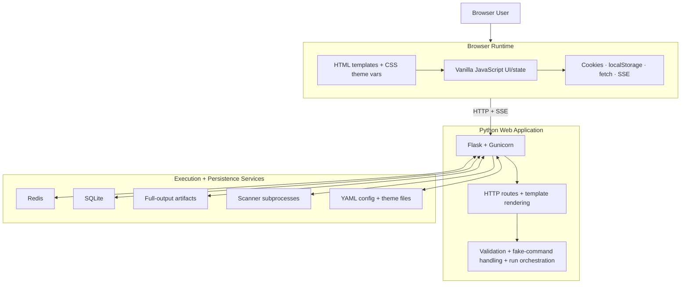
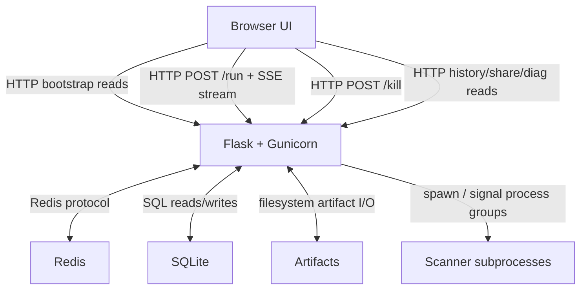
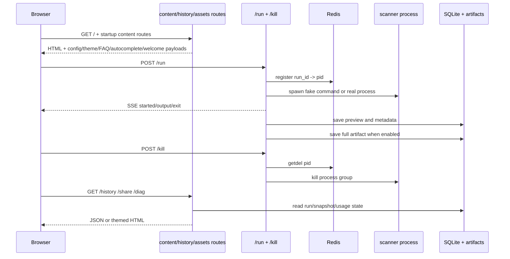
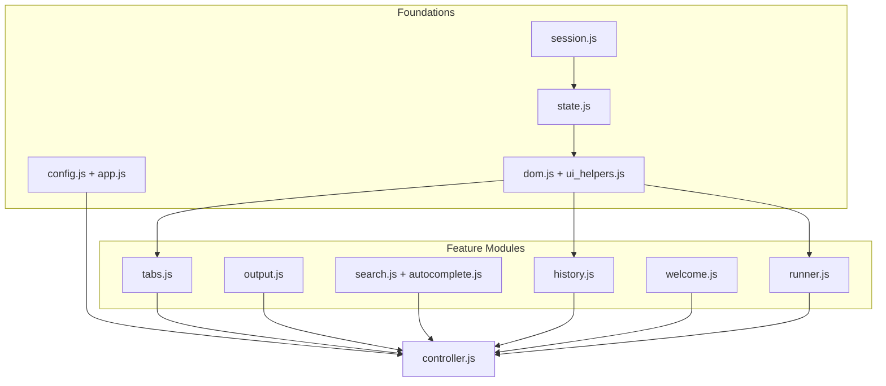
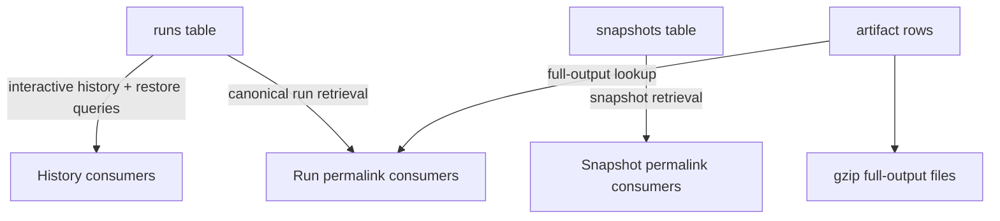

# Architecture

This document describes the current system architecture of darklab shell: runtime layers, request flow, frontend composition, persistence, testing shape, and production deployment model.

For the architectural rationale, tradeoffs, and implementation-history notes behind those structures, see [DECISIONS.md](DECISIONS.md).

---

## Project Overview

A web-based shell for running network diagnostic and vulnerability scanning commands against remote endpoints. Flask + Gunicorn backend, single-file HTML frontend, SQLite persistence, real-time SSE streaming.

## Table of Contents
- [Project Overview](#project-overview)
- [System Overview](#system-overview)
- [Logical Runtime Layers](#logical-runtime-layers)
- [Runtime Topology](#runtime-topology)
- [Primary Request Flows](#primary-request-flows)
- [Frontend Composition](#frontend-composition)
- [Persistence Model](#persistence-model)
- [Test Suite](#test-suite)
- [Testing Architecture](#testing-architecture)
- [Database](#database)
- [Production Deployment Notes](#production-deployment-notes)

## System Overview

At a mid to high level, darklab shell works like this:

- A browser-based terminal UI loads a Flask-rendered shell page, then hydrates itself from focused read routes such as `/config`, `/themes`, `/faq`, `/autocomplete`, and `/welcome*`.
- Command execution flows through `POST /run`, which validates and rewrites commands, resolves any app-native fake commands, starts an isolated scanner subprocess when needed, and streams output back over SSE.
- `Redis` provides the shared state that must work correctly across multiple Gunicorn workers: rate limiting and active run PID tracking for `/kill`.
- `SQLite` persists completed run metadata, preview output, snapshots, and full-output artifact metadata so history, canonical run permalinks, and snapshot permalinks survive restarts.
- The browser client stays build-step-free. Classic scripts share a single global runtime, with `composerState` acting as the canonical source of truth for prompt value, selection, and active input.
- The Docker runtime enforces a two-user model: Gunicorn runs as `appuser`, while user-submitted commands run as `scanner`, with additional allowlist, deny-rule, loopback-block, and process-group controls layered on top.

## Logical Runtime Layers

This diagram is intentionally framework- and runtime-oriented rather than app-module-oriented. It is meant to answer the “which layer owns which responsibility?” question without duplicating the more detailed app diagrams later in the document.

- the browser runtime owns rendering, local interaction state, and web-platform APIs such as cookies, `localStorage`, `fetch`, and SSE consumption
- the Python web application owns routing, template rendering, config/theme loading, request validation, fake-command handling, and orchestration of real command execution
- Redis owns the cross-worker coordination that cannot safely live inside one Gunicorn worker process
- SQLite and artifact files own the durable run/share state that must survive reloads and restarts
- scanner subprocesses are a distinct execution boundary rather than an in-process extension of the Flask app
- YAML config and theme files are shown as a separate logical dependency because they shape both backend behavior and frontend presentation, even though they are loaded from the local filesystem rather than over the network

The goal is for this section to stay stable even when app-specific modules, blueprints, or frontend files are refactored. The more detailed sections below cover those app-level components directly.

## Runtime Topology

This is the transport/boundary view of the app. It focuses on the stable communication paths rather than the internal modules that implement them.

- browser traffic is plain HTTP plus one-way SSE streaming for live command output
- Redis is only used for shared worker coordination, not as a general application datastore
- SQLite and artifact files are the durable history/share boundary
- command execution remains out-of-process, which keeps the Flask worker lifecycle separate from tool execution

## Primary Request Flows

There are three core request classes:

- content/bootstrap reads
- run/kill lifecycle
- history/share/diagnostic reads

That split is reflected directly in the blueprint structure.

## Frontend Composition

This is still a classic-script frontend, not an ES-module app. The architecture relies on a deliberate load order:

- `state.js` owns shared state
- `ui_helpers.js` owns DOM-facing setters/getters
- domain scripts own tab/output/search/history/welcome/runner logic
- `config.js` and `app.js` handle bootstrap concerns, while `controller.js` is the composition root and last loader

The important recent architectural change is that prompt ownership now lives in `composerState`, not in whichever DOM input happened to update last.

## Persistence Model

The persistence model is intentionally split:

- `runs` stores fast, capped preview data for the interactive UI
- `snapshots` stores share-specific captured state
- `run_output_artifacts` plus gzip files store optional full output without bloating the main `runs` table

That split is what allows the app to keep the interactive shell fast while still supporting durable full-output permalinks and exports.

The Python backend is split into focused layers with acyclic dependencies:

- `config.py` is the root configuration/theme layer and stays free of Flask app dependencies.
- `logging_setup.py` must initialize before the rest of the app because module-import-time startup work, especially Redis setup, can log immediately.
- The infrastructure/helper layer owns shared concerns like request metadata, persistence, process tracking, permalink shaping, artifact storage, and the Flask-Limiter singleton.
- `commands.py` and `fake_commands.py` stay logically adjacent to the run path but remain separate from the Flask factory so command policy and shell-helper behavior can be tested in isolation.
- The HTTP layer owns the actual request/response surface, and `app.py` remains a thin factory that composes logging, limiter setup, blueprint registration, and request hooks.

## Command Auto-Rewrites

These happen in `rewrite_command()` silently (no user-visible notice unless specified):

| Command | Rewrite | Reason |
|---------|---------|--------|
| `mtr` | Adds `--report-wide` | mtr requires a TTY for interactive mode; report mode works without one. User is shown a notice. |
| `nmap` | Adds `--privileged` | Required for raw socket features with setcap. Silent. |
| `nuclei` | Adds `-ud /tmp/nuclei-templates` | Redirects template storage to tmpfs. Silent. |
| `wapiti` | Adds `-f txt -o /dev/stdout` | wapiti writes reports to file by default; this streams to terminal. Silent. |

---

## Frontend Architecture

Modular frontend with no build step. `index.html` is a 169-line HTML shell — no inline styles or scripts. CSS is now split across ordered static files under `static/css/`, with `styles.css` acting as the compatibility entrypoint that imports `base.css`, `shell.css`, `components.css`, `welcome.css`, and `mobile.css`. Logic is split across `static/js/` into focused modules loaded via plain `<script src="...">` tags. Load order matters: the shared store lives in `state.js`, DOM-facing helpers live in `ui_helpers.js`, `app.js` provides shared browser helpers, and `controller.js` loads last to perform the initialization and event wiring. No bundler, no transpilation.

Within that non-module shell, repeated tab/history/FAQ-limit surfaces are built with direct DOM node creation instead of stitched HTML strings, and the template’s modal chrome now uses class-based wrappers for hidden state and dialog layout. That keeps the render paths more maintainable without changing the page composition model.

External dependencies: local vendor routes backed by build-time font downloads and a copied-in `ansi_up` browser build for ANSI-to-HTML rendering. `ansi_up` is self-hosted — the checked-in browser-global file at `static/js/vendor/ansi_up.js` serves as the fallback for local development and docker-compose runs. The Dockerfile copies that same file into `/usr/local/share/shell-assets/js/vendor/ansi_up.js`, which the app serves through `/vendor/ansi_up.js`. The same pattern is used for fonts under `/vendor/fonts/`, with repo copies in `app/static/fonts/` acting as fallbacks.

**JS module load order:** `session.js` → `state.js` → `utils.js` → `config.js` → `dom.js` → `ui_helpers.js` → `tabs.js` → `output.js` → `search.js` → `autocomplete.js` → `history.js` → `welcome.js` → `runner.js` → `app.js` → `controller.js`. `state.js` owns the shared store boundary, `ui_helpers.js` owns DOM-facing setters/getters and visibility helpers, `app.js` still provides reusable browser helpers, and `controller.js` owns the composition root and must load last so it can wire the DOM after all helpers are defined. `welcome.js` must precede `runner.js` because `runner.js` calls `cancelWelcome()` at the top of `runCommand()`.

**Why not ES modules (`type="module"`)?** ES modules are deferred by default and each runs in its own scope, which would require explicit `export`/`import` everywhere. The plain script approach shares a single global scope — simpler and sufficient for this scale.

### Shell Prompt Model

The visible command surface is terminal-native:

- a hidden real `#cmd` input remains the source of truth for browser/mobile keyboard input, selection, and focus
- a rendered prompt row is mounted into the active tab output and mirrors the hidden input value/caret/selection
- the prompt unmounts while a command is running and remounts when the run finishes/fails/is killed
- submitted commands are echoed as styled prompt lines in output so transcript flow reads like a real shell
- blank/whitespace `Enter` does not call `/run`; it appends a new prompt line
- `Ctrl+C` maps to shell-like behavior: open kill confirm while running, otherwise emit a fresh prompt line

On mobile, the prompt surface is split into a dedicated visible composer:

- `#mobile-cmd` is the visible source-of-truth input on touch-sized viewports
- the helper row with `Home`, `←`, `→`, `End`, and `Del Word` appears only while the mobile keyboard is open
- command chips, autocomplete acceptance, and the Run/Enter paths all sync back to the visible mobile input so the desktop mirror stays in step
- the desktop and mobile Run buttons stay disabled together while any command in the active tab is running, preventing duplicate submits from either surface
- mobile keyboard-open state is driven by the visible mobile input when it exists, with a viewport-offset fallback for the legacy/mobile-shell test harness path

This keeps browser editing semantics and accessibility predictable without relying on `contenteditable`.

### Tab State

Each tab is an object: `{ id, label, command, runId, runStart, exitCode, rawLines, killed, pendingKill, st, draftInput }`.

- `command` — the command associated with this tab, set both when the user runs a command directly and when a tab is created by loading a run from the history drawer; used for dedup when clicking history entries (if a matching tab already exists, that tab is activated)
- `runId` — the UUID from the SSE `started` message, used for kill requests
- `runStart` — `Date.now()` timestamp set *after* the `$ cmd` prompt line is appended, so the prompt line itself has no elapsed timestamp
- `rawLines` — array of `{text, cls, tsC, tsE}` objects storing the pre-`ansi_up` text with ANSI codes intact; `tsC` is the clock time (`HH:MM:SS`), `tsE` is the elapsed offset (`+12.3s`) relative to `runStart`. Used for permalink generation and HTML export
- `killed` — boolean flag set by `doKill()` to prevent the subsequent `-15` exit code from overwriting the KILLED status with ERROR
- `pendingKill` — boolean flag set when the user clicks Kill before the SSE `started` message has arrived (i.e. `runId` is not yet known); the `started` handler checks this and sends the kill request immediately
- `st` — current status string (`'idle'`, `'running'`, `'ok'`, `'fail'`, `'killed'`); set synchronously by `setTabStatus()` so `runCommand()` can check it without waiting for the async SSE `started` message
- `draftInput` — unsaved command text that the user was composing in this tab; flushed from `cmdInput.value` on tab switch and restored via `setComposerValue(..., { dispatch: false })` when the tab is reactivated. Not saved for running tabs (the command was already submitted). The `controller.js` input handler also keeps this field live on every keystroke so the flush at switch time is always consistent.

Tab switching is draft-preserving: `activateTab` in `tabs.js` saves the leaving tab's current input as `draftInput`, then restores the arriving tab's saved draft into the prompt without triggering an input event (which would reopen autocomplete). It also calls `acHide()` and resets `acFiltered = []` so stale suggestions from the leaving tab's session cannot bleed into the arriving tab. `resetCmdHistoryNav()` is also called on switch to clear the command-history cursor.

### Live Output Rendering

Fast output bursts are rendered in small batches instead of forcing a full DOM update per line. The batching keeps commands like `man curl` responsive enough for the browser to repaint while output is streaming, and the terminal stays pinned to the bottom only while the user has not scrolled away. If the user scrolls up, live following stops until they return to the tail.

### Output Prefixes: Line Numbers And Timestamps

Elapsed and clock timestamps are shown on output lines without rebuilding those line nodes. Each appended `.line` receives two timestamp `data-` attributes plus a synchronized `data-prefix` string:

- `data-ts-e` — elapsed offset from `tab.runStart` (e.g. `+12.3s`)
- `data-ts-c` — wall-clock time (e.g. `14:32:01`)
- `data-prefix` — compact shared prefix text such as `12 +3.4s`, `12 14:32:01`, or just `12`

`appendLine()` stores the timestamp metadata at insert time, and `syncOutputPrefixes()` in `output.js` recomputes `data-prefix` plus a shared `--output-prefix-width` per output container whenever rows are appended or the timestamp / line-number mode changes. CSS still renders the visible prefix through `::before`, but the actual text composition happens in JavaScript so line numbers, timestamps, prompt rows, and exit rows all stay aligned as digit widths change.

Welcome-animation rows are excluded from prefix numbering entirely. They keep their original boot-sequence layout, and the first real output line after welcome still becomes line `1`.

`tab.runStart` is set *after* the `$ cmd` prompt line is appended so the prompt itself has no `data-ts-e` attribute and shows no elapsed stamp.

### Welcome Animation

`welcome.js` exposes `runWelcome()`, `cancelWelcome(tabId?)`, `requestWelcomeSettle(tabId?)`, and tab-ownership helpers around a single startup experience that runs after `app.js` creates the initial tab. The current sequence is broader than the original typeout, and it has a desktop branch plus a mobile branch:

1. fetch `/welcome/ascii` and stream the ASCII banner from `conf/ascii.txt`
2. render fake startup-status rows using `APP_CONFIG.welcome_status_labels`
3. pause briefly using `welcome_post_status_pause_ms` so the boot phase lands before the example phase begins
4. fetch `/welcome` and sample a curated set of commands from `conf/welcome.yaml` using `welcome_sample_count`
5. show the first prompt, let it idle for at least `welcome_first_prompt_idle_ms`, then type the featured example
6. attach click and keyboard handlers to the sampled command text and the featured `TRY THIS FIRST` badge so they load into the prompt without executing
7. fetch `/welcome/hints` and rotate footer hints while the welcome tab is still idle, using `welcome_hint_interval_ms` and `welcome_hint_rotations` (`0` keeps rotating until interrupted; `1` keeps the first hint static)

On touch-sized viewports the same timing/config pipeline runs with `/welcome/ascii-mobile` and `conf/ascii_mobile.txt`, but the sampled-command phase is skipped so the mobile welcome stays abbreviated while still showing the desktop-style status and rotating hint rows.

The implementation still types character-by-character using short timed waits, but it now mixes in overlapping loading spinners for the status rows, a staged handoff into the first prompt, and hint rotation that continues until the user interrupts it or the configured limit is reached.

Welcome ownership is tab-scoped. `runWelcome()` records a `welcomeTabId`, and teardown only happens when the action targets that same tab. That avoids the old cross-tab bug where running a command or clearing output in some other tab could wipe the welcome content. `runCommand()` checks whether the active tab is the welcome owner before clearing, and clear/close actions do the same.

Welcome settle behavior is intentionally keyboard-friendly: printable typing, `Escape`, and `Enter` all fast-forward the active welcome sequence to its settled state.

`load_welcome()` now accepts richer blocks from `conf/welcome.yaml`:

- `cmd` — required
- `out` — optional sample output, trimmed with `.rstrip()` so leading indentation survives
- `group` — optional category bucket used for curated sampling
- `featured` — optional boolean used to bias the primary sample and show the badge

The route shape is intentional. Frontend-facing config content is exposed through narrow, typed endpoints rather than a generic “serve files from `conf/`” handler:

- `/faq` for the canonical FAQ dataset (built-ins first, then `faq.yaml` entries)
- `/autocomplete` for `auto_complete.txt`
- `/welcome` for sampled command metadata from `welcome.yaml`
- `/welcome/ascii` for plain-text banner art from `ascii.txt`
- `/welcome/ascii-mobile` for the mobile banner art from `ascii_mobile.txt`
- `/welcome/hints` for hint strings from `app_hints.txt`
- `/config` for normalized values from `config.yaml`

That keeps parsing and validation on the server side and lets the file format evolve without coupling the browser directly to raw config files.

### Starring / Favorites

Starred commands are stored in `localStorage['starred']` as a JSON array of command strings treated as a Set. Star state is keyed by command text (not run ID) so starring "nmap -sV google.com" applies to every run of that command in both the history chips row and the full history drawer.

`_toggleStar(cmd)` loads the set, adds or removes the entry, and saves it back. `renderHistory()` (chips) and `refreshHistoryPanel()` (drawer) both sort starred entries to the top before rendering. The `☆` / `★` icons in chips and the `☆ star` / `★ starred` buttons in the drawer update optimistically without a full re-render.

When starring a command from the history drawer, if the command is not already in `cmdHistory` (the in-memory chips list), it is prepended and the list is trimmed to `recent_commands_limit`. This means a command that was never run in the current session — e.g. one from a previous container session that only appears in the SQLite history — becomes immediately accessible as a chip after being starred, without requiring the user to run it first.

`cmdHistory` is also hydrated on startup from `/history` via `hydrateCmdHistory()` in `history.js`. That matters for keyboard recall: blank-input `ArrowUp` / `ArrowDown` navigation now works on first load from persisted history, not only after a command has been run in the current browser tab.

### Ctrl+R Reverse-History Search

`Ctrl+R` in the command prompt activates a reverse-i-search mode backed by `history.js`. The implementation is a self-contained section of four functions exported as globals (keeping the classic-script architecture):

- `enterHistSearch()` — saves the current input as `_histSearchPreDraft`, clears the prompt (without dispatching an input event so autocomplete does not reopen), and shows `#hist-search-dropdown`.
- `exitHistSearch(accept, { keepCurrent })` — if `accept` is true, fills the prompt with the selected match; if `keepCurrent` is true, leaves whatever is in the prompt; otherwise restores `_histSearchPreDraft`. Always calls `acHide()` to ensure autocomplete cannot reopen regardless of the exit path.
- `handleHistSearchInput(value)` — updates `_histSearchQuery` and re-renders the dropdown. Does **not** call `setComposerValue` during typing — the typed query stays in the prompt, the dropdown shows matching history entries.
- `handleHistSearchKey(e)` — full key handler: `Escape`/`Ctrl+G` restores the pre-search draft; `Enter` accepts the selected match (or runs the typed query when there are no matches) and calls `submitComposerCommand`; `Tab` accepts without running; `ArrowDown`/`ArrowUp` step through matches and fill the prompt with the highlighted entry; `Ctrl+R` cycles to the next match; `Ctrl+C` exits with `keepCurrent: true` so the typed query remains and the pre-draft is not restored. Returns `true` to signal handled.

`controller.js` routes `Ctrl+R` to `enterHistSearch()` and, while in search mode, sends all `keydown` events through `handleHistSearchKey` first and all `input` events through `handleHistSearchInput` before the normal handlers run.

DOM: `#hist-search-dropdown` in `index.html`; `histSearchDropdown` reference in `dom.js`; CSS in the modular stylesheet set (loaded through `styles.css`).

### Autocomplete Dropdown Ordering and Navigation

The suggestion list always renders items top-to-bottom in their natural `acFiltered` order regardless of whether the dropdown appears above or below the prompt. Earlier code reversed the list and flipped `ArrowDown`/`ArrowUp` direction when the `ac-up` CSS class was present; that logic was removed so navigation direction is consistent in both positions.

Navigation wraps around: `ArrowDown` at the last item cycles back to the first (`(acIndex + 1) % acFiltered.length`); `ArrowUp` at the first item or with no selection (`acIndex <= 0`) cycles to the last (`acFiltered.length - 1`). The Ctrl+R hist-search dropdown uses identical wrap logic.

### The KILLED Race Condition

When a user clicks Kill:
1. `doKill()` sets `tab.killed = true`, shows KILLED status
2. Server receives SIGTERM, process exits with code -15
3. SSE stream sends `exit` message with code -15
4. Exit handler checks `tab.killed` — if true, skips status update and resets flag

Without the `killed` flag, the `-15` exit code causes the exit handler to set status to ERROR, briefly flashing KILLED before reverting.

### Config Loading

The frontend fetches `/config` on page load and stores it in `APP_CONFIG`. This is used for `app_name`, `prompt_prefix`, `default_theme`, `motd`, `recent_commands_limit`, `max_output_lines`, the welcome timing values, `welcome_first_prompt_idle_ms`, `welcome_post_status_pause_ms`, `welcome_sample_count`, `welcome_status_labels`, `welcome_hint_interval_ms`, and `welcome_hint_rotations`. The MOTD no longer renders as persistent shell chrome; when present, it is injected into the welcome banner as a centered operator notice so downtime/change announcements stay visible during the startup flow without taking permanent layout space. The same bootstrap payload also exposes the built-in `project_readme` constant for footer/help links, but it is no longer operator-configurable through YAML. Theme is only applied from config if no `localStorage` preference exists — user choice always wins. Keeping `project_readme` as a built-in constant ensures the shipped FAQ and synthetic README-style helper output stay aligned with the upstream documentation.

Theme styling is resolved from the named YAML variants under `app/conf/themes/`, loaded by `app/config.py`, injected into the page through `theme_vars_style.html` and `theme_vars_script.html`, and then consumed by the CSS, runtime theme selector modal, `/themes` endpoint, and export helpers. On desktop the selector now opens as a right-side drawer so most of the shell remains visible while you compare themes; on mobile it remains a full-screen chooser with a two-column preview layout on wider phones so the preview cards stay readable while keeping each grouped section the same width. Each YAML variant may provide optional `label:`, `group:`, `sort:`, and `color_scheme:` metadata. `label:` is what the selector preview card shows, `group:` controls the modal section header, `sort:` controls the order inside the preview grid, and `color_scheme:` selects whether missing keys inherit from the built-in dark or light default family. Theme values can also reference other resolved theme vars with CSS `var(--name)` syntax, and the browser resolves those references after injection. The `default_theme` setting in `app/conf/config.yaml` uses the full filename for operator copy/paste convenience, and the loader normalizes it to the registry entry. The root `app/conf/theme_dark.yaml.example` and `app/conf/theme_light.yaml.example` files are generated from `_THEME_DEFAULTS` in `app/config.py`; they are reference artifacts only and are not part of the runtime selector. Runtime theme resolution prefers `localStorage.theme`, then `default_theme` from `app/conf/config.yaml`, and finally the baked-in default family in `app/config.py` if the theme is missing or malformed. The result is a single theme source of truth for both live rendering and downloadable HTML snapshots, including the simplified mobile composer shell, the diagnostics/permalink pages, and the exported permalink HTML, which now all use the same injected panel/bar variables instead of hardcoded dark CSS or raw base-palette fallbacks. The same resolution step also infers a best-effort document `color-scheme` hint from the resolved theme background and pushes it into the templates and runtime theme switcher so browsers that honor standards-based scheme hints have less reason to auto-darken light themes. This completed theme externalization work belongs to the v1.4 line. See [THEME.md](THEME.md) for the full walkthrough and the complete appendix of theme keys.

### Theme System

The theme implementation is intentionally split so the operator-facing config, live UI, permalink pages, and exported HTML all read from the same resolved values:

1. `app/conf/themes/` holds the selectable named variants that the runtime preview modal can expose without code changes.
2. `app/conf/theme_dark.yaml.example` and `app/conf/theme_light.yaml.example` are generated reference templates only and are not loaded into the runtime selector.
3. `app/config.py` merges those YAML overrides with `_THEME_DEFAULTS`, exposes the current theme as runtime CSS vars, and builds the selectable theme registry. If a theme file has a `label:` field, that becomes the friendly selector label; otherwise the filename stem is humanized. The registry keeps the stem as the persisted theme name, but also exposes the filename so `default_theme` can be written as a full `*.yaml` path fragment in config. Theme values are passed through as literal CSS strings, so `var(--...)` references and other CSS functions survive the YAML load unchanged and resolve in the browser.
4. `app/templates/theme_vars_style.html` injects the resolved variables as CSS custom properties so the ordered stylesheet set (via `styles.css`) can use `var(--name)` everywhere.
5. `app/templates/theme_vars_script.html` publishes the same resolved values plus the registry as `window.ThemeRegistry` and `window.ThemeCssVars` so browser-side theme selection and export helpers can build downloadable HTML without a duplicate hardcoded palette.
6. `app/app.py` exposes `/themes` so the frontend and tests can inspect the available registry.
7. `app/static/js/app.js` exposes the theme helpers and `app/static/js/controller.js` applies the selected theme on the fly via the dedicated theme selector modal preview cards, updates cookies/localStorage, and keeps the shell chrome consistent while switching.
8. `app/static/js/export_html.js` consumes the injected values and embeds them into saved HTML exports, keeping the downloaded file portable and theme-consistent.

### Dependency Version Tracking

Dependency freshness is handled separately from runtime config:

1. `scripts/check_versions.sh` gives a quick local snapshot of pinned Python requirements versus the newest published version it can find, Node devDependencies from `package.json` / `package-lock.json`, plus the Docker base image line read directly from `Dockerfile` while ignoring prerelease tags like alpha and rc builds.
2. The same script also checks pinned Go, pip, and gem tool versions inside `Dockerfile` so build-time tools can be compared against the Go module proxy, PyPI, and RubyGems without having to read the file by hand. For `go install .../cmd/...` lines, it resolves the Go module root from the Dockerfile import path before querying the proxy. The script accepts `--python-only`, `--node-only`, `--docker-only`, `--go-only`, `--pip-only`, `--gem-only`, and `--debug` so you can isolate a single surface while debugging version drift.
3. Docker Scout is the last step for the built image itself, since base-image freshness is easiest to verify after the image is built.

The goal is to keep local inspection easy while still having a container-image-specific check for deployments.

In GitLab CI, the `dependency-version-check` job is exposed as a manual run in pipelines and stores the output as a short-lived artifact, which makes it easy to spot stale base images or pinned Python packages during routine maintenance.

After a Dockerfile or package upgrade, `tests/py/test_container_smoke_test.py` (invoked via `scripts/container_smoke_test.sh`) is the primary verification step. The fixture reads the root `docker-compose.yml`, resolves build paths, builds a unique base image with `docker build --pull`, creates a temporary runtime container from that image, copies the repo `app/` tree plus a generated `config.local.yaml` into `/app`, commits that as a runtime image, and writes a temporary compose file that runs the committed image with no client-side bind mounts. That generated compose also strips fixed `container_name` values so locally running stacks do not collide with the test Redis or shell services. The wrapper performs a startup gate first and stops immediately if build, compose startup, or health checks fail; only then does the fixture start the full command corpus. It discovers the real published host port with `docker compose port`, waits for `/health`, and submits every command from `app/conf/auto_complete.txt` through `/run`, checking each against the stored expectations in `tests/py/fixtures/container_smoke_test-expectations.json`. Focused unit regressions in the same module verify `_docker_reach_host()`, compose-port parsing, and the early-kill contract so DinD jobs keep probing the daemon host, the actual published port, and the stop-on-expected-output path instead of hard-coding `127.0.0.1` or guessing a free localhost port from the wrong namespace. A failure means a tool is missing, broken, or producing unexpected output in the upgraded image. If a tool's output has intentionally changed, re-capture the baseline first with `scripts/capture_container_smoke_test_outputs.sh` against a known-good running container.

GitLab CI mirrors that same smoke test in the `container-smoke-test` job, which is exposed as a manual run in pipelines when you want to verify a fresh image before merging dependency or Dockerfile changes.

This design replaced the older pattern of duplicating theme values in separate template/JS snippets. The current arrangement keeps the live shell, permalink pages, and export HTML aligned without making the export depend on the app being online after download. This completed v1.4 theme refactor is documented in [THEME.md](THEME.md), which contains the full appendix of configurable keys and defaults.

Not every `config.yaml` key is exposed to the browser. Server-side persistence controls such as `persist_full_run_output` and `full_output_max_mb` stay backend-only because the frontend does not need to know them to render the normal tab or history flows. The MB value is converted to bytes internally before any artifact truncation logic runs.

### Session Identity

An anonymous UUID is generated in `localStorage` on first visit and sent as `X-Session-ID` header on every API call. History and run data is scoped to this session. It's not authentication — just isolation between browser sessions.

---

## Test Suite

The test stack is intentionally split into three layers:

- `pytest` for backend contracts, route behavior, persistence, loaders, and logging
- `Vitest` for client-side helpers and DOM-bound browser logic in jsdom
- `Playwright` for the integrated browser UI against a live Flask server

Current totals:

- `pytest`: 791
- `vitest`: 295
- `playwright`: 139
- total: 1,225

### Testing Architecture

This split exists to keep each risk at the cheapest useful layer:

- backend behavior stays fast and deterministic in `pytest`
- browser-module logic is isolated in `Vitest` without changing the classic-script frontend architecture
- browser-only integration risks such as real focus, scroll, SSE timing, and mobile layout behavior stay in `Playwright`

The browser test harness mirrors production constraints rather than abstracting them away:

- the frontend remains a no-build classic-script app, so `Vitest` uses extraction helpers instead of converting the runtime to ES modules
- `Playwright` runs with `workers: 1` because `/run` rate limiting is session-scoped and parallel browser workers would create false failures
- backend tests keep the app’s real relative-path assumptions by changing into `app/` before imports

Keep the detailed suite appendix, focused run commands, and maintenance notes in [tests/README.md](tests/README.md). Keep the rationale behind this layered split in [DECISIONS.md](DECISIONS.md).

---

## Database

`./data/history.db` — SQLite, WAL mode. Three persistent tables plus file-backed run-output artifacts:

- `runs` — one row per completed command. Stores run metadata plus a capped `output_preview` JSON payload for the history drawer and `/history/<id>`. Fresh previews now store structured `{text, cls, tsC, tsE}` entries so run permalinks can preserve prompt echo and timestamp metadata. Persists across restarts. Pruned by `permalink_retention_days`.
- `run_output_artifacts` — metadata rows pointing at compressed full-output artifacts under `./data/run-output/`. This keeps the `runs` table lean while still allowing the canonical `/history/<id>` permalink to serve full output when it exists.
- `snapshots` — one row per tab permalink (`/share/<id>`). Contains `{text, cls, tsC, tsE}` objects with raw ANSI codes and timestamp data for accurate HTML export reproduction.

The storage model is intentionally split:

- live tabs and normal history restore use `max_output_lines` and the `runs.output_preview` payload, which keeps only the most recent preview lines
- full-output persistence is controlled by backend-only config keys `persist_full_run_output` and `full_output_max_mb`
- `full_output_max_mb` is multiplied by `1024 * 1024` and enforced on the uncompressed UTF-8 stream before gzip compression, so the limit tracks output volume rather than the final on-disk `.gz` size
- full-output artifacts for fresh runs are stored as gzip-compressed JSON-lines records, not plain text, so prompt/timestamp/class metadata can be reused by canonical run permalinks
- the main-page permalink button now upgrades to the persisted full artifact when one exists, so `/share/<id>` and `/history/<run_id>` both surface the same complete result when available
- artifact readers stay backward-compatible with older plain-text gzip artifacts by normalizing them into structured `{text, cls, tsC, tsE}` entries at load time
- deleting a run, clearing history, or retention pruning removes both the DB metadata and any associated artifact files

Active process tracking (`run_id → pid`) was previously a third table (`active_procs`) cleared on startup. It has been replaced by Redis keys with a 4-hour TTL (see Multi-worker Process Killing above).

---

## Production Deployment Notes

The root `docker-compose.yml` remains the standalone/base deployment shape:

- `shell` plus `redis`
- health checks
- tmpfs mounts
- `init: true`

That base file is intentionally usable for local and simple self-hosted deployments without bringing in reverse-proxy assumptions or environment-specific logging transport.

Gunicorn runtime sizing is controlled through environment variables rather than hard-coded entrypoint edits:

- `WEB_CONCURRENCY` for worker count
- `WEB_THREADS` for threads per worker

These remain optional and fall back to the built-in defaults when unset, which keeps production tuning in `.env` / Compose rather than in the startup script.

Production-specific behavior is layered in through overrides such as `examples/docker-compose.prod.yml`. That override is meant for reverse-proxy-aware deployments and adds operational concerns without forcing them into the standalone base:

- removes host port publishing and switches the shell service to `expose`
- joins the external `darklab-net` Docker network
- adds `VIRTUAL_HOST` / `LETSENCRYPT_HOST` environment variables for `nginx-proxy`
- pins stable production container names for `shell` and `redis`
- enables Docker GELF transport for both containers

Application log format still remains an application-level choice, so operators must pair the Docker GELF transport with `log_format: gelf` in `config.yaml` or `config.local.yaml` when they want end-to-end GELF output.
