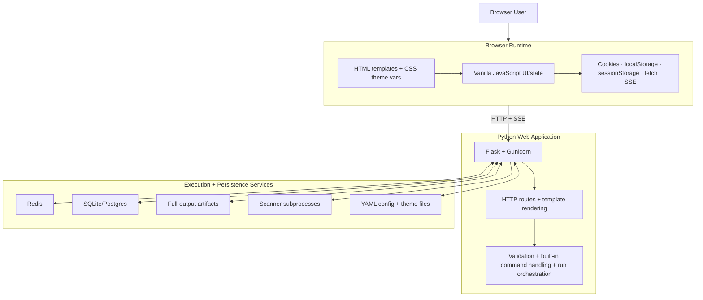
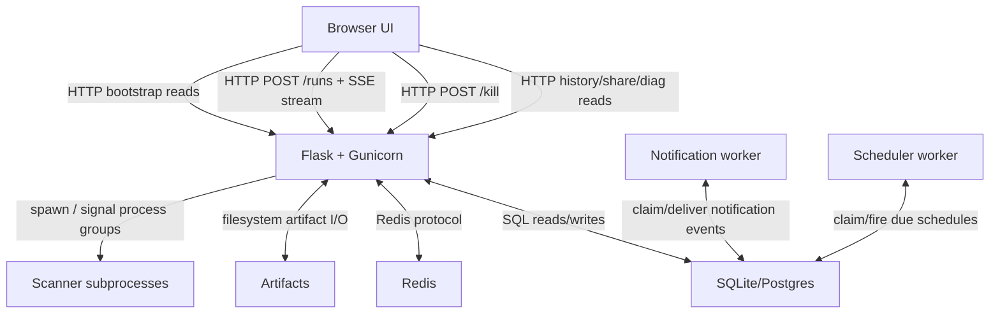
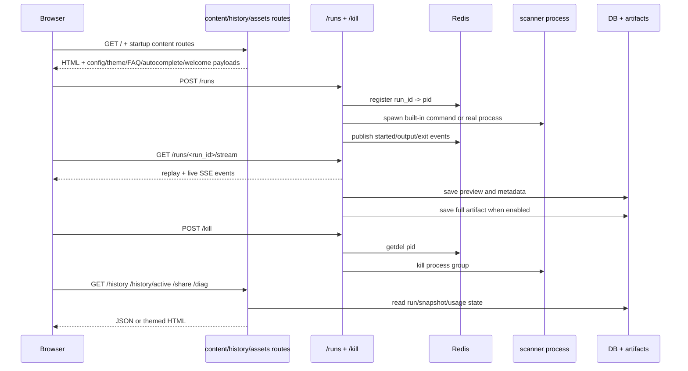
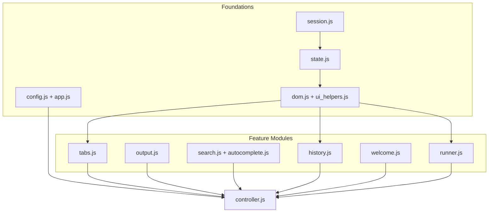
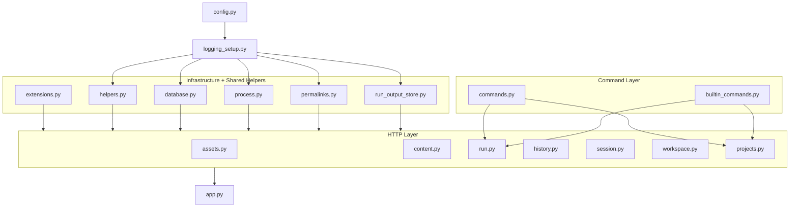
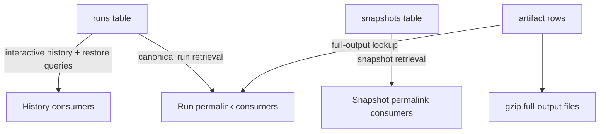
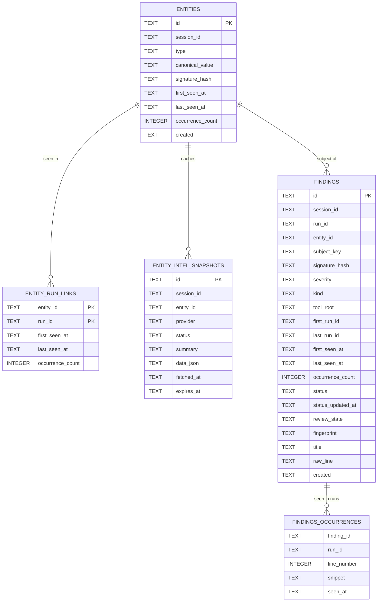
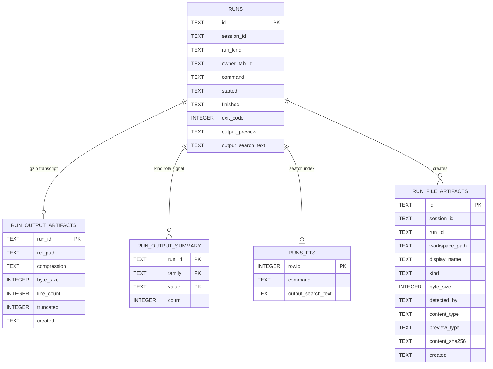
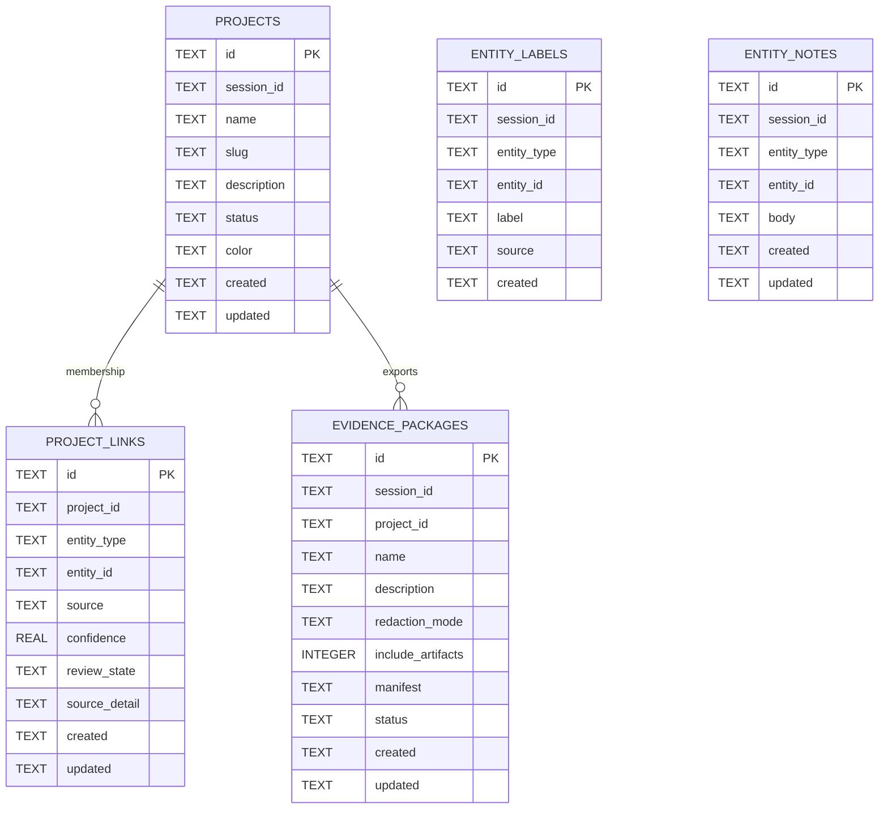

# Architecture

This document explains how darklab_shell is put together today: runtime boundaries, request flow, browser code, backend code, persistence, observability, and tests.

For the architectural rationale, tradeoffs, and implementation-history notes behind those structures, see [DECISIONS.md](DECISIONS.md).

---

## Table of Contents

- [System Overview](#system-overview)
- [System Structure](#system-structure)
- [Request Flow Walkthroughs](#request-flow-walkthroughs)
- [HTTP Route Inventory](#http-route-inventory)
- [Frontend](#frontend)
- [Back-end Architecture](#back-end-architecture)
- [Run Lifecycle](#run-lifecycle)
- [Secrets and Vault](#secrets-and-vault)
- [Intel and Provider Integrations](#intel-and-provider-integrations)
- [Session Workspace and Files](#session-workspace-and-files)
- [Projects Workspace](#projects-workspace)
- [Atlas and Entity Model](#atlas-and-entity-model)
- [State And Persistence](#state-and-persistence)
- [Observability And Diagnostics](#observability-and-diagnostics)
- [Security Model](#security-model)
- [Configuration Surfaces](#configuration-surfaces)
- [Theme System](#theme-system)
- [Test Suite](#test-suite)
- [Related Docs](#related-docs)

---

## System Overview

darklab_shell is a web-based shell for running network diagnostics and vulnerability scanning commands against remote targets. It uses Flask + Gunicorn on the backend, an ES module browser frontend with explicit imports and documented browser boundaries, SQLite by default or Postgres for larger deployments, Redis for shared live-run state, and SSE for live output.

At a high level, it works like this:

- The browser loads a Flask-rendered shell page, then fetches focused startup data from routes such as `/config`, `/themes`, `/faq`, `/autocomplete`, and `/welcome*`.
- Command execution starts with `POST /runs` and streams through replayable `/runs/<run_id>/stream` SSE subscriptions. The backend validates and rewrites commands, handles app-native built-ins, starts isolated scanner subprocesses when needed, and publishes output events.
- Redis stores shared state that must work across multiple Gunicorn workers: route and dynamic-request rate limits, active run PID tracking for `/kill`, production run-broker replay, and interactive PTY event/control streams.
- The configured database stores completed run metadata, preview output, snapshots, and full-output file metadata so history and share links survive restarts.
- The browser client has no build step. Classic scripts share one global runtime, and browser cookies/storage handle local continuity around session identity, preferences, and reload restore.
- The Docker runtime uses two unprivileged users: Gunicorn runs as `appuser`, while user-submitted commands run as `scanner` with the shared `appuser` group. That group lets validated Files workspace entries stay group-readable or group-writable without making them world-readable.

The rest of this document is organized by concern rather than file order: system structure first, then browser/backend composition, then core runtime flows such as run lifecycle, state, observability, and security.

---

## System Structure

Start here for the stable big-picture views before the doc dives into request flow, browser behavior, and persistence details.

### Logical Runtime Layers


```mermaid
flowchart TB
  User["Browser User"]

  subgraph Client["Browser Runtime"]
    Templates["HTML templates + CSS theme vars"]
    JS["Vanilla JavaScript UI/state"]
    BrowserApis["Cookies · localStorage · sessionStorage · fetch · SSE"]
  end

  subgraph App["Python Web Application"]
    Flask["Flask + Gunicorn"]
    Routing["HTTP routes + template rendering"]
    Orchestration["Validation + built-in command handling + run orchestration"]
  end

  subgraph Runtime["Execution + Persistence Services"]
    Redis["Redis"]
    Database["SQLite/Postgres"]
    Artifacts["Full-output artifacts"]
    Subprocesses["Scanner subprocesses"]
    Config["YAML config + theme files"]
  end

  User --> Client
  Client -->|HTTP + SSE| Flask
  Templates --> JS
  JS --> BrowserApis
  Flask --> Routing
  Routing --> Orchestration
  Flask <--> Redis
  Flask <--> Database
  Flask <--> Artifacts
  Flask --> Subprocesses
  Flask <--> Config
```

This diagram is intentionally about runtime layers rather than individual modules. It answers “which layer owns which responsibility?” without duplicating the more detailed diagrams later in the doc.

- the browser owns rendering, local interaction state, and web APIs such as cookies, `localStorage`, `sessionStorage`, `fetch`, and SSE reads
- the Python web app owns routing, template rendering, config/theme loading, request validation, built-in command handling, and real command setup
- Redis owns the cross-worker coordination that cannot safely live inside one Gunicorn worker process
- The configured database and output files own the run/share state that must survive reloads and restarts
- scanner subprocesses are a distinct execution boundary rather than an in-process extension of the Flask app
- YAML config and theme files are shown separately because they shape both backend behavior and frontend presentation, even though they load from the local filesystem rather than over the network

This section should stay stable even when app modules, blueprints, or frontend files move around. The sections below cover those app-level pieces directly.

### Runtime Topology


```mermaid
flowchart TB
  Browser["Browser UI"]
  Flask["Flask + Gunicorn"]
  Redis["Redis"]
  Database["SQLite/Postgres"]
  Artifacts["Artifacts"]
  Scanner["Scanner subprocesses"]
  Notifier["Notification worker"]
  Scheduler["Scheduler worker"]

  Browser -->|HTTP bootstrap reads| Flask
  Browser -->|HTTP POST /runs + SSE stream| Flask
  Browser -->|HTTP POST /kill| Flask
  Browser -->|HTTP history/share/diag reads| Flask

  Flask <--> |Redis protocol| Redis
  Flask <--> |SQL reads/writes| Database
  Flask <--> |filesystem artifact I/O| Artifacts
  Flask -->|spawn / signal process groups| Scanner
  Notifier <--> |claim/deliver notification events| Database
  Scheduler <--> |claim/fire due schedules| Database
```

This is the transport and boundary view. It focuses on stable communication paths rather than the internal modules that implement them.

- browser traffic is plain HTTP plus one-way SSE streaming for live command output
- Redis is used for shared worker coordination and brokered active-run event replay, not as a general application datastore
- The configured database and output files are the durable history/share boundary
- command execution remains out-of-process, which keeps the Flask worker lifecycle separate from tool execution
- outbound notification delivery runs in its own supervised process and claims queued delivery rows from the database, so Flask workers do not send external notifications inline
- the scheduler runs in its own supervised process, uses an exclusive deployment-wide lock, and owns time-based schedule ticks outside the Flask worker lifecycle

---

## Request Flow Walkthroughs


```mermaid
sequenceDiagram
  participant B as Browser
  participant C as content/history/assets routes
  participant R as /runs + /kill
  participant X as Redis
  participant P as scanner process
  participant D as DB + artifacts

  B->>C: GET / + startup content routes
  C-->>B: HTML + config/theme/FAQ/autocomplete/welcome payloads

  B->>R: POST /runs
  R->>X: register run_id -> pid
  R->>P: spawn built-in command or real process
  R->>X: publish started/output/exit events
  B->>R: GET /runs/<run_id>/stream
  R-->>B: replay + live SSE events
  R->>D: save preview and metadata
  R->>D: save full artifact when enabled

  B->>R: POST /kill
  R->>X: getdel pid
  R->>P: kill process group

  B->>C: GET /history /history/active /share /diag
  C->>D: read run/snapshot/usage state
  C-->>B: JSON or themed HTML
```

There are three core request classes:

- content/bootstrap reads
- run/kill lifecycle
- history/share/diagnostic reads

`/history/active` is part of that third class. It exposes in-flight run metadata for the active personal or team scope so the browser can rebuild running tabs after a reload, keep kill available, render the submitted command as a normal prompt line, and subscribe back to `/runs/<run_id>/stream` for replay plus live output. Active-run metadata includes a browser-level origin identity (`owner_client_id`), the originating terminal tab id (`owner_tab_id`), the active `team_id` when a run belongs to a team, and `owner_last_seen` liveness so another browser does not automatically take over a live terminal it did not start. If the origin is another live client, Status Monitor can attach a local tab to the broker stream on demand. The active personal/team scope is the visibility boundary: personal runs stay limited to the session token, while team runs are visible to team members. Any actor that can see the active run and has run-command permission for that team can explicitly kill it, and subscribed peers receive a broker `killed` event such as `[killed by another browser]`. Non-running tabs and drafts are restored separately from browser `sessionStorage`, which keeps the reload path split cleanly between browser-owned idle state and server-owned active-run state.

That split is reflected directly in the blueprint structure.

---

## HTTP Route Inventory

This route list belongs in the architecture document because it describes the application surface that contributors maintain, not the operator workflow.
Methods below list the routes declared by the app; Flask may add automatic `HEAD` and `OPTIONS` handling for those routes.
The `/static/<path:filename>` row is included even though Flask registers it automatically rather than through a blueprint decorator.

### Content And Bootstrap Routes

| Method | Endpoint | Description |
| -------- | ---------- | ------------- |
| `GET` | `/` | Serves the Flask-rendered shell UI, frontend bootstrap config, active theme CSS variables, and initial rail state. |
| `GET` | `/config` | Returns browser-facing runtime config derived from `config.yaml` and `config.local.yaml`. |
| `GET` | `/themes` | Returns the active theme plus the complete theme registry used by the Options modal. |
| `GET` | `/allowed-commands` | Returns the allowed command prefixes grouped from `commands.yaml` for command reference surfaces. |
| `GET` | `/commands/catalog` | Returns compact command registry entries for the Command Registry modal and sheet. |
| `GET` | `/commands/catalog/<root>` | Returns the app-native command reference payload for one supported external command root. |
| `GET` | `/commands/catalog/<root>/<subcommand>` | Returns a subcommand-scoped command reference payload when the registry has subcommand metadata. |
| `GET` | `/faq` | Returns built-in FAQ entries plus custom `faq.yaml` entries, including their display sections. |
| `GET` | `/workflows` | Returns active personal/team user workflows followed by built-in and custom `workflows.yaml` entries, filtered by feature gates such as Files/workspace support. |
| `GET` | `/shortcuts` | Returns the keyboard shortcut reference used by the `shortcuts` built-in and the browser overlay. |
| `GET` | `/autocomplete` | Returns merged external-command and app-owned built-in autocomplete context, built-in command roots, and special command keys. |
| `GET` | `/welcome` | Returns welcome command samples from `welcome.yaml`. |
| `GET` | `/welcome/ascii` | Returns the desktop welcome ASCII banner from `ascii.txt` as plain text. |
| `GET` | `/welcome/ascii-mobile` | Returns the mobile welcome ASCII banner from `ascii_mobile.txt` as plain text. |
| `GET` | `/welcome/hints` | Returns rotating desktop welcome footer hints from `app_hints.txt`. |
| `GET` | `/welcome/hints-mobile` | Returns rotating mobile welcome footer hints from `app_hints_mobile.txt`. |

### Headless API Routes

| Method | Endpoint | Description |
| -------- | ---------- | ------------- |
| `GET` | `/api/v1/health` | Returns unauthenticated API liveness metadata. |
| `GET` | `/api/v1/openapi.json` | Returns the checked-in `/api/v1` OpenAPI contract from the Python spec source. |
| `GET` | `/api/v1/whoami` | Authenticates a `tok_` session token and returns session metadata without echoing the token. |
| `GET` | `/api/v1/teams` | Returns teams joined by the current API token. |
| `POST` | `/api/v1/teams` | Creates a team and returns the one-time recovery code. |
| `GET` | `/api/v1/teams/<team_id>` | Returns team detail with members, invites, and recovery-code metadata. |
| `PATCH` | `/api/v1/teams/<team_id>` | Archives or reactivates one team when the token has the required role; reactivation leaves archive-paused schedules and watchers paused. |
| `POST` | `/api/v1/teams/<team_id>/invites` | Creates a team invite and returns the one-time invite code. |
| `DELETE` | `/api/v1/teams/<team_id>/invites/<invite_id>` | Revokes a team invite. |
| `POST` | `/api/v1/teams/join` | Joins a team by invite code. |
| `PATCH` | `/api/v1/teams/<team_id>/members/<member_id>` | Updates a team member role or display name. |
| `DELETE` | `/api/v1/teams/<team_id>/members/<member_id>` | Removes a member from a team. |
| `POST` | `/api/v1/teams/<team_id>/leave` | Removes the current API token from a team. |
| `POST` | `/api/v1/teams/<team_id>/recovery/rotate` | Rotates a team recovery code and returns the one-time replacement. |
| `POST` | `/api/v1/teams/recovery/redeem` | Redeems a team recovery code into an owner membership. |
| `GET` | `/api/v1/history` | Returns current-token run history with the browser-aligned offset page envelope, search filters, and batched History/Run Details counts. |
| `GET` | `/api/v1/history/search` | Returns paged line-context matches from saved run output using the same backend-aware history search path as the browser. |
| `GET` | `/api/v1/history/<run_id>` | Returns one current-token run summary with artifact, finding, Atlas, label, and note counts. |
| `GET` | `/api/v1/history/<run_id>/output` | Returns stored run output as plain text or JSON using the same preview/full-output behavior as Run Details, with optional line ranges. |
| `GET` | `/api/v1/history/<run_id>/artifacts` | Lists workspace artifacts for one current-token run by stable artifact id. |
| `GET` | `/api/v1/history/<run_id>/artifacts/<artifact_id>` | Streams one current-token run artifact while rejecting cross-run artifact ids. |
| `GET` | `/api/v1/atlas` | Returns active personal/team-scope Atlas entity and finding summary counts with the browser overlay's orphan, suppression, and run filters. |
| `GET` | `/api/v1/atlas/runs` | Returns recent active-scope Atlas source runs with entity and finding counts. |
| `GET` | `/api/v1/atlas/entities` | Returns a paged active-scope Atlas entity list with query, type, project, run, orphan, and suppression filters. |
| `GET` | `/api/v1/atlas/entities/<entity_id>` | Returns one active-scope Atlas entity with source runs, related findings, intel summary, labels, notes, and project links. |
| `GET` | `/api/v1/atlas/findings` | Returns a paged active-scope Atlas finding list with query, project, run, review-state, verification-status, orphan, and suppression filters. |
| `GET` | `/api/v1/atlas/findings/<finding_id>` | Returns one active-scope Atlas finding with recent source occurrences. |
| `GET` | `/api/v1/projects` | Returns a read-only paged project list for the token session. |
| `GET` | `/api/v1/projects/<project_id>` | Returns one read-only project record for the token session. |
| `GET` | `/api/v1/projects/<project_id>/findings` | Returns a read-only paged project findings response using project query services. |
| `GET` | `/api/v1/projects/<project_id>/runs` | Returns a read-only paged project run response using project query services. |
| `GET` | `/api/v1/projects/<project_id>/entities` | Returns a read-only paged project Atlas entity response using project query services. |
| `GET` | `/api/v1/projects/<project_id>/packages` | Returns a read-only paged evidence package list for one project. |
| `GET` | `/api/v1/schedules` | Returns a paged list of normal scheduled commands for the API token's active personal/team scope. |
| `POST` | `/api/v1/schedules` | Creates a normal scheduled command after the same command-policy validation used by browser schedules; team scope requires automation-management permission. |
| `GET` | `/api/v1/schedules/<schedule_id>` | Returns one normal scheduled command in the API token's active personal/team scope. |
| `PATCH` | `/api/v1/schedules/<schedule_id>` | Updates one normal scheduled command's cadence, command, label, timezone, or enabled state; team scope requires automation-management permission. |
| `DELETE` | `/api/v1/schedules/<schedule_id>` | Deletes one normal scheduled command in the API token's active personal/team scope; team scope requires automation-management permission. |
| `POST` | `/api/v1/schedules/<schedule_id>/run-now` | Fires one normal scheduled command immediately and returns the updated schedule row; team scope requires automation-management permission. |
| `GET` | `/api/v1/schedules/<schedule_id>/fires` | Returns paged fire audit rows for one normal scheduled command. |
| `GET` | `/api/v1/watchers` | Returns a paged list of change-detection watchers for the API token's active personal/team scope. |
| `POST` | `/api/v1/watchers` | Creates a watcher from a completed baseline run after command-policy validation; team scope requires automation-management permission. |
| `GET` | `/api/v1/watchers/<watcher_id>` | Returns one change-detection watcher in the API token's active personal/team scope. |
| `PATCH` | `/api/v1/watchers/<watcher_id>` | Updates one watcher's command, cadence, label, timezone, options, or pause/resume state; team scope requires automation-management permission. |
| `DELETE` | `/api/v1/watchers/<watcher_id>` | Deletes one watcher and its owned schedule; team scope requires automation-management permission. |
| `POST` | `/api/v1/watchers/<watcher_id>/run-now` | Fires one watcher immediately and returns the updated watcher row; team scope requires automation-management permission. |
| `POST` | `/api/v1/watchers/<watcher_id>/accept-baseline` | Promotes the latest watcher fire, or the supplied run id, to the new baseline; team scope requires automation-management permission. |
| `GET` | `/api/v1/watchers/<watcher_id>/fires` | Returns paged fire audit rows for one watcher. |
| `GET` | `/api/v1/notification-channels` | Returns masked outbound notification channel metadata for the token session. |
| `GET` | `/api/v1/notification-channel-kinds` | Returns supported outbound notification channel kinds, secret fields, config fields, and trigger labels. |
| `POST` | `/api/v1/notification-channels` | Creates one outbound notification channel with write-only vault-backed secret values. |
| `PATCH` | `/api/v1/notification-channels/<channel_id>` | Updates one outbound notification channel's label, config, triggers, muted state, or replacement secret values. |
| `DELETE` | `/api/v1/notification-channels/<channel_id>` | Deletes one outbound notification channel from the token session. |
| `POST` | `/api/v1/notification-channels/<channel_id>/test` | Queues and synchronously dispatches a canned `test` notification through one channel and returns its delivery status. |
| `GET` | `/api/v1/notification-events` | Returns paged notification delivery audit rows with optional channel, trigger, and status filters. |
| `GET` | `/api/v1/runs` | Returns active current-token runs for CLI and script visibility. |
| `POST` | `/api/v1/runs` | Starts a non-interactive command through the same validation, rewrite, broker, and persistence path as browser runs. |
| `GET` | `/api/v1/runs/<run_id>` | Returns active broker status or completed history status for a current-token run. |
| `GET` | `/api/v1/runs/<run_id>/output` | Returns stored run output as plain text or JSON, with optional line ranges. |
| `POST` | `/api/v1/runs/<run_id>/wait` | Waits for an active run to become terminal or returns a timeout error. |
| `GET` | `/api/v1/runs/<run_id>/ai-assists` | Lists cached and in-flight AI assists for one completed run in the current personal or team scope. |
| `POST` | `/api/v1/runs/<run_id>/ai-summary` | Returns a cached AI summary assist or queues one for the AI worker; team scope requires run-command permission. |
| `POST` | `/api/v1/runs/<run_id>/ai-next-commands` | Returns cached AI next-command drafts or queues them for the AI worker; team scope requires run-command permission. |
| `POST` | `/api/v1/runs/<run_id>/projects/<project_id>` | Links a completed external run to an active project in the token session. |
| `DELETE` | `/api/v1/runs/<run_id>/projects/<project_id>` | Removes a completed external run link from an active project in the token session. |
| `GET` | `/api/v1/runs/<run_id>/stream` | Streams a current-token run as SSE by default or NDJSON when `format=ndjson`. |
| `POST` | `/api/v1/runs/<run_id>/cancel` | Cancels any active run in the token session, including browser-started runs. |

### Run Lifecycle Routes

| Method | Endpoint | Description |
| -------- | ---------- | ------------- |
| `POST` | `/runs` | Validates, expands session variables, rewrites, starts brokered execution, and returns the run id plus stream URL. |
| `GET` | `/runs/<run_id>/stream` | Replays brokered events and follows live output over SSE for a run in the active personal/team scope. |
| `GET` | `/runs/<run_id>/events` | Returns bounded active-scope brokered event backfill for tests and non-SSE clients. |
| `GET` | `/runs/<run_id>/ai-assists` | Lists cached and in-flight AI assists for one completed run in the current personal or team scope. |
| `POST` | `/runs/<run_id>/ai-summary` | Returns a cached AI summary assist or queues one for the AI worker; team scope requires run-command permission. |
| `POST` | `/runs/<run_id>/ai-next-commands` | Returns cached AI next-command drafts or queues them for the AI worker; team scope requires run-command permission. |
| `POST` | `/pty/runs` | Starts a config-gated interactive PTY run for an allowlisted screen tool and returns the PTY run id plus stream URL. |
| `GET` | `/pty/runs/<run_id>/snapshot` | Returns a terminal snapshot, dimensions, and resume event id for active PTY reattach. |
| `GET` | `/pty/runs/<run_id>/stream` | Streams bounded PTY output events over SSE for the active personal/team scope. |
| `POST` | `/pty/runs/<run_id>/input` | Sends bounded keyboard or paste input to an active interactive PTY run. |
| `POST` | `/pty/runs/<run_id>/resize` | Applies browser terminal row/column changes to an active interactive PTY run. |
| `POST` | `/run/client` | Persists allowlisted browser-owned built-in output, such as client-side theme/session commands, as normal run history. |
| `POST` | `/kill` | Kills an active-scope process group by `run_id`, requiring run-command permission for team-owned runs. |

### History And Share Routes

| Method | Endpoint | Description |
| -------- | ---------- | ------------- |
| `GET` | `/history` | Returns paginated current-session history items with run/snapshot/run-subtype filters, linked-run project filters, command/output search, structured output selectors, starred-only filtering, labels/notes, Atlas entity/finding counts for source runs, and command-root summaries. |
| `DELETE` | `/history` | Deletes all run history for the active personal/team scope and removes matching full-output artifacts; team scope requires history-management permission. |
| `POST` | `/history/bulk-delete` | Deletes selected completed active-scope runs, returning per-run results while rejecting running or missing runs without failing the whole request; team scope requires history-management permission. |
| `POST` | `/history/bulk-export` | Streams selected completed current-session runs and snapshots as `txt` or `jsonl`, preserving per-item skipped results for running, missing, or cross-session ids. |
| `GET` | `/history/commands` | Returns newest distinct command strings for prompt history, desktop recents, and mobile recents. |
| `GET` | `/history/stats` | Returns compact current-session counters for the Status Monitor dashboard. |
| `GET` | `/history/insights` | Returns compact visual history data for Status Monitor constellation, heatmap, ticker, and command mix widgets. |
| `GET` | `/history/active` | Returns active-run metadata and telemetry for reload recovery and the Status Monitor. |
| `GET` | `/history/<run_id>/compare-candidates` | Returns ranked previous current-session runs for the History drawer's compare launcher. |
| `GET` | `/history/compare` | Compares two current-session runs, optionally scoped by `project_id` / `baseline_label`, and returns metadata deltas, bounded output hunks, totals, limits, finding/entity/artifact object diffs, and derived tool-aware changes such as nmap port/service and web URL/status deltas. |
| `GET` | `/history/compare/lines` | Returns bounded filtered-output slices for lazy expansion of folded comparison hunks, using `left`/`right` run ids, `side`, `start`/`end`, and optional `project_id` scoping. |
| `GET` | `/history/<run_id>` | Serves an implicit-bearer styled run permalink, or raw JSON with `?json`; uses full-output artifacts when available unless `?preview=1` is set, and includes same-session Atlas counts for source runs. |
| `GET` | `/history/<run_id>/atlas-cleanup-preview` | Previews disposable and curated single-source Atlas rows that can be removed with a run delete. |
| `DELETE` | `/history/<run_id>` | Deletes one active-scope run and its matching full-output artifact; team scope requires history-management permission, `prune_atlas=1` removes disposable Atlas rows only linked to that run, and `prune_curated_atlas=1` also removes curated single-source rows. |
| `POST` | `/share` | Saves a tab snapshot, omits raw-only intel response bodies, optionally applies share redaction, and returns a snapshot permalink URL. |
| `POST` | `/share/bulk-delete` | Deletes selected current-session snapshot permalinks, returning per-snapshot results without failing the whole request. |
| `GET` | `/share/<share_id>` | Serves a styled snapshot permalink, or raw JSON with `?json`. |
| `DELETE` | `/share/<share_id>` | Deletes one current-session snapshot permalink. |

Run comparison applies bounded transcript-diff caps before returning hunk payloads:
`COMPARE_MAX_CHANGED_LINES` limits emitted changed-line units to 2,000,
`COMPARE_MAX_HUNKS` limits emitted change blocks to 3,000,
`COMPARE_INLINE_EQUAL_CONTEXT` inlines three equal context lines on each side of a change,
`COMPARE_LINE_DISPLAY_TRUNCATE` caps displayed line text at 4,000 characters with client-side expansion,
`COMPARE_LAZY_EQUAL_PAGE_LIMIT` pages folded equal regions at 5,000 lines, and
`COMPARE_LAZY_EQUAL_BYTE_LIMIT` caps each lazy equal-region page at 512,000 UTF-8 bytes.
Replace-line pairing is bounded by `COMPARE_REPLACE_PAIR_CANDIDATES` (32 nearest candidate lines)
and accepts pairs at `COMPARE_REPLACE_PAIR_MIN_RATIO` (0.5), with a matching
`COMPARE_REPLACE_PAIR_QUICK_RATIO` prefilter to avoid expensive full similarity checks when the
cheap upper bound is already below the threshold. Transcript hunks preserve source output order.
Finding and artifact object diffs are intentionally order-insensitive: finding keys normalize
stored `raw_line` / `title` text with fingerprint fallback, while artifact keys prefer
`content_sha256`, then workspace path, then artifact id.
The compare payload also includes a bounded `derived_changes` block for tool-aware summaries.
Its nmap port/service group reuses the shared diff classifier, while the web URL/status group
uses line-attached URL entities plus confident `httpx`, `ffuf`, `gobuster`, and `katana` output
parsers to report added, removed, and changed records. Derived records carry output-line pointers
mapped through the same compare-line indexes used by finding jump actions.

### Atlas Routes

| Method | Endpoint | Description |
| -------- | ---------- | ------------- |
| `GET` | `/atlas` | Returns active personal/team-scope Atlas entity counts by entity type, honoring optional source-run, orphan-source, and suppression filters. |
| `GET` | `/atlas/views` | Lists saved Atlas views for the current session token. |
| `POST` | `/atlas/views` | Saves a named Atlas view with its tab, search, filter, review-state, project-scope, and source-run state. |
| `PUT` | `/atlas/views/<view_id>` | Updates a saved Atlas view for the current session token. |
| `DELETE` | `/atlas/views/<view_id>` | Deletes a saved Atlas view for the current session token. |
| `POST` | `/atlas/imports/preview` | Parses an uploaded Atlas import file, stores a short-lived draft, and returns candidate counts, samples, warnings, and a row-set digest. |
| `POST` | `/atlas/imports/apply` | Applies a previewed Atlas import draft after rechecking the row-set digest, scope, permissions, and selected apply options. |
| `GET` | `/atlas/runs` | Returns recent or searched active-scope source runs that contribute Atlas rows for the Atlas run filter. |
| `GET` | `/atlas/entities` | Returns a paginated active-scope entity list, with optional `type`, text search, project, source-run, orphan-source, suppression, limit, and offset parameters. |
| `GET` | `/atlas/entities/export` | Downloads active-scope Atlas entity rows as CSV or JSONL, honoring optional type, text, project, source-run, orphan-source, suppression, and limit filters. |
| `GET` | `/atlas/entities/<entity_id>` | Returns one active-scope entity with source runs, labels, notes, project links, cached intel snapshots, and related findings. |
| `GET` | `/atlas/runs/<run_id>/cleanup-preview` | Previews personal/current-session disposable and curated single-source Atlas rows that can be removed when cleaning one source run while keeping the run transcript; this destructive cleanup preview is not team-scoped. |
| `POST` | `/atlas/runs/<run_id>/cleanup` | Detaches one personal/current-session run from Atlas, deletes disposable rows that only came from that run, optionally deletes curated single-source rows, and recalculates remaining entity/finding counts; this destructive cleanup path is not team-scoped. |
| `POST` | `/atlas/entities/bulk-delete` | Deletes selected personal/current-session Atlas entities and any findings attached to those entities; this destructive delete path is not team-scoped. |
| `POST` | `/atlas/entities/suppression` | Suppresses or restores selected active-scope Atlas entities without deleting their source data. |
| `GET` | `/atlas/entities/<entity_id>/delete-preview` | Previews personal/current-session related Atlas cleanup before deleting an entity; this destructive preview is not team-scoped. |
| `DELETE` | `/atlas/entities/<entity_id>` | Deletes one personal/current-session Atlas entity and its attached findings, with optional same-source cleanup for disposable or curated single-source siblings; this destructive delete path is not team-scoped. |
| `PUT` | `/atlas/entities/<entity_id>/suppression` | Suppresses or restores one active-scope Atlas entity without deleting its source data. |
| `GET` | `/atlas/findings` | Returns the paginated active-scope Atlas Findings queue with optional text, project, source-run, review-state, verification-status, orphan-source, suppression, limit, and offset filters. |
| `POST` | `/atlas/findings/review` | Bulk-updates the review state for selected active-scope findings. |
| `POST` | `/atlas/findings/bulk-delete` | Deletes selected personal/current-session Atlas findings; this destructive delete path is not team-scoped. |
| `POST` | `/atlas/findings/suppression` | Suppresses or restores selected active-scope Atlas findings without deleting their source data. |
| `GET` | `/atlas/findings/<finding_id>/delete-preview` | Previews personal/current-session same-source cleanup before deleting a finding; this destructive preview is not team-scoped. |
| `DELETE` | `/atlas/findings/<finding_id>` | Deletes one personal/current-session Atlas finding, with optional same-source cleanup for disposable or curated single-source siblings; this destructive delete path is not team-scoped. |
| `PUT` | `/atlas/findings/<finding_id>/suppression` | Suppresses or restores one active-scope Atlas finding without deleting its source data. |
| `POST` | `/atlas/entities/<entity_id>/refresh_intel` | Refreshes app-native intel for one active-scope entity and stores provider snapshots on the entity. |
| `POST` | `/atlas/entities/<entity_id>/project_links` | Adds an active-scope Atlas entity to a project through the shared project-link model. |
| `DELETE` | `/atlas/entities/<entity_id>/project_links/<project_id>` | Removes an active-scope Atlas entity from a project. |

**Atlas import preview/apply contract.** `POST /atlas/imports/preview` accepts
multipart form data with `file`, `format_id`, `source_tool`, and `import_name`.
The route uses the current personal or `X-Team-ID` scope, parses only the
declared format, stores a short-lived draft, and returns `ok`, `draft_id`,
`row_set_digest`, `expires_at`, `counts`, bounded `samples`, bounded `warnings`,
and `apply_options`. Preview `counts` include `rows`, `valid`, `skipped`,
`warnings`, `new`, `updated`, `duplicate`, `entity_valid`, `entity_new`,
`entity_duplicate`, `finding_valid`, `finding_new`, `finding_duplicate`,
`finding_subject_entities_to_create`, and `project_target_candidates`.
`apply_options` has `import_entities`, `import_findings`, `link_to_project`, and
`create_project_targets`; each option reports whether it is available and which
team capability names it requires.

`POST /atlas/imports/apply` accepts JSON with `draft_id`, `row_set_digest`,
`options`, and optional `project_id`. `options` uses the same four boolean keys
returned by preview. `project_id` is required when `link_to_project` or
`create_project_targets` is true. Apply reloads the persisted draft, recomputes
current counts, rechecks configured limits, verifies the row-set digest, checks
the selected options against team capabilities, and confirms the project is still
accessible before writing. Successful apply returns `ok`, `batch_id`, and
`counts`; repeated apply of an already-applied draft returns the same shape with
`already_applied: true` and the existing batch id instead of duplicating rows.
Apply count keys include `entities_created`, `entities_updated`,
`findings_created`, `findings_updated`, `entity_links`,
`finding_occurrences`, `project_links_added`, `project_links_existing`,
`project_targets_created`, `project_targets_existing`, and
`required_capabilities`. The Project target option creates or reuses the Atlas
entity needed to represent each target, so entity counts can increase even when
only `create_project_targets` is selected.

Both routes return the standard safe error envelope
`{"error": "<code>", "message": "<message>"}` for import workflow failures.
Client-visible error codes include `session_required`, `file_required`,
`invalid_json`, `invalid_import_file`, `import_limit_exceeded`,
`no_apply_options`, `project_required`, `draft_not_found`, `draft_expired`,
`digest_mismatch`, `draft_apply_in_progress`, `draft_not_applyable`,
`team_forbidden`, `project_not_found`, and `project_quota_exceeded`.

### Schedule Routes

| Method | Endpoint | Description |
| -------- | ---------- | ------------- |
| `GET` | `/schedules` | Lists normal scheduled runs for the active personal/team scope. |
| `GET` | `/schedules/preview` | Returns the next three fire times for a cron expression or cadence preset without writing a schedule row. |
| `GET` | `/schedules/<schedule_id>` | Returns one normal schedule in the active personal/team scope. |
| `POST` | `/schedules` | Creates a normal scheduled run after validating the command, cadence, timezone, and scoped schedule cap; team scope requires automation-management permission. |
| `PATCH` | `/schedules/<schedule_id>` | Updates one active-scope schedule and re-validates changed command or cadence fields; team scope requires automation-management permission. |
| `DELETE` | `/schedules/<schedule_id>` | Deletes one active-scope normal schedule; team scope requires automation-management permission. |
| `POST` | `/schedules/<schedule_id>/run-now` | Fires one active-scope schedule immediately from the web worker and records a schedule fire audit row; team scope requires automation-management permission. |
| `GET` | `/schedules/<schedule_id>/fires` | Returns paged fire audit rows for one active-scope normal schedule. |

### Watcher Routes

| Method | Endpoint | Description |
| -------- | ---------- | ------------- |
| `GET` | `/watchers` | Lists change-detection watchers for the active personal/team scope, including owned schedule metadata. |
| `POST` | `/watchers` | Creates a watcher from a completed active-scope baseline run, inheriting the baseline command unless an override command is supplied; team scope requires automation-management permission. |
| `PATCH` | `/watchers/<watcher_id>` | Updates one active-scope watcher label, cadence, timezone, options, command override, or pause/resume state; team scope requires automation-management permission. |
| `DELETE` | `/watchers/<watcher_id>` | Deletes one active-scope watcher and its owned schedule and fire audit rows; team scope requires automation-management permission. |
| `GET` | `/watchers/<watcher_id>/fires` | Returns paged watcher fire audit rows for one active-scope watcher. |
| `POST` | `/watchers/<watcher_id>/accept-baseline` | Promotes the latest watcher fire, or a supplied run id, to the watcher's new baseline and resets changed/error counters; team scope requires automation-management permission. |
| `POST` | `/watchers/<watcher_id>/run-now` | Fires one active-scope watcher immediately from the web worker and records schedule and watcher fire audit rows; team scope requires automation-management permission. |

### Session Routes

| Method | Endpoint | Description |
| -------- | ---------- | ------------- |
| `GET` | `/session/token/generate` | Generates and stores a new persistent `tok_...` session token. |
| `GET` | `/session/token/info` | Returns the active named token and creation timestamp, or null fields for anonymous sessions. |
| `POST` | `/session/token/revoke` | Revokes a named token so new requests with that token fall back to anonymous session handling. |
| `POST` | `/session/token/verify` | Checks whether a supplied `tok_...` token was issued by this server. |
| `GET` | `/session/recent-values` | Returns recent target values for the active personal/team scope and metadata-gated autocomplete suggestions. |
| `POST` | `/session/recent-values` | Saves normalized recent values for the active personal/team scope and prunes each value kind to the autocomplete cap. |
| `POST` | `/session/migrate` | Migrates runs, snapshots, starred commands, preferences, command variables, user workflows, project workspace records, recent values, and non-conflicting workspace paths between session IDs. |
| `GET` | `/session/secrets` | Lists encrypted secret names, consumer env bindings, and update timestamps for the active personal/team scope without returning values. |
| `POST` | `/session/secrets` | Creates or replaces one encrypted personal/team secret value for the active scope. |
| `POST` | `/session/secrets/rotate` | Re-wraps the active personal/team scope's encrypted secret rows under the active master key. |
| `DELETE` | `/session/secrets/<name>` | Removes one encrypted secret from the active personal/team scope. |
| `GET` | `/session/teams` | Lists teams available to the current durable session token. |
| `POST` | `/session/teams` | Creates a team for the current durable session token and returns the one-time recovery code. |
| `GET` | `/session/teams/<team_id>` | Returns team detail for a team the current token belongs to. |
| `GET` | `/session/teams/<team_id>/activity` | Returns owner/admin-scoped safe activity rows for the selected team. |
| `PATCH` | `/session/teams/<team_id>` | Archives or reactivates a team when the current member has archive-team capability; archiving pauses team schedules and watchers in place, and reactivation keeps them paused until resumed. |
| `POST` | `/session/teams/<team_id>/invites` | Creates a role-scoped team invite when the current member has invite-management capability. |
| `DELETE` | `/session/teams/<team_id>/invites/<invite_id>` | Revokes one team invite when the current member has invite-management capability. |
| `POST` | `/session/teams/join` | Redeems a team invite code for the current durable session token. |
| `PATCH` | `/session/teams/<team_id>/members/<member_id>` | Updates one team member's display name or role when the current member has the matching capability. |
| `DELETE` | `/session/teams/<team_id>/members/<member_id>` | Removes one team member without deleting team-owned data. |
| `POST` | `/session/teams/<team_id>/leave` | Removes the current token from a team while preserving the last-owner guard. |
| `POST` | `/session/teams/<team_id>/recovery/rotate` | Rotates a team's one-time recovery code for owners. |
| `POST` | `/session/teams/recovery/redeem` | Promotes the current durable token to team owner when it presents the active recovery code. |
| `GET` | `/session/notification-events` | Lists recent outbound notification delivery audit rows for the current durable session token. |
| `GET` | `/session/notification-channels` | Lists masked outbound notification channel metadata for the current durable session token. |
| `GET` | `/session/notification-channel-kinds` | Returns supported outbound notification channel kinds, secret fields, config fields, and trigger labels for the browser editor. |
| `POST` | `/session/notification-channels` | Creates one outbound notification channel with write-only vault-backed secret values. |
| `PATCH` | `/session/notification-channels/<channel_id>` | Updates one outbound notification channel's label, config, triggers, muted state, or replacement secret values. |
| `DELETE` | `/session/notification-channels/<channel_id>` | Removes one outbound notification channel from the current durable session token. |
| `POST` | `/session/notification-channels/<channel_id>/test` | Queues and synchronously dispatches a canned `test` notification through one channel and returns its delivery status. |
| `GET` | `/session/preferences` | Returns the current session's normalized saved Options snapshot. |
| `POST` | `/session/preferences` | Persists the current session's normalized saved Options snapshot. |
| `POST` | `/session/tour-seen` | Records that the current session opened the current onboarding tour version. |
| `GET` | `/session/variables` | Returns current session command-variable names and values for autocomplete and runtime refresh. |
| `GET` | `/session/workflows` | Returns user-created workflows in the active personal/team scope. |
| `POST` | `/session/workflows` | Creates a user workflow in the active personal/team scope. Team-scope writes require an owner/admin role. |
| `GET` | `/session/workflows/<workflow_id>` | Returns one user workflow in the active personal/team scope. |
| `PUT` | `/session/workflows/<workflow_id>` | Updates one user workflow in the active personal/team scope. Team-scope writes require an owner/admin role. |
| `DELETE` | `/session/workflows/<workflow_id>` | Deletes one user workflow in the active personal/team scope. Team-scope writes require an owner/admin role. |
| `GET` | `/session/run-count` | Returns uncapped run count plus workspace file, user workflow, and recent-value counts for migration confirmation. |
| `GET` | `/session/starred` | Returns the current session's starred command list. |
| `POST` | `/session/starred` | Adds one command to the current session's starred list. |
| `DELETE` | `/session/starred` | Removes one command, or clears the whole starred list, for the current session. |

### Project Routes

| Method | Endpoint | Description |
| -------- | ---------- | ------------- |
| `GET` | `/projects` | Returns active-scope projects, excluding archived projects unless requested. `mode=switcher` returns a bounded active-project switcher list with active/MRU ordering or server-side name search. |
| `POST` | `/projects` | Creates an active-scope project/case folder. |
| `GET` | `/projects/active` | Returns the active personal/team scope's active project context, or null when none is set. |
| `POST` | `/projects/active` | Sets the active project context after validating active-scope ownership. |
| `DELETE` | `/projects/active` | Clears the active project context for the active personal/team scope. |
| `GET` | `/projects/<project_id>` | Returns one active-scope project. |
| `GET` | `/projects/<project_id>/summary` | Returns one project plus linked-record, package, and derived metadata counts. |
| `GET` | `/projects/<project_id>/overview` | Returns the scoped target intelligence overview for one project, including target rollups, provider highlights, certificate status, recent-change state, and deep-link filter hints. |
| `GET` | `/projects/<project_id>/activity` | Returns scoped, user-safe audit activity for one active-scope project with filters and offset pagination. |
| `GET` | `/projects/<project_id>/monitoring` | Returns scoped watcher monitor cards, status counts, filter metadata, derived groups, and fire timeline rows for one active-scope project. |
| `GET` | `/projects/<project_id>/digest-settings` | Returns scoped Project digest settings, available notification channels, and whether the current actor can edit them. |
| `PATCH` | `/projects/<project_id>/digest-settings` | Updates scoped Project digest enabled state, cadence, explicit channels, and quiet-digest behavior. |
| `GET` | `/projects/<project_id>/monitoring/summary` | Returns the digest-ready monitoring summary for one active-scope project. |
| `PATCH` | `/projects/<project_id>/monitoring/fires/<fire_id>` | Updates one scoped monitoring fire's acknowledgement state and note. |
| `GET` | `/projects/package-presets` | Returns the normalized evidence package preset catalog for the browser wizard. |
| `PUT` | `/projects/<project_id>` | Updates project display metadata, status, entity-note-backed notes, and slug. |
| `DELETE` | `/projects/<project_id>` | Deletes project metadata and project links without deleting linked source records. |
| `GET` | `/projects/<project_id>/runs` | Lists project-linked runs in bounded pages with per-run counts. |
| `GET` | `/projects/<project_id>/entities` | Lists project-linked Atlas entities in bounded pages with entity-type counts. |
| `GET` | `/projects/<project_id>/links` | Lists run source records linked into a project. |
| `POST` | `/projects/<project_id>/links` | Links supported active-scope runs or Atlas entities into a project. Run-link payloads can also include the run's Atlas entities. |
| `DELETE` | `/projects/<project_id>/links` | Removes supported run or Atlas entity links from a project. Run-unlink payloads can also remove same-run disposable Atlas entity links, with a separate opt-in for curated entity links. |
| `POST` | `/projects/<project_id>/links/run-entities/preview` | Counts Atlas entities that can be added with selected run links. |
| `POST` | `/projects/<project_id>/links/run-entities/remove-preview` | Counts same-run disposable and curated Atlas entity links, plus related project finding impact, before selected run links are removed. |
| `GET` | `/projects/<project_id>/auto-promote-rules` | Lists project-owned Atlas auto-promote rules. |
| `POST` | `/projects/<project_id>/auto-promote-rules/preview` | Previews Atlas entities that would match an auto-promote rule payload without creating links. |
| `POST` | `/projects/<project_id>/auto-promote-rules` | Creates a project-owned Atlas auto-promote rule. |
| `PUT` | `/projects/<project_id>/auto-promote-rules/<rule_id>` | Updates one project-owned Atlas auto-promote rule. |
| `DELETE` | `/projects/<project_id>/auto-promote-rules/<rule_id>` | Deletes one project-owned Atlas auto-promote rule without removing links it previously created. |
| `POST` | `/projects/<project_id>/auto-promote-rules/<rule_id>/apply` | Applies one stored auto-promote rule to current Atlas entities and creates any missing project links. |
| `GET` | `/projects/<project_id>/targets` | Lists project-scoped targets. |
| `POST` | `/projects/<project_id>/targets` | Adds an idempotent project target. |
| `PUT` | `/projects/<project_id>/targets/<target_id>` | Updates one project target. |
| `DELETE` | `/projects/<project_id>/targets/<target_id>` | Deletes one project target. |
| `GET` | `/projects/<project_id>/report` | Returns the saved engagement report draft for a project, or a default draft when none exists. |
| `POST` | `/projects/<project_id>/report` | Saves a project engagement report draft with optimistic concurrency checks. |
| `POST` | `/projects/<project_id>/report/preview` | Renders a project report preview as Markdown and HTML without creating a download artifact. |
| `POST` | `/projects/<project_id>/report/export` | Starts a polled engagement report archive export job. |
| `GET` | `/projects/<project_id>/report/export-jobs/<job_id>` | Returns the current report export job status. |
| `GET` | `/projects/<project_id>/report/export-jobs/<job_id>/download` | Downloads a completed report export archive and cleans up the temporary archive. |
| `POST` | `/projects/<project_id>/report/export-jobs/<job_id>/download-ticket` | Issues a short-lived browser download URL for a completed report export job. |
| `GET` | `/projects/<project_id>/packages` | Lists draft evidence package manifests for a project. |
| `POST` | `/projects/<project_id>/packages` | Creates a draft evidence package manifest from current project records, with optional package labels/notes. |
| `GET` | `/projects/<project_id>/packages/<package_id>` | Returns one draft evidence package manifest. |
| `GET` | `/projects/<project_id>/packages/<package_id>/download` | Downloads one draft evidence package archive. |
| `POST` | `/projects/<project_id>/packages/<package_id>/download-jobs` | Starts a polled evidence package archive build job. |
| `GET` | `/projects/<project_id>/packages/<package_id>/download-jobs/<job_id>` | Returns the current archive build job status. |
| `GET` | `/projects/<project_id>/packages/<package_id>/download-jobs/<job_id>/download` | Downloads a completed archive build job and cleans up the temporary archive. |
| `POST` | `/projects/<project_id>/packages/<package_id>/download-jobs/<job_id>/download-ticket` | Issues a short-lived browser download URL for a completed evidence package archive job. |
| `DELETE` | `/projects/<project_id>/packages/<package_id>` | Deletes one draft evidence package manifest. |
| `GET` | `/projects/<project_id>/artifacts` | Lists project-linked run artifacts in bounded pages with optional run and target filters. |
| `GET` | `/projects/<project_id>/artifacts/<artifact_id>/preview` | Returns text preview content for one project-linked run artifact. |
| `GET` | `/projects/<project_id>/artifacts/<artifact_id>/download` | Downloads one available project-linked run artifact from the workspace. |
| `POST` | `/projects/<project_id>/artifacts/<artifact_id>/download-ticket` | Issues a short-lived browser download URL for one available project-linked run artifact. |
| `GET` | `/projects/<project_id>/findings` | Lists findings reached through project-linked runs or linked Atlas entities, with run, target, review-state, verification-status, command-root, severity, scope, label, and note-state filters. |
| `POST` | `/projects/<project_id>/findings/review` | Updates the review state for selected active-scope findings that are visible through the project. |
| `GET` | `/entities/run/<run_id>/findings` | Lists persisted findings captured for an active-scope run. |
| `PUT` | `/findings/<finding_id>/review` | Updates the review state for one active-scope finding. |
| `GET` | `/findings/<finding_id>/triage` | Returns remediation, verification steps, verification status, and verification notes for one active-scope finding. This is an internal browser route, not an API v1 route. |
| `PUT` | `/findings/<finding_id>/triage` | Saves remediation, verification steps, verification status, and verification notes for one active-scope finding when the current role can triage findings. This is an internal browser route, not an API v1 route. |
| `GET` | `/entities/<entity_type>/<path:entity_id>/labels` | Lists active-scope labels for a supported entity. |
| `POST` | `/entities/<entity_type>/<path:entity_id>/labels` | Adds an idempotent manual active-scope label to a supported entity. |
| `DELETE` | `/entities/<entity_type>/<path:entity_id>/labels` | Removes one manual active-scope label from a supported entity. |
| `GET` | `/entities/<entity_type>/<path:entity_id>/note` | Returns the active-scope note for a supported entity. |
| `PUT` | `/entities/<entity_type>/<path:entity_id>/note` | Creates or replaces the one active-scope note for a supported entity. |
| `DELETE` | `/entities/<entity_type>/<path:entity_id>/note` | Deletes the active-scope note for a supported entity. |

### Project Monitoring Route Contract

`services.projects.monitoring` builds the Project Monitoring payload used by the browser Monitoring tab and the lightweight summary route. It scopes rows through the same personal/team owner helpers as the rest of Projects, then selects watchers whose `project_id` matches the requested project. The Monitoring tab can open the shared Watchers modal with the current project preselected, and the modal plus `darklab watch` can assign or clear that project link. Ordinary user schedules are not mixed in because they do not have watcher baselines, diff state, or fire classifications.

`GET /projects/<project_id>/monitoring` accepts `fire_limit`, clamped from 1 to 25 and defaulting to 8. The payload contains the project row, status `counts`, a digest-ready `summary`, `quiet_no_change_threshold`, grouped `monitors`, a chronological `timeline`, and `filter_options`. Each monitor is the normal watcher payload plus the resolved baseline/last run refs, `dashboard_state`, derived `monitor_group`, `linked_targets`, `current_triage_state`, `current_triage_fire`, recent fires, and latest fire. Dashboard state is derived from watcher state and counters: failed and changed states stay explicit, paused stays paused, quiet is a display label for `ok` watchers with enough repeated no-change fires, and active means `ok` but not quiet.

Fire rows keep persisted classification visible even when old raw runs are gone. `run_available` and `baseline_run_available` flags tell the UI whether Run Details and Compare can be opened, while the bounded rollup still gives severity, classifier, counts, truncation state, source ids, and top signals. Target matching is local to the project payload: project-linked target options are matched against watcher labels, commands, and fire signals so filters can show current project targets without provider calls.

The summary route, `GET /projects/<project_id>/monitoring/summary`, reuses the full payload builder and returns only `project` and `summary` by default. The summary includes changed, recovered, and failed monitor counts, highest severity, bounded top changes, and links back to the Monitoring payload, so digest producers can reuse the same rollup contract without coupling to the browser card layout. When callers pass ISO `window_start` and/or `window_end` query parameters, the route also returns `digest_window` metadata and a `window_summary` built only from watcher fires created in that half-open window. The default summary stays the current dashboard/unresolved-fire view, while `window_summary` is the bounded contract digest senders use for "since last successful digest" windows.

Project digest settings live behind `GET/PATCH /projects/<project_id>/digest-settings`. The read route is available to anyone who can view the scoped project and returns the current settings, available notification channels in that owner scope, and `can_manage_digest_settings` for browser read-only states. The write route accepts enabled state, `hourly`/`daily`/`weekly` cadence, explicit channel ids, and quiet no-change behavior. Personal project owners can write their own settings; team writes require a role that can manage automation or notification settings.

`PATCH /projects/<project_id>/monitoring/fires/<fire_id>` updates one scoped watcher fire's acknowledgement state and note. The lookup requires the fire to belong to a watcher in the same project and active personal/team scope. Invalid acknowledgement states return `400`; missing, stale, or out-of-scope fires return `404`. Successful updates write safe audit metadata with watcher id, project id, fire id, acknowledgement state, and note length, but not note text.

### Finding Triage Route Contract

`GET /findings/<finding_id>/triage` and `PUT /findings/<finding_id>/triage` are internal browser routes, not API v1 routes. They scope through the active personal or team owner and use the same finding visibility check as Atlas, so imported findings and run-backed findings are writable when the caller can see the finding.

`GET` returns `{"triage": {...}}`. If the finding exists but has no stored triage row, the response still returns the default shape with empty `remediation`, `verification_steps`, and `verification_notes`, plus `verification_status: "not_started"`. A missing or out-of-scope finding returns `404`.

`PUT` requires JSON object fields named `remediation`, `verification_steps`, `verification_status`, and `verification_notes`; omitted text fields are treated as empty strings. `verification_status` must be one of `not_started`, `ready_to_verify`, `verified`, `needs_retest`, or `not_applicable`. `remediation`, `verification_steps`, and `verification_notes` are each capped at 20,000 characters. Malformed JSON, a non-object payload, an invalid status, or oversized text returns `400`. Team writes require the role capability that can triage findings, so view-only team members get `403`.

Saving the default empty payload deletes the stored triage row instead of keeping a blank record. Creating a new row counts against `max_finding_triage_details_per_owner`; hitting that quota returns the normal project-workspace quota error.

### Workspace Routes

| Method | Endpoint | Description |
| -------- | ---------- | ------------- |
| `GET` | `/workspace/files` | Returns active personal/team workspace directories, files, labels/notes, usage, quota limits, and owner/read-only metadata. |
| `POST` | `/workspace/files` | Writes a text file into the active personal/team workspace and returns the refreshed workspace payload; team writes require `manage_workspace_files`. |
| `DELETE` | `/workspace/files` | Deletes a file or folder plus matching workspace-file labels/notes from the active personal/team workspace and returns the refreshed workspace payload. |
| `POST` | `/workspace/files/move` | Moves or renames a file or folder inside the active personal/team workspace, moves matching workspace-file labels/notes, and returns the refreshed workspace payload. |
| `POST` | `/workspace/directories` | Creates an active personal/team workspace directory and returns the refreshed workspace payload. |
| `GET` | `/workspace/files/read` | Reads a workspace text file for the UI viewer/editor; binary files return an explicit unsupported-media response. Archived team scopes stay readable. |
| `GET` | `/workspace/files/info` | Returns metadata for an active-scope workspace path, including directory file counts used by delete confirmations. |
| `GET` | `/workspace/files/download` | Streams one active-scope workspace file as an attachment. |
| `POST` | `/workspace/files/download-ticket` | Issues a short-lived browser download URL for one active-scope workspace file. |

### Asset And Operator Routes

| Method | Endpoint | Description |
| -------- | ---------- | ------------- |
| `POST` | `/log` | Receives client-side error reports and emits them through server logging. |
| `GET` | `/static/<path:filename>` | Flask's built-in static-file route for committed frontend assets under `app/static/`. |
| `GET` | `/vendor/ansi_up.js` | Serves the vendored `ansi_up` script. |
| `GET` | `/vendor/jspdf.umd.min.js` | Serves the vendored `jsPDF` script used by export flows. |
| `GET` | `/vendor/xterm.js` | Serves the vendored xterm browser terminal script used by interactive PTY tabs. |
| `GET` | `/vendor/xterm-addon-fit.js` | Serves the vendored xterm fit addon used to size interactive PTY terminals. |
| `GET` | `/vendor/xterm.css` | Serves the vendored xterm stylesheet used by interactive PTY terminals. |
| `GET` | `/vendor/fonts/<path:filename>` | Serves only committed font files from the vendored font manifest. |
| `GET` | `/favicon.ico` | Serves the site favicon. |
| `GET` | `/health` | Returns Docker/load-balancer health with DB and optional Redis checks; degraded dependencies return 503. |
| `GET` | `/status` | Returns lightweight HUD status data for uptime, DB, Redis, and server time; always responds 200. |
| `GET` | `/diag` | Serves IP-gated operator diagnostics as HTML or JSON; returns 404 outside `diagnostics_allowed_cidrs`. |
| `GET` | `/diag/audit` | Serves the IP-gated operator audit-log viewer as HTML or JSON with filters, safe details, and pagination. |
| `GET` | `/diag/audit/export` | Exports filtered audit-log rows as capped CSV or JSON with an explicit truncation marker when more rows match. |
| `POST` | `/diag/ai-test` | Runs the IP-gated AI provider test prompt from `/diag` without reloading the full diagnostics page. |
| `GET` | `/diag/classifier-drift` | Runs the IP-gated classifier drift sampler used by `/diag` without reloading the full diagnostics page. |
| `GET` | `/diag/classifier-inspector` | Runs the same IP-gated one-line classifier check used by the `/diag` inspector without loading the full diagnostics page. |
| `GET` | `/metrics` | Serves IP-gated Prometheus text metrics; returns 404 when metrics are disabled or the caller is outside `diagnostics_allowed_cidrs`. |

---

## Frontend

This section is the browser-runtime home for page composition, prompt/composer state, mobile shell behavior, the helper layer that keeps the UI consistent, and the cross-cutting UI primitives that every surface in the shell composes against.

### Frontend Composition


```mermaid
flowchart TD
  subgraph Foundations["Foundations"]
    Session["session.js"]
    State["state.js"]
    DOM["dom.js + ui_helpers.js"]
    Bootstrap["config.js + app.js"]
  end

  subgraph Features["Feature Modules"]
    Tabs["tabs.js"]
    Output["output.js"]
    Search["search.js + autocomplete.js"]
    History["history.js"]
    Welcome["welcome.js"]
    Runner["runner.js"]
  end

  Controller["controller.js"]

  Session --> State
  State --> DOM
  DOM --> Tabs
  DOM --> History
  DOM --> Runner
  Bootstrap --> Controller
  Tabs --> Controller
  Output --> Controller
  Search --> Controller
  History --> Controller
  Welcome --> Controller
  Runner --> Controller
```

The frontend enters through ES module entry points and app-owned modules talk through explicit imports, state APIs, lazy-loader return objects, or narrow neutral bridges where direct imports would create cycles. The architecture relies on a deliberate import order:

- `state.js` owns shared state
- `ui_helpers.js` owns DOM-facing setters/getters
- domain scripts own tab/output/search/history/welcome/runner logic
- `config.js` and `app.js` handle bootstrap concerns, while `controller.js` is the composition root near the end of the shell entry

Prompt ownership lives in `composerState`, not in whichever DOM input happened to update last.

The options modal is part of that same browser-owned layer. It does not change backend config; it owns user-specific UX preferences (timestamp/line-number quick toggles, welcome-intro behavior, snapshot redaction defaults, project run/entity capture toggles, run-notification state, HUD clock timezone mode), session-token shortcuts, encrypted secret management, team membership management, and outbound notification channels for the active session. The modal is split into a **Preferences** tab for display, identity, run, and compare controls, a **Secrets** tab for Provider Status, add/refresh actions, and the dynamic secret list, a **Teams** tab for create/join/member/invite/recovery flows plus personal/team scope switching, and a **Notifications** tab for session-owned delivery destinations; the selected tab is saved with the session preference snapshot. The modal feeds preference changes back into the browser runtime during boot and session changes. The terminal-native `config` command calls the same preference application path as the modal, so terminal and modal changes stay equivalent. Browser-owned terminal commands (`theme`, `config`, `workflow`, `secret set`, and `session-token`) render locally, then persist their masked command and transcript output through `/run/client` so history, recents, and reload hydration use the same server-backed history model as brokered `/runs`. `secret set NAME` opens the same replace-only Options value prompt and never accepts the value on the command line. `workflow run` uses that local command path for catalog lookup, input prompting, and queue setup, then submits the rendered workflow steps through the normal `/runs` execution path. Those preferences now persist server-side per session through the session-token model, while browser cookies/local storage remain the local cache and anonymous-session fallback layer. On mobile, that same shared Options surface hides the desktop-only `HUD Clock` and `Run Notifications` rows even though the underlying preference set remains shared with desktop.

### Browser Runtime

Modular ES module frontend with a small committed asset build step. `index.html` is the HTML shell — no inline styles or scripts.

**Asset composition.** CSS is split across ordered source files under `static/css/`, with `styles.css` kept as a compatibility entrypoint. JavaScript uses ES module entries for the shell bootstrap and the self-contained permalink bundle, while first-use app surfaces load as lazy ES modules. Lazy app modules return their loaded APIs through `core/lazy_assets.js`; `window.*` is reserved for documented browser boundaries such as bootstrap data, vendor objects, test hooks, real lazy placeholders, and narrow module API bridges for cyclic or page-owned runtime contracts. Runtime templates render CSS and JavaScript through the manifest-backed `asset_bundle()` helper and resolve standalone assets through `static_asset()`. Bundle mode is the default and emits committed content-hashed files from `app/static/build/` for bundles, lazy modules, standalone vendor files, fonts, favicon, and other template-linked static assets; in-CSS font/static references are rewritten to those hashed paths during the build. Source mode remains available for local edit-and-refresh work: ESM bundles emit only their entry module while the browser follows that module's imports, and standalone assets keep direct versioned URLs. `assets.config.json` owns bundle membership, standalone asset membership, and order, `npm run assets:sync` regenerates the committed output, and `npm run assets:check` fails when the build output, source coverage, or bundle order drifts. In a cache-disabled local comparison against the pre-bundling checkout, the shell's initial app load dropped from 188 requests to 37 requests, and total response time fell from about 660 ms to about 330 ms.

**Desktop shell chrome.** `shell-chrome.css` and its companion `static/js/shell_chrome.js` own the left rail (app title, recent commands, workflows, options, history, Atlas, theme, FAQ, diag, version footer, and the More menu for Projects, Findings, Schedules, and Watchers), the tabbar row, and the bottom HUD bar (live status pills — STATUS, LAST EXIT, TABS, LATENCY, SESSION, UPTIME, CLOCK, DB, REDIS — plus active scope/project context, the `share snapshot / copy / save ▾ / clear` actions, and the kill button). The visible desktop navigation lives in the rail and calls the shared desktop action helpers directly, so desktop and mobile are parallel trigger layers over the same behavior instead of one UI surface proxying through another.

**HUD runtime.** Polls `GET /status` on a visibility-aware cadence: every 3 seconds while the tab is visible and every 15 seconds while hidden, with an immediate refresh when the tab becomes visible again. Round-trip latency is measured client-side via `performance.now()`, server uptime is interpolated locally between polls, and the clock pill ticks once per second. The clock mode is user-selectable from the Options modal (`UTC` vs browser-local time); local mode prefers the browser's short timezone label (for example `CDT`) and falls back to a GMT offset label when the browser cannot provide a stable abbreviation. The `SESSION` pill reflects the active session identity and updates via a `storage` event listener so cross-tab token switches are picked up without a reload. The active scope cell reflects the browser's personal/team scope and opens a compact Project-style menu on desktop while the shared selector sheet remains available from mobile/menu surfaces. `LAST EXIT` is updated from `runner.js` on every SSE `exit` event and on kill through the shared document-level UI event stream rather than a shell-chrome-specific global.

**Mobile chrome.** The original top header, recent-command chip row, and per-tab footer action row are hidden on both desktop and mobile by `shell-chrome.css` / `mobile-chrome.css`, but remain in the DOM because parts of the classic tab and composer DOM are still re-parented into the mobile shell through `syncMobileShellLayout()`. The mobile chrome (tabs, header, transcript framing, recents peek + pull-up sheet, bottom-sheet menu, and the keyboard edit-helper row) is composed through `mobile-chrome.css` and its companion `mobile_chrome.js`. Shared mobile sheet structure now comes from common `.mobile-sheet-overlay` / `.mobile-sheet-surface` scaffolding in `shell.css` plus the mobile overrides in `mobile.css`, so options / FAQ / workflows / shortcuts use one mobile sheet contract instead of per-ID structural CSS. The theme selector is the intentional exception and keeps its dedicated full-screen mobile treatment.

**Page exceptions.** The permalink and diag pages are explicitly scoped out of the desktop header hide so their own `<header class="export-header">` still renders. The diagnostics page (`/diag`) uses a separate `diag.css` rather than inline styles; it also links `terminal_export.css` to share the same header chrome foundation (`export-header`, `export-header-copy` classes) used by permalink pages. The mobile chrome on `/diag` (back button, header layout) activates at `@media (max-width: 900px) and (pointer: coarse)` — matching the same width + touch criteria used by the shell's `useMobileTerminalViewportMode()` — while layout-only changes (grid collapse, column widths) continue at `max-width: 760px` for all device types.

**JS composition.** Logic is split across `static/js/` into focused files. The shell page loads `shell_bootstrap.entry.js` as its ESM entry, and the permalink page loads its own self-contained ESM entry. Source mode emits only those entry tags; bundle mode serves one hashed ESM file per entry. Load order is owned by imports: the shared store lives in `state.js`, DOM-facing helpers live in `ui_helpers.js`, `app.js` provides shared browser helpers, feature modules under `static/js/features/` own larger user-facing surfaces, and `shell_bootstrap.entry.js` loads the controller and chrome modules after those dependencies. JavaScript remains untranspiled.

Repeated tab/history/FAQ-limit surfaces are built with direct DOM node creation instead of stitched HTML strings, and the template’s modal chrome uses class-based wrappers for hidden state and dialog layout. That keeps the render paths maintainable without changing the page composition model.

**Cross-module UI events.** Cross-module UI synchronization uses explicit document-level events instead of wrapper monkey-patching as the default bridge. `state.js` exposes `emitUiEvent(...)` / `onUiEvent(...)` helpers built on `CustomEvent`, and the main publishers (`history.js`, `app.js`, `controller.js`, `tabs.js`, `runner.js`, `ui_helpers.js`) emit explicit lifecycle events such as `app:history-rendered`, `app:workflows-rendered`, `app:tab-activated`, `app:tab-status-changed`, `app:status-changed`, `app:last-exit-changed`, and `app:mobile-keyboard-state`. `shell_chrome.js` and `mobile_chrome.js` subscribe to those events instead of wrapping globals like `renderHistory` / `setTabStatus` or mirroring state through unrelated `MutationObserver` hooks. That keeps UI ownership closer to the module where the state changes actually happen.

External dependencies: local vendor routes serving committed builds of `ansi_up`, `jspdf`, xterm, and the xterm fit addon from `app/static/js/vendor/`, plus committed font files from `app/static/fonts/`. These browser libraries are tracked in `package.json` under `dependencies`. `scripts/build_vendor.mjs` generates `app/static/js/vendor/ansi_up.js` (an IIFE-wrapped browser global, because `ansi_up` v6 is ESM-only), `app/static/js/vendor/jspdf.umd.min.js` (copied from the npm UMD build), and the xterm JS/CSS files used by interactive PTY tabs. `ansi_up` still loads eagerly because every terminal line can need it; `core/lazy_assets.js` loads `export_pdf.js` and then `jspdf` on first PDF export from the shell, History run details, or permalink viewer, and loads the visual tour plus the shared Atlas tab helper/entity-row renderer, Atlas overlay/detail/mobile, Run Details modal, Findings Board, Project Activity tab, Project Overview tab, Project Artifacts tab, Project Packages tab, Project Report tab, Projects workspace modal, run comparison, Options subpanels, Command Registry modal, Workflows modal/editor/terminal command, PTY, Schedules, mobile background-run indicator, Status Monitor, and Watchers controllers when those surfaces first open. The PTY controller then loads xterm, the fit addon, and xterm CSS through versioned manifest URLs only when terminal mode is needed. Vendor output and frontend bundle output are committed so local development and docker-compose runs never need to write assets at container boot. Run `npm run vendor:sync` to regenerate vendor files after a version bump; `npm run vendor:check` verifies the committed files in `app/static/js/vendor/` match what `build_vendor.mjs` would produce from the current `node_modules/` packages. Fonts are committed to `app/static/fonts/`.

**JS bundle order:** `assets.config.json` is the source of truth for ESM entry points. The shell page uses the ESM `shell-bootstrap` entry, and the permalink/share page uses a self-contained ESM `permalink` entry rather than depending on shell runtime code. ESM bundles are built from entry modules, and source mode emits only the entry tag so the import graph owns its own ordering. `state.js` owns the shared store boundary, `team_scope.js` owns active personal/team scope state and scope-change refresh broadcasts, `lazy_assets.js` owns first-use loading for PDF-only code, the `ui_*` helper modules form the shared UI interaction layer (see **UI Interaction Helpers** below), feature modules own their corresponding browser surfaces, and `shell_bootstrap.entry.js` owns the final controller/chrome wiring.

`project_filters.js` also owns the Project workspace filter state, finding filter query parameters, and the filtered Runs, Findings, and Artifacts collections used by the modal.

`project_entities.js` also owns the Project Entities auto-promote rules panel, including rule list rendering, preview/save/apply/delete browser flows, and the source-detail chip shown on auto-promoted entity rows.

`project_overview.js` owns the Project Overview tab controller, including lazy endpoint loading, per-project cached overview state, empty/error/degraded target states, rollup and target row rendering, desktop/mobile action wiring, and backend-provided Entities/Findings filter hints.

**Session Entity Atlas surface.** Atlas is a top-level overlay backed by its own service, schema, and routes. The full surface contract — entity dedup, transcript-token wiring, intel snapshots, findings triage, run-delete cleanup, and bulk-delete confirmations — lives in **Atlas and Entity Model**.

**UI Interaction Helpers.** A five-helper family in `static/js/ui_helpers.js` plus four sibling `ui_*.js` modules is the single contract for chrome-surface interaction. These helpers are ES modules with named exports, and callers import the helper they use instead of relying on load order. The helper modules also keep documented compatibility fallbacks for legacy harnesses and cyclic browser boundaries, but new code should treat the named exports as the contract.

- `refocusComposerAfterAction({ preventScroll = true, defer = false })` in `ui_helpers.js` is the canonical post-action composer refocus. Handles mobile-skip, `preventScroll` default, and `getVisibleComposerInput()` target resolution in one place. `defer: true` preserves legacy `setTimeout(0)` semantics for chrome-close paths that need a pending blur to finish first. 46+ call sites across `controller.js`, `app.js`, `tabs.js`, `runner.js`, `welcome.js`, `autocomplete.js`, `shell_chrome.js`, and `history.js` route through it.
- `focusElement(el, { preventScroll })` and `blurActiveElement()` in `ui_helpers.js` are the canonical wrappers for raw DOM focus/blur. `focusElement` collapses the `try { el.focus({ preventScroll: true }) } catch (_) { el.focus() }` pattern, null-guards non-focusable targets, and returns a bool; `blurActiveElement` blurs `document.activeElement` if it is blurrable. Only two direct focus/blur calls remain outside helper internals: the clipboard `execCommand('copy')` fallback in `utils.js` and the helper-internal blur in `ui_pressable.js`.
- `bindPressable(el, { onActivate, refocusComposer, preventFocusTheft, preventScroll, defer, clearPressStyle })` in `ui_pressable.js` is the single contract for press-to-activate surfaces. Click + `Enter`/`Space` activation (keyboard only on non-`<button>` elements so native buttons don't double-fire), post-activation blur + canonical composer refocus (opt-out via `refocusComposer: false`), `preventFocusTheft` on primary-contact pointerdown, and `clearPressStyle` double-`requestAnimationFrame` for `role="button"` divs whose sticky `:hover`/`:active` residue doesn't clear on blur. Idempotent via `data-pressable-bound`.
- `bindDisclosure(trigger, { panel, openClass, hiddenClass, initialOpen, onToggle, stopPropagation, ...pressableOpts })` in `ui_disclosure.js` composes `bindPressable` for the trigger and owns `aria-expanded` sync + panel class lifecycle + `onToggle` emission. Returns an imperative handle (`isOpen / open / close / toggle`). `panel: null` lets the caller own visibility (used by rail section headers where `applySectionsState()` is the sole writer of `.closed`). Idempotent via `data-disclosure-bound`.
- `bindDismissible(el, { level, isOpen, onClose, closeButtons, closeOnBackdrop, backdropEl })` in `ui_dismissible.js` owns scrim-backed modal/sheet dismissal and registers the surface with a shared level-priority dispatcher. `closeTopmostDismissible()` collapses the Escape cascade: priority `modal > sheet > panel`, within-level most-recent-open wins, returns `true` if it closed something so the keydown handler can `preventDefault`. Backdrop semantics: default `e.target === el`; sheets with a detached scrim pass `backdropEl: <scrim>`; `closeOnBackdrop: false` disables (used by the history panel, which is a side panel rather than a modal). Composes `bindPressable` for each close button and idempotent via `data-dismissible-bound`.
- `bindOutsideClickClose(panel, { triggers, isOpen, onClose, exemptSelectors, scope, capture })` in `ui_outside_click.js` owns ambient document-level (or scope-overridden) outside-click dismissal for unbacked panels. Companion to `bindDismissible`: `bindDismissible` owns backed surfaces, `bindOutsideClickClose` owns menus whose trigger sits outside the surface. Encodes the trigger-exemption contract (clicks on registered `triggers` are treated as "inside" via `.contains()`, replacing hand-rolled `e.stopPropagation()` patterns), `exemptSelectors` ancestor-based exemption via `.closest()`, `panel: null` for sibling-set cases (multiple peer dropdowns on a shared parent), `scope` override for per-sheet listeners, and `capture: true` for menus that must close even when the clicked surface stops bubbling.

**App-native Select Primitive.** Native `<select>` popup styling is not themeable consistently across browsers, so user-facing select controls are progressively enhanced into app-native dropdowns by `enhanceAppSelects()` in `ui_helpers.js`. The original `<select>` remains in the DOM as the state owner and accessibility fallback, while the visible `.app-select` wrapper renders a themed button/listbox menu using `dropdown_*` and `chrome_control_*` tokens.

The enhancement targets `select.form-select` and History drawer filter selects. `ui_helpers.js` also watches the DOM and automatically enhances matching selects inserted after startup, so dynamically rendered modal, sheet, and detail controls do not fall back to browser-native dropdown chrome. Selecting an item in the app-native menu updates the real select and dispatches a normal bubbling `change` event, so existing Options and History logic does not need a parallel API. Long app-native menus are height-capped and scroll internally, and selects inside dialogs, modals, and sheets automatically portal their menus to the page layer so provider, command, and Options lists stay reachable on desktop and mobile. When code changes a select value programmatically, it must call `syncAppSelect(select)` or `syncAppSelects()` after writing `.value` / `.disabled`; `syncOptionsControls()` and `_syncHistoryFilterControls()` are the canonical examples.

The native select is visually hidden but left measurable/actionable enough for Playwright's `selectOption()` to keep working in E2E tests. The primitive owns outside-click and Escape closure for all enhanced selects, keeps `aria-expanded` / `aria-selected` synchronized, and supports keyboard stepping with ArrowUp/ArrowDown from the trigger. Unit coverage lives in `tests/js/unit/ui_focus_helpers.test.js`, and browser-level regression coverage comes from the Options preference E2E path.

The contract the helpers jointly enforce: focus returns to the composer after non-text chrome actions; pressed/highlight state clears after activation; `Enter`/`Space` activate pressables consistently; disclosures keep `aria-expanded` and visual state in sync; scrim overlays close consistently via button, backdrop, and `Escape` with a shared priority dispatcher; ambient-click menus close on any outside click but not on clicks inside the panel or trigger. Each helper has its own Vitest unit suite (`ui_focus_helpers.test.js`, `ui_pressable.test.js`, `ui_disclosure.test.js`, `ui_dismissible.test.js`, `ui_outside_click.test.js`). End-to-end verification against real mounted surfaces lives in `tests/js/e2e/interaction-contract.spec.js`.

**Intentional browser globals.** App-owned JavaScript enters through ES module entry points and module-to-module code uses explicit imports, shared state APIs, lazy-loader return objects, or narrow neutral bridges. `window.*` is reserved for intentional browser boundaries: server bootstrap data such as `APP_CONFIG`, classic vendor objects, documented test hooks, lazy placeholders that must exist before a module downloads, and module API bridges that prevent import cycles or support page-owned runtime contracts. `frontend-globals.allowlist.json` records those boundaries with an owner, reason, and removal target when one applies. The inventory report separates allowlisted boundaries from app reads, publish purposes, and lazy placeholders, and `npm run assets:inventory:check` fails when an app-level bare read points at another file without an intentional boundary.

**Export rendering modules (`export_html.js` / `export_pdf.js`).** Browser export rendering is split into two shared modules. `window.ExportHtmlUtils` owns the browser-rendered export model and the shared export-preparation helpers. In addition to `buildExportLinesHtml` (converts raw line objects to styled HTML spans, respecting `tsMode`/`lnMode` prefix state), `buildExportMetaLine`, `buildExportHeaderModel`, `buildTerminalExportHeaderHtml`, `buildTerminalExportStyles` (produces the full inline CSS block with theme variables), `buildTerminalExportHtml` (assembles the complete standalone HTML document), `fetchVendorFontFacesCss` (fetches and base64-encodes fonts for self-contained export files), and `fetchTerminalExportCss` (fetches `terminal_export.css` with module-level caching so the shared export stylesheet is embedded in every exported document), it now also exposes `normalizeExportTranscriptLines`, `normalizeExportRunMeta`, and `buildExportDocumentModel` so the main-shell save paths and permalink/share save paths prepare transcript/meta data through the same logic. `ExportPdfUtils` owns jsPDF rendering as a lazy ESM module returned by `loadExportPdfUtils()`, and it consumes that same prepared header/meta/line model so PDF stays aligned with the browser export baseline while still handling PDF-only responsibilities such as font embedding, wrapping, pagination, and geometric drawing. All save surfaces — `exportTabHtml` / `exportTabPdf` in `tabs.js` and `saveHtml` / `savePdf` in `permalink.js` — delegate to these shared modules so visual changes and transcript-preparation rules propagate from one place instead of being rebuilt independently per surface.

**Permalink/share page model.** `app/services/history/permalinks.py` now builds one normalized `page_model` for `/history/<run_id>` and `/share/<id>`. That model carries:
- `header` — app name, meta line, ordered run-meta items, and optional expiry HTML
- `transcript` — normalized line objects plus `hasTimestampMetadata`
- `export` — app/export context consumed by `permalink.js` (`appName`, `label`, `created`, `createdDisplay`, embedded font CSS, normalized run meta)
- `actions` — JSON URL and any extra header actions

The Jinja templates and `window.PermData` now consume that same structure directly, so the live permalink/share page and the saved export surfaces are reading from the same server-provided model instead of parallel template variables.

---

### Prompt And Composer Runtime

The prompt architecture is built around one editing state and two render surfaces:

- the hidden real `#cmd` input remains the canonical editing source for browser focus, selection, and keyboard semantics
- the rendered prompt line inside the active output pane is only a visual mirror of that state
- on desktop, starting a text selection gesture inside the visible prompt temporarily yields focus away from the hidden input so browser-native range selection can complete without the composer stealing focus back
- on touch-sized viewports, `#mobile-cmd` becomes the visible editing surface, but it still syncs into the same shared composer state instead of creating a second command model
- the mobile edit bar is a thin action layer over that same shared composer state, so word-jump and delete helpers reuse the same selection/update path as desktop keyboard shortcuts instead of forking mobile-specific command state
- prompt rows that appear in transcript history are rendered output records, not live editable DOM

This split keeps browser editing semantics predictable without relying on `contenteditable`, while still letting the app present a terminal-like prompt inside the transcript.

### Browser State Model

Each tab is an object: `{ id, label, command, runId, runStart, exitCode, rawLines, killed, pendingKill, st, draftInput }`.

- `command` — the command associated with this tab, set both when the user runs a command directly and when a tab is created by loading a run from the history drawer; used for dedup when the history drawer's `restore` action button is pressed (if a matching tab already exists, that tab is activated instead of creating a new one). Row clicks on history entries take the re-run path instead — they inject the command into the composer and do not touch the tab set.
- `runId` — the UUID from the SSE `started` message, used for kill requests
- `runStart` — `Date.now()` timestamp set *after* the `$ cmd` prompt line is appended, so the prompt line itself has no elapsed timestamp
- `rawLines` — array of `{text, cls, tsC, tsE}` objects storing the pre-`ansi_up` text with ANSI codes intact; `tsC` is the clock time (`HH:MM:SS`), `tsE` is the elapsed offset (`+12.3s`) relative to `runStart`. Used for permalink generation and HTML export
- `killed` — boolean flag set by `doKill()` to prevent the subsequent `-15` exit code from overwriting the KILLED status with ERROR
- `pendingKill` — boolean flag set when the user clicks Kill before the SSE `started` message has arrived (i.e. `runId` is not yet known); the `started` handler checks this and sends the kill request immediately
- `st` — current status string (`'idle'`, `'running'`, `'ok'`, `'fail'`, `'killed'`); set synchronously by `setTabStatus()` so `runCommand()` can check it without waiting for the async SSE `started` message
- `draftInput` — unsaved command text for that tab; restored from browser session state for non-running tabs during reload continuity

Tab activation is intentionally stateful rather than stateless rendering. `activateTab()` preserves the leaving tab's draft, restores the arriving tab's draft without reopening autocomplete, and resets transient input-mode state such as history-navigation and autocomplete selection. During full session restore, draft-flush side effects are suppressed until the saved tab set has been rebuilt so non-active drafts cannot be overwritten by the final active-tab selection.

Session-scoped user preferences are normalized by `app/static/js/core/app_preferences_core.js`, cached in cookies/local storage as a browser fallback, and persisted through `/session/preferences` so session tokens carry the user's shell state across browsers. The persisted set includes theme, timestamps, line numbers, welcome intro, share-redaction default, external-run project capture, generated-entity project capture, run notifications, HUD clock, prompt username, active project, onboarding tour version, the last selected Options tab, and run comparison preferences. Run comparison stores `pref_compare_view_mode` (`auto`, `side_by_side`, `unified`, `changes_only`, `findings_only`) plus `pref_compare_context` (`3`, `10`, `all`), defaulting to responsive `auto` view mode and `±3` equal-line context.

### Welcome Bootstrap Flow

`welcome.js` owns a staged boot flow that is separate from normal run output. The important architectural points are:

- welcome state is tab-scoped, so clearing or running commands in another tab cannot tear down the active welcome tab
- desktop and mobile share the same timing/config pipeline but can read different banner/hint assets
- the browser fetches narrow typed endpoints such as `/welcome`, `/welcome/ascii`, `/welcome/ascii-mobile`, `/welcome/hints`, and `/config` rather than reading raw files directly
- the same frontend-owned preference layer that controls timestamps and line numbers also controls welcome-intro behavior

The detailed user-visible welcome behavior belongs in the README. Here, the important distinction is that welcome is a client-owned bootstrap experience built from server-normalized content routes, not a special command-execution transcript.

### Input Modes And Dropdown State Machines

Command editing is split into separate state machines rather than one overloaded dropdown path:

- normal autocomplete consumes structured external-tool and app-owned built-in `context` hints from `/autocomplete`, then overlays only dynamic runtime suggestions such as loaded Files, session variables, workflow names, theme names, config values, and command lookup targets before passing everything through the same token-aware ranked matcher
- reverse-history search owns its own pre-draft, query, selection, and exit paths
- `controller.js` routes keyboard events into the appropriate mode before the normal submit/edit handlers run
- navigation semantics stay consistent regardless of whether a dropdown opens above or below the prompt

The structured autocomplete path is intentionally token-aware rather than shell-aware. It inspects command root, current token, and prior tokens to decide whether a suggestion should replace the whole input or only the active token. Examples act as discovery suggestions: a unique root or fuzzy root match can flatten root and subcommand examples into full-command replacements, while a selected subcommand switches the matcher to subcommand-scoped flags and value hints. Ambiguous subcommand matches remain token suggestions until only one subcommand matches. The matcher ranks exact matches, prefixes, token-boundary/camel-ish hits, substrings, and fuzzy character matches in that order, while preserving authored example order once an example is eligible. That preserves the classic-shell feel for long scanner commands without turning the frontend into a general shell parser.

Recent target autocomplete is session-token-backed state. `autocomplete.js` keeps a page-local cache for immediate suggestions, but `GET`/`POST /session/recent-values` persist normalized domains, IPs, URLs, and port sets in SQLite under the active session ID. Each value kind is capped at 10 entries and migrates with `/session/migrate`. Capture and suggestions still require explicit value-type metadata in the command registry; placeholder text and descriptions are display-only and do not make a slot record recent targets. URLs are saved without query strings or fragments so pasted tokens do not become suggestions.

Synthetic post-filters also sit on a distinct path before the normal shell-operator denial logic. `parse_synthetic_postfilter()` in `commands.py` recognizes narrow `command | helper ...` stages for `grep`, `head`, `tail`, `wc -l`, `sort`, and `uniq`, validates only the base command, and the broker worker applies the selected helpers before lines are emitted or persisted. Buffered `sort` and `uniq` stages honor `max_output_lines` when it is nonzero and emit a `[post-filter]` notice when later lines are skipped. That keeps shell-like helpers app-native without reopening general shell piping.

### Design System Primitives

This subsection is the single home for the finalized cross-cutting UI rules that apply to every pressable surface, disclosure, color decision, and modal in the shell. Each family below states the rule, names the shared primitive that enforces it, and points at the owning helper module or theme contract. Rationale and historical context for each rule live in [DECISIONS.md § Frontend Decisions](DECISIONS.md#frontend-decisions).

#### Button Primitive Family

Every clickable surface in the shell uses one of a small, allowlisted set of primitive classes. The primary pressable primitive is `.btn`, composed with one role modifier and at most one tone modifier:

- **Role modifiers** (mutually exclusive): `.btn-primary`, `.btn-secondary`, `.btn-ghost`, `.btn-destructive`. Role controls the visual weight of the button — primary is the main action in a group, secondary is the alternate, ghost is a low-weight inline action, and destructive is a labeled irreversible action.
- **Tone modifiers** (mutually exclusive, optional): `.btn-danger`, `.btn-warning`. Tone overlays a semantic color from the theme contract. A tone without a role is not valid.

Nine non-`btn` pressable primitives exist for surfaces that are structurally not buttons but still need consistent pressable behavior: `.nav-item` (rail and menu navigation), `.tab-strip-item` (modal and panel tabs inside `.tab-strip`), `.close-btn` (modal and sheet close controls), `.toggle-btn` (on/off switches with no destructive semantics), `.kb-key` (keyboard-key glyphs in help copy), `.dropdown-item` (menu/listbox choices inside app-owned dropdowns), `.control-row` (row-shaped filter/select controls), `.hud-action-cell` (clickable HUD summary cells), and `.gesture-handle` (mobile sheet drag/tap handles). New pressable surfaces must pick one of these primitives rather than introducing one-off classes.

All pressable primitives route through `bindPressable` in `app/static/js/ui/ui_pressable.js` so click + Enter/Space activation, press-style timing, and composer-refocus behavior stay consistent. A jsdom contract test (`tests/js/unit/button_primitives_allowlist.test.js`) enumerates every `<button>` / `[role="button"]` in the rendered shell and fails CI on any element that does not carry one of the allowed class families; exceptions are listed in `tests/js/fixtures/button_primitive_allowlist.json` with a short reason per entry.

#### Tab Strip Primitive

Modal and panel tabs use the shared `.tab-strip` / `.tab-strip-item` primitive pair. The primitive owns the horizontal overflow behavior, hidden scrollbar, top-border active tab treatment, non-active hover color, pressed-state cleanup, and focus styling. Surface classes such as `.atlas-tab`, `.history-run-tab`, `.project-explorer-tab`, and `.project-mobile-tab` remain as JS hooks or for small local count-chip/layout tweaks, but they don't redefine the tab chrome.

Current consumers are Run Details, Atlas, Project desktop tabs, Project mobile tabs, Project entity-type tabs, and the Options modal tabs. Terminal document tabs keep their separate `.tab` contract because they are draggable workspace tabs rather than simple modal tabs.

#### Dropdown/Menu Primitive Family

App-owned dropdowns share the `.dropdown-surface` / `.dropdown-item` primitive family. The primitive owns common themed menu treatment: `dropdown_*` background, border, shadow, font family, default item text, hover/focus state, selected state, and upward-shadow direction via `.dropdown-up`. Surface selectors keep placement, width, z-index, max-height, and any behavior-specific layout.

Density is explicit rather than global. `.dropdown-item-compact` is used for small command menus such as Save, `.dropdown-item-touch` for app-native select and mobile sheet menus, and `.dropdown-item-dense` for terminal autocomplete rows. Autocomplete remains a specialized dropdown consumer: it shares the surface and active-row styling, but keeps its terminal prefix marker, descriptions, match highlighting, fixed positioning, and mobile keyboard positioning local.

Current consumers are terminal/permalink/HUD Save menus, app-native selects, command autocomplete, History root autocomplete, Ctrl+R history search, and mobile recents filter menus. New app-owned menu surfaces should compose these primitives before adding local selectors.

#### Row Primitive Family

Repeated list rows use shared row primitives instead of rebuilding background, divider, hover, and accent behavior per surface. `.chrome-row` is for shell-chrome lists such as History drawer rows, Status Monitor run rows, and mobile recents rows. `.chrome-row-clickable` adds the shared hover/focus state for rows that activate on click or keyboard. Accent classes such as `.row-accent-green` and `.row-accent-amber` are visual only; each component still decides when a run is active or a history row is starred.

Modal and panel content uses `.panel-row` instead of `.chrome-row`. The Files modal composes `.panel-row` for file, folder, and empty-state rows so it gets consistent border/radius/focus treatment without visually becoming a History or Status Monitor chrome row. Rail navigation stays under the `.nav-item` primitive because selected navigation state and rail density are different from content-list row behavior.

#### Chip And Badge Primitive Family

Pill-shaped UI uses two separate primitives so visual affordance matches behavior. `.chip` is for clickable or removable pill actions such as prompt history chips, active History filters, mobile recents filter chips, FAQ command chips, and workflow command chips. `.chip-action` keeps command-loading chips toolbar-like, while `.chip-removable` is used for active filters that clear state.

`.badge` is for passive metadata labels that should not look clickable. History and mobile recents use badges for `RUN` / `SNAPSHOT` labels, project workspace metadata chips compose badges for entity labels/notes, and tone classes such as `.badge-tone-green` and `.badge-tone-muted` carry the semantic color. Search signal chips intentionally remain text-like buttons even though they compose the chip primitive, because the search summary reads as inline metadata rather than a filter-chip row.

#### Form And Control Primitive Family

Text fields and compact filter controls compose `.form-control`, `.form-select`, `.form-check`, and `.control-row` instead of rebuilding input chrome per surface. `.form-control` owns the shared `chrome_control_*` background/border, mono font, radius, padding, and focus border. `.form-select` and `.form-check` are the matching native select and checkbox/radio wrappers for editor-style forms. `.form-control-compact` is used for dense History/search controls, while `.form-control-quiet` keeps the search input visually light inside the search strip.

`.control-row` is for row-shaped controls that are not plain text inputs, such as app-native select triggers and mobile recents filter rows. It is also part of the pressable primitive allowlist because several control rows are rendered as `<button>` dropdown/toggle triggers. `.control-row-touch` keeps mobile sheet controls large enough for touch without changing desktop filter density. The mobile command composer (`#mobile-cmd`) intentionally remains a local exception because its keyboard anchoring, caret behavior, and viewport sizing are more fragile than normal form controls.

#### Drawer And Sheet Primitive Family

Drawer-like chrome surfaces compose `.chrome-drawer`, `.surface-header`, and `.surface-body` so shared background, header band, scroll containment, and mono typography stay consistent. History uses this family as a side panel, while the desktop Status Monitor presents its dashboard inside a centered modal and mobile keeps the sheet treatment.

Mobile bottom sheets compose `.bottom-sheet`, `.bottom-sheet-header`, `.bottom-sheet-body`, `.bottom-sheet-footer`, and `.gesture-handle`. These primitives own the shared sheet background, top border, top radius, shadow, grab-handle affordance, and basic header/body/footer structure. Context menus that need bottom-sheet behavior use `openActionSheet()` from `ui_action_sheet.js`, which reuses one singleton sheet for Projects and Atlas mobile actions and closes before confirmation modals open. Scrims, keyboard-aware modal sizing, and sheet-specific controls remain local because those details are tied to mobile interaction behavior rather than general visual treatment.

#### Disclosure Affordance Rules

Disclosure glyphs in the shell encode a fixed mapping between glyph and behavior. The meta-rule is: **the glyph follows the actual behavior, not the visual hierarchy**. A surface that opens in place is never marked with a drill-in glyph even if it looks like a list row, and a row that navigates away is never marked with a chevron even if it visually resembles an expandable group.

| Glyph | Behavior | Example |
|-------|----------|---------|
| `▸` / `▾` | Expand/collapse in place. Glyph indicates state: `▸` closed, `▾` open. | FAQ items, rail section headers, mobile recents advanced-filter toggle |
| `>` | Drill-in. Opens a different surface or navigates to another view. | Sheet rows that open a sub-sheet |
| `▾` (static) | Dropdown trigger. Always shown as `▾`; the glyph is a type label, not a state indicator. | `save ▾`, mobile header menus |
| (no glyph) | Toggle or non-navigational action. No disclosure semantics. | `.toggle-btn`, run-tab pill |

The expand/collapse case is owned by `bindDisclosure` in `app/static/js/ui/ui_disclosure.js`, which wires `aria-expanded`, panel visibility, and the pressable contract in one call. Callers supply the trigger and panel; they do not manage `aria-expanded` by hand.

#### Semantic Color Contract

Theme colors in the shell are semantic, not decorative. Every theme exposes four semantic tokens — `--amber` (caution / in-progress), `--red` (destructive / error), `--green` (completed success / enabled), `--muted` (neutral metadata) — and every UI decision that reaches for one of these colors must match the semantic meaning of that token rather than picking on visual taste. Themes control the exact visual tone of each token; the mapping from token to meaning is fixed.

Full rules, the allowed exceptions (starred items, search-hit highlights, decorative macOS traffic-light chrome), and the `color-mix()`-in-theme-file pattern for surface-local tuning live in [THEME.md § Semantic Color Contract](THEME.md#semantic-color-contract). That document is the source of truth — this section does not restate the rules.

#### Scrollbar Styling Contract

App-owned vertical scroll regions use the `.nice-scroll` CSS primitive so terminal output, autocomplete dropdowns, modal bodies, history surfaces, mobile sheets, rail lists, permalink output, and saved HTML export output share the same themed scrollbar treatment. New scrollable panels, drawers, sheets, dropdowns, and transcript-like surfaces should add `.nice-scroll` instead of hand-rolling `scrollbar-width`, `scrollbar-color`, or `::-webkit-scrollbar` selectors.

Intentional hidden-scrollbar surfaces are separate from this primitive. Horizontally scrolling tab strips and touch-first overflow strips keep their explicit no-scrollbar rules because their contract is edge-glow or drag affordance, not visible scrollbar affordance.

#### Confirmation Dialog Contract

App-level modal confirmations — kill, history-delete, history-clear, share-redaction, Options-driven session-token actions, Options Secrets replace/delete prompts, delete-all — go through a single imperative primitive, `showConfirm()` in `app/static/js/ui/ui_confirm.js`. Surfaces do not hand-roll confirm markup, do not wire their own Escape handler, and do not manage their own backdrop. Terminal-owned `session-token` confirms are the intentional exception: they stay inside the transcript and use the shared pending-confirm state in `runner.js` instead of a modal surface.

The contract:

- **One at a time.** A second `showConfirm()` call while another is open is rejected. The shell never stacks confirms.
- **Role-based action ids.** Each action carries `role: 'primary' | 'secondary' | 'ghost' | 'destructive' | 'cancel'` and an optional `tone: 'danger' | 'warning'`. `role` drives the button primitive class (`btn-primary` / `btn-secondary` / `btn-ghost` / `btn-destructive`). Use `role: 'destructive'` for clearly destructive actions such as delete, remove, revoke, leave, or kill. Use `role: 'primary'` with `tone: 'danger'` only when the action should keep primary emphasis while the modal carries danger styling. Callers receive the id of the activated action, or `null` for cancel.
- **Default focus on cancel.** For confirmations, the cancel action is focused on open so browser native Enter-activates-focused-button makes `Enter === cancel`. Callers with a form input in the `content` slot can override via `defaultFocus`.
- **Focus is trapped inside the card.** `bindFocusTrap` in `app/static/js/ui/ui_focus_trap.js` keeps Tab / Shift+Tab cycling between the card's focusable descendants so keyboard focus cannot fall through to the rail, tabs, or HUD behind the backdrop while a modal is open. Every modal surface in the shell uses this helper: `#confirm-host` binds per-open because its card content changes between shows, and the persistent app-level modals, including the Options, Project, Schedules, Watchers, Workflows, Findings Board, and team scope selector modals, bind once at startup via `setupModalFocusTraps()` in `controller.js`.
- **Dismissal is layered.** `bindDismissible` at `level: 'modal'` owns Escape + backdrop click. `bindMobileSheet` owns the drag-down-to-close handle on mobile. Both resolve the promise with `null` so callers cannot accidentally treat dismissal as confirmation.
- **Actions stack at narrow widths.** The action row adds `.modal-actions-stacked` when the viewport is ≤480px or the action count is ≥3. A `matchMedia` listener keeps the class reactive to resize while the modal is open.
- **Gate via `onActivate`.** An action can supply `onActivate` to run validation before close. Returning a falsy value (or a Promise resolving to one) keeps the modal open so form errors stay on screen; any truthy return closes and resolves with the action id.

---

## Back-end Architecture

This section centralizes the Python/runtime-side composition: the Flask surface, shared infrastructure, command orchestration, and the durable services the browser depends on.

### Backend Composition

The backend is intentionally split so that request handling, shared infrastructure, and command policy stay testable in isolation rather than collapsing into one large Flask module.

The Python backend is split into focused layers with acyclic dependencies:


```mermaid
flowchart TB
  Config["config.py"]
  Logging["logging_setup.py"]

  subgraph Infra["Infrastructure + Shared Helpers"]
    Helpers["helpers.py"]
    Database["database.py"]
    Process["process.py"]
    Permalinks["permalinks.py"]
    OutputStore["run_output_store.py"]
    Extensions["extensions.py"]
  end

  subgraph Commands["Command Layer"]
    CommandRules["commands.py"]
    BuiltinCommands["builtin_commands.py"]
  end

  subgraph Http["HTTP Layer"]
    Assets["assets.py"]
    Content["content.py"]
    Run["run.py"]
    History["history.py"]
    Session["session.py"]
    WorkspaceBp["workspace.py"]
    Projects["projects.py"]
  end

  App["app.py"]

  Config --> Logging
  Logging --> Helpers
  Logging --> Database
  Logging --> Process
  Logging --> Permalinks
  Logging --> OutputStore
  Extensions --> Http
  Helpers --> Http
  Database --> Http
  Process --> Http
  Permalinks --> Http
  OutputStore --> Http
  CommandRules --> Run
  BuiltinCommands --> Run
  CommandRules --> Projects
  BuiltinCommands --> Projects
  Http --> App
```

- `config.py` is the root configuration/theme layer and stays free of Flask app dependencies.
- `logging_setup.py` must initialize before the rest of the app because module-import-time startup work, especially Redis setup, can log immediately.
- The infrastructure/helper layer owns shared concerns like request metadata, persistence, process tracking, permalink shaping, artifact storage, and the Flask-Limiter singleton.
- `commands.py` and `builtin_commands.py` stay logically adjacent to the run path but remain separate from the Flask factory so command policy and shell-helper behavior can be tested in isolation.
- The HTTP layer owns the actual request/response surface across assets/content, run streaming, history/share, session-token/session-state APIs, headless API routes, workspace-file APIs, and project workspace APIs. `app.py` remains a thin factory that composes logging, limiter setup, blueprint registration, and request hooks.
- AI assist service code keeps provider HTTP handling in `services.ai.client`, context assembly and redaction in `services.ai.context`, Redis-backed rate/concurrency coordination in `services.ai.coordination`, queue/cache persistence in `services.ai.storage`, route orchestration in `services.ai.assists`, suggestion validation in `services.ai.suggestions`, and the provider-call loop in `services.ai.worker`.
- Shared diff service code keeps tool-aware classifier registration and parser helpers in `services.diff.classifiers` plus shared result constants in `services.diff.models`, so Watchers and run comparison can reuse the same per-tool diff logic instead of maintaining separate parser families.
- Project workspace service code keeps active project helpers in `services.projects.active`, run-file artifact ingestion/checksum/availability helpers in `services.projects.artifacts`, project run comparison helpers in `services.projects.comparisons`, project create/update/delete helpers in `services.projects.crud`, project/run finding ingestion, query, and review helpers in `services.projects.findings`, project link and run-entity link helpers in `services.projects.links`, metadata helpers in `services.projects.metadata`, session migration helpers in `services.projects.migration`, row/payload shaping helpers in `services.projects.models`, evidence package create/delete/archive helpers in `services.projects.package_archive`, evidence package archive build job helpers in `services.projects.package_jobs`, evidence package preset catalog loading and validation helpers in `services.projects.package_presets`, evidence package export rendering helpers in `services.projects.package_rendering`, evidence package manifest/redaction helpers in `services.projects.packages`, preference helpers in `services.projects.preferences`, safe project-link provenance shaping helpers in `services.projects.provenance`, project list/summary/entity/run/artifact query helpers in `services.projects.queries`, personal/team project owner predicates in `services.projects.scope`, slug allocation helpers in `services.projects.slugs`, project target validation/discovery/mutation helpers in `services.projects.targets`, and shared ID/timestamp/quota helpers in `services.projects.utils`. `services.projects.workspace` stays as a compatibility export layer for callers while the project service split settles. Engagement report draft, template, composition, rendering, redaction, storage, and async archive export helpers live in `services.reports`.

### Backend Runtime Boundaries

This boundary view answers a different question than the dependency graph above: not "which module imports which," but "which runtime service owns which responsibility."

- Flask + Gunicorn own routing, request hooks, response shaping, and template rendering.
- Redis owns the shared coordination required across Gunicorn workers: route and dynamic-request rate limiting, active-run PID tracking for `/kill`, replayable run-broker streams, and PTY event/control streams when those brokered runtimes are enabled. Startup fails fast when `WEB_CONCURRENCY>1` and Redis is unavailable, because those states cannot safely fall back to per-worker dictionaries.
- The configured database plus artifact files own durable run, snapshot, token, workflow, workspace metadata, project workspace, package, and search state.
- Scanner subprocesses remain an out-of-process boundary rather than an in-worker extension of the Flask app.
- Config and theme YAML files are filesystem-backed dependencies that shape both backend behavior and frontend presentation but do not become a general runtime datastore.

### AI Assist Runtime

AI assists are a sidecar workflow for completed external runs. They never become terminal transcript lines, findings, Atlas source text, search input, or comparison input. The runtime path is:

1. Browser and API routes call `services.ai.assists` for `summary` or `next_commands` requests.
2. The route layer checks feature flags, completed-run ownership in the active personal or team scope, useful context, Redis-backed per-session/global write limits, and a short enqueue lock.
3. `services.ai.storage` reuses a completed cache hit when the owner scope, context hash, variant, prompt version, and model match; otherwise it writes a queued `ai_run_assists` row with the acting session token plus the team id when team scope is active.
4. The AI worker claims queued rows, refreshes a heartbeat while work is running, and uses `services.ai.coordination` to hold the global provider slot.
5. `services.ai.context` builds compact prompt sections from run metadata, saved signal lines, entities, project targets, structured output summaries, and a bounded transcript tail. If full-output use is enabled, it can read complete persisted output as source material for those bounded sections.
6. `services.ai.client` calls the configured OpenAI-compatible provider, requests streamed output for progress, enforces the private-base-URL guard, records provider timing metrics, and validates JSON through the schema layer.
7. Summary orchestration repairs deterministic facts such as findings/warnings and open-port counts. Next-command orchestration validates drafts through command policy, trusted targets, known open ports, redaction sentinels, and small command-specific known-bad flag checks.
8. Storage marks the assist completed or failed, clears progress, writes suggestion validation audit rows, and publishes a lightweight broker event so open Run Details cards can refresh without closing.

AI state is intentionally small and auditable. `ai_run_assists` stores status, model, prompt version, context hash, owner scope, payload, bounded raw model response text, progress while in flight, and error metadata. `ai_suggestion_validations` stores accepted and rejected next-command drafts with validation outcomes. Postgres uses app-owned migrations for those tables; SQLite keeps the matching schema in the normal database bootstrap path.

Failure states are user-visible and bounded:

- disabled AI or disabled assist type returns `403`
- active runs return `409`
- missing useful context returns `422`
- queue, enqueue lock, and write-limit pressure return `429`
- Redis coordination or provider setup failures return `503`
- provider, parser, and validation failures complete the assist as failed, except summary and next-command truncation paths that have deterministic empty/fallback payloads

Run Details treats AI output as optional metadata. Completed cards remain visible when the other AI variant is queued or fails, and rejected suggestions stay visible as blocked drafts instead of becoming copyable commands.

### Run Output Model

Run output moves through the app as `LineEvent` data. The model keeps the user-visible `text` stable while splitting line meaning into two fields:

- `kind` describes severity-like meaning: `info`, `notice`, `warn`, or `error`.
- `role` describes how the line should render: body text, prompt echo, section header, key/value row, PTY marker, progress, status line, success, denied, or exit status.

Line events can also carry `noise_kind` (`progress`, `status`, or `boilerplate`)
plus an optional `noise_reason`. Noise metadata is separate from
finding/warning/error signals: a line that already carries a signal stays useful
output even when its role looks progress-like. The Python and browser helpers
share the same rule, so derived surfaces can ask whether a line is
background chatter without relying on CSS classes. The server-side signal
classifier assigns the metadata for known scanner chatter such as ffuf progress,
masscan rates, ProjectDiscovery banners/status lines, and nuclei status lines.
New-run `output_search_text`, command outcome summaries, and default run
comparisons skip classified noise, while raw transcript storage, full-output
artifacts, Run Details, permalinks, and transcript exports keep the captured
rows visible. Evidence package HTML/text transcripts stay faithful to raw
output; the package manifest's derived transcript line index uses the cleaner
non-noise view.

The legacy `cls` field still exists at storage and API boundaries so cached transcripts, old artifacts, older clients, exports, and mirrors keep working. Internal producers use typed factories and `RunOutputCapture.add_event()`, while readers call the shared Python or browser decoder before rendering, comparing, redacting, exporting, or deriving search text.

Full-output artifacts are versioned JSONL. New files start with a small header row that names the artifact format version, creation time, and run id. Older headerless JSONL or plain-text artifacts are upgraded in memory when read; the app does not rewrite historical files on disk. Preview output in the database keeps the existing JSON-array shape for fast history loads, and `output_search_text` is derived from decoded line events so captured entity values can be searched without teaching FTS about the line-event schema.

Live streams advertise the same contract. `/runs/<id>/stream` and `/api/v1/runs/<id>/stream` send a `schema` frame or row first, then keep using `output` events with a versioned line-event payload. Older clients can keep reading `type` and `text`; newer clients use `kind`, `role`, `signals`, and `entities`.

Browser-side command outcome summaries are derived display metadata layered on
top of `LineEvent` transcripts. `output_core.js` normalizes explicit summary
payloads and builds deterministic summaries for supported roots such as `nmap`,
`dig`, `nslookup`, `curl`, and `openssl s_client`. Renderer code treats those rows as
synthetic so line numbering, signal counts, entity extraction, raw transcript
data, and stored history remain driven by the original output rows. Export and
permalink/share surfaces recompute the same visible summary rows at render time
when the user's summary preference is enabled; they do not persist synthetic
summary rows back into the transcript.

The contract is guarded from both sides:

- Python unit tests cover legacy-class decoding, entity normalization, artifact header/read compatibility, search-text derivation, redaction, and structural comparison.
- Browser unit tests cover typed rendering and unknown-value fallbacks.
- `tests/py/test_run_output_model_parity.py` verifies the Python and browser enum lists stay in sync.

### Notifications Architecture

Outbound notifications use the same durable session-token and active team scope model as the headless API and encrypted secrets. Durable `tok_` sessions can create personal channels from the Options **Notifications** tab, `/api/v1/notification-channels`, or the bundled CLI. When a request carries an active team scope, owners and admins can create and manage team-owned channels, and every team member can read the team's delivery audit history. Anonymous browser sessions cannot create channels because delivery needs an owner that survives browser restarts and can be revoked.

The route layer only validates, masks, and queues. `app/blueprints/notifications.py` and the `/api/v1/notification-channels` routes both call `services.notifications.channels_store`, which owns channel CRUD, trigger/config validation, the channel-kind field contract, secret-field masking, and write-only secret replacement. Channel rows store metadata, trigger subscriptions, muted state, and references to vault entries; plaintext webhook URLs, bot tokens, and Pushover keys are not stored in channel payloads. Channel row writes and replacement vault secret writes use one database transaction so a failed channel update does not leave a half-applied secret replacement behind. SMTP email is intentionally split: recipients and reply-to live on each channel row, while relay host, user, password environment variable name, from address, and TLS mode come from operator config.

Delivery is asynchronous. App event sources build stable payloads in `services.notifications.payloads` and enqueue one row per subscribed channel in `notification_events` through `services.notifications.dispatcher.enqueue()`. Each queued event keeps the personal or team scope that produced it, so switching active scope later never re-homes unsent notifications. External non-PTY run finalization emits one `run_complete` payload with `app_name`, command root, exit code, token hint, and summary counts; built-in commands and PTY sessions do not participate in default `run_complete` fan-out. Project digest events are the deliberate exception to trigger-subscription fan-out: the Monitoring tab stores an explicit channel list, so selected channels receive the digest even if their normal channel trigger list does not include `project_digest`; muted channels, do-not-disturb windows, per-channel rate limits, retries, and dead letters still use the standard dispatcher gates. Digest events carry a `digest_identity` with project, owner scope, and window markers; when any selected event reaches `sent`, the dispatcher stamps that digest settings row's successful-send window. Test sends use the same queue with a fixed `test` payload and target only the requested channel, so the UI, terminal `notify` built-in, API, and CLI exercise the real delivery path without surprising every configured destination. Chat and email summary formatters shorten long run ids to a readable suffix while generic webhooks receive the raw payload.

`services.notifications.base.Channel` is the registerable delivery contract. Built-in channel implementations cover generic JSON webhooks, Slack, Discord, Telegram, Pushover, and SMTP email. Formatting helpers keep chat/push/email titles aligned, while generic webhooks receive the raw JSON payload. Webhook-style HTTP senders reject non-public destinations by default and allow trusted internal receivers only through `notifications.http_private_host_allowlist`. Each channel returns a `ChannelResult` so the dispatcher can decide whether a failure is retryable or terminal without coupling the queue to provider-specific exceptions.

The notification worker is a dedicated Gunicorn-sibling process started and supervised by `entrypoint.sh` when `NOTIFICATION_WORKER_ENABLED` is not disabled. It claims due event rows from the database, applies global do-not-disturb and per-channel delivery-rate settings, sends through the registered channel class, and then marks each event `sent`, `retry_wait`, or `dead`. Local gates such as do-not-disturb and per-channel rate limits defer events without consuming provider retry attempts. Retryable provider failures use exponential backoff capped by `notifications.retry.max_attempts` and `notifications.retry.max_age_hours`; terminal failures and expired retry windows become dead-letter audit rows. Browser users can inspect the most recent per-channel delivery rows from the Options **Notifications** tab, while API and CLI users can page the same audit table. Project digest rows include bounded project/window context in that audit response so delayed, retried, or dead-lettered digest sends can be matched back to their Monitoring settings. Personal channels keep secrets under the acting token, while team channels keep channel secrets under the team scope so delivery does not depend on the creator token being the active reader. The worker prunes sent delivery audit rows after `notifications.events.retention_days`; retry and dead-letter rows remain available for triage. Postgres deployments reserve separate advisory-lock namespaces for notification delivery and notification sweeps so they cannot collide with migrations or the scheduler.

### Scheduler Process

Scheduled runs are stored in the shared `schedules` table with personal/team ownership columns. The same table also holds watcher-owned schedules through `owner_kind='watcher'` and Project digest schedules through `owner_kind='project_digest'`; normal schedule listings only expose `owner_kind='user'` rows so internal cadence cannot be edited as an ordinary command schedule. Schedules require durable `tok_` session ownership because the worker has to keep firing after the browser closes and token revocation must remain enforceable. Team-owned schedules keep their `team_id` when they fire, and archiving a team pauses its schedules in place. Reactivating the team restores access but leaves those schedules paused until a member resumes them.

The scheduler worker is a dedicated Gunicorn-sibling process started and supervised by `entrypoint.sh` when `SCHEDULER_ENABLED` is not disabled. It is not hosted inside Flask workers. On startup it takes one deployment-wide lock: Postgres uses the reserved `darklab_shell_scheduler` advisory-lock namespace, and SQLite uses a filesystem lock at `scheduler.lock` in the app data directory unless `scheduler.lock_path` overrides it. If another scheduler owns the lock, the extra process exits cleanly and the supervisor can retry later. The worker also runs the daily retention pass for expired runs, snapshots, run-output artifacts, and audit rows, so long-running containers keep applying `permalink_retention_days` and `audit_retention_days` without waiting for a restart.

Due user-owned schedules launch through the same brokered run preparation path as browser and API runs, including command policy checks, registry rewrites, variable expansion, runtime checks, workspace output rewrites, history persistence, and run-complete notification fan-out. Each fire writes a `schedule_fires` audit row with the schedule's personal/team scope; successful fires store the resulting run id on both the audit row and the schedule. History and Run Details read those audit rows to show a scheduled-run badge. If the owning token has been revoked, the scheduler records `skipped_revoked` and disables the schedule. If the previous scheduled run is still active in the same scope, the scheduler records `skipped_overlap` and advances to the next fire window instead of queueing another copy.

The browser Schedules modal uses the same route contract as the terminal and CLI management paths. Its cadence preview calls `/schedules/preview`, which is token-authenticated, takes only query parameters, and performs no database write. The modal formats preview times in the selected schedule timezone from the timezone dropdown so the visible "next runs" match the cadence the worker will use. Fire audit rows can open their completed runs, and rows with an older completed fire on the current page can launch the shared run comparison modal against that previous fire. History and Run Details scheduled badges reopen the originating schedule, while Run Details can also prefill a new schedule from the completed command.

Cron support is intentionally strict: five-field POSIX cron only, with `hourly`, `daily`, and `weekly` cadence presets normalized to canonical cron strings before storage. Custom cron expressions cannot run more often than every five minutes, so `*/5 * * * *` is valid but every-minute or two-minute schedules are rejected. Each schedule stores an IANA timezone, defaulting to `scheduler.default_timezone` (`UTC`). On startup, recovery coalesces recent missed fire windows into one catch-up fire within `scheduler.max_catchup_window_seconds`; older missed windows are skipped with an audit row in `schedule_fires`. The overlap policy is stored and enforced as `skip`.

### Watchers

Watchers are durable change-detection monitors owned by `tok_` session tokens. Each watcher stores the command text, baseline run id, optional project id, current state, validated diff-policy options, notification policy controls, consecutive outcome counters, and a unique link to one scheduler-owned cadence row. The paired schedule uses `owner_kind='watcher'` and `owner_id=<watcher_id>`, so normal schedule lists and the Schedules UI keep watcher cadence separate from ordinary scheduled commands.

Watcher storage is split between `watchers` for current state and `watcher_fires` for append-only audit, with personal/team ownership copied onto the watcher, its owned schedule, and its fire rows. `watcher_fires` has a unique `(watcher_id, run_id)` constraint so duplicate run-finalization paths cannot create duplicate diff records or notification fan-out. Fire rows persist `state_reason`, `fire_kind`, acknowledgement state, acknowledgement note, actor, and timestamp so Project Monitoring can derive current triage without rewriting historical diff rows. `options_json` accepts only `suppress_removals` and `notify_metadata_changes`; richer notification policy lives in `policy_json`, including ignored line patterns, repeated-change thresholds, and findings/entities/ports alert-class filters. Ignored line patterns are line-oriented and apply to textual fallback diffs. Alert-class filters are notification gates: findings covers structured finding changes, entities covers host/DNS/textual entity changes, and ports covers port plus certificate/TLS changes, even though the Project Monitoring dashboard can display those as finer groups. Additions and removals count as diffs by default, while metadata-only changes stay opt-in until classifier behavior is stable. If a baseline run is deleted from history, the cleanup path pauses the owned schedule, moves the watcher to `error`, sets `state_reason='baseline_deleted'`, and logs `WATCHER_BASELINE_DELETED` so operators do not keep firing against a missing baseline. Team-owned watchers pause with their team instead of moving to personal scope, and reactivating the team leaves them paused until a member resumes them.

Watcher creation and deletion use one database transaction for the watcher row and its owned schedule row. A session can own up to `watchers.max_per_session` watchers, defaulting to 32. Multiple watchers can wrap the same command, but they still keep separate schedules, baselines, state, and fire audit rows. Update, pause, resume, and accept-baseline operations go through the watcher service so the watcher row and owned schedule stay in sync.

Watcher management is exposed through the browser Watchers modal, the terminal `watch` built-in, `/api/v1/watchers`, and the bundled `darklab watch` CLI. The browser modal and bundled CLI can set project membership directly, while the service can still infer a project from a uniquely project-linked baseline run. All four paths use the same service layer, baseline-completion checks, command validation, schedule ownership rules, and paged fire audit rows.

The scheduler does not have a separate watcher timer. When a due row has `owner_kind='watcher'`, `scheduler.dispatch` claims the fire, launches the command through the same brokered run path as a normal schedule, records a pending watcher fire, and returns without waiting for the scan to finish. When the run finalizes, `services.watchers.finalize` claims that pending fire, compares the completed run to the watcher's baseline through the shared run-comparison helpers, updates watcher state, and queues `watcher_changed`, `watcher_error`, or `watcher_recovered` notifications. A non-empty diff moves the watcher to `changed`; an empty diff after `changed` moves it back to `ok` and can send `watcher_recovered`; an empty diff after `ok` stays quiet. Failed watcher runs do not replace the baseline, and five consecutive failures disable the owned schedule with `WATCHER_DISABLED_AFTER_ERRORS`.

Diffs route through the shared `services.diff.classifiers` registry in priority order, with `services.watchers.classifiers` kept as compatibility exports. Persisted run findings compare by stable finding signature first, then command-shaped classifiers cover nmap ports, subdomain/host-list tools, and `openssl s_client` certificate fields. The textual classifier is the final fallback for generic output and is intentionally noisier on tools with non-deterministic ordering. Diff summaries store bounded added/removed/changed signal lists, carry `truncated=true` when source output or changed-signal lists were capped, include source line indexes when parsed records came from structured line events, and honor `suppress_removals` plus watcher ignored-line patterns so removal-only and known textual churn can stay quiet.

---

## Headless API Surface

`app/blueprints/api_v1.py` exposes `/api/v1` for scripts and the bundled `darklab` CLI. The route layer stays intentionally thin: it authenticates a session token through `app/services/api_v1/auth.py`, shapes responses through `app/services/api_v1/serialization.py`, and then reuses the same command preparation, brokered run worker, history search, artifact storage, and project query services used by the browser.

The API accepts `Authorization: Bearer tok_...` as the canonical identity and keeps `X-Session-ID: tok_...` as a compatibility fallback. Anonymous browser UUID sessions are rejected so headless callers must use a revocable session token. API errors use the stable `{"error":{"code":"...","message":"..."}}` envelope, and app-level 429/500 handlers preserve that envelope for `/api/v1/*`.

Run start requests do not get a separate execution path. `POST /api/v1/runs` uses the browser validation/rewrite/runtime checks before starting brokered execution, honors active-project capture when no explicit project is supplied, and can link completed external runs to an explicit project id. `GET /api/v1/runs` lists active runs for the current token, while `GET /api/v1/runs/<id>` works for both active and completed runs. Scripts that do not need live output can use `POST /api/v1/runs/<id>/wait` to block until the run is terminal, and output readers can request 1-based line ranges without downloading the whole stored transcript. Cross-run output search uses the browser's backend-aware history search clauses to select candidate runs, then returns bounded line-context matches for CLI and script callers. Atlas API readers reuse the same summary, source-run, entity, finding, and detail helpers as the browser overlay so filters stay aligned across the modal, project surfaces, Run Details, and CLI. Notification-channel API routes reuse the browser channel store, so channel list responses stay masked, secret values are write-only, and test sends use the same canned `test` trigger payload as the Options modal. The only project write surface in API v1 links or unlinks completed external runs from active projects; archived projects reject those mutations before the project-link service is called. Streaming is an adapter over broker events: SSE remains the native transport, while `format=ndjson` converts broker event payloads into newline-delimited JSON for CLI pipelines.

The OpenAPI dictionary in `app/services/api_v1/openapi.py` is the source of truth. `scripts/generate_api_openapi.py` writes the checked-in `docs/api-v1-openapi.json`, and pytest compares the live `/api/v1/openapi.json` response against that snapshot so route drift is visible during normal backend checks.

---

## Run Lifecycle

This section groups the full command path — validation, rewrite, execution, streaming, kill, and completion persistence — into one coherent runtime story.

### Validation And Rewrites

The run path applies policy before any subprocess launch:

- command validation blocks filesystem references to `/data` and `/tmp` before subprocess launch
- loopback targets such as `localhost`, `127.0.0.1`, `0.0.0.0`, and `[::1]` are blocked at both the client and server
- when the allowlist is active, shell operators such as `&&`, `||`, `|`, `;`, redirection, and command substitution stay blocked so users cannot chain into disallowed commands
- optional `restricted_command_input_cidrs` settings reject literal IP/CIDR values in metadata-known target slots before launch, including URL hosts, host:port values, overlapping CIDR arguments, and app-readable workspace input files supplied through declared read flags. `RESTRICTED_COMMAND_INPUT_CIDRS` is the Compose-friendly override; it also feeds scanner-user container OUTPUT deny rules so DNS/CNAME and tool-managed resolver paths hit a network-layer block even when the app cannot safely prove the hostname target before launch.

These rewrites are declared in `app/conf/commands.yaml` under `runtime_adaptations` and applied by the shared command layer through `rewrite_command()` (no user-visible notice unless specified):

| Command | Rewrite | Reason |
| --------- | --------- | -------- |
| `mtr` | Adds `--report-wide` | mtr requires a TTY for interactive mode; report mode works without one. User is shown a notice. |
| `nmap` | Adds `-sT` when no scan mode is explicit | Uses TCP connect scanning for reliable non-root container execution; `-sS` and `--privileged` are blocked. Silent. |
| `nuclei` | Adds `-ud /tmp/nuclei-templates`; uses owner-scoped `XDG_CONFIG_HOME=<workspace>/tools` when Files are enabled | Redirects template storage to tmpfs while keeping useful ProjectDiscovery config/resume state under the active personal/team workspace's `tools/` folder. Output metadata records the template source for later Run Details, Atlas import, and evidence review. Silent. |
| `naabu` | Adds `-scan-type c` | Uses TCP connect scanning instead of raw SYN mode for container reliability. Silent. |

Session command variables are expanded inside the app before command policy validation and execution. `app/services/session/variables.py` owns the `[A-Z][A-Z0-9_]{0,31}` name rules, SQLite storage, and `$NAME` / `${NAME}` replacement. The run-start path keeps `var` itself unexpanded so `var set HOST ...` is data management, expands other commands before synthetic post-filter parsing, validates the expanded command, and still persists the typed command in history while emitting a transcript notice with the expanded form.

Workspace-aware validation also rewrites declared file and directory flags from `app/conf/commands.yaml` into the active personal/team workspace. Rewritten token lists are reassembled with shell-safe quoting before they cross the existing `sh -c` subprocess boundary, so app-injected workspace paths cannot accidentally change shell parsing when a valid Files name contains spaces or shell metacharacters. The same command metadata drives target-value restrictions: flags and positional arguments declared with target-like `value_type` values (`domain`, `host`, `ip`, `cidr`, `target`, or `url`) can be checked against configured restricted networks without blanket string scanning. Runtime adaptation metadata also owns managed workspace directories, environment wrappers, and command-prefix injections; Amass declares its database-backed subcommands there, so `amass enum`, `amass subs`, `amass track`, and `amass viz` get a managed `-dir tools/amass` workspace directory and `XDG_CONFIG_HOME` is pointed at the active workspace's `tools/` folder so `amass engine` and the CLI share the same per-owner database path. ProjectDiscovery tools declare a workspace-required `env XDG_CONFIG_HOME=<active workspace>/tools` prefix through the same metadata, and run output filters display absolute hashed workspace paths as user-facing paths like `/tools/katana/resume.cfg`. TruffleHog Git scans add a narrow validation check that only accepts HTTPS repository URLs, keeping local path, `file://`, and `ssh://` scans out of the web-shell runtime. See [External Command Integrations](docs/external-command-integrations.md) for the command-specific integration contracts.

Registry-owned `requires_secrets` declarations resolve against the encrypted personal/team vault before validation-owned runtime wrappers can change the executed shell text; required missing secrets block the launch and successful injection emits a `SECRET_INJECTED` audit event. The full vault model — master-key bootstrap, AES-GCM row encryption, alias mapping, command-catalog integration, and the Options Secrets picker — lives in **Secrets and Vault** below.

The app-native `intel` built-in uses the same encrypted-secret boundary without spawning a provider CLI. The full intel pipeline, provider fan-out, and provider directory are covered in **Intel and Provider Integrations** below. Workspace move, glob, and permission-repair behavior is covered in **Session Workspace and Files**.

Synthetic post-filters also sit on this run-lifecycle boundary rather than on the shell-parser path. `parse_synthetic_postfilter()` recognizes narrow `command | helper ...` stages for `grep`, `head`, `tail`, `wc -l`, `sort`, and `uniq`, validates only the base command, and the brokered stream applies the selected helpers before lines are emitted or persisted. Buffered `sort` and `uniq` stages use `max_output_lines` as their memory bound unless the cap is set to `0`.

### Command Registry And Discovery

`app/conf/commands.yaml` (plus optional `commands.local.yaml` overlays) is the single source of truth for every external-command surface: allow/deny policy, autocomplete grammar, runtime rewrites, workspace flags, `requires_secrets`, and the user-facing reference catalog. `command_catalog_from_registry()` projects each allow-listed entry into a normalized catalog — root, category, description, examples, flags, subcommands, `feature_required`, and an optional `knowledge` block — that feeds the discovery built-ins and the `/commands/catalog` route. `pipe_catalog_from_registry()` projects the `pipe_helpers` section the same way.

The `knowledge` block carries operator guidance only and never affects policy. It has four capped list fields — `notes`, `gotchas`, `safe_defaults`, and `common_flags` — and one scalar field, `artifact_behavior`. The registry loader normalizes every field (strip, dedupe, drop empties, list capped at five items, text capped at 200 characters); overlays replace scalar fields and extend list fields with dedupe. Unknown keys are silently ignored during normalization and surfaced only by the registry lint helper, so a malformed `.local` overlay never hard-fails a load.

The discovery built-ins all read the same projected catalog and exclude entries whose `feature_required` is disabled on the instance:

- `commands` lists built-ins and allow-listed external roots, then an app-native pipe-helpers section drawn from the `pipe_helpers` projection.
- `commands info <root> [subcommand]` renders the catalog entry, including the `knowledge` sections, and `--json` collapses the entry to one deterministic, sorted JSON line for browser-terminal copy and debug use.
- `commands search <term>` ranks catalog matches across root, category, description, example values, and knowledge notes/gotchas, grouped by category.

The command-registry modal and the `| grep` autocomplete (which suggests tokens already visible in the active tab's output) consume the same catalog data, so terminal and browser surfaces stay in parity without re-reading YAML.

### Spawn And Stream

Commands flow through `POST /runs`, which validates and rewrites the request, resolves any app-native built-in commands, starts brokered execution, and returns a run id plus stream URL. The browser then subscribes to `GET /runs/<run_id>/stream`, which replays available broker events and follows live output over SSE. Production deployments require Redis for cross-worker replay; single-process local development can opt into the in-memory broker fallback.

Interactive PTY runs use a separate, narrower lifecycle because interactive and screen-redrawing tools need cursor-oriented input/output instead of line-oriented transcript events. `POST /pty/runs` accepts command roots that declare `interactive: { mode: pty, trigger_flag: ... }` in `commands.yaml`; today that covers `nc --interactive <host> <port>`, `telnet --interactive <host> <port>`, `mtr --interactive <host>`, `ffuf --interactive ...`, and `masscan --interactive ...`. The route strips the configured trigger flag, validates the resulting command through the same registry policy plus the PTY-only execution allowance for that command root, enforces the per-session PTY concurrency limit, and passes the registry-owned terminal defaults, input policy, input-safety profile, max runtime, and completed transcript mode into the PTY service. The service spawns the PTY under the same scanner/process-group model and publishes PTY output to Redis streams when Redis is available. Browser input and resize events post back through `/pty/runs/<run_id>/input` and `/pty/runs/<run_id>/resize`, which enqueue control events for the PTY owner to drain. The browser renders live PTY interaction in an app modal with vendored xterm.js and the xterm fit addon, so ANSI formatting, cursor movement, keyboard input, paste, and resize handling use a real terminal emulator instead of app-specific escape parsing. Those xterm assets load only when PTY mode is needed, and bundle-mode lazy requests use manifest-provided content-hashed URLs.

Server-side pyte capture maintains the saved transcript according to each command's registry-owned transcript mode and a bounded ANSI terminal snapshot. Redis-backed PTY owners also publish bounded snapshot payloads under the active stream TTL so reload recovery and Status Monitor Attach can restore the latest snapshot from any worker, show the snapshot age when it is stale, and resume the live stream from the snapshot event id. PTY snapshot, input, resize, and stream paths cross-check active process metadata and prune stale Redis PTY state when the owning process disappears, so clients stop treating orphaned PTY metadata as recoverable live state. If a different browser client attaches to the same PTY run, the active-run owner transition publishes a targeted `displaced` event for the previous client/tab so that older modal closes cleanly and logs one movement notice instead of continuing as a competing terminal.

The original tab remains the command/history owner: it echoes the submitted command, listens for lifecycle events, keeps live redraw output inside the modal, and appends the saved static PTY transcript plus exit status after the run persists. That means a multi-worker deployment does not need request stickiness after the PTY starts: any worker can serve the SSE stream, input/resize controls, and active reattach snapshots because the file descriptor owner and the browser communicate through Redis. Without Redis, the PTY path remains an in-process single-worker development fallback. PTY runtime settings cover local buffer depth, input byte caps, heartbeat timing, control polling, Redis stream fetch/retention, and snapshot publish cadence so operators can tune busy deployments without code changes. `/diag` also surfaces PTY health snapshots, including active count, completed duration average and p95, input bytes, dropped input bytes, and queued controls.

Fast output bursts are rendered in small batches instead of forcing a full DOM update per line. The batching keeps commands like `man curl` responsive enough for the browser to repaint while output is streaming, and the terminal stays pinned to the bottom only while the user has not scrolled away. If the user scrolls up, live following stops until they return to the tail.

The brokered stream keeps the transport alive with heartbeat comments during idle periods, while the backend-owned worker drains subprocess stdout exactly once and publishes normalized `started`, `notice`, `output`, `exit`, and `error` events. The subprocess stdout reader uses a nonblocking buffered path rather than `select()` followed by `readline()`. That matters for tools that emit partial progress lines: partial output no longer wedges the drain waiting for a newline and starving the heartbeat stream. If a platform refuses nonblocking setup, the server warning-logs the fallback so a deployment that could stall on partial-line output leaves an operator-visible trail. On the browser side, `runner.js` treats 45 seconds of browser-visible silence as a potentially stalled stream, then checks `/history/active` before changing tab state. If the run is still active, the tab stays `RUNNING`, Kill remains available, and the warning copy says the process is still alive; only inactive runs fall back to the history/final-result recovery path. The async recovery path captures the tab/run generation before it awaits backend state and re-checks that generation before applying status, which prevents stale timeout promises from overwriting a newer run after rapid tab switches, kills, or restarts. If the same stream later resumes, the runner prints an explicit recovery notice and keeps the tab/HUD in the running state instead of leaving the UI failed-looking while output silently continues. If the stream ends while `/history/active` still lists the run, the browser reattaches the brokered stream in the same tab, resumes from the last seen event id when available, and keeps the run timer anchored to the server `started` timestamp. Browser tab-session restore also keeps running-tab placeholders so reload recovery can reuse the original tab before falling back to a new recovery tab.

Active-run metadata is also the source for the Status Monitor's run section. `/history/active` returns the current active-scope run IDs, PIDs, commands, start times, metadata source, origin fields, and best-effort `psutil` resource telemetry when available. The backend reports summed RSS bytes and cumulative process-tree CPU seconds for the tracked process plus recursive children. `/history/insights` supplies bounded visual history payloads for the monitor's constellation, activity heatmap, command treemap, and event ticker without overfetching full history rows; the browser loads that heavier payload once on monitor open and refreshes it exactly once when the active-run count transitions `>0 →  → 0` in the same scope, so a freshly completed run lands in the heatmap "today" cell, the treemap percentages, and the constellation without a polling timer. The desktop Status Monitor is a centered modal available from the rail, HUD cells, and `Alt+M`; mobile exposes the same monitor as a bottom sheet from the normal menu and running-tab peek. Both surfaces can open while idle and render system health, workspace quota, session statistics, visual history, a continuous glowing CPU-driven heartbeat strip, app-native constellation/day heatmap popovers, a seeded ambient constellation sky for sparse history, labeled calendar heat, and a `No active runs` row at the bottom. To avoid browser connection starvation when many tabs already hold live SSE streams, opening Status Monitor pauses non-active tab subscriptions and resubscribes them from the last broker event id on close; `/history/active` polling refreshes same-client origin liveness while those streams are paused. Runs already open in a local tab activate that tab when clicked; other visible active-scope runs expose Attach to open a subscribed tab and Kill to terminate the backend process group intentionally. Closing a running tab opens a confirmation modal with `Keep running`, `Kill run`, and `Cancel`; `Keep running` detaches only that browser tab and leaves the backend run visible in Status Monitor for later reattach. The monitor calculates the displayed CPU percentage from adjacent poll samples in the browser and caps the display at 100%, which avoids per-worker CPU sample caches and keeps multi-worker deployments from flickering when successive polls land on different workers. Memory fill is normalized client-side against a 1 GB scale while the label continues to show the actual RSS value. Telemetry failures are intentionally non-fatal and omitted from the response rather than breaking reload recovery, stall checks, or the terminal `runs` command.

Two compact history endpoints feed the Status Monitor dashboard without exposing full run bodies. `/history/stats` returns current-session counters: `runs.total`, `runs.succeeded`, `runs.failed`, `runs.incomplete`, `runs.average_elapsed_seconds`, plus `snapshots`, `starred_commands`, and `active_runs`. SIGTERM-style `-15` exits are retained in totals but excluded from `failed` so user-killed, timeout-cleaned, or supervisor-stopped runs do not inflate failure visuals. `/history/insights` accepts `days=auto` or an integer clamped to 28-365 days. It returns `activity` day buckets for the selected window, `max_day_count`, capped `command_mix` data, capped recent-run `constellation` data, recent `events`, and a `windows` object that records the resolved activity, command-mix, and constellation ranges. Command mix uses 30 days, expanding to 90 days when fewer than 25 runs exist; constellation uses 30 days, expanding to 90 days when fewer than 40 plotted runs exist, and caps plotted stars at 350. Constellation rows include lightweight structured-output rollups from the saved preview: max severity kind and finding count, which the browser uses for star tone and size. Those resolved windows are part of the response so the UI can label sparse or expanded panels honestly. App built-ins (the command roots routed by the `builtin_commands` layer — `pwd`, `whoami`, `help`, …) are filtered server-side from `/history/insights` so all Status Monitor visualizations reflect real recon work only without each consumer reimplementing the filter.

### Output Prefixes And Follow State

Line numbers and timestamps are rendered from stored per-line metadata rather than by rebuilding transcript text. Each appended `.line` keeps timestamp attributes plus a stable `data-line-number` assigned at append time; trimming old rows at `max_output_lines` does not renumber the remaining DOM. The same per-line metadata can also carry server-classified signal scopes and extracted entities, so restored history and full-output artifacts keep public IP, hostname, hash, and CVE metadata beside the original text. History search, API v1 output reads, and `darklab grep` / `darklab output` can filter loaded envelopes by signal, kind, excluded kind, role, entity value, and entity type without changing the FTS schema. The `data-prefix` attribute carries only the active timestamp fragment, and the shared prefix width is updated incrementally during normal appends while `syncOutputPrefixes()` is reserved for restore/toggle paths that intentionally revisit existing rows. Output appends flush in larger batches for bursty commands, offscreen rows opt into browser `content-visibility`, and live trimming uses a live row collection instead of snapshotting every `.line` on each append. Brokered runs can also enter high-volume output mode after `high_volume_output_line_threshold` received lines. In that mode the browser keeps the bounded raw preview metadata moving but paints periodic status rows instead of every live line; when the command exits, the tab adds a one-time summary showing how many lines were not rendered live. Backend preview and full-output persistence still follow `max_output_lines`, `output_preview_max_mb`, `persist_full_run_output`, and `full_output_max_mb`.

Welcome rows are excluded from normal prefix numbering, and `tab.runStart` is captured after the submitted prompt line is appended so elapsed timing applies only to run output.

### Kill Flow And Exit Reconciliation

Because commands run as `scanner` and Gunicorn runs as `appuser`, the web worker cannot directly signal `scanner`-owned processes. The kill path therefore uses `sudo -u scanner kill -TERM -<pgid>` so the signal is sent by the user that owns the process group.

This gets more important with multiple Gunicorn workers. The worker that receives `POST /kill` may not be the worker that launched the process. To solve that:

- `pid_register(run_id, pid)` writes the process id to Redis with a 4-hour TTL
- active-run metadata is indexed by `sessionprocs:<session_id>` and, for team-owned runs, `teamprocs:<team_id>` so personal and team active-run listings fetch only the runs in scope
- `pid_pop(run_id)` uses Redis `GETDEL` so lookup and removal are atomic
- any worker can therefore resolve and kill the correct process group without relying on shared in-memory state

If Redis is unavailable, the in-process PID maps are only allowed when `WEB_CONCURRENCY=1`. Multi-worker startup raises a clear error instead of silently splitting active-run state across workers.

When a user clicks Kill:

1. `doKill()` sets `tab.killed = true`, shows KILLED status
2. Server receives SIGTERM, process exits with code -15
3. SSE stream sends `exit` message with code -15
4. Exit handler checks `tab.killed` — if true, skips status update and resets flag

Without the `killed` flag, the `-15` exit code causes the exit handler to set status to ERROR, briefly flashing KILLED before reverting.

---

## Secrets and Vault

The encrypted-secrets vault is the single boundary between user-supplied API keys and the processes that consume them. Vault behavior is consumed by external command CLIs that declare `requires_secrets` in the registry, by the app-native `intel` built-in, and by queued AI provider calls; all of those routes resolve secrets through the active personal or team scope before launch.

`/runs` resolves the original command root's secret declarations against the current personal/team vault scope before validation-owned runtime wrappers can change the executed shell text. Required missing secrets or missing session identity block the launch; optional missing secrets log a warning. Found values are decrypted in memory and passed through `subprocess.Popen(env=...)`, never inserted into the shell command text. A declaration can look up one or more vault names and inject the value under a different runtime env name, which is how the VirusTotal CLI accepts either `VT_API_KEY` or `VTCLI_APIKEY` while receiving `VTCLI_APIKEY` in the child process. Optional declarations cover tools such as `ipinfo`, where unauthenticated output can still work but `IPINFO_TOKEN` unlocks richer account-backed results. The urlscan-cli and Chaos CLI wrappers use the same boundary for `URLSCAN_API_KEY` and `PDCP_API_KEY`, with setup/key-writing commands blocked by policy so keys stay in the app vault instead of vendor config files or argv. The command catalog exposes this metadata without values so the Options Secrets picker can suggest known tool keys before falling back to a custom name. In the container scanner path, sudo preserves only the declared secret env names so the scanner process receives them without exposing values in argv or preserving unrelated app env. Interactive PTY registry entries cannot also declare `requires_secrets`; registry loading rejects that combination because the PTY path does not inject secret environment variables. Successful secret use emits one `SECRET_INJECTED` audit event for the run with env names only.

Storage shape, encryption, and master-key bootstrap are described under the `secrets` table in **State And Persistence**: AES-GCM ciphertext, per-row nonce, `(session_token, name)` uniqueness, and a `consumer_envs` binding that prevents two secrets from claiming the same runtime env name in one vault scope. Personal scopes use the session token as the vault id; team scopes use the team id as a separate vault id, so personal secrets are not inherited by teams. Team secret values remain write-only after save, and team secret mutations require an owner/admin role. The wrapping key comes from `SECRETS_MASTER_KEY` or `<data_dir>/.secrets_master_key`, with HKDF-SHA256 deriving the row-encryption key; the file is created or repaired at `0600` when used.

---

## Intel and Provider Integrations

The app-native `intel` built-in uses the same encrypted-secret boundary as external CLIs but does not spawn a provider CLI. `app/services/intel/registry.py` owns provider metadata such as labels, supported entity types, secret env names and aliases, access notes, cache scopes, rate-limit config keys, and provider usage labels. `app/services/intel/lookup.py` canonicalizes requested IP, domain, URL, hash, and CVE values; verifies required provider secrets for the current personal/team scope; checks Redis-backed cache and quota state; applies per-session provider token buckets; calls the app-native provider clients for Shodan, Censys, GreyNoise, VirusTotal, AlienVault OTX, AbuseIPDB, IPinfo, Team Cymru, live TLS certificates, crt.sh, HIBP Pwned Passwords, NVD, URLhaus, ThreatFox, Vulners, urlscan.io, SecurityTrails, and RouteViews; stores normalized provider responses; and emits redacted `INTEL_LOOKUP` audit events. The HTTPS clients use the configured CA environment when present and otherwise prefer the system CA bundle, so container builds with source-built OpenSSL still verify provider certificates against the OS trust store. Missing keyed providers render as terminal placeholders beside configured provider results, optional-key providers can still run with public data, and no-key providers participate in fan-out with the same cache and rate-limit protections. The same provider metadata feeds the Options Secrets picker, the Options Provider Status modal, `secret show-consumers`, and the `providers` alias, so users can see which app-native and CLI-backed providers are usable before running lookups or provider CLIs.

The terminal command fans out by entity type. Private, loopback, and other non-public IPs are blocked before provider lookup unless the user passes `--include-private`.

| Command | Providers |
| --------- | --------- |
| `intel ip <ip>` | Shodan, Censys, GreyNoise, AlienVault OTX, AbuseIPDB, IPinfo, Team Cymru, URLhaus, ThreatFox, RouteViews |
| `intel domain <domain>` | VirusTotal, AlienVault OTX, TLS Certificate, crt.sh, urlscan.io, URLhaus, ThreatFox, SecurityTrails |
| `intel url <url>` | urlscan.io, URLhaus, ThreatFox |
| `intel hash <md5\|sha1\|sha256>` | VirusTotal, AlienVault OTX, HIBP Pwned Passwords for SHA1 only, URLhaus, ThreatFox |
| `intel cve <CVE-ID>` | NVD, Vulners |

### Provider Directory

The provider table covers both app-native `intel` providers and provider CLI wrappers exposed through the command registry. App-native and CLI-backed rows feed the Options Provider Status modal, `secret show-consumers`, and the `providers` alias, and their secret metadata feeds the command catalog and Options Secrets suggestions. "No" in the API key column means the app-native provider works without a stored personal/team secret, but the app still applies its own cache and per-session token bucket before calling the third-party service. "Optional" means the lookup or CLI can run without a key but gets richer account-backed results when the active vault scope has one.

| Provider | Used by | API key required | Accepted secret names | Access note | darklab_shell use |
| --------- | --------- | --------- | --------- | --------- | --------- |
| Shodan | `ip`, `shodan` CLI | Yes | `SHODAN_API_KEY` | Free signup; paid tiers | Host ports, banners, CVEs, tags, organization, and ISP context |
| Censys | `ip` | Yes | `CENSYS_PAT`, optional `CENSYS_ORGANIZATION_ID` | Account-backed; paid tiers | Platform host services, protocols, location, names, ASN, and ownership context, with optional org-scoped requests |
| Shodan InternetDB | `ip` | No | None | Free public lookup | Fast open-port, CPE, hostname, tag, and CVE context without a Shodan API key |
| GreyNoise | `ip`, `greynoise` CLI | Yes | `GREYNOISE_API_KEY` | Free community key | Internet-noise classification, actor, tags, and last-seen context |
| AlienVault OTX | `ip`, `domain`, `hash` | Yes | `OTX_API_KEY` | Free signup | Pulse counts, malware families, tags, and indicator metadata |
| AbuseIPDB | `ip` | Yes | `ABUSEIPDB_API_KEY` | Free signup; paid tiers | Abuse confidence, report counts, usage type, ISP, and country context |
| Team Cymru | `ip` | No | None | Free public lookup | DNS TXT origin and ASN-description lookups for IP-to-ASN ownership |
| RouteViews | `ip` | No | None | Free public lookup | Prefix, origin ASN, collector, and RPKI-style BGP context |
| IPinfo | `ip`, `ipinfo` CLI | Optional | `IPINFO_TOKEN` | Free unauthenticated basics; account token optional | IP geolocation, ASN, ownership, hostname, and account-backed context through app-native lookups and the `ipinfo` CLI |
| VirusTotal | `domain`, `hash`, `vt` CLI | Yes | `VT_API_KEY`, `VTCLI_APIKEY` | Free signup; paid tiers | Domain reputation, analysis stats, recent URLs, WHOIS summary, and file/hash reputation |
| TLS Certificate | `domain` | No | None | Direct TLS lookup; no account required | Served certificate expiry, issuer, names, and fingerprint from port 443 |
| crt.sh | `domain` | No | None | Free public lookup | Certificate Transparency certificate names, issuers, and first/last sightings |
| urlscan.io | `domain`, `url`, `urlscan-cli` CLI | Yes | `URLSCAN_API_KEY` | Free signup; paid tiers | Read-only search/result context for observed pages and verdicts; app-native scan submission is not enabled |
| URLhaus | `ip`, `domain`, `url`, `hash` | Yes | `URLHAUS_AUTH_KEY` | Free abuse.ch Auth-Key | Malware URL, host, and payload-hash status from abuse.ch |
| ThreatFox | `ip`, `domain`, `url`, `hash` | Yes | `THREATFOX_AUTH_KEY` | Free abuse.ch Auth-Key | IOC and malware context for hosts, URLs, IPs, and hashes |
| SecurityTrails | `domain` | Yes | `SECURITYTRAILS_API_KEY` | Paid account required | DNS records, WHOIS summary, and subdomain pivots |
| FOFA | `ip`, `domain`, `url` | Yes | `FOFA_KEY`, `FOFA_API_KEY`, `FOFA_APIKEY`, or `FOFA_TOKEN`, plus `FOFA_EMAIL` | Paid account or F-point balance required | Bounded search matches with host, IP, port, protocol, title, server, and country context |
| ZoomEye | `ip`, `domain`, `url` | Yes | `ZOOMEYE_API_KEY` | Paid account or resource credits required | Bounded host-search matches with IP, port, service/app, title, location, and organization context |
| ProjectDiscovery Chaos | `chaos` CLI | Yes | `PDCP_API_KEY` | ProjectDiscovery Cloud account key | Provider-native known-subdomain lookups through the `chaos` CLI, with key-writing and file-output flows blocked by policy |
| HIBP Pwned Passwords | `hash` | No | None | Free public lookup | SHA1 k-anonymity range lookups; only the first five SHA1 characters are sent |
| NVD | `cve` | No | None | Free public lookup | CVE severity, scores, summaries, dates, and references |
| Vulners | `cve` | Yes | `VULNERS_API_KEY` | Free signup; paid tiers | CVE document and exploitability context beyond NVD |

Atlas entity detail responses include a backend-derived `intel_summary` built from these cached provider snapshots, so the detail view can render provider-grouped high-signal fields without re-querying providers on every open. The `/atlas/entities/<entity_id>/refresh_intel` route writes through the same provider orchestration used by the terminal command.

---

## Session Workspace and Files

The Files workspace is the scratchpad that command rewrites, file built-ins, and the Files panel all share. Workspaces live under the configured `workspace_root`, with hashed `sess_*` directories for personal scope and hashed `team_*` directories for team scope. The runtime uses `0730` mode on the root and `3730` on owner directories. App-created files sit at `0640`; command-created files that the `scanner` user must still write to land at `0660` through the shared `appuser` run group.

Files routes resolve the same active personal/team request scope as the rest of Team-Mode. The browser Files panel reloads when active scope changes, keeps a per-scope folder position, and closes stale viewers/editors so a file opened in one owner scope is not acted on after switching to another. Team members can list, read, preview, and download team files. Team writes, moves, folder creates, and deletes require `manage_workspace_files`; archived teams intentionally stay readable through Files but reject mutations until reactivated. Workspace-file labels and notes use the active owner scope, so team-file metadata is visible to team members without leaking into personal Files.

For workspace-backed host bind mounts, the host path should already be owned by the numeric UID/GID for the image's `appuser` account. The current image creates `appuser` as `995:995` and `scanner` as `994:994`, and launches scanner commands with the shared `appuser` run group when executing user commands. The runtime still attempts to repair ownership and modes on startup, including files directly inside each `sess_*` directory, but pre-setting the bind mount keeps rootless Docker, NFS-like mounts, and stricter host policies from leaving the workspace root owned by `root:root`. Permission-repair failures are warning-logged rather than swallowed. In Compose deployments, `WORKSPACE_ROOT` is both the entrypoint preparation path and the app-side `workspace_root` override, so the bind-mount path only needs one environment setting.

Workspace cleanup is request-driven rather than a separate daemon. Each worker checks periodically before handling a request, then calls the backend cleanup helper when workspace storage is enabled. Cleanup evaluates the hashed session directory mtime as the workspace activity marker and only deletes resolved `sess_*` roots under the configured workspace root; team `team_*` roots are durable team data and are not removed by session-inactivity cleanup. Normal workspace path resolution rejects symlink components before use, and file reads/downloads also open the final component with no-follow semantics where the platform supports it so a same-principal symlink swap cannot escape the owner root between validation and open.

Workspace move and glob behavior stays app-mediated too. `move_owner_workspace_path()` resolves both source and destination through the same owner-root checks used by reads and deletes, rejects overwrites, rejects symlink escapes, prevents moving a folder into itself, and falls back to the scanner user for command-owned files that need group-write movement. Browser-side `file ls`, `file move` / `mv`, and confirmed `file delete` expand simple `*` patterns from the loaded active workspace cache for fast terminal feedback; backend built-ins use `expand_owner_workspace_path_pattern()` so stale-browser or server-rendered paths follow the same one-segment matching rule. The shell never asks `/bin/sh` to expand workspace patterns. Before list/read-style operations, `normalize_owner_workspace_permissions()` also repairs scanner-created child modes so tool config folders written under owner-scoped `XDG_CONFIG_HOME` remain visible to the app without making the workspace world-readable.

Workspace-aware validation in **Run Lifecycle** rewrites declared file and directory flags from `commands.yaml` into the active personal/team workspace; the same metadata declares the managed workspace directories (Amass `-dir tools/amass`, ProjectDiscovery `XDG_CONFIG_HOME=<workspace>/tools`) that share per-owner state across the CLI and engine paths. Persistent file-artifact rows live in `run_file_artifacts`, described in **State And Persistence**.

---

## Projects Workspace

Project workspace tables are the relationship foundation for case-style grouping. Projects link to completed runs and Atlas entities instead of copying them, so source records can remain usable outside any project and can belong to more than one project when that is useful. Projects are personally owned by default and can also be team-owned when the request carries an active team scope; team project rows and team-owned run links are visible to other members of that team. Snapshots and manually selected workspace files remain in their share/history/files surfaces and are not project-linked. Run-owned artifacts stay attached to their source run and surface in project views through linked runs; findings surface through linked runs or linked Atlas entities so entity-first triage and project triage stay aligned.

### Project Overview

The Project Overview tab is a read-only target intelligence rollup for the active project. `GET /projects/<project_id>/overview` calls `get_project_intel_overview(session_id, project_id, *, team_id="", window_start="", window_end="")`, scopes through the same personal/team owner checks as the rest of Projects, and returns 404 for missing or out-of-scope projects. The optional window parameters come from validated `window_start` / `window_end` query values and bound the monitoring context used for recent-change state when a digest-style Overview is requested. The response is versioned with `payload_version`, includes `project` and `generated_at` metadata, and carries bounded `targets`, aggregate `rollups`, `recent_changes`, `operational_tempo`, `recent_activity`, `coverage_gaps`, and `deliverables_status` data. Overview separates app-captured ports/services from cached-provider ports/services so a target can show real scan evidence, provider context, or a supported scan that did not surface ports without blending those claims together. App-captured scan observations are recorded for nmap, masscan, rustscan, naabu, and `nc` port checks. Curl connection lines can materialize positive port entities, but they do not count as scan-coverage observations; quiet scans count as scanned-with-no-app-captured-ports only when the run can be associated with a concrete target. The UI labels provider-backed ports, services, certificates, and highlights as cached data and shows stale/no-intel freshness details from the existing snapshot flags and latest checked timestamp.

Overview rows use the existing Atlas `entity_id` as their merge and filter identity. Project targets, linked Atlas target entities, cached `entity_intel_snapshots`, findings, app-native `scan_target_observations`, app-native port entities, and Project Monitoring summary rows all join back to that identifier; fallback `type:value` strings are display labels only. App ports attach to host entities through `host_entity_id`; URL entities store the same relationship to their domain or IP host, and URL targets borrow host-scoped app evidence from that stored link before falling back to URL parsing for older rows. The scope note keeps the row from implying the URL entity itself was scanned as a port target. The Overview only emits a Project Entities Ports drill-in when at least one displayed port is linked into the project, so app-wide evidence can still be shown without opening an empty project-scoped Ports view. The aggregator keeps large projects bounded with a target limit, capped app/provider port lists, capped provider highlights, and deterministic ordering so the browser never has to render an unbounded engagement snapshot; full port inventory remains in the Project Entities Ports view.

Each target row includes the display label, target type, review state, source flags, app-captured ports/services, cached-provider ports/services, port provenance, provider highlights, certificate status, finding counts, recent-change markers, and backend-provided deep-link hints. The generic Entities and Findings hints come from the shared target hint helper; when a displayed app port is linked into the project, row assembly also adds a separate Ports hint with `entity_type='port'` and the host-scoped `host_entity_id`. `app_evidence.port_entity_count` remains the scan-observation count across runs, `app_evidence.app_port_run_count` counts distinct runs that produced the displayed port entities, and row-level `app_port_count` carries the distinct host port total even when the displayed `app_ports` list is capped. This lets curl-derived positive port evidence say which app run saw it without pretending curl was scan coverage. The rollup `app_port_count` sums those distinct host totals once per host, falling back to the target entity id for ordinary host rows so a URL target and its host target do not double-count the same port. `port_divergence_target_count` counts scanned targets whose bounded Overview app-port comparison differs from cached-provider ports; use the Project Entities Ports view for complete port inventory review. Certificate status is intentionally split into `expired`, `expiring_14d`, `expiring_30d`, `healthy`, and `unknown`; missing certificate intel stays `unknown` and is never treated as healthy. Finding rollups track review-state counts, verification-state counts, suppression count, and the highest actionable severity after ignoring suppressed and `false_positive` findings. The browser renders project-wide triage and verification progress directly from those target counts, with false-positive, suppressed, and not-applicable findings shown as side counts instead of funnel stages. The operational tempo block stays bounded to last linked run, seven-day linked-run count, latest triage update, and latest run artifact, while recent activity reuses the Activity tab's safe audit event target types for workspace-tab jumps. Coverage gaps stay bounded too: they summarize targets with no app-captured scan, targets awaiting verification, and targets needing review or follow-up, then reuse existing Entities/Findings filter hints instead of inventing a new gap-navigation contract. Deliverables status summarizes latest package save/build, latest report save/export, latest finding activity, and report freshness, using persisted package/report rows plus scoped build/export audit events.

Recent-change state is explicit instead of inferred from counts. `windowed` means the overview has a bounded monitoring/digest-style window, `watcher-context-only` means it can show latest watcher context without a digest window, and `not-monitored` means the project has no monitoring context to summarize. Target actions use existing filter parameters rather than a new query language: Entities hints can carry `target_id` and `run_id`, Ports hints carry `entity_type='port'` plus `host_entity_id`, and Findings hints can carry `target_id`, `severity`, `review_state`, and orphan-source mode. The browser clears stale Project filters before applying those hints so a row launch lands on the backend-selected target context.

Project Findings can be reviewed in the normal paged list, the desktop inline board on the Findings tab, or the larger desktop Findings Board modal opened from Projects, Atlas, or the rail. Mobile Projects and Atlas keep Findings in their list/detail flows instead of exposing the wide board. All review paths write through the same finding review route, so dragging a desktop card between lanes or changing its review select updates the same review state that Atlas and Run Details read.

`project_links` is a generic membership table `(project_id, entity_type, entity_id)` shared across `run` and `atlas_entity` entity types — there is no parallel per-feature membership table. Atlas-entity links also carry target-list metadata such as source, confidence, review state, and source detail so the Projects modal can keep its target workflow without a separate target table. Serializers can opt in to a small `provenance` sub-object that maps those link fields onto safe origin, confidence, review-state, and whitelisted source-detail fields without changing the default UI/API rows. Evidence packages (`evidence_packages`) record draft package manifests scoped to a project and creator session, capture redaction mode and artifact-inclusion preference, and export the manifest plus still-available selected workspace artifacts as raw files for raw packages or redacted text/JSON derivatives for redacted packages. Team-owned project package and artifact reads scope through the owning project and linked team-owned runs, while file reads use the source run's personal or team workspace owner. Downloaded package manifests include the transcript line indexes, signals, entities, archive paths, source run ids, bounded project-link source categories, and finding target references for the rendered transcript lines and selected targets so an exported excerpt can be traced back to the saved run output. Target references prefer stored finding-target ids and fall back to safe target-value matches in finding text, then pass through the same redaction mode as the rest of the package or report; redacted exports keep target ids, type, relationship source, source run, and confidence while omitting the target-reference value field. Package manifests use `package_format_version=2` with a top-level provenance block for bounded build metadata, selected entity ids/counts, privacy settings, and source summaries; they also carry import hints that describe package metadata, labels, notes, source links, target relationships, and finding review state, plus warnings when redaction, private-note exclusion, or unavailable artifacts limit what an archive can recreate later. Older package manifests normalize to "not recorded" provenance and import-hint blocks when a reader needs the newer shape. Report archives use their own `format_version=2` manifest with compact report build provenance from the draft, including selection modes, selected entity ids/counts, included sections, and redaction/export preferences. Report drafts keep large All selections as normalized per-key filters with bounded exclusion lists instead of materializing thousands of ids; manual id lists stay capped for small hand-picked selections. Job-backed package and report exports can add a small `provenance.audit` handoff with only event type, job id, and correlation id; they do not embed actor/session request details or a broader audit dump. Package builds enforce both a final ZIP-size cap and a larger expanded-content cap before compression, so highly compressible transcript packages can still export while runaway selections stay bounded. Long archive downloads can be built through filesystem-backed package jobs under the app data directory so the browser can poll progress before downloading the completed ZIP. Project-level labels and notes use the generic `entity_labels` / `entity_notes` tables with `entity_type='project'`.

The full route surface is enumerated in **HTTP Route Inventory →  → Project Routes**. Schema shapes for `projects`, `project_links`, and `evidence_packages` live in **State And Persistence →  → Database**. Atlas entity linkage from the project side is covered in **Atlas and Entity Model**.

---

## Atlas and Entity Model

Atlas is the entity-first triage surface that turns saved external-run output into a deduplicated graph of public IPs, domains, ports, URLs, hashes, and CVEs. Runs are the *source* of entities; projects are a *curated subset*; the active personal or team scope owns the entity graph. Port entities are app-native scanner evidence tied to a host entity, not provider-backed intel targets.

**Materialization.** Entity rows are written at run-finalize time from classifier-extracted ranges, deduplicated by `(session_id, type, signature_hash)` for personal rows or `(team_id, type, signature_hash)` for team rows, and joined to runs through `entity_run_links` with per-run first/last-seen timestamps and occurrence counts. Port entities store `host_entity_id` plus lightweight attributes such as service, version, or banner when scanner output provides them. URL entities also store `host_entity_id` after the canonical URL host is resolved to a scoped `domain` or `ip` entity; direct URL upserts and URL Project target discovery create that host row when needed so imports, package paths, and command-target evidence follow the same relationship. Materialization is idempotent so re-finalizing a run does not double-count. Builtin runs do not produce entities — only external-run output participates in materialization. The full schema is described under **State And Persistence →  → Database**.

**Surface.** `static/js/features/atlas/` owns the top-level Atlas overlay used from the desktop rail, mobile menu, `Alt+A`, History actions, Run Details, project-filtered launches from Projects, and entity tokens rendered inside transcripts. The Atlas surface lists deduped active-scope entities by type, searches entity values plus labels/notes, opens an entity detail side sheet, refreshes app-native intel snapshots, links entities to the active project, exports filtered entity rows as CSV or JSONL, and edits labels/notes through `ui_entity_metadata.js`. Atlas filter controls include source-run and project selectors; project-scoped launches populate the project selector and chip, saved views preserve the project scope, and clearing filters clears both source-run and project scope. Entity detail responses include a backend-derived `intel_summary` built from the latest normalized provider snapshots, so the detail view can show compact provider-grouped high-signal fields while expandable provider cards keep the full structured per-provider detail close by. Large source-run and finding collections are paged inside the detail view, so older entity evidence remains reachable without loading every linked row at once. Its dedicated tab row uses the same tab primitive as Run Details, and its left-side entity/finding lists use the same full-width row treatment as the History drawer. Its Findings tab reads the same unified `findings` table as Projects and Run Details, gives users a cross-run triage queue with review-state and orphan-source filters, supports single or visible-page bulk review updates, and can launch the larger desktop Findings Board with the current Atlas filters carried over. All Atlas tabs share History-style select mode for visible-page bulk deletion; entity bulk delete also removes findings attached to the selected entities. The detail view can delete one entity or finding, and the confirmation can also sweep same-source Atlas siblings, keeping curated rows by default and offering a separate opt-in for curated single-source cleanup. Source runs can also be cleaned from Atlas without deleting their History transcript; shared or curated rows are recalculated and kept by default when they still have another source, project link, project-visible finding relationship, label, note, or review state. The desktop split is tab-aware: Findings keeps the wide queue on the left, while entity tabs narrow the index column and give the detail/intel pane most of the width. Mobile Atlas uses the same controller state with a dedicated list/detail drill-in surface in `atlas_mobile.js` and `atlas-mobile.css`: tabs, filters, select mode, action sheets, Back navigation, and detail-first launches are rendered as mobile-native views instead of collapsing the desktop split. `output.js` decorates classifier-provided entity ranges as transcript tokens and routes token clicks, long-presses, and context menus into Atlas. `static/css/features/atlas.css` and `static/css/features/atlas-mobile.css` keep the surface and transcript-token actions on the same sheet/menu primitives as History, Projects, and Status Monitor.

**Intel snapshots.** Per-entity cached intel data lives in `entity_intel_snapshots`, keyed `(entity_id, provider)` so refresh, expiry, and per-provider quota stories stay tractable. The refresh route writes through the same provider orchestration used by the terminal `intel` command — see **Intel and Provider Integrations**. Ports are intentionally excluded from provider refresh because they represent app-captured scan evidence.

**Findings model.** `findings` is a single entity-owned table deduped across personal runs by session and across team runs by team using a stable signature; `findings_occurrences` records per-run sightings. The Projects modal, Run Details, and the Atlas Findings tab all read this same table so review state never drifts between surfaces. Project linkage for findings flows through linked source runs or linked Atlas entities, not separate finding membership rows. Remediation, verification steps, verification status, and verification notes live in `finding_triage_details`, scoped by the same personal/team owner model as labels and notes. List responses carry compact triage previews and flags, while the internal `/findings/<finding_id>/triage` route returns and saves the full text. Evidence package finding JSON and Markdown include remediation and verification steps/status for selected findings; verification notes are included only when private notes are enabled, and redacted packages scrub those fields before rendering.

**Suppression model.** Atlas entities and findings both carry a reversible `suppressed` flag plus an optional reason and timestamp. Atlas and Projects hide suppressed rows by default, while Atlas can switch to **Show all** or **Only suppressed** for review and restoration. Suppression never deletes source runs, occurrences, labels, notes, project links, or cached intel.

**Run-delete cleanup and orphan model.** Deleting a run removes its `entity_run_links` and `findings_occurrences` rows but leaves the parent entity and finding rows in place so labels, notes, project links, project-visible findings, and triage state survive transcript pruning. Run-delete confirmations can opt in to also remove disposable entities and findings whose only source run was the deleted one. Curated single-source rows are kept by default, and the confirmation has a separate checkbox to include them when the operator wants a deeper cleanup. Curated means project-linked or project-visible, labeled, noted, or reviewed away from `new`. Atlas surfaces expose an orphan-source filter so operators can audit entities and findings whose source runs have all been deleted, and the entity/finding delete confirmations can sweep same-source siblings with the same curated-row guardrail.

**Project linkage.** Project membership for Atlas entities flows through the generic `project_links` table with `entity_type='atlas_entity'`. There is no separate per-entity project table; promotion from Atlas to a project is a tag on the entity row, not a copy. Active-project run capture can also tag the Atlas entities materialized from the same run after the run finishes, and Options lets users turn that entity side off while leaving run capture on.

### Export Schema

Atlas can export the current session's entity rows as CSV or JSONL for handoff, offline review, and quick spreadsheet work. Exports include entity summary fields and lightweight metadata but do not include raw provider response bodies.

**Endpoint.** `GET /atlas/entities/export` is session-scoped — it only returns entities owned by the current browser session or named session token.

**Query parameters.**

| Parameter | Values | Default | Notes |
| --- | --- | --- | --- |
| `format` | `csv`, `jsonl` | `csv` | Controls the file format. |
| `type` | `ip`, `domain`, `port`, `url`, `hash`, `cve` | all types | Matches the Atlas entity tabs. |
| `q` | text | empty | Filters by canonical entity value. |
| `project_id` | project id | empty | Limits results to entities linked to that project. |
| `orphan_filter` | `hide`, `all`, `only` | `hide` | Controls whether rows without a live source run are hidden, included, or exported by themselves. |
| `suppression_filter` | `hide`, `all`, `only` | `hide` | Controls whether suppressed rows are hidden, included, or exported by themselves. |
| `limit` | `1` to `10000` | `10000` | Caps the number of exported rows. |

The Atlas UI sends the same `type`, search text, project filter, orphan-source filter, and suppression filter that are active in the entity tab when the user clicks **CSV** or **JSONL**.

**Schema.**

| Field | CSV | JSONL | Description |
| --- | --- | --- | --- |
| `id` | string | string | Atlas entity id. |
| `type` | string | string | Entity type: `ip`, `domain`, `port`, `url`, `hash`, or `cve`. |
| `canonical_value` | string | string | Normalized entity value. |
| `host_entity_id` | string | string | Host entity id for port rows. Empty for other entity types. |
| `attributes_json` | JSON string | object | Port service/version/banner attributes when known. Empty for rows without app-captured attributes. |
| `first_seen_at` | string | string | First time Atlas saw the entity in this session. |
| `last_seen_at` | string | string | Most recent time Atlas saw the entity in this session. |
| `occurrence_count` | number | number | Total materialized occurrences across saved source runs. |
| `labels` | `; ` separated string | array | Labels attached to the Atlas entity. |
| `notes` | string | string | The entity note body, if one exists. |
| `project_names` | `; ` separated string | array | Projects linked to the entity. |
| `intel_providers_with_data` | `; ` separated string | array | Provider names whose cached Atlas intel snapshot contains usable data. |
| `suppressed` | boolean string | boolean | Whether the entity is currently suppressed. |
| `suppressed_reason` | string | string | User-supplied suppression reason, when present. |
| `suppressed_at` | string | string | Time the entity was last suppressed. Empty after restoration. |

CSV uses a header row and semicolon-separated strings for list fields so the file opens cleanly in spreadsheet tools. JSONL emits one JSON object per line and keeps list fields as arrays.

**Redaction.** Atlas exports are session-owned working files, so they include the visible Atlas entity values and metadata from the current filtered view. They include provider names that have usable cached intel, but they do not include raw intel response bodies. Treat CSV and JSONL exports as raw triage data: entity values, labels, notes, and project names are exported as shown in Atlas.

---

## State And Persistence

This section groups durable server state, browser-owned session state, session identity, and reload continuity into one model of where state lives and how it survives reloads or moves between devices.

### Persistence Model

The key architectural distinction is that the app does not use one monolithic store for everything. It deliberately splits fast interactive state, durable share state, and optional full-output storage so each surface can stay efficient without losing fidelity where it matters.


```mermaid
flowchart TB
  Runs["runs table"]
  Snapshots["snapshots table"]
  ArtifactRows["artifact rows"]
  Files["gzip full-output files"]

  Runs -->|interactive history + restore queries| Hist["History consumers"]
  Runs -->|canonical run retrieval| RunPage["Run permalink consumers"]
  Snapshots -->|snapshot retrieval| SharePage["Snapshot permalink consumers"]
  ArtifactRows --> Files
  ArtifactRows -->|full-output lookup| RunPage
```

The persistence model is intentionally split:

- `runs` stores fast, capped preview data for the interactive UI
- `snapshots` stores share-specific captured state
- `run_output_artifacts` plus gzip files store optional full output without bloating the main `runs` table

That split is what allows the app to keep the interactive shell fast while still supporting durable full-output permalinks and exports.

### Database

SQLite is the default database backend and stores data in `<data_dir>/history.db` with WAL mode, twenty-six persistent tables, one FTS5 virtual table, and file-backed run-output artifacts. SQLite connections set `wal_autocheckpoint=1000`, and Flask workers periodically run `PRAGMA wal_checkpoint(TRUNCATE)` before requests so the WAL sidecar stays bounded during long-running containers. `data_dir` is an operator config key; when unset, the app uses writable `/data` and falls back to `/tmp` for local/dev runs where the image-created `/data` directory is not mounted writable. Postgres is the supported production-scaling backend for deployments that need a server database. The server has a `database_backend` selector and a database backend/dialect helper for connection setup, JSON column types and parameters, boolean storage and parameters, timestamps, placeholders, `IN` clauses, limit/offset clauses, upsert clauses, text search expressions, concatenation, SQLite diagnostics, Postgres identifier quoting, advisory-lock IDs, lazy psycopg pool setup, `pg_trgm` availability checks, and storage rows. History search has a backend-aware SQL helper: SQLite keeps its FTS5-first path with `LIKE` fallback for short terms, while Postgres uses substring `ILIKE` clauses backed by trigram indexes. Atlas entity and finding searches use the same backend-aware substring shape so Postgres can use trigram indexes for entity values and finding text. The History list, command recents, stats routes, terminal `stats` built-in, completed-run inserts, full-output artifact metadata writes, snapshot share routes, session preferences, recent values, starred commands, user workflows, secret session migration path, Projects workspace create/link/target paths, Files metadata paths, Atlas list/detail/finding paths, notification event storage, schedule storage and fire audits, audit event recording, `/diag`, and `/metrics` use the normal backend-aware app query path on both SQLite and Postgres. Postgres startup runs app-owned migrations from `app/core/migrations/` behind a transaction-scoped advisory lock; the first migration is a baseline schema for the current app tables, indexes, JSONB columns, booleans, bytea secret payloads, notification channel/event rows, audit event rows, and triggers, then later migrations add run-history search indexes, Atlas search/detail indexes, Project Findings paging indexes, API token last-seen tracking, notification storage, team-owned workspace metadata scopes, report drafts, audit storage, and run-output summary backfill markers. The reserved Postgres advisory-lock namespaces are `darklab_shell_migrations`, `darklab_shell_scheduler`, `darklab_shell_notification_worker`, `darklab_shell_notification_sweep`, and `darklab_shell_workspace`. When `database_backend` is `postgres`, normal app `db_connect()` calls go through the Postgres pool with an app-compatibility wrapper for the existing `?` placeholder style, PostgreSQL JIT disabled by default for lower-latency interactive requests, and a narrow read-only transient-error retry.

Logical relationships are owned by the app rather than SQLite foreign-key constraints. Anonymous browser sessions can appear as `session_id` values without a matching `session_tokens` row.

Project workspace tables are the relationship foundation for case-style grouping. Projects link to completed runs and Atlas entities instead of copying them, so source records can remain usable outside any project and can belong to more than one project when that is useful. Active-project capture links eligible completed runs first, then can link the Atlas entities produced by that run once entity materialization completes. Snapshots and manually selected workspace files remain in their share/history/files surfaces and are not project-linked. Run-owned artifacts stay attached to their source run and surface in project views through linked runs; findings surface through linked runs or linked Atlas entities.

The schema is shown as one compact topology diagram for the full relationship model, then three field-level diagrams for the clusters where column shapes carry real meaning. The diagrams use SQLite table names for the default backend. Postgres creates the same app-owned tables through migrations plus `schema_migrations`, but it does not create `runs_fts`; Postgres run search uses `pg_trgm` GIN indexes on `runs.command` and `runs.output_search_text`, and Atlas search uses trigram indexes on entity values plus finding title/raw-line/tool fields. Per-table field reference continues in the prose list below.

#### Schema topology

Every app-owned persistent table in the default SQLite topology and its relationships, without field bodies. `LOGICAL_SESSION` is the shared `session_id` value rather than a stored table.


```mermaid
erDiagram
  SESSION_TOKENS ||--o| LOGICAL_SESSION : "named token"
  LOGICAL_SESSION ||--o| SESSION_PREFERENCES : "stores"
  LOGICAL_SESSION ||--o{ STARRED_COMMANDS : "stars"
  LOGICAL_SESSION ||--o{ SESSION_VARIABLES : "defines"
  LOGICAL_SESSION ||--o{ USER_WORKFLOWS : "saves"
  LOGICAL_SESSION ||--o{ RECENT_VALUES : "remembers"
  LOGICAL_SESSION ||--o{ SECRETS : "stores encrypted"
  LOGICAL_SESSION ||--o{ RUNS : "owns"
  LOGICAL_SESSION ||--o{ SNAPSHOTS : "owns"
  LOGICAL_SESSION ||--o{ RUN_FILE_ARTIFACTS : "tracks"
  LOGICAL_SESSION ||--o{ ENTITIES : "indexes"
  LOGICAL_SESSION ||--o{ FINDINGS : "captures"
  LOGICAL_SESSION ||--o{ ENTITY_LABELS : "labels"
  LOGICAL_SESSION ||--o{ ENTITY_NOTES : "notes"
  LOGICAL_SESSION ||--o{ PROJECTS : "owns"
  LOGICAL_SESSION ||--o{ EVIDENCE_PACKAGES : "packages"
  LOGICAL_SESSION ||--o{ AUDIT_EVENTS : "records"
  LOGICAL_SESSION ||--o{ NOTIFICATION_CHANNELS : "sends"
  LOGICAL_SESSION ||--o{ NOTIFICATION_EVENTS : "queues"
  RUNS ||--o| RUN_OUTPUT_ARTIFACTS : "full output"
  RUNS ||--o{ RUN_OUTPUT_SUMMARY : "structured summary"
  RUNS ||--o| RUNS_FTS : "search index"
  RUNS ||--o{ RUN_FILE_ARTIFACTS : "creates"
  RUNS ||--o{ FINDINGS : "emits"
  RUNS ||--o{ ENTITY_RUN_LINKS : "mentions"
  ENTITIES ||--o{ ENTITY_RUN_LINKS : "seen in"
  ENTITIES ||--o{ ENTITY_INTEL_SNAPSHOTS : "caches"
  ENTITIES ||--o{ FINDINGS : "subject of"
  FINDINGS ||--o{ FINDINGS_OCCURRENCES : "seen in runs"
  PROJECTS ||--o{ PROJECT_LINKS : "membership"
  PROJECTS ||--o{ EVIDENCE_PACKAGES : "exports"
  NOTIFICATION_CHANNELS ||--o{ NOTIFICATION_EVENTS : "delivers"
```

`ENTITY_LABELS` and `ENTITY_NOTES` are polymorphic on `(entity_type, entity_id)` and attach to several record types — projects, runs, snapshots, workspace files, run file artifacts, Atlas entities, findings, and packages — without separate FKs per type, which is why they sit under `LOGICAL_SESSION` rather than chaining off one specific parent.

`NOTIFICATION_CHANNELS` stores personal and team-owned delivery destinations without plaintext secrets. Registered channel kinds cover generic JSON webhooks, Slack, Discord, Telegram, Pushover, and SMTP email, with channel-specific secret references resolved through the existing vault and operator SMTP credentials read from server config. Durable session-token users can manage personal rows from the Options **Notifications** tab through `/session/notification-channels`, the terminal `notify` built-in, `/api/v1/notification-channels`, and `darklab notify`; active team scope lets owners and admins manage shared rows from the browser and API while all members can read delivery history. Secret fields are write-only, list payloads expose only configured/missing state, and `test` sends use the same queued dispatcher path as real app events. Channel create/update/delete/test actions also record `notification.config_change` audit rows with action, source, channel kind, label, muted state, and non-test triggers, while keeping webhook URLs, bot tokens, Pushover keys, SMTP passwords, and replacement secret values out of audit details. Secret-valued terminal channel creation points back to Options so webhook URLs and tokens do not enter terminal history. External run finalization enqueues one `run_complete` notification payload with artifact, finding, Atlas entity, project-target, output-kind, output-signal, and output-entity-type counts; built-in and PTY runs stay out of that default fan-out. `NOTIFICATION_EVENTS` is the queue and delivery audit trail used by the dedicated notification worker, with the session token and team id copied onto each event so delivery history does not depend on joining a still-existing channel row.

`AUDIT_EVENTS` is the shared operational audit table.

- The recorder stores hashed session identity, optional team/member actor fields, event and target types, request/job/correlation ids, bounded details, bounded client IP, bounded user-agent text, and timestamps.
- Event types carry their own recording mode: destructive or sensitive events fail closed when an audit row cannot be safely written, while routine curation events are best effort and use a sanitized structured-log fallback.
- Setting `audit_log_enabled=false` makes the recorder a no-op and lets product writes proceed without audit rows; startup logs that tradeoff once.
- Audit retention runs at startup and periodically through `audit_retention_days`, with `0` keeping rows indefinitely.
- `/diag/audit` is operator-wide and IP-gated through `diagnostics_allowed_cidrs`; anyone with that access can see personal and team audit activity plus the stored request metadata, so multi-tenant deployments should not expose it broadly until a narrower owner-scoped audit view exists.

#### Atlas entity model

Entity-first triage tables. `ENTITIES` is the deduped personal/team-scoped record; `ENTITY_RUN_LINKS` is the many-to-many to source runs; `ENTITY_INTEL_SNAPSHOTS` caches normalized provider responses; `FINDINGS` are entity-owned signature-deduped findings with per-run sightings in `FINDINGS_OCCURRENCES`.


```mermaid
erDiagram
  ENTITIES {
    TEXT id PK
    TEXT session_id
    TEXT type
    TEXT canonical_value
    TEXT signature_hash
    TEXT first_seen_at
    TEXT last_seen_at
    INTEGER occurrence_count
    TEXT created
  }
  ENTITY_RUN_LINKS {
    TEXT entity_id PK
    TEXT run_id PK
    TEXT first_seen_at
    TEXT last_seen_at
    INTEGER occurrence_count
  }
  ENTITY_INTEL_SNAPSHOTS {
    TEXT id PK
    TEXT session_id
    TEXT entity_id
    TEXT provider
    TEXT status
    TEXT summary
    TEXT data_json
    TEXT fetched_at
    TEXT expires_at
  }
  FINDINGS {
    TEXT id PK
    TEXT session_id
    TEXT run_id
    TEXT entity_id
    TEXT subject_key
    TEXT signature_hash
    TEXT severity
    TEXT kind
    TEXT tool_root
    TEXT first_run_id
    TEXT last_run_id
    TEXT first_seen_at
    TEXT last_seen_at
    INTEGER occurrence_count
    TEXT status
    TEXT status_updated_at
    TEXT review_state
    TEXT fingerprint
    TEXT title
    TEXT raw_line
    TEXT created
  }
  FINDINGS_OCCURRENCES {
    TEXT finding_id
    TEXT run_id
    INTEGER line_number
    TEXT snippet
    TEXT seen_at
  }
  ENTITIES ||--o{ ENTITY_RUN_LINKS : "seen in"
  ENTITIES ||--o{ ENTITY_INTEL_SNAPSHOTS : "caches"
  ENTITIES ||--o{ FINDINGS : "subject of"
  FINDINGS ||--o{ FINDINGS_OCCURRENCES : "seen in runs"
```

#### Run output and workspace artifacts

Run history with its two artifact families. `RUN_OUTPUT_ARTIFACTS` points at gzip-compressed full transcripts under hash-sharded `<data_dir>/run-output/` paths; `RUN_OUTPUT_SUMMARY` stores run-level counts for typed output kind, role, and signal filters; `RUNS_FTS` is the SQLite-only FTS5 content table backing history search; `RUN_FILE_ARTIFACTS` tracks workspace files produced or consumed by a run. Postgres search uses trigram indexes instead of an FTS table. `SNAPSHOTS` is a sibling share/permalink record without an FK to `RUNS`.


```mermaid
erDiagram
  RUNS {
    TEXT id PK
    TEXT session_id
    TEXT run_kind
    TEXT owner_tab_id
    TEXT command
    TEXT started
    TEXT finished
    INTEGER exit_code
    TEXT output_preview
    TEXT output_search_text
  }
  RUN_OUTPUT_ARTIFACTS {
    TEXT run_id PK
    TEXT rel_path
    TEXT compression
    INTEGER byte_size
    INTEGER line_count
    INTEGER truncated
    TEXT created
  }
  RUN_OUTPUT_SUMMARY {
    TEXT run_id PK
    TEXT family PK
    TEXT value PK
    INTEGER count
  }
  RUNS_FTS {
    INTEGER rowid PK
    TEXT command
    TEXT output_search_text
  }
  RUN_FILE_ARTIFACTS {
    TEXT id PK
    TEXT session_id
    TEXT run_id
    TEXT workspace_path
    TEXT display_name
    TEXT kind
    INTEGER byte_size
    TEXT detected_by
    TEXT content_type
    TEXT preview_type
    TEXT content_sha256
    TEXT created
  }
  RUNS ||--o| RUN_OUTPUT_ARTIFACTS : "gzip transcript"
  RUNS ||--o{ RUN_OUTPUT_SUMMARY : "kind role signal"
  RUNS ||--o| RUNS_FTS : "search index"
  RUNS ||--o{ RUN_FILE_ARTIFACTS : "creates"
```

#### Projects and shared metadata

Project workspace tables plus the polymorphic metadata layer. `PROJECT_LINKS` carries the membership shape `(project_id, entity_type, entity_id)` and the Atlas-target metadata columns. `ENTITY_LABELS` and `ENTITY_NOTES` use `(entity_type, entity_id)` to attach to many record types without per-type FKs — including the records shown in the other diagrams.


```mermaid
erDiagram
  PROJECTS {
    TEXT id PK
    TEXT session_id
    TEXT name
    TEXT slug
    TEXT description
    TEXT status
    TEXT color
    TEXT created
    TEXT updated
  }
  PROJECT_LINKS {
    TEXT id PK
    TEXT project_id
    TEXT entity_type
    TEXT entity_id
    TEXT source
    REAL confidence
    TEXT review_state
    TEXT source_detail
    TEXT created
    TEXT updated
  }
  EVIDENCE_PACKAGES {
    TEXT id PK
    TEXT session_id
    TEXT project_id
    TEXT name
    TEXT description
    TEXT redaction_mode
    INTEGER include_artifacts
    TEXT manifest
    TEXT status
    TEXT created
    TEXT updated
  }
  ENTITY_LABELS {
    TEXT id PK
    TEXT session_id
    TEXT entity_type
    TEXT entity_id
    TEXT label
    TEXT source
    TEXT created
  }
  ENTITY_NOTES {
    TEXT id PK
    TEXT session_id
    TEXT entity_type
    TEXT entity_id
    TEXT body
    TEXT created
    TEXT updated
  }
  PROJECTS ||--o{ PROJECT_LINKS : "membership"
  PROJECTS ||--o{ EVIDENCE_PACKAGES : "exports"
```

- `runs` — one row per completed command. Stores run metadata, including `team_id` for team-owned runs and `run_kind` (`builtin` or `external`) so history filters, project links, and finding capture can use a durable classification instead of re-reading the command text. It also stores `owner_tab_id` for completed runs that came from a terminal tab, which lets terminal-native commands such as `project link run last` resolve "last" within the tab that issued the command. It also stores a capped `output_preview` JSON payload for the history drawer and `/history/<id>`. Fresh previews store structured `{text, cls, tsC, tsE}` entries plus optional signal and entity metadata so run permalinks can preserve prompt echo, timestamp metadata, scoped findings, and extracted public IP/domain/hash/CVE hints. The preview is capped by both `max_output_lines` and `output_preview_max_mb`, which protects the default SQLite database from huge single-line outputs while full artifacts retain the larger text when enabled. Also stores `output_search_text` (plain text extracted from the full artifact when available, otherwise the preview) for backend search indexing. When `runs_search_text_inline_max_bytes` is set, oversized search bodies move to `data_dir/body-store` and the column keeps pointer metadata plus a short preview. Persists across restarts. Pruned by `permalink_retention_days`.
- `runs_fts` — SQLite-only FTS5 virtual table (content table backed by `runs`, `content_rowid=rowid`) indexing the `command` and `output_search_text` columns. Uses the trigram tokenizer when available (SQLite ≥ 3.38), falling back to unicode61. Kept in sync with `runs` via INSERT/DELETE triggers. Enables history drawer full-text search across both command text and stored run output on SQLite. Postgres does not create this table; its migrations create `pg_trgm` GIN indexes for the same command/output substring search behavior and for Atlas entity/finding substring search.
- `schema_migrations` — Postgres-only migration bookkeeping table. It records app-owned migration versions so startup and the SQLite-to-Postgres migration helper can verify that a destination schema has the expected baseline before app data is copied.
- `run_output_artifacts` — metadata rows pointing at compressed full-output artifacts under hash-sharded `<data_dir>/run-output/` paths. This keeps the `runs` table lean while still allowing the canonical `/history/<id>` permalink to serve full output when it exists.
- `run_output_summary` — compact run-level counts for structured output `kind`, `role`, and `signal` values. History and API filters such as `kind:error`, `kind!=info`, `signal:findings`, and `role:exit-fail` use this table to page through matching runs without reloading each transcript artifact. Startup backfills missing rows from the full artifact when it exists, otherwise from the stored preview.
- `run_output_summary_status` — one row per run that startup already tried to backfill for `run_output_summary`. It marks successful empty summaries and bounded failures so legacy runs with no structured output, missing artifacts, or unreadable previews don't get retried on every restart.
- `snapshots` — one row per tab permalink (`/share/<id>`). Contains `{text, cls, tsC, tsE}` objects with raw ANSI codes and timestamp data for accurate HTML export reproduction, tracks `team_id` for team-owned snapshots, and feeds the `SNAPSHOT` rows in the shared history surfaces. When `snapshots_inline_max_bytes` is set, oversized snapshot bodies move to `data_dir/body-store` while share links still read through the pointer.
- `session_tokens` — one row per issued named session token `(token TEXT PRIMARY KEY, created TEXT, last_seen_at TEXT)`. Used to validate `tok_`-prefixed `X-Session-ID` headers, report headless API token activity without echoing the token, and support `session-token list` and `session-token revoke`.
- `teams` — one row per team with a unique slug/name, status, creator references, timestamps, and archive/delete markers.
- `team_members` — one row per token membership in a team, storing role, display name, status, joined/removed timestamps, and a token-hash mirror for safe audit context.
- `team_invites` — one row per role-scoped invite code, stored by hash with expiry, use-count, revocation, creator, and label metadata.
- `team_recovery_codes` — one row per hashed team recovery code so owners can rotate break-glass recovery without exposing the plaintext again.
- `session_preferences` — one row per session ID `(session_id TEXT PRIMARY KEY, preferences TEXT, updated TEXT)`. Stores the normalized Options snapshot that follows a named session token across browsers while still allowing browser-local UUID sessions to keep independent defaults.
- `starred_commands` — one row per starred command per session `(session_id, command)`. Backs the `/session/starred` endpoints and follows session tokens across devices via the migration path.
- `session_variables` — one row per session command variable `(session_id, name, value, updated)`. Backs the `var` built-in, `/session/variables`, and app-managed command expansion before validation.
- `user_workflows` — one row per saved workflow `(id, session_id, team_id, title, description, inputs, steps, created, updated)`. Backs the Workflows panel's **My workflows** section, the `workflow` terminal command, session-token migration, and shared team workflows.
- `recent_values` — one row per recently used autocomplete value per personal/team scope `(session_id, team_id, kind, value, last_used, use_count)`. `kind` is one of `domain`, `ip`, `url`, or `port_set`; each kind is capped independently at 10 entries. URL recents keep the scheme, host, and path but drop query strings and fragments before storage.
- `secrets` — one row per encrypted secret name per vault scope `(session_token, name, ciphertext, nonce, consumer_envs, created_at, updated_at)`, with a unique `(session_token, name)` binding so replacing a secret updates the existing row. Personal scopes use the user's session token as the stored `session_token`; team scopes use the team id as the stored vault-scope id. Storage also rejects attempts to bind the same consumer env name to two different secrets in one scope, keeping command-time lookup unambiguous. Values are AES-GCM ciphertext and are never returned by list routes or stored in transcripts. The wrapping key comes from `SECRETS_MASTER_KEY` or `<data_dir>/.secrets_master_key`, with a fixed HKDF-SHA256 app context deriving the key used for row encryption. When the key file is used, the app creates or repairs it with `0600` permissions.
- `projects` — one row per project/case folder. Stores session attribution, optional `team_id` ownership for shared team projects, display metadata, status, timestamps, and session/team-scoped slugs. Project notes are stored through `entity_notes` with `entity_type='project'`.
- `project_links` — generic project membership rows `(project_id, entity_type, entity_id)`. The app owns the valid entity vocabulary and link sources so projects can link completed runs and Atlas entities without copying source data. Atlas-entity links also carry target-list metadata such as source, confidence, review state, and source detail so the Projects modal can keep its target workflow without a separate target table. Run-owned file artifacts are intentionally reached through linked runs, while findings are reached through linked runs or linked Atlas entities instead of direct project links.
- `entities` — personal or team-owned Atlas rows for normalized public IPs, domains, ports, URLs, hashes, and CVEs extracted from saved external-run output metadata. The app stores a canonical value, a stable signature hash, first/last seen timestamps, an aggregate occurrence count, and `host_entity_id` for host-owned rows such as ports and URLs so entity lists are deduplicated across runs in the active owner scope.
- `entity_run_links` — many-to-many Atlas source links from entities to runs, with first/last seen timestamps and per-run occurrence counts. Run pruning removes these link rows while leaving the deduplicated entity row available for labels, notes, project links, and intel snapshots. Run-delete confirmations can also remove disposable entities and findings that only came from the deleted run, with a separate opt-in for curated single-source rows.
- `entity_intel_snapshots` — cached, normalized provider snapshots attached to an Atlas entity. The row shape stores provider name, status, short summary, JSON payload, fetch time, and expiry time so Atlas detail views can render intel cards without re-querying providers on every open. When `intel_payload_inline_max_bytes` is set, oversized provider JSON moves to `data_dir/body-store` and detail reads resolve the pointer before rendering. Atlas derives compact `intel_summary` highlights from these rows at read time instead of storing duplicate summary columns. The refresh route writes through the same app-native intel provider orchestration used by the `intel` terminal command.
- `run_file_artifacts` — durable file manifest rows for workspace files produced or consumed by a run, including recorded size and optional SHA-256 content checksum so project views can flag missing or changed workspace files. This is separate from `run_output_artifacts`, which stores the terminal transcript artifact behind a run permalink.
- `findings` — entity-owned finding rows deduped across runs by a stable signature within the active personal or team owner scope. Findings keep a primary Atlas entity when one is available, an unscoped subject key when one is not, first/last run IDs, first/last seen timestamps, occurrence count, severity, status, and lightweight title/raw-line context. The Projects modal, Run Details, and Atlas read the same table, so finding review state does not drift between surfaces.
- `findings_occurrences` — per-run sightings for findings, keyed by finding, run, and line number. Run pruning removes these occurrence rows while leaving the parent finding row in place so labels, notes, and triage state can survive after the original transcript ages out.
- `finding_triage_details` — one owner-scoped remediation and verification row per finding. Stores remediation text, verification steps, verification status, and optional verification notes separately from the deduped finding row so aggregate recalculation and re-observation can update finding counts without overwriting operator handoff text. The same table backs Atlas, Projects, evidence packages, and compact AI context.
- `entity_labels` — short user-controlled labels/bookmarks for supported entities, including Atlas entities, projects, runs, snapshots, workspace files, run file artifacts, findings, targets, and packages.
- `entity_notes` — one private note attached to each supported entity per session, including Atlas entities and project notes. Notes are intentionally singular so entity metadata remains an editable note surface instead of a comment thread.
- `evidence_packages` — package manifests scoped to a project and creator session. Each package stores its name, description, redaction mode, artifact-inclusion preference, and a JSON manifest over the currently linked project data, then exports that manifest plus any still-available selected workspace artifacts as a downloadable archive. Team package visibility follows the owning project scope, while package-level labels/notes are stored through the generic entity metadata tables under the active personal/team metadata owner.
- `project_reports` — one current engagement report draft per project owner scope. The row stores bounded report metadata, section order/config, selected project evidence ids or filter-backed All selections, bounded selection exclusions, redaction/export preferences, and a report format version so the report builder can evolve without creating multiple saved report histories up front.
- `audit_events` — operational audit rows for destructive, sensitive, export, curation, identity, import, team-management, automation-definition, and notification-channel config events.
  - Session ids are stored as hashes, team/member actor fields are optional, client IP and user-agent text are bounded request metadata, details are allowlisted and bounded by the recorder, and retention is controlled separately from permalink retention.
  - History deletion, snapshots and redaction use, workspace file write/move/delete actions, project links, package/report builds, download tickets, Atlas entity suppression/deletion, Atlas import apply, finding review/suppression/deletion, secret lifecycle changes, session-token generation/revocation/migration, browser/API/terminal team-management flows, browser/API/terminal schedule/watch flows, and browser/API/terminal notification-channel config flows all write through this recorder.
  - Session-token audit rows store only masked labels and hashes for token identity, with revocation and migration recorded fail-closed. Workspace file write/move rows are best-effort and store path, destination, count, and byte-size metadata without file contents; workspace file delete stays fail-closed.
  - Atlas import apply rows keep source, option, project, batch, and count metadata but omit imported row bodies. Team audit rows keep one-time invite and recovery codes out of the details payload. Automation audit rows keep raw command text out of the details payload and record schedule/watcher deletes fail-closed. Notification config-change rows keep webhook URLs, bot tokens, Pushover keys, SMTP passwords, and replacement secret values out of the details payload.
  - `/diag/audit` is the operator-wide audit viewer. It is protected by the same diagnostics IP allowlist as `/diag`, can show personal and team activity to anyone with diag access, can filter rows, and exports filtered CSV/JSON with a configured row cap and truncation marker. Project Activity, object-level Recent activity panels, and Team Activity routes reuse the safe scoped serializer so users only see audit rows inside the project item or team they can already open.
- Supporting indexes are part of the schema even though the ER diagram stays table-focused. `idx_runs_session_command_started` backs the Recent menu and prompt-history distinct-command query shape `(session_id, command, started DESC)`, `idx_runs_session_kind_started` backs built-in/external history filtering, while `idx_runs_session_started`, `idx_snapshots_session_created`, `idx_user_workflows_session_updated_created`, `idx_user_workflows_team_updated_created`, `idx_recent_values_session_kind_last_used`, and `idx_secrets_session_updated` keep session-scoped startup, history, workflow, share, autocomplete, and secret-list reads bounded on large history databases. Atlas indexes cover personal/team type/last-seen lists, entity value lookup, run-link cleanup, finding status/entity/tool/severity filters, finding occurrence cleanup, and cached intel snapshot reads. Project workspace indexes cover session project lists, project contents, reverse entity lookup, run file artifacts, labels, notes, evidence packages, and report drafts before UI routes depend on those query shapes. Audit indexes cover personal/team timelines, actor/member filters, event type, project, target, and correlation-id lookups.
- Redis-backed active-run metadata plus browser `sessionStorage` form a second persistence layer for reload continuity:
  - `/history/active` covers in-flight runs in the active personal/team scope
  - browser `sessionStorage` covers non-running tabs, transcript previews, status, draft input, and active-tab selection

The storage model is intentionally split:

- live tabs and normal history restore use `max_output_lines`, `output_preview_max_mb`, and the `runs.output_preview` payload, which keeps only the most recent bounded preview lines
- full-output persistence is controlled by backend-only config keys `persist_full_run_output` and `full_output_max_mb`
- `full_output_max_mb` is multiplied by `1024 * 1024` and enforced on the uncompressed UTF-8 stream before gzip compression, so the limit tracks output volume rather than the final on-disk `.gz` size
- full-output artifacts for fresh runs are stored as gzip-compressed JSON-lines records, not plain text, so prompt/timestamp/class metadata can be reused by canonical run permalinks
- the main-page permalink button upgrades to the persisted full artifact when one exists, so `/share/<id>` and `/history/<run_id>` both surface the same complete result when available
- artifact readers stay backward-compatible with older plain-text gzip artifacts by normalizing them into structured `{text, cls, tsC, tsE}` entries at load time
- deleting a run, clearing history, or retention pruning removes both the DB metadata and any associated artifact files

Active process tracking (`run_id →  → pid`) was previously a third table (`active_procs`) cleared on startup. It has been replaced by Redis keys with a 4-hour TTL, which keeps the kill path correct across multiple Gunicorn workers without pushing ephemeral run state into SQLite.

---

### Session Identity

Session identity is a two-tier model managed in `app/static/js/session.js`:

1. **UUID session (anonymous)** — generated by `_generateUUID()` on first visit and persisted in `localStorage` under `session_id`. Always present; never removed. `_generateUUID()` tries `crypto.randomUUID()` first (HTTPS/localhost) and falls back to `crypto.getRandomValues()` so HTTP LAN deployments (e.g. `http://192.168.x.x`) work without a secure context.
2. **Session token (named)** — a `tok_<32 hex>` string generated server-side by `GET /session/token/generate` and persisted in `localStorage` under `session_token`. Takes precedence over the UUID when present. Stored in the `session_tokens` database table `(token TEXT PRIMARY KEY, created TEXT)`.

`SESSION_ID` is initialised at page load by preferring `session_token` over `session_id`. `updateSessionId(newId)` switches identity at runtime without a page reload — used by `session-token generate/set/clear/rotate/revoke`. Every API call sends the active identity as `X-Session-ID` via `apiFetch()`. History, stars, saved Options state, and app-managed workspace files are scoped to this identity; clearing a session token reverts to the UUID rather than losing the anonymous session. Terminal `session-token` flows keep their prompts in the transcript, while the Options-panel clear/set actions use `showConfirm()`.

Team scope is request-local on top of session identity. `team_scope.js` stores the active team id in `localStorage` per durable token, renders the desktop HUD scope menu and mobile menu scope selector, and dispatches `app:scope-changed` when the user switches between Personal and a team. `apiFetch()` adds `X-Team-ID` when a team is active; direct API callers can use the same header or `team_id` query parameter. Team API payloads include the current member's granted capability names from `services/teams/capabilities.py`, and the browser Teams panel gates management controls from that server-provided list instead of duplicating the role matrix in JavaScript. The selected team detail panel also exposes owner/admin Activity rows through the team-scoped audit helper; operators and viewers do not see the Team Activity subtab and stay on the read-only team overview. Runs, snapshots, recent values, active-run metadata, history reads, Run Details, user workflows, Project ownership, team-owned run links, Project targets, finding review, entity labels/notes, Atlas read/query routes, cached Atlas intel refreshes, non-destructive Atlas suppression/link actions, schedules, watchers, AI assists, evidence-package build jobs, encrypted secrets, provider readiness, and API history/run/Atlas/AI routes use the shared request-scope helper so personal and team-owned rows stay separate.

**Server-side token validation:** `get_session_id()` in `helpers.py` validates `tok_`-prefixed header values against the `session_tokens` table on every request. A revoked or never-issued `tok_` token is treated as anonymous (returns `""`) so the caller loses access to session-scoped data immediately, without requiring a client-side logout. UUID-format session IDs pass through without a DB lookup.

Session-owned write routes reject missing or invalid identities instead of writing data under an empty session namespace. This includes the main browser project, session, history, workspace, secrets, notification, schedule, watcher, and Atlas mutation paths. Read routes can still return empty scoped views when no valid session is present.

`maskSessionToken(token)` in `session.js` produces display-safe representations: `tok_XXXX••••` for named tokens and `uuid8ch••••••••` for UUIDs.

History and workspace-file migration between identities goes through `POST /session/migrate` — see `### Session Token Security` in [DECISIONS.md](DECISIONS.md) for the constraints on that endpoint.

### Reload Continuity

There are two persistence layers for reload restore:

- `/history/active` covers in-flight runs in the active personal/team scope
- browser `sessionStorage` covers non-running tabs, transcript previews, status, draft input, and active-tab selection

`/history/active` exposes active-scope in-flight run metadata so the browser can rebuild running tabs after a reload, keep kill available, render the submitted command as a normal prompt line, and then hand those tabs back to the normal `/history/<run_id>` restore path once the run completes. Non-running tabs and drafts are restored separately from browser `sessionStorage`, which keeps the reload path split cleanly between browser-owned idle state and server-owned active-run state.

That split is also what lets the browser keep a separate `sessionStorage` snapshot for non-running tabs and draft input without persisting that UI state across browser sessions.

---

## Observability And Diagnostics

This section groups log emission, health/status surfaces, and the operator diagnostics page into one observability story rather than scattering them across unrelated runtime sections.

### Logging

The application uses a dedicated `shell` logger configured by `logging_setup.py`. Logging is part of the runtime architecture rather than just a deployment concern because request hooks, run lifecycle handlers, diagnostics gates, and startup bootstrap all emit structured events that operators rely on for troubleshooting and auditing.

Structured events use the `session` field for request correlation. Anonymous session IDs are logged as-is, while `tok_` session-token values are masked before logging because they are bearer credentials.

### Output Formats

The logging layer supports two output formats selected by `log_format` in `config.yaml`:

- `text`
  - human-readable single-line logs for local development and plain `docker compose logs`
  - output shape is `timestamp [LEVEL] EVENT key=value ...`
  - extra fields are sorted alphabetically and appended after the event name
  - string values containing spaces are repr-quoted so copy/paste remains readable
- `gelf`
  - newline-delimited GELF 1.1 JSON for Graylog-style aggregation
  - `short_message` is the bare event name such as `RUN_START`
  - event context is emitted as `_`-prefixed additional fields such as `_ip`, `_run_id`, and `_cmd`
  - this makes the application logs directly indexable by a GELF-aware backend without extra parsing rules

The Docker logging driver and the application formatter are intentionally separate controls. The production Compose override can ship container stdout over Docker GELF transport, while `log_format: gelf` controls whether the application itself emits GELF-shaped records or plain text.

### Log Event Inventory

The current event inventory is:

| Level | Event | Where | Key extra fields |
| ------- | ------- | ------- | ----------------- |
| DEBUG | `REQUEST` | `before_request` | ip, method, path, qs |
| DEBUG | `RESPONSE` | `after_request` | ip, method, path, status, size |
| DEBUG | `KILL_MISS` | `kill_command` | ip, run_id, session, team_id, actor_member_id, team_role |
| DEBUG | `HEALTH_OK` | `health()` | — |
| DEBUG | `ACTIVE_RUNS_VIEWED` | `get_active_history_runs` | ip, session, count |
| DEBUG | `HISTORY_DELETE_MISS` | `delete_run` | ip, run_id, session |
| DEBUG | `THEME_SELECTED` | current theme resolution | ip, session, route, theme, source |
| DEBUG | `CMD_PIPE` | `run_command` | ip, session, cmd, pipe_to |
| DEBUG | `HISTORY_COMMANDS_VIEWED` | `get_history_commands` | ip, session, count, limit |
| DEBUG | `SESSION_RUN_COUNT_VIEWED` | `session_run_count` | ip, session, session_kind, count |
| DEBUG | `STARRED_COMMANDS_VIEWED` | `session_starred_list` | ip, session, session_kind, count |
| DEBUG | `API_OPENAPI_FETCHED` | `api_openapi` | ip |
| DEBUG | `API_RUN_STREAM_ATTACHED` | API run stream routes | ip, session, run_id, after_id, format |
| DEBUG | `BROKER_STREAM_CLIENT_GONE` | `stream_run_events` | run_id, reason |
| DEBUG | `BROKER_STREAM_REATTACHED` | `stream_run_events` | run_id, after_id |
| DEBUG | `BROKER_REDIS_TRIM_RETRY` | broker Redis replay trimming | key, maxlen, reason |
| DEBUG | `ADVISORY_LOCK_ACQUIRED` | Postgres migration runner | namespace, lock_id |
| DEBUG | `PTY_METRIC_WRITE_FAILED` | PTY service metrics writes | run_id, metric, error |
| DEBUG | `PTY_CONTROL_APPLIED` | interactive PTY control handling | run_id, action, bytes/rows/cols |
| DEBUG | `DIAG_REDIS_SCAN_KEY_FAILED` | `/diag` Redis probes | stage, error |
| DEBUG | `METRICS_INTEL_CACHE_COLLECT_FAILED` | Prometheus runtime collector | (+ traceback) |
| DEBUG | `METRICS_AI_ASSIST_COLLECT_FAILED` | Prometheus runtime collector | (+ traceback) |
| DEBUG | `AI_WORKER_TICK` | AI worker loop | processed |
| DEBUG | `AI_ASSIST_PROGRESS_UPDATE_FAILED` | AI worker progress storage | assist_id, run_id (+ traceback) |
| DEBUG | `AI_COORDINATION_LEGACY_SLOT_DELETE_FAILED` | AI Redis coordination cleanup | (+ traceback) |
| DEBUG | `NOTIFICATION_WORKER_TICK` | notification worker | delivered, limit |
| DEBUG | `NOTIFICATION_HTTP_REQUEST` | notification HTTP channels | label, host, timeout, test_send |
| DEBUG | `NOTIFICATION_HTTP_RESPONSE` | notification HTTP channels | label, status, test_send |
| DEBUG | `NOTIFICATION_SMTP_SEND_ATTEMPT` | notification email channel | host, port, tls_mode, timeout, channel_id |
| DEBUG | `SCHEDULE_FIRE_CLAIMED` | scheduler dispatch | schedule_id, owner_kind, session, claimed, fired_at, command_root |
| DEBUG | `BODY_STORE_DELETE_MISS` | large body storage | rel_path, kind |
| INFO | `LOGGING_CONFIGURED` | `configure_logging` | level, format |
| INFO | `CONFIG_LOADED` | app startup | conf_dir, local_overlay, database_backend, workspace_enabled, log_level, log_format |
| INFO | `APP_INITIALIZED` | app startup | version, database_backend, workspace_enabled |
| INFO | `DB_BACKEND_SELECTED` | `db_init` | backend |
| INFO | `POSTGRES_POOL_OPENED` | Postgres backend pool | pool_min, pool_max, jit_enabled |
| INFO | `POSTGRES_POOL_CLOSED` | Postgres backend pool | — |
| INFO | `REDIS_CONNECTED` | process tracking startup | redis_scheme, redis_host, redis_port, redis_db |
| INFO | `REDIS_FAKE_ENABLED` | process tracking startup | fallback |
| INFO | `MIGRATION_APPLIED` | Postgres migration runner | version, migration_name |
| INFO | `GUNICORN_WORKER_BOOTED` | Gunicorn worker hook | pid |
| INFO | `GUNICORN_WORKER_EXITED` | Gunicorn worker hook | pid |
| INFO | `CMD_REWRITE` | `run_command` | ip, original, rewritten |
| INFO | `RUN_START` | `run_command` | ip, run_id, session, pid, cmd, cmd_type |
| INFO | `RUN_END` | run finalization | ip, run_id, session, exit_code, elapsed, cmd, cmd_type, output_line_count, artifact_count, finding_count, atlas_entity_count, full_output_truncated |
| INFO | `RUN_OUTPUT_ARTIFACT_OPENED` | full-output artifact capture | run_id, rel_path, format_version |
| INFO | `RUN_OUTPUT_ARTIFACT_FINALIZED` | full-output artifact capture | run_id, rel_path, artifact_bytes, lines, truncated, available |
| INFO | `PTY_SESSION_STARTED` | interactive PTY service | ip, run_id, session, pid, cmd, rows, cols, allow_input |
| INFO | `PTY_SESSION_ENDED` | interactive PTY service | ip, run_id, session, exit_code, elapsed, cmd |
| INFO | `PTY_OWNERSHIP_DISPLACED` | interactive PTY ownership claim | run_id, session, owner_client_id, owner_tab_id, displaced_client_id, displaced_tab_id |
| INFO | `PTY_SNAPSHOT_PERSISTED` | interactive PTY service | run_id, session, rows, cols, forced |
| INFO | `RUN_KILL` | `kill_command` | ip, run_id, session, team_id, actor_member_id, team_role, pid, pgid |
| INFO | `TEAM_ACTION` | browser/API team management routes | action, team_id, session, ip, result, source, actor_member_id/target ids |
| INFO | `DB_PRUNED` | `db_init` | runs, snapshots, retention_days |
| INFO | `API_RUN_STARTED` | API run start routes | ip, session, run_id, cmd, cmd_type, project_id |
| INFO | `API_ARTIFACT_DOWNLOADED` | API artifact download route | ip, session, run_id, artifact_id, byte_size |
| INFO | `PACKAGE_BUILD_STARTED` | evidence package archive builder | session, project_id, package_id, redaction_mode |
| INFO | `PACKAGE_BUILD_COMPLETED` | evidence package archive builder | session, project_id, package_id, archive_bytes, projected_bytes, duration_ms, skipped_items, redacted_artifacts |
| INFO | `PAGE_LOAD` | `index` | ip, session, theme |
| INFO | `CONTENT_VIEWED` | content routes | ip, session, route, count/restricted/current/key_count |
| INFO | `SESSION_TOKEN_GENERATED` | `session_token_generate` | ip, session, session_kind |
| INFO | `SESSION_TOKEN_REVOKED` | `session_token_revoke` | ip, session, session_kind, revoked_current |
| INFO | `SESSION_MIGRATED` | `session_migrate` | ip, session, from_session_kind, to_session_kind, migrated_runs, migrated_snapshots, migrated_stars, migrated_preferences |
| INFO | `SESSION_PREFERENCES_SAVED` | `session_preferences_save` | ip, session, session_kind, key_count |
| INFO | `STARRED_COMMAND_ADDED` | `session_starred_add` | ip, session, session_kind, command_root, changed |
| INFO | `STARRED_COMMAND_REMOVED` | `session_starred_remove` | ip, session, session_kind, command_root, count |
| INFO | `STARRED_COMMANDS_CLEARED` | `session_starred_remove` | ip, session, session_kind, count |
| INFO | `SHARE_CREATED` | `save_share` | ip, session, share_id, label, redacted, run_id, included_artifacts, redaction_mode |
| INFO | `SHARE_VIEWED` | `get_share` | ip, session, share_id, label |
| INFO | `SHARE_DELETED` | `delete_share` | ip, session, share_id, deleted |
| INFO | `RUN_VIEWED` | `get_run` | ip, run_id, cmd |
| INFO | `HISTORY_VIEWED` | `get_history` | ip, session, count, q, output_search, command_root, exit_code_filter, date_range |
| INFO | `ATLAS_RUN_CLEANED` | Atlas cleanup route | ip, session, run_id, include_curated, detached_entities, detached_findings, deleted_entities, deleted_findings |
| INFO | `ATLAS_ENTITY_SUPPRESSION_UPDATED` | Atlas suppression routes | ip, session, entity_id/count, suppressed, reason, bulk |
| INFO | `ATLAS_FINDING_SUPPRESSION_UPDATED` | Atlas suppression routes | ip, session, finding_id/count, suppressed, reason, bulk |
| INFO | `ATLAS_SAVED_VIEW_CREATED` | Atlas saved-view routes | ip, session, view_id, name |
| INFO | `ATLAS_SAVED_VIEW_UPDATED` | Atlas saved-view routes | ip, session, view_id, name |
| INFO | `ATLAS_SAVED_VIEW_DELETED` | Atlas saved-view routes | ip, session, view_id |
| INFO | `ATLAS_IMPORT_PREVIEW_CREATED` | Atlas import preview workflow | session, team_id, actor_member_id, actor_role, draft_id, format_id, source_tool_key, upload_bytes, expires_at, has_filename, filename_present, rows/valid/skipped/warnings/new/updated/entity/finding/project-target counts |
| INFO | `ATLAS_IMPORT_PREVIEW_SUCCEEDED` | Atlas import preview route | ip, session, team_id, actor_member_id, actor_role, draft_id, format_id, source_tool_key, has_file, filename_present, content_length, expires_at, rows/valid/skipped/warnings/new/updated/entity/finding/project-target counts |
| INFO | `ATLAS_IMPORT_APPLIED` | Atlas import apply workflow | session, team_id, actor_member_id, actor_role, draft_id, batch_id, project_id, format_id, source_tool_key, required_capabilities, option_import_entities, option_import_findings, option_link_to_project, option_create_project_targets, entity/finding/source/project count fields |
| INFO | `ATLAS_IMPORT_APPLY_SUCCEEDED` | Atlas import apply route | ip, session, team_id, actor_member_id, actor_role, draft_id, batch_id, project_id, already_applied, format_id, option_import_entities, option_import_findings, option_link_to_project, option_create_project_targets, entity/finding/source/project count fields |
| INFO | `ATLAS_IMPORT_APPLY_REPLAYED` | Atlas import apply workflow | session, team_id, actor_member_id, actor_role, draft_id, batch_id, project_id, draft_status, option_import_entities, option_import_findings, option_link_to_project, option_create_project_targets, entity/finding/source/project count fields |
| INFO | `ATLAS_IMPORT_DRAFTS_CLEANED` | Atlas import draft cleanup | previewed_count, applying_count, cutoff |
| INFO | `SECRET_STORED` | secrets vault storage | session, secret_name, consumer_envs, is_new_secret |
| INFO | `SECRET_RETRIEVED` | secrets vault storage | session, consumer_envs |
| INFO | `VAULT_KEY_LOADED` | secrets vault | source |
| INFO | `VAULT_KEY_ROTATION_COMPLETED` | secrets vault storage | session, count |
| INFO | `INTEL_PROVIDER_LOOKUP_COMPLETED` | Atlas intel refresh | session, entity_id, provider, status |
| INFO | `NOTIFICATION_ENQUEUED` | notification dispatcher | trigger, queued, run_id, session |
| INFO | `NOTIFICATION_DISPATCHED` | notification dispatcher | event_id, channel_id, trigger, session |
| INFO | `NOTIFICATION_DEFERRED` | notification dispatcher | event_id, channel_id, trigger, session, reason |
| INFO | `NOTIFICATION_EVENTS_PRUNED` | notification dispatcher | count, retention_days |
| DEBUG | `SCHEDULER_TICK` | scheduler worker | now, limit, due_count |
| DEBUG | `SCHEDULE_FIRE_DISPATCH` | scheduler dispatch | schedule_id, owner_kind, session, team_id, fired_at, command_root |
| DEBUG | `SCHEDULE_RUN_PREPARED` | scheduler dispatch | schedule_id, team_id, dispatch_path, command_root |
| DEBUG | `SCHEDULE_PERSISTED` | scheduler storage | schedule_id, owner_kind, enabled, cron_expr, cadence_preset, timezone, next_run_at |
| DEBUG | `SCHEDULE_STATE_UPDATED` | scheduler storage | schedule_id, owner_kind, enabled, cron_expr, cadence_preset, timezone, next_run_at |
| DEBUG | `SCHEDULE_AFTER_FIRE_UPDATED` | scheduler storage | schedule_id, owner_kind, run_id, fired_at, next_run_at, consecutive_failures |
| DEBUG | `SCHEDULE_PREVIEW_GENERATED` | browser schedule routes | ip, session, team_id, cron_expr, cadence_preset, timezone, next_fire_count |
| DEBUG | `SCHEDULES_LISTED` | browser schedule routes | ip, session, team_id, count |
| DEBUG | `SCHEDULE_FIRES_LISTED` | browser schedule routes | ip, session, team_id, schedule_id, count, total, limit, offset |
| DEBUG | `API_SCHEDULES_LISTED` | API schedule routes | ip, session, team_id, count, limit, offset |
| DEBUG | `API_SCHEDULE_FIRES_LISTED` | API schedule routes | ip, session, team_id, schedule_id, count, total, limit, offset |
| DEBUG | `PROJECT_AUTO_PROMOTE_RULE_PREVIEWED` | Project auto-promote preview route | ip, session, team_id, actor_member_id, actor_role, project_id, target_entity_kind, match_mode, matched/new/promotable/quota/cap counts, limit, truncated |
| DEBUG | `PROJECT_AUTO_PROMOTE_MATCH_SCAN` | Project auto-promote matching service | session, team_id, project_id, rule_id, target_entity_kind, match_mode, source filter counts, sql_matched, include_suppressed, scan/candidate/match/quota/cap counts, limit, truncated |
| DEBUG | `PROJECT_AUTO_PROMOTE_LINK_DECISION_SUMMARY` | Project auto-promote apply service | session, team_id, project_id, run_id, rule_id, target_entity_kind, match_mode, source filter counts, linked/promoted/already-linked/new/quota/cap counts, limit, truncated |
| DEBUG | `OUTPUT_SIGNAL_PORT_ENTITY_SKIPPED` | output signal classifier | command_root, line_index, reason, port, proto, host_kind, host_hash |
| DEBUG | `SQLITE_SCHEMA_COMPAT_COLUMN_EXISTS` | SQLite schema compatibility migration | table, column, migration_area |
| DEBUG | `ATLAS_ENTITY_MATERIALIZATION_SUMMARY` | Atlas entity materializer | session, team_id, run_id, command_root, entity/occurrence/invalid/port/attribute/scan-observation counts |
| DEBUG | `SCAN_TARGET_OBSERVATIONS_SKIPPED` | Atlas entity materializer | session, team_id, run_id, command_root, deleted_count, reason |
| DEBUG | `ATLAS_ENTITY_ATTRIBUTES_DROPPED` | Atlas entity materializer | session, team_id, run_id, entity_id, entity_type, value_type, reason |
| DEBUG | `ATLAS_IMPORT_PARSE_STARTED` | Atlas import parser | format_id, upload_bytes, max_rows, max_warnings, max_xml_elements |
| DEBUG | `ATLAS_IMPORT_PARSE_COMPLETED` | Atlas import parser | format_id, upload_bytes, rows, entities, findings, skipped, warning_count, suppressed_warning_count, warning_codes, max_rows, max_warnings, max_xml_elements |
| DEBUG | `AI_CONTEXT_BUILT` | AI context assembly | run_id, session, variant, output_source, output_truncated, max_input_chars, input_chars, estimated_input_tokens, redacted_bytes, pre_redaction_bytes, useful, omitted_sections, section_count, context_hash |
| DEBUG | `AI_SUGGESTION_VALIDATION_COMPLETED` | AI suggestion validation | suggestion_count, accepted_count, rejected_count, rejection_reasons, trusted_target_count, known_port_count |
| DEBUG | `AI_WORKER_BUSY` | AI worker coordination | max_concurrent |
| INFO | `SCHEDULE_CREATED` | browser schedule routes | ip, session, team_id, source, schedule_id, enabled, cron_expr, cadence_preset, timezone, next_run_at |
| INFO | `SCHEDULE_UPDATED` | browser schedule routes | ip, session, team_id, source, schedule_id, changed_fields, enabled, next_run_at |
| INFO | `SCHEDULE_DELETED` | browser schedule routes | ip, session, team_id, source, schedule_id, removed |
| INFO | `PROJECT_AUTO_PROMOTE_RULE_CREATED` / `UPDATED` / `DELETED` | Project auto-promote rule routes | ip, session, team_id, actor_member_id, actor_role, project_id, rule_id, enabled, apply_on_run, target_entity_kind, match_mode |
| INFO | `PROJECT_AUTO_PROMOTE_RULE_APPLIED` | Project auto-promote apply route | ip, session, team_id, actor_member_id, actor_role, project_id, rule_id, target_entity_kind, match_mode, matched/linked/promoted/skipped/quota/cap counts, limit, truncated |
| INFO | `PROJECT_AUTO_PROMOTE_RUN_APPLIED` | run finalization | run_id, session, team_id, project_ids, rule_ids, bounded rule_results, aggregate match/link/promote/quota/cap counts |
| INFO | `ATLAS_ENTITIES_CAPTURED` | run finalization | run_id, session, team_id, count, entity_type_counts, port_entity_count, scan_observation_count |
| INFO | `SCHEDULE_RUN_NOW` | browser schedule routes | ip, session, team_id, source, schedule_id, status, fired_at, run_id, last_error |
| INFO | `API_SCHEDULE_CREATED` | API schedule routes | ip, session, team_id, source, schedule_id, enabled, cron_expr, cadence_preset, timezone, next_run_at |
| INFO | `API_SCHEDULE_UPDATED` | API schedule routes | ip, session, team_id, source, schedule_id, changed_fields, enabled, next_run_at |
| INFO | `API_SCHEDULE_DELETED` | API schedule routes | ip, session, team_id, source, schedule_id, removed |
| INFO | `API_SCHEDULE_RUN_NOW` | API schedule routes | ip, session, team_id, source, schedule_id, status, fired_at, run_id, last_error |
| INFO | `BUILTIN_SCHEDULE_CREATED` | terminal schedule built-in | session, source, schedule_id, enabled, cron_expr, cadence_preset, timezone, next_run_at |
| INFO | `BUILTIN_SCHEDULE_PAUSED` | terminal schedule built-in | session, source, schedule_id, enabled |
| INFO | `BUILTIN_SCHEDULE_RESUMED` | terminal schedule built-in | session, source, schedule_id, enabled, next_run_at |
| INFO | `BUILTIN_SCHEDULE_DELETED` | terminal schedule built-in | session, source, schedule_id, removed |
| INFO | `BUILTIN_SCHEDULE_RUN_NOW` | terminal schedule built-in | session, source, schedule_id, status, fired_at, run_id, last_error |
| INFO | `BUILTIN_NOTIFY_CREATED` | terminal notify built-in | session, source, channel_id, kind, muted |
| INFO | `BUILTIN_NOTIFY_UPDATED` | terminal notify built-in | session, source, channel_id, muted |
| INFO | `BUILTIN_NOTIFY_MUTED` | terminal notify built-in | session, source, channel_id |
| INFO | `BUILTIN_NOTIFY_UNMUTED` | terminal notify built-in | session, source, channel_id |
| INFO | `BUILTIN_NOTIFY_DELETED` | terminal notify built-in | session, source, channel_id, removed |
| INFO | `SCHEDULE_FIRED` | scheduler dispatch | schedule_id, owner_kind, session, team_id, run_id, fired_at, next_run_at, command_root |
| INFO | `SCHEDULE_FIRE_SKIPPED_OVERLAP` | scheduler dispatch | schedule_id, session, team_id, run_id, fired_at, active_run_count, command_root |
| INFO | `WATCHER_FIRED` | watcher scheduler hook | watcher_id, schedule_id, run_id, baseline_run_id, session, fired_at |
| INFO | `WATCHER_SCHEDULE_FIRED` | scheduler dispatch | schedule_id, owner_kind, session, team_id, run_id, fired_at, command_root |
| INFO | `WATCHER_UPDATED` | watcher service | watcher_id, schedule_id, session |
| INFO | `WATCHER_BASELINE_ACCEPTED` | watcher service | watcher_id, baseline_run_id, session |
| INFO | `WATCHER_CHANGED` | watcher finalization | watcher_id, schedule_id, session, state, run_id, notification_count |
| INFO | `WATCHER_RECOVERED` | watcher finalization | watcher_id, schedule_id, session, state, run_id, notification_count |
| INFO | `AI_RATE_LIMIT_SESSION_BYPASSED` | AI route rate limiting | ip, session, variant |
| INFO | `AI_ASSIST_ENQUEUE_RESULT` | AI assist route enqueue | assist_id, run_id, session, variant, status, inserted, force, model, prompt_version, prompt_version_source, input_chars, estimated_input_tokens, redacted_bytes, pre_redaction_bytes |
| INFO | `AI_WORKER_STARTED` | AI worker startup | — |
| INFO | `AI_ASSIST_PROVIDER_REQUEST` | AI provider call start | assist_id, run_id, variant, model, connect_timeout_seconds, read_timeout_seconds |
| INFO | `AI_ASSIST_COMPLETED` | AI worker completion | assist_id, run_id, variant, duration_ms, context_hash, input_chars, output_chars, estimated_input_tokens, redacted_bytes, suggestion_count, rejected_count, provider timing fields |
| INFO | `AI_ASSIST_SUMMARY_FALLBACK` | AI summary orchestration | assist_id, run_id, variant, reason |
| INFO | `AI_ASSIST_NEXT_COMMANDS_FALLBACK` | AI next-command orchestration | assist_id, run_id, variant, reason |
| INFO | `AI_WORKER_STOPPED` | AI worker shutdown | — |
| INFO | `SCHEDULER_WORKER_STARTED` | scheduler worker | tick_seconds, limit, database_backend, lock_type, lock_path |
| INFO | `SCHEDULER_WORKER_LOCK_HELD` | scheduler worker | tick_seconds, limit, database_backend, lock_type, lock_path |
| INFO | `SCHEDULER_WORKER_STOPPED` | scheduler worker | tick_seconds, limit, database_backend, lock_type, lock_path |
| INFO | `SCHEDULER_RECOVERY_APPLIED` | scheduler recovery | fired, skipped |
| WARN | `FTS_SEARCH_FALLBACK` | `get_history` | session, q, error |
| INFO | `HISTORY_DELETED` | `delete_run` | ip, run_id, session |
| INFO | `HISTORY_CLEARED` | `clear_history` | ip, session, count |
| INFO | `DIAG_VIEWED` | `diag()` | ip |
| WARN | `RUN_NOT_FOUND` | `get_run` | ip, run_id |
| WARN | `SHARE_NOT_FOUND` | `get_share` | ip, share_id |
| WARN | `CMD_DENIED` | `run_command` | ip, session, cmd, reason, deny_kind, rule_id |
| WARN | `CMD_MISSING` | `run_command` | ip, session, cmd |
| WARN | `API_AUTH_FAILED` | API auth error handler | ip, code, status |
| WARN | `API_BROKER_UNAVAILABLE` | API run start routes | ip, reason |
| WARN | `API_FULL_OUTPUT_LOAD_FAILED` | API output route | run_id, session, rel_path, error |
| WARN | `RUN_FULL_OUTPUT_INDEX_FALLBACK` | run finalization | run_id, session, rel_path, error |
| WARN | `BROKER_PUBLISH_FAILED` | broker event publish | run_id, event_type, reason, error |
| WARN | `PTY_INPUT_DROPPED` | interactive PTY control handling | run_id, session, reason, bytes |
| WARN | `PTY_INPUT_WRITE_FAILED` | interactive PTY control handling | run_id, session, bytes, error |
| WARN | `PTY_RESIZE_IOCTL_FAILED` | interactive PTY control handling | fd, rows, cols, error |
| WARN | `PTY_TERMINATE_FAILED` | interactive PTY cleanup | run_id, pid, cmd, error (+ traceback) |
| WARN | `PTY_STARTUP_CLEANUP_FAILED` | interactive PTY startup cleanup | run_id, stage, error (+ traceback) |
| WARN | `NOTIFICATION_CHANNEL_REGISTRY_MISS` | notification dispatcher | event_id, channel_id, kind |
| WARN | `NOTIFICATION_RETRIED` | notification dispatcher | event_id, channel_id, trigger, session, attempts, next_attempt_at, retryable, age_expired, max_attempts, error |
| WARN | `NOTIFICATION_DELIVERY_FAILED` | notification dispatcher | event_id, channel_id, trigger, session, attempts, retryable, age_expired, max_attempts, error |
| WARN | `NOTIFICATION_WORKER_DATABASE_INTERRUPTED` | notification worker | phase, limit, poll_seconds, error_type, sqlstate |
| WARN | `NOTIFICATION_HTTP_NETWORK_ERROR` | notification HTTP channels | label, host, error |
| WARN | `NOTIFICATION_SMTP_SEND_FAILED` | notification email channel | host, port, tls_mode, channel_id, error |
| WARN | `API_NOTIFICATION_CHANNEL_REJECTED` | API notification routes | ip, session, code, status, route, method |
| WARN | `SCHEDULER_CONFIG_INVALID` | scheduler config readers | key, value, fallback |
| WARN | `SCHEDULE_REQUEST_REJECTED` | browser schedule routes | ip, session, team_id, source, action, schedule_id, status, error |
| WARN | `API_SCHEDULE_REJECTED` | API schedule routes | ip, session, team_id, code, status, route, method, error |
| WARN | `BUILTIN_SCHEDULE_REJECTED` | terminal schedule built-in | session, source, subcommand, error |
| WARN | `BUILTIN_NOTIFY_REJECTED` | terminal notify built-in | session, source, subcommand, error |
| WARN | `SCHEDULE_DISABLED_REVOKED` | scheduler dispatch | schedule_id, owner_kind, session, team_id, fired_at, next_run_at, command_root |
| WARN | `WATCHER_FIRE_SKIPPED_OVERLAP` | scheduler dispatch | schedule_id, owner_kind, session, team_id, run_id, fired_at, active_run_count, command_root |
| WARN | `WATCHER_ERROR` | watcher finalization | watcher_id, schedule_id, session, state, run_id, error, notification_count |
| WARN | `WATCHER_DIFF_FAILED` | watcher finalization | watcher_id, schedule_id, session, state, run_id, error |
| WARN | `WATCHER_DISABLED_AFTER_ERRORS` | watcher finalization | watcher_id, schedule_id, session, state, run_id, consecutive_failures |
| WARN | `WATCHER_BASELINE_DELETED` | run cleanup | watcher_id, baseline_run_id, session |
| WARN | `AI_RATE_LIMIT_REJECTED` | AI route rate limiting | ip, session, variant, error_code, retry_after_seconds, bypass_session_limit |
| WARN | `AI_ASSIST_JSON_DECODE_FAILED` | AI assist storage | assist_id, column |
| WARN | `AI_BASE_URL_ALLOWED_CIDR_INVALID` | config loading | cidr |
| WARN | `SCHEDULE_RECOVERY_SKIPPED_INVALID_NEXT_RUN` | scheduler recovery | schedule_id, owner_kind, next_run_at, fired_at |
| WARN | `SCHEDULE_RECOVERY_SKIPPED_STALE` | scheduler recovery | schedule_id, owner_kind, next_run_at, fired_at, catchup_window_seconds |
| WARN | `SCHEDULE_FIRE_CLAIM_TIME_INVALID` | scheduler dispatch | schedule_id, owner_kind, session, last_run_at, command_root |
| WARN | `SCHEDULER_WORKER_DATABASE_INTERRUPTED` | scheduler worker | phase, tick_seconds, limit, database_backend, lock_type, error_type, sqlstate |
| WARN | `SCHEDULER_LOCK_RELEASE_SKIPPED` | scheduler worker | phase, error_type, sqlstate |
| WARN | `SCHEDULE_FIRE_LOOKUP_UNAVAILABLE` | scheduler history helper | run_count, error |
| WARN | `PROJECT_QUOTA_HIT` | project quota helper | reason |
| WARN | `PROJECT_ROUTE_FAILED` | project download routes | ip, session, project_id, package_id, route, error |
| WARN | `PACKAGE_PRESETS_OVERRIDE_INVALID` | evidence package preset catalog loader | path, fallback_path, error |
| WARN | `PROJECT_AUTO_PROMOTE_RULE_PREVIEW_REJECTED` / `CREATE_REJECTED` / `UPDATE_REJECTED` / `APPLY_REJECTED` | Project auto-promote rule routes | ip, session, team_id, actor_member_id, actor_role, project_id, rule_id, target_entity_kind, match_mode, status, reason |
| WARN | `PROJECT_AUTO_PROMOTE_RULE_UPDATE_MISS` / `DELETE_MISS` / `APPLY_MISS` | Project auto-promote rule routes | ip, session, team_id, actor_member_id, actor_role, project_id, rule_id, status, reason |
| WARN | `PROJECT_AUTO_PROMOTE_QUOTA_LIMITED` | Project auto-promote apply service | session, team_id, project_id, run_id, rule_id, target_entity_kind, match_mode, quota_limited_count, linked_count, new_link_count, promoted_count |
| WARN | `PROJECT_AUTO_PROMOTE_MATCH_CAP_LIMITED` | Project auto-promote matching service | session, team_id, project_id, run_id, rule_id, target_entity_kind, match_mode, matched/candidate/cap counts, candidate_scan_limit, limit, truncated |
| WARN | `PROJECT_AUTO_PROMOTE_RULE_CAP_LIMITED` | Project auto-promote run-finalization service | session, team_id, run_id, rule_cap_limited_count, candidate_rule_count, rule_limit |
| WARN | `ATLAS_IMPORT_PREVIEW_REJECTED` | Atlas import routes/workflow | ip, session, team_id, actor_member_id, actor_role, draft_id, format_id, source_tool_key, has_file, filename_present, content_length, upload_bytes, max_upload_bytes, request_limit_bytes, stage, status, reason |
| WARN | `ATLAS_IMPORT_APPLY_REJECTED` | Atlas import routes/workflow | ip, session, team_id, actor_member_id, actor_role, draft_id, batch_id, project_id, project_present, status, reason, draft_status, required_capabilities, option_import_entities, option_import_findings, option_link_to_project, option_create_project_targets |
| WARN | `ATLAS_IMPORT_LIMIT_REJECTED` | Atlas import workflow guardrails | limit_key, configured_limit, actual_count, draft_id, format_id, team_id, stage |
| WARN | `ATLAS_IMPORT_WARNINGS_TRUNCATED` | Atlas import parser | format_id, skipped, warning_count, suppressed_warning_count, max_warnings, warning_codes |
| WARN | `ATLAS_IMPORT_APPLY_STALE_CLEANED` | Atlas import draft cleanup | previewed_count, applying_count, cutoff |
| WARN | `ATLAS_IMPORT_CONFIG_LIMIT_INVALID` | Atlas import config readers | key, default, configured_type, configured_value |
| WARN | `SCAN_TARGET_OBSERVATIONS_DROPPED` | Atlas entity materializer | session, team_id, run_id, command_root, deleted_count, reason |
| WARN | `ATLAS_ENTITY_ATTRIBUTES_DECODE_FAILED` | Atlas entity materializer | session, team_id, entity_id, entity_type, value_type, reason |
| WARN | `SQLITE_SCHEMA_COMPAT_COLUMN_FAILED` | SQLite schema compatibility migration | table, column, migration_area, error |
| WARN | `SESSION_ROUTE_FAILED` | session routes | ip, session, route, error |
| WARN | `DIAG_REDIS_SCAN_INCOMPLETE` | `/diag` Redis probes | stage, error |
| WARN | `INTEL_PROVIDERS_DISABLED` | Atlas intel refresh | session, entity_id, entity_type |
| WARN | `INTEL_PROVIDER_LOOKUP_SKIPPED` | Atlas intel refresh | session, entity_id, provider, status, provider_message |
| WARN | `VAULT_DECRYPT_FAILED` | secrets vault | source |
| WARN | `CLIENT_ERROR` | `client_log` | ip, session, context, client_message |
| WARN | `DIAG_DENIED` | `diag()` | ip, allowed_cidrs |
| WARN | `SESSION_TOKEN_REVOKE_DENIED` | `session_token_revoke` | ip, session, reason |
| WARN | `SESSION_MIGRATE_DENIED` | `session_migrate` | ip, session, reason, from_session_kind, to_session_kind |
| WARN | `SESSION_PREFERENCES_INVALID` | `session_preferences_get` | ip, session, session_kind |
| WARN | `UNTRUSTED_PROXY` | `get_client_ip` | ip, proxy_ip, forwarded_for, path |
| WARN | `RATE_LIMIT` | `errorhandler(429)` | ip, path, limit, scope |
| WARN | `CMD_TIMEOUT` | `generate()` | ip, run_id, session, timeout, cmd |
| WARN | `CMD_TIMEOUT_TERMINATE_FAILED` | brokered run timeout cleanup | ip, run_id, session, cmd (+ traceback) |
| WARN | `CLIENT_RUN_OUTPUT_INVALID` | client-side run persistence | ip, session, cmd, payload_type |
| WARN | `CLIENT_RUN_OUTPUT_TRUNCATED` | client-side run persistence | ip, session, cmd, raw_line_count, stored_line_count, limit |
| WARN | `RUN_OUTPUT_ARTIFACT_TRUNCATED` | full-output artifact capture | run_id, rel_path, artifact_bytes, limit, reason |
| WARN | `RUN_OUTPUT_ARTIFACT_PARSE_FALLBACK` | full-output artifact loading | rel_path, row_index, reason, error |
| WARN | `COMMAND_REGISTRY_LOCAL_OVERLAY_INVALID` | command registry loading | path, error |
| WARN | `BODY_STORE_LOAD_FALLBACK` | large body storage | rel_path, kind, error |
| WARN | `CONFIG_LOCAL_LOAD_FAILED` | config loading | path, error |
| WARN | `POSTGRES_READ_RETRY` | Postgres backend read retry | sqlstate, operation, retry_delay_ms |
| WARN | `REDIS_UNAVAILABLE` | process tracking startup | redis_scheme, redis_host, redis_port, redis_db, redis_configured, fallback |
| WARN | `AI_SECRET_LOOKUP_FAILED` | AI provider credentials | secret_name (+ traceback) |
| WARN | `AI_CONTEXT_SECRET_METADATA_LOAD_FAILED` | AI context redaction | session (+ traceback) |
| WARN | `AI_CONTEXT_FULL_OUTPUT_LOAD_FAILED` | AI context assembly | run_id, rel_path, error |
| WARN | `AI_PROVIDER_SCHEMA_RETRY` | AI provider JSON validation | variant, attempt, model, finish_reason, output_chars, error_type, provider_truncated |
| WARN | `AI_SUGGESTION_SECRET_LOOKUP_FAILED` | AI suggestion validation | session, env, error_type (+ traceback) |
| WARN | `AI_SUGGESTIONS_REJECTED` | AI suggestion validation | suggestion_count, accepted_count, rejected_count, rejection_reasons, trusted_target_count, known_port_count |
| WARN | `AI_DIAG_TEST_FAILED` | AI diagnostics test prompt | ip, provider, model, error_code, status |
| WARN | `AI_PROVIDER_PROBE_FAILED` | AI provider diagnostics | provider, model, base_url_configured, error_code, status, latency_ms |
| WARN | `AI_COORDINATION_RELEASE_SKIPPED` | AI Redis coordination release | reason |
| WARN | `AI_COORDINATION_RELEASE_FAILED` | AI Redis coordination release | (+ traceback) |
| WARN | `AI_COORDINATION_HEARTBEAT_FAILED` | AI Redis coordination heartbeat | (+ traceback) |
| WARN | `AI_WORKER_COORDINATION_UNAVAILABLE` | AI worker coordination | error |
| WARN | `AI_ASSIST_STALE_RECLAIMED` | AI worker queue recovery | count, stale_after_seconds |
| WARN | `AI_ASSIST_FAILED` | AI worker completion | assist_id, run_id, session, variant, model, prompt_version, prompt_version_source, context_hash, error_code, error_message |
| WARN | `AI_WORKER_DATABASE_INTERRUPTED` | AI worker database loop | error_type |
| WARN | `ACTIVE_RUN_METADATA_DECODE_FAILED` | process tracking metadata | key, error |
| WARN | `REDIS_SESSION_SET_READ_FAILED` | process tracking metadata | key (+ traceback) |
| WARN | `REDIS_SCAN_FAILED` | process tracking metadata | pattern (+ traceback) |
| WARN | `METRICS_DB_COLLECT_FAILED` | Prometheus runtime collector | database_backend (+ traceback) |
| WARN | `METRICS_REDIS_COLLECT_FAILED` | Prometheus runtime collector | (+ traceback) |
| WARN | `BROKER_REPLAY_TRIMMED` | broker replay storage | run_id, mode, max_events, max_bytes, remaining_events |
| WARN | `BROKER_PAYLOAD_DECODE_FAILED` | broker Redis stream decode | run_id, event_id, reason, error |
| WARN | `BROKER_REDIS_TRIM_UNAVAILABLE` | broker Redis replay trimming | key, reason |
| WARN | `PACKAGE_FULL_OUTPUT_PREVIEW_FALLBACK` | evidence package transcript rendering | run_id, rel_path, error |
| WARN | `PACKAGE_TRANSCRIPT_CAPPED` | evidence package transcript rendering | run_id, max_lines, hidden_lines, include_companion |
| WARN | `SHARE_REDACTION_RULE_INVALID` | share/export redaction config | label, pattern_hash, error |
| WARN | `SHARE_REDACTION_RULE_FAILED` | share/export redaction application | label, pattern_hash, error |
| WARN | `KILL_FAILED` | `kill_command` | ip, run_id, session, team_id, actor_member_id, team_role, pid, pgid, error |
| WARN | `HEALTH_DEGRADED` | `health()` | db, redis |
| ERROR | `RUN_SPAWN_ERROR` | `run_command` | ip, session, cmd (+ traceback) |
| ERROR | `RUN_STREAM_ERROR` | `generate()` | ip, run_id, session, cmd (+ traceback) |
| ERROR | `RUN_SAVED_ERROR` | `generate()` | run_id, session, cmd (+ traceback) |
| ERROR | `PROJECT_AUTO_PROMOTE_RUN_ERROR` | run finalization | run_id, session, team_id, cmd (+ traceback); per-rule context is logged by `PROJECT_AUTO_PROMOTE_RULE_RUN_APPLY_ERROR` |
| ERROR | `WATCHER_FINALIZE_ERROR` | run finalization watcher hook | run_id, session (+ traceback) |
| ERROR | `WATCHER_BASELINE_DELETE_HOOK_ERROR` | run cleanup watcher hook | (+ traceback) |
| ERROR | `PACKAGE_BUILD_FAILED` | evidence package builders | ip, session, project_id, package_id, job_id, stage, error (+ traceback) |
| ERROR | `PACKAGE_JOB_FAILED` | evidence package job worker | session, project_id, package_id, job_id, stage, error (+ traceback) |
| ERROR | `PACKAGE_PRESETS_LOAD_FAILED` | Project package preset route | ip, session, error |
| ERROR | `ATLAS_IMPORT_PREVIEW_FAILED` | Atlas import preview workflow | session, team_id, actor_member_id, actor_role, format_id, source_tool_key, stage, upload_bytes, has_filename, filename_present (+ traceback) |
| ERROR | `ATLAS_IMPORT_APPLY_FAILED` | Atlas import apply workflow | session, team_id, actor_member_id, actor_role, draft_id, batch_id, project_id, format_id, source_tool_key, stage, draft_status, required_capabilities, option_import_entities, option_import_findings, option_link_to_project, option_create_project_targets (+ traceback) |
| ERROR | `PROJECT_AUTO_PROMOTE_RULE_RUN_APPLY_ERROR` | Project auto-promote run-finalization service | session, team_id, run_id, project_id, rule_id, target_entity_kind, match_mode, limit (+ traceback) |
| ERROR | `NOTIFICATION_RUN_COMPLETE_ENQUEUE_ERROR` | run finalization notification hook | run_id, session (+ traceback) |
| ERROR | `NOTIFICATION_CHANNEL_SEND_EXCEPTION` | notification dispatcher | event_id, channel_id, kind, trigger (+ traceback) |
| ERROR | `NOTIFICATION_WORKER_CRASHED` | notification worker | phase, limit, poll_seconds (+ traceback) |
| ERROR | `POSTGRES_POOL_OPEN_FAILED` | Postgres backend pool | pool_min, pool_max, jit_enabled (+ traceback) |
| ERROR | `SCHEDULE_FIRE_FAILED` | scheduler dispatch | schedule_id, owner_kind, session, fired_at, next_run_at, consecutive_failures, error, command_root (+ traceback) |
| ERROR | `SCHEDULE_FAILURE_NOTIFICATION_ERROR` | scheduler dispatch | schedule_id (+ traceback) |
| ERROR | `SCHEDULER_WORKER_CRASHED` | scheduler worker | phase, tick_seconds, limit, database_backend, lock_type (+ traceback) |
| ERROR | `AI_WORKER_CRASHED` | AI worker loop | (+ traceback) |
| ERROR | `MIGRATION_FAILED` | Postgres migration runner | version, migration_name, error (+ traceback) |
| ERROR | `HEALTH_DB_FAIL` | `health()` | (+ traceback) |
| ERROR | `HEALTH_REDIS_FAIL` | `health()` | (+ traceback) |
| ERROR | `UNHANDLED_EXCEPTION` | `errorhandler(500)` | ip, session, method, path, status (+ traceback) |

### Logging Shape Notes

- request/response logging is owned by Flask hooks rather than Werkzeug's default request-line logging
- run lifecycle logs intentionally carry `ip`, `session`, and `run_id` so start/end/kill/failure events can be correlated without reconstructing request flow from surrounding lines
- diagnostics, history, permalink, and share routes each emit their own events so operator-visible surfaces remain observable outside the command-execution path
- proxy-aware identity resolution is shared across logging, rate limiting, and diagnostics gating, so the logged `ip` field tracks the same resolved client identity used elsewhere in the runtime

---

### Health, Status, And Diagnostics Surfaces

- `/health` remains the load-balancer contract and reports whether DB and Redis are healthy, with degraded states surfacing through status code.
- `/status` is intentionally a softer browser-HUD contract and always responds 200 so status-pill polling never causes UI flapping or reconnect churn.
- `/diag` is the operator-facing structured view that surfaces runtime config, service health, asset presence, database storage breakdowns, tool availability, activity summaries, AI provider status/test-prompt output, and a line classifier inspector without opening a shell session.
- `/metrics` is the Prometheus scrape contract for trendable operational signals, including HTTP traffic, runs, PTYs, rate limits, broker mode/activity, DB/Redis/workspace gauges, selected database hot-path latency, Postgres pool health, AI provider duration/outcome/cache/suggestion metrics, durable AI queue-health gauges, AI Redis coordination key pressure, intel provider outcomes/cache size, evidence package builds, findings, snapshots, and error counters.

These surfaces share the same runtime health model, but they target different consumers: infrastructure checks, browser chrome, operator diagnostics, and time-series monitoring.

### Operator Diagnostics

The diagnostics page and Prometheus metrics endpoint live behind the same trusted-proxy-aware client IP resolution path used by logging and rate limiting. When enabled through `diagnostics_allowed_cidrs`, `/diag` exposes a live operator view of the running instance and reuses the same themed header foundation as permalink/export surfaces. `/metrics` returns Prometheus text for allowlisted callers when `metrics_enabled` is true.

Operationally, `/diag` sits on top of the same underlying sources described earlier in the document:

- Redis and database health come from the same runtime boundary described in **System Structure**
- run counts, top commands, and stored artifacts come from the persistence layer described in **State And Persistence**
- table/index or relation storage, logical payload estimates, search-index rollups, WAL size, and largest saved-run hints come from the same database/file snapshot as the Database card; SQLite allocated byte counts appear when SQLite was built with `SQLITE_ENABLE_DBSTAT_VTAB`, while Postgres relation sizes come from catalog functions
- the classifier inspector uses the backend output signal classifier against one pasted line and optional command context, so operators can see the resulting kind, role, signals, entities, root, and target without staging a run
- the AI panel reads the same AI config used by route and worker code, probes `/v1/models` through the provider client, and can send a tiny JSON-only test prompt without attaching run output
- config values reflect the browser/backend config split described in **Configuration Surfaces**
- access control and denied-access logging reuse the same client-IP trust model described in **Security Model** and **Logging**
- Prometheus counters, histograms, label normalizers, cardinality policies, and multiprocess registry setup live in `app/services/metrics/__init__.py`; scrape-time collectors for database, Postgres pool state, Redis, AI Redis coordination key pressure, broker mode, workspace, intel cache size, Atlas, findings, snapshots, AI queue health, and provider-secret health live in `app/services/metrics/collectors.py`
- the container entrypoint prepares `PROMETHEUS_MULTIPROC_DIR` under `/tmp/darklab_shell-prom`, clears stale worker shards on startup, keeps the directory ephemeral with the existing tmpfs runtime, and starts Gunicorn with `app/gunicorn_conf.py` so dead worker metric shards are removed when workers exit

---

## Security Model

The runtime security model is layered across process ownership, command validation, and container-level controls.

### User Separation

The container uses two unprivileged system users:

- `appuser`
  - owns the Flask/Gunicorn web process
  - owns the configured data directory and can read or write SQLite data files, artifact metadata, and body-store files
- `scanner`
  - owns all user-submitted command processes
  - does not get write access to `./data`
  - runs with `HOME=/tmp` so tools that expect config/cache directories stay inside tmpfs rather than a persistent home directory

The container starts as root only long enough for `entrypoint.sh` to fix `/data` ownership after volume mount, normalize the optional workspace root, set `/tmp` to `1777`, pre-create `/tmp/.config` and `/tmp/.cache` for `scanner`, and then drop to `appuser` via `gosu`.

Workspace-specific permission, bind-mount, and cleanup behavior are covered in **Session Workspace and Files**, since they describe the workspace surface rather than the broader two-user model.

### Trust Boundary Notes

- command validation and rewrite behavior are part of the trust boundary, but the execution mechanics themselves now live in **Run Lifecycle** above because they are also central runtime behavior
- session identity is isolation, not authentication; the actual session model lives in **State And Persistence**
- cross-worker kill relies on Redis-backed PID lookup and a user-bound signal path, as described in **Run Lifecycle**

### nmap Scan Mode Model

`nmap` can use raw-socket-related Linux capabilities for SYN scans, OS fingerprinting, and similar features. In practice, those capabilities are not reliable for the app's unprivileged `scanner` execution path across Docker hosts and security profiles, even when the binary has file capabilities:

```bash
setcap cap_net_raw,cap_net_admin+eip /usr/bin/nmap
```

For predictable behavior, the app treats TCP connect scans as the supported `nmap` mode. `rewrite_command()` injects `-sT` when an `nmap` command does not already specify a scan mode. Command validation blocks `-sS` and explicit `--privileged` so users do not get confusing raw-socket `Operation not permitted` failures after launch.

---

## Configuration Surfaces

The Flask index route embeds the same normalized browser config payload that `/config` returns, and `config.js` reads that server-rendered JSON into `APP_CONFIG` before the rest of the shell entry finishes loading. The `/config` endpoint remains available for runtime refresh and diagnostics, but both paths are built from the same Python payload helper. That payload is the browser bootstrap boundary for runtime values the frontend actually needs: naming, prompt text, limits, welcome timing, and selected browser-facing feature flags. It is intentionally narrower than `config.yaml`; backend-only persistence and storage controls do not cross that boundary.

Not every `config.yaml` key is exposed to the browser. Server-side persistence and storage controls such as `persist_full_run_output`, `full_output_max_mb`, and the `workspace_*` settings stay backend-only because the frontend does not need to know them to render the normal tab or history flows. The MB values are converted to bytes internally before artifact or workspace quota logic runs.

This is also where backend configuration crosses into presentation: the browser bootstrap payload, the resolved theme palette, and the frontend-owned preference layer all meet here, but they do not collapse into one generic config blob. The full theme contract lives in its own top-level section below.

---

## Theme System

Theme values are resolved server-side from named YAML variants in `app/conf/themes/` and injected into every presentation surface — live shell, permalink pages, runtime selector, and exported HTML — through a single shared palette. No surface maintains its own independent palette logic. See [THEME.md](THEME.md) for the full architecture, token reference, and authoring workflow.

---

## Test Suite

The test stack is intentionally split into three layers:

- `pytest` for backend contracts, route behavior, persistence, loaders, and logging
- `Vitest` for client-side helpers and DOM-bound browser logic in jsdom
- `Playwright` for the integrated browser UI against a live Flask server

Current totals:

- behavior tests: 3,893
- docs/inventory meta-tests: 48
- `pytest`: 2207 (2172 behavior + 35 meta)
- `vitest`: 1469 (1456 behavior + 13 meta)
- `playwright`: 269 behavior
- total: 3,945

### Testing Architecture

This split exists to keep each risk at the cheapest useful layer:

- backend behavior stays fast and deterministic in `pytest`
- browser-module logic is isolated in `Vitest` without forcing every frontend file into the same loading style
- browser-only integration risks such as real focus, scroll, SSE timing, and mobile layout behavior stay in `Playwright`
  - browser-visible autocomplete behavior spans two contexts:
    - command-root-aware flag/value suggestions
    - the allowlisted built-in pipe-helper context after `command |`, including chained helper stages

The browser test harness mirrors production constraints rather than abstracting them away:

- the frontend uses committed CSS and ES module bundles; `Vitest` uses direct imports for converted modules while extraction helpers remain only where a focused legacy harness is still cheaper than rewriting the test
- `Playwright` uses two configs: a simple single-project default config for VS Code/debugging and a parallel CLI config that balances the suite across 5 isolated projects
- the standalone demo/capture Playwright configs share one visual-contract file so desktop/mobile viewport, density, touch, token, and seeded-history assumptions stay aligned across recording and screenshot flows
- each parallel browser project gets its own Flask server port plus isolated internal `APP_DATA_DIR` state so SQLite history, run-output artifacts, and limiter/process state do not collide across workers
- backend tests keep the app’s real relative-path assumptions by changing into `app/` before imports
- the browser suite also carries focused regressions for the split welcome specs, pipe-stage autocomplete, and the responsive FAQ limits renderer because those are easiest to verify in the real UI

Keep the detailed suite appendix, focused run commands, and maintenance notes in [tests/README.md](tests/README.md). Keep the rationale behind this layered split in [DECISIONS.md](DECISIONS.md).

---

## Related Docs

- [Default.md](.gitlab/merge_request_templates/Default.md) - default GitLab merge request template
- [CHANGELOG.md](CHANGELOG.md) - release-by-release changes
- [CONFIGURATION.md](CONFIGURATION.md) - operator config reference for `app/conf/`, `.env`, Compose, storage, and production tuning
- [CONTRIBUTING.md](CONTRIBUTING.md) - local setup, test workflow, linting, branch workflow, and merge request guidance
- [CONTRIBUTORS.md](CONTRIBUTORS.md) - contributor and acknowledgement notes
- [DECISIONS.md](DECISIONS.md) - architectural rationale, tradeoffs, and implementation-history notes
- [DOC_STANDARDS.md](DOC_STANDARDS.md) - documentation structure, templates, and review rules
- [FEATURES.md](FEATURES.md) - full per-feature reference
- [README.md](README.md) - project overview, quick start, documentation map, and installed tools
- [THEME.md](THEME.md) - theme registry, token reference, and custom theme authoring
- [TODO.md](TODO.md) - backlog items, research notes, and known issues
- [Atlas and Entity Model →  → Export Schema](#export-schema) - Session Entity Atlas CSV/JSONL export schema and filters
- [docs/ai-privacy.md](docs/ai-privacy.md) - AI assist privacy posture, provider boundaries, redaction, storage, and logging
- [docs/api.md](docs/api.md) - headless API and bundled CLI usage guide
- [docs/external-command-integrations.md](docs/external-command-integrations.md) - external command registry, rewrites, workspace integration, and smoke-test contracts
- [docs/notifications.md](docs/notifications.md) - outbound notification channels, payloads, retries, and setup guide
- [docs/postgres-migration.md](docs/postgres-migration.md) - offline SQLite-to-Postgres cutover helper and validation workflow
- [docs/schedules.md](docs/schedules.md) - scheduled-command cadence, timezone, worker, and audit behavior
- [docs/storage-scaling.md](docs/storage-scaling.md) - SQLite growth baseline, storage pressure points, and Postgres sizing guidance
- [docs/watchers.md](docs/watchers.md) - change-detection watcher baseline, diff, scheduler, and notification behavior
- [tests/README.md](tests/README.md) - detailed suite appendix, smoke-test coverage, and focused test commands
- [tests/ui-capture-scenes.md](tests/ui-capture-scenes.md) - UI screenshot capture scene inventory
