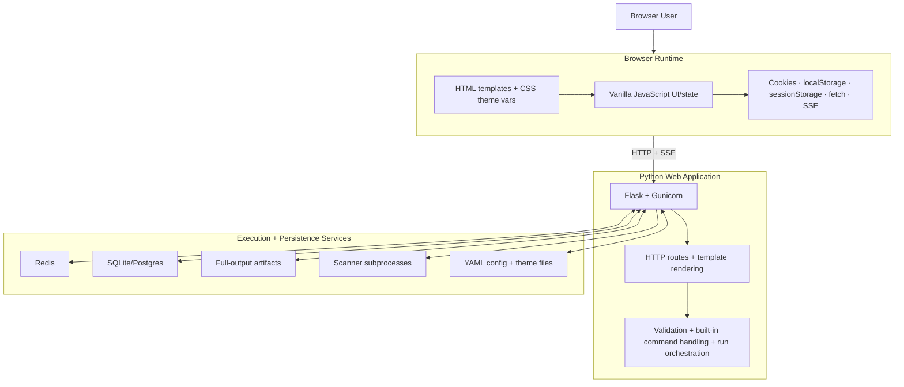
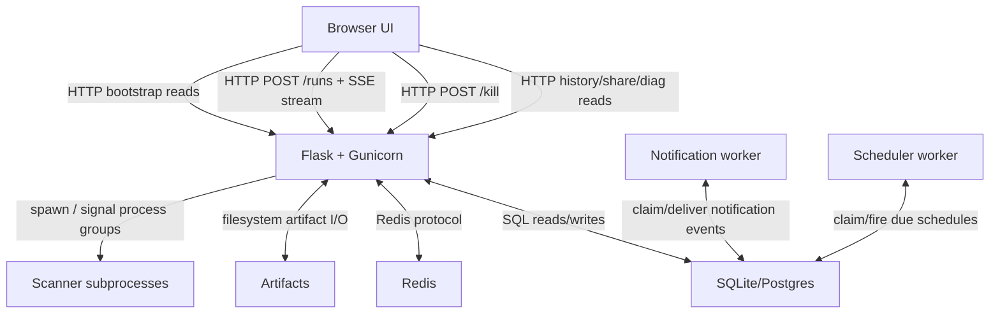
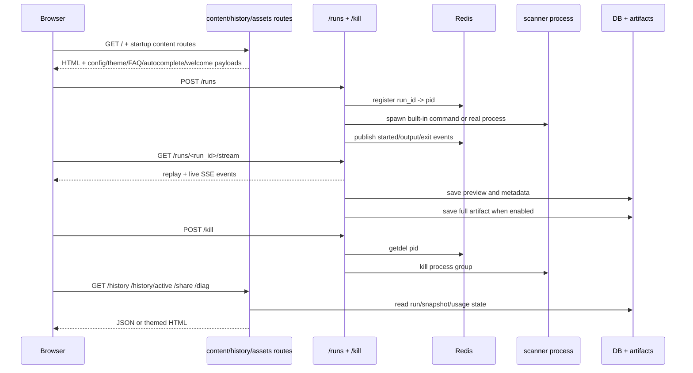
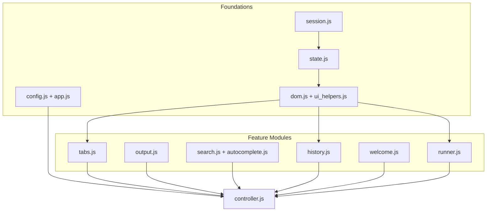
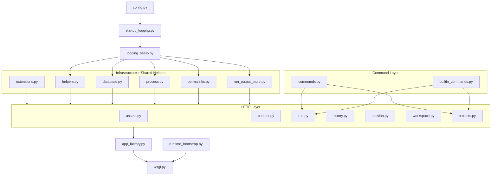
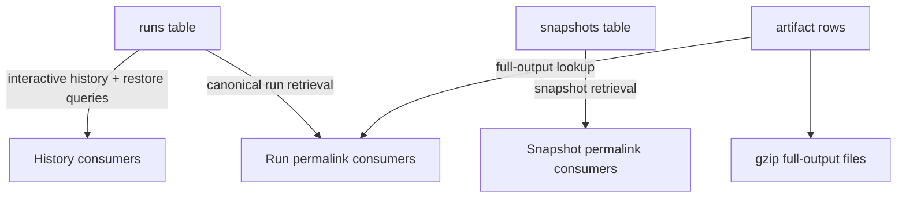
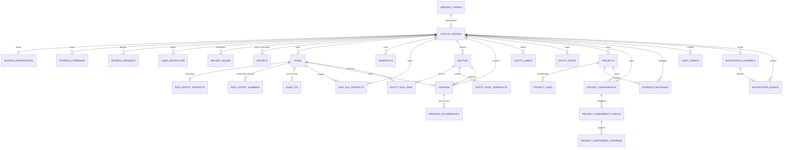
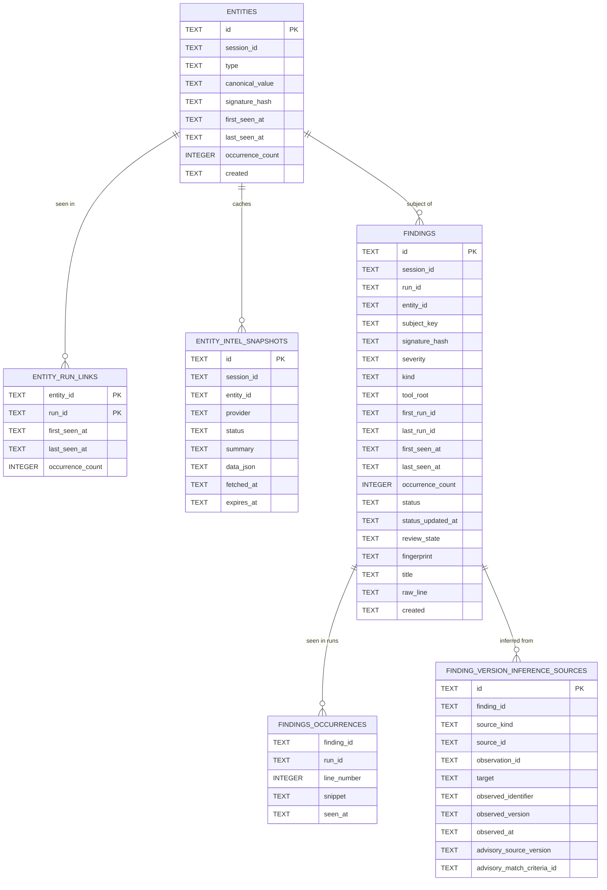
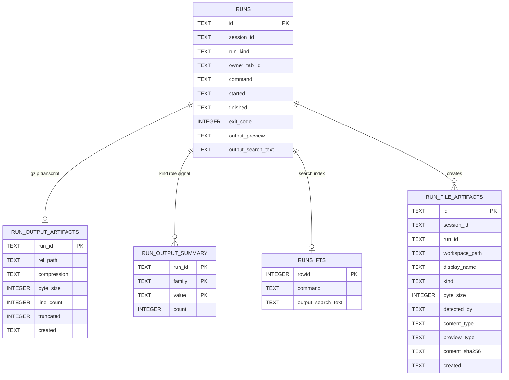
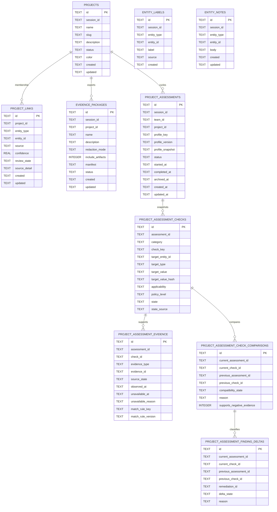

# Architecture

This document explains how darklab_shell is put together today: runtime boundaries, request flow, browser code, backend code, persistence, observability, and tests.

For the architectural rationale, tradeoffs, and implementation-history notes behind those structures, see [DECISIONS.md](DECISIONS.md).

---

## Table of Contents

- [System Overview](#system-overview)
- [System Structure](#system-structure)
- [Request Flow Walkthroughs](#request-flow-walkthroughs)
- [HTTP Route Inventory](#http-route-inventory)
- [Front End Design](#front-end-design)
- [Back-end Architecture](#back-end-architecture)
- [Headless API Surface](#headless-api-surface)
- [Run Lifecycle](#run-lifecycle)
- [Secrets and Vault](#secrets-and-vault)
- [Intel and Provider Integrations](#intel-and-provider-integrations)
- [Session Workspace and Files](#session-workspace-and-files)
- [Projects Workspace](#projects-workspace)
- [Atlas and Entity Model](#atlas-and-entity-model)
- [State And Persistence](#state-and-persistence)
- [Observability And Diagnostics](#observability-and-diagnostics)
- [Security Model](#security-model)
- [Configuration Surfaces](#configuration-surfaces)
- [Theme System](#theme-system)
- [Test Suite](#test-suite)
- [Related Docs](#related-docs)

---

## System Overview

darklab_shell is a web-based shell for running network diagnostics and vulnerability scanning commands against remote targets. It uses Flask + Gunicorn on the backend, an ES module browser frontend with explicit imports and documented browser boundaries, SQLite by default or Postgres for larger deployments, Redis for shared live-run state, and SSE for live output.

At a high level, it works like this:

- The browser loads a Flask-rendered shell page, then fetches focused startup data from routes such as `/config`, `/themes`, `/faq`, `/autocomplete`, and `/welcome*`.
- Command execution starts with `POST /runs` and streams through replayable `/runs/<run_id>/stream` SSE subscriptions. The backend validates and rewrites commands, handles app-native built-ins, starts isolated scanner subprocesses when needed, and publishes output events.
- Redis stores shared state that must work across multiple Gunicorn workers: route and dynamic-request rate limits, active run PID tracking for `/kill`, production run-broker replay, and interactive PTY event/control streams.
- The configured database stores completed run metadata, preview output, snapshots, and full-output file metadata so history and share links survive restarts.
- The browser client has no build step. Classic scripts share one global runtime, and browser cookies/storage handle local continuity around session identity, preferences, and reload restore.
- The Docker runtime uses two unprivileged users: Gunicorn runs as `appuser`, while user-submitted commands run as `scanner` with the shared `appuser` group. That group lets validated Files workspace entries stay group-readable or group-writable without making them world-readable.

The rest of this document is organized by concern rather than file order: system structure first, then browser/backend composition, then core runtime flows such as run lifecycle, state, observability, and security.

---

## System Structure

Start here for the stable big-picture views before the doc dives into request flow, browser behavior, and persistence details.

### Logical Runtime Layers


```mermaid
flowchart TB
  User["Browser User"]

  subgraph Client["Browser Runtime"]
    Templates["HTML templates + CSS theme vars"]
    JS["Vanilla JavaScript UI/state"]
    BrowserApis["Cookies · localStorage · sessionStorage · fetch · SSE"]
  end

  subgraph App["Python Web Application"]
    Flask["Flask + Gunicorn"]
    Routing["HTTP routes + template rendering"]
    Orchestration["Validation + built-in command handling + run orchestration"]
  end

  subgraph Runtime["Execution + Persistence Services"]
    Redis["Redis"]
    Database["SQLite/Postgres"]
    Artifacts["Full-output artifacts"]
    Subprocesses["Scanner subprocesses"]
    Config["YAML config + theme files"]
  end

  User --> Client
  Client -->|HTTP + SSE| Flask
  Templates --> JS
  JS --> BrowserApis
  Flask --> Routing
  Routing --> Orchestration
  Flask <--> Redis
  Flask <--> Database
  Flask <--> Artifacts
  Flask --> Subprocesses
  Flask <--> Config
```

This diagram is intentionally about runtime layers rather than individual modules. It answers “which layer owns which responsibility?” without duplicating the more detailed diagrams later in the doc.

- the browser owns rendering, local interaction state, and web APIs such as cookies, `localStorage`, `sessionStorage`, `fetch`, and SSE reads
- the Python web app owns routing, template rendering, config/theme loading, request validation, built-in command handling, and real command setup
- Redis owns the cross-worker coordination that cannot safely live inside one Gunicorn worker process
- The configured database and output files own the run/share state that must survive reloads and restarts
- scanner subprocesses are a distinct execution boundary rather than an in-process extension of the Flask app
- YAML config and theme files are shown separately because they shape both backend behavior and frontend presentation, even though they load from the local filesystem rather than over the network

This section should stay stable even when app modules, blueprints, or frontend files move around. The sections below cover those app-level pieces directly.

### Runtime Topology


```mermaid
flowchart TB
  Browser["Browser UI"]
  Flask["Flask + Gunicorn"]
  Redis["Redis"]
  Database["SQLite/Postgres"]
  Artifacts["Artifacts"]
  Scanner["Scanner subprocesses"]
  Notifier["Notification worker"]
  Scheduler["Scheduler worker"]

  Browser -->|HTTP bootstrap reads| Flask
  Browser -->|HTTP POST /runs + SSE stream| Flask
  Browser -->|HTTP POST /kill| Flask
  Browser -->|HTTP history/share/diag reads| Flask

  Flask <--> |Redis protocol| Redis
  Flask <--> |SQL reads/writes| Database
  Flask <--> |filesystem artifact I/O| Artifacts
  Flask -->|spawn / signal process groups| Scanner
  Notifier <--> |claim/deliver notification events| Database
  Scheduler <--> |claim/fire due schedules| Database
```

This is the transport and boundary view. It focuses on stable communication paths rather than the internal modules that implement them.

- browser traffic is plain HTTP plus one-way SSE streaming for live command output
- Redis is used for shared worker coordination and brokered active-run event replay, not as a general application datastore
- The configured database and output files are the durable history/share boundary
- command execution remains out-of-process, which keeps the Flask worker lifecycle separate from tool execution
- outbound notification delivery runs in its own supervised process and claims queued delivery rows from the database, so Flask workers do not send external notifications inline
- the scheduler runs in its own supervised process, uses an exclusive deployment-wide lock, and owns time-based schedule ticks outside the Flask worker lifecycle

### Container And Release Boundary

One multi-stage Dockerfile owns both runtime modes and produces one self-contained runtime image. Independent ProjectDiscovery, other Go, checksum-pinned binary, native, Ruby, isolated Python scanner, wordlist, and script-asset builders feed the final stage, which contains the bundled tools and complete `/app` tree without their compilers, development packages, Go toolchain and caches, package installers, apt indexes, or source trees. Schemathesis uses its own exact-pinned virtual environment under `/opt/schemathesis`, so its scanner dependencies cannot change the application runtime. The source-mounted development stack builds that same image, mounts `./app` at `/opt/darklab-source/app:ro`, and stages a permission-normalized snapshot into an ephemeral `/app` tmpfs before startup; the production stack pulls `docker.io/darklabsh/darklab-shell:<version>` and never mounts `/app`.

Protected final and `-rc.N` tags publish one OCI image index with native `linux/amd64` and `linux/arm64` children. An early job resolves the Python base tag once, records its immutable index plus both platform manifests, and gives that same snapshot to the two publishers. Each child carries its platform-base and shared base-index digests in labels and artifacts. AMD64 builds share one content-addressed registry cache behind a serialized writer. Every BuildKit cache writer and reader builds from the same tracked `HEAD` Git archive with fixed file modes, so checkout ownership, timestamps, ACLs, and SELinux labels never become cache-key inputs. Scheduled fanout starts with a cache warmer on any standard self-managed Docker runner, then every named Docker runner imports that cache read-only while building concurrently; the rootless Podman runner waits for the same prerequisite but uses its own image store. The ARM64 release build stays uncached because importing and exporting the bundled scanner and SecLists layers exceeds the hosted small runner's storage budget. Builder-local cache mounts aren't treated as cross-runner evidence. Volatile release labels remain the final Dockerfile instruction. The pipeline pins VirusTotal CLI, Nikto, SecLists, and other direct tool inputs, inventories build inputs and licenses, validates required notices and packaged dependencies, and treats every attempt, child anchor, and canonical app tag as immutable. Nmap 7.95 has its own NPSL 0.95 inventory record and hash-pinned license text, both of which remain part of public-image validation.

Each native publisher first pushes a pipeline- and base-resolution-addressed staging reference. Native smoke jobs pull those child digests, measure their compressed and installed sizes, run production-installation and bundled-tool checks, and retain a CycloneDX SBOM plus full Grype report. ARM64 also starts Redis and Postgres beside the app. Only after every child required by `RELEASE_PLATFORM_MODE` passes does the index job create durable architecture anchors and the canonical GitLab tag. It rejects missing, duplicate, unknown, attestation, or mismatched descriptors, and Docker Hub promotion copies the complete verified index without rebuilding it. Supply-chain evidence records the index, platform map, Python base map, per-platform measurements and scans; GitLab OIDC signs both registry indexes and every included child. The installed verifier relies on the canonical RepoDigest, the index's unique platform mapping, and local architecture and base labels, so operator hosts need the standard Docker CLI but not Buildx. The release deployment then runs the normal multi-worker stack against bundled Postgres, round-trips API state through backup and restore, and anonymously verifies the published index and platform evidence. Candidate tags exercise that chain, but only a final tag creates a GitLab Release.

Dual-platform mode is the fail-closed default. A skipped or missing ARM64 publisher prevents index assembly. The AMD64-only emergency mode is accepted only in a manually started protected pipeline with a nonempty public reason; the resulting one-platform index and all evidence remain marked as degraded, and its immutable tag can never gain ARM64 later. A protected branch rehearsal uses commit-addressed temporary tags to exercise native child publication and anonymous index pulls without writing semantic-version tags, promoting to Docker Hub, signing, uploading a payload, or creating a release. Temporary staging and rehearsal tags have a separate 14-day cleanup path that collects and validates every paginated match before deletion begins, while successful release child anchors remain reachable for the release's retention lifetime.

The production verifier is shared across Docker and Podman, accepts only `amd64` or `arm64`, and can add private SELinux relabeling to external mounts. It binds test-owned directories at `/config`, `/data`, and `/workspaces`, loads an overlay, writes durable app and workspace markers, restarts the container, and executes an unprivileged Nmap SYN probe with the production capabilities. The native GitLab-hosted ARM64 lane uses an isolated Docker-in-Docker service with a `1360` MTU and no registry cache. Dedicated self-managed runner tags cover SELinux-enforcing Docker and rootless Podman startup against the AMD64 child. Standard Linux Docker Compose is supported on both published architectures; SELinux Docker and rootless Podman remain AMD64 compatibility claims rather than broader platform promises.

The protected release jobs call `scripts/release/publish_release_artifacts.sh` for GitLab image publication, Docker Hub promotion, and installer-payload upload. The same implementation runs under regression tests with local registry doubles, which keeps first publication, identical retries, conflicting immutable content, missing digests, and failed uploads aligned with the CI behavior.

Project tooling is grouped by purpose under `scripts/`: operator lifecycle helpers live in `operations/`, release and image checks in `release/`, Docker-build helpers in `container/`, browser build tools in `frontend/`, generated-document helpers in `generate/`, manual QA tools in `development/`, and test internals in `test-support/`. The top level is the stable command surface for documented operator and maintainer commands plus the common test runners. Thin compatibility entrypoints forward to grouped implementations, while CI, npm, Docker, hooks, and import-based tests call those implementations directly. Moved source-tree tools locate the repository from checked-in markers, so their behavior doesn't depend on the caller's working directory.

The deterministic deployment archive contains the production Compose contract, safe local-overlay starters, lifecycle helpers, licenses and notices, checksums, and the pulled-image verifier. Production publishes the app port on every host interface by default for direct remote access; the bind address remains an operator override, and firewall or reverse-proxy controls own the network boundary because the app doesn't provide user authentication. The surrounding payload carries the installer, SBOM, vulnerability report, provenance, build-input inventory, evidence index, and signed checksum bundle. Archive listing and extraction fail closed on incomplete or unsafe content; authenticated online upgrades accept only the archive named in the signed manifest, while offline archives require separate publisher-signature verification. [CONFIGURATION.md](CONFIGURATION.md) owns the operator install, verification, storage, backup, restore, upgrade, and removal procedures.

darklab_shell's original source and documentation use `AGPL-3.0-only`. Project-owned source carries a near-top `SPDX-FileCopyrightText` notice and that exact `SPDX-License-Identifier`; `scripts/release/check_source_licenses.py` defines the ownership boundary and runs through local lint, pre-commit, and CI. Hashed bundles, generated theme examples, fonts, vendored browser libraries, and third-party license texts are excluded so they keep their generated or upstream identity. The module-size ratchet ignores the standard three notice-only lines. The root `LICENSE` remains the single complete project license rather than duplicating it under `LICENSES/`.

The image records the same SPDX expression in its OCI metadata and carries the full license under `/usr/share/doc/darklab-shell/LICENSE`. One version-derived `PROJECT_SOURCE` value opens the exact GitLab source tag at its README from the rail footer, mobile menu footer, FAQ, and terminal help. A modified network deployment is responsible for pointing that value at its own corresponding source and prominently offering the source to every remote user at no charge through a standard or customary copying method; the official placements aren't treated as a universal compliance guarantee. The complete `LICENSE` text controls. Third-party tools and assets remain outside the project license and retain the terms recorded in `THIRD_PARTY_NOTICES.txt` and `container-licenses.json`.

Shipped configuration stays inside the image at `/app/conf`, while `APP_LOCAL_CONF_DIR` points every supported local overlay at the operator root. One path resolver preserves each loader's established merge or replacement behavior, maps nested theme overlays safely, and includes both base and local command files in cache signatures. The root entrypoint rejects symlinks and special files before copying the mounted `/config` tree into a private `appuser`-owned runtime path, which preserves the host's `0700/0600` permissions. Source deployments with no separate local directory retain sibling overlay behavior. Package preset and report template files whose relative names contain `.local.` resolve from the operator root as complete replacement catalogs; tour content and the curated wordlist map remain image-owned. This separation lets image upgrades refresh commands, themes, workflows, and other shipped catalogs without an old host directory hiding them.

---

## Request Flow Walkthroughs


```mermaid
sequenceDiagram
  participant B as Browser
  participant C as content/history/assets routes
  participant R as /runs + /kill
  participant X as Redis
  participant P as scanner process
  participant D as DB + artifacts

  B->>C: GET / + startup content routes
  C-->>B: HTML + config/theme/FAQ/autocomplete/welcome payloads

  B->>R: POST /runs
  R->>X: register run_id -> pid
  R->>P: spawn built-in command or real process
  R->>X: publish started/output/exit events
  B->>R: GET /runs/<run_id>/stream
  R-->>B: replay + live SSE events
  R->>D: save preview and metadata
  R->>D: save full artifact when enabled

  B->>R: POST /kill
  R->>X: getdel pid
  R->>P: kill process group

  B->>C: GET /history /history/active /share /diag
  C->>D: read run/snapshot/usage state
  C-->>B: JSON or themed HTML
```

There are three core request classes:

- content/bootstrap reads
- run/kill lifecycle
- history/share/diagnostic reads

`/history/active` is part of that third class. It exposes in-flight run metadata for the active personal or team scope so the browser can rebuild running tabs after a reload, keep kill available, render the submitted command as a normal prompt line, and subscribe back to `/runs/<run_id>/stream` for replay plus live output. Active-run metadata includes a browser-level origin identity (`owner_client_id`), the originating terminal tab id (`owner_tab_id`), the active `team_id` when a run belongs to a team, and `owner_last_seen` liveness so another browser does not automatically take over a live terminal it did not start. If the origin is another live client, Status Monitor can attach a local tab to the broker stream on demand. The active personal/team scope is the visibility boundary: personal runs stay limited to the session token, while team runs are visible to team members. Any actor that can see the active run and has run-command permission for that team can explicitly kill it, and subscribed peers receive a broker `killed` event such as `[killed by another browser]`. Non-running tabs and drafts are restored separately from browser `sessionStorage`, which keeps the reload path split cleanly between browser-owned idle state and server-owned active-run state.

That split is reflected directly in the blueprint structure.

---

## HTTP Route Inventory

This route list belongs in the architecture document because it describes the application surface that contributors maintain, not the operator workflow.
Methods below list the routes declared by the app; Flask may add automatic `HEAD` and `OPTIONS` handling for those routes.
The `/static/<path:filename>` row is included even though Flask registers it automatically rather than through a blueprint decorator.

### Content And Bootstrap Routes

| Method | Endpoint | Description |
| -------- | ---------- | ------------- |
| `GET` | `/` | Serves the Flask-rendered shell UI, frontend bootstrap config, active theme CSS variables, and initial rail state. |
| `GET` | `/config` | Returns browser-facing runtime config derived from `config.yaml` and `config.local.yaml`. |
| `GET` | `/themes` | Returns the active theme plus the complete theme registry used by the Options modal. |
| `GET` | `/allowed-commands` | Returns the allowed command prefixes grouped from `commands.yaml` for command reference surfaces. |
| `GET` | `/commands/catalog` | Returns compact command registry entries for the Command Registry modal and sheet. |
| `GET` | `/commands/catalog/<root>` | Returns the app-native command reference payload for one supported external command root. |
| `GET` | `/commands/catalog/<root>/<subcommand>` | Returns a subcommand-scoped command reference payload when the registry has subcommand metadata. |
| `GET` | `/faq` | Returns built-in FAQ entries plus custom `faq.yaml` entries, including their display sections. |
| `GET` | `/workflows` | Returns active personal/team user workflows followed by built-in and custom `workflows.yaml` entries, filtered by feature gates such as Files/workspace support. |
| `GET` | `/shortcuts` | Returns the keyboard shortcut reference used by the `shortcuts` built-in and the browser overlay. |
| `GET` | `/autocomplete` | Returns merged external-command and app-owned built-in autocomplete context, built-in command roots, and special command keys. |
| `GET` | `/welcome` | Returns welcome command samples from `welcome.yaml`. |
| `GET` | `/welcome/ascii` | Returns the desktop welcome ASCII banner from `ascii.txt` as plain text. |
| `GET` | `/welcome/ascii-mobile` | Returns the mobile welcome ASCII banner from `ascii_mobile.txt` as plain text. |
| `GET` | `/welcome/hints` | Returns rotating desktop welcome footer hints from `app_hints.txt`. |
| `GET` | `/welcome/hints-mobile` | Returns rotating mobile welcome footer hints from `app_hints_mobile.txt`. |

### Headless API Routes

| Method | Endpoint | Description |
| -------- | ---------- | ------------- |
| `GET` | `/api/v1/health` | Returns unauthenticated API liveness metadata. |
| `GET` | `/api/v1/openapi.json` | Returns the checked-in `/api/v1` OpenAPI contract from the Python spec source. |
| `POST` | `/api/v1/advisories/osv/lookup` | Explicitly looks up one caller-supplied PURL and version when external OSV mode is enabled; team scope requires finding-triage permission. |
| `GET` | `/api/v1/whoami` | Authenticates a `tok_` session token and returns session metadata without echoing the token. |
| `GET` | `/api/v1/teams` | Returns teams joined by the current API token. |
| `POST` | `/api/v1/teams` | Creates a team and returns the one-time recovery code. |
| `GET` | `/api/v1/teams/<team_id>` | Returns team detail with members, invites, and recovery-code metadata. |
| `PATCH` | `/api/v1/teams/<team_id>` | Archives or reactivates one team when the token has the required role; reactivation leaves archive-paused schedules and watchers paused. |
| `POST` | `/api/v1/teams/<team_id>/invites` | Creates a team invite and returns the one-time invite code. |
| `DELETE` | `/api/v1/teams/<team_id>/invites/<invite_id>` | Revokes a team invite. |
| `POST` | `/api/v1/teams/join` | Joins a team by invite code. |
| `PATCH` | `/api/v1/teams/<team_id>/members/<member_id>` | Updates a team member role or display name. |
| `DELETE` | `/api/v1/teams/<team_id>/members/<member_id>` | Removes a member from a team. |
| `POST` | `/api/v1/teams/<team_id>/leave` | Removes the current API token from a team. |
| `POST` | `/api/v1/teams/<team_id>/recovery/rotate` | Rotates a team recovery code and returns the one-time replacement. |
| `POST` | `/api/v1/teams/recovery/redeem` | Redeems a team recovery code into an owner membership. |
| `GET` | `/api/v1/history` | Returns current-token run history with the browser-aligned offset page envelope, search filters, and batched History/Run Details counts. |
| `GET` | `/api/v1/history/search` | Returns paged line-context matches from saved run output using the same backend-aware history search path as the browser. |
| `GET` | `/api/v1/history/<run_id>` | Returns one current-token run summary with artifact, finding, Atlas, label, and note counts. |
| `GET` | `/api/v1/history/<run_id>/output` | Returns stored run output as plain text or JSON using the same preview/full-output behavior as Run Details, with optional line ranges. |
| `GET` | `/api/v1/history/<run_id>/artifacts` | Lists workspace artifacts for one current-token run by stable artifact id. |
| `GET` | `/api/v1/history/<run_id>/artifacts/<artifact_id>` | Streams one current-token run artifact while rejecting cross-run artifact ids. |
| `GET` | `/api/v1/atlas` | Returns active personal/team-scope Atlas entity and finding summary counts with the browser overlay's orphan, suppression, and run filters. |
| `GET` | `/api/v1/atlas/runs` | Returns recent active-scope Atlas source runs with entity and finding counts. |
| `GET` | `/api/v1/atlas/entities` | Returns a paged active-scope Atlas entity list with query, type, project, run, orphan, and suppression filters. |
| `POST` | `/api/v1/atlas/lookup` | Resolves one exact saved hostname, IP address, or HTTP(S) URL in the active personal/team and optional project scope, returning the normal entity profile, a bounded ambiguity result, or a known-parent candidate for an unmatched URL. |
| `GET` | `/api/v1/atlas/entities/<entity_id>` | Returns one active-scope Atlas entity with a normalized observed/finding/relationship/Intel overview, source runs, one selected direct/related finding bucket, one-hop parent/child relationships, separate direct/related finding rollups, labels, notes, project links, and cached intel summaries. An explicit project adds entity-matched watcher state and recent changes; owner-wide reads mark that project-only context as not applicable. Optional `finding_bucket`, project, and collection offsets keep the response scoped and bounded. |
| `GET` | `/api/v1/atlas/findings` | Returns a paged active-scope Atlas finding list with query, project, run, review-state, verification-status, orphan, and suppression filters. |
| `GET` | `/api/v1/atlas/findings/<finding_id>` | Returns one active-scope Atlas finding with recent source occurrences. |
| `GET` | `/api/v1/projects` | Returns a read-only paged project list for the token session. |
| `GET` | `/api/v1/projects/<project_id>` | Returns one read-only project record for the token session. |
| `GET` | `/api/v1/projects/<project_id>/findings` | Returns a read-only paged project findings response using project query services. |
| `POST` | `/api/v1/projects/<project_id>/findings` | Creates an assessor-authored finding for a confirmed Project target, with duplicate warning and typed initial evidence. |
| `PATCH` | `/api/v1/projects/<project_id>/findings/<finding_id>` | Edits an assessor-authored finding through an optimistic revision without changing its target or stable identity. |
| `GET` | `/api/v1/projects/<project_id>/findings/<finding_id>/evidence` | Lists typed supporting-evidence references for one Project-visible finding. |
| `POST` | `/api/v1/projects/<project_id>/findings/<finding_id>/evidence` | Validates and links one owner- and Project-scoped supporting source to a finding. |
| `DELETE` | `/api/v1/projects/<project_id>/findings/<finding_id>/evidence/<evidence_link_id>` | Removes one typed supporting-evidence reference without deleting its source record. |
| `GET` | `/api/v1/projects/<project_id>/runs` | Returns a read-only paged project run response using project query services. |
| `GET` | `/api/v1/projects/<project_id>/entities` | Returns a read-only paged project Atlas entity response using project query services. |
| `GET` | `/api/v1/projects/<project_id>/packages` | Returns a read-only paged evidence package list for one project. |
| `GET` | `/api/v1/projects/<project_id>/assessments` | Returns a bounded assessment-cycle page for one Project, with status and archived-visibility filters. |
| `POST` | `/api/v1/projects/<project_id>/assessments` | Creates an active cycle from a validated profile snapshot; team scope requires Project mutation permission. |
| `GET` | `/api/v1/projects/<project_id>/assessments/<assessment_id>` | Returns one cycle's safe profile snapshot, truthful rollups, and a bounded, filtered check page. |
| `PATCH` | `/api/v1/projects/<project_id>/assessments/<assessment_id>` | Renames an active cycle or advances it to completed or archived. |
| `PATCH` | `/api/v1/projects/<project_id>/assessments/<assessment_id>/checks/<check_id>` | Sets or clears a reasoned manual decision on an active check. |
| `POST` | `/api/v1/projects/<project_id>/assessments/<assessment_id>/checks/<check_id>/evidence` | Validates and links one compatible saved source to an active check. |
| `DELETE` | `/api/v1/projects/<project_id>/assessments/<assessment_id>/checks/<check_id>/evidence/<evidence_link_id>` | Removes one manually added evidence link and recalculates the active check. |
| `GET` | `/api/v1/projects/<project_id>/assessments/<assessment_id>/checks/<check_id>/recommended-action` | Recomputes a launch plan from one saved assessment check and its current confirmed target; an optional HTTP profile requires Secret-management permission and returns only redacted credential-use context. |
| `POST` | `/api/v1/projects/<project_id>/assessments/<assessment_id>/checks/<check_id>/recommended-action` | Starts the freshly confirmed safe or standard command action, materializes any selected supported HTTP profile privately, and links its run to the Project. |
| `GET` | `/api/v1/projects/<project_id>/assessments/<assessment_id>/delete-preview` | Returns the assessment-owned rows an archived-cycle deletion would remove. |
| `DELETE` | `/api/v1/projects/<project_id>/assessments/<assessment_id>` | Deletes one archived cycle tree while preserving its referenced source records. |
| `GET` | `/api/v1/projects/<project_id>/http-profiles` | Lists the Project's HTTP assessment profiles, redacting protected reference names when the team actor lacks Secret-management permission. |
| `POST` | `/api/v1/projects/<project_id>/http-profiles` | Creates a reference-only HTTP assessment profile after validating Project scope, Secrets, workflows, Files, and quota. |
| `GET` | `/api/v1/projects/<project_id>/http-profiles/<profile_id>` | Returns one scoped HTTP assessment profile with capability-aware reference redaction. |
| `PATCH` | `/api/v1/projects/<project_id>/http-profiles/<profile_id>` | Updates one HTTP assessment profile using its optimistic revision. |
| `DELETE` | `/api/v1/projects/<project_id>/http-profiles/<profile_id>` | Deletes one HTTP assessment profile without changing its referenced Secrets, Files, workflow, or Project. |
| `GET` | `/api/v1/projects/<project_id>/findings/<finding_id>/verification-actions/<check_id>` | Recomputes a secret-free launch plan from a finding's saved assessment check and current confirmed target. |
| `POST` | `/api/v1/projects/<project_id>/findings/<finding_id>/verification-actions/<check_id>` | Starts the freshly confirmed safe or standard command action and links its run to the Project. |
| `GET` | `/api/v1/schedules` | Returns a paged list of normal scheduled commands for the API token's active personal/team scope. |
| `POST` | `/api/v1/schedules` | Creates a normal scheduled command after the same command-policy validation used by browser schedules; team scope requires automation-management permission. |
| `GET` | `/api/v1/schedules/<schedule_id>` | Returns one normal scheduled command in the API token's active personal/team scope. |
| `PATCH` | `/api/v1/schedules/<schedule_id>` | Updates one normal scheduled command's cadence, command, label, timezone, or enabled state; team scope requires automation-management permission. |
| `DELETE` | `/api/v1/schedules/<schedule_id>` | Deletes one normal scheduled command in the API token's active personal/team scope; team scope requires automation-management permission. |
| `POST` | `/api/v1/schedules/<schedule_id>/run-now` | Fires one normal scheduled command immediately and returns the updated schedule row; team scope requires automation-management permission. |
| `GET` | `/api/v1/schedules/<schedule_id>/fires` | Returns paged fire audit rows for one normal scheduled command. |
| `GET` | `/api/v1/watchers` | Returns a paged list of change-detection watchers for the API token's active personal/team scope. |
| `POST` | `/api/v1/watchers` | Creates a watcher from a completed baseline run after command-policy validation; team scope requires automation-management permission. |
| `GET` | `/api/v1/watchers/<watcher_id>` | Returns one change-detection watcher in the API token's active personal/team scope. |
| `PATCH` | `/api/v1/watchers/<watcher_id>` | Updates one watcher's command, cadence, label, timezone, options, or pause/resume state; team scope requires automation-management permission. |
| `DELETE` | `/api/v1/watchers/<watcher_id>` | Deletes one watcher and its owned schedule; team scope requires automation-management permission. |
| `POST` | `/api/v1/watchers/<watcher_id>/run-now` | Fires one watcher immediately and returns the updated watcher row; team scope requires automation-management permission. |
| `POST` | `/api/v1/watchers/<watcher_id>/accept-baseline` | Promotes the latest watcher fire, or the supplied run id, to the new baseline; team scope requires automation-management permission. |
| `GET` | `/api/v1/watchers/<watcher_id>/fires` | Returns paged fire audit rows for one watcher. |
| `GET` | `/api/v1/notification-channels` | Returns masked outbound notification channel metadata for the token session. |
| `GET` | `/api/v1/notification-channel-kinds` | Returns supported outbound notification channel kinds, secret fields, config fields, and trigger labels. |
| `POST` | `/api/v1/notification-channels` | Creates one outbound notification channel with write-only vault-backed secret values. |
| `PATCH` | `/api/v1/notification-channels/<channel_id>` | Updates one outbound notification channel's label, config, triggers, muted state, or replacement secret values. |
| `DELETE` | `/api/v1/notification-channels/<channel_id>` | Deletes one outbound notification channel from the token session. |
| `POST` | `/api/v1/notification-channels/<channel_id>/test` | Queues and synchronously dispatches a canned `test` notification through one channel and returns its delivery status. |
| `GET` | `/api/v1/notification-events` | Returns paged notification delivery audit rows with optional channel, trigger, and status filters. |
| `GET` | `/api/v1/runs` | Returns active current-token runs for CLI and script visibility. |
| `POST` | `/api/v1/runs` | Starts a non-interactive command through the same validation, rewrite, broker, and persistence path as browser runs. |
| `GET` | `/api/v1/runs/<run_id>` | Returns active broker status or completed history status for a current-token run. |
| `GET` | `/api/v1/runs/<run_id>/output` | Returns stored run output as plain text or JSON, with optional line ranges. |
| `POST` | `/api/v1/runs/<run_id>/wait` | Waits for an active run to become terminal or returns a timeout error. |
| `GET` | `/api/v1/runs/<run_id>/ai-assists` | Lists cached and in-flight AI assists for one completed run in the current personal or team scope. |
| `POST` | `/api/v1/runs/<run_id>/ai-summary` | Returns a cached AI summary assist or queues one for the AI worker; team scope requires run-command permission. |
| `POST` | `/api/v1/runs/<run_id>/ai-next-commands` | Returns cached AI next-command drafts or queues them for the AI worker; team scope requires run-command permission. |
| `POST` | `/api/v1/runs/<run_id>/projects/<project_id>` | Links a completed external run to an active project in the token session. |
| `DELETE` | `/api/v1/runs/<run_id>/projects/<project_id>` | Removes a completed external run link from an active project in the token session. |
| `GET` | `/api/v1/runs/<run_id>/stream` | Streams a current-token run as SSE by default or NDJSON when `format=ndjson`. |
| `POST` | `/api/v1/runs/<run_id>/cancel` | Cancels any active run in the token session, including browser-started runs. |

### Run Lifecycle Routes

| Method | Endpoint | Description |
| -------- | ---------- | ------------- |
| `POST` | `/runs` | Validates, expands session variables, rewrites, starts brokered execution, and returns the run id plus stream URL. |
| `GET` | `/runs/<run_id>/stream` | Replays brokered events and follows live output over SSE for a run in the active personal/team scope. |
| `GET` | `/runs/<run_id>/events` | Returns bounded active-scope brokered event backfill for tests and non-SSE clients. |
| `GET` | `/runs/<run_id>/ai-assists` | Lists cached and in-flight AI assists for one completed run in the current personal or team scope. |
| `POST` | `/runs/<run_id>/ai-summary` | Returns a cached AI summary assist or queues one for the AI worker; team scope requires run-command permission. |
| `POST` | `/runs/<run_id>/ai-next-commands` | Returns cached AI next-command drafts or queues them for the AI worker; team scope requires run-command permission. |
| `POST` | `/pty/runs` | Starts a config-gated interactive PTY run for an allowlisted screen tool and returns the PTY run id plus stream URL. |
| `GET` | `/pty/runs/<run_id>/snapshot` | Returns a terminal snapshot, dimensions, and resume event id for active PTY reattach. |
| `GET` | `/pty/runs/<run_id>/stream` | Streams bounded PTY output events over SSE for the active personal/team scope. |
| `POST` | `/pty/runs/<run_id>/input` | Sends bounded keyboard or paste input to an active interactive PTY run. |
| `POST` | `/pty/runs/<run_id>/resize` | Applies browser terminal row/column changes to an active interactive PTY run. |
| `POST` | `/run/client` | Persists allowlisted browser-owned built-in output, such as client-side theme/session commands, as normal run history. |
| `POST` | `/kill` | Kills an active-scope process group by `run_id`, requiring run-command permission for team-owned runs. |

### History And Share Routes

| Method | Endpoint | Description |
| -------- | ---------- | ------------- |
| `GET` | `/history` | Returns paginated current-session history items with run/snapshot/run-subtype filters, linked-run project filters, command/output search, structured output selectors, starred-only filtering, labels/notes, Atlas entity/finding counts for source runs, and command-root summaries. |
| `GET` | `/history/delete-preview` | Counts all active-scope runs selected by the current History filters and reports how many are not starred before bulk deletion. |
| `DELETE` | `/history` | Deletes every active-scope run selected by the current History filters and removes matching full-output artifacts; `exclude_starred=1` limits the deletion to matching non-starred runs, and team scope requires history-management permission. |
| `POST` | `/history/bulk-delete` | Deletes selected completed active-scope runs, returning per-run results while rejecting running or missing runs without failing the whole request; team scope requires history-management permission. |
| `POST` | `/history/bulk-export` | Streams selected completed current-session runs and snapshots as `txt` or `jsonl`, preserving per-item skipped results for running, missing, or cross-session ids. |
| `GET` | `/history/commands` | Returns newest distinct command strings for prompt history, desktop recents, and mobile recents. |
| `GET` | `/history/stats` | Returns compact current-session counters for the Status Monitor dashboard. |
| `GET` | `/history/insights` | Returns compact visual history data for Status Monitor constellation, heatmap, ticker, and command mix widgets. |
| `GET` | `/history/active` | Returns active-run metadata and telemetry for reload recovery and the Status Monitor. |
| `GET` | `/history/<run_id>/compare-candidates` | Returns ranked previous completed external runs from the active personal/team owner scope for the shared compare launcher. |
| `GET` | `/history/compare` | Compares two active-scope runs, optionally scoped by `project_id` / `baseline_label`, and returns metadata deltas, bounded output hunks, totals, limits, finding/entity/artifact object diffs, workflow ancestry when present, and derived tool-aware changes such as nmap port/service, web URL/status, discovered-host, and TLS deltas. Explicit `left`/`right` ids remain positional. |
| `GET` | `/history/compare/lines` | Returns bounded filtered-output slices for lazy expansion of folded comparison hunks, using `left`/`right` run ids, `side`, `start`/`end`, and optional `project_id` scoping. |
| `GET` | `/history/<run_id>` | Serves an implicit-bearer styled run permalink, or raw JSON with `?json`; uses full-output artifacts when available unless `?preview=1` is set, and includes same-session Atlas counts for source runs. |
| `GET` | `/history/<run_id>/atlas-cleanup-preview` | Previews disposable, kept-by-default, and not-eligible Atlas rows before a run delete. |
| `DELETE` | `/history/<run_id>` | Deletes one active-scope run and its matching full-output artifact; team scope requires history-management permission, `prune_atlas=1` removes disposable Atlas rows only linked to that run, and `prune_curated_atlas=1` also removes kept-by-default single-source rows. |
| `POST` | `/share` | Saves a tab snapshot, omits raw-only intel response bodies, optionally applies share redaction, and returns a snapshot permalink URL. |
| `POST` | `/share/bulk-delete` | Deletes selected current-session snapshot permalinks, returning per-snapshot results without failing the whole request. |
| `GET` | `/share/<share_id>` | Serves a styled snapshot permalink, or raw JSON with `?json`. |
| `DELETE` | `/share/<share_id>` | Deletes one current-session snapshot permalink. |

Run comparison applies bounded transcript-diff caps before returning hunk payloads:
`COMPARE_MAX_CHANGED_LINES` limits emitted changed-line units to 2,000,
`COMPARE_MAX_HUNKS` limits emitted change blocks to 3,000,
`COMPARE_INLINE_EQUAL_CONTEXT` inlines three equal context lines on each side of a change,
`COMPARE_LINE_DISPLAY_TRUNCATE` caps displayed line text at 4,000 characters with client-side expansion,
`COMPARE_LAZY_EQUAL_PAGE_LIMIT` pages folded equal regions at 5,000 lines, and
`COMPARE_LAZY_EQUAL_BYTE_LIMIT` caps each lazy equal-region page at 512,000 UTF-8 bytes.
Replace-line pairing is bounded by `COMPARE_REPLACE_PAIR_CANDIDATES` (32 nearest candidate lines)
and accepts pairs at `COMPARE_REPLACE_PAIR_MIN_RATIO` (0.5), with a matching
`COMPARE_REPLACE_PAIR_QUICK_RATIO` prefilter to avoid expensive full similarity checks when the
cheap upper bound is already below the threshold. Transcript hunks preserve source output order.
Finding and artifact object diffs are intentionally order-insensitive. Finding occurrences keep
the severity and severity-neutral comparison identity observed by each run; exact severity matches
pair first, then remaining rows with the same comparison identity become deterministic `changed`
records with complete `before` / `after` objects and `changed_fields`. Rows without a usable
comparison identity retain the generic added/removed fallback. Occurrence writers store the bounded
raw identity components, so occurrences recorded after schema migration `0044` retain exact
run-observed severity. Migration `0044` reconstructs older rows from retained canonical finding and
snippet data; it cannot recover severity that was overwritten earlier, and best-effort rows fall
back to added/removed findings when a dependable identity is unavailable. Comparison reads apply
the current normalization rules consistently to all rows. Artifact keys prefer
`content_sha256`, then workspace path, then artifact id.
The compare payload also includes a bounded `derived_changes` block for tool-aware summaries.
Its nmap port/service group reuses the shared diff classifier, while the web URL/status group
uses line-attached URL entities plus confident `httpx`, `ffuf`, `gobuster`, and `katana` output
parsers to report added, removed, and changed records. Same-root host adapters cover discovery
output without duplicating a confident `httpx` URL group, and the TLS adapter normalizes subject,
issuer, alternative names, validity dates, SHA-256 fingerprint, and verification changes. Derived
records carry output-line pointers when the parser can identify a reliable source line and preserve
partial/truncated notes without suppressing the raw transcript diff.

App-generated previous-run comparisons normalize `started` timestamps so the older baseline is
left and the current run is right. This includes automatic/manual History launches and Project
defaults; direct API callers that supply both ids keep their requested order. Every comparison read
uses one resolved owner scope for runs, project links, findings, artifacts, workflow provenance, and
lazy line slices. Comparison run cards add value-free workflow execution/step ancestry only when a
run has it, and the browser hands **View playbook** back to the existing Workflows execution view.
The dynamically mounted comparison dialog binds the shared focus trap when it is created and keeps
an explicit launch control for focus restoration; mobile menu launches use the hamburger because
the menu row is hidden before the dialog opens. Findings-only mode renders persisted
changed/added/removed totals and finding rows without transcript navigation or line-anchor controls,
because that view does not mount transcript panes.

### Atlas Routes

| Method | Endpoint | Description |
| -------- | ---------- | ------------- |
| `GET` | `/atlas` | Returns active personal/team-scope Atlas entity counts by entity type, honoring optional source-run, orphan-source, and suppression filters. |
| `GET` | `/atlas/views` | Lists saved Atlas views for the current session token. |
| `POST` | `/atlas/views` | Saves a named Atlas view with its tab, search, filter, review-state, project-scope, and source-run state. |
| `PUT` | `/atlas/views/<view_id>` | Updates a saved Atlas view for the current session token. |
| `DELETE` | `/atlas/views/<view_id>` | Deletes a saved Atlas view for the current session token. |
| `POST` | `/atlas/imports/preview` | Parses an uploaded Atlas import file, stores a short-lived draft, and returns candidate counts, samples, warnings, and a row-set digest. |
| `POST` | `/atlas/imports/apply` | Applies a previewed Atlas import draft after rechecking the row-set digest, scope, permissions, and selected apply options. |
| `GET` | `/atlas/runs` | Returns recent or searched active-scope source runs that contribute Atlas rows for the Atlas run filter. |
| `GET` | `/atlas/entities` | Returns a paginated active-scope entity list, with optional `type`, text search, project, source-run, orphan-source, suppression, limit, and offset parameters. |
| `GET` | `/atlas/entities/export` | Downloads active-scope Atlas entity rows as CSV or JSONL, honoring optional type, text, project, source-run, orphan-source, suppression, and limit filters. |
| `POST` | `/atlas/lookup` | Resolves one exact saved hostname, IP address, or HTTP(S) URL from a JSON body without placing the value in a query string. The read-only result uses the active personal/team and optional project scope. |
| `GET` | `/atlas/entities/<entity_id>` | Returns one active-scope entity with source runs, one selected direct/related finding bucket, one-hop parent/child relationships, separate direct/related finding rollups, labels, notes, project links, and cached intel snapshots. Optional `finding_bucket`, project, and collection offsets keep the response scoped and bounded. |
| `GET` | `/atlas/runs/<run_id>/cleanup-preview` | Previews personal/current-session disposable, kept-by-default, and not-eligible Atlas rows when cleaning one source run while keeping the run transcript; this destructive cleanup preview is not team-scoped. |
| `POST` | `/atlas/runs/<run_id>/cleanup` | Detaches one personal/current-session run from Atlas, deletes disposable rows that only came from that run, optionally deletes kept-by-default single-source rows, and recalculates remaining entity/finding counts; this destructive cleanup path is not team-scoped. |
| `POST` | `/atlas/entities/bulk-delete` | Deletes selected personal/current-session Atlas entities and any findings attached to those entities; this destructive delete path is not team-scoped. |
| `POST` | `/atlas/entities/suppression` | Suppresses or restores selected active-scope Atlas entities without deleting their source data. |
| `GET` | `/atlas/entities/<entity_id>/delete-preview` | Previews personal/current-session related Atlas cleanup before deleting an entity, including disposable, kept-by-default, and not-eligible same-source siblings; this destructive preview is not team-scoped. |
| `DELETE` | `/atlas/entities/<entity_id>` | Deletes one personal/current-session Atlas entity and its attached findings, with optional same-source cleanup for disposable or kept-by-default single-source siblings; this destructive delete path is not team-scoped. |
| `PUT` | `/atlas/entities/<entity_id>/suppression` | Suppresses or restores one active-scope Atlas entity without deleting its source data. |
| `GET` | `/atlas/findings` | Returns the paginated active-scope Atlas Findings queue with optional text, project, source-run, review-state, verification-status, orphan-source, suppression, limit, and offset filters. |
| `POST` | `/atlas/findings/review` | Updates the shared review disposition for each selected active-scope finding's exact remediation group. |
| `POST` | `/atlas/findings/bulk-delete` | Deletes selected personal/current-session Atlas findings; this destructive delete path is not team-scoped. |
| `POST` | `/atlas/findings/suppression` | Suppresses or restores selected active-scope Atlas findings without deleting their source data. |
| `GET` | `/atlas/findings/<finding_id>/delete-preview` | Previews personal/current-session same-source cleanup before deleting a finding, including disposable, kept-by-default, and not-eligible siblings; this destructive preview is not team-scoped. |
| `DELETE` | `/atlas/findings/<finding_id>` | Deletes one personal/current-session Atlas finding, with optional same-source cleanup for disposable or kept-by-default single-source siblings; this destructive delete path is not team-scoped. |
| `PUT` | `/atlas/findings/<finding_id>/suppression` | Suppresses or restores one active-scope Atlas finding without deleting its source data. |
| `POST` | `/atlas/entities/<entity_id>/refresh_intel` | Refreshes app-native intel for one active-scope entity and stores provider snapshots on the entity. |
| `POST` | `/atlas/entities/<entity_id>/project_links` | Adds an active-scope Atlas entity to a project through the shared project-link model. |
| `DELETE` | `/atlas/entities/<entity_id>/project_links/<project_id>` | Removes an active-scope Atlas entity from a project. |

**Atlas import preview/apply contract.** `POST /atlas/imports/preview` accepts
multipart form data with `file`, `format_id`, `source_tool`, and `import_name`.
The route uses the current personal or `X-Team-ID` scope, parses only the
declared format, stores a short-lived draft, and returns `ok`, `draft_id`,
`row_set_digest`, `expires_at`, `counts`, bounded `samples`, bounded `warnings`,
and `apply_options`. Preview `counts` include `rows`, `valid`, `skipped`,
`warnings`, `new`, `updated`, `duplicate`, `entity_valid`, `entity_new`,
`entity_duplicate`, `finding_valid`, `finding_new`, `finding_duplicate`,
`finding_subject_entities_to_create`, and `project_target_candidates`.
Previews with typed CycloneDX or Nessus evidence also include `evidence_valid`
and `evidence_new`, and their bounded samples can include those evidence records. `apply_options` has
`import_entities`, `import_findings`, `import_evidence`, `link_to_project`, and
`create_project_targets`; each option reports whether it is available and which
team capability names it requires.

The declared parser formats include Nuclei JSONL, Nessus XML, ZAP JSON/XML,
Burp Suite XML, SARIF 2.1 JSON, CycloneDX JSON, Generic CSV, and Generic JSONL.
The source reader recognizes gzip and ZIP by file signature rather than trusting
the filename. It applies one limit to the uploaded bytes and a separate limit to
the expanded report. ZIP input caps archive entries and must contain exactly one
unencrypted regular file with a safe relative path; nested compression, multiple reports, malformed
archives, traversal paths, and oversized expansion fail before parsing. Archives
are read in memory and never extracted to the filesystem. Draft provenance hashes
the bytes the operator uploaded, while parser logs record bounded byte counts and
the low-cardinality compression kind without recording an archive member name.
SARIF parsing keeps bounded driver and automation identity, rule metadata, full
and partial fingerprints, and up to eight safe artifact locations with source
regions and optional artifact-index provenance. Only credential-free HTTP(S)
locations can become Atlas URL entities; repository-relative locations remain
finding provenance. File schemes, absolute or traversal paths, credentialed
URLs, backslashes, control characters, and invalid indexes are rejected with a
bounded warning. The parser doesn't resolve URI bases or fetch source content.
CycloneDX parsing keeps bounded document provenance, nested components,
dependency edges, exact PURL/CPE identifiers, vulnerability ratings and safe
references, and affected component links. Components and dependencies are
typed import evidence rather than findings. A vulnerability assertion becomes
an imported finding only when its VEX state is affected or exploitable; not
affected, resolved, and under-investigation assertions remain evidence and
never change an existing finding's review or verification state.
Nessus parsing separately retains only exact versioned service CPEs as typed
evidence. Each accepted row binds the normalized CPE to the canonical imported
host and preserves its port, protocol, service, plugin id, scanner or report
format version, parser version, and the available raw `HOST_END` or `HOST_START`
value. A source timestamp becomes the normalized scan time only when it includes
a timezone; timezone-free legacy values remain raw provenance, and the import
time orders the stored row. Wildcard and malformed CPEs fail closed. Per-item and whole-import
limits reject extra evidence without evicting earlier rows, and a retained
service version never becomes a confirmed vulnerability by itself.

`POST /atlas/imports/apply` accepts JSON with `draft_id`, `row_set_digest`,
`options`, and optional `project_id`. `options` uses the same five boolean keys
returned by preview. `project_id` is required when `link_to_project` or
`create_project_targets` is true. Apply reloads the persisted draft, recomputes
current counts, rechecks configured limits, verifies the row-set digest, checks
the selected options against team capabilities, and confirms the project is still
accessible before writing. Successful apply returns `ok`, `batch_id`, and
`counts`; repeated apply of an already-applied draft returns the same shape with
`already_applied: true` and the existing batch id instead of duplicating rows.
Apply count keys include `entities_created`, `entities_updated`,
`findings_created`, `findings_updated`, `entity_links`,
`finding_occurrences`, `evidence_imported`, `project_links_added`, `project_links_existing`,
`project_targets_created`, `project_targets_existing`, and
`required_capabilities`. The Project target option creates or reuses the Atlas
entity needed to represent each target, so entity counts can increase even when
only `create_project_targets` is selected.

Applied CycloneDX and Nessus evidence is stored against the immutable import batch and,
when supplied, its Project. The evidence ledger preserves component,
dependency, and VEX source detail without creating History runs or treating an
SBOM inventory row or service version as proof of a vulnerability.

Both routes return the standard safe error envelope
`{"error": "<code>", "message": "<message>"}` for import workflow failures.
Client-visible error codes include `session_required`, `file_required`,
`invalid_json`, `invalid_import_file`, `import_limit_exceeded`,
`no_apply_options`, `project_required`, `draft_not_found`, `draft_expired`,
`digest_mismatch`, `draft_apply_in_progress`, `draft_not_applyable`,
`team_forbidden`, `project_not_found`, and `project_quota_exceeded`.

### Schedule Routes

| Method | Endpoint | Description |
| -------- | ---------- | ------------- |
| `GET` | `/schedules` | Lists normal scheduled runs for the active personal/team scope. |
| `GET` | `/schedules/preview` | Returns the next three fire times for a cron expression or cadence preset without writing a schedule row. |
| `GET` | `/schedules/<schedule_id>` | Returns one normal schedule in the active personal/team scope. |
| `POST` | `/schedules` | Creates a normal scheduled run after validating the command, cadence, timezone, and scoped schedule cap; team scope requires automation-management permission. |
| `PATCH` | `/schedules/<schedule_id>` | Updates one active-scope schedule and re-validates changed command or cadence fields; team scope requires automation-management permission. |
| `DELETE` | `/schedules/<schedule_id>` | Deletes one active-scope normal schedule; team scope requires automation-management permission. |
| `POST` | `/schedules/<schedule_id>/run-now` | Fires one active-scope schedule immediately from the web worker and records a schedule fire audit row; team scope requires automation-management permission. |
| `GET` | `/schedules/<schedule_id>/fires` | Returns paged fire audit rows for one active-scope normal schedule. |

### Watcher Routes

| Method | Endpoint | Description |
| -------- | ---------- | ------------- |
| `GET` | `/watchers` | Lists change-detection watchers for the active personal/team scope, including owned schedule metadata. |
| `POST` | `/watchers` | Creates a watcher from a completed active-scope baseline run, inheriting the baseline command unless an override command is supplied; team scope requires automation-management permission. |
| `PATCH` | `/watchers/<watcher_id>` | Updates one active-scope watcher label, cadence, timezone, options, command override, or pause/resume state; team scope requires automation-management permission. |
| `DELETE` | `/watchers/<watcher_id>` | Deletes one active-scope watcher and its owned schedule and fire audit rows; team scope requires automation-management permission. |
| `GET` | `/watchers/<watcher_id>/fires` | Returns paged watcher fire audit rows for one active-scope watcher. |
| `POST` | `/watchers/<watcher_id>/accept-baseline` | Promotes the latest watcher fire, or a supplied run id, to the watcher's new baseline and resets changed/error counters; team scope requires automation-management permission. |
| `POST` | `/watchers/<watcher_id>/run-now` | Fires one active-scope watcher immediately from the web worker and records schedule and watcher fire audit rows; team scope requires automation-management permission. |

### Session Routes

| Method | Endpoint | Description |
| -------- | ---------- | ------------- |
| `GET` | `/session/token/generate` | Generates and stores a new persistent `tok_...` session token. |
| `GET` | `/session/token/info` | Returns the active named token and creation timestamp, or null fields for anonymous sessions. |
| `POST` | `/session/token/revoke` | Revokes a named token so new requests with that token fall back to anonymous session handling. |
| `POST` | `/session/token/verify` | Checks whether a supplied `tok_...` token was issued by this server. |
| `GET` | `/session/recent-values` | Returns recent target values for the active personal/team scope and metadata-gated autocomplete suggestions. |
| `POST` | `/session/recent-values` | Saves normalized recent values for the active personal/team scope and prunes each value kind to the autocomplete cap. |
| `POST` | `/session/migrate` | Migrates runs, snapshots, starred commands, preferences, command variables, user workflows, completed personal workflow executions, project workspace records and assessments, recent values, and non-conflicting workspace paths between session IDs. Returns `409 active_workflow_execution` while the source identity has active workflow work. |
| `GET` | `/session/secrets` | Lists encrypted secret names, consumer env bindings, and update timestamps for the active personal/team scope without returning values. |
| `POST` | `/session/secrets` | Creates or replaces one encrypted personal/team secret value for the active scope. |
| `POST` | `/session/secrets/rotate` | Re-wraps the active personal/team scope's encrypted secret rows under the active master key. |
| `DELETE` | `/session/secrets/<name>` | Removes one encrypted secret from the active personal/team scope. |
| `GET` | `/session/teams` | Lists teams available to the current durable session token. |
| `POST` | `/session/teams` | Creates a team for the current durable session token and returns the one-time recovery code. |
| `GET` | `/session/teams/<team_id>` | Returns team detail for a team the current token belongs to. |
| `GET` | `/session/teams/<team_id>/activity` | Returns owner/admin-scoped safe activity rows for the selected team. |
| `PATCH` | `/session/teams/<team_id>` | Archives or reactivates a team when the current member has archive-team capability; archiving pauses team schedules and watchers in place, and reactivation keeps them paused until resumed. |
| `POST` | `/session/teams/<team_id>/invites` | Creates a role-scoped team invite when the current member has invite-management capability. |
| `DELETE` | `/session/teams/<team_id>/invites/<invite_id>` | Revokes one team invite when the current member has invite-management capability. |
| `POST` | `/session/teams/join` | Redeems a team invite code for the current durable session token. |
| `PATCH` | `/session/teams/<team_id>/members/<member_id>` | Updates one team member's display name or role when the current member has the matching capability. |
| `DELETE` | `/session/teams/<team_id>/members/<member_id>` | Removes one team member without deleting team-owned data. |
| `POST` | `/session/teams/<team_id>/leave` | Removes the current token from a team while preserving the last-owner guard. |
| `POST` | `/session/teams/<team_id>/recovery/rotate` | Rotates a team's one-time recovery code for owners. |
| `POST` | `/session/teams/recovery/redeem` | Promotes the current durable token to team owner when it presents the active recovery code. |
| `GET` | `/session/notification-events` | Lists recent outbound notification delivery audit rows for the current durable session token. |
| `GET` | `/session/notification-channels` | Lists masked outbound notification channel metadata for the current durable session token. |
| `GET` | `/session/notification-channel-kinds` | Returns supported outbound notification channel kinds, secret fields, config fields, and trigger labels for the browser editor. |
| `POST` | `/session/notification-channels` | Creates one outbound notification channel with write-only vault-backed secret values. |
| `PATCH` | `/session/notification-channels/<channel_id>` | Updates one outbound notification channel's label, config, triggers, muted state, or replacement secret values. |
| `DELETE` | `/session/notification-channels/<channel_id>` | Removes one outbound notification channel from the current durable session token. |
| `POST` | `/session/notification-channels/<channel_id>/test` | Queues and synchronously dispatches a canned `test` notification through one channel and returns its delivery status. |
| `GET` | `/session/preferences` | Returns the current session's normalized saved Options snapshot. |
| `POST` | `/session/preferences` | Persists the current session's normalized saved Options snapshot. |
| `POST` | `/session/tour-seen` | Records that the current session opened the current onboarding tour version. |
| `GET` | `/session/variables` | Returns current session command-variable names and values for autocomplete and runtime refresh. |
| `GET` | `/session/workflows` | Returns user-created workflows in the active personal/team scope. |
| `POST` | `/session/workflows` | Creates a user workflow in the active personal/team scope. Team-scope writes require an owner/admin role. |
| `GET` | `/session/workflows/<workflow_id>` | Returns one user workflow in the active personal/team scope. |
| `PUT` | `/session/workflows/<workflow_id>` | Updates one user workflow in the active personal/team scope. Team-scope writes require an owner/admin role. |
| `DELETE` | `/session/workflows/<workflow_id>` | Deletes one user workflow in the active personal/team scope. Team-scope writes require an owner/admin role. |
| `GET` | `/session/run-count` | Returns uncapped run count plus workspace file, user workflow, and recent-value counts for migration confirmation. |
| `GET` | `/session/starred` | Returns the current session's starred command list. |
| `POST` | `/session/starred` | Adds one command to the current session's starred list. |
| `DELETE` | `/session/starred` | Removes one command, or clears the whole starred list, for the current session. |

### Workflow Execution Routes

| Method | Endpoint | Description |
| -------- | ---------- | ------------- |
| `POST` | `/workflow-executions` | Compiles a scoped workflow, validates typed inputs, snapshots the active workspace/project context, and starts the first durable v2 step. |
| `GET` | `/workflow-executions` | Lists recent executions with ordered step summaries in the active personal/team scope, with an optional `workflow_id` filter for scoped workflow views. |
| `GET` | `/workflow-executions/<execution_id>` | Returns one public execution summary plus ordered step, transition, capture-name, and linked-run state. |
| `GET` | `/workflow-executions/<execution_id>/events` | Replays bounded lifecycle events after an integer cursor without returning commands or input/capture values. |
| `POST` | `/workflow-executions/<execution_id>/cancel` | Cancels pending workflow work and signals every linked run made active by the canceled transition. |

Workflow execution is bounded by `workflow_active_execution_limit` per personal/team owner and `workflow_execution_max_runtime_seconds` per execution. Postgres takes an owner-scoped transaction advisory lock around the active-count claim and insert. Before each step, the engine rechecks durable personal tokens plus the current team, initiating token, membership, and run capability. Create, list, detail, and cancel responses use one fixed public serializer that omits the definition snapshot, input and variable maps, workspace context, owner scope, actor context, and browser ownership hints for every role. Web startup follows an immutable `(created, id)` cursor through bounded pages of active execution rows after stale run metadata cleanup: unbound launch claims return to pending, completed linked runs advance from saved normalized output, live broker runs remain attached, and missing runs fail with bounded recovery metadata. A workflow-hook exception marks only the execution failed; the completed run remains saved.

### Project Routes

| Method | Endpoint | Description |
| -------- | ---------- | ------------- |
| `GET` | `/projects` | Returns active-scope projects, excluding archived projects unless requested. `mode=switcher` returns a bounded active-project switcher list with active/MRU ordering or server-side name search. |
| `POST` | `/projects` | Creates an active-scope project/case folder. |
| `GET` | `/projects/active` | Returns the active personal/team scope's active project context, or null when none is set. |
| `POST` | `/projects/active` | Sets the active project context after validating active-scope ownership. |
| `DELETE` | `/projects/active` | Clears the active project context for the active personal/team scope. |
| `GET` | `/projects/<project_id>` | Returns one active-scope project. |
| `GET` | `/projects/<project_id>/summary` | Returns one project plus linked-record, package, and derived metadata counts. |
| `GET` | `/projects/<project_id>/overview` | Returns the scoped target intelligence overview for one project, including target rollups, provider highlights, certificate status, recent-change state, deep-link filter hints, and the compact active-assessment rollup when one exists. |
| `GET` | `/projects/<project_id>/activity` | Returns scoped, user-safe audit activity for one active-scope project with filters and offset pagination. |
| `GET` | `/projects/<project_id>/monitoring` | Returns scoped watcher monitor cards, status counts, filter metadata, derived groups, and fire timeline rows for one active-scope project. |
| `GET` | `/projects/<project_id>/digest-settings` | Returns scoped Project digest settings, available notification channels, and whether the current actor can edit them. |
| `PATCH` | `/projects/<project_id>/digest-settings` | Updates scoped Project digest enabled state, cadence, explicit channels, and quiet-digest behavior. |
| `GET` | `/projects/<project_id>/monitoring/summary` | Returns the digest-ready monitoring summary for one active-scope project. |
| `PATCH` | `/projects/<project_id>/monitoring/fires/<fire_id>` | Updates one scoped monitoring fire's acknowledgement state and note. |
| `PATCH` | `/projects/<project_id>/monitoring/risk-events/<escalation_id>` | Updates one scoped CVE risk escalation's canonical acknowledgement state. |
| `GET` | `/projects/package-presets` | Returns the normalized evidence package preset catalog for the browser wizard. |
| `PUT` | `/projects/<project_id>` | Updates project display metadata, status, entity-note-backed notes, and slug. |
| `DELETE` | `/projects/<project_id>` | Deletes project metadata and project links without deleting linked source records. |
| `GET` | `/projects/<project_id>/assessments` | Lists scoped assessment cycles with status, archived-visibility, and offset paging controls. |
| `POST` | `/projects/<project_id>/assessments` | Creates one active assessment cycle from a validated profile and the Project's confirmed targets. |
| `GET` | `/projects/<project_id>/assessments/<assessment_id>` | Returns one scoped cycle with rollups and a filtered, bounded check page. |
| `PATCH` | `/projects/<project_id>/assessments/<assessment_id>` | Renames an active cycle or moves it forward to completed or archived. |
| `PATCH` | `/projects/<project_id>/assessments/<assessment_id>/checks/<check_id>` | Sets or clears a reasoned manual decision on one active assessment check. |
| `POST` | `/projects/<project_id>/assessments/<assessment_id>/checks/<check_id>/evidence` | Validates and links one compatible saved source to an active assessment check. |
| `DELETE` | `/projects/<project_id>/assessments/<assessment_id>/checks/<check_id>/evidence/<evidence_link_id>` | Removes one manually added evidence link and recalculates the active check. |
| `GET` | `/projects/<project_id>/assessments/<assessment_id>/checks/<check_id>/recommended-action` | Recomputes the browser's launch preview from one saved assessment check, with redacted context for an optional permitted HTTP profile. |
| `POST` | `/projects/<project_id>/assessments/<assessment_id>/checks/<check_id>/recommended-action` | Starts the freshly confirmed bounded command, materializes any selected supported HTTP profile privately, and hands the Project-linked run to the normal terminal flow. |
| `GET` | `/projects/<project_id>/assessments/<assessment_id>/delete-preview` | Counts the assessment-owned rows that deletion would remove and confirms source records stay intact. |
| `DELETE` | `/projects/<project_id>/assessments/<assessment_id>` | Deletes one archived cycle tree without deleting its referenced source records. |
| `GET` | `/projects/<project_id>/http-profiles` | Lists the Project's HTTP assessment profiles with capability-aware protected-reference redaction. |
| `POST` | `/projects/<project_id>/http-profiles` | Creates a reference-only HTTP assessment profile after validating Project scope and referenced records. |
| `GET` | `/projects/<project_id>/http-profiles/<profile_id>` | Returns one scoped HTTP assessment profile. |
| `PATCH` | `/projects/<project_id>/http-profiles/<profile_id>` | Updates one HTTP assessment profile using its optimistic revision. |
| `DELETE` | `/projects/<project_id>/http-profiles/<profile_id>` | Deletes one HTTP assessment profile without deleting its referenced records. |
| `GET` | `/projects/<project_id>/findings/<finding_id>/verification-actions/<check_id>` | Recomputes the browser's secret-free launch preview from the finding's saved assessment check. |
| `POST` | `/projects/<project_id>/findings/<finding_id>/verification-actions/<check_id>` | Starts the freshly confirmed bounded command and hands the linked run to the normal terminal flow. |
| `GET` | `/projects/<project_id>/runs` | Lists project-linked runs in bounded pages with per-run counts. |
| `GET` | `/projects/<project_id>/entities` | Lists project-linked Atlas entities in bounded pages with entity-type counts. |
| `GET` | `/projects/<project_id>/links` | Lists run source records linked into a project. |
| `POST` | `/projects/<project_id>/links` | Links supported active-scope runs or Atlas entities into a project. Run-link payloads can also include the run's Atlas entities. |
| `DELETE` | `/projects/<project_id>/links` | Removes supported run or Atlas entity links from a project. Run-unlink payloads can also remove same-run disposable Atlas entity links, with a separate opt-in for entity links kept by default. |
| `POST` | `/projects/<project_id>/links/run-entities/preview` | Counts Atlas entities that can be added with selected run links. |
| `POST` | `/projects/<project_id>/links/run-entities/remove-preview` | Counts same-run disposable, kept-by-default, and not-eligible Atlas entity links, plus related project finding impact, before selected run links are removed. |
| `GET` | `/projects/<project_id>/auto-promote-rules` | Lists project-owned Atlas auto-promote rules. |
| `POST` | `/projects/<project_id>/auto-promote-rules/preview` | Previews Atlas entities that would match an auto-promote rule payload without creating links. |
| `POST` | `/projects/<project_id>/auto-promote-rules` | Creates a project-owned Atlas auto-promote rule. |
| `PUT` | `/projects/<project_id>/auto-promote-rules/<rule_id>` | Updates one project-owned Atlas auto-promote rule. |
| `DELETE` | `/projects/<project_id>/auto-promote-rules/<rule_id>` | Deletes one project-owned Atlas auto-promote rule without removing links it previously created. |
| `POST` | `/projects/<project_id>/auto-promote-rules/<rule_id>/apply` | Applies one stored auto-promote rule to current Atlas entities and creates any missing project links. |
| `GET` | `/projects/<project_id>/targets` | Lists project-scoped targets. |
| `POST` | `/projects/<project_id>/targets` | Adds an idempotent project target. |
| `PUT` | `/projects/<project_id>/targets/<target_id>` | Updates one project target. |
| `DELETE` | `/projects/<project_id>/targets/<target_id>` | Deletes one project target. |
| `GET` | `/projects/<project_id>/report` | Returns the saved engagement report draft for a project, or a default draft when none exists. |
| `POST` | `/projects/<project_id>/report` | Saves a project engagement report draft with optimistic concurrency checks. |
| `POST` | `/projects/<project_id>/report/preview` | Renders a project report preview as Markdown and HTML without creating a download artifact. |
| `POST` | `/projects/<project_id>/report/export` | Starts a polled engagement report archive export job. |
| `GET` | `/projects/<project_id>/report/export-jobs/<job_id>` | Returns the current report export job status. |
| `GET` | `/projects/<project_id>/report/export-jobs/<job_id>/download` | Downloads a completed report export archive and cleans up the temporary archive. |
| `POST` | `/projects/<project_id>/report/export-jobs/<job_id>/download-ticket` | Issues a short-lived browser download URL for a completed report export job. |
| `GET` | `/projects/<project_id>/packages` | Lists draft evidence package manifests for a project. |
| `POST` | `/projects/<project_id>/packages` | Creates a draft evidence package manifest from current project records, with optional package labels/notes. |
| `GET` | `/projects/<project_id>/packages/<package_id>` | Returns one draft evidence package manifest. |
| `GET` | `/projects/<project_id>/packages/<package_id>/download` | Downloads one draft evidence package archive. |
| `POST` | `/projects/<project_id>/packages/<package_id>/download-jobs` | Starts a polled evidence package archive build job. |
| `GET` | `/projects/<project_id>/packages/<package_id>/download-jobs/<job_id>` | Returns the current archive build job status. |
| `GET` | `/projects/<project_id>/packages/<package_id>/download-jobs/<job_id>/download` | Downloads a completed archive build job and cleans up the temporary archive. |
| `POST` | `/projects/<project_id>/packages/<package_id>/download-jobs/<job_id>/download-ticket` | Issues a short-lived browser download URL for a completed evidence package archive job. |
| `DELETE` | `/projects/<project_id>/packages/<package_id>` | Deletes one draft evidence package manifest. |
| `GET` | `/projects/<project_id>/artifacts` | Lists project-linked run artifacts in bounded pages with optional run and target filters. |
| `GET` | `/projects/<project_id>/web-surface` | Lists verified HTTPx image captures in bounded pages with safe page metadata, source-run provenance, exact same-run URL/host entity links, and explicit metadata/file state. |
| `GET` | `/projects/<project_id>/artifacts/<artifact_id>/preview` | Returns text preview content for one project-linked run artifact. |
| `GET` | `/projects/<project_id>/artifacts/<artifact_id>/download` | Downloads one available project-linked run artifact from the workspace. |
| `POST` | `/projects/<project_id>/artifacts/<artifact_id>/download-ticket` | Issues a short-lived browser download URL for one available project-linked run artifact. |
| `GET` | `/projects/<project_id>/findings` | Lists findings reached through project-linked runs or linked Atlas entities, with run, target, review-state, verification-status, command-root, severity, scope, label, and note-state filters. |
| `POST` | `/projects/<project_id>/findings` | Creates an assessor-authored finding for a confirmed Project target, with duplicate warning and typed initial evidence. |
| `PATCH` | `/projects/<project_id>/findings/<finding_id>` | Edits an assessor-authored finding through an optimistic revision without changing its target or stable identity. |
| `POST` | `/projects/<project_id>/findings/review` | Updates the shared review disposition for each selected Project-visible finding's exact remediation group. |
| `GET` | `/projects/<project_id>/findings/<finding_id>/evidence` | Lists typed supporting-evidence references for one Project-visible finding. |
| `POST` | `/projects/<project_id>/findings/<finding_id>/evidence` | Validates and links one owner- and Project-scoped supporting source to a finding. |
| `DELETE` | `/projects/<project_id>/findings/<finding_id>/evidence/<evidence_link_id>` | Removes one typed supporting-evidence reference without deleting its source record. |
| `GET` | `/entities/run/<run_id>/findings` | Lists persisted findings captured for an active-scope run. |
| `PUT` | `/findings/<finding_id>/review` | Updates the shared review disposition for one active-scope finding's exact remediation group. |
| `GET` | `/findings/<finding_id>/triage` | Returns remediation, verification steps, verification status, and verification notes for one active-scope finding. This is an internal browser route, not an API v1 route. |
| `PUT` | `/findings/<finding_id>/triage` | Saves remediation, verification steps, verification status, and verification notes for one active-scope finding when the current role can triage findings. This is an internal browser route, not an API v1 route. |
| `POST` | `/findings/<finding_id>/remediation-merge/candidates` | Searches a bounded active-scope candidate set for an explicit remediation-group merge. This is an internal browser route, not an API v1 route. |
| `POST` | `/findings/<finding_id>/remediation-merge/preview` | Previews the observations and identities affected by an explicit remediation-group merge. This is an internal browser route, not an API v1 route. |
| `POST` | `/findings/<finding_id>/remediation-merge` | Applies a fresh previewed remediation-group merge when the current role can triage findings. This is an internal browser route, not an API v1 route. |
| `GET` | `/entities/<entity_type>/<path:entity_id>/labels` | Lists active-scope labels for a supported entity. |
| `POST` | `/entities/<entity_type>/<path:entity_id>/labels` | Adds an idempotent manual active-scope label to a supported entity. |
| `DELETE` | `/entities/<entity_type>/<path:entity_id>/labels` | Removes one manual active-scope label from a supported entity. |
| `GET` | `/entities/<entity_type>/<path:entity_id>/note` | Returns the active-scope note for a supported entity. |
| `PUT` | `/entities/<entity_type>/<path:entity_id>/note` | Creates or replaces the one active-scope note for a supported entity. |
| `DELETE` | `/entities/<entity_type>/<path:entity_id>/note` | Deletes the active-scope note for a supported entity. |

### Project Monitoring Route Contract

`services.projects.monitoring` builds the Project Monitoring payload used by the browser Monitoring tab and the lightweight summary route. It scopes rows through the same personal/team owner helpers as the rest of Projects, then selects watchers whose `project_id` matches the requested project. The Monitoring tab can open the shared Watchers modal with the current project preselected, and the modal plus `darklab watch` can assign or clear that project link. Ordinary user schedules are not mixed in because they do not have watcher baselines, diff state, or fire classifications.

`GET /projects/<project_id>/monitoring` accepts `fire_limit`, clamped from 1 to 25 and defaulting to 8. The payload contains the project row, status `counts`, a digest-ready `summary`, `quiet_no_change_threshold`, grouped `monitors`, a chronological `timeline`, and `filter_options`. Each monitor is the normal watcher payload plus the resolved baseline/last run refs, `dashboard_state`, derived `monitor_group`, `linked_targets`, `current_triage_state`, `current_triage_fire`, recent fires, and latest fire. Dashboard state is derived from watcher state and counters: failed and changed states stay explicit, paused stays paused, quiet is a display label for `ok` watchers with enough repeated no-change fires, and active means `ok` but not quiet.

Fire rows keep persisted classification visible even when old raw runs are gone. `run_available` and `baseline_run_available` flags tell the UI whether Run Details and Compare can be opened, while the bounded rollup still gives severity, classifier, counts, truncation state, source ids, and top signals. Target matching is local to the project payload: project-linked target options are matched against watcher labels, commands, and fire signals so filters can show current project targets without provider calls.

The summary route, `GET /projects/<project_id>/monitoring/summary`, reuses the full payload builder and returns only `project` and `summary` by default. The summary includes changed, recovered, and failed monitor counts, highest severity, bounded top changes, and links back to the Monitoring payload, so digest producers can reuse the same rollup contract without coupling to the browser card layout. When callers pass ISO `window_start` and/or `window_end` query parameters, the route also returns `digest_window` metadata and a `window_summary` built only from watcher fires created in that half-open window. The default summary stays the current dashboard/unresolved-fire view, while `window_summary` is the bounded contract digest senders use for "since last successful digest" windows.

Project digest settings live behind `GET/PATCH /projects/<project_id>/digest-settings`. The read route is available to anyone who can view the scoped project and returns the current settings, available notification channels in that owner scope, and `can_manage_digest_settings` for browser read-only states. The write route accepts enabled state, `hourly`/`daily`/`weekly` cadence, explicit channel ids, and quiet no-change behavior. Personal project owners can write their own settings; team writes require a role that can manage automation or notification settings.

`PATCH /projects/<project_id>/monitoring/fires/<fire_id>` updates one scoped watcher fire's acknowledgement state and note. The lookup requires the fire to belong to a watcher in the same project and active personal/team scope. Invalid acknowledgement states return `400`; missing, stale, or out-of-scope fires return `404`. Successful updates write safe audit metadata with watcher id, project id, fire id, acknowledgement state, and note length, but not note text.

`PATCH /projects/<project_id>/monitoring/risk-events/<escalation_id>` updates the acknowledgement state for one CVE risk escalation projected into the requested Project. The route requires the same active personal/team scope as Project Monitoring, the `TRIAGE_FINDINGS` capability, and a writable team. It updates the canonical owner-scoped event, so every Project projection observes the same acknowledgement state. Invalid states return `400`; archived teams return `403`; missing or out-of-scope events return `404`. Audit details record bounded identifiers, state transition, source transition, observation count, and note length without storing the note, target values, or provider data.

### Finding Triage Route Contract

`GET /findings/<finding_id>/triage` and `PUT /findings/<finding_id>/triage` are internal browser routes, not API v1 routes. They scope through the active personal or team owner and use the same finding visibility check as Atlas, so imported findings and run-backed findings are writable when the caller can see the finding.

`GET` returns `{"triage": {...}}`. Remediation comes from the finding's exact owner-scoped remediation group, while verification fields come from the selected observation. If neither has saved data, the response still returns the default shape with empty `remediation`, `verification_steps`, and `verification_notes`, plus `verification_status: "not_started"`. A missing or out-of-scope finding returns `404`.

`PUT` requires JSON object fields named `remediation`, `verification_steps`, `verification_status`, and `verification_notes`; omitted text fields are treated as empty strings. `verification_status` must be one of `not_started`, `ready_to_verify`, `verified`, `needs_retest`, or `not_applicable`. `remediation`, `verification_steps`, and `verification_notes` are each capped at 20,000 characters. Malformed JSON, a non-object payload, an invalid status, or oversized text returns `400`. Team writes require the role capability that can triage findings, so view-only team members get `403`.

Saving the default empty payload clears guidance for the exact remediation group and deletes the selected observation's verification row instead of keeping blank records. Creating a new observation-specific verification row counts against `max_finding_triage_details_per_owner`; shared guidance doesn't. Hitting that quota returns the normal project-workspace quota error.

The three `POST /findings/<finding_id>/remediation-merge...` routes support an explicit human decision when otherwise stable identities don't match. Candidate search accepts a JSON `query`, requires at least two characters before returning results, caps input at 200 characters, and returns at most 12 readable findings from the active owner scope. Preview accepts `target_finding_id`, expands both logical groups to at most 500 observation references, and returns the source, selected target, member and observation counts, affected observations, and a state-bound preview token. Candidate search and preview remain readable to team viewers; apply requires `TRIAGE_FINDINGS`, the normal Project write limit, `target_finding_id`, and the latest preview token.

Apply rechecks the preview inside the write transaction and rejects stale membership, observation, or displayed disposition/guidance state. It creates one owner-scoped `rmg_...` logical group without changing any exact observation or remediation identity. The selected target group's saved review state and remediation guidance win; those values propagate to every member, while validation method, confidence, evidence, verification steps/status/notes, suppression, and occurrence history remain observation-specific. Fix-first readers collapse the logical group, and detail/API readers expose its id and member count. Each successful apply records bounded audit and INFO metadata; the app never infers or applies this merge automatically.

### Workspace Routes

| Method | Endpoint | Description |
| -------- | ---------- | ------------- |
| `GET` | `/workspace/files` | Returns active personal/team workspace directories, files, labels/notes, usage, quota limits, and owner/read-only metadata. |
| `POST` | `/workspace/files` | Writes or appends text in the active personal/team workspace and returns the refreshed workspace payload; team writes require `manage_workspace_files`. |
| `DELETE` | `/workspace/files` | Deletes a file or folder plus matching workspace-file labels/notes from the active personal/team workspace and returns the refreshed workspace payload. |
| `POST` | `/workspace/files/copy` | Copies one regular file without following links or overwriting an existing destination; team writes require `manage_workspace_files`. |
| `POST` | `/workspace/files/move` | Moves or renames a file or folder inside the active personal/team workspace, moves matching workspace-file labels/notes, and returns the refreshed workspace payload. |
| `POST` | `/workspace/files/touch` | Creates an empty file or updates an existing regular file's modified time without truncating it; team writes require `manage_workspace_files`. |
| `POST` | `/workspace/directories` | Creates an active personal/team workspace directory and returns the refreshed workspace payload. |
| `GET` | `/workspace/files/read` | Reads a workspace text file for the UI viewer/editor; binary files return an explicit unsupported-media response. Archived team scopes stay readable. |
| `POST` | `/workspace/diff` | Compares active-scope workspace text files, completed run output, or one of each and returns classic, brief, unified, or side-by-side terminal lines. `last` selects the two latest completed runs from the supplied tab. |
| `GET` | `/workspace/files/info` | Returns metadata for an active-scope workspace path, including directory file counts used by delete confirmations. |
| `GET` | `/workspace/files/download` | Streams one active-scope workspace file as an attachment. |
| `POST` | `/workspace/files/download-ticket` | Issues a short-lived browser download URL for one active-scope workspace file. |

### Asset And Operator Routes

| Method | Endpoint | Description |
| -------- | ---------- | ------------- |
| `POST` | `/log` | Receives client-side error reports and emits them through server logging. |
| `GET` | `/static/<path:filename>` | Flask's built-in static-file route for committed frontend assets under `app/static/`. |
| `GET` | `/static/build/<path:filename>` | Serves generated build assets from `app/static/build/`, using precompressed Brotli or gzip siblings when the browser advertises support. |
| `GET` | `/vendor/ansi_up.js` | Serves the vendored `ansi_up` script. |
| `GET` | `/vendor/jspdf.umd.min.js` | Serves the vendored `jsPDF` script used by export flows. |
| `GET` | `/vendor/xterm.js` | Serves the vendored xterm browser terminal script used by interactive PTY tabs. |
| `GET` | `/vendor/xterm-addon-fit.js` | Serves the vendored xterm fit addon used to size interactive PTY terminals. |
| `GET` | `/vendor/xterm.css` | Serves the vendored xterm stylesheet used by interactive PTY terminals. |
| `GET` | `/vendor/fonts/<path:filename>` | Serves only committed font files from the vendored font manifest. |
| `GET` | `/favicon.ico` | Serves the site favicon for browser compatibility. |
| `GET` | `/health` | Returns Docker/load-balancer health with DB and optional Redis checks; degraded dependencies return 503. |
| `GET` | `/status` | Returns lightweight HUD status data for uptime, DB, Redis, and server time; always responds 200. |
| `GET` | `/diag` | Serves IP-gated operator diagnostics as HTML or JSON; returns 404 outside `diagnostics_allowed_cidrs`. |
| `GET` | `/diag/audit` | Serves the IP-gated operator audit-log viewer as HTML or JSON with filters, safe details, and pagination. |
| `GET` | `/diag/audit/export` | Exports filtered audit-log rows as capped CSV or JSON with an explicit truncation marker when more rows match. |
| `POST` | `/diag/ai-test` | Runs the IP-gated AI provider test prompt from `/diag` without reloading the full diagnostics page. |
| `GET` | `/diag/classifier-drift` | Runs the IP-gated classifier drift sampler used by `/diag` without reloading the full diagnostics page. |
| `GET` | `/diag/classifier-inspector` | Runs the same IP-gated one-line classifier check used by the `/diag` inspector without loading the full diagnostics page. |
| `GET` | `/metrics` | Serves IP-gated Prometheus text metrics; returns 404 when metrics are disabled or the caller is outside `diagnostics_allowed_cidrs`. |

---

## Front End Design

This section is the browser-runtime home for page composition, prompt/composer state, mobile shell behavior, the helper layer that keeps the UI consistent, and the cross-cutting UI primitives that every surface in the shell composes against.

### Frontend Composition


```mermaid
flowchart TD
  subgraph Foundations["Foundations"]
    Session["session.js"]
    State["state.js"]
    DOM["dom.js + ui_helpers.js"]
    Bootstrap["config.js + app.js"]
  end

  subgraph Features["Feature Modules"]
    Tabs["tabs.js"]
    Output["output.js"]
    Search["search.js + autocomplete.js"]
    History["history.js"]
    Welcome["welcome.js"]
    Runner["runner.js"]
  end

  Controller["controller.js"]

  Session --> State
  State --> DOM
  DOM --> Tabs
  DOM --> History
  DOM --> Runner
  Bootstrap --> Controller
  Tabs --> Controller
  Output --> Controller
  Search --> Controller
  History --> Controller
  Welcome --> Controller
  Runner --> Controller
```

The frontend enters through ES module entry points and app-owned modules talk through explicit imports, state APIs, lazy-loader return objects, or narrow neutral bridges where direct imports would create cycles. The architecture relies on a deliberate import order:

- `state.js` owns shared state
- `ui_helpers.js` owns DOM-facing setters/getters
- domain scripts own tab/output/search/history/welcome/runner logic
- `config.js` and `app.js` handle bootstrap concerns, while `controller.js` is the composition root near the end of the shell entry

Prompt ownership lives in `composerState`, not in whichever DOM input happened to update last.

The options modal is part of that same browser-owned layer. It does not change backend config; it owns user-specific UX preferences (timestamp/line-number quick toggles, welcome-intro behavior, snapshot redaction defaults, project run/entity capture toggles, run-notification state, HUD clock timezone mode), session-token shortcuts, encrypted secret management, team membership management, and outbound notification channels for the active session. The modal is split into a **Preferences** tab for display, identity, run, and compare controls, a **Secrets** tab for Provider Status, add/refresh actions, and the dynamic secret list, a **Teams** tab for create/join/member/invite/recovery flows plus personal/team scope switching, and a **Notifications** tab for session-owned delivery destinations; the selected tab is saved with the session preference snapshot. The modal feeds preference changes back into the browser runtime during boot and session changes. The terminal-native `config` command calls the same preference application path as the modal, so terminal and modal changes stay equivalent. Browser-owned terminal commands (`theme`, `config`, `workflow`, `secret set`, `session-token`, and Files helpers) keep DOM, storage, clipboard, download, and confirmation work in the browser. They return normalized output and completion state to the same coordinator that settles brokered `/runs` after their live SSE output finishes. That coordinator owns final transcript lines, tab and HUD status, eligible recents, notifications, refresh effects, and exactly-once browser persistence through `/run/client`; server-owned runs remain server-persisted. A successful `/run/client` response includes the saved run summary, and browser-owned recents use its command while an open History panel reloads from the same backend record. Commands are masked before either path reaches the transcript or recents, while prompt history deliberately remains a submit-time concern after client preflight and recents remain a completion-time concern. `secret set NAME` opens the same replace-only Options value prompt and never accepts the value on the command line. `workflow run` uses that local command path for catalog lookup and input prompting. Legacy workflows continue queuing their rendered commands through the browser and hand tab status to the first queued command. Explicit v2 playbooks instead submit `POST /workflow-executions`, then the server owns step launch and advancement and returns a durable id plus a `workflow status` hint without claiming that the initial step remains current. Panel-started v2 playbooks keep their progress in the Workflows surface and do not add partial state to the active terminal. Those preferences now persist server-side per session through the session-token model, while browser cookies/local storage remain the local cache and anonymous-session fallback layer. On mobile, that same shared Options surface hides the desktop-only `HUD Clock` and `Run Notifications` rows even though the underlying preference set remains shared with desktop.

### Browser Runtime

Modular ES module frontend with a small committed asset build step. `index.html` is the HTML shell — no inline styles or scripts.

**Template composition.** `app/templates/base.html` is the only template that owns the document frame: the doctype, root elements, shared metadata, favicon, application stylesheet bundle, theme-variable style block, themed body attribute, and closing tags. The shell, permalink base, diagnostics, and audit-log templates extend it through narrow blocks for the title, optional head additions, page-only styles and scripts, body classes, content, and body scripts. Page-specific behavior stays with its page: the shell owns its lazy-asset registry and bootstrap, diagnostics owns timezone setup and diagnostics CSS, and the permalink base owns terminal-export assets and bootstrap error reporting. `permalink.html` and `permalink_error.html` form a second inheritance level under `permalink_base.html`. Repository and route tests require one rendered document frame per page and reject direct document markup in those child templates.

**Asset composition.** CSS is split across ordered source files under `static/css/`, with `styles.css` kept as a compatibility entrypoint. JavaScript uses ES module entries for the shell bootstrap and the self-contained permalink bundle, while first-use app surfaces load as lazy ES modules. Feature-owned styles that are not needed for the shell's first paint are lazy standalone style assets; `core/lazy_assets.js` loads those styles with the matching first-use module before the feature opens. Large closed modal bodies such as Atlas and Projects live in static HTML fragments that mount on first open before their lazy controllers bind, so the initial shell document stays focused on visible chrome. Lazy app modules return their loaded APIs through `core/lazy_assets.js`; `window.*` is reserved for documented browser boundaries such as bootstrap data, vendor objects, test hooks, real lazy placeholders, and narrow module API bridges for cyclic or page-owned runtime contracts. Runtime templates render CSS and JavaScript through the manifest-backed `asset_bundle()` helper and resolve standalone assets through `static_asset()`. Bundle mode is the default and emits committed content-hashed files from `app/static/build/` for bundles, lazy modules, lazy styles, standalone vendor files, fonts, favicon, and other template-linked static assets; in-CSS font/static references are rewritten to those hashed paths during the build. Generated ESM output is minified with linked external source maps, text build assets also get committed Brotli and gzip siblings, and the `/static/build/` route serves those siblings by `Accept-Encoding` while keeping the original hashed URL. Source mode remains available for local edit-and-refresh work: ESM bundles emit only their entry module, lazy JS modules use direct unversioned source URLs, and the browser follows normal relative imports so each source module has one URL identity. Lazy CSS and classic standalone assets keep direct versioned URLs. `assets.config.json` owns bundle membership, standalone asset membership, lazy asset membership, and order, `npm run assets:sync` regenerates the committed output, and `npm run assets:check` fails when the build output, source coverage, compression siblings, or bundle order drifts. In a cache-disabled local comparison against the pre-bundling checkout, the shell's initial app load dropped from 188 requests to 37 requests, and total response time fell from about 660 ms to about 330 ms.

**Desktop shell chrome.** `shell-chrome.css` and its companion `static/js/shell_chrome.js` own the left rail (app title, recent commands, workflows, options, history, Atlas, theme, FAQ, diag, version footer, and the More menu for Projects, Findings, Schedules, and Watchers), the tabbar row, and the bottom HUD bar (live status pills — STATUS, LAST EXIT, TABS, LATENCY, SESSION, UPTIME, CLOCK, DB, REDIS — plus active scope/project context, the `share snapshot / copy / save ▾ / clear` actions, and the kill button). The visible desktop navigation lives in the rail and calls the shared desktop action helpers directly, so desktop and mobile are parallel trigger layers over the same behavior instead of one UI surface proxying through another.

The primary rail keeps **Quick Lookup** beside **Atlas**, and the mobile application menu preserves that same order. Both triggers call the shared Atlas bridge instead of proxying through another visible control.

**HUD runtime.** Polls `GET /status` on a visibility-aware cadence: every 3 seconds while the tab is visible and every 15 seconds while hidden, with an immediate refresh when the tab becomes visible again. Round-trip latency is measured client-side via `performance.now()`, server uptime is interpolated locally between polls, and the clock pill ticks once per second. The clock mode is user-selectable from the Options modal (`UTC` vs browser-local time); local mode prefers the browser's short timezone label (for example `CDT`) and falls back to a GMT offset label when the browser cannot provide a stable abbreviation. The `SESSION` pill reflects the active session identity and updates via a `storage` event listener so cross-tab token switches are picked up without a reload. The active scope cell reflects the browser's personal/team scope and opens a compact Project-style menu on desktop while the shared selector sheet remains available from mobile/menu surfaces. `LAST EXIT` is updated from `runner.js` on every SSE `exit` event and on kill through the shared document-level UI event stream rather than a shell-chrome-specific global.

**Mobile chrome.** The original top header, recent-command chip row, and per-tab footer action row are hidden on both desktop and mobile by `shell-chrome.css` / `mobile-chrome.css`, but remain in the DOM because parts of the classic tab and composer DOM are still re-parented into the mobile shell through `syncMobileShellLayout()`. The mobile chrome (tabs, header, transcript framing, recents peek + pull-up sheet, bottom-sheet menu, and the keyboard edit-helper row) is composed through `mobile-chrome.css` and its companion `mobile_chrome.js`. Shared mobile sheet structure now comes from common `.mobile-sheet-overlay` / `.mobile-sheet-surface` scaffolding in `shell.css` plus the mobile overrides in `mobile.css`, so options / FAQ / workflows / shortcuts use one mobile sheet contract instead of per-ID structural CSS. The theme selector is the intentional exception and keeps its dedicated full-screen mobile treatment.

**Page exceptions.** The permalink and diag pages are explicitly scoped out of the desktop header hide so their own `<header class="export-header">` still renders. The diagnostics page (`/diag`) uses a separate `diag.css` rather than inline styles; it also links `terminal_export.css` to share the same header chrome foundation (`export-header`, `export-header-copy` classes) used by permalink pages. The mobile chrome on `/diag` (back button, header layout) activates at `@media (max-width: 900px) and (pointer: coarse)` — matching the same width + touch criteria used by the shell's `useMobileTerminalViewportMode()` — while layout-only changes (grid collapse, column widths) continue at `max-width: 760px` for all device types.

**JS composition.** Logic is split across `static/js/` into focused files. The shell page loads `shell_bootstrap.entry.js` as its ESM entry, and the permalink page loads its own self-contained ESM entry. Source mode emits only those entry tags; bundle mode serves hashed, minified ESM entries and shared chunks. Load order is owned by imports: the shared store lives in `state.js`, DOM-facing helpers live in `ui_helpers.js`, `app.js` provides shared browser helpers, feature modules under `static/js/features/` own larger user-facing surfaces, and `shell_bootstrap.entry.js` loads the controller and chrome modules after those dependencies. JavaScript remains untranspiled.

Repeated tab/history/FAQ-limit surfaces are built with direct DOM node creation instead of stitched HTML strings, and the template’s modal chrome uses class-based wrappers for hidden state and dialog layout. That keeps the render paths maintainable without changing the page composition model.

**Cross-module UI events.** Cross-module UI synchronization uses explicit document-level events instead of wrapper monkey-patching as the default bridge. `state.js` exposes `emitUiEvent(...)` / `onUiEvent(...)` helpers built on `CustomEvent`, and the main publishers (`history.js`, `app.js`, `controller.js`, `tabs.js`, `runner.js`, `ui_helpers.js`) emit explicit lifecycle events such as `app:history-rendered`, `app:workflows-rendered`, `app:tab-activated`, `app:tab-status-changed`, `app:status-changed`, `app:last-exit-changed`, and `app:mobile-keyboard-state`. `shell_chrome.js` and `mobile_chrome.js` subscribe to those events instead of wrapping globals like `renderHistory` / `setTabStatus` or mirroring state through unrelated `MutationObserver` hooks. That keeps UI ownership closer to the module where the state changes actually happen.

External dependencies: local vendor routes serving committed builds of `ansi_up`, `jspdf`, xterm, and the xterm fit addon from `app/static/js/vendor/`, plus committed font files from `app/static/fonts/`. These browser libraries are tracked in `package.json` under `dependencies`. `scripts/frontend/build_vendor.mjs` generates `app/static/js/vendor/ansi_up.js` (an IIFE-wrapped browser global, because `ansi_up` v6 is ESM-only), `app/static/js/vendor/jspdf.umd.min.js` (copied from the npm UMD build), and the xterm JS/CSS files used by interactive PTY tabs. `ansi_up` still loads eagerly because every terminal line can need it; `core/lazy_assets.js` loads `export_pdf.js` and then `jspdf` on first PDF export from the shell, History run details, or permalink viewer, and loads the visual tour plus the shared Atlas tab helper/entity-row renderer, Atlas overlay/detail/mobile, Run Details modal, Findings Board, Project Activity tab, Project Assessment tab, Project Overview tab, Project Artifacts tab, Project Packages tab, Project Report tab, Projects workspace modal, Files panel and drag/drop helpers, run comparison, Options subpanels, Command Registry modal, Workflows modal/editor/terminal command, PTY, Schedules, mobile background-run indicator, Status Monitor, and Watchers controllers when those surfaces first open. The PTY controller then loads xterm, the fit addon, and xterm CSS through versioned manifest URLs only when terminal mode is needed. Vendor output and frontend bundle output are committed so local development and Compose runs never need to write assets at container boot. Run `npm run vendor:sync` to regenerate vendor files after a version bump; `npm run vendor:check` verifies the committed files in `app/static/js/vendor/` match what `build_vendor.mjs` would produce from the current `node_modules/` packages. Fonts are committed to `app/static/fonts/`.

**JS bundle order:** `assets.config.json` is the source of truth for ESM entry points. The shell page uses the ESM `shell-bootstrap` entry, and the permalink/share page uses a self-contained ESM `permalink` entry rather than depending on shell runtime code. ESM bundles are built from entry modules, and source mode emits only the entry tag so the import graph owns its own ordering. `state.js` owns the shared store boundary, `team_scope.js` owns active personal/team scope state and scope-change refresh broadcasts, `lazy_assets.js` owns first-use loading for PDF-only code, the `ui_*` helper modules form the shared UI interaction layer (see **UI Interaction Helpers** below), feature modules own their corresponding browser surfaces, and `shell_bootstrap.entry.js` owns the final controller/chrome wiring.

`project_filters.js` also owns the Project workspace filter state, finding filter query parameters, and the filtered Runs, Findings, and Artifacts collections used by the modal.

`project_entities.js` also owns the Project Entities auto-promote rules panel, including rule list rendering, preview/save/apply/delete browser flows, and the source-detail chip shown on auto-promoted entity rows.

`project_overview.js` owns the Project Overview tab controller, including lazy endpoint loading, per-project cached overview state, empty/error/degraded target states, rollup and target row rendering, desktop/mobile action wiring, and backend-provided Entities/Findings filter hints. Its active-assessment card uses the assessment domain's compact coverage and fix-first projections and calls the shell's explicit assessment bridge, so opening it selects the named cycle and optional risk filter instead of whichever Assessment state the tab last remembered. `project_finding_changes.js` owns the compact remediation-change summary shared by Overview, desktop Findings, and the mobile Findings sheet; every launch carries the exact assessment id instead of depending on remembered tab state.

`project_assessment.js` owns per-Project Assessment cycle, check and risk filters, independent paging, disclosure, and scroll state plus the browser request and forward-only lifecycle flow. Complete and archive changes use the shared warning confirmation. Archived-cycle deletion loads the server preview before showing the destructive confirmation, and its copy distinguishes assessment-owned rows from preserved source records. Each target-specific check can launch the shared manual-finding editor with the confirmed target and an `assessment_check` evidence reference already selected; the normal finding-triage permission still controls the write. `project_assessment_renderer.js` owns the shared desktop/mobile coverage, category, finding-change, target, check, empty, error, and lifecycle rendering. `project_assessment_risk_renderer.js` owns the shared fix-first filters, remediation rows, observation disclosures, and paging. It uses the same public-risk labels and ranking response as other finding surfaces while keeping the coverage denominator separate. Finding-change and fix-first rows use the shared finding editor for their individual observations; desktop and mobile render the same remediation-level counts without flattening the observation evidence. Desktop uses shared button primitives while mobile delegates lifecycle choices to the shared action sheet. The entry controller and `project-assessment.css` load together on first use, so adding the tab doesn't increase the initial Projects payload.

`project_http_profiles.js` owns the Assessment HTTP-profile list, permission-aware actions, reference-health presentation, and mutations. `project_http_profile_editor.js` builds the shared desktop/mobile editor. It accepts Secret names and validated Files paths but never Secret values; **Manage Secrets** opens the existing Options → Secrets surface. Team members without `MANAGE_SECRETS` receive only the route's redacted summary and cannot open mutations. `project_assessment_actions.js` offers enabled, available profiles only for supported Curl, HTTPx, Katana, Nuclei, and Dalfox checks, then sends the chosen profile id through both the fresh preview and digest-confirmed launch. The confirmation names the role and credential categories without rendering protected values.

**Session Entity Atlas surface.** Atlas is a top-level overlay backed by its own service, schema, and routes. The full surface contract — entity dedup, transcript-token wiring, intel snapshots, findings triage, run-delete cleanup, and bulk-delete confirmations — lives in **Atlas and Entity Model**.

**UI Interaction Helpers.** A five-helper family in `static/js/ui_helpers.js` plus four sibling `ui_*.js` modules is the single contract for chrome-surface interaction. These helpers are ES modules with named exports, and callers import the helper they use instead of relying on load order. The helper modules also keep documented compatibility fallbacks for legacy harnesses and cyclic browser boundaries, but new code should treat the named exports as the contract.

- `refocusComposerAfterAction({ preventScroll = true, defer = false })` in `ui_helpers.js` is the canonical post-action composer refocus. Handles mobile-skip, `preventScroll` default, and `getVisibleComposerInput()` target resolution in one place. `defer: true` preserves legacy `setTimeout(0)` semantics for chrome-close paths that need a pending blur to finish first. 46+ call sites across `controller.js`, `app.js`, `tabs.js`, `runner.js`, `welcome.js`, `autocomplete.js`, `shell_chrome.js`, and `history.js` route through it.
- `focusElement(el, { preventScroll })` and `blurActiveElement()` in `ui_helpers.js` are the canonical wrappers for raw DOM focus/blur. `focusElement` collapses the `try { el.focus({ preventScroll: true }) } catch (_) { el.focus() }` pattern, null-guards non-focusable targets, and returns a bool; `blurActiveElement` blurs `document.activeElement` if it is blurrable. Only two direct focus/blur calls remain outside helper internals: the clipboard `execCommand('copy')` fallback in `utils.js` and the helper-internal blur in `ui_pressable.js`.
- `bindPressable(el, { onActivate, refocusComposer, preventFocusTheft, preventScroll, defer, clearPressStyle })` in `ui_pressable.js` is the single contract for press-to-activate surfaces. Click + `Enter`/`Space` activation (keyboard only on non-`<button>` elements so native buttons don't double-fire), post-activation blur + canonical composer refocus (opt-out via `refocusComposer: false`), `preventFocusTheft` on primary-contact pointerdown, and `clearPressStyle` double-`requestAnimationFrame` for `role="button"` divs whose sticky `:hover`/`:active` residue doesn't clear on blur. Idempotent via `data-pressable-bound`.
- `bindDisclosure(trigger, { panel, openClass, hiddenClass, initialOpen, onToggle, stopPropagation, ...pressableOpts })` in `ui_disclosure.js` composes `bindPressable` for the trigger and owns `aria-expanded` sync + panel class lifecycle + `onToggle` emission. Returns an imperative handle (`isOpen / open / close / toggle`). `panel: null` lets the caller own visibility (used by rail section headers where `applySectionsState()` is the sole writer of `.closed`). Idempotent via `data-disclosure-bound`.
- `bindDismissible(el, { level, isOpen, onClose, closeButtons, closeOnBackdrop, backdropEl })` in `ui_dismissible.js` owns scrim-backed modal/sheet dismissal and registers the surface with a shared level-priority dispatcher. `closeTopmostDismissible()` collapses the Escape cascade: priority `modal > sheet > panel`, within-level most-recent-open wins, returns `true` if it closed something so the keydown handler can `preventDefault`. Backdrop semantics: default `e.target === el`; sheets with a detached scrim pass `backdropEl: <scrim>`; `closeOnBackdrop: false` disables (used by the history panel, which is a side panel rather than a modal). Composes `bindPressable` for each close button and idempotent via `data-dismissible-bound`.
- `bindOutsideClickClose(panel, { triggers, isOpen, onClose, exemptSelectors, scope, capture })` in `ui_outside_click.js` owns ambient document-level (or scope-overridden) outside-click dismissal for unbacked panels. Companion to `bindDismissible`: `bindDismissible` owns backed surfaces, `bindOutsideClickClose` owns menus whose trigger sits outside the surface. Encodes the trigger-exemption contract (clicks on registered `triggers` are treated as "inside" via `.contains()`, replacing hand-rolled `e.stopPropagation()` patterns), `exemptSelectors` ancestor-based exemption via `.closest()`, `panel: null` for sibling-set cases (multiple peer dropdowns on a shared parent), `scope` override for per-sheet listeners, and `capture: true` for menus that must close even when the clicked surface stops bubbling.

**App-native Select Primitive.** Native `<select>` popup styling is not themeable consistently across browsers, so user-facing select controls are progressively enhanced into app-native dropdowns by `enhanceAppSelects()` in `ui_helpers.js`. The original `<select>` remains in the DOM as the state owner and accessibility fallback, while the visible `.app-select` wrapper renders a themed button/listbox menu using `dropdown_*` and `chrome_control_*` tokens.

The enhancement targets `select.form-select` and History drawer filter selects. `ui_helpers.js` also watches the DOM and automatically enhances matching selects inserted after startup, so dynamically rendered modal, sheet, and detail controls do not fall back to browser-native dropdown chrome. Selecting an item in the app-native menu updates the real select and dispatches a normal bubbling `change` event, so existing Options and History logic does not need a parallel API. Long app-native menus are height-capped and scroll internally, and selects inside dialogs, modals, and sheets automatically portal their menus to the page layer so provider, command, and Options lists stay reachable on desktop and mobile. When code changes a select value programmatically, it must call `syncAppSelect(select)` or `syncAppSelects()` after writing `.value` / `.disabled`; `syncOptionsControls()` and `_syncHistoryFilterControls()` are the canonical examples.

The native select is visually hidden but left measurable/actionable enough for Playwright's `selectOption()` to keep working in E2E tests. The primitive owns outside-click and Escape closure for all enhanced selects, keeps `aria-expanded` / `aria-selected` synchronized, and supports keyboard stepping with ArrowUp/ArrowDown from the trigger. Portaled menus use the wider of the trigger, a readable minimum, or their option content, then expand inward from right-aligned controls and clamp to the visual viewport. Unit coverage lives in `tests/js/unit/ui_focus_helpers.test.js`, and browser-level regression coverage comes from the Options preference and Files browser E2E paths.

The contract the helpers jointly enforce: focus returns to the composer after non-text chrome actions; pressed/highlight state clears after activation; `Enter`/`Space` activate pressables consistently; disclosures keep `aria-expanded` and visual state in sync; scrim overlays close consistently via button, backdrop, and `Escape` with a shared priority dispatcher; ambient-click menus close on any outside click but not on clicks inside the panel or trigger. Each helper has its own Vitest unit suite (`ui_focus_helpers.test.js`, `ui_pressable.test.js`, `ui_disclosure.test.js`, `ui_dismissible.test.js`, `ui_outside_click.test.js`). End-to-end verification against real mounted surfaces lives in `tests/js/e2e/interaction-contract.spec.js`.

**Intentional browser globals.** App-owned JavaScript enters through ES module entry points and module-to-module code uses explicit imports, shared state APIs, lazy-loader return objects, or narrow neutral bridges. `window.*` is reserved for intentional browser boundaries: server bootstrap data such as `APP_CONFIG`, classic vendor objects, documented test hooks, lazy placeholders that must exist before a module downloads, and module API bridges that prevent import cycles or support page-owned runtime contracts. `frontend-globals.allowlist.json` records those boundaries with an owner, reason, and removal target when one applies. The inventory report separates allowlisted boundaries from app reads, publish purposes, and lazy placeholders, and `npm run assets:inventory:check` fails when an app-level bare read points at another file without an intentional boundary.

**Export rendering modules (`export_html.js` / `export_pdf.js`).** Browser export rendering is split into two shared modules. `window.ExportHtmlUtils` owns the browser-rendered export model and the shared export-preparation helpers. In addition to `buildExportLinesHtml` (converts raw line objects to styled HTML spans, respecting `tsMode`/`lnMode` prefix state), `buildExportMetaLine`, `buildExportHeaderModel`, `buildTerminalExportHeaderHtml`, `buildTerminalExportStyles` (produces the full inline CSS block with theme variables), `buildTerminalExportHtml` (assembles the complete standalone HTML document), `fetchVendorFontFacesCss` (fetches and base64-encodes fonts for self-contained export files), and `fetchTerminalExportCss` (fetches `terminal_export.css` with module-level caching so the shared export stylesheet is embedded in every exported document), it now also exposes `normalizeExportTranscriptLines`, `normalizeExportRunMeta`, and `buildExportDocumentModel` so the main-shell save paths and permalink/share save paths prepare transcript/meta data through the same logic. `ExportPdfUtils` owns jsPDF rendering as a lazy ESM module returned by `loadExportPdfUtils()`, and it consumes that same prepared header/meta/line model so PDF stays aligned with the browser export baseline while still handling PDF-only responsibilities such as font embedding, wrapping, pagination, and geometric drawing. All save surfaces — `exportTabHtml` / `exportTabPdf` in `tabs.js` and `saveHtml` / `savePdf` in `permalink.js` — delegate to these shared modules so visual changes and transcript-preparation rules propagate from one place instead of being rebuilt independently per surface.

**Permalink/share page model.** `app/services/history/permalinks.py` now builds one normalized `page_model` for `/history/<run_id>` and `/share/<id>`. That model carries:
- `header` — app name, meta line, ordered run-meta items, and optional expiry HTML
- `transcript` — normalized line objects plus `hasTimestampMetadata`
- `export` — app/export context consumed by `permalink.js` (`appName`, `label`, `created`, `createdDisplay`, embedded font CSS, normalized run meta)
- `actions` — JSON URL and any extra header actions

The Jinja templates and `window.PermData` now consume that same structure directly, so the live permalink/share page and the saved export surfaces are reading from the same server-provided model instead of parallel template variables.

---

### Prompt And Composer Runtime

The prompt architecture is built around one editing state and two render surfaces:

- the hidden real `#cmd` input remains the canonical editing source for browser focus, selection, and keyboard semantics
- the rendered prompt line inside the active output pane is only a visual mirror of that state
- on desktop, starting a text selection gesture inside the visible prompt temporarily yields focus away from the hidden input so browser-native range selection can complete without the composer stealing focus back
- on touch-sized viewports, `#mobile-cmd` becomes the visible editing surface, but it still syncs into the same shared composer state instead of creating a second command model
- the mobile edit bar is a thin action layer over that same shared composer state, so word-jump and delete helpers reuse the same selection/update path as desktop keyboard shortcuts instead of forking mobile-specific command state
- prompt rows that appear in transcript history are rendered output records, not live editable DOM

This split keeps browser editing semantics predictable without relying on `contenteditable`, while still letting the app present a terminal-like prompt inside the transcript.

### Browser State Model

Each tab is an object: `{ id, label, command, runId, runStart, exitCode, rawLines, killed, pendingKill, st, draftInput }`.

- `command` — the command associated with this tab, set both when the user runs a command directly and when a tab is created by loading a run from the history drawer; used for dedup when the history drawer's `restore` action button is pressed (if a matching tab already exists, that tab is activated instead of creating a new one). Row clicks on history entries take the re-run path instead — they inject the command into the composer and do not touch the tab set.
- `runId` — the UUID from the SSE `started` message, used for kill requests
- `runStart` — `Date.now()` timestamp set *after* the `$ cmd` prompt line is appended, so the prompt line itself has no elapsed timestamp
- `rawLines` — array of `{text, cls, tsC, tsE}` objects storing the pre-`ansi_up` text with ANSI codes intact; `tsC` is the clock time (`HH:MM:SS`), `tsE` is the elapsed offset (`+12.3s`) relative to `runStart`. Used for permalink generation and HTML export
- `killed` — boolean flag set by `doKill()` to prevent the subsequent `-15` exit code from overwriting the KILLED status with ERROR
- `pendingKill` — boolean flag set when the user clicks Kill before the SSE `started` message has arrived (i.e. `runId` is not yet known); the `started` handler checks this and sends the kill request immediately
- `st` — current status string (`'idle'`, `'running'`, `'ok'`, `'fail'`, `'killed'`); set synchronously by `setTabStatus()` so `runCommand()` can check it without waiting for the async SSE `started` message
- `draftInput` — unsaved command text for that tab; restored from browser session state for non-running tabs during reload continuity

Tab activation is intentionally stateful rather than stateless rendering. `activateTab()` preserves the leaving tab's draft, restores the arriving tab's draft without reopening autocomplete, and resets transient input-mode state such as history-navigation and autocomplete selection. During full session restore, draft-flush side effects are suppressed until the saved tab set has been rebuilt so non-active drafts cannot be overwritten by the final active-tab selection.

Session-scoped user preferences are normalized by `app/static/js/core/app_preferences_core.js`, cached in cookies/local storage as a browser fallback, and persisted through `/session/preferences` so session tokens carry the user's shell state across browsers. The persisted set includes theme, timestamps, line numbers, welcome intro, share-redaction default, external-run project capture, generated-entity project capture, run notifications, HUD clock, prompt username, active project, onboarding tour version, the last selected Options tab, and run comparison preferences. Run comparison stores `pref_compare_view_mode` (`auto`, `side_by_side`, `unified`, `changes_only`, `findings_only`) plus `pref_compare_context` (`3`, `10`, `all`), defaulting to responsive `auto` view mode and `±3` equal-line context.

### Welcome Bootstrap Flow

`welcome.js` owns a staged boot flow that is separate from normal run output. The important architectural points are:

- welcome state is tab-scoped, so clearing or running commands in another tab cannot tear down the active welcome tab
- desktop and mobile share the same timing/config pipeline but can read different banner/hint assets
- the browser fetches narrow typed endpoints such as `/welcome`, `/welcome/ascii`, `/welcome/ascii-mobile`, `/welcome/hints`, and `/config` rather than reading raw files directly
- the same frontend-owned preference layer that controls timestamps and line numbers also controls welcome-intro behavior

The detailed user-visible welcome behavior belongs in [FEATURES.md](FEATURES.md#welcome-animation). Here, the important distinction is that welcome is a client-owned bootstrap experience built from server-normalized content routes, not a special command-execution transcript.

### Input Modes And Dropdown State Machines

Command editing is split into separate state machines rather than one overloaded dropdown path:

- normal autocomplete consumes structured external-tool and app-owned built-in `context` hints from `/autocomplete`, then overlays only dynamic runtime suggestions such as loaded Files, session variables, workflow names, theme names, config values, and command lookup targets before passing everything through the same token-aware ranked matcher
- reverse-history search owns its own pre-draft, query, selection, and exit paths
- `controller.js` routes keyboard events into the appropriate mode before the normal submit/edit handlers run
- navigation semantics stay consistent regardless of whether a dropdown opens above or below the prompt

The structured autocomplete path is intentionally token-aware rather than shell-aware. It inspects command root, current token, and prior tokens to decide whether a suggestion should replace the whole input or only the active token. Examples act as discovery suggestions: a unique root or fuzzy root match can flatten root and subcommand examples into full-command replacements, while a selected subcommand switches the matcher to subcommand-scoped flags and value hints. Ambiguous subcommand matches remain token suggestions until only one subcommand matches. The matcher ranks exact matches, prefixes, token-boundary/camel-ish hits, substrings, and fuzzy character matches in that order, while preserving authored example order once an example is eligible. That preserves the classic-shell feel for long scanner commands without turning the frontend into a general shell parser.

Recent target autocomplete is session-token-backed state. `autocomplete.js` keeps a page-local cache for immediate suggestions, but `GET`/`POST /session/recent-values` persist normalized domains, IPs, URLs, and port sets in SQLite under the active session ID. Each value kind is capped at 10 entries and migrates with `/session/migrate`. Capture and suggestions still require explicit value-type metadata in the command registry; placeholder text and descriptions are display-only and do not make a slot record recent targets. URLs are saved without query strings or fragments so pasted tokens do not become suggestions.

Synthetic post-filters and output sinks also sit on a distinct path before the normal shell-operator denial logic. `parse_synthetic_postfilter()` recognizes narrow `command | helper ...` stages for `grep`, `head`, `tail`, `wc -l`, `jq`, `sort`, and `uniq`, plus a final `>`, `>>`, or `tee` Files sink, then validates only the base command. Attached file-descriptor forms such as `2>` and `2>>` are rejected from the raw command before tokenization so the descriptor can't become a stray tool argument. The broker applies each filter after workspace-path and secret masking, so the same redacted stream reaches history and any output file. A `>` or `>>` sink captures history but suppresses live output; `tee` publishes and captures the same lines. Buffered `sort` and `uniq` stages honor `max_output_lines` when it is nonzero and emit a `[post-filter]` notice when later lines are skipped. That keeps shell-like helpers app-native without reopening general shell piping or raw redirection.

### Design System Primitives

This subsection is the single home for the finalized cross-cutting UI rules that apply to every pressable surface, disclosure, color decision, and modal in the shell. Each family below states the rule, names the shared primitive that enforces it, and points at the owning helper module or theme contract. Rationale and historical context for each rule live in [DECISIONS.md § Frontend Decisions](DECISIONS.md#frontend-decisions).

#### Button Primitive Family

Every clickable surface in the shell uses one of a small, allowlisted set of primitive classes. The primary pressable primitive is `.btn`, composed with one role modifier and at most one tone modifier:

- **Role modifiers** (mutually exclusive): `.btn-primary`, `.btn-secondary`, `.btn-ghost`, `.btn-destructive`. Role controls the visual weight of the button — primary is the main action in a group, secondary is the alternate, ghost is a low-weight inline action, and destructive is a labeled irreversible action.
- **Tone modifiers** (mutually exclusive, optional): `.btn-danger`, `.btn-warning`. Tone overlays a semantic color from the theme contract. A tone without a role is not valid.

Nine non-`btn` pressable primitives exist for surfaces that are structurally not buttons but still need consistent pressable behavior: `.nav-item` (rail and menu navigation), `.tab-strip-item` (modal and panel tabs inside `.tab-strip`), `.close-btn` (modal and sheet close controls), `.toggle-btn` (on/off switches with no destructive semantics), `.kb-key` (keyboard-key glyphs in help copy), `.dropdown-item` (menu/listbox choices inside app-owned dropdowns), `.control-row` (row-shaped filter/select controls), `.hud-action-cell` (clickable HUD summary cells), and `.gesture-handle` (mobile sheet drag/tap handles). New pressable surfaces must pick one of these primitives rather than introducing one-off classes.

All pressable primitives route through `bindPressable` in `app/static/js/ui/ui_pressable.js` so click + Enter/Space activation, press-style timing, and composer-refocus behavior stay consistent. A jsdom contract test (`tests/js/unit/button_primitives_allowlist.test.js`) enumerates every `<button>` / `[role="button"]` in the shell templates and static fragments and fails CI on any element that does not carry one of the allowed class families; exceptions are listed in `tests/js/fixtures/button_primitive_allowlist.json` with a short reason per entry.

#### Tab Strip Primitive

Modal and panel tabs use the shared `.tab-strip` / `.tab-strip-item` primitive pair. The primitive owns the horizontal overflow behavior, hidden scrollbar, top-border active tab treatment, non-active hover color, pressed-state cleanup, and focus styling. Surface classes such as `.atlas-tab`, `.history-run-tab`, `.project-explorer-tab`, and `.project-mobile-tab` remain as JS hooks or for small local count-chip/layout tweaks, but they don't redefine the tab chrome.

Current consumers are Run Details, Atlas, Project desktop tabs, Project mobile tabs, Project entity-type tabs, the Workflows workspace, and the Options modal tabs. Terminal document tabs keep their separate `.tab` contract because they are draggable workspace tabs rather than simple modal tabs.

#### Dropdown/Menu Primitive Family

App-owned dropdowns share the `.dropdown-surface` / `.dropdown-item` primitive family. The primitive owns common themed menu treatment: `dropdown_*` background, border, shadow, font family, default item text, hover/focus state, selected state, and upward-shadow direction via `.dropdown-up`. Surface selectors keep placement, width, z-index, max-height, and any behavior-specific layout.

Density is explicit rather than global. `.dropdown-item-compact` is used for small command menus such as Save, `.dropdown-item-touch` for app-native select and mobile sheet menus, and `.dropdown-item-dense` for terminal autocomplete rows. Autocomplete remains a specialized dropdown consumer: it shares the surface and active-row styling, but keeps its terminal prefix marker, descriptions, match highlighting, fixed positioning, and mobile keyboard positioning local.

Current consumers are terminal/permalink/HUD Save menus, app-native selects, command autocomplete, History root autocomplete, Ctrl+R history search, and mobile recents filter menus. New app-owned menu surfaces should compose these primitives before adding local selectors.

#### Row Primitive Family

Repeated list rows use shared row primitives instead of rebuilding background, divider, hover, and accent behavior per surface. `.chrome-row` is for shell-chrome lists such as History drawer rows, Status Monitor run rows, and mobile recents rows. `.chrome-row-clickable` adds the shared hover/focus state for rows that activate on click or keyboard. Accent classes such as `.row-accent-green` and `.row-accent-amber` are visual only; each component still decides when a run is active or a history row is starred.

Modal and panel content uses `.panel-row` instead of `.chrome-row`. The Files modal composes `.panel-row` for file, folder, and empty-state rows so it gets consistent border/radius/focus treatment without visually becoming a History or Status Monitor chrome row. Rows that persist a current or checked selection also compose `.selection-row` and toggle `.is-selected`; the shared state owns the green border, quiet selected background, and inset leading marker. Workflows, Atlas entities and findings, Projects and its entity picker, Schedules, Watchers, and the team-scope selector all use that contract. Tabs, chips, theme cards, and rail navigation keep their separate selected-state primitives because their shapes and interaction roles differ from content-list rows.

#### Chip And Badge Primitive Family

Pill-shaped UI uses two separate primitives so visual affordance matches behavior. `.chip` is for clickable or removable pill actions such as prompt history chips, active History filters, mobile recents filter chips, FAQ command chips, and workflow command chips. `.chip-action` keeps command-loading chips toolbar-like, while `.chip-removable` is used for active filters that clear state.

`.badge` is for passive metadata labels that should not look clickable. History and mobile recents use badges for `RUN` / `SNAPSHOT` labels, project workspace metadata chips compose badges for entity labels/notes, and tone classes such as `.badge-tone-green` and `.badge-tone-muted` carry the semantic color. Search signal chips intentionally remain text-like buttons even though they compose the chip primitive, because the search summary reads as inline metadata rather than a filter-chip row.

#### Form And Control Primitive Family

Text fields and compact filter controls compose `.form-control`, `.form-select`, `.form-check`, and `.control-row` instead of rebuilding input chrome per surface. `.form-control` owns the shared `chrome_control_*` background/border, mono font, radius, padding, and focus border. `.form-select` and `.form-check` are the matching native select and checkbox/radio wrappers for editor-style forms. `.form-control-compact` is used for dense History/search controls, while `.form-control-quiet` keeps the search input visually light inside the search strip.

`.control-row` is for row-shaped controls that are not plain text inputs, such as app-native select triggers and mobile recents filter rows. It is also part of the pressable primitive allowlist because several control rows are rendered as `<button>` dropdown/toggle triggers. `.control-row-touch` keeps mobile sheet controls large enough for touch without changing desktop filter density. The mobile command composer (`#mobile-cmd`) intentionally remains a local exception because its keyboard anchoring, caret behavior, and viewport sizing are more fragile than normal form controls.

#### Drawer And Sheet Primitive Family

Drawer-like chrome surfaces compose `.chrome-drawer`, `.surface-header`, and `.surface-body` so shared background, header band, scroll containment, and mono typography stay consistent. History uses this family as a side panel, while the desktop Status Monitor presents its dashboard inside a centered modal and mobile keeps the sheet treatment.

Mobile bottom sheets compose `.bottom-sheet`, `.bottom-sheet-header`, `.bottom-sheet-body`, `.bottom-sheet-footer`, and `.gesture-handle`. These primitives own the shared sheet background, top border, top radius, shadow, grab-handle affordance, and basic header/body/footer structure. Context menus that need bottom-sheet behavior use `openActionSheet()` from `ui_action_sheet.js`, which reuses one singleton sheet for Projects and Atlas mobile actions and closes before confirmation modals open. Scrims, keyboard-aware modal sizing, and sheet-specific controls remain local because those details are tied to mobile interaction behavior rather than general visual treatment.

#### Disclosure Affordance Rules

Disclosure glyphs in the shell encode a fixed mapping between glyph and behavior. The meta-rule is: **the glyph follows the actual behavior, not the visual hierarchy**. A surface that opens in place is never marked with a drill-in glyph even if it looks like a list row, and a row that navigates away is never marked with a chevron even if it visually resembles an expandable group.

| Glyph | Behavior | Example |
|-------|----------|---------|
| `▸` / `▾` | Expand/collapse in place. Glyph indicates state: `▸` closed, `▾` open. | FAQ items, rail section headers, mobile recents advanced-filter toggle |
| `>` | Drill-in. Opens a different surface or navigates to another view. | Sheet rows that open a sub-sheet |
| `▾` (static) | Dropdown trigger. Always shown as `▾`; the glyph is a type label, not a state indicator. | `save ▾`, mobile header menus |
| (no glyph) | Toggle or non-navigational action. No disclosure semantics. | `.toggle-btn`, run-tab pill |

The expand/collapse case is owned by `bindDisclosure` in `app/static/js/ui/ui_disclosure.js`, which wires `aria-expanded`, panel visibility, and the pressable contract in one call. Callers supply the trigger and panel; they do not manage `aria-expanded` by hand.

#### Semantic Color Contract

Theme colors in the shell are semantic, not decorative. Every theme exposes four semantic tokens — `--amber` (caution / in-progress), `--red` (destructive / error), `--green` (completed success / enabled), `--muted` (neutral metadata) — and every UI decision that reaches for one of these colors must match the semantic meaning of that token rather than picking on visual taste. Themes control the exact visual tone of each token; the mapping from token to meaning is fixed.

Full rules, the allowed exceptions (starred items, search-hit highlights, decorative macOS traffic-light chrome), and the `color-mix()`-in-theme-file pattern for surface-local tuning live in [THEME.md § Semantic Color Contract](THEME.md#semantic-color-contract). That document is the source of truth — this section does not restate the rules.

#### Scrollbar Styling Contract

App-owned vertical scroll regions use the `.nice-scroll` CSS primitive so terminal output, autocomplete dropdowns, modal bodies, history surfaces, mobile sheets, rail lists, permalink output, and saved HTML export output share the same themed scrollbar treatment. New scrollable panels, drawers, sheets, dropdowns, and transcript-like surfaces should add `.nice-scroll` instead of hand-rolling `scrollbar-width`, `scrollbar-color`, or `::-webkit-scrollbar` selectors.

Intentional hidden-scrollbar surfaces are separate from this primitive. Horizontally scrolling tab strips and touch-first overflow strips keep their explicit no-scrollbar rules because their contract is edge-glow or drag affordance, not visible scrollbar affordance.

#### Confirmation Dialog Contract

App-level modal confirmations — kill, history-delete, history-clear, share-redaction, Options-driven session-token actions, Options Secrets replace/delete prompts, delete-all — go through a single imperative primitive, `showConfirm()` in `app/static/js/ui/ui_confirm.js`. Surfaces do not hand-roll confirm markup, do not wire their own Escape handler, and do not manage their own backdrop. Terminal-owned `session-token` confirms are the intentional exception: they stay inside the transcript and use the shared pending-confirm state in `runner.js` instead of a modal surface.

The contract:

- **One at a time.** A second `showConfirm()` call while another is open is rejected. The shell never stacks confirms.
- **Role-based action ids.** Each action carries `role: 'primary' | 'secondary' | 'ghost' | 'destructive' | 'cancel'` and an optional `tone: 'danger' | 'warning'`. `role` drives the button primitive class (`btn-primary` / `btn-secondary` / `btn-ghost` / `btn-destructive`). Use `role: 'destructive'` for clearly destructive actions such as delete, remove, revoke, leave, or kill. Use `role: 'primary'` with `tone: 'danger'` only when the action should keep primary emphasis while the modal carries danger styling. Callers receive the id of the activated action, or `null` for cancel.
- **Default focus on cancel.** For confirmations, the cancel action is focused on open so browser native Enter-activates-focused-button makes `Enter === cancel`. Callers with a form input in the `content` slot can override via `defaultFocus`.
- **Focus is trapped inside the card.** `bindFocusTrap` in `app/static/js/ui/ui_focus_trap.js` keeps Tab / Shift+Tab cycling between the card's focusable descendants so keyboard focus cannot fall through to the rail, tabs, or HUD behind the backdrop while a modal is open. Every modal surface in the shell uses this helper: `#confirm-host` binds per-open because its card content changes between shows, and the persistent app-level modals, including the Options, Project, Schedules, Watchers, Workflows, Findings Board, and team scope selector modals, bind once at startup via `setupModalFocusTraps()` in `controller.js`.
- **Dismissal is layered.** `bindDismissible` at `level: 'modal'` owns Escape + backdrop click. `bindMobileSheet` owns the drag-down-to-close handle on mobile. Both resolve the promise with `null` so callers cannot accidentally treat dismissal as confirmation.
- **Actions stack at narrow widths.** The action row adds `.modal-actions-stacked` when the viewport is ≤480px or the action count is ≥3. A `matchMedia` listener keeps the class reactive to resize while the modal is open.
- **Gate via `onActivate`.** An action can supply `onActivate` to run validation before close. Returning a falsy value (or a Promise resolving to one) keeps the modal open so form errors stay on screen; any truthy return closes and resolves with the action id.

---

## Back-end Architecture

This section centralizes the Python/runtime-side composition: the Flask surface, shared infrastructure, command orchestration, and the durable services the browser depends on.

### Backend Composition

The backend is intentionally split so that request handling, shared infrastructure, and command policy stay testable in isolation rather than collapsing into one large Flask module.

The Python backend is split into focused layers with acyclic dependencies:


```mermaid
flowchart TB
  Config["config.py"]
  StartupLogging["startup_logging.py"]
  Logging["logging_setup.py"]

  subgraph Infra["Infrastructure + Shared Helpers"]
    Helpers["helpers.py"]
    Database["database.py"]
    Process["process.py"]
    Permalinks["permalinks.py"]
    OutputStore["run_output_store.py"]
    Extensions["extensions.py"]
  end

  subgraph Commands["Command Layer"]
    CommandRules["commands.py"]
    BuiltinCommands["builtin_commands.py"]
  end

  subgraph Http["HTTP Layer"]
    Assets["assets.py"]
    Content["content.py"]
    Run["run.py"]
    History["history.py"]
    Session["session.py"]
    WorkspaceBp["workspace.py"]
    Projects["projects.py"]
  end

  Factory["app_factory.py"]
  Bootstrap["runtime_bootstrap.py"]
  Wsgi["wsgi.py"]

  Config --> StartupLogging
  StartupLogging --> Logging
  Logging --> Helpers
  Logging --> Database
  Logging --> Process
  Logging --> Permalinks
  Logging --> OutputStore
  Extensions --> Http
  Helpers --> Http
  Database --> Http
  Process --> Http
  Permalinks --> Http
  OutputStore --> Http
  CommandRules --> Run
  BuiltinCommands --> Run
  CommandRules --> Projects
  BuiltinCommands --> Projects
  Http --> Factory
  Factory --> Wsgi
  Bootstrap --> Wsgi
```

- `config.py` is the root configuration/theme layer and stays free of Flask app dependencies.
- `runtime_bootstrap.py` owns startup side effects such as logging setup, metrics environment setup, Redis/process initialization, database initialization, and startup cleanup. `app.py` assembles the product app by collecting the limiter, blueprints, hooks, error handlers, and Jinja globals, then delegates the final Flask object creation to the generic constructor in `app_factory.py`. Metrics helpers use a lazy proxy so importing route modules does not initialize Prometheus before bootstrap prepares the multiprocess directory.
- The infrastructure/helper layer owns shared concerns like request metadata, persistence, process tracking, permalink shaping, artifact storage, and the Flask-Limiter singleton.
- `commands.py` and `builtin_commands.py` stay logically adjacent to the run path but remain separate from the Flask factory so command policy and shell-helper behavior can be tested in isolation.
- The HTTP layer owns the actual request/response surface across assets/content, run streaming, history/share, session-token/session-state APIs, headless API routes, workspace-file APIs, and project workspace APIs. `app.py` is the app assembly module and the local development entrypoint; `app_factory.py` stays piece-agnostic and builds a Flask app from explicitly supplied registrations.
- AI assist services separate provider transport, privacy-aware context assembly, Redis coordination, queue/cache persistence, route orchestration, suggestion validation, and the provider worker loop.
- The shared diff layer owns tool-aware classifiers, parsers, and result contracts so Watchers and run comparison do not maintain separate parser families.
- History services own run/snapshot mutations, owner-scoped comparison reads, and safe cleanup log/audit shaping. The route layer keeps authorization and request wiring separate from those persistence operations.
- Run comparison services separate transcript assembly, finding identity and changed-finding pairing, and derived host/TLS adapters.
- Project services are grouped by durable responsibilities: ownership and scope, CRUD and links, targets and findings, metadata and provenance, queries and payload shaping, artifacts and evidence packages, preferences and migration, reports, and background export jobs. Compatibility exports remain narrow and do not own new behavior.

### Flask Construction And Startup Contract

`app.create_app(config=None)` is the app-specific factory. It builds a Flask app, registers Darklab's blueprints, hooks, error handlers, Jinja globals, and limiter extension, then returns the app without running startup I/O. Uppercase keys in the optional mapping are copied into `app.config`; the existing lowercase `rate_limit_enabled` convenience maps to `RATELIMIT_ENABLED`. Service code reads mutable runtime config through the shared effective-config helper, while app and blueprint modules keep the narrow route-layer globals that still belong to the current Flask wiring.

`app_factory.create_app(...) -> Flask` is the lower-level constructor used by `app.create_app(...)`. It accepts already-chosen extensions, blueprints, hooks, error handlers, and Jinja globals. Application code should normally call `app.create_app(...)` instead of this helper so the product wiring stays centralized.

`runtime_bootstrap.bootstrap_runtime(...)` owns non-Flask startup work. Its toggles choose whether to prepare metrics, configure logging, initialize process/Redis state, run database initialization, and run guarded active-run cleanup. Notification, scheduler, and AI worker entrypoints use this helper and do not build a Flask app.

`runtime_bootstrap.bootstrap(config=None)` is the web startup path. It runs the runtime bootstrap, calls `app.create_app(...)`, logs app-initialization context, and returns the Flask app. `wsgi.py` exposes `application = bootstrap()` for Gunicorn, while `python app.py` calls the same runtime pieces before starting Flask's local development server. Pytest clients use `make_test_app(init_db=True)` from `tests/py/conftest.py`, which builds apps through `app.create_app(...)` and initializes the test schema only when needed.

### Data Access Boundary

Blueprint modules own HTTP concerns: request parsing, capability checks, response shaping, and error serialization. Persistence belongs behind `services/` modules or shared `core/` infrastructure, so new database reads and writes should land in a service query/storage helper instead of a route module.

Service functions open their own `db_connect()` context by default, with common read and commit wrappers centralized in `services.storage.transactions`. When several service operations need one transaction, a service may accept a caller-owned connection; in that mode the connection owner commits or rolls back unless the service is explicitly named and documented as transactional. This keeps multi-step operations such as run deletes, bulk deletes, workspace metadata moves, and project mutations from committing halfway through a larger workflow.

`tests/py/test_architecture.py` enforces that boundary. It scans every blueprint for direct connection calls, aliased `db_connect` imports, raw execute-family calls, SQL-shaped string fragments, core database imports, backend/dialect imports, and persistence cleanup helper imports. The execute-family check is intentionally conservative: any `.execute()`, `.executemany()`, or `.executescript()` attribute call in a blueprint is treated as persistence-like and fails the suite.

### Shared Runtime Accessors

Runtime state that tests and startup code may replace has one source of truth. Redis clients are reached through `core.process.RedisClientProxy`, database backend and connection access go through `core.database_access.get_db_backend()` and `get_db_connect()`, and mutable service config is resolved with `config.resolve_effective_cfg(cfg=None)`. These helpers read the live source at call time, so split modules observe the same test overrides and startup state without parent modules copying globals into child modules.

Service modules should not import `DB_BACKEND`, `db_connect`, or `CFG` into local module globals. They should call the shared accessor/helper at the point of use or accept an explicit `cfg`/connection argument when a caller owns that context. The effective config object is a pydantic-backed `AppConfig` mapping: existing `.get(...)`, `[...]`, `.items()`, and copy/export reads keep working, while known-key code can use attribute access such as `cfg.database_backend`. Nested sections remain typed through attribute access, such as `cfg.notifications.smtp`, while mapping reads return plain Python data for compatibility. Tests that need a replacement config use `build_test_config(...)` so replacements keep the same validated shape as production config; scoped `patch.dict` overrides remain available for narrow mapping-compatibility tests. Existing route-layer globals that are still part of Flask registration or decorator-time setup are tracked as a compatibility baseline, and `tests/py/test_architecture.py` fails if a new local DB, config, or Redis singleton binding or unapproved bare-dict `CFG` replacement appears outside the approved source-of-truth, compatibility, and stale-global sentinel paths.

### Python Module Layout

Route modules are grouped by the user-facing resource they handle. Large blueprints keep one public blueprint object in the parent module, define that object before importing route-group siblings, and let those sibling modules register routes by importing the parent blueprint. This keeps `app.create_app()` pointed at the same parent blueprint while avoiding one route file that owns every endpoint for a surface.

Service modules are split by responsibility rather than by line count alone. Query helpers, payload shaping, lifecycle orchestration, config/default helpers, and import/export helpers live in focused sibling modules when there is a clean seam. Cohesive artifacts such as generated schema baselines or the OpenAPI source dictionary stay in one file because splitting them would make them harder to read.

`tests/py/test_architecture.py` also keeps a raw `wc -l` size ratchet for tracked Python modules. Split packages and cohesive ratchet-only modules cannot grow past their recorded baselines without updating the architectural intent, and every file in the decomposed module families must have an explicit budget entry. The same architecture suite pins the decomposed blueprint method/path/endpoint contract and representative parent-module import seams, so route splits stay compatible unless a contract update is intentional. It also guards the approved baseline for local DB, config, and Redis singleton bindings, plus bare-dict config replacement sentinels, so new import-time bindings and unvalidated config replacement tests do not appear.

### Backend Runtime Boundaries

This boundary view answers a different question than the dependency graph above: not "which module imports which," but "which runtime service owns which responsibility."

- Flask + Gunicorn own routing, request hooks, response shaping, and template rendering.
- Redis owns the shared coordination required across Gunicorn workers: route and dynamic-request rate limiting, active-run PID tracking for `/kill`, replayable run-broker streams, and PTY event/control streams when those brokered runtimes are enabled. Startup fails fast when `WEB_CONCURRENCY>1` and Redis is unavailable, because those states cannot safely fall back to per-worker dictionaries.
- The configured database plus artifact files own durable run, snapshot, token, workflow, workspace metadata, project workspace, package, and search state.
- Scanner subprocesses remain an out-of-process boundary rather than an in-worker extension of the Flask app.
- Config and theme YAML files are filesystem-backed dependencies that shape both backend behavior and frontend presentation but do not become a general runtime datastore.

### Workflow Execution Runtime

Legacy workflows remain browser-owned linear queues. Explicit v2 workflows are server-owned durable executions. `services.workflows.compiler` validates the complete graph, rejects capture use unless every incoming path has produced the value, and validates typed values. Runtime rendering fails closed if a saved snapshot still lacks a referenced variable. `services.workflows.storage` saves an immutable definition snapshot and one pending row per stable step id.

`services.workflows.executions` claims one pending step with a compare-and-set update and renders two commands. The raw command quotes every substituted value as one shell scalar and is used for policy validation, rewriting, secret lookup, and process launch. The display command replaces sensitive inputs with `[redacted]` and earlier captures with named placeholders, then continues through active-run metadata, output classification, lifecycle logs, saved History command text, metrics, and notifications. `services.runs.private_data` owns private-value normalization, safe failure text, secret-environment lookup, and filtering for workspace notices and artifact summaries that would repeat a private value. Both command forms enter `services.runs.start.start_brokered_run()` through separate arguments so the normal run lifecycle owns the boundary. The generated run id is bound to the step before output begins. A bounded `WorkflowCaptureAccumulator` observes normalized `LineEvent` objects without changing transcript persistence. After normal run finalization has saved the run and structured metadata, the workflow hook claims that step exactly once, stores capture names and execution-local values, records the selected transition, and either launches the next step or marks the remaining branch rows skipped.

The execution snapshot preserves the initiating personal/team scope, workspace folder, active project, actor role, browser ownership hints, and source workflow identity. Browser and terminal routes read a public projection rather than serializing that private row. The bounded events route derives replayable state from the durable rows, so a browser can resume from a cursor without another event store. History and project run payloads include a value-free workflow ancestry summary and sibling step links only after normal run authorization. Workflow lifecycle logs contain ids, counts, statuses, exit outcomes, and transition reasons; they don't include rendered commands, parameter values, captured values, targets, paths, or output text. Normal run logs and summaries receive only the display command; command output remains unchanged and can still contain a value printed by the tool itself.

Historical Web Surface Triage is a built-in v2 workflow with an explicit passive-to-active handoff. The first step writes bounded `gau` output through the normal Files sink. The server-owned `urlscope` helper reads that owner-scoped file, canonicalizes HTTP(S) URLs, enforces exact-domain or subdomain membership, deduplicates, caps the result at 256, and writes through the same Files quota and team-role checks. HTTPx receives only that scoped file for liveness checks; the workflow scopes its output again before Katana and scopes crawl output again before the final HTTPx summary. Any helper failure follows a stop transition, so raw archive output cannot fall through to an active scanner.

The Workflows surface keeps catalog identity/loading in `features/workflows/workflow_catalog.js`, typed values, source pickers, remembered state, and previews in `features/workflows/workflow_parameters.js`, definition authoring in `features/workflows/workflow_editor.js`, and durable requests plus Executions-tab rendering in `features/workflows/workflow_executions.js`. The remaining controller coordinates those modules with the terminal and modal bridges. Every browser entry point opens one workspace: the **Workflows** tab uses a searchable, source-filtered catalog with `panel-row` navigation and an unframed selected detail, while the **Executions** tab owns active-scope execution history and polling. Desktop keeps the catalog and detail side by side; mobile drills from the same catalog into the same detail and back without a separate workflow implementation. Selecting a rail workflow changes workspace selection only, so execution history never inherits stale definition filters. Deleting a definition refreshes the shared catalog/rail while leaving the workspace and historical executions available. The editor owns typed parameter rows, reorderable steps with stable IDs, success/failure destinations, repeatable exact-exit-code routes, bounded capture selectors, and field-level server errors. Route destinations follow step renames, remain stable across reordering, and show a missing-step choice after destination deletion so the user can repair or remove the route. Client validation rejects blank, non-integer, and duplicate exact codes before save; the compiler canonicalizes integer keys and applies the same field-level validation to every source. Sensitive fields use masked controls; terminal answers use the shared secret composer mode without transcript echo, and inline sensitive flags are rejected after redaction. Browser command previews render known inputs only; references to earlier captures remain visible and non-runnable until the server-owned playbook produces them. The shared desktop modal and mobile sheet read the same active-scope execution list, poll only while the Executions tab is visible, refresh on reopen and scope changes, and stop polling when that view closes without canceling server-owned work. Active linked runs attach through the runner's Status Monitor path; finished linked runs open through the shared Run Details boundary.

### AI Assist Runtime

AI assists are a sidecar workflow for completed external runs. They never become terminal transcript lines, findings, Atlas source text, search input, or comparison input. The runtime path is:

1. Browser and API routes call `services.ai.assists` for `summary` or `next_commands` requests.
2. The route layer checks feature flags, completed-run ownership in the active personal or team scope, useful context, Redis-backed per-session/global write limits, and a short enqueue lock.
3. `services.ai.storage` reuses a completed cache hit when the owner scope, context hash, variant, prompt version, and model match; otherwise it writes a queued `ai_run_assists` row with the acting session token plus the team id when team scope is active.
4. The AI worker claims queued rows, refreshes a heartbeat while work is running, and uses `services.ai.coordination` to hold the global provider slot.
5. `services.ai.context` builds compact prompt sections from run metadata, saved signal lines, entities, project targets, structured output summaries, and a bounded transcript tail. If full-output use is enabled, it can read complete persisted output as source material for those bounded sections.
6. `services.ai.client` calls the configured OpenAI-compatible provider, requests streamed output for progress, enforces the private-base-URL guard, records provider timing metrics, and validates JSON through the schema layer.
7. Summary orchestration repairs deterministic facts such as findings/warnings and open-port counts. Next-command orchestration validates drafts through command policy, trusted targets, known open ports, redaction sentinels, and small command-specific known-bad flag checks.
8. Storage marks the assist completed or failed, clears progress, writes suggestion validation audit rows, and publishes a lightweight broker event so open Run Details cards can refresh without closing.

AI state is intentionally small and auditable. `ai_run_assists` stores status, model, prompt version, context hash, owner scope, payload, bounded raw model response text, progress while in flight, and error metadata. `ai_suggestion_validations` stores accepted and rejected next-command drafts with validation outcomes. Both SQLite and Postgres create these tables through the shared schema migration runner.

Failure states are user-visible and bounded:

- disabled AI or disabled assist type returns `403`
- active runs return `409`
- missing useful context returns `422`
- queue, enqueue lock, and write-limit pressure return `429`
- Redis coordination or provider setup failures return `503`
- provider, parser, and validation failures complete the assist as failed, except summary and next-command truncation paths that have deterministic empty/fallback payloads

Run Details treats AI output as optional metadata. Completed cards remain visible when the other AI variant is queued or fails, and rejected suggestions stay visible as blocked drafts instead of becoming copyable commands.

### Run Output Model

Run output moves through the app as `LineEvent` data. The model keeps the user-visible `text` stable while splitting line meaning into two fields:

- `kind` describes severity-like meaning: `info`, `notice`, `warn`, or `error`.
- `role` describes how the line should render: body text, prompt echo, section header, key/value row, PTY marker, progress, status line, success, denied, or exit status.

Line events can also carry `noise_kind` (`progress`, `status`, or `boilerplate`)
plus an optional `noise_reason`. Noise metadata is separate from
finding/warning/error signals: a line that already carries a signal stays useful
output even when its role looks progress-like. The Python and browser helpers
share the same rule, so derived surfaces can ask whether a line is
background chatter without relying on CSS classes. The server-side signal
classifier assigns the metadata for known scanner chatter such as ffuf progress,
masscan rates, ProjectDiscovery banners/status lines, and nuclei status lines.
New-run `output_search_text`, command outcome summaries, and default run
comparisons skip classified noise, while raw transcript storage, full-output
artifacts, Run Details, permalinks, and transcript exports keep the captured
rows visible. Evidence package HTML/text transcripts stay faithful to raw
output; the package manifest's derived transcript line index uses the cleaner
non-noise view.

The legacy `cls` field still exists at storage and API boundaries so cached transcripts, old artifacts, older clients, exports, and mirrors keep working. Internal producers use typed factories and `RunOutputCapture.add_event()`, while readers call the shared Python or browser decoder before rendering, comparing, redacting, exporting, or deriving search text.

Full-output artifacts are versioned JSONL. New files start with a small header row that names the artifact format version, creation time, and run id. Older headerless JSONL or plain-text artifacts are upgraded in memory when read; the app does not rewrite historical files on disk. Preview output in the database keeps the existing JSON-array shape for fast history loads, and `output_search_text` is derived from decoded line events so captured entity values can be searched without teaching FTS about the line-event schema.

Live streams advertise the same contract. `/runs/<id>/stream` and `/api/v1/runs/<id>/stream` send a `schema` frame or row first, then keep using `output` events with a versioned line-event payload. Older clients can keep reading `type` and `text`; newer clients use `kind`, `role`, `signals`, and `entities`.

Generic command-output entity extraction keeps URL, scanner-specific, import, and project-target paths on their stronger parsers, while bare free-text hostname candidates pass through an offline Public Suffix List gate before becoming domain metadata. The gate uses the `tldextract` package snapshot pinned in `app/requirements.txt`, includes private PSL suffixes so shared-hosting names such as `foo.github.io` stay distinct, and never fetches a live list during normal extraction. Operators can add deployment-local suffixes such as `.local` or `.corp` with `output_entity_extra_domain_suffixes`; that setting is threaded per extraction call, matching the existing private-IP capture policy.

Browser-side command outcome summaries are derived display metadata layered on
top of `LineEvent` transcripts. `output_core.js` normalizes explicit summary
payloads and builds deterministic summaries for supported roots such as `nmap`,
`dig`, `nslookup`, `curl`, and `openssl s_client`. Renderer code treats those rows as
synthetic so line numbering, signal counts, entity extraction, raw transcript
data, and stored history remain driven by the original output rows. Export and
permalink/share surfaces recompute the same visible summary rows at render time
when the user's summary preference is enabled; they do not persist synthetic
summary rows back into the transcript.

The contract is guarded from both sides:

- Python unit tests cover legacy-class decoding, entity normalization, artifact header/read compatibility, search-text derivation, redaction, and structural comparison.
- Browser unit tests cover typed rendering and unknown-value fallbacks.
- `tests/py/test_run_output_model_parity.py` verifies the Python and browser enum lists stay in sync.

### Notifications Architecture

Outbound notifications use the same durable session-token and active team scope model as the headless API and encrypted secrets. Durable `tok_` sessions can create personal channels from the Options **Notifications** tab, `/api/v1/notification-channels`, or the bundled CLI. When a request carries an active team scope, owners and admins can create and manage team-owned channels, and every team member can read the team's delivery audit history. Anonymous browser sessions cannot create channels because delivery needs an owner that survives browser restarts and can be revoked.

The route layer only validates, masks, and queues. `app/blueprints/notifications.py` and the `/api/v1/notification-channels` routes both call `services.notifications.channels_store`, which owns channel CRUD, trigger/config validation, the channel-kind field contract, secret-field masking, and write-only secret replacement. Channel rows store metadata, trigger subscriptions, muted state, and references to vault entries; plaintext webhook URLs, bot tokens, and Pushover keys are not stored in channel payloads. Channel row writes and replacement vault secret writes use one database transaction so a failed channel update does not leave a half-applied secret replacement behind. SMTP email is intentionally split: recipients and reply-to live on each channel row, while relay host, user, password environment variable name, from address, and TLS mode come from operator config.

Delivery is asynchronous. App event sources build stable payloads in `services.notifications.payloads` and enqueue one row per subscribed channel in `notification_events` through `services.notifications.dispatcher.enqueue()`. Each queued event keeps the personal or team scope that produced it, so switching active scope later never re-homes unsent notifications. External non-PTY run finalization emits one `run_complete` payload with `app_name`, command root, exit code, token hint, and summary counts; built-in commands and PTY sessions do not participate in default `run_complete` fan-out. Project digest events are the deliberate exception to trigger-subscription fan-out: the Monitoring tab stores an explicit channel list, so selected channels receive the digest even if their normal channel trigger list does not include `project_digest`; muted channels, do-not-disturb windows, per-channel rate limits, retries, and dead letters still use the standard dispatcher gates. Digest events carry a `digest_identity` with project, owner scope, and window markers; when any selected event reaches `sent`, the dispatcher stamps that digest settings row's successful-send window. Test sends use the same queue with a fixed `test` payload and target only the requested channel, so the UI, terminal `notify` built-in, API, and CLI exercise the real delivery path without surprising every configured destination. Chat and email summary formatters shorten long run ids to a readable suffix while generic webhooks receive the raw payload.

`services.notifications.base.Channel` is the registerable delivery contract. Built-in channel implementations cover generic JSON webhooks, Slack, Discord, Telegram, Pushover, and SMTP email. Formatting helpers keep chat/push/email titles aligned, while generic webhooks receive the raw JSON payload. Webhook-style HTTP senders reject non-public destinations by default and allow trusted internal receivers only through `notifications.http_private_host_allowlist`. Each channel returns a `ChannelResult` so the dispatcher can decide whether a failure is retryable or terminal without coupling the queue to provider-specific exceptions.

The notification worker is a dedicated Gunicorn-sibling process started and supervised by `entrypoint.sh` when `NOTIFICATION_WORKER_ENABLED` is not disabled. It claims due event rows from the database, applies global do-not-disturb and per-channel delivery-rate settings, sends through the registered channel class, and then marks each event `sent`, `retry_wait`, or `dead`. Local gates such as do-not-disturb and per-channel rate limits defer events without consuming provider retry attempts. Retryable provider failures use exponential backoff capped by `notifications.retry.max_attempts` and `notifications.retry.max_age_hours`; terminal failures and expired retry windows become dead-letter audit rows. Browser users can inspect the most recent per-channel delivery rows from the Options **Notifications** tab, while API and CLI users can page the same audit table. Project digest rows include bounded project/window context in that audit response so delayed, retried, or dead-lettered digest sends can be matched back to their Monitoring settings. Personal channels keep secrets under the acting token, while team channels keep channel secrets under the team scope so delivery does not depend on the creator token being the active reader. The worker prunes sent delivery audit rows after `notifications.events.retention_days`; retry and dead-letter rows remain available for triage. Postgres deployments reserve separate advisory-lock namespaces for notification delivery and notification sweeps so they cannot collide with migrations or the scheduler.

### Scheduler Process

Scheduled runs are stored in the shared `schedules` table with personal/team ownership columns. The same table also holds watcher-owned schedules through `owner_kind='watcher'` and Project digest schedules through `owner_kind='project_digest'`; normal schedule listings only expose `owner_kind='user'` rows so internal cadence cannot be edited as an ordinary command schedule. Schedules require durable `tok_` session ownership because the worker has to keep firing after the browser closes and token revocation must remain enforceable. Team-owned schedules keep their `team_id` when they fire, and archiving a team pauses its schedules in place. Reactivating the team restores access but leaves those schedules paused until a member resumes them.

The scheduler worker is a dedicated Gunicorn-sibling process started and supervised by `entrypoint.sh` when `SCHEDULER_ENABLED` is not disabled. It is not hosted inside Flask workers. On startup it takes one deployment-wide lock: Postgres uses the reserved `darklab_shell_scheduler` advisory-lock namespace, and SQLite uses a filesystem lock at `scheduler.lock` in the app data directory unless `scheduler.lock_path` overrides it. If another scheduler owns the lock, the extra process exits cleanly and the supervisor can retry later. The worker also runs the daily retention pass for expired runs, snapshots, run-output artifacts, and audit rows, so long-running containers keep applying `permalink_retention_days` and `audit_retention_days` without waiting for a restart.

Due user-owned schedules launch through the same brokered run preparation path as browser and API runs, including command policy checks, registry rewrites, variable expansion, runtime checks, workspace output rewrites, history persistence, and run-complete notification fan-out. Each fire writes a `schedule_fires` audit row with the schedule's personal/team scope; successful fires store the resulting run id on both the audit row and the schedule. History and Run Details read those audit rows to show a scheduled-run badge. If the owning token has been revoked, the scheduler records `skipped_revoked` and disables the schedule. If the previous scheduled run is still active in the same scope, the scheduler records `skipped_overlap` and advances to the next fire window instead of queueing another copy.

The browser Schedules modal uses the same route contract as the terminal and CLI management paths. Its cadence preview calls `/schedules/preview`, which is token-authenticated, takes only query parameters, and performs no database write. The modal formats preview times in the selected schedule timezone from the timezone dropdown so the visible "next runs" match the cadence the worker will use. Fire audit rows can open their completed runs, and rows with an older completed fire on the current page can launch the shared run comparison modal against that previous fire. History and Run Details scheduled badges reopen the originating schedule, while Run Details can also prefill a new schedule from the completed command.

Cron support is intentionally strict: five-field POSIX cron only, with `hourly`, `daily`, and `weekly` cadence presets normalized to canonical cron strings before storage. Custom cron expressions cannot run more often than every five minutes, so `*/5 * * * *` is valid but every-minute or two-minute schedules are rejected. Each schedule stores an IANA timezone, defaulting to `scheduler.default_timezone` (`UTC`). On startup, recovery coalesces recent missed fire windows into one catch-up fire within `scheduler.max_catchup_window_seconds`; older missed windows are skipped with an audit row in `schedule_fires`. The overlap policy is stored and enforced as `skip`.

### Watchers

Watchers are durable change-detection monitors owned by `tok_` session tokens. Each watcher stores the command text, baseline run id, optional project id, current state, validated diff-policy options, notification policy controls, consecutive outcome counters, and a unique link to one scheduler-owned cadence row. The paired schedule uses `owner_kind='watcher'` and `owner_id=<watcher_id>`, so normal schedule lists and the Schedules UI keep watcher cadence separate from ordinary scheduled commands.

Watcher storage is split between `watchers` for current state and `watcher_fires` for append-only audit, with personal/team ownership copied onto the watcher, its owned schedule, and its fire rows. `watcher_fires` has a unique `(watcher_id, run_id)` constraint so duplicate run-finalization paths cannot create duplicate diff records or notification fan-out. Fire rows persist `state_reason`, `fire_kind`, acknowledgement state, acknowledgement note, actor, and timestamp so Project Monitoring can derive current triage without rewriting historical diff rows. `options_json` accepts only `suppress_removals` and `notify_metadata_changes`; richer notification policy lives in `policy_json`, including ignored line patterns, repeated-change thresholds, and findings/entities/ports alert-class filters. Ignored line patterns are line-oriented and apply to textual fallback diffs. Alert-class filters are notification gates: findings covers structured finding changes, entities covers host/DNS/textual entity changes, and ports covers port plus certificate/TLS changes, even though the Project Monitoring dashboard can display those as finer groups. Additions and removals count as diffs by default, while metadata-only changes stay opt-in until classifier behavior is stable. If a baseline run is deleted from history, the cleanup path pauses the owned schedule, moves the watcher to `error`, sets `state_reason='baseline_deleted'`, and logs `WATCHER_BASELINE_DELETED` so operators do not keep firing against a missing baseline. Team-owned watchers pause with their team instead of moving to personal scope, and reactivating the team leaves them paused until a member resumes them.

Watcher creation and deletion use one database transaction for the watcher row and its owned schedule row. A session can own up to `watchers.max_per_session` watchers, defaulting to 32. Multiple watchers can wrap the same command, but they still keep separate schedules, baselines, state, and fire audit rows. Update, pause, resume, and accept-baseline operations go through the watcher service so the watcher row and owned schedule stay in sync.

Watcher management is exposed through the browser Watchers modal, the terminal `watch` built-in, `/api/v1/watchers`, and the bundled `darklab watch` CLI. The browser modal and bundled CLI can set project membership directly, while the service can still infer a project from a uniquely project-linked baseline run. All four paths use the same service layer, baseline-completion checks, command validation, schedule ownership rules, and paged fire audit rows.

The scheduler does not have a separate watcher timer. When a due row has `owner_kind='watcher'`, `scheduler.dispatch` claims the fire, loads the watcher, and launches the command through the same brokered run path as a normal schedule. The launch carries the watcher's saved Project id into run finalization and disables the normal active-Project fallback, so project-linked personal and team watcher runs keep their saved scope while unassigned watcher runs remain unlinked. The scheduler then records a pending watcher fire and returns without waiting for the scan to finish. When the run finalizes, `services.watchers.finalize` claims that pending fire, compares the completed run to the watcher's baseline through the shared run-comparison helpers, updates watcher state, and queues `watcher_changed`, `watcher_error`, or `watcher_recovered` notifications. A non-empty diff moves the watcher to `changed`; an empty diff after `changed` moves it back to `ok` and can send `watcher_recovered`; an empty diff after `ok` stays quiet. Failed watcher runs do not replace the baseline, and five consecutive failures disable the owned schedule with `WATCHER_DISABLED_AFTER_ERRORS`.

Diffs route through the shared `services.diff.classifiers` registry in priority order, with `services.watchers.classifiers` kept as compatibility exports. Persisted run findings compare by stable finding signature first, then command-shaped classifiers cover nmap ports, subdomain/host-list tools, and `openssl s_client` certificate fields. The textual classifier is the final fallback for generic output and is intentionally noisier on tools with non-deterministic ordering. Diff summaries store bounded added/removed/changed signal lists, carry `truncated=true` when source output or changed-signal lists were capped, include source line indexes when parsed records came from structured line events, and honor `suppress_removals` plus watcher ignored-line patterns so removal-only and known textual churn can stay quiet.

---

## Headless API Surface

`app/blueprints/api_v1.py` exposes `/api/v1` for scripts and the bundled `darklab` CLI. The route layer stays intentionally thin: it authenticates a session token through `app/services/api_v1/auth.py`, shapes responses through `app/services/api_v1/serialization.py`, and then reuses the same command preparation, brokered run worker, history search, artifact storage, and project query services used by the browser.

The API accepts `Authorization: Bearer tok_...` as the canonical identity and keeps `X-Session-ID: tok_...` as a compatibility fallback. Anonymous browser UUID sessions are rejected so headless callers must use a revocable session token. API errors use the stable `{"error":{"code":"...","message":"..."}}` envelope, and app-level 429/500 handlers preserve that envelope for `/api/v1/*`.

Run start requests do not get a separate execution path. `POST /api/v1/runs` uses the browser validation/rewrite/runtime checks before starting brokered execution, honors active-project capture when no explicit project is supplied, and can link completed external runs to an explicit project id. `GET /api/v1/runs` lists active runs for the current token, while `GET /api/v1/runs/<id>` works for both active and completed runs. Scripts that do not need live output can use `POST /api/v1/runs/<id>/wait` to block until the run is terminal, and output readers can request 1-based line ranges without downloading the whole stored transcript. Cross-run output search uses the browser's backend-aware history search clauses to select candidate runs, then returns bounded line-context matches for CLI and script callers. Atlas API readers reuse the same summary, source-run, entity, finding, and detail helpers as the browser overlay so filters stay aligned across the modal, project surfaces, Run Details, and CLI. Assessment API routes reuse the Project assessment lifecycle, read model, manual-state, and evidence services; the bundled CLI is another client of those routes and cannot bypass team capabilities or source validation. Notification-channel API routes reuse the browser channel store, so channel list responses stay masked, secret values are write-only, and test sends use the same canned `test` trigger payload as the Options modal. Project writes in API v1 cover completed-run links, the explicit assessment-cycle contract, and reference-only HTTP profiles; archived Projects reject those changes, while assessment mutations keep their own forward-only lifecycle and active-cycle guards. Streaming is an adapter over broker events: SSE remains the native transport, while `format=ndjson` converts broker event payloads into newline-delimited JSON for CLI pipelines.

The OpenAPI dictionary in `app/services/api_v1/openapi.py` is the source of truth. `scripts/generate_api_openapi.py` writes the checked-in `docs/api-v1-openapi.json`, and pytest compares the live `/api/v1/openapi.json` response against that snapshot so route drift is visible during normal backend checks.

---

## Run Lifecycle

This section groups the full command path — validation, rewrite, execution, streaming, kill, and completion persistence — into one coherent runtime story.

### Validation And Rewrites

The run path applies policy before any subprocess launch:

- command validation blocks filesystem references to `/data` and `/tmp` before subprocess launch
- loopback targets such as `localhost`, `127.0.0.1`, `0.0.0.0`, and `[::1]` are blocked at both the client and server
- when the allowlist is active, shell operators such as `&&`, `||`, arbitrary `|`, `;`, raw redirection, and command substitution stay blocked so users cannot chain into disallowed commands; only the parsed app-native filter stages and final Files `>` / `>>` / `tee` sinks bypass that denial
- optional `restricted_command_input_cidrs` settings reject literal IP/CIDR values in metadata-known target slots before launch, including URL hosts, host:port values, overlapping CIDR arguments, and app-readable workspace input files supplied through declared read flags. `RESTRICTED_COMMAND_INPUT_CIDRS` is the Compose-friendly override; it also feeds scanner-user container OUTPUT deny rules so DNS/CNAME and tool-managed resolver paths hit a network-layer block even when the app cannot safely prove the hostname target before launch.

These rewrites are declared in `app/conf/commands.yaml` under `runtime_adaptations` and applied by the shared command layer through `rewrite_command()` (no user-visible notice unless specified):

| Command | Rewrite | Reason |
| --------- | --------- | -------- |
| `curl` | Adds `--no-progress-meter` unless help, silent, or explicit progress flags are present | Keeps the terminal transcript readable when curl writes progress updates to stderr and the app streams stderr with stdout. Silent. |
| `mtr` | Adds `--report-wide` | mtr requires a TTY for interactive mode; report mode works without one. User is shown a notice. |
| `nmap` | Adds `-sT` when raw readiness is inactive; adds trusted `NMAP_PRIVILEGED=1` when active | Keeps a reliable connect default while allowing operator-enabled capability-backed SYN/raw modes. User-supplied `--privileged` stays blocked. Silent. |
| `nuclei` | Adds `-ud /tmp/nuclei-templates`; uses owner-scoped `XDG_CONFIG_HOME=<workspace>/tools` when Files are enabled | Redirects template storage to tmpfs while keeping useful ProjectDiscovery config/resume state under the active personal/team workspace's `tools/` folder. Output metadata records the template source for later Run Details, Atlas import, and evidence review. Silent. |
| `dalfox` | Adds `--only-discovery --skip-mining-dict` unless help or version output is requested | Keeps direct and assessment launches in bounded parameter-discovery mode without sending XSS payloads or loading remote mining dictionaries. Silent. |
| `naabu` | Adds `-scan-type c` when raw readiness is inactive or `-scan-type s` when active | Keeps a connect fallback and selects SYN only after the operator opt-in and capability checks pass. Silent. |

Session command variables are expanded inside the app before command policy validation and execution. `app/services/session/variables.py` owns the `[A-Z][A-Z0-9_]{0,31}` name rules, SQLite storage, and `$NAME` / `${NAME}` replacement. The run-start path keeps `var` itself unexpanded so `var set HOST ...` is data management, expands other commands before synthetic post-filter parsing, validates the expanded command, and still persists the typed command in history while emitting a transcript notice with the expanded form.

Workspace-aware validation also rewrites declared file and directory flags from `app/conf/commands.yaml` into the active personal/team workspace. Rewritten token lists are reassembled with shell-safe quoting before they cross the existing `sh -c` subprocess boundary, so app-injected workspace paths cannot accidentally change shell parsing when a valid Files name contains spaces or shell metacharacters. The same command metadata drives target-value restrictions: flags and positional arguments declared with target-like `value_type` values (`domain`, `host`, `ip`, `cidr`, `target`, or `url`) can be checked against configured restricted networks without blanket string scanning, while app-owned workspace path slots use `workspace_path` so file and folder names do not become scan targets. Runtime adaptation metadata also owns managed workspace directories, environment wrappers, and command-prefix injections; Amass declares its database-backed subcommands there, so `amass enum`, `amass subs`, `amass track`, and `amass viz` get a managed `-dir tools/amass` workspace directory and `XDG_CONFIG_HOME` is pointed at the active workspace's `tools/` folder so `amass engine` and the CLI share the same per-owner database path. ProjectDiscovery tools declare a workspace-required `env XDG_CONFIG_HOME=<active workspace>/tools` prefix through the same metadata, and run output filters display absolute hashed workspace paths as user-facing paths like `/tools/katana/resume.cfg`. TruffleHog accepts Files, HTTPS Git, GitHub, and GitLab sources. Repository and provider endpoint URLs must be credential-free HTTPS, provider tokens come from subcommand-scoped encrypted secret declarations, and local paths, `file://`, `ssh://`, inline tokens, credential-bearing URLs, and unmanaged clone paths stay outside the web-shell runtime. See [External Command Integrations](docs/external-command-integrations.md) for the command-specific integration contracts.

Registry-owned `requires_secrets` declarations resolve against the encrypted personal/team vault before validation-owned runtime wrappers can change the executed shell text; required missing secrets block the launch and successful injection emits a `SECRET_INJECTED` audit event. The full vault model — master-key bootstrap, AES-GCM row encryption, alias mapping, command-catalog integration, and the Options Secrets picker — lives in **Secrets and Vault** below.

The app-native `intel` built-in uses the same encrypted-secret boundary without spawning a provider CLI. The full intel pipeline, provider fan-out, and provider directory are covered in **Intel and Provider Integrations** below. Workspace move, glob, and permission-repair behavior is covered in **Session Workspace and Files**.

Synthetic post-filters and output sinks also sit on this run-lifecycle boundary rather than on the shell-parser path. `parse_synthetic_postfilter()` recognizes narrow `command | helper ...` stages for `grep`, `head`, `tail`, `wc -l`, `jq`, `sort`, and `uniq`, plus one final `command > file`, `command >> file`, or `command | tee file` Files sink, and validates only the base command. Workspace-path masking and secret redaction happen before the filter/sink processor. The broker captures every resulting line for history; `>` and `>>` skip only the live publish, while `tee` keeps it. The `>` and `tee` sinks overwrite atomically, while `>>` atomically replaces the destination with its existing content plus the new stream. All three use the owner-scoped workspace store and therefore inherit the active tab folder, feature/role checks, path safety, quota, and file-size limit. Existing directory and symlink destinations are rejected during preparation, before a process is spawned. A sink failure forces a nonzero result for external, interactive built-in, brokered, and scheduled built-in paths; unexpected filesystem details are warning-logged while the terminal receives a generic write failure. Buffered `sort` and `uniq` stages use `max_output_lines` as their memory bound unless the cap is set to `0`.

### Command Registry And Discovery

`app/conf/commands.yaml` (plus optional `commands.local.yaml` overlays) is the single source of truth for every external-command surface: allow/deny policy, autocomplete grammar, runtime rewrites, workspace flags, `requires_secrets`, and the user-facing reference catalog. `command_catalog_from_registry()` projects each allow-listed entry into a normalized catalog — root, category, description, examples, flags, subcommands, `feature_required`, and an optional `knowledge` block — that feeds the discovery built-ins and the `/commands/catalog` route. `pipe_catalog_from_registry()` projects the `pipe_helpers` section the same way.

App-owned helpers use a separate immutable Python registry because they execute trusted application behavior rather than operator-configured programs. `builtin_providers.py` contains the reviewed provider list; it does not scan directories, load Python paths from configuration, or expose package entry points. Each focused command family returns specifications that keep the handler identity, documented command, root or exact aliases, full autocomplete grammar, feature requirements, catalog details, and browser/server ownership together. Registration rejects duplicate identities and freezes before request handling, so adding a helper changes its focused provider and tests instead of a central dispatcher, catalog, or feature-gate branch.

The resolver checks exact guards before ordinary roots and keeps workspace aliases on their existing two-step path: lookup first validates the alias arguments and safe relative paths, then execution applies workspace, scope, and role checks. Handlers receive one typed request context with direct session, tab, and team values; effective configuration and owner scope are resolved only if a handler asks for them, then memoized for that execution. Browser-owned commands such as `theme`, `config`, and `workflow` are registered for discovery, feature gating, autocomplete, and stale-client fallback messages, but their user-facing execution stays in the browser. `clear` remains server-owned and returns its existing clear event. This ownership model follows [Separate Command Execution, Shared Terminal Completion](DECISIONS.md#separate-command-execution-shared-terminal-completion).

Built-in autocomplete metadata is kept in application code and normalized through the external registry's autocomplete schema. This gives `/autocomplete` one consistent browser contract without making app-owned execution configurable through `commands.yaml`.

The `knowledge` block carries operator guidance only and never affects policy. It has four capped list fields — `notes`, `gotchas`, `safe_defaults`, and `common_flags` — and one scalar field, `artifact_behavior`. The registry loader normalizes every field (strip, dedupe, drop empties, list capped at five items, text capped at 200 characters); overlays replace scalar fields and extend list fields with dedupe. Unknown keys are silently ignored during normalization and surfaced only by the registry lint helper, so a malformed `.local` overlay never hard-fails a load.

Terminal discovery merges the app-owned and external catalog projections and excludes entries whose `feature_required` is disabled on the instance:

- `commands` lists built-ins and allow-listed external roots, then an app-native pipe-helpers section drawn from the `pipe_helpers` projection.
- `commands info <root> [subcommand]` renders a built-in or external catalog entry, including available flags, arguments, examples, subcommands, ownership, and `knowledge` sections. `--json` collapses the entry to one deterministic, sorted JSON line for browser-terminal copy and debug use.
- `commands search <term>` ranks built-in and external matches across root, category, description, example values, and knowledge notes/gotchas, grouped by category.

The command-registry modal continues to present operator-configured external tools, while `/autocomplete` merges external and app-owned grammar for the terminal. The `| grep` autocomplete suggests tokens already visible in the active tab's output.

### Spawn And Stream

Commands flow through `POST /runs`, which validates and rewrites the request, resolves any app-native built-in commands, starts brokered execution, and returns a run id plus stream URL. The browser then subscribes to `GET /runs/<run_id>/stream`, which replays available broker events and follows live output over SSE. Production deployments require Redis for cross-worker replay; single-process local development can opt into the in-memory broker fallback.

Interactive PTY runs use a separate, narrower lifecycle because interactive and screen-redrawing tools need cursor-oriented input/output instead of line-oriented transcript events. `POST /pty/runs` accepts command roots that declare `interactive: { mode: pty, trigger_flag: ... }` in `commands.yaml`; today that covers `nc --interactive <host> <port>`, `telnet --interactive <host> <port>`, `mtr --interactive <host>`, `ffuf --interactive ...`, and `masscan --interactive ...`. The route strips the configured trigger flag, validates the resulting command through the same registry policy plus the PTY-only execution allowance for that command root, enforces the per-session PTY concurrency limit, and passes the registry-owned terminal defaults, input policy, input-safety profile, max runtime, and completed transcript mode into the PTY service. The service spawns the PTY under the same scanner/process-group model and publishes PTY output to Redis streams when Redis is available. Browser input and resize events post back through `/pty/runs/<run_id>/input` and `/pty/runs/<run_id>/resize`, which enqueue control events for the PTY owner to drain. The browser renders live PTY interaction in an app modal with vendored xterm.js and the xterm fit addon, so ANSI formatting, cursor movement, keyboard input, paste, and resize handling use a real terminal emulator instead of app-specific escape parsing. Those xterm assets load only when PTY mode is needed, and bundle-mode lazy requests use manifest-provided content-hashed URLs.

Server-side pyte capture maintains the saved transcript according to each command's registry-owned transcript mode and a bounded ANSI terminal snapshot. Redis-backed PTY owners also publish bounded snapshot payloads under the active stream TTL so reload recovery and Status Monitor Attach can restore the latest snapshot from any worker, show the snapshot age when it is stale, and resume the live stream from the snapshot event id. PTY snapshot, input, resize, and stream paths cross-check active process metadata and prune stale Redis PTY state when the owning process disappears, so clients stop treating orphaned PTY metadata as recoverable live state. If a different browser client attaches to the same PTY run, the active-run owner transition publishes a targeted `displaced` event for the previous client/tab so that older modal closes cleanly and logs one movement notice instead of continuing as a competing terminal.

The original tab remains the command/history owner: it echoes the submitted command, listens for lifecycle events, keeps live redraw output inside the modal, and appends the saved static PTY transcript plus exit status after the run persists. That means a multi-worker deployment does not need request stickiness after the PTY starts: any worker can serve the SSE stream, input/resize controls, and active reattach snapshots because the file descriptor owner and the browser communicate through Redis. Without Redis, the PTY path remains an in-process single-worker development fallback. PTY runtime settings cover local buffer depth, input byte caps, heartbeat timing, control polling, Redis stream fetch/retention, and snapshot publish cadence so operators can tune busy deployments without code changes. `/diag` also surfaces PTY health snapshots, including active count, completed duration average and p95, input bytes, dropped input bytes, and queued controls.

Fast output bursts are rendered in small batches instead of forcing a full DOM update per line. The batching keeps commands like `man curl` responsive enough for the browser to repaint while output is streaming, and the terminal stays pinned to the bottom only while the user has not scrolled away. If the user scrolls up, live following stops until they return to the tail.

The brokered stream keeps the transport alive with heartbeat comments during idle periods, while the backend-owned worker drains subprocess stdout exactly once and publishes normalized `started`, `notice`, `output`, `exit`, and `error` events. The subprocess stdout reader uses a nonblocking buffered path rather than `select()` followed by `readline()`. That matters for tools that emit partial progress lines: partial output no longer wedges the drain waiting for a newline and starving the heartbeat stream. If a platform refuses nonblocking setup, the server warning-logs the fallback so a deployment that could stall on partial-line output leaves an operator-visible trail. On the browser side, `runner.js` treats 45 seconds of browser-visible silence as a potentially stalled stream, then checks `/history/active` before changing tab state. If the run is still active, the tab stays `RUNNING`, Kill remains available, and the warning copy says the process is still alive; only inactive runs fall back to the history/final-result recovery path. The async recovery path captures the tab/run generation before it awaits backend state and re-checks that generation before applying status, which prevents stale timeout promises from overwriting a newer run after rapid tab switches, kills, or restarts. If the same stream later resumes, the runner prints an explicit recovery notice and keeps the tab/HUD in the running state instead of leaving the UI failed-looking while output silently continues. If the stream ends while `/history/active` still lists the run, the browser reattaches the brokered stream in the same tab, resumes from the last seen event id when available, and keeps the run timer anchored to the server `started` timestamp. Browser tab-session restore also keeps running-tab placeholders so reload recovery can reuse the original tab before falling back to a new recovery tab.

Active-run metadata is also the source for the Status Monitor's run section. `/history/active` returns the current active-scope run IDs, PIDs, commands, start times, metadata source, origin fields, and best-effort `psutil` resource telemetry when available. The backend reports summed RSS bytes and cumulative process-tree CPU seconds for the tracked process plus recursive children. `/history/insights` supplies bounded visual history payloads for the monitor's constellation, activity heatmap, command treemap, and event ticker without overfetching full history rows; the browser loads that heavier payload once on monitor open and refreshes it exactly once when the active-run count transitions `>0 →  → 0` in the same scope, so a freshly completed run lands in the heatmap "today" cell, the treemap percentages, and the constellation without a polling timer. The desktop Status Monitor is a centered modal available from the rail, HUD cells, and `Alt+M`; mobile exposes the same monitor as a bottom sheet from the normal menu and running-tab peek. Both surfaces can open while idle and render system health, workspace quota, session statistics, visual history, a continuous glowing CPU-driven heartbeat strip, app-native constellation/day heatmap popovers, a seeded ambient constellation sky for sparse history, labeled calendar heat, and a `No active runs` row at the bottom. To avoid browser connection starvation when many tabs already hold live SSE streams, opening Status Monitor pauses non-active tab subscriptions and resubscribes them from the last broker event id on close; `/history/active` polling refreshes same-client origin liveness while those streams are paused. Runs already open in a local tab activate that tab when clicked; other visible active-scope runs expose Attach to open a subscribed tab and Kill to terminate the backend process group intentionally. Closing a running tab opens a confirmation modal with `Keep running`, `Kill run`, and `Cancel`; `Keep running` detaches only that browser tab and leaves the backend run visible in Status Monitor for later reattach. The monitor calculates the displayed CPU percentage from adjacent poll samples in the browser and caps the display at 100%, which avoids per-worker CPU sample caches and keeps multi-worker deployments from flickering when successive polls land on different workers. Memory fill is normalized client-side against a 1 GB scale while the label continues to show the actual RSS value. Telemetry failures are intentionally non-fatal and omitted from the response rather than breaking reload recovery, stall checks, or the terminal `runs` command.

Two compact history endpoints feed the Status Monitor dashboard without exposing full run bodies. `/history/stats` returns current-session counters: `runs.total`, `runs.succeeded`, `runs.failed`, `runs.incomplete`, `runs.average_elapsed_seconds`, plus `snapshots`, `starred_commands`, and `active_runs`. SIGTERM-style `-15` exits are retained in totals but excluded from `failed` so user-killed, timeout-cleaned, or supervisor-stopped runs do not inflate failure visuals. `/history/insights` accepts `days=auto` or an integer clamped to 28-365 days. It returns `activity` day buckets for the selected window, `max_day_count`, capped `command_mix` data, capped recent-run `constellation` data, recent `events`, and a `windows` object that records the resolved activity, command-mix, and constellation ranges. Command mix uses 30 days, expanding to 90 days when fewer than 25 runs exist; constellation uses 30 days, expanding to 90 days when fewer than 40 plotted runs exist, and caps plotted stars at 350. Constellation rows include lightweight structured-output rollups from the saved preview: max severity kind and finding count, which the browser uses for star tone and size. Those resolved windows are part of the response so the UI can label sparse or expanded panels honestly. App built-ins (the command roots routed by the `builtin_commands` layer — `pwd`, `whoami`, `help`, …) are filtered server-side from `/history/insights` so all Status Monitor visualizations reflect real recon work only without each consumer reimplementing the filter.

### Output Prefixes And Follow State

Line numbers and timestamps are rendered from stored per-line metadata rather than by rebuilding transcript text. Each appended `.line` keeps timestamp attributes plus a stable `data-line-number` assigned at append time; trimming old rows at `max_output_lines` does not renumber the remaining DOM. The same per-line metadata can also carry server-classified signal scopes and extracted entities, so restored history and full-output artifacts keep public IP, hostname, hash, and CVE metadata beside the original text. History search, API v1 output reads, and `darklab grep` / `darklab output` can filter loaded envelopes by signal, kind, excluded kind, role, entity value, and entity type without changing the FTS schema. The `data-prefix` attribute carries only the active timestamp fragment, and the shared prefix width is updated incrementally during normal appends while `syncOutputPrefixes()` is reserved for restore/toggle paths that intentionally revisit existing rows. Output appends flush in larger batches for bursty commands, offscreen rows opt into browser `content-visibility`, and live trimming uses a live row collection instead of snapshotting every `.line` on each append. Brokered runs can also enter high-volume output mode after `high_volume_output_line_threshold` received lines. In that mode the browser keeps the bounded raw preview metadata moving but paints periodic status rows instead of every live line; when the command exits, the tab adds a one-time summary showing how many lines were not rendered live. Backend preview and full-output persistence still follow `max_output_lines`, `output_preview_max_mb`, `persist_full_run_output`, and `full_output_max_mb`.

Welcome rows are excluded from normal prefix numbering, and `tab.runStart` is captured after the submitted prompt line is appended so elapsed timing applies only to run output.

### Kill Flow And Exit Reconciliation

Because commands run as `scanner` and Gunicorn runs as `appuser`, the web worker cannot directly signal `scanner`-owned processes. The kill path therefore uses `sudo -u scanner kill -TERM -<pgid>` so the signal is sent by the user that owns the process group.

This gets more important with multiple Gunicorn workers. The worker that receives `POST /kill` may not be the worker that launched the process. To solve that:

- `pid_register(run_id, pid)` writes the process id to Redis with a 4-hour TTL
- active-run metadata is indexed by `sessionprocs:<session_id>` and, for team-owned runs, `teamprocs:<team_id>` so personal and team active-run listings fetch only the runs in scope
- `pid_pop(run_id)` uses Redis `GETDEL` so lookup and removal are atomic
- any worker can therefore resolve and kill the correct process group without relying on shared in-memory state

If Redis is unavailable, the in-process PID maps are only allowed when `WEB_CONCURRENCY=1`. Multi-worker startup raises a clear error instead of silently splitting active-run state across workers.

When a user clicks Kill:

1. `doKill()` sets `tab.killed = true`, shows KILLED status
2. Server receives SIGTERM, process exits with code -15
3. SSE stream sends `exit` message with code -15
4. Exit handler checks `tab.killed` — if true, skips status update and resets flag

Without the `killed` flag, the `-15` exit code causes the exit handler to set status to ERROR, briefly flashing KILLED before reverting.

---

## Secrets and Vault

The encrypted-secrets vault is the single boundary between user-supplied API keys and the processes that consume them. Vault behavior is consumed by external command CLIs that declare `requires_secrets` in the registry, by the app-native `intel` built-in, and by queued AI provider calls; all of those routes resolve secrets through the active personal or team scope before launch.

`/runs` resolves the original command root's secret declarations against the current personal/team vault scope before validation-owned runtime wrappers can change the executed shell text. Required missing secrets or missing session identity block the launch; optional missing secrets log a warning. Found values are decrypted in memory and passed through `subprocess.Popen(env=...)`, never inserted into the shell command text. A declaration can look up one or more vault names and inject the value under a different runtime env name, which is how the VirusTotal CLI accepts either `VT_API_KEY` or `VTCLI_APIKEY` while receiving `VTCLI_APIKEY` in the child process. Optional declarations cover tools such as `ipinfo` and `wpscan`, where unauthenticated scans can still work while `IPINFO_TOKEN` and `WPSCAN_API_TOKEN` unlock account-backed results. The urlscan-cli and Chaos CLI wrappers use the same boundary for `URLSCAN_API_KEY` and `PDCP_API_KEY`, with setup/key-writing commands blocked by policy so keys stay in the app vault instead of vendor config files or argv; WPScan's inline `--api-token` flag is blocked for the same reason. The command catalog exposes this metadata without values so the Options Secrets picker can suggest known tool keys before falling back to a custom name. In the container scanner path, sudo preserves only the declared secret env names so the scanner process receives them without exposing values in argv or preserving unrelated app env. Interactive PTY registry entries cannot also declare `requires_secrets`; registry loading rejects that combination because the PTY path does not inject secret environment variables. Successful secret use emits one `SECRET_INJECTED` audit event for the run with env names only.

Storage shape, encryption, and master-key bootstrap are described under the `secrets` table in **State And Persistence**: AES-GCM ciphertext, per-row nonce, `(session_token, name)` uniqueness, and a `consumer_envs` binding that prevents two secrets from claiming the same runtime env name in one vault scope. Personal scopes use the session token as the vault id; team scopes use the team id as a separate vault id, so personal secrets are not inherited by teams. Team secret values remain write-only after save, and team secret mutations require an owner/admin role. The wrapping key comes from `SECRETS_MASTER_KEY` or `<data_dir>/.secrets_master_key`, with HKDF-SHA256 deriving the row-encryption key; the file is created or repaired at `0600` when used.

---

## Intel and Provider Integrations

The app-native `intel` built-in uses the same encrypted-secret boundary as external CLIs but does not spawn a provider CLI. `app/services/intel/registry.py` owns provider metadata such as labels, supported entity types, secret env names and aliases, access notes, cache scopes, rate-limit config keys, and provider usage labels. `app/services/intel/lookup.py` canonicalizes requested IP, domain, URL, hash, and CVE values; verifies required provider secrets for the current personal/team scope; checks Redis-backed cache and quota state; applies per-session provider token buckets; calls the app-native provider clients for Shodan, Censys, GreyNoise, VirusTotal, AlienVault OTX, AbuseIPDB, IPinfo, Team Cymru, live TLS certificates, crt.sh, HIBP Pwned Passwords, NVD, URLhaus, ThreatFox, Vulners, urlscan.io, SecurityTrails, and RouteViews; stores normalized provider responses; and emits redacted `INTEL_LOOKUP` audit events. The HTTPS clients use the configured CA environment when present and otherwise prefer the system CA bundle, so container builds with source-built OpenSSL still verify provider certificates against the OS trust store. Missing keyed providers render as terminal placeholders beside configured provider results, optional-key providers can still run with public data, and no-key providers participate in fan-out with the same cache and rate-limit protections. The same provider metadata feeds the Options Secrets picker, the Options Provider Status modal, `secret show-consumers`, and the `providers` alias, so users can see which app-native and CLI-backed providers are usable before running lookups or provider CLIs.

The terminal command fans out by entity type. Private, loopback, and other non-public IPs are blocked before provider lookup unless the user passes `--include-private`.

| Command | Providers |
| --------- | --------- |
| `intel ip <ip>` | Shodan, Censys, GreyNoise, AlienVault OTX, AbuseIPDB, IPinfo, Team Cymru, URLhaus, ThreatFox, RouteViews |
| `intel domain <domain>` | VirusTotal, AlienVault OTX, TLS Certificate, crt.sh, urlscan.io, URLhaus, ThreatFox, SecurityTrails |
| `intel url <url>` | urlscan.io, URLhaus, ThreatFox |
| `intel hash <md5\|sha1\|sha256>` | VirusTotal, AlienVault OTX, HIBP Pwned Passwords for SHA1 only, URLhaus, ThreatFox |
| `intel cve <CVE-ID>` | NVD, Vulners |

### Shared CVE Risk Intelligence

FIRST EPSS and CISA KEV are shared public datasets, not owner-scoped Intel provider results. Migration `0046` stores accepted source metadata in `cve_risk_sources` and current per-CVE signals in `cve_risk_records`. Release images carry checksum-pinned compressed snapshots under `app/resources/cve_risk`; post-schema maintenance loads them only when the database does not already hold newer accepted data. The bundled import is a non-alerting baseline. Migration `0047` extends the same current-CVE row with normalized NVD advisory status, CVSS version/vector/score/severity, CWE ids, source dates, origin, and expiry. It also adds `cve_advisory_sources` plus a hash-keyed positive/negative lookup cache. Migration `0048` preserves the earlier and current source versions on queued and projected CVE-risk changes. Migration `0062` stores only complete, independently applicable NVD CPE matches and their exact product identity, version limits, source version, origin, and expiry. Migration `0065` scopes external OSV advisory rows to one SHA-256 package/version lookup key so accepting or replacing one query cannot remove another query's cached applicability. Migration `0066` indexes the exact stored OSV package-correlation order. Reads from `intel cve`, Atlas, Projects, reports, and evidence packages query these stored rows and never refresh a source or contact a provider.

Live bulk-feed refresh is disabled by default. When enabled, the scheduler claims a database lease per source, uses conditional HTTPS requests against fixed allowlisted URLs, honors standard proxy handling, caps downloads and attempts, validates the complete feed before acceptance, and leaves the previous snapshot in place after a failure. Accepted source rows retain the origin, source URL, version, model/catalog version, publication/retrieval/acceptance times, checksum, conditional-request metadata, record count, attribution, and terms link. `providers` exposes the current source age and opt-in state.

NVD advisory acquisition is a separate setting with `disabled`, `local`, and `external` modes. Local mode reads a size- and record-bounded NVD 2.0 JSON file during post-schema maintenance, validates every row before acceptance, and preserves the previous dataset after a bad reload. An accepted local snapshot replaces the earlier local applicability rows as one unit. External mode does not schedule lookups: it only promotes the normalized NVD result from the existing explicit Atlas CVE Intel refresh into shared advisory storage, after the route enforces `TRIAGE_FINDINGS`, and replaces applicability for that CVE. Ordinary terminal Intel persistence remains owner-scoped. The durable lookup cache stores only a SHA-256 lookup key, positive/negative state, source version, and bounded expiry. Neither mode sends a discovered product inventory, and a stored CVE advisory is not applicability evidence for a scanned product. Logs, metrics, and audit rows use only bounded source/outcome/count fields; they do not contain requested CVEs, Project values, targets, packages, or provider payloads.

OSV package applicability has a separate normalization, acquisition, and persistence boundary. `osv_advisory_mode: local` adds an independent post-schema maintenance step; disabled OSV storage doesn't inherit the NVD mode. The loader enforces the shared local byte and record limits, skips unchanged checksums, validates before writing, and replaces the stored snapshot inside one savepoint. A failed read, parse, or replacement retains the last complete accepted snapshot and reports only bounded source, outcome, count, and error-class context through logs and metrics. `providers` exposes the configured mode and stored source status without revealing the configured path. Local parsing and acquisition make no network request.

`osv_advisory_mode: external` is an explicit one-package boundary, not a scheduler or read hook. `POST /api/v1/advisories/osv/lookup` requires finding-triage permission in team scope and supplies one normalized versionless PURL plus one exact version. Acquisition posts only that pair to the fixed `https://api.osv.dev/v1/query` endpoint, requires the host in the outbound allowlist, rejects redirects before following them, and applies the shared timeout, attempt, response-size, record, and cache-expiry limits. Positive and negative cache entries retain only a SHA-256 lookup key. Accepted positive rows keep the normalized package identity needed for later correlation, use query-scoped advisory ids, and replace only rows for the same lookup hash. A failed request marks the source attempt without deleting earlier accepted rows. Logs, metrics, and the `cve_advisory.refresh` audit row carry source, outcome, counts, origin, attempts, and error classes, never the PURL, version, or provider payload. No imported SBOM, discovered inventory, or read surface can invoke this boundary automatically.

Accepted OSV rows require unique advisory ids, supported OSV 1.x schema versions, timezone-aware source dates, exact versionless PURLs, and either explicit versions or supported SEMVER event ranges. Duplicate ids, malformed supported ranges, and configured size, record, version, or range overflow reject the dataset. Withdrawn records, missing or versioned PURLs, and unsupported ECOSYSTEM or GIT ranges are counted and omitted instead of being guessed. Accepted data retains source advisory and schema versions, exact affected versions, SEMVER events, attribution, acceptance time, and expiry; local snapshots also retain their checksum.

Product/package-version correlation is inference-only and fail-closed. A package observation must provide an exact PURL and version, either separately or as one version-bearing PURL. The package identity must match the cached advisory exactly, and the version must be explicitly listed or fall inside a supported SEMVER event range. A product observation must provide a complete CPE 2.3 identifier with an exact part, vendor, product, and version. The NVD normalizer marks only vulnerable criteria from standalone, non-negated `OR` roots as complete; `AND`, nested, negated, malformed, and over-quota branches are omitted. Exact versions, explicit all-version criteria, and numeric dotted NVD limits can then match. A criterion that depends on an update, target software, hardware, or another environment field doesn't match when the observation doesn't contain that same field. Conflicting versions, generic product names, malformed events, incomplete applicability context, and ecosystem-specific ranges without an app-owned comparator don't match.

Stored NVD correlation uses the indexed, case-normalized CPE part/vendor/product identity and pages by distinct CVE so one advisory's rules aren't split across pages. The reader rejects inconsistent or oversized per-CVE rule sets, keeps expired last-good data available with a `stale` label, and returns no result for malformed or unversioned observations. It performs no writes and makes no network requests. Each matching candidate retains the NVD match-criteria id and criteria, affected range, advisory version, origin, expiry, and source state. The unsaved candidate builder also retains the exact observed identifier and version, target, observation id, observed time, tool/parser version, and either run or import-batch reference. It produces no candidate when that provenance is incomplete, and an inferred candidate remains separate from a finding confirmed by an active probe.

Stored OSV correlation uses the indexed exact package PURL and pages by accepted advisory id so one advisory's ordered ranges stay together. The reader accepts only a normalized exact PURL and version, revalidates consistent parent metadata, bounded unique exact-version lists, supported SEMVER events, and local versus hash-scoped external provenance, and rejects malformed advisory groups without stopping valid siblings. A match retains the internal and source advisory ids, schema and source versions, origin, source dates, expiry, affected range, and current or stale state. It performs no writes or network requests and doesn't create a finding.

Bounded CycloneDX JSON components can supply exact package and product observations to the stored advisory boundaries. Shared document validation accepts only CycloneDX 1.x input with a timezone-aware observation time, then separate adapters require either a PURL whose embedded and explicit versions agree or a versioned CPE that agrees with the component version. Both adapters deduplicate and cap components without evicting earlier observations, give accepted rows deterministic ids, and preserve the component name, type, BOM reference, source batch, format version, parser version, and observation time. PURL observations return unsaved stored-OSV candidates; CPE observations return unsaved stored-NVD candidates. Their evidence and source rules stay distinct. Neither path persists SBOM inventory, contacts a provider, or creates or updates a finding; full preview/apply import remains a separate boundary.

Structured Nmap XML is the first run-output source for that candidate boundary. The parser accepts bounded XML for open services with an exact versioned CPE 2.3 identity, plus the simple CPE 2.2 URI form Nmap emits when it can be converted without guessing. Artifact capture marks structured input only when the validated `nmap -oX` execution path maps unambiguously to its normalized workspace write; an `.xml` extension alone never opts a file into parsing. It preserves the run, Nmap and parser versions, observation time, and canonical port target. Malformed XML, unsafe entities, ambiguous or unversioned CPEs, closed ports, and over-limit input fail closed. Parsing and stored-NVD correlation make no provider request and do not create or update findings; free-form banners and fuzzy product names remain follow-up hints only.

HTTPx JSON is a second structured observation source. Maintained assessment plans request `-tech-detect -json -cpe`, and the parser accepts a row only when a versioned technology string agrees exactly with the HTTPx CPE vendor, product, and version. It also requires a canonical credential-free HTTP(S) target, a timezone-aware observation time, and the source run id. Accepted rows receive deterministic observation ids and keep the original technology string, normalized CPE, target, source run, observation time, and parser version in bounded run-event metadata. Unversioned names, conflicting technology versions, CPE mismatches, malformed rows, and over-limit input fail closed. A separate read-only step can pass one parsed row through the stored-NVD candidate boundary when the caller also supplies the HTTPx version. It returns unsaved candidates with complete run, tool, parser, target, observation, and advisory provenance; missing provenance leaves matching CVEs unmaterialized. Output capture and correlation make no provider request and don't write a finding.

Screenshot-enabled HTTPx runs use the same structured output and Files boundary. The classifier prefers HTTPx's relative screenshot path and combines it with the one validated `-srd` directory from the visible command. Finalization accepts only event-named children of that directory, opens them without following symlinks, and recognizes PNG, JPEG, or WebP content by signature rather than extension. Because HTTPx writes its own files, finalization reconciles those named candidates against the owner's existing Files count, total-byte quota, per-file limit, and an absolute 200-artifact run bound. Earlier files form the baseline and are never evicted; valid candidates are kept in event order while invalid, over-limit, and failed-run screenshot files are removed only from the validated directory. Cleanup and quota warnings carry bounded counts rather than workspace or target paths. Accepted images become normal run file artifacts with their source run, content type, and image-preview hint, while the matching structured event retains the URL and page metadata. Existing owner checks protect listing and download. The app doesn't enumerate the HTTPx output directory for capture discovery or render HTTPx's captured HTML in its own origin. Missing, ambiguous, or unreadable images are omitted without rolling back the completed run or other validated artifacts. Registered artifacts remain as metadata if normal Files cleanup later removes their bytes, so Web Surface reads continue to report an explicit unavailable state.

The Project Web Surface read boundary pages only those verified HTTPx image artifacts from external runs linked to the selected Project. It joins each artifact to bounded structured-event metadata and the exact URL and host entities observed in the same run, while keeping the artifact id as the only path to authenticated image retrieval. Readers can narrow the collection by target text, exact HTTP status, technology, HTTP profile role, visual hash, or comparison state. A filtered read evaluates the newest 200 eligible artifacts and returns the unfiltered candidate total, applied limit, and truncation state; this keeps metadata parsing bounded and tells callers when older captures weren't searched. The same bounded history window compares one capture with the nearest earlier different-run capture only when their canonical URLs and normalized HTTP roles match exactly. Equal visual hashes are unchanged and different hashes are changed; missing hashes are incomparable, while an absent baseline is distinguished from one that may sit beyond a truncated window. The comparison records its basis and prior artifact/run/time/hash provenance, but never writes or upgrades a finding. Missing metadata, conflicting records for one artifact path, and missing or changed files remain visible as explicit states rather than being guessed or silently dropped. The response never includes captured markup or binary image data.

The Web Surface tab is a lazy Project workspace module shared by the desktop detail area and mobile drill-in view. Its responsive card grid requests one bounded page at a time, retrieves current screenshots through the existing authenticated Project artifact download route, validates the returned image MIME type, and uses revocable object URLs for browser display. The same controller owns per-Project target, HTTP status, technology, profile-role, visual-hash, comparison-state, and grouping state on desktop and mobile. Applying or clearing a filter resets paging and reloads the server-owned collection; grouping is a display-only operation over the current page and never changes evidence identity. Cards show the server-owned comparison label and explanation without treating a visual change as a finding. Bounded-search and comparison notices remain visible when the read model reports that older candidates or baselines weren't evaluated. Project invalidation and page teardown release object URLs and the cached view state. The controller renders only text metadata from the read model and image bytes from the verified artifact response; it never injects captured HTML into the app origin. Expansion uses the normal pressable contract with synchronized `aria-expanded` state. Full view reuses the already authenticated object URL inside a modal-level dismissible with the shared focus trap, restores the opening control on close, and navigates only the current page's viewable captures through explicit buttons, unmodified horizontal arrow keys, or thresholded horizontal touch gestures. Atlas and Run Details actions reuse the existing Project navigation bridges. Package and report handoffs reuse their existing selection models instead of adding gallery-owned export state. Package handoff opens at the Include step with only the requested screenshot selected, starts in Raw mode, and preserves that selection while the wizard loads its other data. Switching the package to Redacted retains metadata but omits the binary screenshot because it can't be safely text-redacted. Report handoff includes the artifact in the current draft without overwriting other selections; report output lists the screenshot metadata while the image remains behind authenticated artifact storage. Team viewers don't receive either mutation action.

DNSx JSON uses a separate takeover-evidence contract. A valid row needs a canonical hostname, timezone-aware timestamp, and source run id, then retains bounded CNAME and address answers, status, resolvers, CDN/provider hints, command-requested wildcard mode, and an explicit decision against a single `-d` domain scope. It records the ultimate CNAME target as `not_checked`; missing A/AAAA data in a CNAME-only query never becomes a negative target result. Raw DNS bodies and credential-bearing resolver URLs aren't copied into event metadata. DNSx entity extraction materializes only the queried hostname, CNAME answers, and returned addresses, so the resolver itself doesn't become an Atlas entity. A pure read-only correlation step can join that source row to a separately captured result only when it names the exact ultimate CNAME target, both parser-v2 deterministic observation ids still match their decision-critical run, host, time, chain, status, resolution, scope, and wildcard inputs, both run ids appear in the caller's bounded owner-scoped allowlist, neither row nor the combined chain is truncated, and the observations are no more than 24 hours apart. Unknown target scope becomes uncertain; stale, mismatched, untrusted, or cross-owner evidence doesn't join. The bounded event-review layer chooses the newest compatible target observation for each source. If different answers share that newest observation time, it returns an explicit conflict instead of choosing one; any event, observation, join, result, or allowlist overflow rejects the whole review rather than evicting evidence. A joined negative target result remains potential until a separate confirmation boundary revalidates the paired DNSx identities and correlation, then validates an exact Nuclei match from the same bounded owner run set against a reviewed safe or standard template's immutable id, version, and SHA-256 digest. The structured Nuclei adapter receives those immutable values from app-owned launch context rather than trusting self-reported output, accepts one bounded JSON object, and saves a canonical hostname, aware timestamp, parser version, source run, policy, and deterministic observation id in the normal run-event wire. The first app-owned provider fingerprint is a single-request GitHub Pages template under `app/conf/nuclei/takeovers/`. Its loader opens only the fixed image-owned regular file without following symlinks, enforces a small byte limit and exact SHA-256 digest, and independently checks the one-GET, no-redirect, exact-status-and-body matcher shape before returning its reviewed metadata or scanner arguments. The Web 1.4 profile exposes it as a dedicated safe domain check whose visible command uses a template placeholder. Launch accepts only that exact command and adds the digest-pinned template as a trusted argument; it makes one request, disables redirects and Interactsh, and rejects saved HTTP credentials. The launch adapter adds those arguments and trusted parser context only when a confirmed recommendation still matches the dedicated safe web takeover check's frozen action, target, and display contract; generic Nuclei checks stay unchanged, while contract or template drift rejects the launch before the broker starts it. Confirmation recomputes the observation identity and requires the matched hostname to equal the DNS review target; a caller-made potential object, legacy boolean, intrusive template, different parser, altered event, or mismatched provenance can't promote the signal. Capturing, correlating, confirming, or viewing a row doesn't contact a provider, write a finding, or claim a resource. Finding materialization is a separate completed-run boundary for the exact app-owned takeover action. It reads at most 256 Project-linked DNSx previews, 4 MiB of saved preview data, and 1,000 event wires in the same owner scope; revalidates the frozen command, reviewed template, deterministic observations, exact domain entity, and a 24-hour window spanning both DNS observations and the Nuclei match; and requires one potential review for that hostname. A confirmed result creates one deterministic high-severity active-confirmation finding and links the exact DNS source, DNS target, and Nuclei run lines. The isolated savepoint rejects partial, stale, conflicting, over-limit, cross-scope, or command-drifted evidence without leaving a partially supported finding or rolling back the completed run.

Saving a version inference is a separate explicit write. The persistence boundary revalidates a successful completed Nmap or HTTPx run, or one exact typed observation from an applied Nessus import, in the active owner scope; requires one exact source-linked Atlas entity; verifies that the structured parser family matches the actual run command or stored import evidence; and reruns the stored NVD applicability rule rather than trusting candidate text. Nessus candidates are loaded only from `nessus_service_version` rows in an applied `nessus_xml` batch. The stored subject signature must recompute from the canonical target and CPE, while the observation id, target, CPE/version, tool/parser versions, and aware timestamp must match the candidate exactly. Successful Nmap finalization reads the one marked XML artifact through the run owner's Files boundary only after Atlas entities have materialized, then performs correlation and persistence in an isolated savepoint. An unreadable, malformed, ambiguous, or rejected artifact records only ids, counts, and the error class; it cannot roll back the saved run or expose the path, XML, target, or CVE in that event. The shared materialization boundary keeps deterministic observation order, and the Nmap, HTTPx, and Nessus adapters each persist at most 100 candidates from one structured input or applied batch, reject excess candidates without evicting earlier evidence, and continue when an individual candidate fails revalidation. The saved finding keeps the trusted source tool root, stays at `version_inference`, links to the CVE risk row, and records one immutable source decision. Repeating that same decision doesn't create another finding or occurrence. Read surfaces still never trigger correlation or persistence.

`finding_cve_links` keeps current public signals separate from owner-scoped finding observations. Atlas and Project finding reads enrich linked rows with explicit KEV, EPSS, advisory status, NVD CVSS/CWE, source-version, origin, expiry, and freshness fields. Every finding read also derives an observation reference from owner, exact Atlas entity or stored subject signature, stable rule, normalized CVE or fallback rule, and validation method. Its remediation reference omits the method and, for a CVE, the scanner rule, so active confirmation, version inference, import assertion, and manual assessment can remain separate observations of one exact issue. Editable title, severity, and detail fields are not identity inputs. Missing subjects fall back to the saved finding id so unrelated records cannot merge accidentally. Existing CVE remediation hashes stay stable for escalation history, and reads derive the references without writing database state. The shared worklist builder groups matching CVE and rule-only remediation references, excludes suppressed and false-positive observations, reports distinct observation and typed-evidence counts, and preserves validation methods plus the strongest saved severity and CVSS. Confidence, target exposure, and bounded asset context remain separate explanatory fields; they do not alter the shared KEV, EPSS probability, EPSS percentile, stored CVSS, age, and finding-id order. The UI shows short KEV, EPSS, CVSS, non-active advisory, and source-state labels instead of a composite score; explicit `null` values stay unavailable rather than becoming numeric zero. API v1 exposes the same nested risk objects and observation/remediation references. Report and evidence-package builds use risk snapshot schema version 2 and pin only the selected CVEs together with stored values, source dates, checksums, attribution, and non-endorsement text, so later source changes do not rewrite an existing export.

Accepted feed and advisory changes enqueue only linked CVEs in `cve_risk_work_items`. The worker processes a bounded number of owners through a durable cursor, isolates failures with savepoints and retry state, and creates owner-scoped `risk_escalations` plus observation and Project projection links. A bundled or first accepted NVD baseline cannot enqueue work. KEV additions activate immediately; EPSS uses configurable activation/reset thresholds with an armed/active state so scores around the boundary do not flap. Later NVD data preserves withdrawal, rejection, dispute, reinstatement, and a configurable material CVSS downgrade as explicit transitions with both old/new values and source versions. Reinstatement is actionable; the other NVD changes remain visible history instead of pretending a risk increase occurred. Canonical events deduplicate by owner, remediation identity, source, feed version, and transition. One acknowledgement updates all Project projections, while digest delivery stays opt-in per Project.

### Provider Directory

The provider table covers both app-native `intel` providers and provider CLI wrappers exposed through the command registry. App-native and CLI-backed rows feed the Options Provider Status modal, `secret show-consumers`, and the `providers` alias, and their secret metadata feeds the command catalog and Options Secrets suggestions. "No" in the API key column means the app-native provider works without a stored personal/team secret, but the app still applies its own cache and per-session token bucket before calling the third-party service. "Optional" means the lookup or CLI can run without a key but gets richer account-backed results when the active vault scope has one.

| Provider | Used by | API key required | Accepted secret names | Access note | darklab_shell use |
| --------- | --------- | --------- | --------- | --------- | --------- |
| Shodan | `ip`, `shodan` CLI | Yes | `SHODAN_API_KEY` | Free signup; paid tiers | Host ports, banners, CVEs, tags, organization, and ISP context |
| Censys | `ip` | Yes | `CENSYS_PAT`, optional `CENSYS_ORGANIZATION_ID` | Account-backed; paid tiers | Platform host services, protocols, location, names, ASN, and ownership context, with optional org-scoped requests |
| Shodan InternetDB | `ip` | No | None | Free public lookup | Fast open-port, CPE, hostname, tag, and CVE context without a Shodan API key |
| GreyNoise | `ip`, `greynoise` CLI | Yes | `GREYNOISE_API_KEY` | Free community key | Internet-noise classification, actor, tags, and last-seen context |
| AlienVault OTX | `ip`, `domain`, `hash` | Yes | `OTX_API_KEY` | Free signup | Pulse counts, malware families, tags, and indicator metadata |
| AbuseIPDB | `ip` | Yes | `ABUSEIPDB_API_KEY` | Free signup; paid tiers | Abuse confidence, report counts, usage type, ISP, and country context |
| Team Cymru | `ip` | No | None | Free public lookup | DNS TXT origin and ASN-description lookups for IP-to-ASN ownership |
| RouteViews | `ip` | No | None | Free public lookup | Prefix, origin ASN, collector, and RPKI-style BGP context |
| IPinfo | `ip`, `ipinfo` CLI | Optional | `IPINFO_TOKEN` | Free unauthenticated basics; account token optional | IP geolocation, ASN, ownership, hostname, and account-backed context through app-native lookups and the `ipinfo` CLI |
| WPScan | `wpscan` CLI | Optional | `WPSCAN_API_TOKEN` | Regular scans do not need a key; vulnerability database data uses an API token | WordPress version, plugin, theme, user, and vulnerability checks through the WPScan CLI |
| VirusTotal | `domain`, `hash`, `vt` CLI | Yes | `VT_API_KEY`, `VTCLI_APIKEY` | Free signup; paid tiers | Domain reputation, analysis stats, recent URLs, WHOIS summary, and file/hash reputation |
| TLS Certificate | `domain` | No | None | Direct TLS lookup; no account required | Served certificate expiry, issuer, names, and fingerprint from port 443 |
| crt.sh | `domain` | No | None | Free public lookup | Certificate Transparency certificate names, issuers, and first/last sightings |
| urlscan.io | `domain`, `url`, `urlscan-cli` CLI | Yes | `URLSCAN_API_KEY` | Free signup; paid tiers | Read-only search/result context for observed pages and verdicts; app-native scan submission is not enabled |
| URLhaus | `ip`, `domain`, `url`, `hash` | Yes | `URLHAUS_AUTH_KEY` | Free abuse.ch Auth-Key | Malware URL, host, and payload-hash status from abuse.ch |
| ThreatFox | `ip`, `domain`, `url`, `hash` | Yes | `THREATFOX_AUTH_KEY` | Free abuse.ch Auth-Key | IOC and malware context for hosts, URLs, IPs, and hashes |
| SecurityTrails | `domain` | Yes | `SECURITYTRAILS_API_KEY` | Paid account required | DNS records, WHOIS summary, and subdomain pivots |
| FOFA | `ip`, `domain`, `url` | Yes | `FOFA_KEY`, `FOFA_API_KEY`, `FOFA_APIKEY`, or `FOFA_TOKEN`, plus `FOFA_EMAIL` | Paid account or F-point balance required | Bounded search matches with host, IP, port, protocol, title, server, and country context |
| ZoomEye | `ip`, `domain`, `url` | Yes | `ZOOMEYE_API_KEY` | Paid account or resource credits required | Bounded host-search matches with IP, port, service/app, title, location, and organization context |
| ProjectDiscovery Chaos | `chaos` CLI | Yes | `PDCP_API_KEY` | ProjectDiscovery Cloud account key | Provider-native known-subdomain lookups through the `chaos` CLI, with key-writing and file-output flows blocked by policy |
| HIBP Pwned Passwords | `hash` | No | None | Free public lookup | SHA1 k-anonymity range lookups; only the first five SHA1 characters are sent |
| NVD | `cve` | No | None | Free public lookup | CVE severity, scores, summaries, dates, and references |
| Vulners | `cve` | Yes | `VULNERS_API_KEY` | Free signup; paid tiers | CVE document and exploitability context beyond NVD |

Atlas entity detail responses include a backend-derived `intel_summary` built from these cached provider snapshots, so the detail view can render provider-grouped high-signal fields without re-querying providers on every open. The `/atlas/entities/<entity_id>/refresh_intel` route writes through the same provider orchestration used by the terminal command.

---

## Session Workspace and Files

The Files workspace is the scratchpad that command rewrites, file built-ins, and the Files panel all share. Workspaces live under the configured `workspace_root`, with hashed `sess_*` directories for personal scope and hashed `team_*` directories for team scope. The runtime uses `0730` mode on the root and `3730` on owner directories. App-created files sit at `0640`; command-created files that the `scanner` user must still write to land at `0660` through the shared `appuser` run group.

Files routes resolve the same active personal/team request scope as the rest of Team-Mode. The browser Files panel reloads when active scope changes, keeps a per-scope folder position, and closes stale viewers/editors so a file opened in one owner scope is not acted on after switching to another. Team members can list, read, preview, and download team files. Team writes, moves, folder creates, and deletes require `manage_workspace_files`; archived teams intentionally stay readable through Files but reject mutations until reactivated. Workspace-file labels and notes use the active owner scope, so team-file metadata is visible to team members without leaking into personal Files.

The Files panel presents each loaded directory as a compact browser without adding another server query layer. It filters and sorts the current response in the browser, keeps folders ahead of files, and renders linked project, run, and artifact details in a dedicated context column. Each row delegates clicks outside its action cell to the same primary file-selection or folder-navigation action as its name button, while that button remains the keyboard-accessible control. Secondary operations live in an ARIA menu with arrow-key and Escape handling, outside-click dismissal, and focus returned through the shared `focusElement()` contract. Outside the Files root, a synthetic `..` folder row resolves to the current directory's parent and composes the same navigation and drop-target behavior as a normal folder without entering search counts or becoming draggable itself. At desktop widths, file selection composes the shared persistent-row selection state and fills an in-modal inspector from the already-loaded file metadata plus the normal bounded read route. The inspector shows a bounded formatted preview, linked-run and artifact counts, project context, labels, notes, and edit/download/full-view actions. Narrow and mobile layouts hide the inspector and keep the focused full viewer as the file-open path. Drag-and-drop folder moves remain available for pointer users, including moves into the parent row, and the Move action provides the same operation for keyboard and touch users.

For workspace-backed host bind mounts, the host path should already be owned by the numeric UID/GID for the image's `appuser` account. The current image creates `appuser` as `995:995` and `scanner` as `994:994`, and launches scanner commands with the shared `appuser` run group when executing user commands. The runtime still attempts to repair ownership and modes on startup, including files directly inside each `sess_*` directory, but pre-setting the bind mount keeps rootless Docker, NFS-like mounts, and stricter host policies from leaving the workspace root owned by `root:root`. Permission-repair failures are warning-logged rather than swallowed. Compose passes `WORKSPACE_ENABLED`, `WORKSPACE_BACKEND`, and `WORKSPACE_ROOT` through to the matching app settings, while the entrypoint also prepares `WORKSPACE_ROOT` before dropping privileges.

Workspace cleanup is request-driven rather than a separate daemon. Each worker checks periodically before handling a request, then calls the backend cleanup helper when workspace storage is enabled. Cleanup evaluates the hashed session directory mtime as the workspace activity marker and only deletes resolved `sess_*` roots under the configured workspace root; team `team_*` roots are durable team data and are not removed by session-inactivity cleanup. Normal workspace path resolution rejects symlink components before use, and file reads/downloads also open the final component with no-follow semantics where the platform supports it so a same-principal symlink swap cannot escape the owner root between validation and open.

Workspace copy, touch, move, glob, comparison, and output-capture behavior stays app-mediated too. Copy accepts only one regular file, never follows links, and never overwrites; touch creates an empty regular file or updates its modified time without truncation. Move resolves both source and destination through the same owner-root checks used by reads and deletes, rejects overwrites and symlink escapes, prevents moving a folder into itself, and falls back to the scanner user for command-owned files that need group-write movement. Browser-side `file ls`, `file move` / `mv`, and confirmed `file delete` expand simple `*` patterns from the loaded active workspace cache for fast terminal feedback; backend built-ins use `expand_owner_workspace_path_pattern()` so stale-browser or server-rendered paths follow the same one-segment matching rule. `file diff` / `diff` sends resolved sources through `services.diff.text`, which also supplies the deterministic line alignment used by saved-run comparisons. File sources resolve within the active owner root and are rejected above 5,000 lines or 500,000 UTF-8 bytes rather than being truncated. `run:<run-id>` sources must be completed runs from the same personal or team scope and reuse the History comparison output filtering and limits. `diff --last` selects the two latest completed runs from the current tab in chronological order. The formatter returns classic, brief, unified, or side-by-side terminal output without calling a host binary. Output capture writes the already-filtered run stream through the same owner store, with atomic overwrite for `>` and `tee` or atomic append for `>>`; existing directory destinations fail during command preparation, and none of the sinks is delegated to `/bin/sh`. The shell also never asks `/bin/sh` to expand workspace patterns. Before list/read-style operations, `normalize_owner_workspace_permissions()` repairs scanner-created child modes so tool config folders written under owner-scoped `XDG_CONFIG_HOME` remain visible to the app without making the workspace world-readable.

Workspace-aware validation in **Run Lifecycle** rewrites declared file and directory flags from `commands.yaml` into the active personal/team workspace; the same metadata declares the managed workspace directories (Amass `-dir tools/amass`, ProjectDiscovery `XDG_CONFIG_HOME=<workspace>/tools`) that share per-owner state across the CLI and engine paths. Persistent file-artifact rows live in `run_file_artifacts`, described in **State And Persistence**.

---

## Projects Workspace

Project workspace tables are the relationship foundation for case-style grouping. Projects link to completed runs and Atlas entities instead of copying them, so source records can remain usable outside any project and can belong to more than one project when that is useful. Projects are personally owned by default and can also be team-owned when the request carries an active team scope; team project rows and team-owned run links are visible to other members of that team. Snapshots and manually selected workspace files remain in their share/history/files surfaces and are not project-linked. Run-owned artifacts stay attached to their source run and surface in project views through linked runs; findings surface through linked runs or linked Atlas entities so entity-first triage and project triage stay aligned.

### Assessment Profile Catalog

`services/assessments/profiles.py` owns the read-only, versioned profile contract used to snapshot assessment cycles. The shipped `assessment_profiles.yaml` catalog currently defines the maintained Network and Web profiles. Each profile, check, and evidence rule has a stable key and version; checks also declare applicable target types, policy level, a validated `command:` or `workflow:` recommendation, completion guidance, and explicit evidence compatibility. Evidence rules bind accepted evidence kinds to command roots, workflow actions, structured output kinds, target matching, completion conditions, compatible tool/profile versions, and whether a clean negative result is meaningful. A generic Project link or command prefix on its own is not coverage.

The catalog uses the shared shipped/local config resolver. `assessment_profiles.local.yaml` may add a complete profile or replace one complete profile by key, but it cannot partially merge checks. The loader validates the shipped and local catalogs as whole units, hot-reloads them from file signatures, and keeps the last valid complete catalog when a changed local file is malformed or violates the contract. Catalog imports remain lazy so importing the app or creating an app factory does not load command/workflow definitions or touch persistence.

### Assessment Cycle Services

`services/assessments/storage.py` creates an assessment cycle from one validated profile and the Project's confirmed, non-suppressed domain, IP, port, and URL targets. Creation runs in one transaction: it verifies personal or team ownership, rejects archived Projects and a second active cycle, snapshots the complete profile, expands only checks that apply to each confirmed target type, and enforces the configured cycle and check quotas before inserting anything. Target snapshots retain the Atlas entity id, canonical type, bounded display value, and stable value hash; they don't copy credentials, provider payloads, or command output.

`services/assessments/read_model.py` is the shared scope-aware read contract for cycle lists and detail. It returns bounded, deterministic check and fix-first pages and validates state, category, target-type, policy, evidence-availability, and public-risk filters. `services/assessments/summary.py` owns the shared cycle and category rollup queries plus the compact active-cycle coverage and top-three fix-first projection used by Project Overview, so both surfaces count the same saved check and remediation rows. Rollups keep total and applicable denominators separate and report covered, awaiting-review, untested, excluded, and unavailable-evidence counts without treating `not_applicable` work as completed coverage. `services/assessments/finding_worklist.py` admits only current observations stored by the selected cycle's compatible finding comparison, then delegates remediation grouping and deterministic KEV, EPSS, CVSS, and age ordering to the shared CVE-risk service. Its filter rollups count remediation groups, while each row preserves the observation and evidence counts, strongest validation method, contextual confidence and exposure, last-seen time, and expandable observation summaries. The detail model also includes the bounded, stored finding comparison from `services/assessments/reconciliation_read.py`; its rollup counts each remediation group once and expands the current and earlier observations only in item detail. Serializers omit personal session ids and retain only the safe team and member context needed by callers; the compact Overview projection also omits the profile snapshot and actor fields it doesn't display. Evidence matching and lifecycle mutations remain separate from reads, so loading either model never runs a command, contacts a provider, or changes a check.

`services/assessments/handoff.py` projects that stored comparison into the rest of the Project workspace. It chooses the active cycle first and otherwise the newest completed cycle, then gives Overview and Findings the same bounded remediation-level rollup. Package and report composition can pass their selected findings to filter by exact remediation id, so exported counts and rows never pull unrelated cycle findings into a deliverable. The handoff keeps current and earlier finding summaries, evidence ids, comparison reasons, and truncation state; reads remain owner-scoped and do not rewrite the underlying comparison.

### HTTP Assessment Profile Services

`project_http_profiles` stores reusable, Project-scoped HTTP testing context without storing credential values. A profile contains a name, role, base URL and scope roots, exact allowed hosts, header names, app-managed Secret references, validated Files references for client credentials, a proxy origin, login-workflow reference, token-capture rules, include/exclude paths, rate and concurrency limits, enabled state, and optimistic revision. The shared SQLite/Postgres migration uses JSON/JSONB only for bounded structured fields, deletes profiles with their Project, and indexes owner, Project, enabled state, and normalized name.

`services/assessments/http_profiles.py` applies the same personal/team owner predicate as the rest of Projects. It accepts only exact hosts from confirmed, non-suppressed Project entities, validates every Secret, workflow, and Files reference before a write, rejects archived Projects, and enforces the per-Project quota without evicting older profiles. Secret values are never read into the profile model. Team members with `MANAGE_SECRETS` can read reference names and availability and make changes; other Project viewers receive only header names, credential-use categories, proxy presence, and reference counts. The browser and API routes share that service, use optimistic revisions for updates, and commit mutations with fail-closed audit records. Logs and audit details contain only owner-safe ids, role, enabled state, and counts. Session-token migration moves personal ownership and private creator/editor references together. Saving or reading a profile doesn't launch a scanner, inject credentials, or persist reusable scanner configuration.

`services/assessments/http_profile_execution.py` owns protected Curl, HTTPx, Katana, Nuclei, and Dalfox launch validation. Preview and launch re-read the scoped profile, and launch rechecks its revision, enabled state, exact Project target, team capability, Secret and Files references, and supported features. The service resolves Secret values only after broker availability is confirmed. `services/assessments/http_profile_material.py` builds each tool's private context: Curl receives an escaped config for request headers and client-certificate paths, HTTPx and Nuclei receive a ProjectDiscovery secrets file, Katana receives a header file, Dalfox receives a JSON config containing only protected headers and a no-redirect setting, and Nuclei can also receive copied client-certificate Files. Curl's bounded plan disables ambient config, proxies, and redirects. Dalfox's plan fixes one target, discovery-only execution, local built-in parameter mining, request/time bounds, and no redirects. Protected paths are appended only after normal command validation, while the persisted and displayed command keeps `[protected]` placeholders. Private values join the existing output-mask list. `services/assessments/http_profile_runtime.py` creates per-run `0700` directories with `0600` files, removes them from worker cleanup and preparation-error paths, and bounds startup recovery of abandoned material. Redirect broadening, proxy use without an allowlist, login/token capture, unsupported certificate use, stale profiles, and out-of-scope targets fail closed. App-owned launch adapters may also pass a typed immutable output-signal context through the shared run broker so a classifier can bind reviewed evidence metadata to the generated run id. Browser and API run request bodies never map that internal context, and the broker rejects invalid context before command preparation.

`services/assessments/schemathesis_schema.py` is the local OpenAPI value boundary for API property testing. It pairs strict UTF-8 JSON with one run-file artifact identity, caps bytes, decoded nodes, nesting, and read operations, and supports OpenAPI 3.0/3.1 documents with internal JSON Pointer references only. Fixed server declarations must remain on the reviewed API origin and inside its base path; server templates, schema base overrides, duplicate keys, unsafe paths, and documents without GET or HEAD operations fail closed. `schemathesis_artifact.py` accepts only an available Project-linked run-file artifact, opens it through the source owner's no-follow Files boundary, and rechecks the recorded descriptor size and SHA-256 before review. The reviewed bytes and an empty report are copied into the same short-lived `0700` run directory as separate `0600` scanner-owned files; partial material is removed on failure. `schemathesis_actions.py` exposes at most 64 newest Project-linked JSON candidates and rejects the whole choice set on overflow. Preview and confirmation accept only the chosen artifact id, then launch rereads the artifact and recomputes the exact command. `schemathesis_command.py` runs deterministic negative fuzzing for GET and HEAD only, with one worker, bounded examples and failures, a fixed rate, no redirects or retries, per-request and overall time limits, and sanitized truncated NDJSON evidence in the same private run directory. A typed execution override validates `schemathesis --help` through the ordinary command policy before replacing that exact carrier with the reviewed private-material command; browser and API run bodies can't construct the override. Direct `schemathesis run` commands remain outside the ordinary registry.

`schemathesis_report.py` rejects reports over 8 MiB before `schemathesis_report_decode.py` accepts the newline-complete strict JSON event stream and caps event count, line size, nesting, and decoded-node count. Report review then requires the pinned tool version, seed `1`, known terminal states, the complete fixed check set for normal cases, and exact GET/HEAD operations from the unchanged reviewed schema. Each recorded request must stay on the approved origin and match the selected operation path. The immutable result carries schema, tool, and assessment-profile provenance plus per-operation status, case and failure counts, response status codes, and bounded failure identities. Generated parameter values, scanner messages, request and response bodies, headers, and credentials aren't retained; request shape and failure material are represented by parameter names and SHA-256 digests.

`services/assessments/dalfox_parameter_observations.py` accepts structured output only when the saved command proves discovery-only JSONL mode with local dictionary mining disabled. It requires the stream summary before parameter rows, binds every row to the generated run id and exact canonical command URL, keeps only the documented location types, deduplicates stable observation ids, and rejects new rows after the fixed cap. The shared output classifier stores the summary and accepted rows in each line event's source detail, so live output and restored history use the same evidence without turning parameter discovery into a finding.

`services/assessments/dalfox_xss_observations.py` owns the separate active-result boundary. The parser is disabled unless an internal typed context names one canonical URL, parameter, location, source discovery observation, intrusive policy, and request limit, and the saved command agrees on the target, location-qualified parameter, JSONL format, and disabled discovery/mining modes. The stream meta must arrive first and agree on one target and a request count within the reviewed limit. Accepted rows keep V (verified DOM execution), A (AST-indicated, still needing runtime confirmation), and R (reflected but unconfirmed) as different validation methods and confidence levels; informational rows never become XSS observations. Payload and evidence fields are bounded and hashed, while full request/response captures, unrelated CWE values, malformed controls, duplicate proof, and rows beyond the declared or fixed limits are rejected. Ordinary Dalfox command, API-run, and workflow launches remain discovery-only; the maintained Assessment check is the only browser/API surface that can supply this internal context after saved-evidence review and confirmation.

`services/runs/completion_policy.py` keeps Dalfox's findings exit from widening the shared run contract. The broker derives the policy only from the same internal typed XSS context used by the classifier; request bodies can't supply it. Tool exit code 1 becomes effective success only after the exact reviewed command emits a valid summary and at least one accepted XSS observation. The saved run and normal completion code use that effective result, while the exit event and `RUN_EXIT_CODE_ACCEPTED` INFO record retain the original tool code. Missing or malformed evidence, ordinary Dalfox runs, exit code 2, and output-sink failures keep their existing failure meaning.

`services/assessments/dalfox_parameter_evidence.py` is the bridge between those two parser boundaries. It accepts only an observation id, source run id, and expected canonical URL, then rereads the exact owner- and Project-scoped saved run. The run must be a successful external Dalfox discovery command with complete output. Its saved summary and observation must appear in order and agree on the run, target, tool version, parser version, parameter, and location. Truncated or unreadable output, duplicate observations, command drift, cross-owner or cross-Project ids, and caller-supplied target changes fail closed. Only this reread result can construct the typed active-result context; request data can't supply the URL or parameter directly.

`services/assessments/dalfox_xss_command.py` owns the app's active command shape. It accepts only the saved-evidence value above and supports query parameters that are still present in the canonical evidence URL. The fixed command scans one location-qualified parameter with one worker and one target, caps payloads, aggregate request rate, reviewed request count, and scan time, and disables redirects, discovery, mining, retries, remote or blind payload sources, request/response capture, WAF probing, and bypass mutation. A provenance or deterministic observation-id mismatch makes the plan unavailable. The command isn't registered in the ordinary command catalog. `dalfox_parameter_options.py` exposes a bounded newest-first set of reviewed Project observations, and the shared Assessment UI asks the operator to choose one before it renders the exact active plan.

`services/assessments/dalfox_xss_execution.py`, `dalfox_xss_launch.py`, and `services/runs/execution_override.py` keep active execution behind that same saved-evidence boundary. The typed execution value recomputes both an ordinary discovery carrier and the fixed active command without accepting either command from a caller. Assessment preview and confirmation accept only the saved source-run and observation ids; launch rereads the owner- and Project-scoped output, verifies the frozen intrusive check and exact display command, and constructs the internal execution and parser contexts. Run preparation validates the carrier through the existing command registry first, then replaces only an exact carrier match when the paired output-signal context names the same saved evidence. Evidence or parser-context drift, an unavailable plan, a caller-made context, or a different validated command fails closed. Protected execution arguments are appended only after this replacement, and general browser and API run bodies have no field that can request it, so direct Dalfox commands remain discovery-only.

`services/assessments/command_modes.py` derives a frozen execution mode from the saved command only when it matches the maintained Dalfox discovery JSONL shape or the fixed reviewed active-XSS bounds. Evidence rules may require that mode in addition to their command root, completion, target, and output contracts. Mode matching still applies to successful negative evidence, so a clean discovery run can't satisfy active validation and a clean active run can't satisfy discovery. Unrecognized or drifted commands have no mode. The Web 1.4 profile uses separate rules for parameter discovery and active validation; older frozen cycle snapshots keep the definitions they started with.

`assessment_intrusive_actions_enabled` is the deployment gate for maintained intrusive Assessment actions and defaults to `false`. The flag is only one launch prerequisite: an enabled action must still match its exact frozen check, confirmed Project target, saved source evidence, request and time limits, and fresh per-launch confirmation. It doesn't change the ordinary command registry, and destructive Assessment actions have no launch path regardless of the setting.

The browser cycle-list route adds the bounded catalog projection from `services/assessments/profile_summaries.py`. It includes only the profile key, version, label, purpose, target types, and check count needed by the start-cycle picker; the full definitions remain in the immutable snapshot of a created cycle. The Assessment tab uses that one list response to avoid a second catalog-only route, then pages the selected cycle's checks through the shared read model. Its controller keeps the selected cycle, coverage and priority filters, independent pages, expanded targets, and scroll position per Project. Reopening Projects keeps the active Assessment tab instead of resetting to Details, and focused finding editors and confirmations return focus to the action that opened them. Desktop check actions use the shared button primitives; mobile check actions use one touch-sized trigger and the shared action sheet, while cycle actions stay in the existing sticky mobile footer.

`services/assessments/lifecycle.py` owns forward-only cycle changes and historical cleanup. Active cycles may be renamed, completed, or archived; completed cycles may only be archived; and archived cycles are read-only. Completion preserves the saved profile, target, check, manual-decision, and evidence snapshots rather than rebuilding them from live Project data, then stores the cycle's finding comparison. A deletion preview counts the assessment-owned checks, available or unavailable evidence links, check comparisons, finding deltas, and newer comparisons that depend on the cycle. Only an archived cycle in an active Project can then be hard-deleted. That cleanup removes its assessment tree and marks a dependent newer comparison incomparable; the referenced runs, findings, entities, and artifacts remain in their owning stores.

`blueprints/projects_assessments.py` exposes the browser list, create, detail, update, deletion-preview, and deletion routes through the existing Projects blueprint. `blueprints/api_v1_assessments.py` and `api_v1_assessment_checks.py` expose the matching token-authenticated cycle, manual-state, and evidence operations. Both surfaces reuse the same safe serializers and personal/team scope. Mutations require `MUTATE_PROJECTS`, use the normal Project write limit, reject archived Projects, record assessment-specific audit events, and log only ids, profile versions, state transitions, and counts. Assessment deletion and its fail-closed audit record share one transaction.

`services/assessments/evidence_matching.py` builds a bounded fact set for one saved run from registry-typed command targets, explicit scan-target observations, workflow provenance, materialized Atlas entities, findings, and artifacts. A profile rule matches only when its accepted evidence type, command or workflow family, completion condition, known version constraint, target relationship, and structured-output requirement agree. A successful rule with a defined negative-evidence contract can cover a clean result; a Project link by itself cannot. Unknown tool versions don't satisfy a version-constrained rule.

`services/assessments/coverage.py` provides the transaction-local reconciler used by assessment write paths. It considers only active assessments for Projects that contain the saved run, reuses the immutable profile snapshot, inserts one idempotent run-evidence link per matching check, and enforces owner and Project evidence quotas before writing any link. Compatible saved findings move a finding-bearing rule to `needs_review`; otherwise the check becomes `covered` with factual no-app-captured-findings copy. New derived evidence updates timestamps but doesn't overwrite a manual `blocked`, `skipped`, or `not_applicable` decision.

`services/assessments/reconciliation.py` owns the durable cross-cycle finding comparison. For each current check it selects the newest earlier completed or archived check with the same frozen check key and target hash, then requires a common available evidence rule key and version before comparing observations. Matching observations group by owner-scoped remediation identity, so validation methods remain separate evidence while the rollup counts the vulnerability or rule once per affected subject. Current-only groups are `new`; groups present on both sides are `persistent`; an earlier-only group is `not_observed` only when the current rule explicitly supports clean negative evidence; every unsupported comparison is `incomparable`. `regressed` requires current evidence for a group that had already received an authorized compatible `verified` disposition. The service stores finding and evidence references plus its reason without changing either cycle's finding occurrences or human verification state. Active-cycle evidence and finding mutations refresh the stored rows, while run finalization isolates optional recalculation in a savepoint so a comparison failure can't discard the saved run.

Completed-run persistence invokes that reconciler only after the run row, manual, active, or auto-promoted Project membership, findings, Atlas entities, scan observations, target discoveries, and active-Project entity links are available in the same transaction. Unlinked runs skip the assessment work. The hook has its own savepoint: a quota or reconciliation failure discards only assessment changes and doesn't prevent the run from being saved. Run deletion takes the opposite fail-closed approach. Before a single, bulk, or filtered History action—or automatic retention pruning—removes a run, `services/assessments/cleanup.py` marks matching run evidence unavailable in the same transaction. The evidence id, observation time, rule provenance, and derived check state remain intact; a complete unavailable timestamp and reason explain why the original source can no longer be opened. Retention policy and logging live in `services/history/retention.py`, keeping the database bootstrap focused on connection and schema ownership.

The package stays decomposed into profile loading, contracts, storage, lifecycle, evidence matching, coverage derivation, cross-cycle reconciliation, serialization, and read-model modules, all covered by the module-size ratchet. Quota failures use the existing Project workspace quota contract, and every query applies the same Project personal/team ownership predicate before returning or changing cycle state.

### Project Overview

The Project Overview tab is a read-only target intelligence rollup for the active project. `GET /projects/<project_id>/overview` calls `get_project_intel_overview(session_id, project_id, *, team_id="", window_start="", window_end="")`, scopes through the same personal/team owner checks as the rest of Projects, and returns 404 for missing or out-of-scope projects. The optional window parameters come from validated `window_start` / `window_end` query values and bound the monitoring context used for recent-change state when a digest-style Overview is requested. The response is versioned with `payload_version`, includes `project` and `generated_at` metadata, and carries bounded `targets`, aggregate `rollups`, `recent_changes`, `operational_tempo`, `recent_activity`, `coverage_gaps`, and `deliverables_status` data. Overview separates app-captured ports/services from cached-provider ports/services so a target can show real scan evidence, provider context, or a supported scan that did not surface ports without blending those claims together. App-captured scan observations are recorded for nmap, masscan, rustscan, naabu, and `nc` port checks. Curl connection lines can materialize positive port entities, but they do not count as scan-coverage observations; quiet scans count as scanned-with-no-app-captured-ports only when the run can be associated with a concrete target. The UI labels provider-backed ports, services, certificates, and highlights as cached data and shows stale/no-intel freshness details from the existing snapshot flags and latest checked timestamp.

Overview rows use the existing Atlas `entity_id` as their merge and filter identity. Project targets, linked Atlas target entities, cached `entity_intel_snapshots`, findings, app-native `scan_target_observations`, app-native port entities, and Project Monitoring summary rows all join back to that identifier; fallback `type:value` strings are display labels only. App ports attach to host entities through `host_entity_id`; URL entities store the same relationship to their domain or IP host, and URL targets borrow host-scoped app evidence from that stored link before falling back to URL parsing for older rows. The scope note keeps the row from implying the URL entity itself was scanned as a port target. The Overview only emits a Project Entities Ports drill-in when at least one displayed port is linked into the project, so app-wide evidence can still be shown without opening an empty project-scoped Ports view. The aggregator keeps large projects bounded with a target limit, capped app/provider port lists, capped provider highlights, and deterministic ordering so the browser never has to render an unbounded engagement snapshot; full port inventory remains in the Project Entities Ports view.

Each target row includes the display label, target type, review state, source flags, app-captured ports/services, cached-provider ports/services, port provenance, provider highlights, certificate status, finding counts, recent-change markers, and backend-provided deep-link hints. The generic Entities and Findings hints come from the shared target hint helper; when a displayed app port is linked into the project, row assembly also adds a separate Ports hint with `entity_type='port'` and the host-scoped `host_entity_id`. `app_evidence.port_entity_count` remains the scan-observation count across runs, `app_evidence.app_port_run_count` counts distinct runs that produced the displayed port entities, and row-level `app_port_count` carries the distinct host port total even when the displayed `app_ports` list is capped. This lets curl-derived positive port evidence say which app run saw it without pretending curl was scan coverage. The rollup `app_port_count` sums those distinct host totals once per host, falling back to the target entity id for ordinary host rows so a URL target and its host target do not double-count the same port. `port_divergence_target_count` counts scanned targets whose bounded Overview app-port comparison differs from cached-provider ports; use the Project Entities Ports view for complete port inventory review. Certificate status is intentionally split into `expired`, `expiring_14d`, `expiring_30d`, `healthy`, and `unknown`; missing certificate intel stays `unknown` and is never treated as healthy. Finding rollups track review-state counts, verification-state counts, suppression count, and the highest actionable severity after ignoring suppressed and `false_positive` findings. The browser renders project-wide triage and verification progress directly from those target counts, with false-positive, suppressed, and not-applicable findings shown as side counts instead of funnel stages. The operational tempo block stays bounded to last linked run, seven-day linked-run count, latest triage update, and latest run artifact, while recent activity reuses the Activity tab's safe audit event target types for workspace-tab jumps. Coverage gaps stay bounded too: they summarize targets with no app-captured scan, targets awaiting verification, and targets needing review or follow-up, then reuse existing Entities/Findings filter hints instead of inventing a new gap-navigation contract. Deliverables status summarizes latest package save/build, latest report save/export, latest finding activity, and report freshness, using persisted package/report rows plus scoped build/export audit events.

Recent-change state is explicit instead of inferred from counts. `windowed` means the overview has a bounded monitoring/digest-style window, `watcher-context-only` means it can show latest watcher context without a digest window, and `not-monitored` means the project has no monitoring context to summarize. Target actions use existing filter parameters rather than a new query language: Entities hints can carry `target_id` and `run_id`, Ports hints carry `entity_type='port'` plus `host_entity_id`, and Findings hints can carry `target_id`, `severity`, `review_state`, and orphan-source mode. The browser clears stale Project filters before applying those hints so a row launch lands on the backend-selected target context.

Project Findings can be reviewed in the normal paged list, the desktop inline board on the Findings tab, or the larger desktop Findings Board modal opened from Projects, Atlas, or the rail. Mobile Projects and Atlas keep Findings in their list/detail flows instead of exposing the wide board. All review paths write through the same finding review route, so dragging a desktop card between lanes or changing its review select updates the same review state that Atlas and Run Details read.

`project_links` is a generic membership table `(project_id, entity_type, entity_id)` shared across `run` and `atlas_entity` entity types — there is no parallel per-feature membership table. Atlas-entity links also carry target-list metadata such as source, confidence, review state, and source detail so the Projects modal can keep its target workflow without a separate target table. Serializers can opt in to a small `provenance` sub-object that maps those link fields onto safe origin, confidence, review-state, and whitelisted source-detail fields without changing the default UI/API rows. Evidence packages (`evidence_packages`) record draft package manifests scoped to a project and creator session, capture redaction mode and artifact-inclusion preference, and export the manifest plus still-available selected workspace artifacts as raw files for raw packages or redacted text/JSON derivatives for redacted packages. Team-owned project package and artifact reads scope through the owning project and linked team-owned runs, while file reads use the source run's personal or team workspace owner. Downloaded package manifests include the transcript line indexes, signals, entities, archive paths, source run ids, bounded project-link source categories, and finding target references for the rendered transcript lines and selected targets so an exported excerpt can be traced back to the saved run output. Target references prefer stored finding-target ids and fall back to safe target-value matches in finding text, then pass through the same redaction mode as the rest of the package or report; redacted exports keep target ids, type, relationship source, source run, and confidence while omitting the target-reference value field. Package manifests use `package_format_version=2` with a top-level provenance block for bounded build metadata, selected entity ids/counts, privacy settings, and source summaries; they also carry import hints that describe package metadata, labels, notes, source links, target relationships, and finding review state, plus warnings when redaction, private-note exclusion, or unavailable artifacts limit what an archive can recreate later. Older package manifests normalize to "not recorded" provenance and import-hint blocks when a reader needs the newer shape. Report archives use their own `format_version=2` manifest with compact report build provenance from the draft, including selection modes, selected entity ids/counts, included sections, and redaction/export preferences. Report drafts keep large All selections as normalized per-key filters with bounded exclusion lists instead of materializing thousands of ids; manual id lists stay capped for small hand-picked selections. Job-backed package and report exports can add a small `provenance.audit` handoff with only event type, job id, and correlation id; they do not embed actor/session request details or a broader audit dump. Package builds enforce both a final ZIP-size cap and a larger expanded-content cap before compression, so highly compressible transcript packages can still export while runaway selections stay bounded. Long archive downloads can be built through filesystem-backed package jobs under the app data directory so the browser can poll progress before downloading the completed ZIP. Project-level labels and notes use the generic `entity_labels` / `entity_notes` tables with `entity_type='project'`.

The full route surface is enumerated in **HTTP Route Inventory →  → Project Routes**. Schema shapes for `projects`, `project_links`, and `evidence_packages` live in **State And Persistence →  → Database**. Atlas entity linkage from the project side is covered in **Atlas and Entity Model**.

---

## Atlas and Entity Model

Atlas is the entity-first triage surface that turns saved external-run output into a deduplicated graph of public IPs, domains, ports, URLs, hashes, and CVEs. Runs are the *source* of entities; projects are a *curated subset*; the active personal or team scope owns the entity graph. Port entities are app-native scanner evidence tied to a host entity, not provider-backed intel targets.

**Materialization.** Entity rows are written at run-finalize time from classifier-extracted ranges, deduplicated by `(session_id, type, signature_hash)` for personal rows or `(team_id, type, signature_hash)` for team rows, and joined to runs through `entity_run_links` with per-run first/last-seen timestamps and occurrence counts. Port entities store `host_entity_id` plus lightweight attributes such as service, version, or banner when scanner output provides them. URL entities also store `host_entity_id` after the canonical URL host is resolved to a scoped `domain` or `ip` entity; direct URL upserts and URL Project target discovery create that host row when needed so imports, package paths, and command-target evidence follow the same relationship. Materialization is idempotent so re-finalizing a run does not double-count. Builtin runs do not produce entities — only external-run output participates in materialization. The full schema is described under **State And Persistence →  → Database**.

**Surface.** `static/js/features/atlas/` owns the top-level Atlas overlay used from the desktop rail, mobile menu, `Alt+A`, History actions, Run Details, project-filtered launches from Projects, and entity tokens rendered inside transcripts. The Atlas surface lists deduped active-scope entities by type, searches entity values plus labels/notes, opens an entity detail side sheet, refreshes app-native intel snapshots, links entities to the active project, exports filtered entity rows as CSV or JSONL, and edits labels/notes through `ui_entity_metadata.js`. Atlas filter controls include source-run and project selectors; project-scoped launches populate the project selector and chip, saved views preserve the project scope, and clearing filters clears both source-run and project scope. Entity quick detail is app-first and uses six stable groups: Observed by darklab_shell, Findings and work, Relationships, Evidence, Metadata, then External intelligence. Its finding, relationship, app-port, source-run, and import collections render at most three rows and route the user into the corresponding focused profile view for the complete paged collection. Projects appear before the longer relationship previews. Direct findings and related entities share the full-width clickable-row primitive, while source-run commands open Run Details and cleanup stays in the focused Evidence collection. The response also exposes a compatible normalized `overview` with `observed`, `finding_summary`, `relationships`, and `intel` groups while preserving the earlier top-level fields. The observed group uses neutral Atlas observation helpers shared with Project Overview. Those helpers summarize owner-scoped `scan_target_observations`, app-captured port entities, their run links, and service attributes while keeping project membership as separate metadata. The result distinguishes not scanned from scanned with no surfaced ports and returns at most 24 ports per host with the full deduplicated count, protocol, service, version, bounded banner, banner availability, occurrences, last-seen time, and source-run count. URL and port profiles use their resolved parent host only when it is visible in the active scope and label the scan coverage and shared port evidence as host-derived. Project monitoring remains project-owned: an explicit `project_id` adds only watcher states and ranked recent changes matched to the selected entity through the established Project monitoring target links. Owner-wide profiles return `project_monitoring.applicable=false`, omit the UI section, and continue to use owner-wide observation and finding timestamps without calling them Project monitoring changes. Atlas and Project Overview also use neutral finding-rollup helpers for direct severity, review, verification, suppression, occurrence, and activity summaries. Suppressed rows remain in `all_total` and the suppression facet but do not inflate the visible total or active severity, review, verification, occurrence, and latest-activity fields. Neutral Intel helpers give both surfaces the same `none`, `empty`, or `available` coverage state; `fresh`, `stale`, `unknown`, or `not_available` freshness state; provider and snapshot counts; last refresh time; high-signal highlights; certificate status; and provider/app port provenance. Certificate status uses the same `expired`, `expiring_14d`, `expiring_30d`, `healthy`, and `unknown` states as Project Overview. Port comparison keeps the bounded app-captured rows, provider port numbers, and separate `app_only` and `provider_only` lists; `has_drift` is comparison metadata, not a finding. A usable snapshot with no expiry stays `unknown` instead of being called current, and raw provider bodies remain only in the existing snapshot collection. Domain and IP profiles return separate direct, related-URL, related-port, and combined finding rollups; URL and port profiles keep direct-only totals and resolve their stored parent host separately. These relationship queries stay owner-scoped, optionally apply the current project boundary, stop after one `host_entity_id` edge, and return independent bounded URL and port collections through `related_urls_offset` and `related_ports_offset`. Related-finding reads start from that stored host edge and use the existing host-relationship and finding-entity indexes, so the first detail response stays bounded as relationship totals grow. The existing direct finding and source-run collections keep their own offsets. Backend-provided relationship rows carry the entity and project context needed to open the next Atlas detail without widening scope. Direct finding rows use the shared selected-row/button primitives and replace the entity body with finding detail until Back restores the profile and its scroll position. Related entities select the matching Atlas profile, source runs use Run Details, and linked projects route through the Project workspace bridge while preserving the separate unlink action. `intel_summary` still comes from the latest normalized provider snapshots, but compact provider highlights and expandable cards follow the app-native sections instead of leading them. Its dedicated tab row uses the same tab primitive as Run Details, and its left-side entity/finding lists use the same full-width row treatment as the History drawer. Its Findings tab reads the same unified `findings` table as Projects and Run Details, gives users a cross-run triage queue with review-state and orphan-source filters, supports single or visible-page bulk review updates, and can launch the larger desktop Findings Board with the current Atlas filters carried over. All Atlas tabs share History-style select mode for visible-page bulk deletion; entity bulk delete also removes findings attached to the selected entities. The detail view can delete one entity or finding, and the confirmation can also sweep same-source Atlas siblings, explaining disposable, kept-by-default, and not-eligible rows before offering the extra opt-in for kept single-source cleanup. Source runs can also be cleaned from Atlas without deleting their History transcript; shared or kept-by-default rows are recalculated and preserved when they still have another source, project link, project-visible finding relationship, label, note, or review state. The desktop split is tab-aware: Findings keeps the wide queue on the left, while entity tabs narrow the index column and give the detail/intel pane most of the width. Mobile Atlas uses the same controller state with a dedicated list/detail drill-in surface in `atlas_mobile.js` and `atlas-mobile.css`: tabs, filters, select mode, action sheets, Back navigation, embedded finding detail, and sticky detail actions are rendered as mobile-native views instead of collapsing the desktop split. `output.js` decorates classifier-provided entity ranges as transcript tokens and routes token clicks, long-presses, and context menus into Atlas. `static/css/features/atlas.css` and `static/css/features/atlas-mobile.css` keep the surface and transcript-token actions on the same sheet/menu primitives as History, Projects, and Status Monitor.

Quick Lookup is another Atlas-owned entry mode, reached through the desktop rail, mobile application menu, or `Alt+Q` / `Option+Q`. These entry points use the same lazy fragment, JavaScript, CSS, scrim, focus trap, and modal-exclusivity path as ordinary Atlas, and using the active Quick Lookup entry again closes that surface instead of resetting its result in place. Transcript entity tokens remain direct focused-profile links and keep their existing context actions.

**Focused profiles.** Quick detail and focused profile mode share the same Atlas dialog and entity renderer. Choosing **View profile** changes the shell to `data-atlas-mode="profile"` and exposes local Overview, Evidence, Findings, and Intel views without mounting another overlay. The Atlas controller retains the result filters, pagination, selected entity, list scroll position, detail scroll position, and local view while focused; **Back to results** restores the persistent selected row without another list or unrelated-detail request. Finding summary navigation changes the focused Findings collection through `finding_bucket=direct|related_urls|related_ports|combined`, so the collection and its pager preserve the owner/project boundary represented by the source rollup. Opening a related entity pushes the current entity, local view, finding bucket, and scroll context onto the Atlas-owned profile stack; Back restores that snapshot instead of widening to the results list. Finding review mutations update the exact remediation group's shared disposition and its current observation projection, while suppression remains attached to the selected finding; either action reloads only the selected entity detail. Run Details remains a same-page overlay transition, while a Project launch carries a surface-aware return descriptor through the Project workspace bridge. Closing a Project restores either the ordinary Atlas entity, project scope, local view, and finding bucket or the exact Quick Lookup result, lookup root, parent context, and profile stack that launched it. Provider/app comparison actions switch locally between Evidence and Intel rather than synthesizing findings. Direct entity launches from transcript tokens, Run Details, Projects, and Project Overview use the same controller with `forceView: "profile"`, while selecting an entity inside Atlas stays in quick detail until the user expands it. Mobile reuses that controller state and renderer through the existing list/detail top bar and sticky footer, so it keeps one scrim and one focus trap.

**Exact lookup.** `services/atlas/lookup_resolve.py` canonicalizes an `auto`, hostname, IP, or HTTP(S) URL request through the same entity identity helpers used during materialization, then seeks candidates by `(type, signature_hash)` before applying the established personal/team and optional project visibility rules. CIDR-shaped input is rejected as a network range before URL-path detection because lookup resolves one host at a time. Directly team-owned rows take precedence over compatibility-visible personal rows; equally valid legacy rows produce a bounded `ambiguous` result instead of a merged profile. A found row is rendered through the normal `entity_detail()` aggregation, including suppressed and orphan-source entities. An unmatched or no-longer-readable URL row may return its visible canonical hostname or IP as a labeled parent candidate, but never substitutes that host for the requested URL. Lookup reads persisted Atlas state and `entity_intel_snapshots` only: it does not create rows, record a command, link a project, or contact Intel providers. The request value stays in a JSON body rather than the URL, and subsequent collection paging uses the normal entity-detail routes. Browser and API route wrappers emit privacy-safe completion and rejection events with request correlation, while the resolver records candidate timing and warns on bounded ambiguity or a selected row disappearing before profile aggregation. The browser state machine reports bounded start, settle, discard, and launch-failure metadata across every shell entry point. None of these events includes the submitted draft, normalized or canonical value, URL path or query, or request body.

The browser exposes this contract through `atlas_quick_lookup_mode.js`, which is a dedicated `data-atlas-mode="lookup"` state of the existing Atlas overlay rather than another modal. The controller owns the draft, type selector, active scope, request lifecycle, result root, and stale-request cancellation while `atlas_entity_detail.js` remains the only focused profile renderer. Lookup mode does not load Atlas lists, saved views, source-run or project filter options, imports, exports, selection state, or bulk actions. A found entity keeps the normal profile tabs, finding buckets, collection offsets, related-entity stack, cached-provider labels, and explicit Intel refresh. Paging and Back navigation restore scroll and keyboard focus against the visible lookup profile host on both desktop and mobile. Its profile identity shows first and last observation, project-link count, suppression, and missing-source state before the local tabs. No-record results distinguish absent saved evidence from invalid input; bounded ambiguous results require an explicit candidate choice and retain team, compatibility, or personal provenance; and an unmatched URL keeps the requested URL visible beside an explicit parent-host action. Outcome actions can **Search Atlas**, open the scope selector, copy a stored value, or prefill the shared composer without executing or recording a command. **New lookup** returns to the lookup form, Back at the root does the same, and **Open in Atlas** explicitly carries the selected entity ID, project boundary, local view, finding bucket, and hidden-record filters into ordinary Atlas mode. Closing still uses the shared Atlas scrim and composer-focus contract. A personal/team scope change discards and clears the prior owner-scoped result before rerunning the last submitted value and lookup type in the new scope; an unsent replacement draft never changes that refresh target, and a failed refresh cannot restore evidence from the previous scope.

**Intel snapshots.** Per-entity cached intel data lives in `entity_intel_snapshots`, keyed `(entity_id, provider)` so refresh, expiry, and per-provider quota stories stay tractable. The refresh route writes through the same provider orchestration used by the terminal `intel` command — see **Intel and Provider Integrations**. Ports are intentionally excluded from provider refresh because they represent app-captured scan evidence.

**Findings model.** `findings` is a single entity-owned table deduped across personal runs by session and across team runs by team using a stable signature; `findings_occurrences` records per-run sightings plus the severity and comparison identity observed at that time. Each finding stores its creation origin (`run`, `import`, or `manual`) separately from its validation method (`captured_observation`, `active_confirmation`, `version_inference`, `imported_assertion`, or `manual_assessment`). Origin answers how the finding entered the app, while validation method describes the evidence behind that observation; neither field changes the existing signature or deduplication contract. Migration `0051` marks legacy import-only rows as imported, while mixed or run-backed legacy rows retain the safe run default and continue exposing any additional import sources through their existing provenance links. Migration `0052` adds assessor detail without changing identity: bounded summary, impact, reproduction steps, confidence, CVE/CWE ids, optional CVSS vector/score, and HTTP(S) references live on the canonical finding row. The shared serializer filters malformed identifiers, vectors, scores, and references, caps list and text fields, and gives older findings explicit empty or unknown values on every Project, Run Details, Atlas, entity-profile, and API v1 read. Project, Run Details, Atlas, entity-profile, and API readers derive one stable observation reference per normalized CVE or, for non-CVE findings, per stable rule. A finding that names several CVEs therefore has several explicit references instead of one feed-dependent primary identity. The top-level observation/remediation ids follow the current highest-priority CVE only as a convenience; the complete reference list remains authoritative. Migration `0053` adds one owner-scoped review disposition per exact affected subject and normalized CVE or stable rule. Migration `0054` extends that same exact remediation group with bounded guidance and an independent guidance timestamp. Migration `0055` adds explicit owner-scoped membership between otherwise distinct exact remediation identities; the stored `rmg_...` id is a logical rollup only and never replaces an observation or remediation fingerprint. Migration `0056` adds typed, owner- and Project-scoped supporting-evidence references without copying source bodies. Exact links are idempotent; run-line snippets are bounded; source records remain authoritative; and a deleted source reads as unavailable while the safe typed reference remains. Migration `0058` adds a private personal-session or team-member actor plus timestamp for the latest final observation-specific verification disposition. Single and bulk review writes update the canonical review state and mirror it to current matching `findings.status` rows so indexed filters, counts, and older consumers remain accurate. Triage writes update remediation guidance for every exact CVE or rule reference on the selected finding and every explicitly merged member, while verification steps, verification status, verification notes, validation method, confidence, suppression, source, and evidence remain observation-specific. Saving `verified`, `needs_retest`, or `not_applicable` records the safe disposition context; editing notes without changing that final state preserves its original actor and time, and returning to a non-final state clears it. Older per-finding remediation remains a read fallback until that observation is saved, and an explicit canonical clear prevents the legacy value from returning. Session migration resolves review and guidance conflicts against their separate timestamps, carries private verification actors forward, and unions colliding personal merge memberships without crossing an owner boundary. Exact run-observed severity starts with schema migration `0044`; older rows carry a best-effort backfill from retained canonical finding and occurrence-snippet data, which cannot reconstruct severity overwritten before migration. Run comparison uses dependable occurrence snapshots for historical severity changes and otherwise keeps the finding pair as added/removed; mutable review disposition is not presented as a run-observed change. Project linkage for findings flows through linked source runs or linked Atlas entities, not separate finding membership rows. Observation-specific verification fields live in `finding_triage_details`, scoped by the same personal/team owner model as labels and notes. List responses carry compact triage previews, source metadata, and flags, while the internal `/findings/<finding_id>/triage` route returns and saves the full canonical guidance plus that observation's verification record. The Project finding-evidence read also returns a bounded verification context: origin checks with frozen/current profile versions, original-run availability, typed retest links, completed Project run candidates, rule-based comparability reasons, and the run ids needed by the existing comparison surface. Its read-time suggestion uses only the newest available compatible retest. An exact matching remediation identity observed in that run can suggest `needs_retest`; `verified` requires exit code zero, an originating frozen rule with an explicit negative-evidence contract, and no occurrence of that exact remediation identity. Incomparable, incomplete, unsupported, and ambiguous evidence produces no final-status suggestion. The suggestion is separate from `finding_triage_details`, and neither reading it nor selecting it changes the saved verification status. Evidence package finding JSON and Markdown include remediation, verification steps/status, and typed supporting-evidence references for selected findings; verification notes are included only when private notes are enabled, and redacted packages scrub those fields before rendering.

**Manual finding writes.** Migration `0057` adds optimistic edit revisions plus private creator/editor session references and public team-member context for assessor-authored findings. The manual-finding service accepts only a confirmed target in the active Project, assigns an opaque stable signature once, stores manual-assessment provenance, replaces exact CVE links on edit, and carries typed initial evidence through the existing Project evidence validator. Same-target title or CVE overlap produces a bounded duplicate conflict unless the caller explicitly overrides it; target and identity fields remain immutable, and stale revisions can't overwrite a newer edit. Browser and API routes require finding-triage permission, commit fail-closed audit records with the mutation, and never serialize private actor session ids. Project Findings, target-specific Assessment checks, and Project-scoped Atlas domain/IP/URL profiles open create mode inside the existing lazy finding-triage overlay; manual findings can open edit mode from Project Findings, Atlas, or Run Details. Run Details can select at most 20 saved output lines, create a finding with exact `run_line` references, or add those references one at a time through the idempotent evidence route after the shared confirmation. Selection uses native button and persistent-row primitives, strips entity-token actions while lines are selectable, and survives a rejected mutation so the assessor can retry. `finding_record_context.js` pages at most 1,000 confirmed Project targets, rejects an unconfirmed required target, and accepts a source-specific target choice only when it resolves to one returned target. All launch paths preserve the one-scrim, mobile-sheet, dismissal, focus-return, and finding-triage permission contracts. Client validation mirrors the service's required title/target, bounded detail and identifier lists, CVSS range/vector, and safe HTTP(S)-reference rules; display-only evidence labels never enter the API payload, and a duplicate conflict must pass through the shared warning confirmation before the browser resubmits with an override. Session-token migration carries private actor references forward without crossing an owner boundary.

**Assessment action launches.** `services/assessments/action_plans.py` owns the shared plan contract for direct Assessment recommendations and finding verification. Every preview re-reads the frozen profile action and policy, confirms that the exact frozen target is still a confirmed Project entity, and returns the redacted display command, target, policy, Project-only fan-out, request/time bounds, selected HTTP-profile summary, credential-use declaration, availability reason, and a digest over the complete preview. Launch accepts only `confirmed: true` plus that current digest and recomputes the plan immediately. Maintained safe and standard command templates follow the normal path. The intrusive path is limited to the frozen XSS-validation check, requires the deployment opt-in and one reviewed saved parameter observation, and revalidates both immediately before launch; destructive policy always fails closed. Archived Projects or cycles, changed targets, stale digests, unsupported HTTP-profile features, workflows without a frozen input map, unsupported commands, and evidence or contract drift also fail closed.

`services/assessments/recommended_actions.py` resolves a direct action from the scoped Project, cycle, and check. For XSS validation, the preview returns at most 64 reviewed parameter choices from at most 100 Project-linked discovery runs; any catalog overflow rejects the whole choice set instead of evicting evidence. API negative testing uses the same reject-don't-evict rule for its saved OpenAPI artifacts. Its typed launch writes the reviewed schema, an app-owned `schemathesis.toml`, and the NDJSON destination into one scanner-owned run directory. The explicit configuration disables crash-cache and Hypothesis example-database writes, so Schemathesis cannot discover a repository configuration or create side files in the workspace. After the process exits, the application can read only the expected regular report through a bounded `O_NOFOLLOW` descriptor; scanner-owned deployments perform that same fixed read under the scanner account, and cleanup removes the whole directory. Desktop and mobile use the same form-select and confirmation flow, and API clients submit the same opaque source identifiers. The browser and API v1 preview/launch routes use the ordinary broker and Project-link the resulting external run, so History, terminal streaming, coverage reconciliation, and cleanup keep their existing ownership. A successful reviewed XSS run can create findings during finalization, but the write boundary rereads the exact Project-scoped discovery observation, recomputes the fixed command, reparses the complete saved JSONL stream, and requires the active URL entity before writing. Verified execution, AST-only evidence, and reflection-only evidence use separate stable identities and validation/confidence levels. Findings keep safe proof digests and bounded descriptions rather than payload or response text, and typed evidence links point to both the exact active result line and the source discovery run. Failed, incomplete, truncated, command-drifted, tampered, cross-owner, or cross-Project output creates no XSS finding. Other direct actions don't create findings, change finding dispositions, or attach finding-specific retest evidence. `services/projects/verification_actions.py` adds the stricter finding contract: it requires the finding's exact typed `assessment_check` evidence link before delegating to the shared planner. Once that launched run is persisted and Project-linked, its finalization hook idempotently attaches typed `retest_run` evidence to the same finding and originating check. A failed or stale evidence link is logged without changing run finalization. The Assessment controller and `finding_triage_editor.js` both use shared buttons and structured confirmation, prevent a second launch while one is pending, and hand a started run to the existing terminal. Starting or completing either run never changes a finding's verification disposition; an authorized person must use the existing triage save. `assessment.action_launch` records ids, policy/action metadata, and safe selected-artifact metadata while application logs and audit details omit the command and target value.

**Suppression model.** Atlas entities and findings both carry a reversible `suppressed` flag plus an optional reason and timestamp. Atlas and Projects hide suppressed rows by default, while Atlas can switch to **Show all** or **Only suppressed** for review and restoration. Suppression never deletes source runs, occurrences, labels, notes, project links, or cached intel.

**Run-delete cleanup and orphan model.** Deleting a run removes its `entity_run_links` and `findings_occurrences` rows but leaves the parent entity and finding rows in place so labels, notes, project links, project-visible findings, and triage state survive transcript pruning. Run-delete confirmations can opt in to also remove disposable entities and findings whose only source run was the deleted one. Single-source rows with keep signals are kept by default, and the confirmation has a separate checkbox to include them when the operator wants a deeper cleanup. Keep signals include project links, project-visible finding relationships, labels, notes, and findings reviewed away from `new`; imported rows and rows still seen elsewhere are described as not eligible for that cleanup. Atlas surfaces expose an orphan-source filter so operators can audit entities and findings whose source runs have all been deleted, and the entity/finding delete confirmations can sweep same-source siblings with the same reason-labeled guardrail.

**Cleanup reason payload.** Atlas run cleanup previews, History run-delete cleanup previews, Atlas entity/finding sibling-delete previews, and Project run unlink previews include a `cleanup_reasons` object for browser confirmation copy. The payload has a `version`, a `buckets` object keyed by `disposable`, `kept_by_default`, and `not_eligible`, and a `reasons` list. Each bucket reports `entities`, `findings`, and `total`; each reason reports `code`, `bucket`, `label`, `description`, `entities`, `findings`, and `total`. Reason counts are additive: one row can match several reasons, so summed reason totals can exceed the bucket total.

The payload can also include display-only `samples` for kept-by-default and not-eligible rows so confirmations can show a compact disclosure with example entities or findings. Samples are grouped as `samples.<bucket>.<kind>`, where `bucket` is `kept_by_default` or `not_eligible` and `kind` is `entities` or `findings`. Each group has `items` plus `omitted`; at most three items are returned per bucket/kind, and `omitted` is the exact number of additional rows in that bucket/kind beyond the returned items. Not every flow emits every group; absent groups simply mean that preview has no samples for that bucket/kind. Sample items carry `bucket`, `kind`, a bounded `display_value`, optional `item_type`, and the matching reason code/label chips for that row. Entity samples use owner-scoped canonical values, and finding samples use bounded finding titles; they do not expose raw database IDs, raw output lines, output snippets, labels, or notes. Samples are live preview metadata only and are not persisted into snapshots, permalinks, exports, or other shareable artifacts. Destructive UI should reconcile choices from bucket totals and render labels, descriptions, and samples as explanatory copy. Reason codes and samples are preview metadata for the browser UI, not a frozen headless API contract.

**Project linkage.** Project membership for Atlas entities flows through the generic `project_links` table with `entity_type='atlas_entity'`. There is no separate per-entity project table; promotion from Atlas to a project is a tag on the entity row, not a copy. Active-project run capture can also tag the Atlas entities materialized from the same run after the run finishes, and Options lets users turn that entity side off while leaving run capture on.

### Export Schema

Atlas can export the current session's entity rows as CSV or JSONL for handoff, offline review, and quick spreadsheet work. Exports include entity summary fields and lightweight metadata but do not include raw provider response bodies.

**Endpoint.** `GET /atlas/entities/export` is session-scoped — it only returns entities owned by the current browser session or named session token.

**Query parameters.**

| Parameter | Values | Default | Notes |
| --- | --- | --- | --- |
| `format` | `csv`, `jsonl` | `csv` | Controls the file format. |
| `type` | `ip`, `domain`, `port`, `url`, `hash`, `cve` | all types | Matches the Atlas entity tabs. |
| `q` | text | empty | Filters by canonical entity value. |
| `project_id` | project id | empty | Limits results to entities linked to that project. |
| `orphan_filter` | `hide`, `all`, `only` | `hide` | Controls whether rows without a live source run are hidden, included, or exported by themselves. |
| `suppression_filter` | `hide`, `all`, `only` | `hide` | Controls whether suppressed rows are hidden, included, or exported by themselves. |
| `limit` | `1` to `10000` | `10000` | Caps the number of exported rows. |

The Atlas UI sends the same `type`, search text, project filter, orphan-source filter, and suppression filter that are active in the entity tab when the user clicks **CSV** or **JSONL**.

**Schema.**

| Field | CSV | JSONL | Description |
| --- | --- | --- | --- |
| `id` | string | string | Atlas entity id. |
| `type` | string | string | Entity type: `ip`, `domain`, `port`, `url`, `hash`, or `cve`. |
| `canonical_value` | string | string | Normalized entity value. |
| `host_entity_id` | string | string | Host entity id for host-owned rows. Port rows point at the scanned host; URL rows point at the scoped domain or IP derived from the canonical URL host. Empty for entity types without a host relationship. |
| `attributes_json` | JSON string | object | Port service/version/banner attributes when known. Empty for rows without app-captured attributes. |
| `first_seen_at` | string | string | First time Atlas saw the entity in this session. |
| `last_seen_at` | string | string | Most recent time Atlas saw the entity in this session. |
| `occurrence_count` | number | number | Total materialized occurrences across saved source runs. |
| `labels` | `; ` separated string | array | Labels attached to the Atlas entity. |
| `notes` | string | string | The entity note body, if one exists. |
| `project_names` | `; ` separated string | array | Projects linked to the entity. |
| `intel_providers_with_data` | `; ` separated string | array | Provider names whose cached Atlas intel snapshot contains usable data. |
| `suppressed` | boolean string | boolean | Whether the entity is currently suppressed. |
| `suppressed_reason` | string | string | User-supplied suppression reason, when present. |
| `suppressed_at` | string | string | Time the entity was last suppressed. Empty after restoration. |

CSV uses a header row and semicolon-separated strings for list fields so the file opens cleanly in spreadsheet tools. JSONL emits one JSON object per line and keeps list fields as arrays.

**Redaction.** Atlas exports are session-owned working files, so they include the visible Atlas entity values and metadata from the current filtered view. They include provider names that have usable cached intel, but they do not include raw intel response bodies. Treat CSV and JSONL exports as raw triage data: entity values, labels, notes, and project names are exported as shown in Atlas.

---

## State And Persistence

This section groups durable server state, browser-owned session state, session identity, and reload continuity into one model of where state lives and how it survives reloads or moves between devices.

### Persistence Model

The key architectural distinction is that the app does not use one monolithic store for everything. It deliberately splits fast interactive state, durable share state, and optional full-output storage so each surface can stay efficient without losing fidelity where it matters.


```mermaid
flowchart TB
  Runs["runs table"]
  Snapshots["snapshots table"]
  ArtifactRows["artifact rows"]
  Files["gzip full-output files"]

  Runs -->|interactive history + restore queries| Hist["History consumers"]
  Runs -->|canonical run retrieval| RunPage["Run permalink consumers"]
  Snapshots -->|snapshot retrieval| SharePage["Snapshot permalink consumers"]
  ArtifactRows --> Files
  ArtifactRows -->|full-output lookup| RunPage
```

The persistence model is intentionally split:

- `runs` stores fast, capped preview data for the interactive UI
- `snapshots` stores share-specific captured state
- `run_output_artifacts` plus gzip files store optional full output without bloating the main `runs` table

That split is what allows the app to keep the interactive shell fast while still supporting durable full-output permalinks and exports.

### Database

SQLite is the default database backend and stores data in `<data_dir>/history.db` with WAL mode, app-owned persistent tables, an FTS5 virtual table, and file-backed run-output artifacts. SQLite connections set `wal_autocheckpoint=1000`, and Flask workers periodically run `PRAGMA wal_checkpoint(TRUNCATE)` before requests so the WAL sidecar stays bounded during long-running containers. `data_dir` is an operator config key; when unset, the app uses writable `/data` and falls back to `/tmp` for local/dev runs where the image-created `/data` directory is not mounted writable. Postgres is the supported production-scaling backend for deployments that need a server database. The server has a `database_backend` selector and a database backend/dialect helper for connection setup, JSON column types and parameters, boolean storage and parameters, timestamps, placeholders, `IN` clauses, limit/offset clauses, upsert clauses, text search expressions, concatenation, SQLite diagnostics, Postgres identifier quoting, advisory-lock IDs, lazy psycopg pool setup, `pg_trgm` availability checks, and storage rows. History search has a backend-aware SQL helper: SQLite keeps its FTS5-first path with `LIKE` fallback for short terms, while Postgres uses substring `ILIKE` clauses backed by trigram indexes. Atlas entity and finding searches use the same backend-aware substring shape so Postgres can use trigram indexes for entity values and finding text. The History list, command recents, stats routes, terminal `stats` built-in, completed-run inserts, full-output artifact metadata writes, snapshot share routes, session preferences, recent values, starred commands, user workflows, secret session migration path, Projects workspace create/link/target paths, Files metadata paths, Atlas list/detail/finding paths, notification event storage, schedule storage and fire audits, audit event recording, `/diag`, and `/metrics` use the normal backend-aware app query path on both SQLite and Postgres. Fresh empty SQLite and Postgres schemas enter through the unified `0039` baseline path and record earlier migration versions as satisfied. The SQLite baseline definition (`core/migrations/baseline.py`) is the single source of truth for the shared schema, and the Postgres baseline is generated from it — translating the SQLite DDL, with a `_POSTGRES_COLUMN_OVERRIDES` table for the `BIGINT`/`JSONB`/`BYTEA` columns SQLite stores as plain integer/text/blob, plus explicit Postgres-only artifacts (`pg_trgm` indexes and triggers) — so fresh Postgres renders the shared tables and indexes from that source instead of replaying `0001` through `0038`. A normalized drift guard and a generated-vs-legacy equivalence test fail CI if the two backends' heads diverge, so the single definition cannot silently drift; forward schema changes are new `0040+` migrations rather than edits to the frozen baseline (see [CONTRIBUTING.md → Changing the Database Schema](CONTRIBUTING.md#changing-the-database-schema)). Ledgered SQLite startup no longer walks the retired compatibility ladder, current-head pre-ledger SQLite databases are verified against the shared schema manifest before they receive the unified `schema_migrations` ledger stamp, and unknown pre-ledger SQLite shapes fail closed before destructive mutation. `db_init()` routes both backends through the same schema-migration helper, then runs shared post-schema maintenance such as run-output summary population, URL-host linking, retention pruning, audit pruning, host-type audits, SQLite output-search text population, and watcher field inference. Postgres schema branch detection stays read-only so concurrent web and background processes leave migration-ledger creation and all schema changes behind the transaction-scoped advisory lock; existing Postgres databases that already carry `0001` through `0038` advance by recording the `0039` reconciliation marker, while future `0040+` migrations execute normally after the frozen baseline on fresh databases. The reserved Postgres advisory-lock namespaces are `darklab_shell_migrations`, `darklab_shell_scheduler`, `darklab_shell_notification_worker`, `darklab_shell_notification_sweep`, and `darklab_shell_workspace`. When `database_backend` is `postgres`, normal app `db_connect()` calls go through the Postgres pool with an app-compatibility wrapper for the existing `?` placeholder style, PostgreSQL JIT disabled by default for lower-latency interactive requests, and a narrow read-only transient-error retry.

Operator backups are owned by `scripts/operations/backup_system.py`, outside the Flask request path. The helper validates requested input paths before it creates backup state, resolves the same app config, writes SQLite backups through SQLite's online backup API or Postgres backups through `pg_dump`, copies filesystem-backed `data_dir` state, and records both logical app paths and physical Docker/host sources in its manifest so restores can line up database rows with run artifacts and workspace files. Explicit workspace sources take precedence over automatic feature-state detection because naming a physical source is an operator request to preserve it. Postgres auto mode selects Compose only when the configured URL names a service in the supplied stack. Checksums stream through bounded chunks, and final archives use collision-safe names plus no-replace publication. Retention is planned into the manifest before publication and applied afterward, with warning/summary output for cron; unexpected exceptions retain their tracebacks. Unreadable host bind sources fail with operator guidance instead of a raw Python permission error. Production installations run this helper from the release image through `darklab-deploy`, using a stable `operator/`, `data/`, `database/`, `workspaces/`, and `release/` archive layout. Every managed lifecycle Compose call starts with the release-owned base and adds an existing operator-owned `compose.operator.yaml`, including candidate upgrade validation and restore restart paths. The managed wrapper always supplies `/workspaces` as an explicit bind source, so existing files remain in backups independently of current feature state or Compose-valid `.env` formatting. The image carries a PostgreSQL 18 client that matches the bundled database service. The wrapper requests the helper's path-only result contract, validates the returned `/backups` archive path, and formats the host path for operators instead of parsing human output. Relative restore archive paths are resolved to absolute host paths before Docker receives the bind mount. A backup against the bundled Postgres URL starts and health-checks the database service when needed, then stops it only when the wrapper started it; remote and already-running databases keep their existing lifecycle. `scripts/operations/restore_system.py` accepts only that managed layout, rejects unsafe or special archive entries, verifies every checksum, and stages filesystem replacements inside their destination mounts. SQLite is staged with the data tree; Postgres restores use `pg_restore --single-transaction` before any staged files commit. Same-backend restores preserve the target backend and connection settings. An explicit fresh-host adoption can change a default SQLite target to the backup's Postgres backend while retaining the new host's generated Postgres connection settings; the wrapper starts the bundled service and the helper rejects any destination that already has user tables before `pg_restore`. Restored paths return to the invoking host UID/GID, and multi-path swaps retain rollback copies until every commit succeeds. Upgrade and restore both require a verified safety backup before they write deployment state, and a restore failure leaves the app stopped with an explicit recovery command.

The restore wrapper compares `.env` before and after a successful restore, force-recreates the app when restored environment content changed, and waits for app health before returning. Managed SQLite-to-Postgres cutover uses the migration helper bundled in the release image: `darklab-deploy` verifies the app-owned SQLite file from inside the managed `/data` mount, stops SQLite writes, takes a verified backup, starts bundled Postgres, and inspects the destination through its local container socket before network authentication. An empty cluster has its role password synchronized with the current `.env`; a retained named volume with user tables fails closed without a credential change. The wrapper then initializes the fresh Postgres schema, copies app data without replacing the destination migration ledger, validates row counts and referenced artifacts, updates the backend and Compose profile settings, and recreates the app. The host command runs as the deployment owner rather than through `sudo`, so temporary and final environment files retain operator ownership. A failure before cutover keeps SQLite active and leaves the verified backup as the recovery point.

Most logical relationships are owned by the app rather than relying on SQLite foreign-key enforcement. Lifecycle-owned trees may still declare portable foreign keys for Postgres and schema-shape parity, but app services perform the corresponding scoped validation and cleanup on both backends. Project deletion explicitly removes its assessment evidence, checks, and cycles. Evidence source ids deliberately remain typed references instead of foreign keys so a deleted run or artifact can leave an explainable tombstone. Anonymous browser sessions can appear as `session_id` values without a matching `session_tokens` row.

The supported bridge for an older pre-ledger SQLite file is to start it once with `darklab_shell` 2.3.1 so the retired compatibility ladder reaches the current head, then move to the unified schema-ledger path. Older SQLite shapes that still do not match the head fail closed before any schema mutation.

Existing Postgres databases that already carry the `0001` through `0038` ledger verify their live tables, columns, shared indexes, shared triggers, and Postgres artifacts against the shared head manifest before the `0039` marker is written. If required head objects are missing, startup fails closed instead of stamping an unsafe reconciliation marker.

Current-head checks build from the frozen `0039` baseline plus every later migration through each backend's `statements_for(...)` path, so dialect-specific `0040+` statements are part of the manifest and strict drift guard.

The old `_create_schema`, `_create_indexes`, and `_create_fts_schema` names still exist as compatibility wrappers for tests and narrow internal callers, but they delegate to `core/migrations/baseline.py`; they are not a separate fresh-SQLite schema definition.

Project workspace tables are the relationship foundation for case-style grouping. Projects link to completed runs and Atlas entities instead of copying them, so source records can remain usable outside any project and can belong to more than one project when that is useful. Active-project capture links eligible completed runs first, then can link the Atlas entities produced by that run once entity materialization completes. Snapshots and manually selected workspace files remain in their share/history/files surfaces and are not project-linked. Run-owned artifacts stay attached to their source run and surface in project views through linked runs; findings surface through linked runs or linked Atlas entities.

The schema is shown as one compact topology diagram for the full relationship model, then three field-level diagrams for the clusters where column shapes carry real meaning. The diagrams use SQLite table names for the default backend. Postgres creates the same app-owned tables through the unified baseline plus `schema_migrations`, but it does not create `runs_fts`; Postgres run search uses `pg_trgm` GIN indexes on `runs.command` and `runs.output_search_text`, and Atlas search uses trigram indexes on entity values plus finding title/raw-line/tool fields. Per-table field reference continues in the prose list below.

#### Schema topology

Every app-owned persistent table in the default SQLite topology and its relationships, without field bodies. `LOGICAL_SESSION` is the shared `session_id` value rather than a stored table.


```mermaid
erDiagram
  SESSION_TOKENS ||--o| LOGICAL_SESSION : "named token"
  LOGICAL_SESSION ||--o| SESSION_PREFERENCES : "stores"
  LOGICAL_SESSION ||--o{ STARRED_COMMANDS : "stars"
  LOGICAL_SESSION ||--o{ SESSION_VARIABLES : "defines"
  LOGICAL_SESSION ||--o{ USER_WORKFLOWS : "saves"
  LOGICAL_SESSION ||--o{ RECENT_VALUES : "remembers"
  LOGICAL_SESSION ||--o{ SECRETS : "stores encrypted"
  LOGICAL_SESSION ||--o{ RUNS : "owns"
  LOGICAL_SESSION ||--o{ SNAPSHOTS : "owns"
  LOGICAL_SESSION ||--o{ RUN_FILE_ARTIFACTS : "tracks"
  LOGICAL_SESSION ||--o{ ENTITIES : "indexes"
  LOGICAL_SESSION ||--o{ FINDINGS : "captures"
  LOGICAL_SESSION ||--o{ ENTITY_LABELS : "labels"
  LOGICAL_SESSION ||--o{ ENTITY_NOTES : "notes"
  LOGICAL_SESSION ||--o{ PROJECTS : "owns"
  LOGICAL_SESSION ||--o{ PROJECT_ASSESSMENTS : "owns"
  LOGICAL_SESSION ||--o{ EVIDENCE_PACKAGES : "packages"
  LOGICAL_SESSION ||--o{ AUDIT_EVENTS : "records"
  LOGICAL_SESSION ||--o{ NOTIFICATION_CHANNELS : "sends"
  LOGICAL_SESSION ||--o{ NOTIFICATION_EVENTS : "queues"
  RUNS ||--o| RUN_OUTPUT_ARTIFACTS : "full output"
  RUNS ||--o{ RUN_OUTPUT_SUMMARY : "structured summary"
  RUNS ||--o| RUNS_FTS : "search index"
  RUNS ||--o{ RUN_FILE_ARTIFACTS : "creates"
  RUNS ||--o{ FINDINGS : "emits"
  RUNS ||--o{ ENTITY_RUN_LINKS : "mentions"
  ENTITIES ||--o{ ENTITY_RUN_LINKS : "seen in"
  ENTITIES ||--o{ ENTITY_INTEL_SNAPSHOTS : "caches"
  ENTITIES ||--o{ FINDINGS : "subject of"
  FINDINGS ||--o{ FINDINGS_OCCURRENCES : "seen in runs"
  PROJECTS ||--o{ PROJECT_LINKS : "membership"
  PROJECTS ||--o{ EVIDENCE_PACKAGES : "exports"
  PROJECTS ||--o{ PROJECT_ASSESSMENTS : "cycles"
  PROJECT_ASSESSMENTS ||--o{ PROJECT_ASSESSMENT_CHECKS : "snapshots"
  PROJECT_ASSESSMENT_CHECKS ||--o{ PROJECT_ASSESSMENT_EVIDENCE : "supports"
  NOTIFICATION_CHANNELS ||--o{ NOTIFICATION_EVENTS : "delivers"
```

`ENTITY_LABELS` and `ENTITY_NOTES` are polymorphic on `(entity_type, entity_id)` and attach to several record types — projects, runs, snapshots, workspace files, run file artifacts, Atlas entities, findings, and packages — without separate FKs per type, which is why they sit under `LOGICAL_SESSION` rather than chaining off one specific parent.

`NOTIFICATION_CHANNELS` stores personal and team-owned delivery destinations without plaintext secrets. Registered channel kinds cover generic JSON webhooks, Slack, Discord, Telegram, Pushover, and SMTP email, with channel-specific secret references resolved through the existing vault and operator SMTP credentials read from server config. Durable session-token users can manage personal rows from the Options **Notifications** tab through `/session/notification-channels`, the terminal `notify` built-in, `/api/v1/notification-channels`, and `darklab notify`; active team scope lets owners and admins manage shared rows from the browser and API while all members can read delivery history. Secret fields are write-only, list payloads expose only configured/missing state, and `test` sends use the same queued dispatcher path as real app events. Channel create/update/delete/test actions also record `notification.config_change` audit rows with action, source, channel kind, label, muted state, and non-test triggers, while keeping webhook URLs, bot tokens, Pushover keys, SMTP passwords, and replacement secret values out of audit details. Secret-valued terminal channel creation points back to Options so webhook URLs and tokens do not enter terminal history. External run finalization enqueues one `run_complete` notification payload with artifact, finding, Atlas entity, project-target, output-kind, output-signal, and output-entity-type counts; built-in and PTY runs stay out of that default fan-out. `NOTIFICATION_EVENTS` is the queue and delivery audit trail used by the dedicated notification worker, with the session token and team id copied onto each event so delivery history does not depend on joining a still-existing channel row.

`AUDIT_EVENTS` is the shared operational audit table.

- The recorder stores hashed session identity, optional team/member actor fields, event and target types, request/job/correlation ids, bounded details, bounded client IP, bounded user-agent text, and timestamps.
- Event types carry their own recording mode: destructive or sensitive events fail closed when an audit row cannot be safely written, while routine curation events are best effort and use a sanitized structured-log fallback.
- Setting `audit_log_enabled=false` makes the recorder a no-op and lets product writes proceed without audit rows; startup logs that tradeoff once.
- Audit retention runs at startup and periodically through `audit_retention_days`, with `0` keeping rows indefinitely.
- `/diag/audit` is operator-wide and IP-gated through `diagnostics_allowed_cidrs`; anyone with that access can see personal and team audit activity plus the stored request metadata, so multi-tenant deployments should not expose it broadly until a narrower owner-scoped audit view exists.

#### Atlas entity model

Entity-first triage tables. `ENTITIES` is the deduped personal/team-scoped record; `ENTITY_RUN_LINKS` is the many-to-many to source runs; `ENTITY_INTEL_SNAPSHOTS` caches normalized provider responses; `FINDINGS` are entity-owned signature-deduped findings with per-run sightings in `FINDINGS_OCCURRENCES`.


```mermaid
erDiagram
  ENTITIES {
    TEXT id PK
    TEXT session_id
    TEXT type
    TEXT canonical_value
    TEXT signature_hash
    TEXT first_seen_at
    TEXT last_seen_at
    INTEGER occurrence_count
    TEXT created
  }
  ENTITY_RUN_LINKS {
    TEXT entity_id PK
    TEXT run_id PK
    TEXT first_seen_at
    TEXT last_seen_at
    INTEGER occurrence_count
  }
  ENTITY_INTEL_SNAPSHOTS {
    TEXT id PK
    TEXT session_id
    TEXT entity_id
    TEXT provider
    TEXT status
    TEXT summary
    TEXT data_json
    TEXT fetched_at
    TEXT expires_at
  }
  FINDINGS {
    TEXT id PK
    TEXT session_id
    TEXT run_id
    TEXT entity_id
    TEXT subject_key
    TEXT signature_hash
    TEXT severity
    TEXT kind
    TEXT tool_root
    TEXT first_run_id
    TEXT last_run_id
    TEXT first_seen_at
    TEXT last_seen_at
    INTEGER occurrence_count
    TEXT status
    TEXT status_updated_at
    TEXT review_state
    TEXT fingerprint
    TEXT title
    TEXT raw_line
    TEXT created
  }
  FINDINGS_OCCURRENCES {
    TEXT finding_id
    TEXT run_id
    INTEGER line_number
    TEXT snippet
    TEXT seen_at
  }
  FINDING_VERSION_INFERENCE_SOURCES {
    TEXT id PK
    TEXT finding_id
    TEXT source_kind
    TEXT source_id
    TEXT observation_id
    TEXT target
    TEXT observed_identifier
    TEXT observed_version
    TEXT observed_at
    TEXT advisory_source_version
    TEXT advisory_match_criteria_id
  }
  ENTITIES ||--o{ ENTITY_RUN_LINKS : "seen in"
  ENTITIES ||--o{ ENTITY_INTEL_SNAPSHOTS : "caches"
  ENTITIES ||--o{ FINDINGS : "subject of"
  FINDINGS ||--o{ FINDINGS_OCCURRENCES : "seen in runs"
  FINDINGS ||--o{ FINDING_VERSION_INFERENCE_SOURCES : "inferred from"
```

#### Run output and workspace artifacts

Run history with its two artifact families. `RUN_OUTPUT_ARTIFACTS` points at gzip-compressed full transcripts under hash-sharded `<data_dir>/run-output/` paths; `RUN_OUTPUT_SUMMARY` stores run-level counts for typed output kind, role, and signal filters; `RUNS_FTS` is the SQLite-only FTS5 content table backing history search; `RUN_FILE_ARTIFACTS` tracks workspace files produced or consumed by a run. Postgres search uses trigram indexes instead of an FTS table. `SNAPSHOTS` is a sibling share/permalink record without an FK to `RUNS`.


```mermaid
erDiagram
  RUNS {
    TEXT id PK
    TEXT session_id
    TEXT run_kind
    TEXT owner_tab_id
    TEXT command
    TEXT started
    TEXT finished
    INTEGER exit_code
    TEXT output_preview
    TEXT output_search_text
  }
  RUN_OUTPUT_ARTIFACTS {
    TEXT run_id PK
    TEXT rel_path
    TEXT compression
    INTEGER byte_size
    INTEGER line_count
    INTEGER truncated
    TEXT created
  }
  RUN_OUTPUT_SUMMARY {
    TEXT run_id PK
    TEXT family PK
    TEXT value PK
    INTEGER count
  }
  RUNS_FTS {
    INTEGER rowid PK
    TEXT command
    TEXT output_search_text
  }
  RUN_FILE_ARTIFACTS {
    TEXT id PK
    TEXT session_id
    TEXT run_id
    TEXT workspace_path
    TEXT display_name
    TEXT kind
    INTEGER byte_size
    TEXT detected_by
    TEXT content_type
    TEXT preview_type
    TEXT content_sha256
    TEXT created
  }
  RUNS ||--o| RUN_OUTPUT_ARTIFACTS : "gzip transcript"
  RUNS ||--o{ RUN_OUTPUT_SUMMARY : "kind role signal"
  RUNS ||--o| RUNS_FTS : "search index"
  RUNS ||--o{ RUN_FILE_ARTIFACTS : "creates"
```

#### Projects and shared metadata

Project workspace tables plus the polymorphic metadata layer. `PROJECT_LINKS` carries the membership shape `(project_id, entity_type, entity_id)` and the Atlas-target metadata columns. `ENTITY_LABELS` and `ENTITY_NOTES` use `(entity_type, entity_id)` to attach to many record types without per-type FKs — including the records shown in the other diagrams.


```mermaid
erDiagram
  PROJECTS {
    TEXT id PK
    TEXT session_id
    TEXT name
    TEXT slug
    TEXT description
    TEXT status
    TEXT color
    TEXT created
    TEXT updated
  }
  PROJECT_LINKS {
    TEXT id PK
    TEXT project_id
    TEXT entity_type
    TEXT entity_id
    TEXT source
    REAL confidence
    TEXT review_state
    TEXT source_detail
    TEXT created
    TEXT updated
  }
  EVIDENCE_PACKAGES {
    TEXT id PK
    TEXT session_id
    TEXT project_id
    TEXT name
    TEXT description
    TEXT redaction_mode
    INTEGER include_artifacts
    TEXT manifest
    TEXT status
    TEXT created
    TEXT updated
  }
  PROJECT_ASSESSMENTS {
    TEXT id PK
    TEXT session_id
    TEXT team_id
    TEXT project_id
    TEXT profile_key
    TEXT profile_version
    TEXT profile_snapshot
    TEXT status
    TEXT started_at
    TEXT completed_at
    TEXT archived_at
    TEXT created_at
    TEXT updated_at
  }
  PROJECT_ASSESSMENT_CHECKS {
    TEXT id PK
    TEXT assessment_id
    TEXT category
    TEXT check_key
    TEXT target_entity_id
    TEXT target_type
    TEXT target_value
    TEXT target_value_hash
    TEXT applicability
    TEXT policy_level
    TEXT state
    TEXT state_source
  }
  PROJECT_ASSESSMENT_EVIDENCE {
    TEXT id PK
    TEXT assessment_id
    TEXT check_id
    TEXT evidence_type
    TEXT evidence_id
    TEXT source_state
    TEXT observed_at
    TEXT unavailable_at
    TEXT unavailable_reason
    TEXT match_rule_key
    TEXT match_rule_version
  }
  PROJECT_ASSESSMENT_CHECK_COMPARISONS {
    TEXT id PK
    TEXT current_assessment_id
    TEXT current_check_id
    TEXT previous_assessment_id
    TEXT previous_check_id
    TEXT compatibility_state
    TEXT reason
    INTEGER supports_negative_evidence
  }
  PROJECT_ASSESSMENT_FINDING_DELTAS {
    TEXT id PK
    TEXT current_assessment_id
    TEXT current_check_id
    TEXT previous_assessment_id
    TEXT previous_check_id
    TEXT remediation_id
    TEXT delta_state
    TEXT reason
  }
  ENTITY_LABELS {
    TEXT id PK
    TEXT session_id
    TEXT entity_type
    TEXT entity_id
    TEXT label
    TEXT source
    TEXT created
  }
  ENTITY_NOTES {
    TEXT id PK
    TEXT session_id
    TEXT entity_type
    TEXT entity_id
    TEXT body
    TEXT created
    TEXT updated
  }
  PROJECTS ||--o{ PROJECT_LINKS : "membership"
  PROJECTS ||--o{ EVIDENCE_PACKAGES : "exports"
  PROJECTS ||--o{ PROJECT_ASSESSMENTS : "cycles"
  PROJECT_ASSESSMENTS ||--o{ PROJECT_ASSESSMENT_CHECKS : "snapshots"
  PROJECT_ASSESSMENT_CHECKS ||--o{ PROJECT_ASSESSMENT_EVIDENCE : "supports"
  PROJECT_ASSESSMENT_CHECKS ||--o{ PROJECT_ASSESSMENT_CHECK_COMPARISONS : "compares"
  PROJECT_ASSESSMENT_CHECK_COMPARISONS ||--o{ PROJECT_ASSESSMENT_FINDING_DELTAS : "classifies"
```

- `runs` — one row per completed command. Stores run metadata, including `team_id` for team-owned runs and `run_kind` (`builtin` or `external`) so history filters, project links, and finding capture can use a durable classification instead of re-reading the command text. It also stores `owner_tab_id` for completed runs that came from a terminal tab, which lets terminal-native commands such as `project link run last` resolve "last" within the tab that issued the command. It also stores a capped `output_preview` JSON payload for the history drawer and `/history/<id>`. Fresh previews store structured `{text, cls, tsC, tsE}` entries plus optional signal and entity metadata so run permalinks can preserve prompt echo, timestamp metadata, scoped findings, and extracted public IP/domain/hash/CVE hints. The preview is capped by both `max_output_lines` and `output_preview_max_mb`, which protects the default SQLite database from huge single-line outputs while full artifacts retain the larger text when enabled. Also stores `output_search_text` (plain text extracted from the full artifact when available, otherwise the preview) for backend search indexing. When `runs_search_text_inline_max_bytes` is set, oversized search bodies move to `data_dir/body-store` and the column keeps pointer metadata plus a short preview. Persists across restarts. Pruned by `permalink_retention_days`.
- `runs_fts` — SQLite-only FTS5 virtual table (content table backed by `runs`, `content_rowid=rowid`) indexing the `command` and `output_search_text` columns. Uses the trigram tokenizer when available (SQLite ≥ 3.38), falling back to unicode61. Kept in sync with `runs` via INSERT/DELETE triggers. Enables history drawer full-text search across both command text and stored run output on SQLite. Postgres does not create this table; its migrations create `pg_trgm` GIN indexes for the same command/output substring search behavior and for Atlas entity/finding substring search.
- `schema_migrations` — migration bookkeeping table for SQLite and Postgres. It records app-owned migration versions so startup and the SQLite-to-Postgres migration helper can verify that a schema has the expected baseline before app data is copied.
- `run_output_artifacts` — metadata rows pointing at compressed full-output artifacts under hash-sharded `<data_dir>/run-output/` paths. This keeps the `runs` table lean while still allowing the canonical `/history/<id>` permalink to serve full output when it exists.
- `run_output_summary` — compact run-level counts for structured output `kind`, `role`, and `signal` values. History and API filters such as `kind:error`, `kind!=info`, `signal:findings`, and `role:exit-fail` use this table to page through matching runs without reloading each transcript artifact. Startup backfills missing rows from the full artifact when it exists, otherwise from the stored preview.
- `run_output_summary_status` — one row per run that startup already tried to backfill for `run_output_summary`. It marks successful empty summaries and bounded failures so legacy runs with no structured output, missing artifacts, or unreadable previews don't get retried on every restart.
- `snapshots` — one row per tab permalink (`/share/<id>`). Contains `{text, cls, tsC, tsE}` objects with raw ANSI codes and timestamp data for accurate HTML export reproduction, tracks `team_id` for team-owned snapshots, and feeds the `SNAPSHOT` rows in the shared history surfaces. When `snapshots_inline_max_bytes` is set, oversized snapshot bodies move to `data_dir/body-store` while share links still read through the pointer.
- `session_tokens` — one row per issued named session token `(token TEXT PRIMARY KEY, created TEXT, last_seen_at TEXT)`. Used to validate `tok_`-prefixed `X-Session-ID` headers, report headless API token activity without echoing the token, and support `session-token list` and `session-token revoke`.
- `teams` — one row per team with a unique slug/name, status, creator references, timestamps, and archive/delete markers.
- `team_members` — one row per token membership in a team, storing role, display name, status, joined/removed timestamps, and a token-hash mirror for safe audit context.
- `team_invites` — one row per role-scoped invite code, stored by hash with expiry, use-count, revocation, creator, and label metadata.
- `team_recovery_codes` — one row per hashed team recovery code so owners can rotate break-glass recovery without exposing the plaintext again.
- `session_preferences` — one row per session ID `(session_id TEXT PRIMARY KEY, preferences TEXT, updated TEXT)`. Stores the normalized Options snapshot that follows a named session token across browsers while still allowing browser-local UUID sessions to keep independent defaults.
- `starred_commands` — one row per starred command per session `(session_id, command)`. Backs the `/session/starred` endpoints and follows session tokens across devices via the migration path.
- `session_variables` — one row per session command variable `(session_id, name, value, updated)`. Backs the `var` built-in, `/session/variables`, and app-managed command expansion before validation.
- `user_workflows` — one row per saved workflow `(id, session_id, team_id, definition_version, title, description, inputs, steps, created, updated)`. Backs the Workflows panel's **My workflows** section, the `workflow` terminal command, session-token migration, and shared team workflows.
- `workflow_executions` — one immutable compiled workflow snapshot per durable run, including owner scope, source workflow, resolved inputs, execution-local variables, current state, workspace/project context, initiating actor, browser ownership hints, and bounded failure metadata. Route responses use a public field allowlist instead of returning this private row.
- `workflow_execution_steps` — one ordered row per execution step with stable step id, unique linked run id, status, exit code, capture-name summary, selected transition/reason, and bounded error metadata.
- `recent_values` — one row per recently used autocomplete value per personal/team scope `(session_id, team_id, kind, value, last_used, use_count)`. `kind` is one of `domain`, `ip`, `url`, or `port_set`; each kind is capped independently at 10 entries. URL recents keep the scheme, host, and path but drop query strings and fragments before storage.
- `secrets` — one row per encrypted secret name per vault scope `(session_token, name, ciphertext, nonce, consumer_envs, created_at, updated_at)`, with a unique `(session_token, name)` binding so replacing a secret updates the existing row. Personal scopes use the user's session token as the stored `session_token`; team scopes use the team id as the stored vault-scope id. Storage also rejects attempts to bind the same consumer env name to two different secrets in one scope, keeping command-time lookup unambiguous. Values are AES-GCM ciphertext and are never returned by list routes or stored in transcripts. The wrapping key comes from `SECRETS_MASTER_KEY` or `<data_dir>/.secrets_master_key`, with a fixed HKDF-SHA256 app context deriving the key used for row encryption. When the key file is used, the app creates or repairs it with `0600` permissions.
- `projects` — one row per project/case folder. Stores session attribution, optional `team_id` ownership for shared team projects, display metadata, status, timestamps, and session/team-scoped slugs. Project notes are stored through `entity_notes` with `entity_type='project'`.
- `project_links` — generic project membership rows `(project_id, entity_type, entity_id)`. The app owns the valid entity vocabulary and link sources so projects can link completed runs and Atlas entities without copying source data. Atlas-entity links also carry target-list metadata such as source, confidence, review state, and source detail so the Projects modal can keep its target workflow without a separate target table. Run-owned file artifacts are intentionally reached through linked runs, while findings are reached through linked runs or linked Atlas entities instead of direct project links.
- `project_assessments` — one row per saved assessment cycle. It keeps personal/team ownership, the parent Project, the profile key/version and bounded definition snapshot, `active`/`completed`/`archived` lifecycle state, timestamps, and bounded actor ids. A partial unique index permits only one active cycle for each Project; completing or archiving it preserves the row as historical context.
- `project_assessment_checks` — the versioned check instances inside one cycle. Each row keeps its stable catalog key, category, target/entity reference, stable value hash plus bounded target snapshot, applicability, policy level, effective state and source, recommendation key, and first/last evidence times. Reasoned manual `blocked`, `skipped`, and `not_applicable` decisions also retain the session or team-member actor and decision time; clearing the decision restores the state derived from saved evidence. A check belongs to exactly one assessment and duplicate check/target instances are rejected without indexing a potentially long display value.
- `project_assessment_evidence` — typed references from a check to a run, workflow execution, finding, Atlas entity, run artifact, workspace artifact, or stored screenshot. Evidence ids remain references rather than source-table foreign keys: when cleanup removes the source, the row can change to `unavailable` while retaining its original type, id, observed time, matching rule/version, and bounded reason. Each row records both its cycle and check ownership, duplicate source links for one check are rejected, and scoped services validate the saved source against the Project and the cycle's frozen matching rule before writing it. Only manually added links can be removed through the manual evidence route; reconciled links remain tied to their source lifecycle.
- `project_assessment_check_comparisons` — one stored compatibility decision for each current cycle check. It links the newest exact earlier check when one exists, records comparable, no-baseline, or incomparable state with a bounded reason, and retains the matching evidence-rule key/version plus whether that rule supports clean negative evidence.
- `project_assessment_finding_deltas` — remediation-level finding changes attached to one stored check comparison. Rows preserve current and earlier observation and evidence references with `new`, `persistent`, `not_observed`, `regressed`, or `incomparable` state and a reason; they don't rewrite source findings, occurrences, or verification decisions.
- `entities` — personal or team-owned Atlas rows for normalized public IPs, domains, ports, URLs, hashes, and CVEs extracted from saved external-run output metadata. The app stores a canonical value, a stable signature hash, first/last seen timestamps, an aggregate occurrence count, bounded attributes such as service details or passive-discovery provenance, and `host_entity_id` for host-owned rows such as ports and URLs so entity lists are deduplicated across runs in the active owner scope.
- `entity_run_links` — many-to-many Atlas source links from entities to runs, with first/last seen timestamps and per-run occurrence counts. Run pruning removes these link rows while leaving the deduplicated entity row available for labels, notes, project links, and intel snapshots. Run-delete confirmations can also remove disposable entities and findings that only came from the deleted run, with a separate opt-in for single-source rows kept by default.
- `entity_intel_snapshots` — cached, normalized provider snapshots attached to an Atlas entity. The row shape stores provider name, status, short summary, JSON payload, fetch time, and expiry time so Atlas detail views can render intel cards without re-querying providers on every open. When `intel_payload_inline_max_bytes` is set, oversized provider JSON moves to `data_dir/body-store` and detail reads resolve the pointer before rendering. Atlas derives compact `intel_summary` highlights from these rows at read time instead of storing duplicate summary columns. The refresh route writes through the same app-native intel provider orchestration used by the `intel` terminal command.
- `run_file_artifacts` — durable file manifest rows for workspace files produced or consumed by a run, including recorded size and optional SHA-256 content checksum so project views can flag missing or changed workspace files. This is separate from `run_output_artifacts`, which stores the terminal transcript artifact behind a run permalink.
- `findings` — entity-owned finding rows deduped across runs by a stable signature within the active personal or team owner scope. Findings keep a primary Atlas entity when one is available, an unscoped subject key when one is not, first/last run IDs, first/last seen timestamps, occurrence count, severity, status, creation origin, validation method, lightweight title/raw-line context, and bounded assessor detail for summary, impact, reproduction, confidence, CVE/CWE ids, CVSS, and references. The Projects modal, Run Details, Atlas, entity profiles, and API v1 read the same provenance and detail fields, so finding identity, review state, and handoff context do not drift between surfaces.
- `findings_occurrences` — per-run sightings for findings, keyed by finding, run, and line number, with an observed severity and severity-neutral comparison key for historical run comparison. Rows recorded before schema migration `0044` contain a best-effort backfill from retained finding and snippet data rather than guaranteed original severity. Run pruning removes these occurrence rows while leaving the parent finding row in place so labels, notes, and triage state can survive after the original transcript ages out.
- `finding_remediation_dispositions` — one canonical review state and remediation guide for each owner-scoped exact affected subject plus normalized CVE or stable scanner rule. Review and guidance keep separate update times. Review writes mirror state to current matching finding rows for bounded filters and counts, while reads attach compact disposition and guidance provenance to every matching observation reference without merging their validation, verification, confidence, or evidence.
- `finding_remediation_merge_members` — explicit owner-scoped membership from otherwise distinct exact remediation identities to one logical `rmg_...` group. Candidate and preview reads stay bounded; apply revalidates the preview, keeps exact identities immutable, and lets ranking, review, and guidance expand through the logical group without combining observation evidence or verification state.
- `finding_triage_details` — one owner-scoped verification row per finding observation. Stores verification steps, verification status, and optional verification notes separately from the deduped finding and shared remediation group so aggregate recalculation, re-observation, and a related validation method can't overwrite that observation's handoff record. Legacy remediation text remains readable until the observation is saved into the canonical remediation group. The same combined read contract backs Atlas, Projects, evidence packages, and compact AI context.
- `finding_evidence_links` — typed owner- and Project-scoped references from one saved finding to supporting runs, transcript lines, run output, run-owned workspace artifacts or screenshots, Atlas entities, curated targets, assessment checks, and retest runs. The row stores only a bounded line snippet and safe ids; reads revalidate the source and return an unavailable state when it has been removed.
- `cve_risk_sources` and `cve_risk_records` — shared, rebuildable FIRST EPSS, CISA KEV, and optional NVD advisory state plus current per-CVE signals. Feed source rows keep version, publication/retrieval/acceptance times, checksum, origin, conditional-request metadata, attribution, terms, and record count. Record rows keep source-native EPSS/KEV data and normalized NVD status, CVSS, CWE, dates, origin, and expiry without copying mutable values into each owner-scoped finding.
- `cve_advisory_sources` and `cve_advisory_lookup_cache` — optional NVD acquisition state and hash-keyed positive/negative lookup results. Source rows preserve the last accepted local or explicit-refresh dataset across later failures; cache rows omit the requested CVE text and expire on bounded positive or negative lifetimes.
- `cve_advisory_cpe_matches` — normalized, independently applicable NVD CPE product identities and version limits. Rows retain source version, origin, and expiry so correlation can explain which accepted advisory snapshot supported a match, and replacement removes obsolete ranges.
- `finding_version_inference_sources` — immutable source decisions behind persisted version-inferred findings. Each row keeps the successful run or applied import, exact observation and target, CPE/version, tool/parser context, affected range, and stored NVD criteria and source version used to make the inference. Finding occurrence recalculation treats this row as the source instead of manufacturing an active-probe occurrence.
- `finding_cve_links` — normalized links from owner-scoped findings to CVE ids and remediation identities. Ranking and enrichment join through this table so a feed refresh can change displayed public-risk context without rewriting finding or occurrence history.
- `cve_risk_refresh_leases` and `cve_risk_work_items` — shared coordination for one accepted feed refresh per source and bounded, resumable processing of changed CVEs. Work items retain owner cursors, retry state, old/new source versions, and completion metadata so a failed owner doesn't replay finished work or starve later owners.
- `risk_escalation_states`, `risk_escalations`, `risk_escalation_observations`, and `risk_escalation_projects` — owner-scoped EPSS hysteresis state, canonical feed/advisory change history with preserved source versions, contributing findings, and Project projections. Acknowledgement belongs to the canonical event; Project digests opt in separately and deduplicate projections inside each Project.
- `package_advisories` and `package_advisory_ranges` — normalized OSV package applicability accepted through the local snapshot or explicit external-query persistence boundary. Parent rows retain the source advisory id, normalized vulnerability id, exact package identity, schema and source versions, exact affected versions, source dates, origin, acceptance time, expiry, and a hash-only external-query scope when applicable. Range rows retain ordered SEMVER events. Local snapshot and per-query replacement are atomic on SQLite and Postgres, while finding and assessment reads remain lookup-only and never acquire advisory data.
- `entity_labels` — short user-controlled labels/bookmarks for supported entities, including Atlas entities, projects, runs, snapshots, workspace files, run file artifacts, findings, targets, and packages.
- `entity_notes` — one private note attached to each supported entity per session, including Atlas entities and project notes. Notes are intentionally singular so entity metadata remains an editable note surface instead of a comment thread.
- `evidence_packages` — package manifests scoped to a project and creator session. Each package stores its name, description, redaction mode, artifact-inclusion preference, and a JSON manifest over the currently linked project data, then exports that manifest plus any still-available selected workspace artifacts as a downloadable archive. Team package visibility follows the owning project scope, while package-level labels/notes are stored through the generic entity metadata tables under the active personal/team metadata owner.
- `project_reports` — one current engagement report draft per project owner scope. The row stores bounded report metadata, section order/config, selected project evidence ids or filter-backed All selections, bounded selection exclusions, redaction/export preferences, and a report format version so the report builder can evolve without creating multiple saved report histories up front.
- `audit_events` — operational audit rows for destructive, sensitive, export, curation, identity, import, team-management, automation-definition, and notification-channel config events.
  - Session ids are stored as hashes, team/member actor fields are optional, client IP and user-agent text are bounded request metadata, details are allowlisted and bounded by the recorder, and retention is controlled separately from permalink retention.
  - History deletion, snapshots and redaction use, workspace file write/move/delete actions, project links, assessment lifecycle changes and manual check/evidence decisions, package/report builds, download tickets, Atlas entity suppression/deletion, Atlas import apply, explicit shared NVD and OSV advisory refreshes, finding review/suppression/deletion, secret lifecycle changes, session-token generation/revocation/migration, browser/API/terminal team-management flows, browser/API/terminal schedule/watch flows, and browser/API/terminal notification-channel config flows all write through this recorder.
  - Session-token audit rows store only masked labels and hashes for token identity, with revocation and migration recorded fail-closed. Workspace file write/move rows are best-effort and store path, destination, count, and byte-size metadata without file contents; workspace file delete stays fail-closed.
  - Atlas import apply rows keep source, option, project, batch, and count metadata but omit imported row bodies. Team audit rows keep one-time invite and recovery codes out of the details payload. Automation audit rows keep raw command text out of the details payload and record schedule/watcher deletes fail-closed. Notification config-change rows keep webhook URLs, bot tokens, Pushover keys, SMTP passwords, and replacement secret values out of the details payload.
  - `/diag/audit` is the operator-wide audit viewer. It is protected by the same diagnostics IP allowlist as `/diag`, can show personal and team activity to anyone with diag access, can filter rows, and exports filtered CSV/JSON with a configured row cap and truncation marker. Project Activity, object-level Recent activity panels, and Team Activity routes reuse the safe scoped serializer so users only see audit rows inside the project item or team they can already open.
- Supporting indexes are part of the schema even though the ER diagram stays table-focused. `idx_runs_session_command_started` backs the Recent menu and prompt-history distinct-command query shape `(session_id, command, started DESC)`, `idx_runs_session_kind_started` backs built-in/external history filtering, while `idx_runs_session_started`, `idx_snapshots_session_created`, `idx_user_workflows_session_updated_created`, `idx_user_workflows_team_updated_created`, `idx_recent_values_session_kind_last_used`, and `idx_secrets_session_updated` keep session-scoped startup, history, workflow, share, autocomplete, and secret-list reads bounded on large history databases. Atlas indexes cover personal/team type/last-seen lists, entity value lookup, run-link cleanup, finding status/entity/tool/severity filters, finding occurrence cleanup, and cached intel snapshot reads. Project workspace indexes cover session project lists, project contents, reverse entity lookup, run file artifacts, labels, notes, evidence packages, report drafts, assessment cycle/status lists, check state/target rollups, check-comparison baselines, remediation delta reads, and reverse evidence-source cleanup before UI routes depend on those query shapes. Audit indexes cover personal/team timelines, actor/member filters, event type, project, target, and correlation-id lookups.
- Redis-backed active-run metadata plus browser `sessionStorage` form a second persistence layer for reload continuity:
  - `/history/active` covers in-flight runs in the active personal/team scope
  - browser `sessionStorage` covers non-running tabs, transcript previews, status, draft input, and active-tab selection

The storage model is intentionally split:

- live tabs and normal history restore use `max_output_lines`, `output_preview_max_mb`, and the `runs.output_preview` payload, which keeps only the most recent bounded preview lines
- full-output persistence is controlled by backend-only config keys `persist_full_run_output` and `full_output_max_mb`
- `full_output_max_mb` is multiplied by `1024 * 1024` and enforced on the uncompressed UTF-8 stream before gzip compression, so the limit tracks output volume rather than the final on-disk `.gz` size
- full-output artifacts for fresh runs are stored as gzip-compressed JSON-lines records, not plain text, so prompt/timestamp/class metadata can be reused by canonical run permalinks
- the main-page permalink button upgrades to the persisted full artifact when one exists, so `/share/<id>` and `/history/<run_id>` both surface the same complete result when available
- artifact readers stay backward-compatible with older plain-text gzip artifacts by normalizing them into structured `{text, cls, tsC, tsE}` entries at load time
- deleting a run, clearing history, or retention pruning removes both the DB metadata and any associated artifact files

Active process tracking (`run_id →  → pid`) was previously a third table (`active_procs`) cleared on startup. It has been replaced by Redis keys with a 4-hour TTL, which keeps the kill path correct across multiple Gunicorn workers without pushing ephemeral run state into SQLite.

---

### Session Identity

Session identity is a two-tier model managed in `app/static/js/session.js`:

1. **UUID session (anonymous)** — generated by `_generateUUID()` on first visit and persisted in `localStorage` under `session_id`. Always present; never removed. `_generateUUID()` tries `crypto.randomUUID()` first (HTTPS/localhost) and falls back to `crypto.getRandomValues()` so HTTP LAN deployments (e.g. `http://192.168.x.x`) work without a secure context.
2. **Session token (named)** — a `tok_<32 hex>` string generated server-side by `GET /session/token/generate` and persisted in `localStorage` under `session_token`. Takes precedence over the UUID when present. Stored in the `session_tokens` database table `(token TEXT PRIMARY KEY, created TEXT)`.

`SESSION_ID` is initialised at page load by preferring `session_token` over `session_id`. `updateSessionId(newId)` switches identity at runtime without a page reload — used by `session-token generate/set/clear/rotate/revoke`. Every API call sends the active identity as `X-Session-ID` via `apiFetch()`. History, stars, saved Options state, and app-managed workspace files are scoped to this identity; clearing a session token reverts to the UUID rather than losing the anonymous session. Terminal `session-token` flows keep their prompts in the transcript, while the Options-panel clear/set actions use `showConfirm()`.

Team scope is request-local on top of session identity. `team_scope.js` stores the active team id in `localStorage` per durable token, renders the desktop HUD scope menu and mobile menu scope selector, and dispatches `app:scope-changed` when the user switches between Personal and a team. `apiFetch()` adds `X-Team-ID` when a team is active; direct API callers can use the same header or `team_id` query parameter. Team API payloads include the current member's granted capability names from `services/teams/capabilities.py`, and the browser Teams panel gates management controls from that server-provided list instead of duplicating the role matrix in JavaScript. The selected team detail panel also exposes owner/admin Activity rows through the team-scoped audit helper; operators and viewers do not see the Team Activity subtab and stay on the read-only team overview. Runs, snapshots, recent values, active-run metadata, history reads, Run Details, user workflows, Project ownership, team-owned run links, Project targets, finding review, entity labels/notes, Atlas read/query routes, cached Atlas intel refreshes, non-destructive Atlas suppression/link actions, schedules, watchers, AI assists, evidence-package build jobs, encrypted secrets, provider readiness, and API history/run/Atlas/AI routes use the shared request-scope helper so personal and team-owned rows stay separate.

**Server-side token validation:** `get_session_id()` in `helpers.py` validates `tok_`-prefixed header values against the `session_tokens` table on every request. A revoked or never-issued `tok_` token is treated as anonymous (returns `""`) so the caller loses access to session-scoped data immediately, without requiring a client-side logout. UUID-format session IDs pass through without a DB lookup.

Session-owned write routes reject missing or invalid identities instead of writing data under an empty session namespace. This includes the main browser project, session, history, workspace, secrets, notification, schedule, watcher, and Atlas mutation paths. Read routes can still return empty scoped views when no valid session is present.

`maskSessionToken(token)` in `session.js` produces display-safe representations: `tok_XXXX••••` for named tokens and `uuid8ch••••••••` for UUIDs.

History and workspace-file migration between identities goes through `POST /session/migrate` — see `### Session Token Security` in [DECISIONS.md](DECISIONS.md) for the constraints on that endpoint.

### Reload Continuity

There are two persistence layers for reload restore:

- `/history/active` covers in-flight runs in the active personal/team scope
- browser `sessionStorage` covers non-running tabs, transcript previews, status, draft input, and active-tab selection

`/history/active` exposes active-scope in-flight run metadata so the browser can rebuild running tabs after a reload, keep kill available, render the submitted command as a normal prompt line, and then hand those tabs back to the normal `/history/<run_id>` restore path once the run completes. Non-running tabs and drafts are restored separately from browser `sessionStorage`, which keeps the reload path split cleanly between browser-owned idle state and server-owned active-run state.

That split is also what lets the browser keep a separate `sessionStorage` snapshot for non-running tabs and draft input without persisting that UI state across browser sessions.

---

## Observability And Diagnostics

This section groups log emission, health/status surfaces, and the operator diagnostics page into one observability story rather than scattering them across unrelated runtime sections.

### Logging

The application uses a dedicated `shell` logger configured during runtime bootstrap. Configuration loading starts before the final logger exists, so `startup_logging.py` buffers records without attaching a handler; `configure_logging()` replays them once through the effective level and formatter. Fatal config failures use one bounded fallback record without file contents, values, parser details, or a traceback.

The formatter supports human-readable `text` output and newline-delimited GELF 1.1 JSON. GELF's required top-level `version` stays `1.1`, while the application release uses `_app_version`. Both the normal formatter and fatal configuration-startup fallback namespace additional context that would otherwise become OpenSearch metadata, such as `_version` or `_source`, under `_event_*` before serialization. GELF fields also keep one indexable type: HTTP codes use numeric `_http_status`, lifecycle states use feature-specific string fields, and the compatibility boundary routes a remaining generic `status` value away from the legacy `_status` field. Application formatting is separate from container log transport, so operators can choose the event shape and forwarding path independently. Request hooks, run lifecycles, workers, persistence, and diagnostics emit named events with structured context. Session tokens are masked, client detail uses a bounded allowlist, and cleanup/search/command content stays out of event fields unless an explicitly safe contract says otherwise.

[Logging Reference](docs/logging.md) is the canonical event catalog for levels, names, fields, redaction rules, and troubleshooting. [CONFIGURATION.md](CONFIGURATION.md) owns `log_level`, `log_format`, and other operator settings; [DECISIONS.md](DECISIONS.md#structured-logging) owns the rationale.

---

### Health, Status, And Diagnostics Surfaces

- `/health` remains the load-balancer contract and reports whether DB and Redis are healthy, with degraded states surfacing through status code.
- `/status` is intentionally a softer browser-HUD contract and always responds 200 so status-pill polling never causes UI flapping or reconnect churn.
- `/diag` is the operator-facing structured view that surfaces runtime config, service health, asset presence, database storage breakdowns, tool availability, activity summaries, AI provider status/test-prompt output, and a line classifier inspector without opening a shell session.
- `/metrics` is the Prometheus scrape contract for trendable operational signals, including HTTP traffic, runs, PTYs, durable workflow execution and step outcomes/durations, workflow capture failures/cancellations/recovery, rate limits, broker mode/activity, DB/Redis/workspace gauges, selected database hot-path latency, Postgres pool health, AI provider duration/outcome/cache/suggestion metrics, durable AI queue-health gauges, AI Redis coordination key pressure, intel provider outcomes/cache size, CVE risk feed and NVD advisory acquisition outcomes/record counts/age, changed-CVE work outcomes, risk escalations, evidence package builds, findings, snapshots, and error counters.

These surfaces share the same runtime health model, but they target different consumers: infrastructure checks, browser chrome, operator diagnostics, and time-series monitoring.

### Operator Diagnostics

The diagnostics page and Prometheus metrics endpoint live behind the same trusted-proxy-aware client IP resolution path used by logging and rate limiting. When enabled through `diagnostics_allowed_cidrs`, `/diag` exposes a live operator view of the running instance and reuses the same themed header foundation as permalink/export surfaces. `/metrics` returns Prometheus text for allowlisted callers when `metrics_enabled` is true.

Operationally, `/diag` sits on top of the same underlying sources described earlier in the document:

- Redis and database health come from the same runtime boundary described in **System Structure**
- run counts, top commands, and stored artifacts come from the persistence layer described in **State And Persistence**
- table/index or relation storage, logical payload estimates, search-index rollups, WAL size, and largest saved-run hints come from the same database/file snapshot as the Database card; SQLite allocated byte counts appear when SQLite was built with `SQLITE_ENABLE_DBSTAT_VTAB`, while Postgres relation sizes come from catalog functions
- the classifier inspector uses the backend output signal classifier against one pasted line and optional command context, so operators can see the resulting kind, role, signals, entities, root, and target without staging a run
- the AI panel reads the same AI config used by route and worker code, probes `/v1/models` through the provider client, and can send a tiny JSON-only test prompt without attaching run output
- config values reflect the browser/backend config split described in **Configuration Surfaces**
- access control and denied-access logging reuse the same client-IP trust model described in **Security Model** and **Logging**
- Prometheus counters, histograms, label normalizers, cardinality policies, and multiprocess registry setup live in `app/services/metrics/__init__.py`; workflow outcome, duration, capture-failure, cancellation, and recovery metrics live in `app/services/metrics/workflows.py`; CVE risk feed, NVD advisory acquisition, and escalation metrics live in `app/services/metrics/cve_risk.py`; scrape-time collectors for database, Postgres pool state, Redis, AI Redis coordination key pressure, broker mode, workspace, intel cache size, Atlas, findings, snapshots, AI queue health, and provider-secret health live in `app/services/metrics/collectors.py`
- the container entrypoint prepares `PROMETHEUS_MULTIPROC_DIR` under `/tmp/darklab_shell-prom`, clears stale worker shards on startup, keeps the directory ephemeral with the existing tmpfs runtime, and starts Gunicorn with `app/gunicorn_conf.py` so dead worker metric shards are removed when workers exit

---

## Security Model

The runtime security model is layered across process ownership, command validation, and container-level controls.

### User Separation

The container uses two unprivileged system users:

- `appuser`
  - owns the Flask/Gunicorn web process
  - owns the configured data directory and can read or write SQLite data files, artifact metadata, and body-store files
- `scanner`
  - owns all user-submitted command processes
  - does not get write access to `./data`
  - runs with `HOME=/tmp` so tools that expect config/cache directories stay inside tmpfs rather than a persistent home directory

The container starts as root only long enough for `entrypoint.sh` to fix `/data` ownership after volume mount, normalize the optional workspace root, set `/tmp` to `1777`, pre-create `/tmp/.config` and `/tmp/.cache` for `scanner`, and then drop to `appuser` via `gosu`.

Workspace-specific permission, bind-mount, and cleanup behavior are covered in **Session Workspace and Files**, since they describe the workspace surface rather than the broader two-user model.

### Trust Boundary Notes

- command validation and rewrite behavior are part of the trust boundary, but the execution mechanics themselves now live in **Run Lifecycle** above because they are also central runtime behavior
- session identity is isolation, not authentication; the actual session model lives in **State And Persistence**
- cross-worker kill relies on Redis-backed PID lookup and a user-bound signal path, as described in **Run Lifecycle**

### nmap Scan Mode Model

`nmap` can use Linux file capabilities for SYN scans, OS fingerprinting, raw host discovery, UDP scanning, and traceroute while still running as the unprivileged `scanner` user:

```bash
setcap cap_net_raw,cap_net_admin+eip /usr/bin/nmap
setcap cap_net_raw,cap_net_admin+eip /usr/bin/masscan
setcap cap_net_raw,cap_net_admin+eip /usr/local/bin/naabu
```

`raw_packet_scanning_enabled` is the deployment gate and defaults to `false`. `services.commands.raw_packets` combines that setting with Linux runtime checks for `CAP_NET_RAW` in the bounding set, `NoNewPrivs`, binary presence, and effective/permitted scanner file capabilities. Startup logs an aggregate state plus bounded per-tool state/reason fields, warns when an explicit opt-in cannot activate, and `/diag` exposes the same state without command text or targets.

When readiness is inactive, `rewrite_command()` injects `-sT` when an Nmap command has no scan mode, and validation rejects raw-dependent scan, packet-shaping, OS, discovery, and traceroute options with a connect-mode alternative. When readiness is active, the same validator admits capability-gated options, command preparation wraps Nmap with `env NMAP_PRIVILEGED=1`, and the default scan type remains Nmap's SYN scan. Plain `-sT` remains unchanged, while mixed `-sT`/raw-option commands fail with a clear conflict. `--privileged`, source/decoy/MAC spoofing, and `--send-eth` are always blocked.

The Docker bridge remains the supported network model. The root entrypoint loads the same effective normalized restricted CIDRs as the app, requires every scanner-user OUTPUT rule to install, and writes a protected readiness marker containing that exact list. Raw Nmap requires the marker to match before activation and adds `--send-ip`; `--send-eth` stays blocked. Packet-socket Naabu and Masscan are not activated alongside `restricted_command_input_cidrs`; externally managed host or bridge policies are not part of the readiness contract. The app-port firewall uses an address-type local-destination rule, with explicit IPv4/IPv6 address fallbacks, so it protects the local service without rejecting the same port on remote scan targets.

---

## Configuration Surfaces

The Flask index route embeds the same normalized browser config payload that `/config` returns, and `config.js` reads that server-rendered JSON into `APP_CONFIG` before the rest of the shell entry finishes loading. The `/config` endpoint remains available for runtime refresh and diagnostics, but both paths are built from the same Python payload helper. That payload is the browser bootstrap boundary for runtime values the frontend actually needs: naming, prompt text, limits, welcome timing, and selected browser-facing feature flags. It is intentionally narrower than the effective server config; backend-only persistence and storage controls do not cross that boundary.

Not every effective config key is exposed to the browser. Server-side persistence and storage controls such as `persist_full_run_output`, `full_output_max_mb`, and the internal `workspace_*` state stay backend-only because the frontend does not need to know them to render the normal tab or history flows. The MB values are converted to bytes internally before artifact or workspace quota logic runs.

Backend config is loaded into one validated, pydantic-backed `AppConfig` object at startup. Built-in defaults, `config.yaml`, the resolved `config.local.yaml`, and supported environment variables feed that object in precedence order; known nested sections merge by field; unknown keys are warned and ignored; malformed YAML or invalid structural types stop startup before Flask or worker loops proceed. Deployment-owned feature and topology settings use environment variables so Compose, entrypoint setup, lifecycle tools, workers, and Flask share one value. Application-only tuning stays in YAML; the shipped Compose files leave optional database and AI tuning overrides empty so they don't shadow it. `APP_CONF_DIR` can replace the shipped base root for tests or nonstandard source deployments, while `APP_LOCAL_CONF_DIR` independently selects the directory that contains the main local overlay. When the local setting is absent, the overlay remains beside the base file. The public object remains mapping-compatible for older callers, attribute access exposes typed nested sections for new code, and `model_json_schema()` exposes the schema for tooling and tests.

This is also where backend configuration crosses into presentation: the browser bootstrap payload, the resolved theme palette, and the frontend-owned preference layer all meet here, but they do not collapse into one generic config blob. The full theme contract lives in its own top-level section below.

---

## Theme System

Theme values are resolved server-side from named YAML variants in `app/conf/themes/` and injected into every presentation surface — live shell, permalink pages, runtime selector, and exported HTML — through a single shared palette. No surface maintains its own independent palette logic. See [THEME.md](THEME.md) for the full architecture, token reference, and authoring workflow.

---

## Test Suite

The test stack is intentionally split into three layers:

- `pytest` for backend contracts, route behavior, persistence, loaders, and logging
- `Vitest` for client-side helpers and DOM-bound browser logic in jsdom
- `Playwright` for the integrated browser UI against a live Flask server

### Testing Architecture

This split exists to keep each risk at the cheapest useful layer:

- backend behavior stays fast and deterministic in `pytest`
- browser-module logic is isolated in `Vitest` without forcing every frontend file into the same loading style
- browser-only integration risks such as real focus, scroll, SSE timing, and mobile layout behavior stay in `Playwright`
  - browser-visible autocomplete behavior spans two contexts:
    - command-root-aware flag/value suggestions
    - the allowlisted built-in pipe-helper context after `command |`, including chained helper stages

The browser test harness mirrors production constraints rather than abstracting them away:

- the frontend uses committed CSS and ES module bundles; `Vitest` uses direct imports for converted modules while extraction helpers remain only where a focused legacy harness is still cheaper than rewriting the test
- `Playwright` uses two configs: a simple single-project default config for VS Code/debugging and a parallel CLI config that balances the suite across 5 isolated projects
- the standalone demo/capture Playwright configs share one visual-contract file so desktop/mobile viewport, density, touch, token, and seeded-history assumptions stay aligned across recording and screenshot flows
- each parallel browser project gets its own Flask server port plus isolated internal `APP_DATA_DIR` state so SQLite history, run-output artifacts, and limiter/process state do not collide across workers
- backend tests keep the app’s real relative-path assumptions by changing into `app/` before imports
- stable route-test modules opt into a reusable Flask application while keeping function-scoped clients and resetting mutable app config between cases; factory, construction-time config, logging, import, and extension-isolation contracts keep fresh applications
- GitLab runs the serial `not release_integration` and `release_integration` pytest selections as concurrent required jobs. A node-ID collection guard proves the selections are disjoint and together equal the complete serial suite, while separate JUnit and timing artifacts keep slow files visible.
- the browser suite also carries focused regressions for the split welcome specs, pipe-stage autocomplete, and the responsive FAQ limits renderer because those are easiest to verify in the real UI

Keep suite purposes, live inventory commands, focused run commands, and maintenance notes in [tests/README.md](tests/README.md). Keep the rationale behind this layered split in [DECISIONS.md](DECISIONS.md).

---

## Related Docs

- [CONFIGURATION.md](CONFIGURATION.md) - operator settings and supported runtimes
- [DECISIONS.md](DECISIONS.md) - rationale, tradeoffs, and durable design choices
- [CONTRIBUTING.md](CONTRIBUTING.md) - contributor workflow and release checks
- [FEATURES.md](FEATURES.md) - user-facing feature behavior
- [tests/README.md](tests/README.md) - testing handbook and live suite listings
