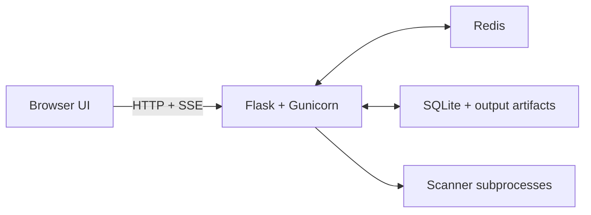

# darklab shell

darklab shell is a full-stack, self-hosted web terminal for running network diagnostics and security reconnaissance against remote targets, designed to feel like a polished operator tool rather than a thin browser wrapper around subprocesses. It combines a Flask + Gunicorn backend, Redis-backed rate limiting and live PID tracking, SQLite-backed persistent history and shareable artifacts, and a single-page terminal UI with real-time SSE streaming, multi-tab workflows, mobile-first layout, and theme-aware exports. Commands pass through an allowlist engine with deny-prefix overrides, loopback blocking, and shell metacharacter rejection before they reach a subprocess; scanners run under a dedicated unprivileged user with no write access outside designated tmpfs mounts. The app ships with over 30 pre-installed security tools plus SecLists, built-in sharing and redaction, and a three-layer test suite spanning pytest, Vitest, Playwright, and container smoke tests. A live instance is available at [shell.darklab.sh](https://shell.darklab.sh/).

<div align="center">
<table><tr>
<td align="center"><b>Desktop Demo</b></td>
<td align="center" width="320"><b>Mobile Demo</b></td>
</tr><tr>
<td valign="top">


</td>
<td valign="top" width="320">


</td>
</tr></table>
</div>

---

## Table of Contents
- [Features](#features)
- [Quick Start](#quick-start)
- [Architecture At A Glance](#architecture-at-a-glance)
- [Configuration](#configuration)
- [Installed Tools](#installed-tools)
- [Production Deployment](#production-deployment)
- [Security & Process Isolation](#security--process-isolation)
- [Documentation Map](#documentation-map)
- [Project Structure](#project-structure)

---

## Features

- **Terminal workflow** — real-time SSE streaming, killable long-running commands, a live run timer, optional line numbers and timestamps, output search, terminal-style prompt flow, bash-like `Tab` completion with context-aware flag/value hints for tools like nmap, curl, dig, ffuf, and nuclei, `Ctrl+R` reverse-history search, built-in pipe support for `grep`, `head`, `tail`, `wc -l`, `sort`, and `uniq`, a keyboard shortcuts reference panel, selection-safe desktop shortcuts, SSE keep-alive heartbeats for slow scans, and client-side stall detection with an inline notice when the connection silently dies
- **Mobile shell** — dedicated mobile composer, keyboard helper row with character and word-level cursor movement, stable Firefox-friendly layout, shared desktop/mobile Run-button state, and output-follow behavior that keeps the latest lines visible when the keyboard opens
- **Tabs and output handling** — multiple tabs, drag reordering, rename, overflow controls, copy and a `save ▾` dropdown (txt / html / pdf), and a jump-to-live / jump-to-bottom helper when you scroll away from the tail
- **History and sharing** — recent command chips, a persistent history drawer with full-text search across command text and stored output text (SQLite FTS5), filtering by command root / exit code / date range / starred status, starring/favorites, reconnect-to-active-run continuity after reload, session restore for non-running tabs and drafts, canonical run permalinks, snapshot permalinks with native share-sheet support, and full-output artifacts for longer runs
- **Session tokens** — generate a persistent `tok_` session token to carry your run history and shell identity across browsers and devices; `session-token generate/set/clear/rotate/list/revoke` manage the full token lifecycle with optional history migration, atomic rotate with rollback on failure, automatic cross-tab identity sync with session-scoped UI refresh, and server-side revocation; the Options modal exposes the four common inline actions (`Generate`, `Set`, `Rotate`, `Clear`) without entering commands
- **Safer sharing** — a built-in basic redaction baseline can mask common secrets or infrastructure details on snapshot permalinks, with optional operator regex rules appended on top. Permalink creation can choose raw vs redacted sharing per snapshot without changing the stored run history; local `save txt/html/pdf` exports remain raw
- **Run notifications** — optional browser desktop notifications fire on run completion (any exit code or kill); toggled from the Options panel; uses only the command root in the notification title to avoid exposing arguments or token values
- **Themes and presentation** — named theme variants, theme-aware permalink/export rendering, mobile/desktop theme parity, MOTD support, a customizable welcome animation (ASCII art, sampled commands, rotating hints), an operator-configurable FAQ modal, and user options for welcome-intro behavior plus default share-snapshot redaction
- **Built-in commands** — native shell commands like `help`, `history`, `last`, `limits`, `status`, `which`, `type`, `faq`, `banner`, `jobs`, `ip a`, `route`, `df -h`, and `free -h`, plus real `man` support where available
- **Guided workflows** — built-in diagnostic sequences (DNS troubleshooting, TLS/HTTPS check, HTTP triage, quick reachability, email server check) that load individual steps directly into the active prompt; extendable with site-specific sequences via `conf/workflows.yaml`
- **Security and operations** — allowlist-based execution with deny-prefix lists for loopback and path blocking, shell metacharacter blocking, Redis-backed rate limiting and PID tracking, structured logging with `text` and `gelf` format support, and an IP-gated `/diag` page showing app health, database and Redis status, activity stats, top commands, and per-tool availability
- **Pre-installed security tooling** — nmap, rustscan, naabu, masscan, nuclei, ffuf, feroxbuster, wfuzz, katana, wafw00f, sslscan, sslyze, openssl, and more, all sandboxed under a dedicated `scanner` user with enforced allowlists and the full [SecLists](https://github.com/danielmiessler/SecLists) collection pre-installed at `/usr/share/wordlists/seclists/`
- **Operator customization** — context-aware autocomplete hints configurable via `conf/autocomplete.yaml`, custom FAQ entries via `conf/faq.yaml`, welcome animation with custom ASCII art and sampled commands via `conf/welcome.yaml`, all reloaded live without a server restart
- **Configurable deployment** — Docker-first runtime, non-Docker local mode, YAML-driven config and theme overlays, SQLite persistence for history, previews, snapshots, and artifacts, and configurable retention pruning via `permalink_retention_days`

See [FEATURES.md](FEATURES.md) for the full grouped capability reference.

---

## Quick Start

### Option 1: Run With Docker Compose

This is the recommended setup. It gives you the same major runtime pieces as production:

- the Flask app
- Redis for rate limiting and active PID tracking
- the same container filesystem restrictions and capabilities used by the shipped image

Steps:

1. Make sure Docker and Docker Compose are installed and running.
2. From the repo root, start the stack:

   ```bash
   docker compose up --build
   ```

3. Open [http://localhost:8888](http://localhost:8888).

### Option 2: Run Locally Without Docker

This is useful when you want a lightweight local development loop and do not need the containerized runtime model.

Before you begin, ensure you have the following pre-requisites:

- Python 3.12+
- pip3
- Linux host or OSX (uses `os.setsid` for process group management; `sudo kill` for cross-user process termination)
- (Optional) Redis 6.2+ (for `GETDEL` support). If not configured or available, the app falls back to in-process mode

Other dependencies (Flask ≥ 2.0, PyYAML, Flask-Limiter[redis], redis-py) are installed automatically by the steps below.

The easiest path is to run:

```bash
bash examples/run_local.sh
```

That script:

1. checks for `python3`
2. checks for `pip3`
3. verifies that `app/requirements.txt` exists
4. installs the Python dependencies from that file
5. starts the app from `app/`

If you prefer to do it manually:

```bash
python3 -m pip install -r app/requirements.txt
cd app
python3 app.py
```

Then open [http://localhost:8888](http://localhost:8888).

Tradeoffs of the non-Docker path:

- no container filesystem restrictions
- no `scanner` user separation
- no Docker-provided networking/capability model
- no Redis sidecar unless you provide one yourself
- useful for quick frontend/backend iteration, but not a full production-like environment

---

## Architecture At A Glance



This is the high-level runtime shape of the app:

- the browser renders the shell UI and consumes SSE output streams
- Flask/Gunicorn owns routing, validation, shell-helper dispatch, and orchestration
- Redis handles shared worker coordination such as rate limiting and kill-path PID tracking
- SQLite plus artifact files hold durable history/share state
- real command execution happens in subprocesses rather than inside the web worker process

For system design, contributor workflow, and detailed test references, use the specialized docs in the [Documentation Map](#documentation-map).

---

## Configuration

All application settings live in `app/conf/config.yaml`. The file is read at startup, and changes take effect after `docker compose restart` with no rebuild needed. The values below are the built-in server defaults from `app/config.py`. The checked-in `config.yaml` now acts as an override file: settings that match the built-in defaults are commented out with a note showing the fallback value, and only the deployment-specific differences stay active. If you want an untracked deployment override layer, add `app/conf/config.local.yaml`; it is loaded after `config.yaml` and can override any subset of keys without affecting the checked-in file. The same sibling `*.local.*` overlay pattern is also supported for the other operator-controlled config files under `app/conf/` and `app/conf/themes/`.

| Setting | Default | Description |
|---------|---------|-------------|
| `app_name` | `darklab shell` | Name shown in the browser tab, header, and permalink pages |
| `prompt_prefix` | `anon@darklab:~$` | Prompt text shown in the shell input and welcome samples. Can be customized independently of `app_name` |
| `motd` | _(empty)_ | Optional operator message shown at the top of the welcome sequence as a centered “Message From The Operator” notice. Supports `**bold**`, `` `code` ``, `[link](url)`, and newlines. Leave empty to disable |
| `default_theme` | `darklab_obsidian.yaml` | Default theme filename for new visitors. Must match a file in `app/conf/themes/`. Overridden by the user's saved preference |
| `share_redaction_enabled` | `true` | Enables the built-in basic snapshot-share redaction baseline for bearer tokens, email addresses, IPv4 addresses, IPv6 addresses, and hostnames/dotted domains. When enabled, the `share snapshot` action asks whether to share the raw or redacted snapshot until the user sets a persistent default in the Options modal. If the prompt’s checkbox is enabled, the chosen raw/redacted mode is written back to that same persistent default. When disabled, no built-in or custom snapshot-share redaction rules run |
| `share_redaction_rules` | `[]` | Optional operator-defined regex rules appended after the built-in snapshot-share redaction baseline. Each rule supports `label`, `pattern`, `replacement`, and `flags` (`i`, `m`). This does not change stored run history or the history drawer permalink path; it affects only snapshot sharing |
| `trusted_proxy_cidrs` | `["127.0.0.1/32", "::1/128"]` | IPs / CIDRs allowed to supply `X-Forwarded-For`. Requests outside these ranges ignore forwarded headers and use the direct connection IP |
| `diagnostics_allowed_cidrs` | `[]` | IPs / CIDRs that may access the `/diag` operator diagnostics page. Checked against the resolved client IP using the same trusted-proxy rules as the rest of the app, so `X-Forwarded-For` is honored only when the direct peer is inside `trusted_proxy_cidrs`. Empty list (default) disables the page entirely (returns 404). When enabled, a `⊕ diag` button appears in the desktop rail and the mobile menu for matching visitors. The page shows app version, operational config, DB/Redis status, vendor asset source, tool availability, run activity by period, exit-code outcomes, and top commands by frequency and duration |
| `history_panel_limit` | `50` | Number of runs shown in the history drawer per session |
| `recent_commands_limit` | `8` | Number of recent commands shown as clickable chips (in the desktop rail's Recent section and the mobile chip row) |
| `permalink_retention_days` | `365` | Delete runs and snapshots older than this many days on startup. `0` = unlimited |
| `rate_limit_per_minute` | `30` | Max `/run` requests per minute per IP |
| `rate_limit_per_second` | `5` | Max `/run` requests per second per IP |
| `max_tabs` | `8` | Maximum number of tabs a user can have open at once. `0` = unlimited |
| `max_output_lines` | `5000` | Max lines retained in the live tab and in the SQLite run preview. Oldest lines are dropped from the top when exceeded. `0` = unlimited |
| `persist_full_run_output` | `true` | Server-side only. Persists full output for completed runs as compressed artifacts while the history drawer and normal run permalink keep using the capped SQLite preview |
| `full_output_max_mb` | `5 MB` | Server-side only. Hard cap on the uncompressed UTF-8 payload written into a full-output artifact before gzip compression. The app multiplies this value by `1024 * 1024` internally. `0` = unlimited |
| `command_timeout_seconds` | `3600` | Auto-kill commands that run longer than this many seconds. `0` = disabled |
| `heartbeat_interval_seconds` | `20` | How often to send an SSE heartbeat on idle connections to prevent proxy timeouts |
| `welcome_char_ms` | `18` | Base delay between each typed character in the welcome animation (ms). Lower = faster typing |
| `welcome_jitter_ms` | `12` | Random extra delay added per character (ms). `0` for perfectly even typing; higher for a more organic feel |
| `welcome_post_cmd_ms` | `650` | Pause after a welcome command finishes typing, before the next visual step begins (ms) |
| `welcome_inter_block_ms` | `850` | Gap between one sampled welcome command block finishing and the next sampled command starting (ms) |
| `welcome_first_prompt_idle_ms` | `1500` | Minimum idle time for the first ready prompt before the featured command starts typing (ms). Useful for giving the cursor a few visible blinks |
| `welcome_post_status_pause_ms` | `500` | Extra pause after the fake startup-status block completes and before the first command prompt appears (ms) |
| `welcome_sample_count` | `5` | Number of sampled command examples shown after the ASCII/status intro. `0` disables sampled commands |
| `welcome_status_labels` | `["CONFIG","RUNNER","HISTORY","LIMITS","AUTOCOMPLETE"]` | Labels shown in the fake startup-status block during the welcome animation. Best with 4-6 short labels |
| `welcome_hint_interval_ms` | `4200` | Delay between footer-hint rotations while the welcome tab remains idle (ms) |
| `welcome_hint_rotations` | `0` | Maximum number of hint states shown while the welcome tab remains idle. `0` keeps rotating until interrupted; `1` keeps only the first hint visible |
| `log_level` | `INFO` | Log verbosity. Options: `ERROR`, `WARN`, `INFO`, `DEBUG` |
| `log_format` | `text` | Log output format. Options: `text` (human-readable), `gelf` (GELF 1.1 JSON for Graylog) |

### Config file reload behavior

| File | When changes take effect |
|------|--------------------------|
| `conf/allowed_commands.txt` | Immediately — re-read on every request |
| `conf/faq.yaml` | Immediately — re-read on every request |
| `conf/ascii.txt` | On next page load — fetched once by the browser on load |
| `conf/ascii_mobile.txt` | On next page load — fetched once by the browser on load |
| `conf/app_hints.txt` | On next page load — fetched once by the browser on load |
| `conf/app_hints_mobile.txt` | On next page load — fetched once by the browser on load |
| `conf/welcome.yaml` | On next page load — fetched once by the browser on load |
| `conf/autocomplete.yaml` | On next page load — fetched once by the browser |
| `conf/config.yaml` | After `docker compose restart` (no rebuild needed) |

Most files under `app/conf/` and `app/conf/themes/` support an optional sibling overlay named `*.local.*` alongside the checked-in base file. `config.local.yaml` works as the main server override file, `allowed_commands.local.txt` and `autocomplete.local.yaml` append local entries, `faq.local.yaml` and `welcome.local.yaml` append local list items, `ascii.local.txt` and `ascii_mobile.local.txt` replace the banner art, and `app_hints.local.txt` / `app_hints_mobile.local.txt` append local hints. Theme files can also use `<name>.local.yaml` overlays under `app/conf/themes/`.

### Theme System

Theme configuration is documented in [THEME.md](THEME.md). The runtime model is:

- `app/conf/themes/` contains the selectable theme variants used by the browser-facing registry
- `default_theme` in `config.yaml` points at one of those filenames
- `theme_dark.yaml.example` and `theme_light.yaml.example` are generated reference templates; regenerate them with [scripts/generate_theme_examples.py](scripts/generate_theme_examples.py) after changing `_THEME_DEFAULTS` in `app/config.py`
- theme resolution order is: `localStorage.theme`, then `default_theme`, then the built-in dark fallback palette
- the resolved theme is injected into the live shell, permalink pages, diagnostics page, and HTML export path so those surfaces stay visually aligned

See [THEME.md](THEME.md) for the full theme architecture, token reference, and authoring workflow.

---

## Installed Tools

The following tools are installed in the Docker image and available for use:

| Tool | Purpose |
|------|---------|
| `ping` | ICMP reachability |
| `curl` / `wget` | HTTP/HTTPS requests |
| `dig` / `nslookup` / `host` | DNS lookups |
| `whois` | Domain & IP registration info |
| `traceroute` / `tcptraceroute` | Route tracing (ICMP and TCP) |
| `mtr` | Combined ping + traceroute (auto-rewritten to report mode, see Tool Notes) |
| `nmap` | Port scanning and service detection |
| `testssl.sh` | TLS/SSL vulnerability scanning |
| `dnsrecon` | DNS enumeration and zone transfer testing |
| `nikto` | Web server vulnerability scanning |
| `wapiti` | Web application vulnerability scanning |
| `wpscan` | WordPress vulnerability scanning |
| `nuclei` | Fast CVE/misconfiguration scanner using community templates |
| `subfinder` | Passive subdomain enumeration (ProjectDiscovery) |
| `pd-httpx` | HTTP/HTTPS probing — status codes, titles, tech detection (ProjectDiscovery). Renamed from `httpx` to avoid conflict with the Python `httpx` library pulled in by wapiti3 |
| `dnsx` | Fast DNS resolution and record querying (ProjectDiscovery) |
| `gobuster` | Directory, file, DNS, and vhost brute-forcing. Wordlists installed at `/usr/share/wordlists/seclists/` |
| `fping` | Fast parallel ICMP ping — sweep multiple hosts or a CIDR range simultaneously |
| `hping3` | TCP/IP packet assembler — TCP ping, SYN probes, traceroute-style path analysis |
| `masscan` | High-speed TCP port scanner; requires raw sockets (container has `NET_RAW`/`NET_ADMIN`) |
| `amass` | In-depth attack surface mapping and subdomain enumeration (OWASP project) |
| `assetfinder` | Fast passive subdomain discovery using public sources |
| `fierce` | DNS reconnaissance and subdomain brute-forcing |
| `dnsenum` | DNS enumeration — zone transfers, subdomains, reverse lookups, Google scraping |
| `ffuf` | Fast web fuzzer for directory, file, and vhost discovery. Wordlists at `/usr/share/wordlists/seclists/` |
| `naabu` | Fast port scanner with service discovery (ProjectDiscovery) |
| `katana` | JavaScript-aware web crawler for attack surface mapping (ProjectDiscovery) |
| `wafw00f` | WAF detection — identifies web application firewalls from HTTP fingerprints |
| `sslscan` | TLS/SSL cipher and certificate scanner — reports supported ciphers, protocol versions, and cert details |
| `sslyze` | Fast TLS configuration analyser — Heartbleed, ROBOT, CRIME, renegotiation, and certificate chain checks |
| `rustscan` | High-speed port discovery; optionally pipes results into nmap for service detection |

### Tool Notes

#### mtr

`mtr` normally runs as a live, full-screen interactive display that continuously redraws in place using ncurses. This requires a real TTY, which is not available in a web-based shell environment.

To work around this, the app automatically rewrites any `mtr` command to use `--report-wide` mode when no report flag is already present:

| You type | What runs |
|----------|-----------|
| `mtr google.com` | `mtr --report-wide google.com` |
| `mtr -c 20 google.com` | `mtr --report-wide -c 20 google.com` |
| `mtr --report google.com` | unchanged — already in report mode |

#### nmap

nmap's `--privileged` flag is automatically injected into every nmap command, telling nmap to use raw socket access (which it has via file capabilities set in the Dockerfile). This enables OS fingerprinting, SYN scans, and other features that would otherwise require running as root. Users do not need to add `--privileged` manually.

#### naabu

naabu defaults to raw SYN packet scanning via libpcap/gopacket, which requires privileges that are not reliably available inside the container even with file capabilities. The app automatically injects `-scan-type c` into every naabu command that doesn't already include `-scan-type` or `-st`, switching to TCP connect mode (equivalent to `nmap -sT`). Results are identical; the only difference is the scanning method. If you explicitly want raw SYN mode and have confirmed it works in your environment, pass `-scan-type s` and the rewrite will not fire.

#### masscan

masscan is a raw-packet-only scanner with no TCP connect fallback. It requires `CAP_NET_RAW`/`CAP_NET_ADMIN` and libpcap access. These are granted via `setcap` in the Dockerfile and `cap_add` in `docker-compose.yml`, but deep packet injection may still be restricted by the host kernel or container runtime. If masscan fails with an interface error, `rustscan` is a good alternative — it uses TCP connect scanning and works without raw socket access.

#### wapiti

By default wapiti writes its report to a file in `/tmp`, which isn't accessible from the browser. The app automatically appends `-f txt -o /dev/stdout` to any `wapiti` command that doesn't already specify an output path, redirecting the report to the terminal so results appear inline with the scan output. If you want to specify your own output format or path, include `-o` in your command and the rewrite won't fire.

#### nuclei

`nuclei` stores its template library and cache in `$HOME` by default. The app runs nuclei as the `scanner` user with `HOME=/tmp` so all nuclei writes go to the tmpfs mount. The `-ud /tmp/nuclei-templates` flag is automatically injected if not already present so templates are stored and reused across runs within the same container session. Templates are lost on container restart and re-downloaded on the first nuclei run, which takes 30–60 seconds.

---

## Production Deployment

The base `docker-compose.yml` is suitable for local use and testing. For a production deployment, the repo includes an optional Compose overlay at `examples/docker-compose.prod.yml` that adds GELF log transport, a reverse-proxy-aware network model, and container-level network tuning for high-volume scanning workloads. The sections below cover the knobs available to operators before and after applying that overlay.

### Environment Variables

The repo includes a [`.env.example`](.env.example) template. Copy it to `.env` and edit before starting Compose:

```bash
cp .env.example .env
```

```env
APP_PORT=8888
# WEB_CONCURRENCY=4
# WEB_THREADS=4
```

To run on a different port, edit `.env` first, then start Compose again. That single value propagates through the Dockerfile `EXPOSE`, Gunicorn bind address, iptables rule, healthcheck, and published port.

The same file is also the operator-facing place to tune Gunicorn runtime sizing:

- `WEB_CONCURRENCY` controls the number of Gunicorn worker processes
- `WEB_THREADS` controls the number of threads per worker

If they are unset, the entrypoint defaults remain `4` workers and `4` threads.

```bash
docker compose restart
```

### Production Override

The base [docker-compose.yml](docker-compose.yml) is the standalone shape used for local runs. The optional production overlay at [examples/docker-compose.prod.yml](examples/docker-compose.prod.yml) layers in deployment-specific behavior:

1. Docker container log transport:
   - enables the Docker `gelf` log driver for both `shell` and `redis`
   - reads `DOCKER_GELF_ADDRESS` from `.env`
2. Reverse-proxy-aware environment:
   - sets `VIRTUAL_HOST`
   - sets `LETSENCRYPT_HOST`
3. Network model:
   - removes the host `ports:` binding from the base file
   - switches the app to `expose:`
   - joins the external Docker network `darklab-net`
4. Deployment naming:
   - sets deployment-specific `container_name` values for the `shell` and `redis` services
5. Application log format:
   - still requires `log_format: gelf` in [app/conf/config.yaml](app/conf/config.yaml) or [app/conf/config.local.yaml](app/conf/config.local.yaml)
6. Optional runtime sizing:
   - `WEB_CONCURRENCY` and `WEB_THREADS` can be set in `.env` so operators can tune Gunicorn without editing `entrypoint.sh`

#### Network tuning for port scanners

Tools like `naabu` and `masscan` open a large number of sockets in rapid succession. Without tuning, the kernel's default limits on open file descriptors and ephemeral port ranges will throttle or fail wide scans. The prod overlay addresses this at two layers:

**`ulimits.nofile` — open file descriptor limit**

The `ulimits.nofile` setting in the compose file raises the container's file descriptor ceiling to 65 535. However, Docker cannot grant a container a limit higher than what the Docker daemon itself is allowed. If the daemon's own `nofile` limit is still at the system default (typically 1,024), this compose setting will silently have no effect.

Run this on the **host** to raise the daemon's limit for the current session:

```bash
sudo systemctl edit docker
```

Add (or verify) these lines under `[Service]`:

```ini
[Service]
LimitNOFILE=1048576
```

Then reload and restart the daemon:

```bash
sudo systemctl daemon-reload
sudo systemctl restart docker
```

This change is written to a drop-in unit file under `/etc/systemd/system/docker.service.d/` and persists across reboots automatically.

**Network-namespace sysctls — source ports and TIME_WAIT headroom**

The sysctls in the overlay are scoped to the container's network namespace and do not require any host changes:

| sysctl | value | why |
|---|---|---|
| `net.ipv4.ip_local_port_range` | `1024 65535` | widens the ephemeral port range from the kernel default (~32768–60999), giving scanners ~64k source ports instead of ~28k |
| `net.ipv4.tcp_tw_reuse` | `1` | allows TIME_WAIT sockets to be reused for new outbound connections |
| `net.ipv4.tcp_fin_timeout` | `15` | reduces the FIN_WAIT_2 timeout from the 60-second default so sockets are released faster |
| `net.ipv4.tcp_max_tw_buckets` | `131072` | raises the TIME_WAIT bucket ceiling before the kernel starts silently dropping sockets |

**`nf_conntrack_max` — connection tracking table size**

The Linux kernel's connection tracking table (`nf_conntrack`) records every active and recently-closed connection seen by the firewall. Under a wide port scan the table fills quickly; once full the kernel drops new connections and logs `nf_conntrack: table full, dropping packet`. This is a **host-level** setting — it cannot be set from inside the container — so it must be applied on the Docker host directly.

Apply immediately (takes effect without a reboot):

```bash
sudo sysctl -w net.netfilter.nf_conntrack_max=131072
```

Persist across reboots by writing a drop-in sysctl file:

```bash
echo "net.netfilter.nf_conntrack_max=131072" | sudo tee /etc/sysctl.d/99-conntrack.conf
```

The file in `/etc/sysctl.d/` is loaded automatically at boot by `systemd-sysctl`, so no further configuration is needed.

Once all configuration is in place, start the stack with the production overlay applied on top of the base:

```bash
docker compose -f docker-compose.yml -f examples/docker-compose.prod.yml up --build
```

---

## Security & Process Isolation

darklab shell uses layered controls rather than trusting the browser alone:

- Gunicorn runs as unprivileged `appuser`
- user-submitted commands run as separate unprivileged `scanner` processes
- `/data` stays writable only for the app runtime
- loopback targets like `localhost`, `127.0.0.1`, `0.0.0.0`, and `[::1]` are blocked
- shell chaining operators such as `&&`, `||`, `|`, `;`, redirection, and command substitution are blocked when the allowlist is active
- container startup also adds an OS-level guard so `scanner` cannot connect back to the app port

This section is intentionally operator-focused. For the developer-facing details behind cross-user signalling, Redis-backed multi-worker kill, and the `nmap` capability model, use [ARCHITECTURE.md](ARCHITECTURE.md).

### Read-only filesystem

The container filesystem is set to read-only (`read_only: true`) and the app volume is mounted read-only (`./app:/app:ro`). There are two intentional exceptions:

- **`/data`** — a writable bind mount for the SQLite database, owned by `appuser` with `chmod 700`. Only Gunicorn can write here; the `scanner` user that runs commands has no access
- **`/tmp`** — a `tmpfs` mount (in-memory, wiped on restart) used by tools that need scratch space for templates, sessions, and cache files

To prevent commands from writing to either path directly, the app blocks any command that references `/data` or `/tmp` as a filesystem argument (using a negative lookbehind so URLs containing `/data` or `/tmp` as path segments are still permitted).

---

## Documentation Map

- [ARCHITECTURE.md](ARCHITECTURE.md) - Runtime layers, request flow, persistence, security mechanics, and deployment notes
- [CONTRIBUTING.md](CONTRIBUTING.md) - Local setup, test workflow, linting, branch workflow, and merge request guidance
- [DECISIONS.md](DECISIONS.md) - Architectural rationale, tradeoffs, and implementation-history notes
- [tests/README.md](tests/README.md) - Detailed suite appendix, smoke-test coverage, and focused test commands
- [THEME.md](THEME.md) - Theme registry, selector metadata, and override behavior
- [FEATURES.md](FEATURES.md) - Full per-feature reference: autocomplete, pipe support, keyboard shortcuts, allowlist, welcome animation, history, permalinks, themes, and more

---

## Project Structure

Use this as a navigation map, not a replacement for [ARCHITECTURE.md](ARCHITECTURE.md). The architecture and testing docs carry the deeper explanations.

```text
.
├── .env.example                # Environment variable template (copy to .env and edit locally)
├── docker-compose.yml
├── Dockerfile
├── ARCHITECTURE.md            # Current system structure, diagrams, runtime layers, persistence, and deployment shape
├── CONTRIBUTING.md            # Contributor setup, local workflow, and merge request guidance
├── DECISIONS.md               # Architectural rationale, tradeoffs, and implementation-history notes
├── THEME.md                   # Theme authoring/reference guide and runtime token behavior
├── entrypoint.sh               # Container startup script — fixes /data ownership, drops to appuser
├── pyrightconfig.json          # Pyright/Pylance config — adds app/ to the module search path so
│                               #   tests that import app.py get correct static analysis in VS Code
├── .flake8                     # flake8 config — line length and per-file ignore rules for CI linting
├── .shellcheckrc               # shellcheck config — suppresses false positives (e.g. CDPATH= idiom)
├── .gitlab-ci.yml              # GitLab CI pipeline — pytest, Vitest, Playwright, lint, audit, and Docker build
├── .nvmrc                      # Node version pin (22) for Vitest / Playwright
├── package.json                # JS dev dependencies and test scripts
├── config/
│   ├── eslint.config.js        # ESLint config — indentation, quotes, and semicolon rules for JS config/test files
│   ├── hadolint.yaml           # hadolint config — ignores intentional Dockerfile patterns
│   ├── yamllint.yml            # yamllint config — relaxed line length, no document-start requirement
│   ├── vitest.config.js        # Vitest unit test config (jsdom environment)
│   ├── playwright.config.js    # Playwright single-project config for VS Code and focused local debugging
│   ├── playwright.parallel.config.js # Playwright parallel CLI config with isolated per-project Flask/state environments
│   ├── playwright.shared.js    # Shared Playwright server-builder helpers used by both configs
│   ├── playwright.demo.config.js     # Playwright config for recording the desktop demo video
│   └── playwright.demo.mobile.config.js # Playwright config for recording the mobile demo video
├── requirements-dev.txt        # Dev-only dependencies (pytest, flake8, bandit, pip-audit)
├── scripts/
│   ├── hooks/
│   │   └── pre-commit          # Git pre-commit hook — runs all lint, security, and unit checks (activate with: git config core.hooksPath scripts/hooks)
│   ├── playwright/
│   │   ├── run_e2e_server.sh   # Starts one isolated Flask e2e server with per-worker APP_DATA_DIR state
│   │   └── stop_e2e_servers.sh # Clears the configured Playwright test ports before local runs
│   ├── check_versions.sh       # Local dependency/version drift helper used by the manual CI job
│   ├── container_smoke_test.sh # Builds the container, runs all autocomplete.yaml example commands through /run, and checks output against tests/py/fixtures/container_smoke_test-expectations.json
│   ├── capture_container_smoke_test_outputs.sh # Runs the same commands in a browser and writes raw output to /tmp as a manual update reference; does not update the expectations file
│   ├── capture_output_for_smoke_test.mjs # Browser-driven smoke-test corpus capture helper
│   ├── generate_theme_examples.py # Regenerates the checked-in dark/light theme example files from app/config.py defaults
│   ├── record_demo.sh          # Records the desktop demo video — health-checks container, runs Playwright, stitches frames with ffmpeg
│   └── record_demo_mobile.sh   # Same as record_demo.sh but for the mobile shell UI
├── assets/                        # README media assets (demo videos)
├── tests/
│   ├── py/                     # Python / pytest tests
│   │   ├── conftest.py         # pytest configuration (sets working directory and sys.path to app/)
│   │   ├── fixtures/
│   │   │   └── container_smoke_test-expectations.json # Stored expected output for the Container Smoke Test corpus
│   │   ├── test_validation.py  # Tests for command validation, rewrites, and runtime availability helpers
│   │   ├── test_routes.py      # Flask integration tests via test client (all HTTP routes)
│   │   ├── test_run_history_share.py # Higher-value /run, history, share, built-in command, and persistence flows
│   │   ├── test_request_kill_and_commands.py # /kill, request parsing, loader edges, and built-in command resolution
│   │   ├── test_backend_modules.py # DB init/migration, loader/overlay helpers, config/theme/FAQ coverage
│   │   ├── test_container_smoke_test.py # Opt-in Docker build/run smoke test (see scripts/container_smoke_test.sh)
│   │   ├── test_output_search.py # SQLite FTS history-search coverage and fallback behavior
│   │   ├── test_session_routes.py # session-token generation/verify/migrate/revoke/starred route coverage
│   │   └── test_logging.py     # Structured logging: formatters, configure_logging, and event coverage
│   └── js/
│       ├── unit/               # Vitest unit tests for browser-module logic
│       │   ├── helpers/
│       │   │   └── extract.js  # fromScript() helper — loads browser JS into jsdom via new Function
│       │   ├── app.test.js         # bootstrap wiring, mobile shell/run-button regressions, prompt/composer boundaries, and modal controls
│       │   ├── runner.test.js      # elapsed formatting, run/kill edge cases, stall recovery
│       │   ├── history.test.js     # starring, clipboard, delete/clear failures, mobile chip behavior, draft restore
│       │   ├── state.test.js       # composer state store accessors and reset behavior
│       │   ├── tabs.test.js        # tab lifecycle, rename, overflow, export guards, permalink copy
│       │   ├── output.test.js      # ANSI rendering, timestamp/line-number mode, HTML export
│       │   ├── search.test.js      # search helper, regex/case modes, mixed-content line regression
│       │   ├── welcome.test.js     # welcome animation, config-driven timing, featured-sample interaction
│       │   ├── autocomplete.test.js # dropdown filtering, placement, viewport clamping, active-item scroll, active-input-only accept
│       │   ├── session.test.js     # session ID persistence, apiFetch() header injection
│       │   ├── config.test.js      # frontend fallback config coverage for /config-mirrored keys
│       │   └── utils.test.js       # escapeHtml, escapeRegex, MOTD rendering
│       └── e2e/                # Playwright end-to-end tests (require running Flask server)
│           ├── helpers.js      # runCommand/openHistory helpers
│           ├── welcome.helpers.js # shared welcome-route fixtures and setup for split welcome specs
│           ├── commands.spec.js # command execution, denial, and status rendering
│           ├── failure-paths.spec.js  # /run denial/rate limit, share/history failure toasts
│           ├── runner-stall.spec.js   # SSE stall recovery
│           ├── boot-resilience.spec.js # startup fetch fallbacks and core UI smoke checks
│           ├── kill.spec.js    # kill confirmation and running-tab stop behavior
│           ├── mobile.spec.js  # mobile composer/menu/layout regressions and touch flows
│           ├── output.spec.js  # copy/clear/save/export behavior
│           ├── rate-limit.spec.js # per-session /run rate limiting
│           ├── search.spec.js  # search/highlight/navigation behavior
│           ├── share.spec.js   # snapshot permalinks and clipboard behavior
│           ├── history.spec.js # history drawer flows, restore, starring, and chip cleanup
│           ├── shortcuts.spec.js # keyboard shortcuts including Ctrl+R history-search flow
│           ├── timestamps.spec.js # timestamp and line-number toggle behavior
│           ├── ui.spec.js      # theme selector, FAQ modal, and options modal behavior
│           ├── tabs.spec.js    # tab lifecycle, rename, reorder, and new-tab behavior
│           ├── welcome.spec.js # welcome animation and settle-path coverage
│           ├── welcome-interactions.spec.js # welcome command/badge interaction coverage
│           └── welcome-context.spec.js # welcome persistence across tabs and mobile context coverage
├── examples/
│   ├── docker-compose.prod.yml  # Optional production Docker Compose override (GELF, proxy env, external network)
│   └── run_local.sh             # Script to run without Docker using Python directly
├── .gitlab/
│   └── merge_request_templates/
│       └── Default.md          # Default GitLab merge request template used by contributors
├── data/                       # Writable volume — SQLite database (auto-created)
│   └── history.db              #   stores run history and tab snapshots
└── app/
    ├── app.py                  # Flask factory — logging setup, blueprint registration, before/after-request hooks
    ├── extensions.py           # Flask-Limiter singleton (init_app deferred to app.py)
    ├── helpers.py              # Trusted-proxy IP resolver and session-ID extractor (used by all blueprints)
    ├── blueprints/
    │   ├── assets.py           # /vendor/*, /favicon.ico, /health, /diag (IP-gated operator diagnostics)
    │   ├── content.py          # /, /config, /themes, /faq, /autocomplete, /welcome*
    │   ├── run.py              # /run (rate-limited SSE), /kill; run-output capture helpers
    │   ├── history.py          # /history*, /share*; preview/full-output shaping helpers
    │   └── session.py          # /session/token/*, /session/migrate, /session/starred*
    ├── fake_commands.py        # Synthetic shell helpers handled through /run before spawn
    ├── config.py               # load_config(), CFG defaults, SCANNER_PREFIX detection, theme registry
    ├── logging_setup.py        # structured logging formatters and logger configuration
    ├── database.py             # SQLite connection, schema init, retention pruning
    ├── process.py              # Redis setup, pid_register/pid_pop, in-process fallback
    ├── redaction.py            # Snapshot-share redaction helpers and built-in rule application
    ├── commands.py             # Command loading, validation (is_command_allowed), and rewrites
    ├── permalinks.py           # Flask context/render helpers for /history/<id> and /share/<id>
    ├── run_output_store.py     # Preview/full-output capture and artifact persistence helpers
    ├── favicon.ico             # Site favicon
    ├── conf/                   # Operator-configurable files — edit these to customize the deployment
    │   ├── config.yaml             # Application configuration (see Configuration section)
    │   ├── config.local.yaml       # Optional untracked deployment overrides loaded after config.yaml; sibling *.local.* overlays are also supported
    │   ├── allowed_commands.txt    # Command allowlist (one prefix per line, ## headers for FAQ grouping)
    │   ├── autocomplete.yaml         # Structured autocomplete hints for context-aware flag and value suggestions
    │   ├── app_hints.txt           # Rotating footer hints for the welcome animation (optional)
    │   ├── ascii.txt               # Decorative ASCII banner shown during the welcome animation (optional)
    │   ├── ascii_mobile.txt        # Mobile ASCII banner shown during the mobile welcome animation (optional)
    │   ├── app_hints_mobile.txt    # Mobile rotating footer hints for the welcome animation (optional)
    │   ├── faq.yaml                # Custom FAQ entries appended to the built-in FAQ (optional)
    │   └── welcome.yaml            # Welcome command samples with optional group/featured metadata (optional)
    ├── templates/
    │   ├── index.html          # Frontend HTML shell rendered by Flask
    │   ├── diag.html           # Operator diagnostics page (IP-gated, uses active theme)
    │   ├── permalink_base.html # Shared shell for permalink pages
    │   ├── permalink.html      # Live permalink page template
    │   ├── permalink_error.html # Missing/expired permalink template
    │   ├── theme_vars_style.html # Injected CSS variable block for the active theme
    │   └── theme_vars_script.html # Injected JS theme metadata/bootstrap block
    ├── requirements.txt        # Python runtime dependencies
    └── static/
        ├── css/
        │   ├── styles.css      # Compatibility entrypoint that imports the modular CSS files in order
        │   ├── base.css        # Theme tokens, reset, base layout, header, input, and dropdown foundations
        │   ├── shell.css       # Terminal shell frame, panels, history row, utility buttons, and modals
        │   ├── components.css  # Tabs, search UI, permalink/history surfaces, toast, and menu components
        │   ├── terminal_export.css # Shared export/permalink/diag header chrome
        │   ├── welcome.css     # Welcome animation, operator notice, and onboarding-specific UI
        │   ├── shell-chrome.css # Desktop shell: left rail, tabbar row, and bottom HUD bar (mobile falls through to mobile.css)
        │   ├── mobile.css      # Mobile composer, mobile shell layout, sheets, and viewport overrides
        │   └── diag.css        # Diagnostics-page-specific layout and responsive chrome
        ├── fonts/              # Vendored local font files used by the app's vendor routes and permalink/export fallbacks
        └── js/
            ├── session.js      # Session UUID + apiFetch wrapper (loads first)
            ├── utils.js        # escapeHtml, escapeRegex, renderMotd, showToast
            ├── config.js       # APP_CONFIG defaults
            ├── dom.js          # Shared DOM element references
            ├── state.js        # Shared app-state store/accessors
            ├── ui_helpers.js   # DOM-facing helpers and visibility setters
            ├── tabs.js         # Tab lifecycle management
            ├── output.js       # ANSI rendering and line management
            ├── search.js       # In-output search (with case-sensitive and regex modes)
            ├── autocomplete.js # Command autocomplete dropdown
            ├── export_html.js  # Shared export HTML builder / embedded-font helper
            ├── history.js      # Command history chips and drawer (with starring)
            ├── welcome.js      # Welcome startup animation (ASCII, status lines, samples, hints)
            ├── runner.js       # Command execution, SSE stream, kill, stall detection
            ├── app.js          # Shared UI helpers, overlays, and mobile-layout glue
            ├── controller.js   # Initialization and event wiring (loads after app.js)
            ├── shell_chrome.js # Desktop rail (Recent, Workflows, nav) and bottom HUD controller (loads last)
            └── vendor/         # Committed browser builds — generated by scripts/build_vendor.mjs
                                #   from npm packages in package.json; regenerate with npm run vendor:sync
                ├── ansi_up.js          # ANSI-to-HTML (ansi_up v6, ESM-only — wrapped as IIFE browser global)
                └── jspdf.umd.min.js    # PDF generation (jsPDF UMD build, copied as-is from npm)
```
