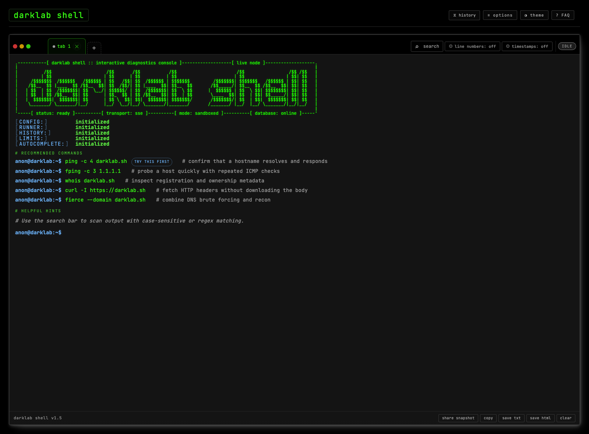
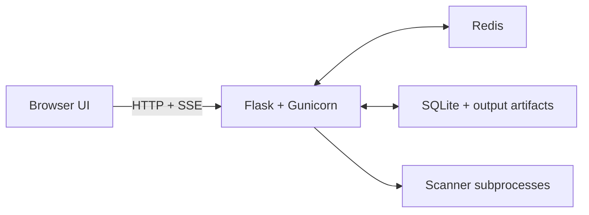

# darklab shell

A web-based shell for running network diagnostics and vulnerability scans against remote targets. It combines a Flask backend, a single-page terminal UI, Redis-backed rate limiting and process tracking, and SQLite persistence for history, run previews, and permalinks. Completed runs can also persist full output as compressed artifacts for later inspection. The project is built to run in Docker by default, but also supports local development without containers.



_This screenshot is refreshed by the Playwright e2e suite and can be regenerated directly with `npm run capture:readme-screenshot`._

## Table of Contents
- [Architecture At A Glance](#architecture-at-a-glance)
- [Documentation Map](#documentation-map)
- [Features](#features)
- [Quick Start](#quick-start)
- [Feature Details](#feature-details)
- [Configuration](#configuration)
- [Operator Diagnostics](#operator-diagnostics)
- [Contributor Guide](#contributor-guide)
- [Project Structure](#project-structure)

---

## Architecture At A Glance



This is the high-level runtime shape of the app:

- the browser renders the shell UI and consumes SSE output streams
- Flask/Gunicorn owns routing, validation, shell-helper dispatch, and orchestration
- Redis handles shared worker coordination such as rate limiting and kill-path PID tracking
- SQLite plus artifact files hold durable history/share state
- real command execution happens in subprocesses rather than inside the web worker process

For system design, contributor workflow, and detailed test references, use the specialized docs listed below.

---

## Documentation Map

- [ARCHITECTURE.md](ARCHITECTURE.md) - Runtime layers, request flow, persistence, security mechanics, and deployment notes
- [CONTRIBUTORS.md](CONTRIBUTORS.md) - Local setup, test workflow, linting, branch workflow, and merge request guidance
- [DECISIONS.md](DECISIONS.md) - Architectural rationale, tradeoffs, and implementation-history notes
- [tests/README.md](tests/README.md) - Detailed suite appendix, smoke-test coverage, and focused test commands
- [THEME.md](THEME.md) - Theme registry, selector metadata, and override behavior

---

## Features

- **Terminal workflow** — real-time SSE streaming, killable long-running commands, a live run timer, optional line numbers and timestamps, output search, terminal-style prompt flow, bash-like `Tab` completion, built-in pipe support for `grep`, `head`, `tail`, and `wc -l`, and selection-safe desktop shortcuts
- **Mobile shell** — dedicated mobile composer, keyboard helper row with character and word-level cursor movement, stable Firefox-friendly layout, shared desktop/mobile Run-button state, and output-follow behavior that keeps the latest lines visible when the keyboard opens
- **Tabs and output handling** — multiple tabs, drag reordering, rename, overflow controls, copy/save/export actions, and a jump-to-live / jump-to-bottom helper when you scroll away from the tail
- **History and sharing** — recent command chips, a persistent history drawer with search/filtering, starring/favorites, reconnect-to-active-run continuity after reload, session restore for non-running tabs and drafts, canonical run permalinks, snapshot permalinks, and full-output artifacts for longer runs
- **Safer sharing and exports** — a built-in basic redaction baseline can mask common secrets or infrastructure details on snapshot permalinks and local exports, with optional operator regex rules appended on top. Permalink creation can now choose raw vs redacted sharing per snapshot, without changing the stored run history
- **Themes and presentation** — named theme variants, theme-aware permalink/export rendering, mobile/desktop theme parity, MOTD support, welcome animation assets, an FAQ modal, and user options for welcome-intro behavior plus default share-snapshot redaction
- **Built-in commands** — native shell commands like `help`, `history`, `last`, `limits`, `status`, `which`, `type`, `faq`, `banner`, `jobs`, `ip a`, `route`, `df -h`, and `free -h`, plus real `man` support where available
- **Security and operations** — allowlist-based execution, shell metacharacter blocking, loopback/path blocking, Redis-backed rate limiting and PID tracking, structured logging, and an IP-gated diagnostics page
- **Configurable deployment** — Docker-first runtime, non-Docker local mode, YAML-driven config and theme overlays, and SQLite persistence for history, previews, snapshots, and artifacts

See [Feature Details](#feature-details) for the full grouped capability list.

## Quick Start

### Running with Docker

### Option 1: Run Locally With Docker Compose

This is the recommended local setup. It gives you the same major runtime pieces as production:

- the Flask app
- Redis for rate limiting and active PID tracking
- the same container filesystem restrictions and capabilities used by the shipped image

Step by step:

1. Make sure Docker and Docker Compose are installed and running.
2. From the repo root, start the stack:

```bash
docker compose up --build
```

3. Open [http://localhost:8888](http://localhost:8888).

The repo includes a root [`.env`](.env) file with:

```env
APP_PORT=8888
# WEB_CONCURRENCY=4
# WEB_THREADS=4
```

To run on a different port, edit [`.env`](.env) first, then start Compose again. That single value propagates through the Dockerfile `EXPOSE`, Gunicorn bind address, iptables rule, healthcheck, and published port.

The same file is also the operator-facing place to tune Gunicorn runtime sizing:

- `WEB_CONCURRENCY` controls the number of Gunicorn worker processes
- `WEB_THREADS` controls the number of threads per worker

If they are unset, the entrypoint defaults remain `4` workers and `4` threads.

If you want the stack to run in a proxy-aware production layout, use the optional production override. It removes the host port binding from the shell service, switches it to `expose`, adds the `VIRTUAL_HOST` / `LETSENCRYPT_HOST` environment variables for `nginx-proxy`, joins the external `darklab-net` Docker network, assigns production-specific container names to `shell` and `redis`, and enables Docker GELF transport for both containers. Set `DOCKER_GELF_ADDRESS` in [`.env`](.env), set `log_format: gelf` in [app/conf/config.yaml](app/conf/config.yaml) or [app/conf/config.local.yaml](app/conf/config.local.yaml), and start Compose with:

```bash
docker compose -f docker-compose.yml -f examples/docker-compose.prod.yml up --build
```

When config changes take effect in Docker:

| File | When changes take effect |
|------|--------------------------|
| `conf/allowed_commands.txt` | Immediately — re-read on every request |
| `conf/faq.yaml` | Immediately — re-read on every request |
| `conf/ascii.txt` | On next page load — fetched once by the browser on load |
| `conf/ascii_mobile.txt` | On next page load — fetched once by the browser on load |
| `conf/app_hints.txt` | On next page load — fetched once by the browser on load |
| `conf/app_hints_mobile.txt` | On next page load — fetched once by the browser on load |
| `conf/welcome.yaml` | On next page load — fetched once by the browser on load |
| `conf/autocomplete_context.yaml` | On next page load — fetched once by the browser |
| `conf/config.yaml` | After `docker compose restart` (no rebuild needed) |

Most files under `app/conf/` and `app/conf/themes/` support an optional sibling
overlay named `*.local.*` alongside the checked-in base file. `config.local.yaml`
works as the main server override file, `allowed_commands.local.txt` and
`autocomplete_context.local.yaml` append local entries, `faq.local.yaml` and
`welcome.local.yaml` append local list items, `ascii.local.txt` and
`ascii_mobile.local.txt` replace the banner art, and `app_hints.local.txt` /
`app_hints_mobile.local.txt` append local hints. Theme files can also use
`<name>.local.yaml` overlays under `app/conf/themes/`.

After editing [app/conf/config.yaml](app/conf/config.yaml) or [app/conf/config.local.yaml](app/conf/config.local.yaml), restart the app container:

```bash
docker compose restart
```

#### Read-only filesystem

The container filesystem is set to read-only (`read_only: true`) and the app volume is mounted read-only (`./app:/app:ro`). There are two intentional exceptions:

- **`/data`** — a writable bind mount for the SQLite database, owned by `appuser` with `chmod 700`. Only Gunicorn can write here; the `scanner` user that runs commands has no access
- **`/tmp`** — a `tmpfs` mount (in-memory, wiped on restart) used by tools that need scratch space for templates, sessions, and cache files

To prevent commands from writing to either path directly, the app blocks any command that references `/data` or `/tmp` as a filesystem argument (using a negative lookbehind so URLs containing `/data` or `/tmp` as path segments are still permitted).

#### Keep-Alive & Long-Running Commands

For commands that produce little or no output for extended periods (e.g. slow scans, nuclei running against a large target), the SSE connection is kept alive by a server-sent heartbeat comment sent every `heartbeat_interval_seconds` (default 20s) when no output is being produced. This prevents nginx and the browser from treating the idle connection as stale and dropping it.

The nginx-proxy timeout environment variables (`PROXY_READ_TIMEOUT`, `PROXY_SEND_TIMEOUT`, `PROXY_CONNECT_TIMEOUT`) in `docker-compose.yml` are set to 3600 seconds to match the Gunicorn worker timeout, giving commands up to an hour to complete. Commands can also be automatically killed after a configurable duration via `command_timeout_seconds` in `config.yaml`.

#### SSE Stall Detection

If no data arrives from the server for 45 seconds (more than twice the heartbeat interval), the client assumes the connection has silently died and shows a notice inline:

```
[connection stalled — command may still be running on the server]
[check the history panel for the result once it completes]
```

The tab is reset to an error state so you can run another command. The original command continues running server-side and its result will appear in the history panel once it finishes.

#### Production Override

The base [docker-compose.yml](docker-compose.yml) is the standalone deployment shape used for local runs. The optional production override at [examples/docker-compose.prod.yml](examples/docker-compose.prod.yml) layers in deployment-specific behavior:

1. Docker container log transport:
   - enables the Docker `gelf` log driver for both `shell` and `redis`
   - reads `DOCKER_GELF_ADDRESS` from [`.env`](.env)
2. Reverse-proxy-aware environment:
   - sets `VIRTUAL_HOST`
   - sets `LETSENCRYPT_HOST`
3. Network model:
   - removes the host `ports:` binding from the base file
   - switches the app to `expose:`
   - joins the external Docker network `darklab-net`
4. Deployment naming:
   - sets deployment-specific `container_name` values for the `shell` and `redis` services
5. Application log format:
   - still requires `log_format: gelf` in [app/conf/config.yaml](app/conf/config.yaml) or [app/conf/config.local.yaml](app/conf/config.local.yaml)
6. Optional runtime sizing:
   - `WEB_CONCURRENCY` and `WEB_THREADS` can be set in [`.env`](.env) so operators can tune Gunicorn without editing `entrypoint.sh`

Start Compose with the production override:

```bash
docker compose -f docker-compose.yml -f examples/docker-compose.prod.yml up --build
```

#### Redis

The `docker-compose.yml` includes a `redis:7-alpine` service used for two purposes:

- **Rate limiting** — Flask-Limiter uses Redis as its shared counter store so the configured per-IP limits are enforced accurately across all Gunicorn workers. Without Redis, each of the 4 workers maintains its own independent counter, effectively multiplying the limit by 4.
- **Active process tracking** — running process IDs (`run_id → pid`) are stored in Redis with a 4-hour TTL so any worker can look up a PID to handle a kill request, regardless of which worker started the command.

Redis is configured as read-only (`read_only: true`) with a `tmpfs` at `/tmp` for scratch space. The app connects via the `REDIS_URL` environment variable (`redis://redis:6379/0`). If Redis is unavailable (e.g. local development without Docker), the app falls back to in-process state — correct for single-process use but not for multi-worker Gunicorn.

### Option 2: Run Locally Without Docker

This is useful when you want a lightweight local development loop and do not need the containerized runtime model.

Before you start:

- `python3` must be installed
- `pip3` must be installed
- the Python dependencies from `app/requirements.txt` must be installable on your machine

The easiest path is the helper script:

```bash
bash examples/run_local.sh
```

That script now:

1. checks for `python3`
2. checks for `pip3`
3. verifies that `app/requirements.txt` exists
4. installs the Python dependencies from that file
5. starts the app from `app/`

If you prefer to do it manually:

```bash
python3 -m pip install -r app/requirements.txt
cd app
python3 app.py
```

Then open [http://localhost:8888](http://localhost:8888).

Tradeoffs of the non-Docker path:

- no container filesystem restrictions
- no `scanner` user separation
- no Docker-provided networking/capability model
- no Redis sidecar unless you provide one yourself
- useful for quick frontend/backend iteration, but not a full production-like environment

## Feature Details

### Shell UX

- **Prompt behavior** — the shell keeps a terminal-style prompt flow: submitted commands are echoed inline, blank **Enter** drops a fresh prompt line without calling `/run`, and **Ctrl+C** either opens kill confirmation for an active run or starts a new prompt line in an idle tab
- **Autocomplete** — suggestions stay terminal-oriented rather than picker-oriented: `Tab` expands to the longest shared prefix first, repeated `Tab` cycles matches forward, `Shift+Tab` cycles backward, and `Enter` accepts the highlighted suggestion
- **Context-aware completions** — after the command root is known, autocomplete can switch from flat whole-command suggestions to root-aware flag and value hints with short descriptions, so long tools like `nmap`, `ffuf`, `curl`, `dig`, and `nuclei` are easier to build without leaving the prompt
- **Reverse-history search** — `Ctrl+R` opens an interactive history search mode that filters prior commands without leaving the prompt; `Enter` accepts and runs, `Tab` accepts without running, and `Escape` restores the pre-search draft
- **Recent commands and starring** — recent commands appear as chips below the prompt, starred commands pin to the top of both the chip row and the history drawer, and starring from the drawer can promote a command back into the chip row immediately

### Terminal Workflow

- **Real-time output streaming** — output appears line by line over SSE, with batched flushes for fast commands and live-tail follow until you scroll away
- **Kill running processes** — each tab gets a **■ Kill** action while running, with confirmation before SIGTERM is sent to the full process group
- **Run timer** — a live elapsed timer sits next to the status pill while a command runs, and the final elapsed time is recorded in the exit line
- **Timestamps and line numbers** — toggle elapsed or clock timestamps and toggle line numbers independently; both are rendered from shared per-line prefix metadata so existing output updates in place
- **Selection-safe prompt shortcuts** — after highlighting transcript text on desktop, `ArrowUp`, `ArrowDown`, `Enter`, and `Ctrl+R` hand control back to the prompt without losing the shortcut
- **Terminal-like command flow** — while a command runs, the live prompt hides, completed commands are echoed inline above their output, blank **Enter** adds a fresh prompt line, and **Ctrl+C** either opens kill confirmation or drops to a new prompt line depending on tab state
- **Output search** — search within the active tab with match highlighting, prev/next navigation, case-sensitive mode, and regex mode

### Mobile Shell

- **Mobile composer dock** — on touch-sized screens the app uses a visible mobile composer with its own Run button and keyboard helper row
- **Stable mobile layout** — the mobile shell uses a simpler normal-flow layout that avoids the earlier Firefox keyboard flash/gap/floating-composer regressions
- **Shared composer behavior** — desktop and mobile Run buttons stay disabled together for blank prompts and running tabs, and the visible mobile input stays aligned with history chips, autocomplete, and cursor helpers
- **Faster mobile editing** — the keyboard helper row supports `Home`, `End`, single-character left/right moves, word-left / word-right jumps, and delete-word without leaving the mobile composer
- **Output follow on keyboard open** — when the keyboard opens, the active output re-sticks to the bottom so the last line stays visible

### Tabs, Output, and Navigation

- **Tabs / multiple runs** — open multiple tabs to run commands in parallel or keep earlier output visible; each tab tracks its own status
- **Tab strip controls** — tabs can be reordered via drag-and-drop, renamed inline, and scrolled with overflow controls when the row is crowded
- **Live output tail helper** — when you scroll off the bottom of a streaming tab, a tab-scoped jump-to-live / jump-to-bottom button appears until you return to the tail
- **Copy / save / export** — copy plain-text output, download a timestamped `.txt`, or export themed ANSI-preserving HTML from the tab action bar

### History and Sharing

- **Run history drawer** — completed runs are available in a slide-out panel with timestamps, exit codes, search, command-root/date/exit/starred filters, removable active-filter chips, restore-to-tab, copy-command, and permalink actions
- **Reload continuity for active runs** — when the browser reloads during a running command, the shell restores an in-flight placeholder tab for that session, keeps kill available, preserves normal prompt-echo formatting for the restored command line, and automatically swaps in the saved run view once the command completes
- **Reload continuity for idle work** — non-running tabs restore separately from browser session storage, including tab labels, transcript previews, statuses, and non-active drafts for the current browser session
- **Recent commands** — recent commands appear as clickable chips for fast re-runs, with desktop overflow collapsing to `+ more`
- **Starred / favorites** — starred commands are pinned to the top of both the chip row and history drawer, and starring from the drawer can promote a command into the chip row immediately
- **Permalinks** — tabs can create snapshot permalinks, history entries link to canonical stored runs, and full-output artifacts can back longer run permalinks without bloating the interactive preview store
- **Permalink display controls** — permalink pages honor saved timestamp/line-number preferences when the required metadata exists and follow the active theme
- **Share redaction defaults** — snapshot sharing can prompt for raw vs redacted output until a persistent default is chosen in Options, and the same default is reused by both the prompt flow and the Options modal

### Themes, Welcome, and Help Surfaces

- **Theme selector** — choose named theme variants grouped by metadata, with mobile and desktop preview layouts and shared theme-aware permalink/export rendering
- **Welcome animation** — optional startup animation can show ASCII art, startup status lines, sampled commands, and rotating hints; desktop and mobile have separate asset files where needed
- **MOTD** — optional message of the day supports lightweight formatting and links
- **FAQ modal** — rendered from the backend FAQ dataset so built-in and custom FAQ entries share one source of truth

### Built-In Commands and Shell Responses

- **Useful built-in commands** — native commands like `help`, `history`, `last`, `limits`, `retention`, `status`, `which`, `type`, `faq`, `banner`, `fortune`, `jobs`, and `clear` stay useful inside the shell without relying on external binaries
- **Shell identity commands** — `env`, `pwd`, `uname`, `uname -a`, `id`, `groups`, `hostname`, `date`, `tty`, `who`, `uptime`, `ip a`, `route`, `df -h`, and `free -h` return stable shell-style information without exposing host internals
- **Guardrail commands** — `sudo`, `reboot`, `poweroff`, `halt`, `shutdown now`, `su`, and the exact `rm -fr /` / `rm -rf /` patterns return explicit shell responses instead of pretending to run
- **`man` support** — `man <allowed-command>` renders the real man page when tooling exists, while `man <built-in-command>` shows the built-in command summary

### Security, Operations, and Configuration

- **Command allowlist** — allowed commands are managed through plain-text config with no restart required
- **Shell injection protection** — blocks `&&`, `||`, `|`, `;`, backticks, `$()`, redirects, and direct filesystem references to `/data` and `/tmp`
- **Rate limiting and process tracking** — Redis-backed rate limiting and PID tracking keep multi-worker run/kill behavior correct
- **Anonymous session tracking** — browser sessions send a stable `X-Session-ID` so history and tests remain scoped per client
- **Structured logging** — four log levels and two formats (`text` and `gelf`) with structured event context
- **Operator diagnostics page** — IP-gated `/diag` view exposes health and usage state without requiring a shell session
- **Configurable deployment** — core behavior is controlled from `config.yaml`, optional `*.local.*` overlays, and theme files under `app/conf/themes/`

Open [http://localhost:8888](http://localhost:8888). Note that without Docker, the installed security tooling (nmap, nuclei, etc.) and process isolation (`scanner` user, read-only filesystem) will not be in effect.

---

## Configuration

All application settings live in `app/conf/config.yaml`. The file is read at startup, and changes take effect after `docker compose restart` with no rebuild needed. The values below are the built-in server defaults from `app/config.py`. The checked-in `config.yaml` now acts as an override file: settings that match the built-in defaults are commented out with a note showing the fallback value, and only the deployment-specific differences stay active. If you want an untracked deployment override layer, add `app/conf/config.local.yaml`; it is loaded after `config.yaml` and can override any subset of keys without affecting the checked-in file. The same sibling `*.local.*` overlay pattern is also supported for the other operator-controlled config files under `app/conf/` and `app/conf/themes/`.

| Setting | Default | Description |
|---------|---------|-------------|
| `app_name` | `darklab shell` | Name shown in the browser tab, header, and permalink pages |
| `prompt_prefix` | `anon@darklab:~$` | Prompt text shown in the shell input and welcome samples. Can be customized independently of `app_name` |
| `motd` | _(empty)_ | Optional operator message shown at the top of the welcome sequence as a centered “Message From The Operator” notice. Supports `**bold**`, `` `code` ``, `[link](url)`, and newlines. Leave empty to disable |
| `default_theme` | `darklab_obsidian.yaml` | Default theme filename for new visitors. Must match a file in `app/conf/themes/`. Overridden by the user's saved preference |
| `share_redaction_enabled` | `true` | Enables the built-in basic share/export redaction baseline for bearer tokens, email addresses, IPv4 addresses, IPv6 addresses, and hostnames/dotted domains. When enabled, the `share snapshot` action asks whether to share the raw or redacted snapshot until the user sets a persistent default in the Options modal. If the prompt’s checkbox is enabled, the chosen raw/redacted mode is written back to that same persistent default. When disabled, no built-in or custom share/export redaction rules run |
| `share_redaction_rules` | `[]` | Optional operator-defined regex rules appended after the built-in share/export redaction baseline. Each rule supports `label`, `pattern`, `replacement`, and `flags` (`i`, `m`). This first version does not change the stored run history or the history drawer permalink path; it only affects snapshot sharing and local export paths |
| `trusted_proxy_cidrs` | `["127.0.0.1/32", "::1/128"]` | IPs / CIDRs allowed to supply `X-Forwarded-For`. Requests outside these ranges ignore forwarded headers and use the direct connection IP |
| `diagnostics_allowed_cidrs` | `[]` | IPs / CIDRs that may access the `/diag` operator diagnostics page. Checked against the resolved client IP using the same trusted-proxy rules as the rest of the app, so `X-Forwarded-For` is honored only when the direct peer is inside `trusted_proxy_cidrs`. Empty list (default) disables the page entirely (returns 404). When enabled, a `⊕ diag` button appears in the desktop header and mobile menu for matching visitors. The page shows app version, operational config, DB/Redis status, vendor asset source, tool availability, run activity by period, exit-code outcomes, and top commands by frequency and duration |
| `history_panel_limit` | `50` | Number of runs shown in the history drawer per session |
| `recent_commands_limit` | `8` | Number of recent commands shown as clickable chips below the input |
| `permalink_retention_days` | `365` | Delete runs and snapshots older than this many days on startup. `0` = unlimited |
| `rate_limit_per_minute` | `30` | Max `/run` requests per minute per IP |
| `rate_limit_per_second` | `5` | Max `/run` requests per second per IP |
| `max_tabs` | `8` | Maximum number of tabs a user can have open at once. `0` = unlimited |
| `max_output_lines` | `5000` | Max lines retained in the live tab and in the SQLite run preview. Oldest lines are dropped from the top when exceeded. `0` = unlimited |
| `persist_full_run_output` | `true` | Server-side only. Persist full output for completed runs as compressed artifacts while the history drawer and normal run permalink keep using the capped SQLite preview |
| `full_output_max_mb` | `5 MB` | Server-side only. Hard cap on the uncompressed UTF-8 payload written into a full-output artifact before gzip compression. The app multiplies this value by `1024 * 1024` internally. `0` = unlimited |
| `command_timeout_seconds` | `3600` | Auto-kill commands that run longer than this many seconds. `0` = disabled |
| `heartbeat_interval_seconds` | `20` | How often to send an SSE heartbeat on idle connections to prevent proxy timeouts |
| `welcome_char_ms` | `18` | Base delay between each typed character in the welcome animation (ms). Lower = faster typing |
| `welcome_jitter_ms` | `12` | Random extra delay added per character (ms). `0` for perfectly even typing; higher for a more organic feel |
| `welcome_post_cmd_ms` | `650` | Pause after a welcome command finishes typing, before the next visual step begins (ms) |
| `welcome_inter_block_ms` | `850` | Gap between one sampled welcome command block finishing and the next sampled command starting (ms) |
| `welcome_first_prompt_idle_ms` | `1500` | Minimum idle time for the first ready prompt before the featured command starts typing (ms). Useful for giving the cursor a few visible blinks |
| `welcome_post_status_pause_ms` | `500` | Extra pause after the fake startup-status block completes and before the first command prompt appears (ms) |
| `welcome_sample_count` | `5` | Number of sampled command examples shown after the ASCII/status intro. `0` disables sampled commands |
| `welcome_status_labels` | `["CONFIG","RUNNER","HISTORY","LIMITS","AUTOCOMPLETE"]` | Labels shown in the fake startup-status block during the welcome animation. Best with 4-6 short labels |
| `welcome_hint_interval_ms` | `4200` | Delay between footer-hint rotations while the welcome tab remains idle (ms) |
| `welcome_hint_rotations` | `0` | Maximum number of hint states shown while the welcome tab remains idle. `0` keeps rotating until interrupted; `1` keeps only the first hint visible |
| `log_level` | `INFO` | Log verbosity. Options: `ERROR`, `WARN`, `INFO`, `DEBUG`. See [Logging](#logging) |
| `log_format` | `text` | Log output format. Options: `text` (human-readable), `gelf` (GELF 1.1 JSON for Graylog). See [Logging](#logging) |

### Theme System

Theme configuration is documented in [THEME.md](THEME.md). The runtime model is:

- `app/conf/themes/` contains the selectable theme variants used by the browser-facing registry
- `default_theme` in `config.yaml` points at one of those filenames
- `theme_dark.yaml.example` and `theme_light.yaml.example` are generated reference templates; regenerate them with [scripts/generate_theme_examples.py](scripts/generate_theme_examples.py) after changing `_THEME_DEFAULTS` in `app/config.py`
- theme resolution order is: `localStorage.theme`, then `default_theme`, then the built-in dark fallback palette
- the resolved theme is injected into the live shell, permalink pages, diagnostics page, and HTML export path so those surfaces stay visually aligned

See [THEME.md](THEME.md) for the full theme architecture, token reference, and authoring workflow.

---

## Logging

Log level and format are configured in `config.yaml` and take effect after `docker compose restart`.

**`text`** (default) — one line per event, readable via `docker compose logs`:

```
2026-04-02T10:00:00Z [INFO ] RUN_START  cmd='nmap -sV 1.2.3.4'  ip=5.6.7.8  pid=12345  run_id=abc123  session=xyz
2026-04-02T10:00:05Z [INFO ] RUN_END    cmd='nmap -sV 1.2.3.4'  elapsed=5.1  exit_code=0  ip=5.6.7.8  run_id=abc123  session=xyz
2026-04-02T10:00:06Z [WARN ] CMD_DENIED  cmd='cat /etc/passwd'  ip=5.6.7.8  reason='Command not allowed: ...'  session=xyz
```

**`gelf`** — newline-delimited GELF 1.1 JSON for Graylog-style aggregation. `short_message` is the bare event name; all context lives in `_`-prefixed additional fields for direct indexing:

```json
{"version":"1.1","host":"example-host","short_message":"RUN_START","timestamp":1743588000.0,"level":6,"_app":"darklab shell","_app_version":"1.5","_logger":"shell","_cmd":"nmap -sV 1.2.3.4","_ip":"5.6.7.8","_pid":12345,"_run_id":"abc123","_session":"xyz"}
```

Set `log_format: gelf` in `config.local.yaml` when shipping to a GELF endpoint. The Docker logging driver and application format are independent controls: the production Compose override can ship stdout over Docker GELF transport regardless of `log_format`. See [ARCHITECTURE.md](ARCHITECTURE.md) for the full structured event inventory.

---

## Installed Tools

The following tools are installed in the Docker image and available for use:

| Tool | Purpose |
|------|---------|
| `ping` | ICMP reachability |
| `curl` / `wget` | HTTP/HTTPS requests |
| `dig` / `nslookup` / `host` | DNS lookups |
| `whois` | Domain & IP registration info |
| `traceroute` / `tcptraceroute` | Route tracing (ICMP and TCP) |
| `mtr` | Combined ping + traceroute (auto-rewritten to report mode, see Tool Notes) |
| `nmap` | Port scanning and service detection |
| `testssl.sh` | TLS/SSL vulnerability scanning |
| `dnsrecon` | DNS enumeration and zone transfer testing |
| `nikto` | Web server vulnerability scanning |
| `wapiti` | Web application vulnerability scanning |
| `wpscan` | WordPress vulnerability scanning |
| `nuclei` | Fast CVE/misconfiguration scanner using community templates |
| `subfinder` | Passive subdomain enumeration (ProjectDiscovery) |
| `pd-httpx` | HTTP/HTTPS probing — status codes, titles, tech detection (ProjectDiscovery). Renamed from `httpx` to avoid conflict with the Python `httpx` library pulled in by wapiti3 |
| `dnsx` | Fast DNS resolution and record querying (ProjectDiscovery) |
| `gobuster` | Directory, file, DNS, and vhost brute-forcing. Wordlists installed at `/usr/share/wordlists/seclists/` |
| `fping` | Fast parallel ICMP ping — sweep multiple hosts or a CIDR range simultaneously |
| `hping3` | TCP/IP packet assembler — TCP ping, SYN probes, traceroute-style path analysis |
| `masscan` | High-speed TCP port scanner; requires raw sockets (container has `NET_RAW`/`NET_ADMIN`) |
| `amass` | In-depth attack surface mapping and subdomain enumeration (OWASP project) |
| `assetfinder` | Fast passive subdomain discovery using public sources |
| `fierce` | DNS reconnaissance and subdomain brute-forcing |
| `dnsenum` | DNS enumeration — zone transfers, subdomains, reverse lookups, Google scraping |
| `ffuf` | Fast web fuzzer for directory, file, and vhost discovery. Wordlists at `/usr/share/wordlists/seclists/` |

---

## Command Allowlist

Allowed commands are controlled by `conf/allowed_commands.txt`. The file is re-read on every request, so changes take effect immediately without restarting the server.

**Format:**
- One command prefix per line
- Lines starting with `#` are comments and are ignored
- Lines starting with `##` define a category group shown in the FAQ command list (e.g. `## Network Diagnostics`)
- Lines starting with `!` are **deny prefixes** — they take priority over allow prefixes, letting you block specific flags on an otherwise-allowed command (see below)
- Matching is prefix-based: a prefix of `ping` permits `ping google.com`, `ping -c 4 1.1.1.1`, etc.
- Be as specific or broad as you like — `nmap -sT` permits only TCP connect scans, while `nmap` permits any nmap invocation

**Example:**
```
## Network Diagnostics
ping
curl
dig

## Vulnerability Scanning
nmap
!nmap -sU
!nmap --script
```

Commands in the FAQ are displayed grouped by their `##` category, with each chip clickable to load the command into the input bar. Commands before any `##` header are shown in an unnamed group. Deny prefixes (`!` lines) are not shown to users.

To **disable restrictions entirely**, delete `conf/allowed_commands.txt` or leave it empty — all commands will be permitted.

### Deny Prefixes

Lines starting with `!` are deny prefixes and take priority over allow prefixes. They let you block specific flags or subcommands on an otherwise-allowed tool:

```
nmap
!nmap -sU
!nmap --script
```

This allows all `nmap` invocations except those containing `-sU` or `--script` as a flag. Unlike allow entries, deny matching is not purely prefix-based — the flag is matched anywhere in the command as a space-separated token, so `nmap -sT -sU 10.0.0.1` is caught as well as `nmap -sU 10.0.0.1`. The tool prefix must still match (`!nmap -sU` only applies to `nmap` commands).

Tool names and subcommand prefixes are matched **case-insensitively**. Flag names are matched **with exact case**, so `!curl -K` blocks `curl -K` (insecure TLS) without also blocking `curl -k` (insecure, lowercase). Use the exact flag casing you want to deny.

**`/dev/null` exception:** denied output flags are permitted when their argument is `/dev/null`. This allows common patterns like discarding the response body while capturing metadata:

```
curl -o /dev/null -s -w "%{http_code}" https://example.com
wget -q -O /dev/null --server-response https://example.com
```

---

## Custom FAQ

Instance-specific FAQ entries can be added to `app/conf/faq.yaml`. Entries are appended after the built-in FAQ items returned by `/faq` and are re-read on every request — no restart needed.

**Format:**

```yaml
- question: "Where is this server located?"
  answer: "This server is hosted in New York, USA on a 10 Gbps uplink via Cogent and Zayo."

- question: "What is the outbound bandwidth?"
  answer: "Outbound traffic is limited to 1 Gbps sustained."
```

The file is optional — if it doesn't exist or contains no valid entries, the FAQ modal shows only the built-in items. Custom entries can use a small safe markup subset in `answer` for bold, italics, underline, inline code, bullet lists, and clickable command chips. Chips behave like the built-in allowlist chips and load the command into the prompt when clicked:

- `**bold**`
- `*italic*`
- `__underline__`
- `` `inline code` ``
- `- list items`
- `[[cmd:shortcuts]]` or `[[cmd:ping -c 1 127.0.0.1|custom label]]`

Use `answer_html` if you need exact HTML. Built-in entries can still use richer modal formatting while showing plain-text answers in the `faq` command.

---

## Welcome Animation

When the page first loads, the terminal can render a staged welcome sequence:

- ASCII banner text loaded from `app/conf/ascii.txt`
- a startup-status block using labels from `welcome_status_labels`
- curated sampled commands and their sample output from `app/conf/welcome.yaml`
- rotating footer hints loaded from `app/conf/app_hints.txt`

On touch-sized screens the welcome flow uses `app/conf/ascii_mobile.txt` and `app/conf/app_hints_mobile.txt` instead of the wide desktop banner and desktop hint file, while keeping the same status and hint timing and skipping the sampled command blocks.

If `welcome.yaml` is absent or empty, the sampled-command portion is skipped. If `ascii.txt`, `app_hints.txt`, `ascii_mobile.txt`, or `app_hints_mobile.txt` are absent, those parts are skipped as well.

**Format:**

```yaml
- cmd: "ping -c 3 google.com"
  out: |
    PING google.com: 56 data bytes
    64 bytes from 142.250.80.46: icmp_seq=0 ttl=116 time=8.4 ms
    ...
  group: network
  featured: true

- cmd: "# Just a comment with no output"
```

Fields:

- `cmd` — required command text shown after `$`
- `out` — optional sample output shown below that command
- `group` — optional sampling bucket used to keep the welcome set varied across categories
- `featured` — optional boolean; featured commands are preferred for the first sample and get the `TRY THIS FIRST` badge

Notes:

- Leading whitespace in `out` is preserved; trailing whitespace is stripped
- Sampled welcome commands are clickable and load directly into the prompt without running
- The `TRY THIS FIRST` badge is clickable and has the same behavior as clicking the featured command text
- App hints rotate until interrupted unless `welcome_hint_rotations` is set to `1`
- If the user runs a command before the welcome sequence completes, it stops immediately and clears the partial output in that same tab only

The welcome files are fetched once on page load. Edit `conf/welcome.yaml`, `conf/ascii.txt`, `conf/ascii_mobile.txt`, `conf/app_hints.txt`, or `conf/app_hints_mobile.txt` and reload the page to see changes without restarting the server.

---

## Autocomplete

Autocomplete suggestions are loaded from `conf/autocomplete_context.yaml` at page load and matched against what you type. Suggestions are rendered as a terminal-style vertical list aligned with the command text (after the prompt prefix), and the matched portion is highlighted in green.

Placement rules:
- The list opens below the prompt when there is room
- If space below is tight, it flips above the prompt
- When shown above, suggestions keep their normal top-to-bottom order so keyboard navigation stays consistent with the below-prompt view

**Keyboard controls:**

| Key | Action |
|-----|--------|
| **↑ / ↓** | Navigate through suggestions |
| **Tab** | Expand to the longest shared prefix, then cycle suggestions forward |
| **Shift+Tab** | Cycle suggestions backward |
| **Enter** | Accept highlighted suggestion, or run the command if none selected |
| **Escape** | Dismiss the dropdown |

Completion behavior is intentionally shell-like rather than picker-like:

- if there is only one match, `Tab` accepts it immediately
- if multiple matches share a longer common prefix than what you typed, the first `Tab` expands to that shared prefix
- once no longer shared prefix remains, repeated `Tab` presses move the highlight through the current matches
- `Enter` accepts the currently highlighted match
- once a known command root is in place, the dropdown can switch to contextual flag/value hints for that tool and only replaces the current token instead of the whole command
- at `command `, contextual mode can show positional hints alongside flags so required arguments stay visible before you type them
- after `command |`, contextual mode can switch into the supported built-in pipe stage and suggest `grep`, `head`, `tail`, or `wc -l`, then narrow to stage-specific flags and count hints
- already-used singleton-style flags are suppressed from contextual suggestions so the dropdown stays focused on the next useful options

**Source layout**

- `flat_suggestions`
  - the flat whole-command examples, now stored directly in this YAML file
- `context`
  - root-aware flag and value hints for selected tools

**Structured context format**

`conf/autocomplete_context.yaml` uses one top-level YAML file for both layers:

```yaml
flat_suggestions:
  - ping -c 4 darklab.sh
  - nmap -sV darklab.sh

context:
  nmap:
    flags:
      - value: -sV
        description: Service/version detection
```

Inside `context`, each command root can define:

```yaml
nmap:
  flags:
    - value: -sV
      description: Service/version detection
    - value: -Pn
      description: Skip host discovery
  expects_value:
    - -p
  arg_hints:
    "-p":
      - value: "<ports>"
        description: Comma-separated ports or ranges
    "__positional__":
      - value: "<target>"
        description: Hostname, IP, or CIDR
```

How the keys work:

- `flags`
  - suggestions shown when the current token is a flag position for that command root, for example `nmap -`
- `expects_value`
  - flags whose next token should be treated as a value slot rather than another flag slot
  - example:
    - `curl -o <cursor>` will use the `-o` value hints instead of showing more curl flags
- `arg_hints`
  - context-specific hints for values or positional arguments
  - each key under `arg_hints` is either:
    - a real flag like `-o`, `-u`, or `-severity`
    - the special key `__positional__`

`__positional__` means:
- use these hints when the user is typing a normal non-flag argument for that command and no more specific flag-value hint is taking priority
- these hints are also shown alongside flags when the user is sitting at `command `, so commands like `nmap ` can surface both `-sV` and `<target>` in the same dropdown
- examples:
  - `dig <cursor>` can suggest `<domain>`
  - `nmap <cursor>` can suggest `<target>`
  - `ffuf <cursor>` can suggest a target URL placeholder

More examples:

```yaml
curl:
  flags:
    - value: -H
      description: Add request header
    - value: -o
      description: Write body to file
  expects_value:
    - -H
    - -o
  arg_hints:
    "-H":
      - value: "Authorization: Bearer <token>"
        description: Example auth header
    "-o":
      - value: "/dev/null"
        description: Discard body and keep metadata
    "__positional__":
      - value: "https://"
        description: Start an HTTP or HTTPS URL
```

That means:
- `curl -` suggests curl flags
- `curl -H <cursor>` suggests header values
- `curl -o <cursor>` suggests file/value targets like `/dev/null`
- `curl <cursor>` suggests generic positional URL hints

Practical authoring guidance:

- use `flat_suggestions` for built-in commands, whole-command examples, and simple discovery
- use `context` when the next useful suggestion depends on the command root or the preceding flag
- use `pipe_command: true` when that context entry should also appear after `command |`
- use `expects_value` only when the next token should stop showing more flags and switch to value hints
- use `arg_hints["__positional__"]` for unflagged arguments like hosts, URLs, domains, or CIDR targets
- prefer concrete values when prefix matching should work, and placeholders when the hint is mainly explanatory

The shipped file is intentionally small and focused. Add entries only for commands where token-aware guidance is clearly more useful than the flat whole-command list.

For built-in pipe support, the same file can also describe the narrow pipe stage:

```yaml
grep:
  pipe_command: true
  pipe_description: Filter lines by pattern
  flags:
    - value: -i
      description: Ignore case
    - value: -v
      description: Invert match
    - value: -E
      description: Extended regex

wc:
  pipe_command: true
  pipe_insert_value: "wc -l"
  pipe_label: "wc -l"
  pipe_description: Count lines
```

That means:
- `help | ` can suggest `grep`, `head`, `tail`, and `wc -l`
- `help | grep -` can suggest `-i`, `-v`, and `-E`
- `help | head -n ` or `help | tail -n ` can suggest common count values
- `help | wc ` can suggest `-l`

`flat_suggestions` is just a YAML list of command strings. For example:

```yaml
flat_suggestions:
  - ping -c 4 darklab.sh
  - dig @1.1.1.1 darklab.sh
  - curl -I https://ip.darklab.sh
```

To update suggestions, edit `conf/autocomplete_context.yaml` and/or `conf/autocomplete_context.local.yaml`, then reload the page — no server restart needed.

---

## Built-In Pipe Support

The shell supports a narrow built-in pipe model without enabling general shell piping:

- `command | grep pattern`
- `command | grep -i pattern`
- `command | grep -v pattern`
- `command | grep -E pattern`
- `command | head`
- `command | head -n 20`
- `command | tail`
- `command | tail -n 20`
- `command | wc -l`

Behavior:

- use one supported pipe stage per command
- the filtered view is what appears in the terminal, history, permalinks, and exports for that run
- autocomplete understands this narrow pipe stage and can guide `grep`, `head`, `tail`, and `wc -l` after `command |`
- arbitrary pipes, chaining, and redirection remain blocked

---

## Keyboard Shortcuts

On macOS, `Option` is the key used for the app-safe `Alt` shortcuts above. The `Ctrl+...` bindings are intentional shell-style controls and are separate from browser `Command` shortcuts.

Shipped app-safe shortcuts:

| Shortcut | Action | Notes |
|----------|--------|-------|
| `Option+T` (`Alt+T`) | New tab | Preferred app-safe binding |
| `Option+W` (`Alt+W`) | Close current tab | Avoids fighting browser `Ctrl/Cmd+W` |
| `Option+ArrowRight` (`Alt+ArrowRight`) | Next tab | |
| `Option+ArrowLeft` (`Alt+ArrowLeft`) | Previous tab | |
| `Option+Tab` (`Alt+Tab`) | Next tab (Shift reverses) | Arrow and Tab are interchangeable |
| `Option+1` ... `Option+9` (`Alt+1` ... `Alt+9`) | Jump to tab 1 ... 9 | |
| `Enter` / `Escape` in kill confirmation | Confirm / cancel kill | Mirrors modal button intent |
| `Option+P` (`Alt+P`) | Create share snapshot for active tab | |
| `Option+Shift+C` (`Alt+Shift+C`) | Copy active tab output | Kept distinct from terminal `Ctrl+C` |
| `Ctrl+L` | Clear current tab output | Shell-style convenience |
| `Ctrl+A` | Move cursor to start of line | Readline-style editing |
| `Ctrl+E` | Move cursor to end of line | Readline-style editing |
| `Ctrl+U` | Delete from cursor to start of line | Readline-style editing |
| `Ctrl+K` | Delete from cursor to end of line | Readline-style editing |
| `Option+B` / `Option+F` (`Alt+B` / `Alt+F`) | Move backward / forward by word | Readline-style editing |
| `Ctrl+R` | Reverse-history search | Type to filter; Enter runs; Tab accepts without running; Escape restores draft |

Browser-native combos like `Cmd+T`, `Cmd+W`, and `Ctrl+Tab` are intentionally treated as optional fallbacks rather than the primary contract because browser interception is inconsistent across environments, especially on macOS browsers.

Ongoing UI maintenance:

- keep the `shortcuts` command aligned with shipped behavior
- keep the Options modal aligned with the shipped preference surface for timestamps, line numbers, welcome-intro behavior, and share-snapshot defaults

The same shortcut reference is also available in-terminal via `shortcuts`.

---

## Tool Notes

### mtr

`mtr` normally runs as a live, full-screen interactive display that continuously redraws in place using ncurses. This requires a real TTY, which is not available in a web-based shell environment.

To work around this, the app automatically rewrites any `mtr` command to use `--report-wide` mode when no report flag is already present:

| You type | What runs |
|----------|-----------|
| `mtr google.com` | `mtr --report-wide google.com` |
| `mtr -c 20 google.com` | `mtr --report-wide -c 20 google.com` |
| `mtr --report google.com` | unchanged — already in report mode |

### nmap

nmap's `--privileged` flag is automatically injected into every nmap command, telling nmap to use raw socket access (which it has via file capabilities set in the Dockerfile). This enables OS fingerprinting, SYN scans, and other features that would otherwise require running as root. Users do not need to add `--privileged` manually.

### wapiti

By default wapiti writes its report to a file in `/tmp`, which isn't accessible from the browser. The app automatically appends `-f txt -o /dev/stdout` to any `wapiti` command that doesn't already specify an output path, redirecting the report to the terminal so results appear inline with the scan output. If you want to specify your own output format or path, include `-o` in your command and the rewrite won't fire.

### nuclei

`nuclei` stores its template library and cache in `$HOME` by default. The app runs nuclei as the `scanner` user with `HOME=/tmp` so all nuclei writes go to the tmpfs mount. The `-ud /tmp/nuclei-templates` flag is automatically injected if not already present so templates are stored and reused across runs within the same container session. Templates are lost on container restart and re-downloaded on the first nuclei run, which takes 30–60 seconds.

### Rewrite logging

Whenever any command is rewritten before execution, a `CMD_REWRITE` event is logged at DEBUG level with `original` and `rewritten` fields. To see rewrite activity, set `log_level: DEBUG` in `config.yaml`.

---

## Wordlists

The full [SecLists](https://github.com/danielmiessler/SecLists) collection is installed at `/usr/share/wordlists/seclists/` and available to any tool that accepts a `-w` flag (gobuster, ffuf, dnsenum, fierce, etc.).

```
/usr/share/wordlists/seclists/
├── Discovery/
│   ├── Web-Content/        — directory and file names (common.txt, big.txt, DirBuster-2007_*, raft-*, etc.)
│   ├── DNS/                — subdomain names (subdomains-top1million-5000.txt, -20000.txt, -110000.txt, etc.)
│   └── Infrastructure/     — infrastructure and service discovery
├── Fuzzing/                — fuzzing payloads (XSS, SQLi, path traversal, format strings, etc.)
├── Passwords/              — password lists and common credentials
├── Usernames/              — username lists
├── Payloads/               — attack and injection payloads
└── Miscellaneous/          — other lists
```

**Commonly used lists:**

| Path | Use with |
|------|----------|
| `Discovery/Web-Content/common.txt` | Fast directory scan |
| `Discovery/Web-Content/big.txt` | Broader directory scan |
| `Discovery/Web-Content/DirBuster-2007_directory-list-2.3-big.txt` | Thorough directory scan |
| `Discovery/DNS/subdomains-top1million-5000.txt` | Fast subdomain brute-force |
| `Discovery/DNS/subdomains-top1million-20000.txt` | Broader subdomain brute-force |

---

## Tabs & Run History

Each command runs in the currently active tab. You can open additional tabs with the **+** button to run commands side by side and keep results from different sessions visible simultaneously. Each tab shows a colored status dot (amber = running, green = success, red = failed, amber = killed) and is labelled with the last command that was run in it. The prompt input stays neutral when switching tabs (no automatic repopulation), so drafts do not leak across tabs. The **+** button is disabled once the tab limit is reached; the limit is configurable via `max_tabs` in `config.yaml` (default 8, set to 0 for unlimited). When more tabs are open than fit the window width, use the tab-scroll arrows or drag tabs to reorder.

The **⧖ history** button opens a slide-out drawer showing the last 50 completed runs with timestamps and exit codes. Click any entry to load its output into a new tab — the command is shown at the top of the output as a normal styled prompt line followed by the results. Each entry has a toggleable **star** to the left of the command plus three actions: **copy** (copies the command text to the clipboard), **permalink** (copies the canonical `/history/<run_id>` link for that saved run), and **delete**. Starred entries and chips show a **★** indicator and are always listed before unstarred ones regardless of age. Star state is stored in `localStorage` by command text and persists across sessions. Large history restores show an in-drawer loading overlay so slower machines do not look hung while the preview is fetched and rendered. The live shell now also restores non-running tabs and draft input after a reload from browser session storage, while still using `/history/active` for in-flight run continuity.

When full-output persistence is enabled, the history drawer **permalink** action automatically points at the complete saved output of that run. The active tab’s **share snapshot** action creates a separate `/share/<id>` snapshot of the current tab view and can optionally redact it before saving. Loading a history entry into a normal tab still uses the capped preview (`/history/<run_id>?json&preview=1`) so the browser is not forced to render very large scans. If the preview was truncated, the tab includes a notice pointing to the permalink for the full output.

The **clear all** button at the top of the history drawer prompts with three options: **Delete all** removes the entire history, **Delete Non-Favorites** removes only unstarred runs while keeping starred ones, and **Cancel** dismisses the prompt.

The history drawer now also supports command-text search plus filters for command root, exit status, recent date range, and starred-only results. On mobile, the advanced filters stay behind a dedicated `filters` toggle to preserve result space, the command-root field uses app-owned autocomplete suggestions instead of the browser’s native picker, and the common row actions keep the drawer open so you can work through multiple history entries without repeated reopen churn.

If the page reloads while a command is still running, the shell now restores a running placeholder tab for that session instead of dropping the command on the floor. Live output cannot be replayed after the SSE stream is gone, but the restored tab keeps the kill action available, shows the submitted command with the normal prompt styling, polls for completion, and swaps into the saved run output automatically when the run lands in history.

Non-running tabs are restored separately from browser `sessionStorage`. That restore path brings back tab labels, transcript previews, statuses, and saved draft input for the current browser session, and restored completed tabs remount a usable live prompt immediately so you can continue working without tab-switching to wake the prompt back up.

On mobile, the search, history, theme, and FAQ buttons are accessible via the **☰** menu in the top-right corner of the header.

---

## Permalinks

There are two types of permalink:

**Tab snapshot** (`/share/<id>`) — clicking **share snapshot** on any tab captures the current tab output and, when a full saved artifact exists, shares that full output as a snapshot in SQLite. The resulting URL opens a styled HTML page with ANSI color rendering, a "save .txt" button, a "save .html" button (themed HTML with colors preserved), a "copy" button (full text to clipboard), a "view json" option, and a link back to the shell. It also honors the browser’s saved line-number and timestamp preferences on load. This is the recommended way to share results.

**Single run** (`/history/<run_id>`) — the permalink button in the run history drawer links to an individual run result. If a persisted full-output artifact exists, this permalink serves the full saved output; otherwise it serves the capped preview stored in SQLite. It also honors the browser’s saved line-number and timestamp preferences on load.

**Full output alias** (`/history/<run_id>/full`) — backward-compatible alias to the same run permalink. This exists so older links and tests continue to resolve cleanly.

Both types persist across container restarts via the `./data` SQLite volume. The `./data` directory is the only writable path in an otherwise read-only container and is created automatically on first run.

---

## Output Search

Click **⌕ search** in the terminal bar (next to the tabs) to open the search bar above the output. Matches are highlighted in amber; the current match is highlighted brighter. Use **↑↓** buttons or **Enter** / **Shift+Enter** to navigate between matches. Press **Escape** to close.

Two toggle buttons sit between the input and the match counter:

| Button | Default | Behavior |
|--------|---------|-----------|
| **Aa** | off | Case-sensitive matching — when off, search is case-insensitive |
| **.**__*__ | off | Regular expression mode — when on, the search term is treated as a JavaScript regex; an invalid pattern shows `invalid regex` instead of throwing |

Both toggles re-run the search immediately when clicked.

---

## Theme Selector

Click **◑ theme** in the header to open the dedicated theme selector modal. Pick any registered theme variant and the choice is saved in `localStorage` and persists across sessions.

---

## Persistence & Retention

Run history, preview metadata, full-output artifact metadata, and tab snapshots live under `./data`. SQLite uses `./data/history.db`, while persisted full-output artifacts are written as compressed files under `./data/run-output/`. The writable `./data` directory is created automatically on first run and persists across container restarts and recreations.

Retention is controlled by `permalink_retention_days` in `config.yaml`. On startup, runs, run-output artifact metadata, artifact files, and snapshots older than the configured number of days are pruned together. The built-in default is `365` days; `0` means unlimited retention.

Useful direct checks:

```bash
# Row counts
sqlite3 data/history.db "SELECT COUNT(*) FROM runs; SELECT COUNT(*) FROM run_output_artifacts; SELECT COUNT(*) FROM snapshots;"

# Delete runs older than 90 days
sqlite3 data/history.db "DELETE FROM runs WHERE started < datetime('now', '-90 days');"

# Delete all snapshots
sqlite3 data/history.db "DELETE FROM snapshots;"
```

For the schema and persistence-layer details, use [ARCHITECTURE.md](ARCHITECTURE.md).

---

## Security & Process Isolation

darklab shell uses layered controls rather than trusting the browser alone:

- Gunicorn runs as unprivileged `appuser`
- user-submitted commands run as separate unprivileged `scanner` processes
- `/data` stays writable only for the app runtime
- loopback targets like `localhost`, `127.0.0.1`, `0.0.0.0`, and `[::1]` are blocked
- shell chaining operators such as `&&`, `||`, `|`, `;`, redirection, and command substitution are blocked when the allowlist is active
- container startup also adds an OS-level guard so `scanner` cannot connect back to the app port

This section is intentionally operator-focused. For the developer-facing details behind cross-user signalling, Redis-backed multi-worker kill, and the `nmap` capability model, use [ARCHITECTURE.md](ARCHITECTURE.md).

---

## Operator Diagnostics

The `/diag` endpoint provides a live operator view of the running instance without requiring a shell session. It is disabled by default and restricted to specific IP ranges so it is never exposed to end users.

### Enabling access

Add the IP addresses or CIDR ranges that should be allowed to reach the page to `config.yaml`:

```yaml
diagnostics_allowed_cidrs:
  - "127.0.0.1/32"    # localhost curl
  - "172.16.0.0/12"   # Docker bridge networks
```

Access is checked against the resolved client IP, using the same trusted-proxy path as logging and rate limiting. `X-Forwarded-For` is only honored when the direct peer IP is inside `trusted_proxy_cidrs`; otherwise the app falls back to the direct peer IP and logs `UNTRUSTED_PROXY` when a forwarded header was supplied. The page returns 404 for all other requests. Denied access is logged as `DIAG_DENIED` with the resolved client IP and configured CIDRs; allowed access is logged as `DIAG_VIEWED`.

When the visiting IP is in the allowed range, a `⊕ diag` button appears in the desktop header and the mobile menu alongside the other toolbar buttons. It is hidden for all other visitors.

### What the page shows

| Section | Content |
|---------|---------|
| **App** | App version and configured name |
| **Database** | Connection status (`online` / `error`), total run and snapshot counts |
| **Redis** | Whether Redis is configured, and connection status when it is |
| **Vendor Assets** | Whether `ansi_up.js` and the font files are served from the built-time vendor path or the repo fallback |
| **Config** | All operational config values: rate limits, timeouts, output caps, retention, proxy CIDRs, log settings |
| **Activity** | Run counts for today, last 7 days, this month, this year, and all-time, plus outcome breakdown (success / failed / incomplete by exit code) |
| **Top Commands** | Top 10 commands by run frequency and top 5 longest individual runs |
| **Tools** | Per-tool availability derived from the allowlist — which command roots are present on `$PATH` and which are missing |

### JSON output

Append `?format=json` to get the same data as a JSON object, suitable for scripting or monitoring integrations:

```bash
curl http://localhost:8888/diag?format=json
```

---

## Contributor Guide

Contributor setup, local test workflow, lint/security commands, branch creation, and merge request expectations now live in [CONTRIBUTORS.md](CONTRIBUTORS.md).

---

## Project Structure

Use this as a navigation map, not a replacement for [ARCHITECTURE.md](ARCHITECTURE.md). The architecture and testing docs carry the deeper explanations.

```
.
├── .env                        # Port and other environment defaults (edit here to change APP_PORT)
├── docker-compose.yml
├── Dockerfile
├── ARCHITECTURE.md            # Current system structure, diagrams, runtime layers, persistence, and deployment shape
├── CONTRIBUTORS.md            # Contributor setup, local workflow, and merge request guidance
├── DECISIONS.md               # Architectural rationale, tradeoffs, and implementation-history notes
├── THEME.md                   # Theme authoring/reference guide and runtime token behavior
├── entrypoint.sh               # Container startup script — fixes /data ownership, drops to appuser
├── pyrightconfig.json          # Pyright/Pylance config — adds app/ to the module search path so
│                               #   tests that import app.py get correct static analysis in VS Code
├── .flake8                     # flake8 config — line length and per-file ignore rules for CI linting
├── .gitlab-ci.yml              # GitLab CI pipeline — pytest, Vitest, Playwright, lint, audit, and Docker build
├── .nvmrc                      # Node version pin (22) for Vitest / Playwright
├── package.json                # JS dev dependencies and test scripts
├── vitest.config.js            # Vitest unit test config (jsdom environment)
├── playwright.config.js        # Playwright single-project config for VS Code and focused local debugging
├── playwright.parallel.config.js # Playwright parallel CLI config with isolated per-project Flask/state environments
├── playwright.shared.js        # Shared Playwright server-builder helpers used by both configs
├── requirements-dev.txt        # Dev-only dependencies (pytest, flake8, bandit, pip-audit)
├── scripts/
│   ├── check_versions.sh       # Local dependency/version drift helper used by the manual CI job
│   ├── container_smoke_test.sh # Builds the container, runs all flat_suggestions commands, and checks output against tests/py/fixtures/container_smoke_test-expectations.json
│   ├── capture_container_smoke_test_outputs.sh # Runs the same commands in a browser and writes raw output to /tmp as a manual update reference; does not update the expectations file
│   ├── generate_theme_examples.py # Regenerates the checked-in dark/light theme example files from app/config.py defaults
│   ├── node/
│   │   └── capture_output_for_smoke-test.mjs # Browser-driven smoke-test corpus capture helper
│   └── playwright/
│       ├── run_e2e_server.sh   # Starts one isolated Flask e2e server with per-worker APP_DATA_DIR state
│       └── stop_e2e_servers.sh # Clears the configured Playwright test ports before local runs
├── docs/
│   └── readme-app.png          # Current README hero screenshot; regenerate with npm run capture:readme-screenshot
├── tests/
│   ├── py/                     # Python / pytest tests
│   │   ├── conftest.py         # pytest configuration (sets working directory and sys.path to app/)
│   │   ├── fixtures/
│   │   │   └── container_smoke_test-expectations.json # Stored expected output for the Container Smoke Test corpus
│   │   ├── test_validation.py  # Tests for command validation, rewrites, and runtime availability helpers
│   │   ├── test_routes.py      # Flask integration tests via test client (all HTTP routes)
│   │   ├── test_run_history_share.py # Higher-value /run, history, share, built-in command, and persistence flows
│   │   ├── test_request_kill_and_commands.py # /kill, request parsing, loader edges, and built-in command resolution
│   │   ├── test_backend_modules.py # DB init/migration, loader/overlay helpers, config/theme/FAQ coverage
│   │   ├── test_container_smoke_test.py # Opt-in Docker build/run smoke test (see scripts/container_smoke_test.sh)
│   │   └── test_logging.py     # Structured logging: formatters, configure_logging, and event coverage
│   └── js/
│       ├── unit/               # Vitest unit tests for browser-module logic
│       │   ├── helpers/
│       │   │   └── extract.js  # fromScript() helper — loads browser JS into jsdom via new Function
│       │   ├── app.test.js         # bootstrap wiring, mobile shell/run-button regressions, prompt/composer boundaries, and modal controls
│       │   ├── runner.test.js      # elapsed formatting, run/kill edge cases, stall recovery
│       │   ├── history.test.js     # starring, clipboard, delete/clear failures, mobile chip behavior, draft restore
│       │   ├── state.test.js       # composer state store accessors and reset behavior
│       │   ├── tabs.test.js        # tab lifecycle, rename, overflow, export guards, permalink copy
│       │   ├── output.test.js      # ANSI rendering, timestamp/line-number mode, HTML export
│       │   ├── search.test.js      # search helper, regex/case modes, mixed-content line regression
│       │   ├── welcome.test.js     # welcome animation, config-driven timing, featured-sample interaction
│       │   ├── autocomplete.test.js # dropdown filtering, placement, viewport clamping, active-item scroll, active-input-only accept
│       │   ├── session.test.js     # session ID persistence, apiFetch() header injection
│       │   ├── config.test.js      # frontend fallback config coverage for /config-mirrored keys
│       │   └── utils.test.js       # escapeHtml, escapeRegex, MOTD rendering
│       └── e2e/                # Playwright end-to-end tests (require running Flask server)
│           ├── helpers.js      # runCommand/openHistory helpers
│           ├── welcome.helpers.js # shared welcome-route fixtures and setup for split welcome specs
│           ├── commands.spec.js # command execution, denial, and status rendering
│           ├── failure-paths.spec.js  # /run denial/rate limit, share/history failure toasts
│           ├── runner-stall.spec.js   # SSE stall recovery
│           ├── boot-resilience.spec.js # startup fetch fallbacks and core UI smoke checks
│           ├── kill.spec.js    # kill confirmation and running-tab stop behavior
│           ├── mobile.spec.js  # mobile composer/menu/layout regressions and touch flows
│           ├── output.spec.js  # copy/clear/save/export behavior
│           ├── rate-limit.spec.js # per-session /run rate limiting
│           ├── readme-screenshot.spec.js # Refreshes the README hero screenshot during Playwright runs
│           ├── search.spec.js  # search/highlight/navigation behavior
│           ├── share.spec.js   # snapshot permalinks and clipboard behavior
│           ├── history.spec.js # history drawer flows, restore, starring, and chip cleanup
│           ├── shortcuts.spec.js # keyboard shortcuts including Ctrl+R history-search flow
│           ├── timestamps.spec.js # timestamp and line-number toggle behavior
│           ├── ui.spec.js      # theme selector, FAQ modal, and options modal behavior
│           ├── tabs.spec.js    # tab lifecycle, rename, reorder, and new-tab behavior
│           ├── welcome.spec.js # welcome animation and settle-path coverage
│           ├── welcome-interactions.spec.js # welcome command/badge interaction coverage
│           └── welcome-context.spec.js # welcome persistence across tabs and mobile context coverage
├── examples/
│   ├── docker-compose.prod.yml  # Optional production Docker Compose override (GELF, proxy env, external network)
│   └── run_local.sh             # Script to run without Docker using Python directly
├── .gitlab/
│   └── merge_request_templates/
│       └── Default.md          # Default GitLab merge request template used by contributors
├── data/                       # Writable volume — SQLite database (auto-created)
│   └── history.db              #   stores run history and tab snapshots
└── app/
    ├── app.py                  # Flask factory — logging setup, blueprint registration, before/after-request hooks
    ├── extensions.py           # Flask-Limiter singleton (init_app deferred to app.py)
    ├── helpers.py              # Trusted-proxy IP resolver and session-ID extractor (used by all blueprints)
    ├── blueprints/
    │   ├── assets.py           # /vendor/*, /favicon.ico, /health, /diag (IP-gated operator diagnostics)
    │   ├── content.py          # /, /config, /themes, /faq, /autocomplete, /welcome*
    │   ├── run.py              # /run (rate-limited SSE), /kill; run-output capture helpers
    │   └── history.py          # /history*, /share*; preview-output shaping helpers
    ├── fake_commands.py        # Synthetic shell helpers handled through /run before spawn
    ├── config.py               # load_config(), CFG defaults, SCANNER_PREFIX detection, theme registry
    ├── logging_setup.py        # structured logging formatters and logger configuration
    ├── database.py             # SQLite connection, schema init, retention pruning
    ├── process.py              # Redis setup, pid_register/pid_pop, in-process fallback
    ├── redaction.py            # Share/export redaction helpers and built-in rule application
    ├── commands.py             # Command loading, validation (is_command_allowed), and rewrites
    ├── permalinks.py           # Flask context/render helpers for /history/<id> and /share/<id>
    ├── run_output_store.py     # Preview/full-output capture and artifact persistence helpers
    ├── favicon.ico             # Site favicon
    ├── conf/                   # Operator-configurable files — edit these to customize the deployment
    │   ├── config.yaml             # Application configuration (see Configuration section)
    │   ├── config.local.yaml       # Optional untracked deployment overrides loaded after config.yaml; sibling *.local.* overlays are also supported
    │   ├── allowed_commands.txt    # Command allowlist (one prefix per line, ## headers for FAQ grouping)
    │   ├── autocomplete_context.yaml # Flat suggestions plus structured autocomplete hints
    │   ├── app_hints.txt           # Rotating footer hints for the welcome animation (optional)
    │   ├── ascii.txt               # Decorative ASCII banner shown during the welcome animation (optional)
    │   ├── ascii_mobile.txt        # Mobile ASCII banner shown during the mobile welcome animation (optional)
    │   ├── app_hints_mobile.txt    # Mobile rotating footer hints for the welcome animation (optional)
    │   ├── faq.yaml                # Custom FAQ entries appended to the built-in FAQ (optional)
    │   └── welcome.yaml            # Welcome command samples with optional group/featured metadata (optional)
    ├── templates/
    │   ├── index.html          # Frontend HTML shell rendered by Flask
    │   ├── diag.html           # Operator diagnostics page (IP-gated, uses active theme)
    │   ├── permalink_base.html # Shared shell for permalink pages
    │   ├── permalink.html      # Live permalink page template
    │   ├── permalink_error.html # Missing/expired permalink template
    │   ├── theme_vars_style.html # Injected CSS variable block for the active theme
    │   └── theme_vars_script.html # Injected JS theme metadata/bootstrap block
    ├── requirements.txt        # Python runtime dependencies
    └── static/
        ├── css/
        │   ├── styles.css      # Compatibility entrypoint that imports the modular CSS files in order
        │   ├── base.css        # Theme tokens, reset, base layout, header, input, and dropdown foundations
        │   ├── shell.css       # Terminal shell frame, panels, history row, utility buttons, and modals
        │   ├── components.css  # Tabs, search UI, permalink/history surfaces, toast, and menu components
        │   ├── welcome.css     # Welcome animation, operator notice, and onboarding-specific UI
        │   └── mobile.css      # Mobile composer, mobile shell layout, sheets, and viewport overrides
        ├── fonts/              # Vendored local font files used by the app's vendor routes and permalink/export fallbacks
        └── js/
            ├── session.js      # Session UUID + apiFetch wrapper (loads first)
            ├── utils.js        # escapeHtml, escapeRegex, renderMotd, showToast
            ├── config.js       # APP_CONFIG defaults
            ├── dom.js          # Shared DOM element references
            ├── state.js        # Shared app-state store/accessors
            ├── ui_helpers.js   # DOM-facing helpers and visibility setters
            ├── tabs.js         # Tab lifecycle management
            ├── output.js       # ANSI rendering and line management
            ├── search.js       # In-output search (with case-sensitive and regex modes)
            ├── autocomplete.js # Command autocomplete dropdown
            ├── export_html.js  # Shared export HTML builder / embedded-font helper
            ├── history.js      # Command history chips and drawer (with starring)
            ├── welcome.js      # Welcome startup animation (ASCII, status lines, samples, hints)
            ├── runner.js       # Command execution, SSE stream, kill, stall detection
            ├── app.js          # Shared UI helpers, overlays, and mobile-layout glue
            ├── controller.js   # Initialization and event wiring (loads after app.js)
            └── vendor/
                └── ansi_up.js  # ANSI-to-HTML library — committed browser-global build copied into
                                #   /usr/local/share/shell-assets for the image; repo copy remains the
                                #   fallback for local/docker-compose runs
```

---

## Requirements

- Docker + Docker Compose (Redis is included as a service), **or** Python 3.12+ with Flask ≥ 2.0, Gunicorn, PyYAML, Flask-Limiter[redis], and redis-py
- Linux host (uses `os.setsid` for process group management; `sudo kill` for cross-user process termination)
- Redis 6.2+ (for `GETDEL` support) — provided by the Docker Compose service; optional in local development (app falls back to in-process mode)
