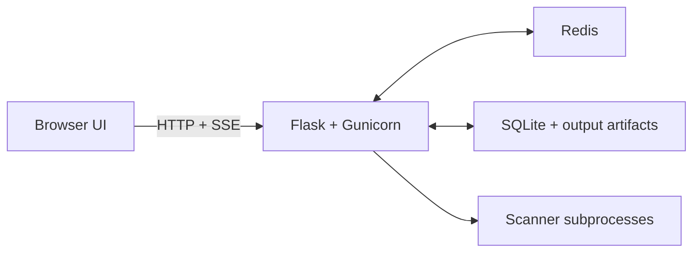

# darklab_shell

darklab_shell is a self-hosted web terminal for network diagnostics and security recon. It gives you a polished browser shell for tools like nmap, nuclei, httpx, katana, and amass without handing users a raw shell.

The backend runs on Flask/Gunicorn, Redis, and SQLite. Commands go through allow and deny rules, loopback checks, path checks, and shell-metacharacter blocking before anything starts. Scanner commands run as an unprivileged `scanner` user and can only write to the app-managed places you allow.

The app ships with 30+ security tools, SecLists, live multi-tab output, a mobile shell, session Files, project workspaces, sharing/redaction, themes, and coverage across pytest, Vitest, Playwright, and container smoke tests. A live instance is available at [shell.darklab.sh](https://shell.darklab.sh/).

<div align="center">
<b>Desktop Demo</b><br>

<br>
<b>Mobile Demo</b><br>
 {width=360px}
</div>

---

## Table of Contents
- [Features](#features)
- [Quick Start](#quick-start)
- [Architecture At A Glance](#architecture-at-a-glance)
- [Configuration](#configuration)
- [Installed Tools](#installed-tools)
- [Production Deployment](#production-deployment)
- [Security & Process Isolation](#security--process-isolation)
- [Documentation Map](#documentation-map)
- [Project Structure](#project-structure)

---

## Features

- **Terminal workflow** — live output streaming, killable long-running commands, optional line numbers and timestamps, output search, findings/warnings/errors review, `Ctrl+R` history search, bash-like `Tab` completion, built-in pipe helpers such as `grep` and `tail`, keyboard shortcuts, quiet-stream warnings, and automatic recovery when a stalled stream starts moving again
- **Status Monitor** — a desktop modal and mobile sheet for DB/Redis health, workspace quota, session stats, CPU-driven heartbeat visuals, activity heatmaps, command mix, recent-run constellation popovers, active-run CPU/RSS meters, Attach/Kill actions, and safe close-tab prompts that can leave a backend run running in the background
- **Mobile shell** — dedicated mobile composer, keyboard helper row, character and word-level cursor movement, stable Firefox-friendly layout, shared desktop/mobile Run-button state, output-follow behavior when the keyboard opens, and a mobile History panel with collapsible search, filter, and bulk-action tools
- **Tabs and output handling** — multiple tabs, drag reordering, rename, overflow controls, copy, `save ▾` exports (txt / html / pdf), jump-to-live / jump-to-bottom controls, and exports that keep permalink pages, saved HTML, and PDF output visually aligned where the PDF renderer allows
- **History and sharing** — recent command chips, desktop/mobile history with full-text search across command text and stored output, filters, stars, visible-page bulk actions, active-run reconnect after reload, idle-tab restore, run permalinks, snapshot rows, native mobile sharing, and full-output files for longer runs
- **Run comparison** — compare any two saved runs from History, Run Details, or Projects with responsive side-by-side/unified transcript views, folded unchanged context with lazy expansion, Prev/Next change navigation, copyable summaries, restore actions, and order-insensitive finding/artifact diffs
- **Session command variables** — `var set HOST ip.darklab.sh`, `var list`, and `var unset HOST` define per-session values you can reuse as `$HOST` or `${HOST}`. Expansion happens before command validation, typed history stays readable, and the transcript shows the expanded command that actually ran
- **Encrypted secrets** — per-session API keys for approved tools can be added, replaced, and deleted from Options or with `secret set NAME`. Options suggests the known tool keys from `commands.yaml` first, stored values are encrypted, and saved secrets are never revealed after save, printed in transcripts, or injected outside matching command environments
- **External intel lookups** — `intel ip`, `intel domain`, `intel hash`, and `intel cve` query app-native providers such as Shodan, Censys, GreyNoise, VirusTotal, AlienVault OTX, AbuseIPDB, Team Cymru, crt.sh, HIBP Pwned Passwords, and NVD, then show normalized results in the terminal with cache-hit, quota, rate-limit, and setup status per provider
- **Session files** — optional per-session Files support for tools that need small input/output files. Users can create, view, edit, move/rename, download, delete, label, and note files; drag files into folders; preview JSON, JSONL/NDJSON, CSV/TSV, XML, HTTP responses, and large text; see quota/usage; use cwd-aware `ls`, `cat`, `mv`, and confirmed `rm`; use simple `*` patterns for list/move/delete flows; and let selected command flags safely read/write session files without opening shell navigation or redirection
- **Project workspaces** — lightweight case folders group related runs, run-owned workspace artifacts, targets, findings, labels, notes, and draft evidence packages without copying the source records. Active projects can auto-link completed runs, project views expose finding/artifact review and metadata editing, and package exports preserve the selected project evidence with raw/redacted modes
- **Interactive PTY mode** — optional live terminal windows for registry-approved interactive tools such as `nc --interactive`, `telnet --interactive`, `mtr --interactive`, `ffuf --interactive`, and `masscan --interactive`, with guarded input/resize routes, bounded runtime/concurrency, Redis-backed reattach in multi-worker deployments, and completed transcripts saved back into normal history
- **Session tokens** — persistent `tok_` session tokens carry history, shell identity, command variables, workspace files, project workspace records, active-project context, user workflows, recent domain autocomplete, and saved options across browsers and devices. A phone or second browser using the same token can attach to a live command, replay earlier output, follow new output, and kill the run from the terminal or Status Monitor. `session-token generate/set/copy/clear/rotate/list/revoke` manage the token lifecycle with migration, rollback-safe rotate, confirmations, cross-tab sync, revocation, masked token history, and Options-panel shortcuts
- **Safer sharing** — a built-in basic redaction baseline can mask common secrets or infrastructure details on snapshot permalinks, with optional operator regex rules appended on top. Permalink creation can choose raw vs redacted sharing per snapshot without changing the stored run history; app-native intel response bodies are omitted from share/styled export surfaces, while local text exports remain raw
- **Run notifications** — optional browser desktop notifications fire on run completion (any exit code or kill); toggled from the Options panel on desktop and intentionally hidden from the mobile Options sheet; uses only the command root in the notification title to avoid exposing arguments or token values
- **Themes and presentation** — named theme variants, a terminal-native `theme` command, theme-aware permalink/export rendering, mobile/desktop theme parity, browser-aligned permalink/saved-HTML export styling with best-effort PDF parity, MOTD support, a customizable welcome animation (ASCII art, sampled commands, rotating hints), a guided onboarding tour in the terminal and desktop carousel, an operator-configurable FAQ modal, and user options for welcome-intro behavior plus default share-snapshot redaction that now follow the active session token instead of staying browser-local
- **Built-in commands** — native shell commands like `help`, `commands`, `history`, `last`, `limits`, `status`, `runs`, `stats`, `project`, `workflow`, `file`, `ls`, `cat`, `mv`, `rm`, `config`, `theme`, `which`, `type`, `faq`, `banner`, `jobs`, `ip a`, `route`, `df -h`, and `free -h`, plus real `man` support where available. `project` manages project selection, links, and targets from the terminal; `commands info <tool>` and the desktop/mobile Command Registry expose supported external-tool descriptions, examples, flags, and subcommands from `commands.yaml`; `runs` / `jobs` show active app-run metadata with CPU and RSS memory, `runs --json` prints an automation-friendly snapshot, and `stats` summarizes session activity by command root
- **Guided workflows** — built-in sequences for DNS, TLS/HTTPS, HTTP, reachability, email, passive recon, subdomain checks, directory discovery, CDN/edge checks, API recon, network paths, port/service triage, and workspace-native recon chains. Users can save session-scoped workflows with `{{variables}}`, edit/delete them above the built-ins, and run them from the terminal with `workflow list/show/run`
- **Security and operations** — registry-backed command policy with deny-prefix lists for loopback and path blocking, shell metacharacter blocking, Redis-backed rate limiting and PID tracking, structured logging with `text` and `gelf` format support, and an IP-gated `/diag` page showing app health, database and Redis status, activity stats, top commands, and per-tool availability
- **Pre-installed security tooling** — nmap, rustscan, naabu, masscan, nuclei, ffuf, gobuster, katana, amass, wafw00f, sslscan, sslyze, openssl, and more, all sandboxed under a dedicated `scanner` user with enforced allowlists and the full [SecLists](https://github.com/danielmiessler/SecLists) collection pre-installed at `/usr/share/wordlists/seclists/`; the built-in `wordlist` command and typed autocomplete catalog show high-signal SecLists entries without dumping the whole corpus into suggestions
- **Operator customization** — external-tool command metadata and runtime tweaks in `conf/commands.yaml`, custom FAQ entries in `conf/faq.yaml`, and welcome animation settings in `conf/welcome.yaml`, all reloaded without a server restart where the app supports live reload
- **Configurable deployment** — Docker-first runtime, non-Docker local mode, YAML-driven config and theme overlays, SQLite persistence for history, previews, snapshots, and artifacts, and configurable retention pruning via `permalink_retention_days`

See [FEATURES.md](FEATURES.md) for the full grouped capability reference.

---

## Quick Start

### Option 1: Run With Docker Compose

This is the recommended setup. It gives you the same major runtime pieces as production:

- the Flask app
- Redis for rate limiting and active PID tracking
- the same container filesystem restrictions and capabilities used by the shipped image

Steps:

1. Make sure Docker and Docker Compose are installed and running.
2. From the repo root, start the stack:

   ```bash
   docker compose up --build
   ```

3. Open [http://localhost:8888](http://localhost:8888).

### Option 2: Run Locally Without Docker

This is useful when you want a lighter local development loop and do not need the container runtime.

Before you begin, make sure you have:

- Python 3.14+
- pip3
- Linux host or macOS (uses `os.setsid` for process group management; `sudo kill` for cross-user process termination)
- (Optional) Redis 6.2+ (for `GETDEL` support). If not configured or available, the app falls back to in-process mode

Other dependencies (Flask ≥ 2.0, PyYAML, Flask-Limiter[redis], redis-py, psutil, gunicorn, and pyte for server-side PTY terminal capture) are installed automatically by the steps below.

The easiest path is to run:

```bash
bash examples/run_local.sh
```

That script:

1. checks for `python3`
2. checks for `pip3`
3. verifies that `app/requirements.txt` exists
4. installs the Python dependencies from that file
5. starts the app from `app/`

If you prefer to do it manually:

```bash
python3 -m pip install -r app/requirements.txt
cd app
python3 app.py
```

Then open [http://localhost:8888](http://localhost:8888).

Tradeoffs of the non-Docker path:

- no container filesystem restrictions
- no `scanner` user separation
- no Docker-provided networking/capability model
- no Redis sidecar unless you provide one yourself
- useful for quick frontend/backend iteration, but not a full production-like environment

---

## Architecture At A Glance


```mermaid
flowchart LR
  Browser["Browser UI"]
  Flask["Flask + Gunicorn"]
  Redis["Redis"]
  Storage["SQLite + output artifacts"]
  Runner["Scanner subprocesses"]

  Browser -->|HTTP + SSE| Flask
  Flask <--> Redis
  Flask <--> Storage
  Flask --> Runner
```

At a high level:

- the browser renders the shell UI and reads SSE output streams
- Flask/Gunicorn handles routes, validation, built-in commands, and run setup
- Redis coordinates shared worker state such as rate limits, run replay, and kill tracking
- SQLite plus output files store history and share data
- real commands run in subprocesses, not inside the web worker

For system design, contributor workflow, and detailed test references, use the specialized docs in the [Documentation Map](#documentation-map).

---

## Configuration

Runtime settings live in `app/conf/config.yaml`, with optional untracked overrides in `app/conf/config.local.yaml`. The other operator-owned files under `app/conf/` customize commands, FAQ entries, welcome content, app hints, onboarding tour chapters, workflows, wordlists, and themes.

Use [CONFIGURATION.md](CONFIGURATION.md) for the full operator reference, including:

- every `config.yaml` key and default value
- `*.local.*` overlay behavior
- config reload behavior
- `.env` variables such as `APP_PORT`, `WORKSPACE_ROOT`, `WEB_CONCURRENCY`, `WEB_THREADS`, and `DOCKER_GELF_ADDRESS`
- `docker-compose.yml` and `examples/docker-compose.prod.yml`
- Files/workspace storage recipes
- production host tuning notes

Theme authoring details stay in [THEME.md](THEME.md), and command registry integration details stay in [docs/external-command-integrations.md](docs/external-command-integrations.md).

---

## Installed Tools

The following tools are installed in the Docker image and available for use:

SecLists is installed at `/usr/share/wordlists/seclists/`. The app-native `wordlist` command lists curated categories, searches installed entries, and prints copy-friendly paths; autocomplete only suggests installed wordlists in command slots explicitly marked with `value_type: wordlist`.

| Tool | Purpose |
|------|---------|
| `ping` | ICMP reachability |
| `curl` / `wget` | HTTP/HTTPS requests |
| `dig` / `nslookup` / `host` | DNS lookups |
| `whois` | Domain & IP registration info |
| `traceroute` / `tcptraceroute` | Route tracing (ICMP and TCP) |
| `nc` / `telnet` | TCP connection testing, simple banner checks, and interactive socket troubleshooting |
| `mtr` | Combined ping + traceroute (auto-rewritten to report mode unless run through Interactive PTY, see Tool Notes) |
| `nmap` | Port scanning and service detection |
| `openssl` | TLS client diagnostics and cipher inspection |
| `testssl` / `testssl.sh` | TLS/SSL vulnerability scanning |
| `dnsrecon` | DNS enumeration and zone transfer testing |
| `nikto` | Web server vulnerability scanning |
| `wpscan` | WordPress vulnerability scanning |
| `nuclei` | Fast CVE/misconfiguration scanner using community templates |
| `subfinder` | Passive subdomain enumeration (ProjectDiscovery) |
| `amass` | OWASP subdomain enumeration, asset discovery, tracking, and visualization |
| `pd-httpx` | HTTP/HTTPS probing — status codes, titles, tech detection (ProjectDiscovery). Renamed from `httpx` to avoid conflict with the Python `httpx` library |
| `dnsx` | Fast DNS resolution and record querying (ProjectDiscovery) |
| `gobuster` | Directory, file, DNS, and vhost brute-forcing. Wordlists installed at `/usr/share/wordlists/seclists/` |
| `fping` | Fast parallel ICMP ping — sweep multiple hosts or a CIDR range simultaneously |
| `hping3` | TCP/IP packet assembler — TCP ping, SYN probes, traceroute-style path analysis |
| `masscan` | High-speed TCP port scanner; requires raw sockets (container has `NET_RAW`/`NET_ADMIN`) |
| `assetfinder` | Fast passive subdomain discovery using public sources |
| `fierce` | DNS reconnaissance and subdomain brute-forcing |
| `dnsenum` | DNS enumeration — zone transfers, subdomains, reverse lookups, Google scraping |
| `ffuf` | Fast web fuzzer for directory, file, and vhost discovery. Wordlists at `/usr/share/wordlists/seclists/` |
| `naabu` | Fast port scanner with service discovery (ProjectDiscovery) |
| `katana` | JavaScript-aware web crawler for attack surface mapping (ProjectDiscovery) |
| `wafw00f` | WAF detection — identifies web application firewalls from HTTP fingerprints |
| `sslscan` | TLS/SSL cipher and certificate scanner — reports supported ciphers, protocol versions, and cert details |
| `sslyze` | Fast TLS configuration analyser — Heartbleed, ROBOT, CRIME, renegotiation, and certificate chain checks |
| `rustscan` | High-speed port discovery; optionally pipes results into nmap for service detection |
| `shodan` | Shodan host, domain, query, download, scan, account, and honeyscore tools; requires `SHODAN_API_KEY` in the encrypted secrets vault |
| `vt` | VirusTotal IP, domain, URL, and file-hash reputation; accepts either `VT_API_KEY` or the native `VTCLI_APIKEY` secret name |
| `greynoise` | GreyNoise IP classification and context; requires `GREYNOISE_API_KEY` in the encrypted secrets vault |
| `ipinfo` | IP geolocation, ASN, and ownership context; uses `IPINFO_TOKEN` from the encrypted secrets vault when available |
| `urlscan` | urlscan.io URL submission, result lookup, and search; requires `URLSCAN_API_KEY` in the encrypted secrets vault |
| `chaos` | ProjectDiscovery Chaos subdomain lookups; requires `PDCP_API_KEY` in the encrypted secrets vault |

The app-native `intel` command wraps provider lookups into one normalized terminal workflow. `intel ip <ip>` checks Shodan, Censys, GreyNoise, AlienVault OTX, AbuseIPDB, and Team Cymru; `intel domain <domain>` checks VirusTotal, AlienVault OTX, and crt.sh; `intel hash <md5|sha1|sha256>` checks VirusTotal and AlienVault OTX, and safely queries HIBP Pwned Passwords for SHA1 hashes; and `intel cve <CVE-ID>` checks NVD. Shodan, Censys, GreyNoise, VirusTotal, AlienVault OTX, and AbuseIPDB use encrypted session secrets; Team Cymru, crt.sh, HIBP Pwned Passwords, and NVD work without stored keys.

### Tool Notes

The notes below cover operator-visible behavior. For the developer-facing integration contracts behind command rewrites, environment overrides, and workspace file handling, see [`docs/external-command-integrations.md`](docs/external-command-integrations.md).

#### mtr

`mtr` normally runs as a live, full-screen interactive display that continuously redraws in place. Normal shell runs are line-oriented, so the app rewrites plain `mtr` commands into report mode for readable saved output.

When Interactive PTY is enabled, use `mtr --interactive <host>` to open the live terminal view instead. Without `--interactive`, the app automatically rewrites any `mtr` command to use `--report-wide` mode when no report flag is already present:

| You type | What runs |
|----------|-----------|
| `mtr google.com` | `mtr --report-wide google.com` |
| `mtr -c 20 google.com` | `mtr --report-wide -c 20 google.com` |
| `mtr --report google.com` | unchanged — already in report mode |

#### nmap

nmap runs as the unprivileged `scanner` user, so the app standardizes on TCP connect scans for container reliability. If a user does not choose a scan mode, `-sT` is automatically injected before launch. Raw SYN scans (`-sS`) and explicit `--privileged` mode are blocked because they depend on raw socket behavior that is not reliable in the app's non-root execution path.

#### naabu

naabu defaults to raw SYN packet scanning via libpcap/gopacket, which requires privileges that are not reliably available inside the container even with file capabilities. The app automatically injects `-scan-type c` into every naabu command that doesn't already include `-scan-type` or `-st`, switching to TCP connect mode (equivalent to `nmap -sT`). Results are identical; the only difference is the scanning method. If you explicitly want raw SYN mode and have confirmed it works in your environment, pass `-scan-type s` and the rewrite will not fire.

#### masscan

masscan is a raw-packet-only scanner with no TCP connect fallback. It requires `CAP_NET_RAW`/`CAP_NET_ADMIN` and libpcap access. These are granted via `setcap` in the Dockerfile and `cap_add` in `docker-compose.yml`, but deep packet injection may still be restricted by the host kernel or container runtime. If masscan fails with an interface error, `rustscan` is a good alternative — it uses TCP connect scanning and works without raw socket access.

#### nuclei

`nuclei` stores its template library and cache in `$HOME` by default. The app runs nuclei as the `scanner` user with `HOME=/tmp` so generic scratch writes go to the tmpfs mount. The `-ud /tmp/nuclei-templates` flag is automatically injected if not already present so templates are stored and reused across runs within the same container session. Templates are lost on container restart and re-downloaded on the first nuclei run, which takes 30–60 seconds.

When Files are enabled, ProjectDiscovery tools (`nuclei`, `subfinder`, `dnsx`, `pd-httpx`, `katana`, and `naabu`) are also launched with `XDG_CONFIG_HOME` pointed at the active session workspace's `tools/` folder. Tool-owned config, resume, and generated state paths therefore appear in Files under folders such as `/tools/katana`, `/tools/subfinder`, `/tools/dnsx`, `/tools/httpx`, `/tools/naabu`, and `/tools/nuclei` instead of disappearing into `/tmp/.config`. Terminal output rewrites absolute session-workspace paths back to user-facing paths such as `/tools/katana/resume.cfg`. Selected secondary output flags are workspace-aware too, including `katana` response/field directories, `pd-httpx` response/screenshot directories, `nuclei` response stores/exports/logs, `subfinder` per-domain output directories, and `naabu` auxiliary input files.

---

## Production Deployment

The base [docker-compose.yml](docker-compose.yml) is suitable for local use and testing. For production, layer [examples/docker-compose.prod.yml](examples/docker-compose.prod.yml) on top of the base stack:

```bash
docker compose -f docker-compose.yml -f examples/docker-compose.prod.yml up --build
```

The production overlay adds reverse-proxy-aware environment values, GELF Docker log transport, an external Docker network model, persistent workspace storage at `/workspaces`, scanner-friendly `ulimits` and network sysctls, and optional Gunicorn sizing through `.env`.

Use [CONFIGURATION.md](CONFIGURATION.md) for the full production configuration reference, including `.env`, `DOCKER_GELF_ADDRESS`, workspace bind-mount permissions, Docker daemon `nofile` limits, connection-tracking tuning, and Redis memory-overcommit guidance.

---

## Security & Process Isolation

darklab_shell uses layered controls rather than trusting the browser alone:

- Gunicorn runs as unprivileged `appuser`
- user-submitted commands run as separate unprivileged `scanner` processes
- `/data` stays writable only for the app runtime
- loopback targets like `localhost`, `127.0.0.1`, `0.0.0.0`, and `[::1]` are blocked
- shell chaining operators such as `&&`, `||`, `|`, `;`, redirection, and command substitution are blocked when the allowlist is active
- container startup also adds an OS-level guard so `scanner` cannot connect back to the app port

This section is intentionally operator-focused. For the developer-facing details behind cross-user signalling, Redis-backed multi-worker kill, and the `nmap` capability model, use [ARCHITECTURE.md](ARCHITECTURE.md).

### Read-only filesystem

The container filesystem is set to read-only (`read_only: true`) and the app volume is mounted read-only (`./app:/app:ro`). There are two intentional exceptions:

- **`/data`** — a writable bind mount for the SQLite database, owned by `appuser` with `chmod 700`. Only Gunicorn can write here; the `scanner` user that runs commands has no access. If `data_dir` is unset and `/data` is not writable, the app falls back to `/tmp` for local/dev runs
- **`/tmp`** — a `tmpfs` mount (in-memory, wiped on restart) used by tools that need scratch space for templates, sessions, cache files, and optional session workspaces. Workspace session directories are app-managed, sticky, setgid, and group-scoped so `appuser` and `scanner` can share validated files without making them world-readable

### Session Files Storage

Files/workspace storage has two coordinated settings:

- `workspace_root` in `app/conf/config.yaml` or `app/conf/config.local.yaml` is the path the app uses at runtime.
- `WORKSPACE_ROOT` in Compose is the path the Docker entrypoint prepares before dropping privileges. Set it directly in `docker-compose.yml`, in a Compose override, or through `.env`; `.env` is optional and only provides variable values for Compose interpolation.

Those two values should match whenever you move storage away from the default `/tmp/darklab_shell-workspaces`.

For short-lived tmpfs storage, keep the default model:

```yaml
# app/conf/config.local.yaml
workspace_enabled: true
workspace_backend: tmpfs
workspace_root: /tmp/darklab_shell-workspaces
```

```yaml
# docker-compose.yml or an override
services:
  shell:
    environment:
      - WORKSPACE_ROOT=/tmp/darklab_shell-workspaces
```

For persistent storage with a host bind mount, the production Compose override uses `./workspaces:/workspaces` plus `WORKSPACE_ROOT=/workspaces`. Pair that with:

```yaml
# app/conf/config.local.yaml
workspace_enabled: true
workspace_backend: volume
workspace_root: /workspaces
```

Prepare the host bind-mount directory with the numeric UID/GID used by `appuser` inside the built image, not a host username. The current image creates `appuser` as `995:995` and `scanner` as `994:994`; scanner commands are launched with the shared `appuser` run group when they access validated workspace files:

```bash
mkdir -p ./workspaces
chown 995:995 ./workspaces
chmod 730 ./workspaces
```

Existing `sess_*` directories should be owned by `995:995` with mode `3730`; existing app-created files should be `0640`, while command-created output files may be `0660` so the `scanner` user can update them through the shared `appuser` run group.

For persistent storage with a Docker named volume, mount the named volume at the same path used by both settings:

```yaml
services:
  shell:
    environment:
      - WORKSPACE_ROOT=/workspaces
    volumes:
      - darklab_shell_workspaces:/workspaces

volumes:
  darklab_shell_workspaces:
```

Then use the same app config as the bind-mount example:

```yaml
workspace_enabled: true
workspace_backend: volume
workspace_root: /workspaces
```

Named volumes usually do not need host-side `chown`; the root entrypoint will attempt to normalize ownership and modes on startup. Bind mounts should still be prepared on the host because stricter host policies, rootless Docker, and NFS-like mounts may prevent container-side ownership repair.

To prevent commands from writing to either path directly, the app blocks any command that references `/data` or `/tmp` as a filesystem argument (using a negative lookbehind so URLs containing `/data` or `/tmp` as path segments are still permitted).

---

## Documentation Map

- [Default.md](.gitlab/merge_request_templates/Default.md) - Default GitLab merge request template used by contributors
- [ARCHITECTURE.md](ARCHITECTURE.md) - Runtime layers, request flow, persistence, security mechanics, and application internals
- [CHANGELOG.md](CHANGELOG.md) - Release-by-release change log organised by version
- [CONFIGURATION.md](CONFIGURATION.md) - Operator configuration reference for `app/conf/`, `.env`, Compose overlays, workspace storage, and production tuning
- [CONTRIBUTING.md](CONTRIBUTING.md) - Local setup, test workflow, linting, branch workflow, and merge request guidance
- [CONTRIBUTORS.md](CONTRIBUTORS.md) - Contributor and acknowledgement notes
- [DECISIONS.md](DECISIONS.md) - Architectural rationale, tradeoffs, and implementation-history notes
- [DOCS_STANDARDS.md](DOCS_STANDARDS.md) - Documentation structure, preferred templates, and review rules for ongoing doc updates
- [FEATURES.md](FEATURES.md) - Full per-feature reference: autocomplete, pipe support, keyboard shortcuts, allowlist, welcome animation, history, permalinks, themes, and more
- [THEME.md](THEME.md) - Theme registry, selector metadata, and override behavior
- [TODO.md](TODO.md) - Open follow-ups, research notes, known issues, and future ideas
- [docs/external-command-integrations.md](docs/external-command-integrations.md) - External command registry, rewrite, environment, Files, and smoke-test contracts
- [tests/README.md](tests/README.md) - Detailed suite appendix, smoke-test coverage, and focused test commands
- [tests/ui-capture-scenes.md](tests/ui-capture-scenes.md) - UI screenshot capture scene inventory

---

## Project Structure

Use this as a navigation map, not a replacement for [ARCHITECTURE.md](ARCHITECTURE.md). The architecture and testing docs carry the deeper explanations.

```text
.
├── .dockerignore               # Docker build-context exclusion list — keeps node_modules, tests, .git out of the image
├── .env.example                # Environment variable template (copy to .env and edit locally)
├── .flake8                     # flake8 config — line length and per-file ignore rules for CI linting
├── .gitignore                  # Git ignore patterns
├── .gitlab-ci.yml              # GitLab CI pipeline — pytest, Vitest, Playwright, lint, audit, and Docker build
├── .gitlab/
│   └── merge_request_templates/
│       └── Default.md          # Default GitLab merge request template used by contributors
├── .markdownlint-cli2.jsonc    # markdownlint-cli2 config — Markdown lint rules used by npm run lint:md
├── .shellcheckrc               # shellcheck config — suppresses false positives (e.g. CDPATH= idiom)
├── .tooling/                   # Developer/test/lint tool configuration; app runtime config lives under app/conf/
│   ├── eslint.config.js        # ESLint config — indentation, quotes, and semicolon rules for JS tooling/test files
│   ├── hadolint.yaml           # hadolint config — ignores intentional Dockerfile patterns
│   ├── playwright.capture.desktop.config.js # Playwright config for the desktop UI screenshot capture pipeline
│   ├── playwright.capture.mobile.config.js  # Playwright config for the mobile UI screenshot capture pipeline
│   ├── playwright.config.js    # Playwright single-project config for VS Code and focused local debugging
│   ├── playwright.demo.config.js     # Playwright config for recording the desktop demo video
│   ├── playwright.demo.mobile.config.js # Playwright config for recording the mobile demo video
│   ├── playwright.parallel.config.js # Playwright parallel CLI config with isolated per-project Flask/state environments
│   ├── playwright.shared.js    # Shared Playwright server-builder helpers used by both configs
│   ├── playwright.visual.contracts.js # Shared desktop/mobile visual contract values for demo and capture Playwright flows
│   ├── pytest.ini              # pytest config — keeps collection scoped away from bind-mounted data and dependency directories
│   ├── stylelint.config.mjs    # stylelint config — CSS syntax and safety lint rules
│   ├── vitest.config.js        # Vitest unit test config (jsdom environment)
│   └── yamllint.yml            # yamllint config — relaxed line length, no document-start requirement
├── ARCHITECTURE.md            # Current system structure, diagrams, runtime layers, persistence, and app internals
├── CHANGELOG.md               # Release-by-release change log organised by version (Added / Changed / Fixed / Removed)
├── CONFIGURATION.md           # Operator config reference for app/conf, .env, Compose overlays, storage, and production tuning
├── CONTRIBUTING.md            # Contributor setup, local workflow, and merge request guidance
├── CONTRIBUTORS.md            # Project contributors
├── DECISIONS.md               # Architectural rationale, tradeoffs, and implementation-history notes
├── DOCS_STANDARDS.md          # Documentation structure, preferred templates, and review rules for ongoing doc updates
├── Dockerfile
├── FEATURES.md                # User-facing feature catalog with screenshots and highlights
├── README.md                  # This file — top-level overview and project structure map
├── THEME.md                   # Theme authoring/reference guide and runtime token behavior
├── TODO.md                    # Internal task list, known issues, and product ideas
├── app/
│   ├── app.py                  # Flask factory — logging setup, blueprint registration, before/after-request hooks
│   ├── blueprints/
│   │   ├── assets.py           # /vendor/*, /favicon.ico, /health, /diag (IP-gated operator diagnostics)
│   │   ├── content.py          # /, /config, /themes, /faq, /autocomplete, /welcome*
│   │   ├── history.py          # /history*, /share*; preview/full-output shaping helpers
│   │   ├── projects.py         # /projects* project workspace CRUD and relationship routes
│   │   ├── run.py              # /runs broker starts/streams, /run/client history persistence, /kill, and run orchestration
│   │   ├── secrets.py          # /session/secrets* encrypted per-session secret metadata and write routes
│   │   ├── session.py          # /session/token/*, /session/preferences, /session/variables, /session/workflows*, /session/recent-domains, /session/migrate, /session/starred*
│   │   └── workspace.py        # /workspace/files* app-managed session file routes
│   ├── conf/                   # Operator-configurable files — edit these to customize the deployment
│   │   ├── app_hints.txt           # Rotating footer hints for the welcome animation (optional)
│   │   ├── app_hints_mobile.txt    # Mobile rotating footer hints for the welcome animation (optional)
│   │   ├── ascii.txt               # Decorative ASCII banner shown during the welcome animation (optional)
│   │   ├── ascii_mobile.txt        # Mobile ASCII banner shown during the mobile welcome animation (optional)
│   │   ├── commands.yaml           # Structured command registry for catalog grouping, autocomplete hints, runtime adaptations, and smoke-test examples
│   │   ├── config.yaml             # Application configuration (see CONFIGURATION.md)
│   │   ├── faq.yaml                # Custom FAQ entries appended to the built-in FAQ (optional)
│   │   ├── theme_dark.yaml.example # Generated dark-theme reference template — regenerate with scripts/generate_theme_examples.py
│   │   ├── theme_light.yaml.example # Generated light-theme reference template — regenerate with scripts/generate_theme_examples.py
│   │   ├── themes/                 # Built-in theme definitions (one YAML per theme — apricot_sand, charcoal_amber, darklab_obsidian, etc.)
│   │   ├── tour.yaml               # Versioned onboarding tour chapters shared by the tour command and visual tour
│   │   ├── welcome.yaml            # Welcome command samples with optional group/featured metadata (optional)
│   │   ├── wordlists.yaml          # Curated SecLists catalog categories used by the wordlist command and autocomplete
│   │   └── workflows.yaml          # Guided workflows panel definitions (multi-step diagnostic command sequences)
│   ├── config.py               # load_config(), CFG defaults, SCANNER_PREFIX detection, theme registry
│   ├── core/
│   │   ├── __init__.py         # Core helper package marker
│   │   ├── database.py         # SQLite connection, schema init, retention pruning
│   │   ├── helpers.py          # Trusted-proxy IP resolver, session-ID extraction, and shared request helpers
│   │   ├── logging_setup.py    # Structured logging formatters and logger configuration
│   │   ├── output_signals.py   # Server-side output signal and entity classifier
│   │   ├── process.py          # Redis setup, pid_register/pid_pop, active-run state, and in-process fallback
│   │   └── redaction.py        # Snapshot-share redaction helpers and built-in rule application
│   ├── extensions.py           # Flask-Limiter singleton (init_app deferred to app.py)
│   ├── requirements.txt        # Python runtime dependencies
│   ├── services/
│   │   ├── __init__.py         # Service package marker
│   │   ├── commands/
│   │   │   ├── __init__.py     # Command service package marker
│   │   │   ├── builtin_autocomplete.yaml # App-owned built-in command autocomplete grammar
│   │   │   ├── builtins.py     # App-owned built-in shell helpers handled before external process spawn
│   │   │   ├── builtins_catalog.py # Static built-in command help, shortcut, and special-command data
│   │   │   ├── builtins_discovery.py # Help, FAQ, command catalog, man, type, and which built-in handlers
│   │   │   ├── builtins_format.py # Shared formatting, ANSI styling, and output-line helpers for built-ins
│   │   │   ├── builtins_intel.py # External intel lookup built-in command handler
│   │   │   ├── builtins_misc.py # Miscellaneous and guardrail-flavored built-in command handlers
│   │   │   ├── builtins_project.py # Project workspace built-in command family and project target helpers
│   │   │   ├── builtins_runtime.py # Runtime/history/status built-in command handlers
│   │   │   ├── builtins_secrets.py # Encrypted session secret built-in command handlers
│   │   │   ├── builtins_session.py # Session token status and session variable built-in command handlers
│   │   │   ├── builtins_shortcuts.py # Keyboard shortcut reference and shortcuts built-in command handler
│   │   │   ├── builtins_system.py # Small system-style built-in command handlers
│   │   │   ├── builtins_wordlist.py # Wordlist built-in command handler backed by the SecLists catalog service
│   │   │   ├── builtins_workspace.py # Session file built-in command family and workspace aliases
│   │   │   ├── postfilters.py  # Synthetic pipe-helper post-filter parser for app-native pipelines
│   │   │   ├── registry.py     # Command loading, validation, autocomplete derivation, and registry-driven rewrites
│   │   │   ├── registry_content.py # Welcome, tour, ASCII art, and hint content loaders
│   │   │   ├── registry_loader.py # Command registry YAML loading, normalization, and overlay merging
│   │   │   ├── registry_validation.py # Command tokenization, policy matching, deny checks, and runtime-command detection
│   │   │   └── wordlists.py    # SecLists catalog loader and filtering helpers for wordlist command/autocomplete
│   │   ├── history/
│   │   │   ├── __init__.py     # History service package marker
│   │   │   └── permalinks.py   # Flask context/render helpers for /history/<id> and /share/<id>
│   │   ├── intel/
│   │   │   ├── __init__.py     # External intel service package marker
│   │   │   ├── abuseipdb.py    # AbuseIPDB provider normalization
│   │   │   ├── audit.py        # Structured audit events for external intel provider lookups
│   │   │   ├── base.py         # Provider base classes, result objects, and provider exceptions
│   │   │   ├── cache.py        # Redis-backed normalized intel response and quota backoff cache helpers
│   │   │   ├── canonical.py    # Canonical IP, domain, URL, hash, and CVE key helpers
│   │   │   ├── censys.py       # Censys Platform host provider normalization
│   │   │   ├── clients.py      # HTTP/DNS clients for app-native intel providers
│   │   │   ├── crtsh.py        # crt.sh certificate-transparency provider normalization
│   │   │   ├── greynoise.py    # GreyNoise provider normalization
│   │   │   ├── hibp.py         # HIBP Pwned Passwords provider normalization
│   │   │   ├── lookup.py       # Provider fan-out, cache, rate-limit, and lookup orchestration
│   │   │   ├── nvd.py          # NVD CVE provider normalization
│   │   │   ├── otx.py          # AlienVault OTX provider normalization
│   │   │   ├── rate_limiter.py # Per-session provider token-bucket helpers
│   │   │   ├── registry.py     # App-native intel provider metadata and secret-consumer registry
│   │   │   ├── schema.py       # Normalized provider response shapes
│   │   │   ├── shodan.py       # Shodan provider normalization
│   │   │   ├── teamcymru.py    # Team Cymru IP-to-ASN provider normalization
│   │   │   └── virustotal.py   # VirusTotal provider normalization
│   │   ├── projects/
│   │   │   ├── __init__.py     # Project service package marker
│   │   │   ├── contracts.py    # Shared project workspace limits, allowed values, and exception classes
│   │   │   ├── metadata.py     # Entity label/note helpers and project metadata attachment helpers
│   │   │   ├── preferences.py  # Project-related session preference helpers
│   │   │   └── workspace.py    # Session-scoped project helpers, targets, findings, artifacts, packages, and links
│   │   ├── pty/
│   │   │   ├── __init__.py     # PTY service package marker
│   │   │   ├── capture.py      # Interactive PTY terminal capture and ANSI snapshot helpers
│   │   │   ├── service.py      # Interactive PTY process/service helpers for allowlisted screen tools
│   │   │   └── transcript.py   # Completed PTY transcript shaping and transient redraw filtering
│   │   ├── runs/
│   │   │   ├── __init__.py     # Run service package marker
│   │   │   ├── broker.py       # Brokered run event storage, replay, and SSE stream helpers
│   │   │   ├── comparison.py   # Shared run comparison helpers for history and project compare APIs
│   │   │   ├── kinds.py        # Saved-run kind helpers for built-in vs external command behavior
│   │   │   ├── output_store.py # Preview/full-output capture and artifact persistence helpers
│   │   │   ├── streaming.py    # Low-level subprocess stdout readiness, nonblocking read, and cleanup helpers
│   │   │   └── workspace_artifacts.py # Run-scoped workspace artifact detection and size helpers
│   │   ├── secrets/
│   │   │   ├── __init__.py     # Secrets service package marker
│   │   │   ├── audit.py        # Structured audit events for secret metadata operations
│   │   │   ├── storage.py      # SQLite metadata and ciphertext row helpers for encrypted session secrets
│   │   │   └── vault.py        # Master-key loading, HKDF derivation, and AES-GCM wrap/unwrap helpers
│   │   ├── session/
│   │   │   ├── __init__.py     # Session service package marker
│   │   │   └── variables.py    # Per-session command-variable storage and expansion helpers
│   │   ├── workflows/
│   │   │   ├── __init__.py     # Workflow service package marker
│   │   │   ├── catalog.py      # Built-in/configured workflow catalog loading and normalization helpers
│   │   │   └── user_workflows.py # Per-session user workflow storage, validation, and serialization helpers
│   │   └── workspace/
│   │       ├── __init__.py     # Workspace service package marker
│   │       └── files.py        # App-mediated per-session workspace path, quota, and cleanup helpers
│   ├── static/
│   │   ├── css/
│   │   │   ├── core/
│   │   │   │   ├── base.css    # Theme tokens, reset, base layout, header, input, and dropdown foundations
│   │   │   │   └── fonts.css   # @font-face declarations for vendored local fonts
│   │   │   ├── diag.css        # Diagnostics-page-specific layout and responsive chrome
│   │   │   ├── features/       # Feature-owned styles split out of shared shell/component stylesheets
│   │   │   │   ├── command-registry.css # Command Registry modal and command catalog detail modal
│   │   │   │   ├── faq-shortcuts.css # FAQ content, command chips, visual-tour entry, and shortcuts overlay
│   │   │   │   ├── history.css # History drawer, history rows, Run Details modal, and history actions
│   │   │   │   ├── projects.css # Projects modal, mobile project workspace, entity editors, compare picker, and package wizard
│   │   │   │   ├── run-comparison.css # Run Comparison modal, split-view, controls, transcript diff, and mobile compare layout
│   │   │   │   ├── status-monitor.css # Status Monitor modal, visual cards, active-run rows, and mobile sheet layout
│   │   │   │   ├── workflows.css # Workflows modal, workflow cards, editor, and rendered step controls
│   │   │   │   └── workspace.css # Files modal, file viewer/editor, workspace rows, and workspace metadata chips
│   │   │   ├── mobile-chrome.css # Mobile sheet handles, drag affordances, and pull-to-refresh suppression hooks
│   │   │   ├── mobile.css      # Mobile composer, mobile shell layout, sheets, and viewport overrides
│   │   │   ├── primitives/
│   │   │   │   └── components.css # Tabs, search UI, permalink surfaces, toast, and shared menu components
│   │   │   ├── shell-chrome.css # Desktop shell: left rail, tabbar row, and bottom HUD bar
│   │   │   ├── shell.css       # Terminal shell frame, panels, generic modal foundations, and utility buttons
│   │   │   ├── styles.css      # Compatibility entrypoint that imports the modular CSS files in order
│   │   │   ├── terminal_export.css # Shared export/permalink/diag header chrome
│   │   │   └── welcome.css     # Welcome animation, operator notice, and onboarding-specific UI
│   │   ├── favicon.ico         # Site favicon
│   │   ├── fonts/              # Vendored local font files used by the app's vendor routes and permalink/export fallbacks
│   │   └── js/
│   │       ├── app.js          # Shared UI helpers, preferences, keyboard shortcuts, tab-session state, and mobile-layout glue
│   │       ├── autocomplete.js # Command autocomplete dropdown
│   │       ├── controller.js   # Initialization and event wiring (loads after app.js)
│   │       ├── core/
│   │       │   ├── app_preferences_core.js # Pure app preference coercion/snapshot helpers shared by app.js and unit harnesses
│   │       │   ├── autocomplete_core.js # Pure autocomplete matching/ranking helpers shared by autocomplete.js and unit harnesses
│   │       │   ├── config.js   # APP_CONFIG bootstrap reader
│   │       │   ├── dom.js      # Shared DOM element references
│   │       │   ├── history_core.js # Pure history filter/label/format helpers shared by history.js and unit harnesses
│   │       │   ├── output_core.js # Pure output prompt/signal helpers shared by output.js and unit harnesses
│   │       │   ├── runner_core.js # Pure runner duration and synthetic pipe helpers shared by runner.js and unit harnesses
│   │       │   ├── search_core.js # Pure search labels/counts/summary helpers shared by search.js and unit harnesses
│   │       │   ├── session_core.js # Pure session identity helpers shared by session.js and unit harnesses
│   │       │   ├── state.js    # Shared app-state store/accessors
│   │       │   ├── utils.js    # escapeHtml, escapeRegex, renderMotd, showToast
│   │       │   └── workspace_core.js # Pure workspace path/format helpers shared by workspace.js and unit harnesses
│   │       ├── export_html.js  # Shared export HTML builder / embedded-font helper
│   │       ├── export_pdf.js   # Shared PDF export module — used by the desktop tab bar and permalink page
│   │       ├── features/
│   │       │   ├── autocomplete/
│   │       │   │   ├── runtime_context.js # Runtime autocomplete contexts for built-ins, workspace paths, variables, and command lookup
│   │       │   │   └── suggestions.js # Command autocomplete suggestion resolution, recent values, and value-slot application
│   │       │   ├── command-registry/
│   │       │   │   └── command_registry.js # FAQ command helpers plus Command Registry and Command Catalog modal logic
│   │       │   ├── history/
│   │       │   │   ├── history_actions.js # History star cache plus drawer/run action menu positioning helpers
│   │       │   │   ├── history_links.js # History run permalink and snapshot link helpers
│   │       │   │   ├── history_mutations.js # History delete/clear confirmations and loading overlay helpers
│   │       │   │   ├── history_project_actions.js # History project filter options and add-run-to-project flows
│   │       │   │   ├── history_recall.js # Command recall history and prompt navigation helpers
│   │       │   │   ├── history_restore.js # Restoring saved runs into terminal tabs and source-line highlighting
│   │       │   │   ├── history_rows.js # History drawer run/snapshot rows, metadata badges, and row action menus
│   │       │   │   ├── history_run_details.js # Run Details modal rendering, tabs, loading, and actions
│   │       │   │   └── history_search.js # Ctrl+R reverse-history search dropdown and keyboard handling
│   │       │   ├── mobile/
│   │       │   │   ├── mobile_menu_actions.js # Mobile hamburger menu action dispatch
│   │       │   │   ├── mobile_running_indicator.js # Mobile background-running tab chip and tab-edge glow behavior
│   │       │   │   └── mobile_shell_layout.js # Mobile shell DOM reparenting, viewport mode, and keyboard state
│   │       │   ├── preferences/
│   │       │   │   ├── preferences.js # Session preference loading, persistence, and Options modal control syncing
│   │       │   │   ├── secrets_panel.js # Options modal encrypted secret list, replace, delete, and terminal value prompt helpers
│   │       │   │   └── session_token_controls.js # Options modal session token generation, migration, and clearing controls
│   │       │   ├── projects/
│   │       │   │   └── project_target_validation.js # Project target editor copy and value validation helpers
│   │       │   ├── run-comparison/
│   │       │   │   ├── history_compare_controls.js # Run Comparison view/context controls and actions menu
│   │       │   │   ├── history_compare_core.js # Pure Run Comparison formatting, preference, and anchor-map helpers
│   │       │   │   ├── history_compare_launcher.js # Run Comparison candidate picker and manual run-search flow
│   │       │   │   ├── history_compare_navigation.js # Run Comparison row targeting, minimap, and previous/next-change controls
│   │       │   │   ├── history_compare_overlay.js # Run Comparison modal shell, close handling, and initial focus lifecycle
│   │       │   │   └── history_compare_renderer.js # Run Comparison transcript hunk renderer, object diff sections, restore actions, and compare fetch flow
│   │       │   ├── runner/
│   │       │   │   ├── runner_active_restore.js # Detached active-run restore markers shared by tabs, PTY, and runner reload recovery
│   │       │   │   ├── runner_persistence.js # Client-side saved-run persistence for local runner commands
│   │       │   │   └── runner_workspace.js # Workspace-terminal command parsing and path helpers
│   │       │   ├── shortcuts/
│   │       │   │   ├── global_shortcuts.js # Global tab/action/chrome shortcut matching and dispatch
│   │       │   │   └── shortcuts_key_handler.js # Global ? keyboard shortcut for the shortcuts overlay
│   │       │   ├── status-monitor/
│   │       │   │   ├── status_monitor_core.js # Pure Status Monitor formatting, date, hashing, and telemetry helpers
│   │       │   │   ├── status_monitor_data.js # Status Monitor endpoint loading and dashboard data aggregation
│   │       │   │   └── status_monitor_resources.js # Status Monitor CPU/memory resource sampling and sparkline helpers
│   │       │   ├── tabs/
│   │       │   │   ├── tab_close_lifecycle.js # Tab close, detach, kill-confirmation, and deferred-removal helpers
│   │       │   │   ├── tab_drag_reorder.js # Tab pointer/touch drag reordering behavior
│   │       │   │   ├── tab_exports.js # Tab transcript copy, export, and permalink actions
│   │       │   │   └── tab_session_state.js # Tab session persistence and restore after reload
│   │       │   ├── terminal/
│   │       │   │   ├── composer_controller.js # Terminal composer paste, focus, autocomplete input, and keyboard handling
│   │       │   │   ├── composer_editing.js # Terminal composer caret, selection, and word-boundary helpers
│   │       │   │   ├── local_commands.js # Terminal-native theme/config command handlers and shared local-command helpers
│   │       │   │   └── mobile_composer_keyboard.js # Mobile composer keyboard, viewport-height, and submit listeners
│   │       │   ├── theme/
│   │       │   │   └── theme.js # Theme registry lookup, preview card rendering, and theme selection lifecycle
│   │       │   ├── tour/
│   │       │   │   └── tour_cli.js # Terminal-guided onboarding tour command
│   │       │   ├── workflows/
│   │       │   │   └── workflows.js # Workflows modal, editor, terminal command, and runtime autocomplete support
│   │       │   └── workspace/
│   │       │       ├── workspace_autocomplete_cache.js # Files autocomplete cache refresh and path hint helpers
│   │       │       ├── workspace_drag_drop.js # Files browser drag/drop move behavior
│   │       │       └── workspace_viewer_formats.js # Files viewer format detection and preview payload shaping
│   │       ├── history.js      # Command history chips, drawer rows, filters, and compare entry points
│   │       ├── mobile_chrome.js # Mobile shell chrome — peek/menu routing, viewport mode, pull-to-refresh suppression
│   │       ├── output.js       # ANSI rendering and line management
│   │       ├── permalink.js    # Permalink page controller — loaded only on /history/<id> and /share/<id>
│   │       ├── pty.js          # Browser-side interactive PTY controller backed by xterm.js
│   │       ├── runner.js       # Command execution, SSE stream, kill, stall detection
│   │       ├── search.js       # In-output search (with case-sensitive and regex modes)
│   │       ├── session.js      # Session UUID + apiFetch wrapper (loads after session_core.js)
│   │       ├── shell_chrome.js # Desktop rail (Recent, Workflows, nav) and bottom HUD controller (loads last)
│   │       ├── status_monitor.js  # Status Monitor modal/sheet controller
│   │       ├── tabs.js         # Tab lifecycle management
│   │       ├── tour_modal.js   # Desktop visual onboarding tour carousel
│   │       ├── ui/
│   │       │   ├── mobile_sheet.js # Shared bottom-sheet helper — drag/tap/keyboard close for every mobile sheet
│   │       │   ├── ui_confirm.js # showConfirm primitive — shared confirmation-dialog surface
│   │       │   ├── ui_disclosure.js # bindDisclosure helper — aria-expanded + panel lifecycle
│   │       │   ├── ui_dismissible.js # bindDismissible helper — modal/sheet/panel dismissal contract
│   │       │   ├── ui_entity_metadata.js # Shared labels/notes client helpers for history, projects, packages, and Files
│   │       │   ├── ui_focus_trap.js # bindFocusTrap helper for modal keyboard focus
│   │       │   ├── ui_helpers.js # DOM-facing helpers and visibility setters
│   │       │   ├── ui_outside_click.js # Ambient outside-click dismissal helper
│   │       │   └── ui_pressable.js # Unified pointer/click/keyboard activation contract
│   │       ├── vendor/         # Committed browser builds — generated by scripts/build_vendor.mjs
│   │       │                   #   from npm packages in package.json; regenerate with npm run vendor:sync
│   │       │   ├── ansi_up.js          # ANSI-to-HTML (ansi_up v6, ESM-only — wrapped as IIFE browser global)
│   │       │   ├── jspdf.umd.min.js    # PDF generation (jsPDF UMD build, copied as-is from npm)
│   │       │   ├── xterm-addon-fit.js  # xterm fit addon for interactive PTY sizing
│   │       │   ├── xterm.css           # xterm stylesheet for interactive PTY tabs
│   │       │   └── xterm.js            # xterm browser terminal for interactive PTY tabs
│   │       ├── welcome.js      # Welcome startup animation (ASCII, status lines, samples, hints)
│   │       └── workspace.js    # Session Files panel — list/create/edit/delete/download helpers
│   └── templates/
│       ├── diag.html           # Operator diagnostics page (IP-gated, uses active theme)
│       ├── index.html          # Frontend HTML shell rendered by Flask
│       ├── permalink.html      # Live permalink page template
│       ├── permalink_base.html # Shared shell for permalink pages
│       ├── permalink_error.html # Missing/expired permalink template
│       ├── theme_vars_script.html # Injected JS theme metadata/bootstrap block
│       └── theme_vars_style.html # Injected CSS variable block for the active theme
├── assets/                     # README media assets (demo videos)
├── data/                       # Writable volume — SQLite database (auto-created)
│   └── history.db              #   stores run history and tab snapshots
├── docker-compose.yml
├── docs/
│   ├── external-command-integrations.md # External-tool rewrite, environment, Files, and smoke-test contracts
│   └── release-drafts/
│       ├── v2.0-merge-request.md # Draft merge-request notes for the next major release
│       └── v2.0-release-notes.md # Draft user-facing release notes for the next major release
├── entrypoint.sh               # Container startup script — fixes /data ownership, drops to appuser
├── examples/
│   ├── docker-compose.prod.yml  # Optional production Docker Compose override (GELF, proxy env, external network)
│   └── run_local.sh             # Script to run without Docker using Python directly
├── package-lock.json           # npm dependency lockfile (auto-generated by npm install)
├── package.json                # JS dev dependencies and test scripts
├── pyrightconfig.json          # Pyright/Pylance config — adds app/ to the module search path so
│                               #   tests that import app.py get correct static analysis in VS Code
├── requirements-dev.txt        # Dev-only dependencies (pytest, flake8, bandit, pip-audit, yamllint)
├── scripts/
│   ├── benchmark_output_signals.py # Manual synthetic-output benchmark for backend signal classification performance
│   ├── build_vendor.mjs        # Generates the committed browser builds in app/static/js/vendor/ from npm packages (run via npm run vendor:sync)
│   ├── capture_container_smoke_test_outputs.sh # Runs the same commands in a browser and writes raw output to /tmp as a manual update reference; does not update the expectations file
│   ├── capture_output_for_smoke_test.mjs # Browser-driven smoke-test corpus capture helper
│   ├── capture_ui_screenshots.sh # Drives the UI screenshot capture pipeline (desktop + mobile, all themes or one) — emits PNGs, manifests, and a review index to /tmp/darklab_shell-ui-capture/
│   ├── check_versions.sh       # Local dependency/version drift helper used by the manual CI job; reports production Docker base image plus CI runner images
│   ├── container_smoke_test.sh # Reuses or force-builds the smoke cache image, runs the shared smoke corpus through /runs, and checks output against tests/py/fixtures/container_smoke_test-expectations.json
│   ├── generate_theme_examples.py # Regenerates the checked-in dark/light theme example files from app/config.py defaults
│   ├── hooks/
│   │   └── pre-commit          # Git pre-commit hook — runs all lint, security, and unit checks (activate with: git config core.hooksPath scripts/hooks)
│   ├── lint_json.mjs           # Validates that all tracked JSON files parse cleanly — used by the lint pipeline
│   ├── obs_recording.mjs       # Minimal OBS WebSocket helper used by the demo recording wrappers
│   ├── playwright/
│   │   ├── run_e2e_server.sh   # Starts one isolated Flask e2e server with per-worker APP_DATA_DIR state
│   │   └── stop_e2e_servers.sh # Clears the configured Playwright test ports before local runs
│   ├── record_demo.sh          # Records the desktop demo through OBS while Playwright drives the browser
│   ├── record_demo_mobile.sh   # Records the mobile demo through OBS with the in-page keyboard overlay
│   ├── run_playwright.sh       # Local Playwright wrapper — quiet by default, clears ports, and passes through specs/grep/config
│   ├── run_pytest.sh           # Local pytest wrapper — pins repo config/rootdir and keeps collection scoped
│   └── seed_history.py         # Populates history.db with registry-backed example runs under a UUID or tok_ session; includes the named visual-flows preset used by capture/demo work
└── tests/
    ├── README.md               # Test suite overview, how-to-run, and per-file appendix tables (kept in sync by tests/py/test_docs.py)
    ├── js/
    │   ├── e2e/                # Playwright end-to-end tests (require running Flask server)
    │   │   ├── autocomplete.spec.js # autocomplete dropdown coverage — context-aware suggestions, pipe-stage hints, accept paths
    │   │   ├── boot-resilience.spec.js # startup fetch fallbacks and core UI smoke checks
    │   │   ├── commands.spec.js # command execution, denial, and status rendering
    │   │   ├── demo.mobile.spec.js # Mobile demo recording with command, history, workflow, and theme scenes (RUN_DEMO=1 only)
    │   │   ├── demo.spec.js    # Desktop demo recording with command, history, workflow, and theme scenes (RUN_DEMO=1 only)
    │   │   ├── failure-paths.spec.js  # /runs denial/rate limit, share/history failure toasts
    │   │   ├── fixtures/       # Binary test assets (e.g. ios-keyboard-dark.png used by mobile.spec.js)
    │   │   ├── helpers.js      # runCommand/openHistory helpers
    │   │   ├── history.spec.js # history drawer flows, restore, starring, and chip cleanup
    │   │   ├── interaction-contract.spec.js # end-to-end verification of the UI Interaction Helper contract against real chrome surfaces
    │   │   ├── kill.spec.js    # kill confirmation and running-tab stop behavior
    │   │   ├── mobile.spec.js  # mobile composer/menu/layout regressions and touch flows
    │   │   ├── output.spec.js  # copy/clear/save/export behavior
    │   │   ├── rate-limit.spec.js # per-session /runs rate limiting
    │   │   ├── runner-stall.spec.js   # SSE stall recovery
    │   │   ├── search.spec.js  # search/highlight/navigation behavior
    │   │   ├── session-token.spec.js # session-token lifecycle, migration, and cross-session persistence
    │   │   ├── share.spec.js   # snapshot permalinks and clipboard behavior
    │   │   ├── shortcuts.spec.js # keyboard shortcuts including Ctrl+R history-search flow
    │   │   ├── tabs.spec.js    # tab lifecycle, rename, reorder, and new-tab behavior
    │   │   ├── theme-audit.spec.js # walks all built-in themes to catch colour leaks and unstyled surfaces
    │   │   ├── timestamps.spec.js # timestamp and line-number toggle behavior
    │   │   ├── ui-capture.desktop.capture.js # Desktop UI screenshot capture spec (RUN_CAPTURE=1 only — used by scripts/capture_ui_screenshots.sh)
    │   │   ├── ui-capture.mobile.capture.js  # Mobile UI screenshot capture spec (RUN_CAPTURE=1 only — used by scripts/capture_ui_screenshots.sh)
    │   │   ├── ui.spec.js      # theme selector, FAQ modal, and options modal behavior
    │   │   ├── ui_capture_shared.js # Shared scene registry for the UI screenshot capture pipeline (desktop + mobile)
    │   │   ├── visual_guardrails.js # Shared demo/capture startup assertions for viewport, health, token, and seeded-history parity
    │   │   ├── visual_history_fixture.js # Shared paginated /history fixture payload used by desktop and mobile demo recordings
    │   │   ├── welcome-context.spec.js # welcome persistence across tabs and mobile context coverage
    │   │   ├── welcome-interactions.spec.js # welcome command/badge interaction coverage
    │   │   ├── welcome.helpers.js # shared welcome-route fixtures and setup for split welcome specs
    │   │   └── welcome.spec.js # welcome animation and settle-path coverage
    │   ├── fixtures/           # Shared unit-test fixture data
    │   │   └── button_primitive_allowlist.json # Exception selectors for button_primitives_allowlist.test.js
    │   └── unit/               # Vitest unit tests for browser-module logic
    │       ├── app.test.js         # bootstrap wiring, session-preference hydration, mobile shell/run-button regressions, prompt/composer boundaries, and modal controls
    │       ├── autocomplete.test.js # dropdown filtering, placement, viewport clamping, active-item scroll, active-input-only accept
    │       ├── button_primitives.test.js # regression guard — scans app source and fails if any retired button class name reappears
    │       ├── button_primitives_allowlist.test.js # positive contract — scans HTML templates and fails if a button-like element uses a class outside the primitive family (with fixture-backed exceptions)
    │       ├── button_primitives_runtime.test.js # runtime contract — mounts JS-rendered history/mobile pagination controls and verifies they still use shared button primitives
    │       ├── config.test.js      # frontend APP_CONFIG bootstrap coverage
    │       ├── export_pdf.test.js  # PDF export rendering — header layout, ANSI escape handling, theme color resolution
    │       ├── helpers/
    │       │   ├── app_harness.js # Shared jsdom harness for app/controller tests, including Options/mobile shell globals
    │       │   ├── extract.js  # fromScript() helper — loads browser JS into jsdom via new Function
    │       │   ├── session_harness.js # Shared session.js localStorage/fetch harness
    │       │   └── workspace_harness.js # Shared Files/workspace modal harness and response helpers
    │       ├── history.test.js     # starring, clipboard, delete/clear failures, mobile chip behavior, draft restore
    │       ├── history_compare_split.test.js # split-pane run comparison renderer, lazy hunk expansion, and copy-summary coverage
    │       ├── mobile_running_indicator.test.js # mobile running-indicator chip + edge-glow contract — mount, ?ri=off/?ri=0 kill switch, chip count, active-tab exclusion, cycle-tap dispatch
    │       ├── output.test.js      # ANSI rendering, timestamp/line-number mode, HTML export
    │       ├── permalink.test.js   # Permalink page controller — render paths, toggles, save action delegation
    │       ├── pty.test.js         # Interactive PTY detection, xterm mount, and focus ownership
    │       ├── runner.test.js      # elapsed formatting, run/kill edge cases, stall recovery
    │       ├── search.test.js      # search helper, regex/case modes, mixed-content line regression
    │       ├── session.test.js     # session ID persistence, apiFetch() header injection, and session-switch preference reloads
    │       ├── shell_chrome.test.js  # Desktop HUD status/Redis pill behavior
    │       ├── state.test.js       # composer state store accessors and reset behavior
    │       ├── status_monitor.test.js # Status Monitor modal/sheet rendering, including active-run resource telemetry
    │       ├── tabs.test.js        # tab lifecycle, rename, overflow, export guards, permalink copy
    │       ├── tour_modal.test.js  # desktop visual onboarding tour renderer, navigation, sample-chip, and dismissal coverage
    │       ├── ui_confirm.test.js   # showConfirm primitive coverage — guards, promise resolution, body rendering, tone, button classes, default-focus (role:cancel / id / Node), stacking breakpoint, content slot rendering/cleanup, onActivate gating (sync/async truthy/falsy/throw/reject)
    │       ├── ui_disclosure.test.js # bindDisclosure helper coverage — aria-expanded sync, panel class lifecycle, onToggle emission rules, imperative handle API
    │       ├── ui_dismissible.test.js # bindDismissible helper coverage — backdrop-click semantics, close buttons, handle API, closeTopmostDismissible dispatcher priority
    │       ├── ui_focus_helpers.test.js # focusElement + blurActiveElement helper coverage — preventScroll fallback, no-op guards, activeElement blur path
    │       ├── ui_focus_trap.test.js # bindFocusTrap helper coverage — Tab/Shift+Tab boundary wrapping, middle-of-list passthrough, idempotency, disposal, hidden-focusable skip
    │       ├── ui_outside_click.test.js # bindOutsideClickClose helper coverage — guards, outside-click dismissal, trigger exemption, exempt selectors, scope override
    │       ├── ui_pressable.test.js # bindPressable helper coverage — activation paths, press-style clearing, focus-theft prevention, idempotency
    │       ├── utils.test.js       # escapeHtml, escapeRegex, MOTD rendering
    │       ├── welcome.test.js     # welcome animation, config-driven timing, featured-sample interaction
    │       └── workspace.test.js    # Files panel rendering and route-call helpers
    ├── py/                     # Python / pytest tests
    │   ├── conftest.py         # pytest configuration (sets working directory and sys.path to app/)
    │   ├── fixtures/
    │   │   ├── container_smoke_test-expectations.json # Stored expected output for the Container Smoke Test corpus
    │   │   ├── container_smoke_test-interactive-expectations.json # Interactive PTY smoke fixtures
    │   │   └── container_smoke_test-workspace-expectations.json # Workspace file-flag smoke fixtures
    │   ├── test_backend_modules.py # DB init/migration, loader/overlay helpers, config/theme/FAQ coverage
    │   ├── test_container_smoke_test.py # Opt-in Docker build/run smoke test (see scripts/container_smoke_test.sh)
    │   ├── test_docs.py        # Doc-drift meta-tests — appendix counts, documented totals, and README project-structure coverage
    │   ├── test_logging.py     # Structured logging: formatters, configure_logging, and event coverage
    │   ├── test_output_search.py # SQLite FTS history-search coverage and fallback behavior
    │   ├── test_request_kill_and_commands.py # /kill, request parsing, loader edges, and built-in command resolution
    │   ├── test_routes.py      # Flask integration tests via test client (all HTTP routes)
    │   ├── test_run_history_share.py # Higher-value /runs, history, share, built-in command, and persistence flows
    │   ├── test_session_routes.py # session-token generation/verify/migrate/revoke/starred/preferences route coverage
    │   └── test_validation.py  # Tests for command validation, rewrites, and runtime availability helpers
    └── ui-capture-scenes.md    # Reviewer hand-off manifest for the UI screenshot capture pack — per-scene "what to check" tables for design review
```
