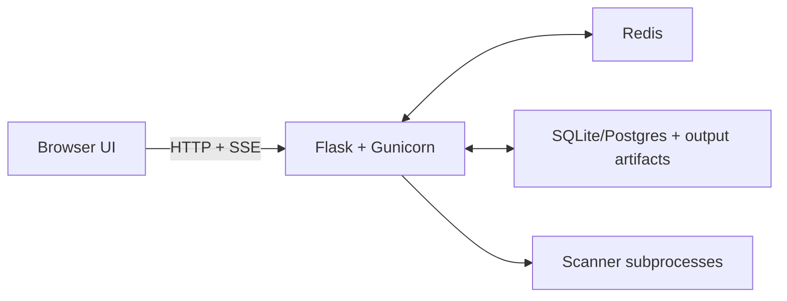

# darklab_shell

darklab_shell is a self-hosted web terminal for network diagnostics and security recon. It gives you a polished browser shell for tools like nmap, nuclei, httpx, katana, and amass without handing users a raw shell.

The backend runs on Flask/Gunicorn, Redis, and SQLite by default, with Postgres available for larger deployments. Commands go through allow and deny rules, loopback checks, path checks, and shell-metacharacter blocking before anything starts. Scanner commands run as an unprivileged `scanner` user and can only write to the app-managed places you allow.

The app ships with 30+ security tools, SecLists, live multi-tab output, a mobile shell, session Files, project workspaces, sharing/redaction, themes, and coverage across pytest, Vitest, Playwright, and container smoke tests. A live instance is available at [shell.darklab.sh](https://shell.darklab.sh/).

<div align="center">
<b>Desktop Demo</b><br>

<br>
<b>Mobile Demo</b><br>
 {width=360px}
</div>

---

## Table of Contents
- [Quick Start](#quick-start)
- [Optional Features](#optional-features)
- [Features](#features)
- [Architecture At A Glance](#architecture-at-a-glance)
- [Configuration](#configuration)
- [Installed Tools](#installed-tools)
- [Raw-Packet Scanning](#raw-packet-scanning)
- [Production Deployment](#production-deployment)
- [Running in a Development Environment](#running-in-a-development-environment)
- [Security & Process Isolation](#security--process-isolation)
- [License](#license)
- [Documentation Map](#documentation-map)
- [Repository Layout](#repository-layout)

---

## Quick Start

On a Linux AMD64 or ARM64 host with Docker, Docker Compose 2.20.0 or newer, `curl`, `tar`, `gzip`, and a SHA-256 tool, install the current release with:

```bash
# Change this if you want to install darklab_shell somewhere else.
DARKLAB_INSTALL_DIR="$HOME/darklab-shell"

curl -fsSL https://gitlab.com/api/v4/projects/darklab.sh%2Fdarklab_shell/packages/generic/darklab-shell-deploy/2.8.3/setup.sh | sh -s -- --dir "$DARKLAB_INSTALL_DIR"
cd "$DARKLAB_INSTALL_DIR"
docker compose pull
./verify-release-image.sh
docker compose up -d
docker compose ps
```

Open `http://<server-address>:8888`, using the host's IP address or DNS name. The production stack listens on every host interface by default so remote hosts can connect. darklab_shell doesn't provide a user authentication boundary, so restrict port 8888 to trusted networks with the host or upstream firewall. Set `HOST_BIND_ADDRESS=127.0.0.1` when a local reverse proxy should be the only direct client.

Want to inspect the installer, confirm its checksum, or verify the release's GitLab identity before running it? Follow [Review and Verify the Installer](#review-and-verify-the-installer) instead of streaming it. You don't need Git, a source checkout, Python, Node, or a local image build for either release-install path.

---

## Optional Features

Fresh installations keep a few capabilities disabled until you choose to enable them. Their high-level switches live near the top of `.env`; detailed limits and readiness requirements stay in [CONFIGURATION.md](CONFIGURATION.md).

| Capability | What it adds | Enable with |
| --- | --- | --- |
| [Persistent Files](CONFIGURATION.md#workspace-storage-recipes) | Personal and team inputs, outputs, and evidence that survive container restarts | `WORKSPACE_ENABLED=true`, `WORKSPACE_BACKEND=volume`, and `WORKSPACE_ROOT=/workspaces` |
| [Interactive PTY](CONFIGURATION.md#enable-interactive-pty) | Real terminal sessions for approved interactive tools | `INTERACTIVE_PTY_ENABLED=true` |
| [Raw-packet scanning](CONFIGURATION.md#raw-packet-scanning) | Capability-backed SYN and other approved raw scanner modes | `RAW_PACKET_SCANNING_ENABLED=true` |

After changing one of these settings, run `docker compose up -d --force-recreate shell`. Interactive PTY uses Redis in normal multi-worker deployments, while raw-packet modes still activate only when their runtime readiness checks pass. Postgres and AI assists are separate optional deployment services covered in [Configuration](CONFIGURATION.md#environment-variables-and-env).

---

## Features

| Feature | What it gives you |
| --- | --- |
| [Browser shell](FEATURES.md#output-streaming-and-display) | Live, searchable output across desktop and mobile tabs. |
| [History and sharing](FEATURES.md#tabs--run-history) | Saved runs, comparisons, exports, permalinks, and redaction. |
| [Projects](FEATURES.md#project-workspaces) | Case workspaces that connect targets, assessment coverage, evidence, findings, monitoring, and handoff packages. |
| [Atlas and Quick Lookup](FEATURES.md#session-entity-atlas) | Browse captured entities and open everything saved for one hostname, IP address, or URL without paging through results. |
| [Workflows and automation](FEATURES.md#guided-workflows) | Guided playbooks, schedules, watchers, and outbound notifications. |
| [Intel lookups](FEATURES.md#external-intel) | Normalized IP, domain, URL, hash, and CVE context, including dated offline EPSS and CISA KEV signals. |
| [Files, variables, and secrets](FEATURES.md#session-files) | A searchable personal or team file browser, terminal capture/copy helpers, reusable values, and encrypted tool credentials. |
| [Teams](FEATURES.md#team-mode) | Shared runs, projects, files, automation, and secrets with role controls. |
| [Interactive tools](FEATURES.md#interactive-pty-mode) | Guarded PTY sessions for approved tools that need a real terminal. |
| [AI assists](FEATURES.md#ai-assists) | Optional summaries and next-command drafts with privacy controls. |
| [Themes and onboarding](FEATURES.md#theme-selector) | Customizable appearance, welcome guidance, shortcuts, and a guided tour. |

See [FEATURES.md](FEATURES.md) for the full feature reference.

### Find saved entity evidence quickly

Open **Quick Lookup** beside Atlas on the desktop rail or mobile menu, or press `Alt+Q` / `Option+Q`. Enter one hostname, IP address, or absolute `http://` or `https://` URL and darklab_shell opens the matching saved Atlas profile in your current personal or team scope. **Auto** detects the input type, while the other choices let you require a hostname, IP address, or URL.

Quick Lookup reads evidence and Intel snapshots the app has already saved. It doesn't run a command, create an Atlas record, or contact an Intel provider. If there isn't an exact record, the result explains what was missing and can take you to normal Atlas search; an unmatched URL can also offer its known parent host. Use **Refresh intel** from a saved profile only when you want a live provider refresh.

Saved CVEs also use release-pinned FIRST EPSS and CISA KEV data to explain which findings deserve attention first. Every saved finding has a stable observation reference that keeps its evidence method distinct. Assessors can create and edit their own findings from Project Findings, start one from an Assessment check or Project-scoped Atlas profile, or select saved output lines in Run Details and turn them into a finding or supporting evidence. Likely duplicates require a second confirmation, and later title or severity edits keep the original observation and remediation references. API clients can use the same saved-finding model. Project findings can retain typed references to supporting runs, transcript lines, output, workspace artifacts, screenshots, Atlas entities, targets, assessment checks, and retest runs; evidence packages keep those references with the finding, and removed sources are labeled unavailable instead of silently disappearing. In a Project, the triage view explains whether a completed retest run matches the original tool, target, and frozen assessment check before the assessor attaches it or compares it with the original. When a finding points back to a saved assessment action, **Run verification** previews the exact bounded command, target, policy, scope, and credential use before it starts; the completed run stays linked to the Project and is retained as retest evidence. Compatible evidence can suggest **Needs retest** when the same issue appears again, or **Verified** when a successful check explicitly supports a clean result. The suggestion explains its basis and can fill the status field, but final verification stays a human decision and records when it was saved plus safe team-member context when available. When a cycle is completed, **Finding changes** compares matching checks with the newest compatible earlier cycle and separates new, persistent, no-longer-observed, regressed, and incomparable remediation groups, with links to both evidence sets. The same compact totals appear in Overview and Findings, and selected evidence packages and reports preserve the matching current and earlier references plus the reason a result couldn't be compared. Several observations of the same CVE or scanner rule on the same exact affected subject share one remediation identity, so fix-first views and cycle comparisons count the issue once without discarding its separate evidence or verification work. When two differently identified findings still represent one fix, an assessor can search for the other finding, preview every affected observation, and explicitly merge their remediation groups from the shared triage editor. Operators can add stored NVD advisory status, CVSS, and CWE context from a local dataset or an explicit Atlas CVE Intel refresh; simply viewing a finding never contacts NVD. Later NVD disputes, rejection, withdrawal, reinstatement, and material CVSS downgrades appear in Project Monitoring without rewriting the original finding. The `providers` command shows the source mode, version, and age. Live bulk-feed and NVD advisory storage are off by default, so a fresh or disconnected install still has a dated EPSS/KEV baseline without making an outbound request.

---

## Architecture At A Glance


```mermaid
flowchart LR
  Browser["Browser UI"]
  Flask["Flask + Gunicorn"]
  Redis["Redis"]
  Storage["SQLite/Postgres + output artifacts"]
  Runner["Scanner subprocesses"]

  Browser -->|HTTP + SSE| Flask
  Flask <--> Redis
  Flask <--> Storage
  Flask --> Runner
```

At a high level:

- the browser renders the shell UI and reads SSE output streams
- Flask/Gunicorn handles routes, validation, built-in commands, and run setup
- Redis coordinates shared worker state such as rate limits, run replay, and kill tracking. A baseline dynamic-route throttle also rejects noisy HTTP scans before they can crowd out normal command start or kill requests.
- SQLite or Postgres plus output files store history and share data
- real commands run in subprocesses, not inside the web worker

For system design, contributor workflow, and detailed test references, use the specialized docs in the [Documentation Map](#documentation-map).

---

## Configuration

Released images keep shipped defaults under `/app/conf`; production installations keep private operator overrides under `./conf`, and source-mounted development uses `*.local.*` files beside the shipped catalogs. SQLite is the default database, with Postgres available for larger deployments.

Use [CONFIGURATION.md](CONFIGURATION.md) for settings, precedence, supported runtimes, deployment choices, Files storage, raw scanning, database selection, and production tuning. Back up the current data before a database migration, then follow [Postgres Migration](docs/postgres-migration.md) for SQLite-to-Postgres moves or Postgres major-version upgrades. Theme authors can use [THEME.md](THEME.md).

---

## Installed Tools

The Docker image includes these user-facing external commands. The table mirrors the base command registry; app-native built-ins and pipe helpers are documented in [FEATURES.md](FEATURES.md#built-in-pipe-support). Run `commands info <tool>` in the shell for examples, supported flags, and app-specific guidance.

SecLists is installed at `/usr/share/wordlists/seclists/`. The app-native `wordlist` command lists curated categories, searches installed entries, and prints copy-friendly paths; autocomplete only suggests installed wordlists in command slots explicitly marked with `value_type: wordlist`.

| Tool | Purpose |
|------|---------|
| `ping` | ICMP reachability |
| `curl` / `wget` | HTTP/HTTPS requests and downloads |
| `httping` | HTTP/HTTPS reachability and request timing |
| `dig` / `nslookup` / `host` | DNS lookups |
| `whois` | Domain & IP registration info |
| `traceroute` / `tcptraceroute` | Route tracing (ICMP and TCP) |
| `nc` / `telnet` | TCP connection testing, simple banner checks, and interactive socket troubleshooting |
| `mtr` | Combined ping and traceroute |
| `nmap` | Port scanning and service detection |
| `openssl` | TLS client diagnostics and cipher inspection |
| `testssl` | TLS protocol, cipher, certificate, and vulnerability checks |
| `dnsrecon` | DNS enumeration and zone transfer testing |
| `nikto` | Web server vulnerability scanning |
| `wpscan` | WordPress vulnerability scanning |
| `nuclei` | Template-based exposure, misconfiguration, and vulnerability checks |
| `subfinder` | Passive subdomain enumeration (ProjectDiscovery) |
| `amass` | OWASP subdomain enumeration and attack-surface asset discovery |
| `httpx` | HTTP/HTTPS probing — status codes, titles, tech detection (ProjectDiscovery) |
| `dnsx` | Fast DNS resolution and record querying (ProjectDiscovery) |
| `tlsx` | TLS certificate, protocol, cipher, and DNS metadata collection (ProjectDiscovery) |
| `cdncheck` | CDN, cloud, and WAF provider classification for hosts and IPs (ProjectDiscovery) |
| `gobuster` | Directory, file, DNS, and vhost discovery |
| `fping` | Fast parallel ICMP reachability checks |
| `tcping` | TCP reachability and latency checks for service ports when ICMP is blocked |
| `masscan` | High-speed raw-packet TCP scanning |
| `assetfinder` | Fast passive domain and subdomain discovery using public sources |
| `fierce` | DNS reconnaissance and subdomain brute-forcing |
| `dnsenum` | DNS enumeration — zone transfers, subdomains, reverse lookups, Google scraping |
| `ffuf` | Fast directory, file, and vhost fuzzing |
| `trufflehog` | Secret scanning for Files, HTTPS Git repositories, GitHub, and GitLab |
| `puredns` | DNS brute forcing with resolver and wildcard output |
| `naabu` | Fast port discovery across hosts and target lists (ProjectDiscovery) |
| `katana` | JavaScript-aware web crawler for attack surface mapping (ProjectDiscovery) |
| `wafw00f` | WAF detection — identifies web application firewalls from HTTP fingerprints |
| `sslscan` | TLS/SSL cipher and certificate scanner — reports supported ciphers, protocol versions, and cert details |
| `sslyze` | Fast TLS configuration analysis and common SSL/TLS weakness checks |
| `rustscan` | High-speed port discovery; optionally pipes results into nmap for service detection |
| `shodan` | Shodan host, domain, and search tools |
| `vt` | VirusTotal reputation lookups |
| `greynoise` | GreyNoise IP classification and context |
| `ipinfo` | IP geolocation, ASN, and ownership context |
| `urlscan-cli` | urlscan.io submission, lookup, and search |
| `chaos` | ProjectDiscovery subdomain lookups |

For command discovery, app-visible tool adaptations, raw versus fallback modes, Files and Secrets use, intel-provider setup, and tool-specific notes, see [Bundled Tools](docs/tools.md).

---

## Raw-Packet Scanning

Supported Linux Docker deployments can opt into packet-socket modes for Nmap, Naabu, and Masscan without running the container as root or in privileged mode. Nmap and Naabu keep connect-mode fallbacks; Masscan requires raw readiness. Spoofing and link-layer bypass flags stay blocked.

Raw scanning is off by default and may not work under rootless runtimes or restricted CIDR policies. Enable it only after reviewing the platform, firewall, and readiness checks in [CONFIGURATION.md](CONFIGURATION.md#raw-packet-scanning); `/diag` shows whether each scanner is configured, available, and active. [Bundled Tools](docs/tools.md#choose-the-right-run-mode) explains the user-visible fallbacks.

---

## Production Deployment

The release installer creates an operator-owned directory with pinned Compose and image settings, private local overrides, lifecycle helpers, the project license, third-party notices, and release-verification material. Production runs the released image without mounting the repository or host source into `/app`. See the canonical [Supported Runtimes](CONFIGURATION.md#supported-runtimes) table before installing on a new platform.

### Review and Verify the Installer

If you prefer to inspect the exact release installer before it runs, download it and its checksum into a temporary review directory:

```bash
mkdir darklab-shell-download
cd darklab-shell-download
curl -fSLO https://gitlab.com/api/v4/projects/darklab.sh%2Fdarklab_shell/packages/generic/darklab-shell-deploy/2.8.3/setup.sh
curl -fSLO https://gitlab.com/api/v4/projects/darklab.sh%2Fdarklab_shell/packages/generic/darklab-shell-deploy/2.8.3/setup.sh.sha256
sha256sum -c setup.sh.sha256
less setup.sh
```

The checksum catches download corruption. To confirm that the checksum manifest came from this project's protected GitLab tag pipeline, install [Cosign](https://docs.sigstore.dev/cosign/system_config/installation/), download the signed manifest, and verify the exact release identity:

```bash
curl -fSLO https://gitlab.com/api/v4/projects/darklab.sh%2Fdarklab_shell/packages/generic/darklab-shell-deploy/2.8.3/SHA256SUMS
curl -fSLO https://gitlab.com/api/v4/projects/darklab.sh%2Fdarklab_shell/packages/generic/darklab-shell-deploy/2.8.3/SHA256SUMS.sigstore.json
cosign verify-blob SHA256SUMS \
  --bundle SHA256SUMS.sigstore.json \
  --certificate-identity "https://gitlab.com/darklab.sh/darklab_shell//.gitlab-ci.yml@refs/tags/v2.8.3" \
  --certificate-oidc-issuer "https://gitlab.com"
grep '  setup.sh$' SHA256SUMS | sha256sum -c -
```

After reviewing and verifying the installer, create and start the deployment:

```bash
# Change this if you want to install darklab_shell somewhere else.
DARKLAB_INSTALL_DIR="$HOME/darklab-shell"

sh setup.sh --dir "$DARKLAB_INSTALL_DIR"
cd "$DARKLAB_INSTALL_DIR"
docker compose pull
./verify-release-image.sh
docker compose up -d
docker compose ps
```

The canonical image is published in the [GitLab Container Registry](https://gitlab.com/darklab.sh/darklab_shell/container_registry), then the same OCI image index is copied to [`docker.io/darklabsh/darklab-shell`](https://hub.docker.com/r/darklabsh/darklab-shell) for the Compose pull path. Docker automatically selects the native Linux AMD64 or ARM64 child image from that one release tag. The protected tag pipeline keylessly signs both index references, every published child digest, and `SHA256SUMS` with its GitLab OIDC identity. The Docker Hub overview publishes the stable issuer and certificate-identity pattern independently of the GitLab release assets, and the public release check requires that trust information to be present. The release also publishes per-platform CycloneDX SBOMs and Grype reports, SLSA provenance, a build-input inventory, and a small evidence index tying them to the tag, commit, pipeline, shared index digest, child digests, and one resolved Python base index. The release gate fails on Critical findings that have an available fix; all reported matches remain in the downloadable reports.

The installed `release-manifest.json` records both registry index references, their matching digest, and each platform's child digest, base digest, and measured image sizes. After the pull, `verify-release-image.sh` checks the host architecture, requires the registry index digests to agree, confirms `.env` still selects the reviewed image, and verifies the architecture and base labels Docker selected for this host before startup. It uses the standard Docker CLI and doesn't require the Buildx plugin. CI keeps cold-pull timing as separate run metadata so retrying a release can't change an already published payload. `LICENSE` contains darklab_shell's GNU AGPLv3 terms; `THIRD_PARTY_NOTICES.txt` and `container-licenses.json` list the bundled tools' separate terms, including WPScan's commercial-use note and Nmap's NPSL 0.95 terms. The built-in FAQ identifies the Nmap Security Scanner and links to the Nmap project.

### Storage and Lifecycle

`/data` is durable and contains the default SQLite database, saved output artifacts, and the app-owned vault key. Files workspaces use temporary storage by default and are wiped when the shell container restarts; configure the volume backend before relying on Files for durable evidence. Redis stores coordination and cache state, so a restart can interrupt active work but does not replace the durable database.

Use `./darklab-deploy status`, `backup`, `restore`, `migrate-to-postgres`, `upgrade`, and `remove` for production lifecycle work. When the installation includes `compose.operator.yaml`, Compose-backed lifecycle steps automatically use it alongside the release-owned `compose.yaml`. A fresh replacement install can use `restore --adopt-backend` to recover a managed Postgres backup with the new host's generated database credentials. Back up before upgrades or database changes, keep the vault key with the data it protects, and verify signed release material before an offline install or upgrade. [CONFIGURATION.md](CONFIGURATION.md) contains the deployment, storage, Postgres, backup, host-tuning, and optional-service details.

---

## Running in a Development Environment

Use a repository checkout when you're changing darklab_shell or want a faster edit-and-restart loop. These paths are for development rather than normal self-hosted installation.

### Source-Mounted Docker Stack

Clone the repository and start the development Compose stack:

```bash
git clone https://gitlab.com/darklab.sh/darklab_shell.git
cd darklab_shell
docker compose -f compose.dev.yaml up --build
```

This uses the same Dockerfile and entrypoint as the released image. Compose mounts `./app` at a separate read-only source path, and each container start stages a fresh, read-only runtime copy at `/app`. That keeps the edit-and-restart loop while making host files readable even when a native Linux checkout preserves private modes such as `0600`. The development stack binds to `127.0.0.1` by default, uses development labels, and deliberately omits production restart policy and fixed container names.

### Local Python Environment

This is useful when you want a lighter local loop and don't need the container runtime. It requires Python 3.14+, `pip3`, and Linux or macOS. Redis 6.2 or newer is optional for single-worker development and required when `WEB_CONCURRENCY` is greater than `1`.

The helper checks the local requirements, installs the Python dependencies, and starts the app from `app/`:

```bash
bash examples/run_local.sh
```

To run those steps manually:

```bash
python3 -m pip install -r app/requirements.txt
cd app
python3 app.py
```

Then open [http://localhost:8888](http://localhost:8888).

The local Python path doesn't provide the container filesystem restrictions, separate `scanner` user, Docker networking/capability model, or Redis sidecar. It's useful for frontend and backend iteration, but it isn't a production-like environment.

---

## Security & Process Isolation

darklab_shell uses layered controls instead of trusting the browser alone:

- Gunicorn runs as unprivileged `appuser`; external commands run as separate unprivileged `scanner` processes.
- The allow and deny policy blocks shell chaining, unsafe paths, loopback targets, and unsupported command forms before launch.
- The read-only container gives the app a private durable `/data` mount and tools a temporary `/tmp`; scanner commands cannot read app-owned data.
- Optional CIDR restrictions combine command validation with scanner-user egress rules so DNS and tool-managed inputs stay inside the same boundary.
- Files exposes only validated paths under the active personal or team workspace. Temporary Files storage is wiped on restart; persistent workspaces need the configured volume backend and correct host ownership.

Use [ARCHITECTURE.md](ARCHITECTURE.md#security-model) for trust boundaries, subprocess isolation, signalling, and runtime contracts. Use [CONFIGURATION.md](CONFIGURATION.md) for CIDR policy, Files permissions, diagnostics allowlists, secrets, proxy trust, and production settings.

---

## License

Copyright (C) 2026 darklab_shell contributors. Original source and documentation are licensed under [GNU AGPL v3](LICENSE), using the SPDX expression `AGPL-3.0-only`. The full license text controls.

If you modify darklab_shell and let users interact with it over a network, AGPL Section 13 requires a prominent, no-charge way for those users to receive that version of the complete Corresponding Source. Operators of modified deployments are responsible for pointing the in-app source link at their version and meeting those terms.

Bundled scanners, libraries, fonts, and wordlists keep their own licenses. Released images and installer payloads include `THIRD_PARTY_NOTICES.txt` and `container-licenses.json` so those terms remain separate from the project license.

---

## Documentation Map

- [Default.md](.gitlab/merge_request_templates/Default.md) - Default GitLab merge request template used by contributors
- [ARCHITECTURE.md](ARCHITECTURE.md) - Runtime layers, request flow, persistence, security mechanics, and application internals
- [CHANGELOG.md](CHANGELOG.md) - Release-by-release change log organised by version
- [CONFIGURATION.md](CONFIGURATION.md) - Operator reference for production `.env` and `conf/` settings, development overrides, Compose customization, storage, and host tuning
- [CONTRIBUTING.md](CONTRIBUTING.md) - Local setup, test workflow, linting, branch workflow, and merge request guidance
- [CONTRIBUTORS.md](CONTRIBUTORS.md) - Contributor and acknowledgement notes
- [DECISIONS.md](DECISIONS.md) - Architectural rationale, tradeoffs, and implementation-history notes
- [DOC_STANDARDS.md](DOC_STANDARDS.md) - Documentation structure, preferred templates, and review rules for ongoing doc updates
- [FEATURES.md](FEATURES.md) - Full per-feature reference: autocomplete, pipe support, keyboard shortcuts, allowlist, welcome animation, history, permalinks, themes, and more
- [THEME.md](THEME.md) - Theme registry, selector metadata, and override behavior
- [TODO.md](TODO.md) - Backlog items, research notes, and known issues
- [ARCHITECTURE.md → Atlas Export Schema](ARCHITECTURE.md#export-schema) - Session Entity Atlas CSV/JSONL export schema and filters
- [app/resources/cve_risk/NOTICE.md](app/resources/cve_risk/NOTICE.md) - Attribution and interpretation notes for the bundled EPSS and CISA KEV data
- [docs/ai-privacy.md](docs/ai-privacy.md) - AI assist privacy posture, provider boundaries, redaction, storage, and logging
- [docs/api.md](docs/api.md) - Headless API and bundled CLI usage guide
- [docs/changelog/1.x.md](docs/changelog/1.x.md) - Published 1.x release history
- [docs/changelog/2.x.md](docs/changelog/2.x.md) - Published 2.0 through 2.7.0 release history
- [docs/external-command-integrations.md](docs/external-command-integrations.md) - Contributor contracts for command registry metadata, rewrites, environment, Files, and validation
- [docs/logging.md](docs/logging.md) - Log levels, formats, event names, fields, redaction rules, and troubleshooting
- [docs/notifications.md](docs/notifications.md) - Outbound notification channels, payloads, retries, and setup guide
- [docs/postgres-migration.md](docs/postgres-migration.md) - Offline SQLite-to-Postgres cutover and Postgres major-version export/import workflow
- [docs/schedules.md](docs/schedules.md) - Scheduled-command cadence, timezone, worker, and audit behavior
- [docs/storage-scaling.md](docs/storage-scaling.md) - SQLite growth baseline, storage pressure points, and Postgres sizing guidance
- [docs/tools.md](docs/tools.md) - Bundled tool discovery, run modes, Files, Secrets, provider setup, and app-visible adaptations
- [docs/watchers.md](docs/watchers.md) - Change-detection watcher baseline, diff, scheduler, and notification behavior
- [docs/workflows.md](docs/workflows.md) - Workflow playbook parameters, transitions, captures, execution state, and operator YAML
- [tests/README.md](tests/README.md) - Testing handbook, live suite inventory commands, smoke-test coverage, and focused runs
- [tests/ui-capture-scenes.md](tests/ui-capture-scenes.md) - UI screenshot capture scene inventory

---

## Repository Layout

| Directory | Purpose |
| --- | --- |
| `.gitlab/` | GitLab CI and merge request templates |
| `.tooling/` | Test, lint, and build-tool configuration |
| `app/` | Flask application, templates, static assets, and runtime configuration |
| `deploy/` | Production Compose, setup, and release artifacts |
| `docs/` | Focused user, operator, and contributor guides |
| `scripts/` | Stable contributor commands with internal helpers grouped by purpose |
| `tests/` | Backend, browser-unit, end-to-end, and visual-review coverage |
